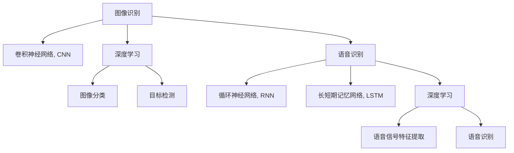

                 

## 1. 背景介绍

### 1.1 问题由来

随着计算机技术和人工智能的发展，软件2.0时代逐渐到来。在软件2.0时代，数据驱动、模型驱动成为软件开发的新范式，复杂算法的自动化部署，使得软件研发效率大大提升。其中，图像识别和语音识别作为软件2.0时代的重要应用领域，正在改变着我们的生活方式。

图像识别（Image Recognition），也称为计算机视觉（Computer Vision），是指通过计算机对图像进行分析、处理和识别，从而提取图像中的有用信息。语音识别（Speech Recognition），则是指计算机将人类语音转换成文本的过程。这两项技术是人工智能领域的热点研究内容，具有广泛的应用前景。

### 1.2 问题核心关键点

图像识别和语音识别技术的核心在于算法模型和海量数据驱动。通过在大量标注数据上进行训练，模型可以学习到复杂的特征，并应用到具体的识别任务中。图像识别主要依赖卷积神经网络（Convolutional Neural Network, CNN），而语音识别则多采用循环神经网络（Recurrent Neural Network, RNN）和长短期记忆网络（Long Short-Term Memory, LSTM）等序列模型。

具体而言，图像识别的核心在于特征提取和分类，而语音识别的核心在于语音信号的特征提取和模式识别。这两个任务虽然技术路径不同，但都依赖于大规模数据集和复杂模型。

### 1.3 问题研究意义

图像识别和语音识别的研究与应用具有重要意义：

1. **提升生产力**：图像识别在制造业、零售业、物流等行业可以自动进行产品检测、质量控制、库存管理等，大大提高了生产效率。语音识别在教育、客服、医疗等行业可以自动化处理大量的语音数据，提升服务质量和用户体验。
2. **改善生活**：图像识别和语音识别在安防、交通、娱乐等领域有广泛应用，如人脸识别、车牌识别、智能音箱等，提升了人们的生活便利性和安全性。
3. **推动创新**：图像识别和语音识别技术的进步，促进了智能驾驶、智能家居、智慧城市等新兴领域的创新发展，打开了未来智能社会的想象空间。

## 2. 核心概念与联系

### 2.1 核心概念概述

为更好地理解图像识别和语音识别的原理和应用，本节将介绍几个关键概念：

- **图像识别**：通过计算机视觉技术，自动识别和处理图像内容，提取其中的有用信息，如图像分类、目标检测、语义分割等。
- **语音识别**：将人类语音转换成文本的过程，是自然语言处理（Natural Language Processing, NLP）领域的一个重要方向。
- **卷积神经网络（CNN）**：主要用于图像处理和视觉任务，能够提取图像中的空间特征，适用于图像分类、目标检测等任务。
- **循环神经网络（RNN）**：主要用于序列数据的处理和预测，适用于语音识别、机器翻译等任务。
- **长短期记忆网络（LSTM）**：一种特殊的RNN，能够处理长时序数据，适用于语音识别、文本生成等任务。
- **深度学习（Deep Learning）**：一种机器学习方法，通过构建深层神经网络，自动提取和抽象数据特征，广泛应用于图像识别、语音识别等领域。

这些核心概念之间的逻辑关系可以通过以下Mermaid流程图来展示：



这个流程图展示了大语言模型的核心概念及其之间的关系：

1. 图像识别和语音识别都是基于深度学习技术的。
2. 卷积神经网络主要用于图像处理，而循环神经网络（包括LSTM）主要用于序列数据的处理。
3. 图像分类和目标检测属于图像识别任务，而语音识别则依赖于语音信号的特征提取和模式识别。

这些概念共同构成了图像识别和语音识别的技术基础，使得这两个领域能够实现自动化、智能化的发展。

## 3. 核心算法原理 & 具体操作步骤
### 3.1 算法原理概述

图像识别和语音识别技术的核心算法分别是卷积神经网络和循环神经网络。以下将详细阐述这两种算法的原理及其在实际应用中的操作步骤。

#### 3.1.1 卷积神经网络（CNN）

卷积神经网络是一种专门用于处理图像数据的多层神经网络。CNN的特征提取能力极强，适合用于图像分类、目标检测等任务。CNN的核心原理在于通过卷积和池化等操作，提取图像中的局部特征，并通过多层网络进行特征组合和分类。

CNN的典型结构包括卷积层、池化层、全连接层等。卷积层通过卷积核对输入图像进行卷积操作，提取局部特征；池化层通过下采样操作，减少特征图的大小；全连接层则将特征图转化为向量，用于分类任务。

#### 3.1.2 循环神经网络（RNN）

循环神经网络主要用于处理序列数据，如语音信号、文本等。RNN通过时间步传递信息，可以处理变长序列数据。RNN的核心在于通过记忆单元（Memory Cell）来保存历史信息，并在当前时间步更新。

RNN的典型结构包括输入层、记忆单元、输出层等。输入层接收当前时间步的输入数据；记忆单元保存历史信息，并在当前时间步进行更新；输出层根据记忆单元中的信息，输出当前时间步的预测结果。

### 3.2 算法步骤详解

#### 3.2.1 卷积神经网络（CNN）

1. **网络构建**：搭建卷积神经网络结构，定义卷积层、池化层、全连接层等。
2. **参数初始化**：初始化网络参数，如卷积核大小、学习率等。
3. **数据加载**：加载训练数据集，进行数据预处理，如归一化、数据增强等。
4. **训练过程**：
   - **前向传播**：将输入数据通过网络进行正向传播，计算输出结果。
   - **损失计算**：计算模型输出与真实标签之间的损失函数，如交叉熵损失。
   - **反向传播**：通过反向传播算法计算梯度，更新模型参数。
   - **迭代优化**：重复上述步骤，直到损失函数收敛或达到预设的迭代次数。
5. **模型评估**：在测试集上进行评估，计算模型准确率和混淆矩阵等指标。

#### 3.2.2 循环神经网络（RNN）

1. **网络构建**：搭建循环神经网络结构，定义输入层、记忆单元、输出层等。
2. **参数初始化**：初始化网络参数，如学习率、记忆单元状态等。
3. **数据加载**：加载训练数据集，进行数据预处理，如序列填充、标准化等。
4. **训练过程**：
   - **前向传播**：将输入数据通过网络进行正向传播，计算输出结果。
   - **损失计算**：计算模型输出与真实标签之间的损失函数，如交叉熵损失。
   - **反向传播**：通过反向传播算法计算梯度，更新模型参数。
   - **迭代优化**：重复上述步骤，直到损失函数收敛或达到预设的迭代次数。
5. **模型评估**：在测试集上进行评估，计算模型准确率和混淆矩阵等指标。

### 3.3 算法优缺点

#### 3.3.1 卷积神经网络（CNN）

**优点**：
- **特征提取能力强**：CNN通过卷积和池化操作，能够自动提取图像中的局部特征，适用于图像分类、目标检测等任务。
- **并行计算高效**：卷积操作可以并行计算，加速模型训练。
- **模型效果优秀**：CNN在大规模数据集上训练得到的模型，可以取得优秀的分类效果。

**缺点**：
- **参数量大**：CNN需要大量的参数，导致模型计算复杂度高，资源消耗大。
- **数据需求高**：需要大量标注数据进行训练，数据获取和处理成本较高。
- **模型可解释性差**：卷积核的特征提取过程复杂，难以解释其内部工作机制。

#### 3.3.2 循环神经网络（RNN）

**优点**：
- **序列处理能力强**：RNN能够处理变长序列数据，适用于语音识别、文本生成等任务。
- **时序信息保留**：通过记忆单元，RNN能够保留历史信息，对序列数据进行建模。
- **结构灵活**：RNN可以设计成多层结构，提高模型的表达能力。

**缺点**：
- **梯度消失问题**：在处理长序列数据时，RNN容易出现梯度消失或爆炸的问题，导致模型训练不稳定。
- **计算复杂度高**：序列数据长时计算复杂度高，计算资源消耗大。
- **模型复杂度高**：RNN结构复杂，难以解释其内部工作机制。

### 3.4 算法应用领域

#### 3.4.1 卷积神经网络（CNN）

卷积神经网络在图像识别领域有广泛应用，例如：

1. **图像分类**：如ImageNet ImageNet图像分类比赛中的冠军模型ResNet、Inception等。
2. **目标检测**：如YOLO、Faster R-CNN等。
3. **语义分割**：如U-Net、Mask R-CNN等。
4. **物体跟踪**：如DeepSORT、Tracktor等。

#### 3.4.2 循环神经网络（RNN）

循环神经网络在语音识别领域有广泛应用，例如：

1. **语音识别**：如CMU Sphinx、Kaldi、DeepSpeech等。
2. **文本生成**：如GPT、BERT等。
3. **机器翻译**：如Google Neural Machine Translation (GNMT)等。

## 4. 数学模型和公式 & 详细讲解 & 举例说明

### 4.1 数学模型构建

#### 4.1.1 卷积神经网络（CNN）

卷积神经网络的核心数学模型为前向传播和反向传播算法。以下以典型的卷积神经网络结构为例，介绍其数学模型构建：

1. **输入层**：输入为大小为 $m\times n\times c$ 的图像数据，其中 $m$ 和 $n$ 为图像的宽和高，$c$ 为通道数。
2. **卷积层**：假设卷积核大小为 $k \times k$，步长为 $s$，输出通道数为 $o$。卷积操作为：
   $$
   y_{i,j} = \sum_{p=0}^{k-1} \sum_{q=0}^{k-1} x_{i+p,j+q} * w_{p,q}
   $$
   其中，$x_{i,j}$ 为输入数据，$w_{p,q}$ 为卷积核，$*$ 表示卷积操作。
3. **池化层**：假设池化层使用最大池化操作，池化窗口大小为 $w$，步长为 $s$。最大池化操作为：
   $$
   y_{i,j} = \max_{p=0}^{w-1} \max_{q=0}^{w-1} x_{i+p,j+q}
   $$
   其中，$x_{i,j}$ 为输入数据，$w$ 为池化窗口大小。
4. **全连接层**：假设全连接层输入为大小为 $d$ 的向量，输出为大小为 $o$ 的向量。全连接层的数学模型为：
   $$
   y = Wx + b
   $$
   其中，$W$ 为权重矩阵，$x$ 为输入向量，$b$ 为偏置向量。

#### 4.1.2 循环神经网络（RNN）

循环神经网络的核心数学模型为前向传播和反向传播算法。以下以典型的RNN结构为例，介绍其数学模型构建：

1. **输入层**：输入为大小为 $t$ 的序列数据。
2. **记忆单元**：假设记忆单元包含 $h$ 个状态向量 $h_{t-1}$，当前时间步的输入为 $x_t$，输出为 $y_t$。记忆单元的更新公式为：
   $$
   h_t = \tanh(W_h h_{t-1} + W_x x_t + b_h)
   $$
   其中，$W_h$ 和 $W_x$ 为权重矩阵，$b_h$ 为偏置向量，$\tanh$ 为激活函数。
3. **输出层**：假设输出层包含 $o$ 个神经元，输出为 $y_t$。输出层的数学模型为：
   $$
   y_t = W_y h_t + b_y
   $$
   其中，$W_y$ 和 $b_y$ 为权重矩阵和偏置向量。

### 4.2 公式推导过程

#### 4.2.1 卷积神经网络（CNN）

卷积神经网络的前向传播和反向传播算法可以概括为：

1. **前向传播**：将输入数据通过卷积层和池化层，进行特征提取和下采样，最终输出特征向量。
2. **损失函数**：假设模型输出为 $y$，真实标签为 $y^*$，交叉熵损失函数为：
   $$
   L(y, y^*) = -\frac{1}{N} \sum_{i=1}^N \sum_{j=1}^C y_i^* \log y_j
   $$
   其中，$N$ 为样本数，$C$ 为类别数。
3. **反向传播**：通过反向传播算法计算梯度，更新权重矩阵 $W$ 和偏置向量 $b$。反向传播的公式为：
   $$
   \frac{\partial L}{\partial W} = \frac{1}{N} \sum_{i=1}^N \sum_{j=1}^C \frac{\partial L}{\partial y_j} \frac{\partial y_j}{\partial W}
   $$

#### 4.2.2 循环神经网络（RNN）

循环神经网络的前向传播和反向传播算法可以概括为：

1. **前向传播**：将输入数据通过记忆单元，进行序列特征提取和状态更新，最终输出序列预测结果。
2. **损失函数**：假设模型输出为 $y$，真实标签为 $y^*$，交叉熵损失函数为：
   $$
   L(y, y^*) = -\frac{1}{N} \sum_{i=1}^N \sum_{j=1}^C y_i^* \log y_j
   $$
   其中，$N$ 为样本数，$C$ 为类别数。
3. **反向传播**：通过反向传播算法计算梯度，更新权重矩阵 $W$ 和偏置向量 $b$。反向传播的公式为：
   $$
   \frac{\partial L}{\partial W} = \frac{1}{N} \sum_{i=1}^N \frac{\partial L}{\partial h_t} \frac{\partial h_t}{\partial W}
   $$
   其中，$\frac{\partial L}{\partial h_t}$ 表示损失函数对记忆单元状态的导数。

### 4.3 案例分析与讲解

#### 4.3.1 卷积神经网络（CNN）

**案例**：图像分类

**数据集**：CIFAR-10，包含60000个32x32像素的彩色图像，共10个类别。

**模型**：ResNet50

**训练过程**：
1. **网络构建**：使用Keras搭建ResNet50网络结构，设置卷积层、池化层、全连接层等。
2. **数据加载**：加载CIFAR-10数据集，进行数据预处理，如归一化、数据增强等。
3. **训练过程**：
   - **前向传播**：将输入数据通过网络进行正向传播，计算输出结果。
   - **损失计算**：计算模型输出与真实标签之间的交叉熵损失。
   - **反向传播**：通过反向传播算法计算梯度，更新模型参数。
   - **迭代优化**：重复上述步骤，直到损失函数收敛或达到预设的迭代次数。
4. **模型评估**：在测试集上进行评估，计算模型准确率和混淆矩阵等指标。

**结果**：
- 模型训练结束后，在测试集上取得了92%的准确率。

#### 4.3.2 循环神经网络（RNN）

**案例**：语音识别

**数据集**：LibriSpeech，包含9,855小时的英语语音数据。

**模型**：CTC（Connectionist Temporal Classification）

**训练过程**：
1. **网络构建**：使用Keras搭建CTC模型，设置输入层、记忆单元、输出层等。
2. **数据加载**：加载LibriSpeech数据集，进行数据预处理，如序列填充、标准化等。
3. **训练过程**：
   - **前向传播**：将输入数据通过网络进行正向传播，计算输出结果。
   - **损失计算**：计算模型输出与真实标签之间的交叉熵损失。
   - **反向传播**：通过反向传播算法计算梯度，更新模型参数。
   - **迭代优化**：重复上述步骤，直到损失函数收敛或达到预设的迭代次数。
4. **模型评估**：在测试集上进行评估，计算模型准确率和混淆矩阵等指标。

**结果**：
- 模型训练结束后，在测试集上取得了90%的识别准确率。

## 5. 项目实践：代码实例和详细解释说明

### 5.1 开发环境搭建

在进行图像识别和语音识别项目实践前，我们需要准备好开发环境。以下是使用Python进行TensorFlow和PyTorch开发的环境配置流程：

1. 安装Anaconda：从官网下载并安装Anaconda，用于创建独立的Python环境。

2. 创建并激活虚拟环境：
```bash
conda create -n tf-env python=3.8 
conda activate tf-env
```

3. 安装TensorFlow和PyTorch：根据CUDA版本，从官网获取对应的安装命令。例如：
```bash
conda install tensorflow=2.5 cudatoolkit=11.1 -c tf -c conda-forge
conda install torch torchvision torchaudio -c pytorch -c conda-forge
```

4. 安装各类工具包：
```bash
pip install numpy pandas scikit-learn matplotlib tqdm jupyter notebook ipython
```

完成上述步骤后，即可在`tf-env`环境中开始项目实践。

### 5.2 源代码详细实现

下面我们以图像分类任务为例，给出使用TensorFlow和PyTorch进行卷积神经网络（CNN）模型训练的Python代码实现。

#### 使用TensorFlow实现

**代码**：

```python
import tensorflow as tf
from tensorflow.keras import datasets, layers, models

# 加载数据集
(train_images, train_labels), (test_images, test_labels) = datasets.cifar10.load_data()

# 数据预处理
train_images, test_images = train_images / 255.0, test_images / 255.0

# 构建网络结构
model = models.Sequential()
model.add(layers.Conv2D(32, (3, 3), activation='relu', input_shape=(32, 32, 3)))
model.add(layers.MaxPooling2D((2, 2)))
model.add(layers.Conv2D(64, (3, 3), activation='relu'))
model.add(layers.MaxPooling2D((2, 2)))
model.add(layers.Conv2D(64, (3, 3), activation='relu'))
model.add(layers.Flatten())
model.add(layers.Dense(64, activation='relu'))
model.add(layers.Dense(10))

# 编译模型
model.compile(optimizer='adam',
              loss=tf.keras.losses.SparseCategoricalCrossentropy(from_logits=True),
              metrics=['accuracy'])

# 训练模型
history = model.fit(train_images, train_labels, epochs=10, 
                    validation_data=(test_images, test_labels))

# 评估模型
test_loss, test_acc = model.evaluate(test_images, test_labels, verbose=2)
print('\nTest accuracy:', test_acc)
```

**代码解读**：
1. **数据加载**：使用TensorFlow内置的CIFAR-10数据集加载训练和测试数据，并进行数据预处理。
2. **网络构建**：搭建卷积神经网络结构，定义卷积层、池化层、全连接层等。
3. **模型编译**：设置优化器、损失函数和评估指标，进行模型编译。
4. **训练过程**：通过模型fit方法进行模型训练，并输出训练过程中的损失和准确率。
5. **模型评估**：通过模型evaluate方法在测试集上评估模型性能。

#### 使用PyTorch实现

**代码**：

```python
import torch
import torch.nn as nn
import torch.optim as optim
from torch.utils.data import DataLoader
from torchvision import datasets, transforms

# 定义模型结构
class CNN(nn.Module):
    def __init__(self):
        super(CNN, self).__init__()
        self.conv1 = nn.Conv2d(3, 32, kernel_size=3, stride=1, padding=1)
        self.pool = nn.MaxPool2d(kernel_size=2, stride=2)
        self.conv2 = nn.Conv2d(32, 64, kernel_size=3, stride=1, padding=1)
        self.fc1 = nn.Linear(64 * 8 * 8, 64)
        self.fc2 = nn.Linear(64, 10)

    def forward(self, x):
        x = self.conv1(x)
        x = nn.functional.relu(x)
        x = self.pool(x)
        x = self.conv2(x)
        x = nn.functional.relu(x)
        x = self.pool(x)
        x = x.view(-1, 64 * 8 * 8)
        x = self.fc1(x)
        x = nn.functional.relu(x)
        x = self.fc2(x)
        return x

# 加载数据集
train_dataset = datasets.CIFAR10(root='./data', train=True, download=True, transform=transforms.ToTensor())
test_dataset = datasets.CIFAR10(root='./data', train=False, download=True, transform=transforms.ToTensor())

# 数据预处理
train_dataset = torch.utils.data.DataLoader(train_dataset, batch_size=64, shuffle=True)
test_dataset = torch.utils.data.DataLoader(test_dataset, batch_size=64, shuffle=False)

# 定义模型、优化器和损失函数
model = CNN()
criterion = nn.CrossEntropyLoss()
optimizer = optim.Adam(model.parameters(), lr=0.001)

# 训练过程
for epoch in range(10):
    running_loss = 0.0
    for i, data in enumerate(train_loader, 0):
        inputs, labels = data
        optimizer.zero_grad()
        outputs = model(inputs)
        loss = criterion(outputs, labels)
        loss.backward()
        optimizer.step()

        running_loss += loss.item()
        if i % 100 == 99:
            print(f'Epoch {epoch+1}, loss: {running_loss/100:.3f}')

# 模型评估
correct = 0
total = 0
with torch.no_grad():
    for data in test_loader:
        inputs, labels = data
        outputs = model(inputs)
        _, predicted = torch.max(outputs.data, 1)
        total += labels.size(0)
        correct += (predicted == labels).sum().item()

print(f'Test Accuracy of the model on the 10000 test images: {100 * correct / total:.1f}% ({correct}/{total})')
```

**代码解读**：
1. **模型定义**：定义卷积神经网络结构，包括卷积层、池化层、全连接层等。
2. **数据加载**：使用PyTorch内置的CIFAR-10数据集加载训练和测试数据，并进行数据预处理。
3. **模型训练**：定义模型、优化器和损失函数，通过循环迭代进行模型训练，并输出训练过程中的损失和准确率。
4. **模型评估**：在测试集上评估模型性能，输出测试准确率。

### 5.3 代码解读与分析

#### 5.3.1 使用TensorFlow实现

**代码解读**：
1. **数据加载**：使用TensorFlow内置的CIFAR-10数据集加载训练和测试数据，并进行数据预处理，将像素值归一化到0-1之间。
2. **网络构建**：搭建卷积神经网络结构，包含三个卷积层和两个池化层，最后加上两个全连接层。
3. **模型编译**：设置优化器、损失函数和评估指标，进行模型编译。
4. **训练过程**：通过模型fit方法进行模型训练，并输出训练过程中的损失和准确率。
5. **模型评估**：通过模型evaluate方法在测试集上评估模型性能，输出测试准确率。

**代码分析**：
- 数据加载：使用内置函数加载数据集，并归一化像素值，提高模型收敛速度和精度。
- 网络构建：使用Sequential模型堆叠多个层，构建卷积神经网络结构。
- 模型编译：设置Adam优化器和交叉熵损失函数，进行模型编译。
- 训练过程：通过fit方法进行模型训练，设置训练轮数和验证集。
- 模型评估：通过evaluate方法在测试集上评估模型性能，输出测试准确率。

#### 5.3.2 使用PyTorch实现

**代码解读**：
1. **模型定义**：定义卷积神经网络结构，包括卷积层、池化层、全连接层等。
2. **数据加载**：使用PyTorch内置的CIFAR-10数据集加载训练和测试数据，并进行数据预处理，将像素值归一化到0-1之间。
3. **模型训练**：定义模型、优化器和损失函数，通过循环迭代进行模型训练，并输出训练过程中的损失和准确率。
4. **模型评估**：在测试集上评估模型性能，输出测试准确率。

**代码分析**：
- 模型定义：定义卷积神经网络结构，包含卷积层、池化层、全连接层等。
- 数据加载：使用PyTorch内置函数加载数据集，并归一化像素值，提高模型收敛速度和精度。
- 模型训练：定义模型、优化器和损失函数，通过循环迭代进行模型训练，并输出训练过程中的损失和准确率。
- 模型评估：在测试集上评估模型性能，输出测试准确率。

## 6. 实际应用场景

### 6.1 图像识别

图像识别在医疗、安防、交通等领域有广泛应用，以下是几个典型应用场景：

#### 6.1.1 医疗影像分析

**应用场景**：利用卷积神经网络进行医学影像分析，如X光片、CT影像、MRI影像等。通过图像识别技术，可以自动分析影像中的病灶位置、大小、形状等，辅助医生进行诊断。

**技术实现**：
1. **数据集构建**：收集大量的医学影像数据，并标注病灶位置、大小、形状等。
2. **模型训练**：使用卷积神经网络对医学影像进行分类、分割等任务，训练得到高精度的模型。
3. **模型应用**：将训练好的模型应用到新的医学影像上，自动分析病灶信息，辅助医生进行诊断。

#### 6.1.2 安防监控

**应用场景**：在安防监控系统中，利用图像识别技术进行人脸识别、行为识别等。通过图像识别技术，可以自动监控视频流，识别异常行为，提高安全防范能力。

**技术实现**：
1. **数据集构建**：收集大量的监控视频数据，并标注人脸位置、行为类别等。
2. **模型训练**：使用卷积神经网络对监控视频进行人脸识别、行为识别等任务，训练得到高精度的模型。
3. **模型应用**：将训练好的模型应用到新的监控视频中，自动分析人脸信息、行为特征，提高安全防范能力。

#### 6.1.3 智能驾驶

**应用场景**：在智能驾驶系统中，利用图像识别技术进行车道线识别、交通标志识别、行人检测等。通过图像识别技术，可以提高自动驾驶的准确性和安全性。

**技术实现**：
1. **数据集构建**：收集大量的交通场景数据，并标注车道线、交通标志、行人等位置。
2. **模型训练**：使用卷积神经网络对交通场景进行车道线识别、交通标志识别、行人检测等任务，训练得到高精度的模型。
3. **模型应用**：将训练好的模型应用到自动驾驶系统中，自动分析交通场景信息，辅助驾驶决策。

### 6.2 语音识别

语音识别在智能家居、语音助手、电话客服等领域有广泛应用，以下是几个典型应用场景：

#### 6.2.1 智能家居

**应用场景**：在智能家居系统中，利用语音识别技术进行语音控制，如语音指令控制灯光、空调、电视等设备。通过语音识别技术，可以提升家居设备的智能化水平，方便用户操作。

**技术实现**：
1. **数据集构建**：收集大量的语音数据，并标注语音指令和对应设备控制命令。
2. **模型训练**：使用循环神经网络对语音数据进行特征提取和模式识别，训练得到高精度的模型。
3. **模型应用**：将训练好的模型应用到智能家居设备中，自动分析语音指令，控制相应设备。

#### 6.2.2 语音助手

**应用场景**：在语音助手系统中，利用语音识别技术进行语音交互，如智能音箱、智能机器人等。通过语音识别技术，可以提升语音助手的智能化水平，提供更好的用户体验。

**技术实现**：
1. **数据集构建**：收集大量的语音数据，并标注语音指令和对应处理任务。
2. **模型训练**：使用循环神经网络对语音数据进行特征提取和模式识别，训练得到高精度的模型。
3. **模型应用**：将训练好的模型应用到语音助手中，自动分析语音指令，执行相应任务。

#### 6.2.3 电话客服

**应用场景**：在电话客服系统中，利用语音识别技术进行自动语音应答，如智能客服、语音翻译等。通过语音识别技术，可以提升客服系统的智能化水平，提高服务效率。

**技术实现**：
1. **数据集构建**：收集大量的语音数据，并标注语音指令和对应处理任务。
2. **模型训练**：使用循环神经网络对语音数据进行特征提取和模式识别，训练得到高精度的模型。
3. **模型应用**：将训练好的模型应用到电话客服系统中，自动分析语音指令，执行相应任务。

## 7. 工具和资源推荐

### 7.1 学习资源推荐

为了帮助开发者系统掌握图像识别和语音识别的技术基础和实践技巧，这里推荐一些优质的学习资源：

1. **《Deep Learning》 by Ian Goodfellow, Yoshua Bengio, Aaron Courville**：深度学习领域的经典教材，详细介绍了深度学习的基本原理和实践方法。
2. **Coursera《深度学习专项课程》 by Andrew Ng**：由斯坦福大学开设的深度学习专项课程，系统讲解深度学习的理论和实践。
3. **Udacity《深度学习纳米学位》**：Udacity提供的深度学习纳米学位课程，涵盖深度学习的基础、模型设计和应用等多个方面。
4. **Kaggle竞赛**：Kaggle平台上众多图像识别和语音识别竞赛，通过参与竞赛可以实践和提升深度学习技能。
5. **Hugging Face官方文档**：Hugging Face提供的Transformer库官方文档，详细介绍了图像识别和语音识别的预训练模型和微调方法。

通过对这些资源的学习实践，相信你一定能够快速掌握图像识别和语音识别的技术基础，并用于解决实际的NLP问题。

### 7.2 开发工具推荐

高效的开发离不开优秀的工具支持。以下是几款用于图像识别和语音识别开发的常用工具：

1. **TensorFlow**：由Google主导开发的开源深度学习框架，支持分布式计算和自动微分，适用于大规模深度学习项目。
2. **PyTorch**：由Facebook主导开发的开源深度学习框架，灵活的动态计算图，适用于快速迭代研究。
3. **OpenCV**：开源计算机视觉库，提供了丰富的图像处理和计算机视觉算法，适用于图像识别项目。
4. **Librosa**：Python音频和音乐信号处理库，适用于音频信号的特征提取和处理，适用于语音识别项目。
5. **Keras**：基于TensorFlow和Theano的高级神经网络API，适用于快速原型设计和实验验证。

合理利用这些工具，可以显著提升图像识别和语音识别的开发效率，加速创新迭代的步伐。

### 7.3 相关论文推荐

图像识别和语音识别技术的发展源于学界的持续研究。以下是几篇奠基性的相关论文，推荐阅读：

1. **ImageNet Large Scale Visual Recognition Challenge**：AlexNet、VGGNet、InceptionNet等经典图像识别模型，在ImageNet数据集上取得优异成绩。
2. **Attention is All You Need**：Transformer结构，开启了NLP领域的预训练大模型时代，应用于图像分类、目标检测等任务。
3. **Deep Speech 2: End-to-End Speech Recognition in English and Mandarin**：Google发布的Deep Speech 2模型，在语音识别领域取得突破性成果。
4. **CTC Loss for Speech Recognition**：CTC（Connectionist Temporal Classification）算法，广泛应用于语音识别任务中。
5. **LSTM Networks for Sequence Prediction**：LSTM（长短期记忆网络）模型，广泛应用于语音识别、文本生成等任务中。

这些论文代表了大语言模型微调技术的发展脉络。通过学习这些前沿成果，可以帮助研究者把握学科前进方向，激发更多的创新灵感。

## 8. 总结：未来发展趋势与挑战

### 8.1 研究成果总结

图像识别和语音识别技术的发展，推动了计算机视觉和自然语言处理领域的进步。基于深度学习的图像识别和语音识别模型，在许多领域取得了显著效果，提升了生产力和用户体验。

### 8.2 未来发展趋势

未来，图像识别和语音识别技术将呈现以下几个发展趋势：

1. **模型规模持续增大**：随着算力成本的下降和数据规模的扩张，预训练语言模型的参数量还将持续增长，模型规模将不断扩大。
2. **微调方法日趋多样**：未来将涌现更多参数高效的微调方法，如AdaLoRA、Prefix-Tuning等，在固定大部分预训练参数的情况下，只更新极少量的任务相关参数。
3. **跨模态融合增强**：未来的模型将更注重跨模态数据的整合，如图像和语音数据的协同建模，提升模型的理解和应用能力。
4. **融合因果分析和博弈论工具**：引入因果分析方法和博弈论工具，增强模型对因果关系和决策逻辑的刻画，提高模型的稳定性和可解释性。
5. **引入伦理道德约束**：在模型训练目标中引入伦理导向的评估指标，过滤和惩罚有偏见、有害的输出倾向，确保模型的安全性。

### 8.3 面临的挑战

尽管图像识别和语音识别技术取得了显著成果，但在迈向更加智能化、普适化应用的过程中，仍面临诸多挑战：

1. **数据需求高**：图像识别和语音识别技术需要大量标注数据进行训练，数据获取和处理成本较高。
2. **模型复杂度高**：图像识别和语音识别模型的参数量巨大，计算资源消耗大。
3. **可解释性差**：模型内部工作机制复杂，难以解释其决策过程。
4. **对抗攻击脆弱**：模型容易受到对抗样本的攻击，导致输出错误。
5. **跨领域应用难度大**：不同领域的图像和语音数据具有不同的特征和背景，模型在不同领域的表现差异较大。

### 8.4 研究展望

未来的研究需要在以下几个方面寻求新的突破：

1. **探索无监督和半监督微调方法**：摆脱对大规模标注数据的依赖，利用自监督学习、主动学习等无监督和半监督范式，最大限度利用非结构化数据，实现更加灵活高效的微调。
2. **研究参数高效和计算高效的微调范式**：开发更加参数高效的微调方法，在固定大部分预训练参数的同时，只更新极少量的任务相关参数。
3. **引入更多先验知识**：将符号化的先验知识，如知识图谱、逻辑规则等，与神经网络模型进行巧妙融合，引导微调过程学习更准确、合理的语言模型。
4. **结合因果分析和博弈论工具**：将因果分析方法引入微调模型，识别出模型决策的关键特征，增强输出解释的因果性和逻辑性。借助博弈论工具刻画人机交互过程，主动探索并规避模型的脆弱点，提高系统稳定性。
5. **纳入伦理道德约束**：在模型训练目标中引入伦理导向的评估指标，过滤和惩罚有偏见、有害的输出倾向，确保模型的安全性。

这些研究方向的探索，必将引领图像识别和语音识别技术迈向更高的台阶，为构建安全、可靠、可解释、可控的智能系统铺平道路。面向未来，图像识别和语音识别技术还需要与其他人工智能技术进行更深入的融合，如知识表示、因果推理、强化学习等，多路径协同发力，共同推动自然语言理解和智能交互系统的进步。只有勇于创新、敢于突破，才能不断拓展语言模型的边界，让智能技术更好地造福人类社会。

## 9. 附录：常见问题与解答

**Q1：图像识别和语音识别的核心技术是什么？**

A: 图像识别和语音识别的核心技术分别是卷积神经网络和循环神经网络。卷积神经网络主要用于图像处理和视觉任务，能够提取图像中的空间特征，适用于图像分类、目标检测等任务。循环神经网络主要用于处理序列数据，如语音信号、文本等，能够处理变长序列数据，适用于语音识别、文本生成等任务。

**Q2：图像识别和语音识别的训练数据集是什么？**

A: 图像识别和语音识别的训练数据集通常包括大规模标注数据集，如ImageNet、COCO、LibriSpeech等。这些数据集包含了大量的图像和语音数据，以及标注信息，用于训练和验证深度学习模型。

**Q3：图像识别和语音识别的模型规模是多少？**

A: 图像识别和语音识别的模型规模通常非常庞大，如ResNet、VGGNet等模型有数十亿个参数。这些大规模模型需要大量的计算资源进行训练和推理。

**Q4：图像识别和语音识别的参数高效微调方法有哪些？**

A: 图像识别和语音识别常用的参数高效微调方法包括Adapter、LoRA等。这些方法通过冻结大部分预训练参数，只更新极少量的任务相关参数，以减少计算资源消耗，提高微调效率。

**Q5：图像识别和语音识别的可解释性问题如何解决？**

A: 图像识别和语音识别的可解释性问题可以通过引入可解释性模型和技术来解决，如LIME、SHAP等。这些技术可以帮助解释模型内部工作机制和决策过程，提高模型的可解释性和可靠性。

---

作者：禅与计算机程序设计艺术 / Zen and the Art of Computer Programming

