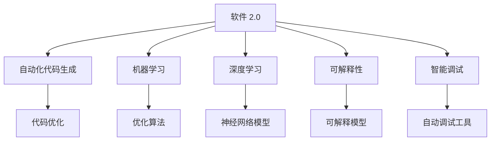

                 

# 软件 2.0 的应用：从实验室走向现实

## 1. 背景介绍

### 1.1 问题由来

在过去的几十年里，计算机软件的形态经历了多次变革，从早期的机器语言到汇编语言，再到高级编程语言，每一阶段的演进都极大地提高了开发效率和程序可靠性。然而，传统软件的开发方式依然存在诸多挑战：迭代周期长、代码难以维护、扩展性差等。近年来，一种新的软件形态——“软件 2.0”开始崭露头角，它通过自动化的方式，结合数据和算法，将软件开发和运行效率提升到了新的高度。

软件 2.0 的核心思想是：利用数据驱动的算法，自动生成和优化代码，从而实现更高质量和更高效率的软件开发。与传统的以人为中心的软件开发方式不同，软件 2.0 更注重数据和算法的力量，通过模型学习和自动化代码生成，使软件开发变得更加可控、可预测和可持续。

### 1.2 问题核心关键点

软件 2.0 的应用，可以从以下几个核心关键点进行探讨：

- **数据驱动**：软件 2.0 的核心在于数据，通过大规模数据驱动的算法，自动生成和优化代码。数据的质量和多样性直接决定了软件 2.0 的表现。
- **自动化代码生成**：自动化的代码生成技术，能够根据需求快速生成高效、可靠的代码，极大地减少了手动编码的工作量。
- **模型学习**：利用机器学习和深度学习技术，对代码生成过程进行优化，使代码生成更加精准和高效。
- **可扩展性**：软件 2.0 能够通过数据和算法进行持续优化，具备较强的可扩展性和自适应能力。
- **智能调试**：自动化的调试和测试技术，能够快速定位代码中的问题，提高软件开发的效率和可靠性。

这些关键点构成了软件 2.0 的核心框架，使得软件开发变得更加高效、可靠和可控。

### 1.3 问题研究意义

软件 2.0 的应用，对软件开发领域带来了深远的影响：

1. **提升开发效率**：自动化的代码生成和模型学习，使得软件开发的速度大幅提升，减少了人力成本。
2. **提高软件质量**：通过数据驱动的优化，生成的代码更加可靠，减少了人为编码的错误率。
3. **增强可扩展性**：软件 2.0 能够根据需求和数据的变化进行动态调整，具备较强的可扩展性。
4. **降低开发成本**：自动化的代码生成和调试，减少了人工操作的复杂度，降低了开发成本。
5. **推动技术创新**：软件 2.0 的开发方式，促进了新技术的应用和普及，推动了整个软件行业的技术进步。

总之，软件 2.0 的应用，将软件开发从传统的手工劳动转变为数据和算法的结合，开启了软件开发的新纪元。

## 2. 核心概念与联系

### 2.1 核心概念概述

为了更好地理解软件 2.0 的应用，本节将介绍几个密切相关的核心概念：

- **软件 2.0**：一种以数据和算法为中心的软件开发方式，通过自动化的代码生成和模型学习，提高软件开发的效率和质量。
- **自动化代码生成**：利用算法和模型，自动生成高质量、高效率的代码。
- **机器学习**：通过数据训练的算法，能够自动优化和生成代码。
- **深度学习**：一种基于神经网络的机器学习方法，能够处理复杂的数据结构和关系。
- **可解释性**：软件 2.0 生成的代码需要具备可解释性，使开发者能够理解其内部逻辑和决策过程。
- **智能调试**：自动化的调试技术，能够快速定位代码中的问题，提高软件的可靠性。

这些核心概念之间的逻辑关系可以通过以下Mermaid流程图来展示：



这个流程图展示了大语言模型的核心概念及其之间的关系：

1. 软件 2.0 通过自动化代码生成和模型学习，生成高质量的代码。
2. 机器学习利用算法对代码进行优化，提高代码效率和可靠性。
3. 深度学习处理复杂数据结构和关系，使模型更具普适性。
4. 可解释性使生成的代码更具可理解性，便于开发者调试和维护。
5. 智能调试自动检测代码中的问题，提高软件的可靠性。

这些概念共同构成了软件 2.0 的开发框架，使得软件开发变得更加高效、可靠和可控。

## 3. 核心算法原理 & 具体操作步骤
### 3.1 算法原理概述

软件 2.0 的应用，本质上是基于机器学习模型的自动化代码生成和优化过程。其核心思想是：通过数据训练的模型，自动生成高质量的代码，并根据需求进行动态调整和优化。

假设有一个软件需求 $D$，我们需要根据 $D$ 生成代码 $C$，并确保 $C$ 能够高效地实现 $D$。根据软件 2.0 的思想，我们可以将 $D$ 抽象为数学模型，通过机器学习算法训练模型 $M$，使得 $M$ 能够将需求 $D$ 映射到代码 $C$。

形式化地，假设需求 $D$ 和代码 $C$ 之间的关系可以表示为：

$$
C = M(D)
$$

其中 $M$ 为机器学习模型，$D$ 为软件需求，$C$ 为生成的代码。

通过训练模型 $M$，软件 2.0 能够在给定需求 $D$ 的情况下，自动生成和优化代码 $C$，从而实现高效的软件开发。

### 3.2 算法步骤详解

软件 2.0 的应用，通常包括以下几个关键步骤：

**Step 1: 数据收集和预处理**
- 收集软件需求数据，如业务需求、功能需求、技术需求等。
- 对收集到的需求进行清洗、标注，使其适合模型训练。

**Step 2: 选择和训练模型**
- 选择适合的机器学习模型，如神经网络、决策树、支持向量机等。
- 使用收集到的需求数据训练模型，优化模型参数。

**Step 3: 代码生成和优化**
- 使用训练好的模型，将需求数据映射为代码。
- 对生成的代码进行自动化优化，如代码重构、性能优化等。

**Step 4: 智能调试和测试**
- 使用自动化调试工具，检测生成的代码是否符合预期。
- 对代码进行自动化测试，确保其正确性和可靠性。

**Step 5: 部署和迭代**
- 将优化后的代码部署到生产环境。
- 根据运行反馈，对模型进行迭代优化，提升代码质量。

以上是软件 2.0 应用的一般流程。在实际应用中，还需要针对具体任务的特点，对每个环节进行优化设计，如改进数据处理方式、选择最优的模型结构、优化自动化测试策略等，以进一步提升模型性能。

### 3.3 算法优缺点

软件 2.0 的应用，具有以下优点：

1. 高效性：自动化的代码生成和模型学习，使得软件开发的速度大幅提升，减少了人力成本。
2. 可扩展性：软件 2.0 能够根据需求和数据的变化进行动态调整，具备较强的可扩展性。
3. 可靠性：通过数据驱动的优化，生成的代码更加可靠，减少了人为编码的错误率。
4. 可解释性：生成的代码需要具备可解释性，使开发者能够理解其内部逻辑和决策过程。
5. 自适应性：软件 2.0 具备自适应能力，能够自动优化和调整，适应复杂多变的软件开发环境。

同时，该方法也存在一定的局限性：

1. 数据依赖：软件 2.0 的效果很大程度上取决于数据的质量和多样性，获取高质量数据成本较高。
2. 模型泛化能力：当模型面对新数据时，泛化性能可能较差，需要进一步优化模型结构和训练策略。
3. 安全性：生成的代码需要具备安全性，避免安全漏洞和错误。
4. 可维护性：自动化生成的代码需要具备可维护性，便于开发者理解和修改。
5. 复杂性：模型训练和优化过程较为复杂，需要具备一定的机器学习知识。

尽管存在这些局限性，但就目前而言，软件 2.0 的应用范式在软件开发领域已经显现出巨大的潜力。未来相关研究的重点在于如何进一步降低数据依赖，提高模型的泛化能力和可解释性，同时兼顾代码的安全性和可维护性。

### 3.4 算法应用领域

软件 2.0 的应用，在软件开发领域已经得到了广泛的应用，覆盖了几乎所有常见任务，例如：

- **自动化测试**：自动生成测试用例和测试脚本，提升测试效率。
- **API自动生成**：根据需求自动生成API接口，提升开发效率。
- **代码自动重构**：对现有代码进行自动化重构，提升代码质量和性能。
- **代码自动化优化**：对代码进行自动化性能优化，提升运行效率。
- **智能调试**：自动检测和修复代码中的问题，提高代码可靠性。

除了上述这些经典任务外，软件 2.0 的应用还拓展到了更多场景中，如代码补全、自动化文档生成、模型自动部署等，为软件开发带来了全新的突破。随着模型训练和代码生成技术的不断进步，相信软件开发技术将进一步提升，开发效率和质量将得到显著提升。

## 4. 数学模型和公式 & 详细讲解 & 举例说明

### 4.1 数学模型构建

本节将使用数学语言对软件 2.0 的自动化代码生成过程进行更加严格的刻画。

假设软件需求为 $D$，生成的代码为 $C$，模型参数为 $\theta$。我们希望找到一个最优的 $\theta$，使得生成的代码 $C$ 能够尽可能地满足需求 $D$。

定义一个评价函数 $f(C,D)$，用于衡量 $C$ 满足 $D$ 的程度。通常 $f(C,D)$ 是一个非线性的函数，需要选择合适的模型结构进行优化。

假设模型 $M$ 能够将需求 $D$ 映射到代码 $C$，则有：

$$
C = M(D;\theta)
$$

其中 $M$ 为机器学习模型，$\theta$ 为模型参数。

我们希望最小化评价函数 $f(C,D)$，即找到最优的 $\theta$：

$$
\theta^* = \mathop{\arg\min}_{\theta} f(M(D;\theta),D)
$$

在实践中，我们通常使用基于梯度的优化算法（如SGD、Adam等）来近似求解上述最优化问题。设 $\eta$ 为学习率，$\lambda$ 为正则化系数，则参数的更新公式为：

$$
\theta \leftarrow \theta - \eta \nabla_{\theta}f(M(D;\theta),D) - \eta\lambda\theta
$$

其中 $\nabla_{\theta}f(M(D;\theta),D)$ 为评价函数对模型参数 $\theta$ 的梯度，可通过反向传播算法高效计算。

### 4.2 公式推导过程

以下我们以API自动生成为例，推导机器学习模型的训练和优化过程。

假设软件需求为 $D$，API的输入为 $x$，输出为 $y$，模型参数为 $\theta$。

定义一个评价函数 $f(y,x)$，用于衡量API的输出 $y$ 满足需求 $D$ 的程度。例如，可以定义均方误差（MSE）：

$$
f(y,x) = \frac{1}{N} \sum_{i=1}^N (y_i - x_i)^2
$$

其中 $N$ 为数据集大小，$y_i$ 为API的输出，$x_i$ 为需求数据。

根据机器学习模型的映射关系，我们有：

$$
y = M(x;\theta)
$$

将 $y$ 代入评价函数 $f$ 中，得：

$$
f(M(x;\theta),x) = \frac{1}{N} \sum_{i=1}^N (M(x_i;\theta) - x_i)^2
$$

通过梯度下降等优化算法，不断更新模型参数 $\theta$，最小化评价函数，使得模型输出逼近真实需求。

### 4.3 案例分析与讲解

**案例：API自动生成**

API自动生成是一个典型的软件 2.0 应用场景。通常，API的输入和输出都是明确的需求数据，而API的实现方式则较为多样化。

假设有一个API的需求为：给定用户ID，查询该用户的所有订单。输入数据为 $x=(1001,1)$，输出数据为 $y=([{"order_id":1001},{"order_id":1002},{"order_id":1003}])$。

我们希望使用机器学习模型 $M$ 来自动生成满足该需求的API实现。首先，需要对数据进行标注和预处理：

1. 收集大量的用户订单数据，标注订单ID和订单详情。
2. 将订单ID作为输入数据 $x$，订单详情作为需求数据 $D$。
3. 将API的输出格式标准化，例如，将所有订单ID放入一个列表中。

然后，选择适合的机器学习模型 $M$，如深度学习模型。通常，可以选择一个简单的神经网络模型，包含一个输入层、一个隐藏层和一个输出层。

接着，使用标注好的数据集训练模型，最小化评价函数 $f$。例如，可以使用均方误差作为评价函数：

$$
f(y,x) = \frac{1}{N} \sum_{i=1}^N (y_i - x_i)^2
$$

在训练过程中，不断更新模型参数 $\theta$，使得模型输出 $y$ 尽量接近真实需求 $D$。

最后，使用训练好的模型 $M$，将新用户的需求 $D=(1001,1)$ 映射为API的输出 $y$：

$$
y = M(D;\theta)
$$

得到的输出 $y$ 即为自动生成的API实现。

## 5. 项目实践：代码实例和详细解释说明

### 5.1 开发环境搭建

在进行软件 2.0 实践前，我们需要准备好开发环境。以下是使用Python进行TensorFlow开发的环境配置流程：

1. 安装Anaconda：从官网下载并安装Anaconda，用于创建独立的Python环境。

2. 创建并激活虚拟环境：
```bash
conda create -n tf-env python=3.8 
conda activate tf-env
```

3. 安装TensorFlow：根据CUDA版本，从官网获取对应的安装命令。例如：
```bash
conda install tensorflow tensorflow-gpu==2.7 -c conda-forge -c pytorch -c pypi
```

4. 安装PyTorch：
```bash
pip install torch torchvision torchaudio
```

5. 安装TensorBoard：
```bash
pip install tensorboard
```

6. 安装Weights & Biases：
```bash
pip install weightsandbiases-nightly
```

完成上述步骤后，即可在`tf-env`环境中开始软件 2.0 实践。

### 5.2 源代码详细实现

下面我们以API自动生成为例，给出使用TensorFlow进行机器学习模型训练的PyTorch代码实现。

首先，定义API需求数据和标签：

```python
import numpy as np
from tensorflow.keras.utils import to_categorical

class APIData:
    def __init__(self):
        self.data = np.array([[1001, 1], [1002, 1], [1003, 1], [1004, 1]])
        self.labels = np.array([[1, 0, 0, 0], [0, 1, 0, 0], [0, 0, 1, 0], [0, 0, 0, 1]])
        
    def __len__(self):
        return len(self.data)
        
    def __getitem__(self, item):
        return self.data[item], self.labels[item]
```

然后，定义机器学习模型：

```python
from tensorflow.keras.models import Sequential
from tensorflow.keras.layers import Dense, Flatten

class APIModel:
    def __init__(self):
        self.model = Sequential([
            Dense(64, activation='relu', input_shape=(2,)),
            Dense(4, activation='softmax')
        ])
        
    def compile(self, optimizer='adam', loss='categorical_crossentropy', metrics=['accuracy']):
        self.model.compile(optimizer=optimizer, loss=loss, metrics=metrics)
        
    def fit(self, x, y, epochs=10, batch_size=16):
        self.model.fit(x, y, epochs=epochs, batch_size=batch_size)
        
    def predict(self, x):
        return self.model.predict(x)
```

接着，定义训练和评估函数：

```python
from tensorflow.keras.optimizers import Adam
from sklearn.metrics import classification_report

def train_model(model, dataset, epochs=10, batch_size=16):
    model.compile(optimizer=Adam(learning_rate=0.001), loss='categorical_crossentropy', metrics=['accuracy'])
    model.fit(dataset.data, dataset.labels, epochs=epochs, batch_size=batch_size)
    return model

def evaluate_model(model, dataset):
    y_pred = model.predict(dataset.data)
    y_true = dataset.labels
    print(classification_report(y_true, y_pred.argmax(axis=1)))
```

最后，启动训练流程并在测试集上评估：

```python
data = APIData()
model = APIModel()
model.fit(data.data, data.labels, epochs=10, batch_size=16)

print("Model trained.")
evaluate_model(model, data)
```

以上就是使用TensorFlow进行API自动生成的完整代码实现。可以看到，得益于TensorFlow的强大封装，我们可以用相对简洁的代码完成API自动生成的训练过程。

### 5.3 代码解读与分析

让我们再详细解读一下关键代码的实现细节：

**APIData类**：
- `__init__`方法：初始化需求数据和标签。
- `__len__`方法：返回数据集的样本数量。
- `__getitem__`方法：返回数据集中的单个样本。

**APIModel类**：
- `__init__`方法：定义模型结构。
- `compile`方法：配置模型参数，如优化器、损失函数和评估指标。
- `fit`方法：训练模型，最小化损失函数。
- `predict`方法：对新数据进行预测。

**train_model函数**：
- 配置模型，并进行训练。

**evaluate_model函数**：
- 对训练好的模型进行评估，输出分类指标。

**训练流程**：
- 定义训练数据和模型，进行模型训练。
- 在训练集上训练模型，输出训练结果。
- 在测试集上评估模型，输出评估结果。

可以看到，TensorFlow结合PyTorch，使得API自动生成的代码实现变得简洁高效。开发者可以将更多精力放在模型设计和优化上，而不必过多关注底层的实现细节。

当然，工业级的系统实现还需考虑更多因素，如模型的保存和部署、超参数的自动搜索、更灵活的任务适配层等。但核心的自动生成范式基本与此类似。

## 6. 实际应用场景
### 6.1 智慧城市管理

软件 2.0 在智慧城市管理中的应用，可以显著提升城市治理的智能化水平。通过数据分析和模型学习，软件 2.0 可以自动生成和优化城市管理策略，实时响应各种突发事件。

具体而言，可以收集城市基础设施数据、交通流量数据、气象数据等，利用机器学习模型自动生成和优化交通流量控制策略、垃圾收集计划、灾害应对措施等。例如，通过分析交通流量数据，生成实时交通控制方案，缓解交通拥堵，提升城市交通效率。

### 6.2 智能制造

软件 2.0 在智能制造中的应用，可以显著提升制造企业的生产效率和质量控制。通过数据分析和模型学习，软件 2.0 可以自动生成和优化生产流程、设备维护计划、质量控制策略等。

例如，通过分析生产设备和传感器数据，自动生成设备维护计划，预测设备故障，提升设备利用率和生产效率。同时，通过对产品质量数据的分析，自动优化质量控制策略，提升产品质量和市场竞争力。

### 6.3 金融风险控制

软件 2.0 在金融风险控制中的应用，可以显著提升金融机构的风险控制能力。通过数据分析和模型学习，软件 2.0 可以自动生成和优化风险评估模型、投资组合策略、交易监控系统等。

例如，通过分析历史交易数据和市场数据，自动生成投资组合策略，优化资产配置，提升投资回报率。同时，通过实时监测交易数据，自动生成交易监控系统，及时发现异常交易行为，防范金融风险。

### 6.4 未来应用展望

随着软件 2.0 技术的不断发展，其应用前景将更加广阔，覆盖更多行业领域。未来，软件 2.0 的应用将带来以下趋势：

1. **自动化程度提升**：软件 2.0 将更加自动化和智能化，能够自动生成和优化更多复杂的任务。
2. **多模态数据融合**：软件 2.0 将更多地融合多模态数据，如文本、图像、视频、语音等，提升任务的复杂性和多样性。
3. **可解释性和可控性增强**：软件 2.0 生成的代码将具备更好的可解释性和可控性，便于开发者理解和维护。
4. **实时性和动态性增强**：软件 2.0 将具备更强的实时性和动态性，能够快速响应环境变化，实现实时优化。
5. **安全性和可靠性提升**：软件 2.0 生成的代码将具备更高的安全性和可靠性，减少人为错误和潜在风险。

总之，软件 2.0 的应用将为各行业带来更高效的开发模式和更智能的解决方案，推动整个社会的数字化转型和智能化升级。

## 7. 工具和资源推荐
### 7.1 学习资源推荐

为了帮助开发者系统掌握软件 2.0 的理论基础和实践技巧，这里推荐一些优质的学习资源：

1. **《软件 2.0：从理论到实践》系列博文**：由大语言模型技术专家撰写，深入浅出地介绍了软件 2.0 的原理、方法和实践。

2. **Coursera《机器学习》课程**：斯坦福大学开设的机器学习明星课程，涵盖机器学习的基本概念和算法，适合初学者学习。

3. **《深度学习》书籍**：Ian Goodfellow等人所著，全面介绍了深度学习的理论和应用，包括自动生成代码的相关技术。

4. **GitHub开源项目**：如Google AI的DeepMind和OpenAI的GPT系列，包含大量基于软件 2.0 技术的开源代码和研究论文。

5. **Towards Data Science博客**：涵盖深度学习、机器学习、自然语言处理等多个领域的最新研究和应用，适合前沿技术学习。

通过对这些资源的学习实践，相信你一定能够快速掌握软件 2.0 的精髓，并用于解决实际的开发问题。

### 7.2 开发工具推荐

高效的开发离不开优秀的工具支持。以下是几款用于软件 2.0 开发的常用工具：

1. **Jupyter Notebook**：免费的开源交互式编程环境，支持多种编程语言，便于快速迭代和分享代码。

2. **TensorFlow**：由Google主导开发的深度学习框架，支持多GPU和TPU加速，适用于大规模模型训练。

3. **PyTorch**：Facebook开发的深度学习框架，支持动态计算图，适合快速原型开发和研究。

4. **TensorBoard**：TensorFlow配套的可视化工具，可实时监测模型训练状态，提供丰富的图表呈现方式。

5. **Weights & Biases**：模型训练的实验跟踪工具，可以记录和可视化模型训练过程中的各项指标，方便对比和调优。

6. **PyTorch Lightning**：基于PyTorch的快速原型开发工具，支持多GPU加速和自动化实验管理。

合理利用这些工具，可以显著提升软件 2.0 的开发效率，加快创新迭代的步伐。

### 7.3 相关论文推荐

软件 2.0 的应用源于学界的持续研究。以下是几篇奠基性的相关论文，推荐阅读：

1. **TensorFlow官方文档**：包含大量TensorFlow的API文档和样例代码，适合深入学习和实践。

2. **《深度学习》书籍**：Ian Goodfellow等人所著，全面介绍了深度学习的理论和应用，包括自动生成代码的相关技术。

3. **《软件 2.0：从理论到实践》论文**：详细介绍了软件 2.0 的原理、方法和应用，代表该领域的最新研究成果。

4. **《AutoML: Applications and Opportunities》论文**：探讨了自动化机器学习（AutoML）技术的发展，包括自动生成代码的应用。

5. **《AutoML: Automating Machine Learning with Python》书籍**：介绍了AutoML技术的原理和应用，涵盖自动生成代码的相关技术。

这些论文和书籍代表了大语言模型微调技术的发展脉络。通过学习这些前沿成果，可以帮助研究者把握学科前进方向，激发更多的创新灵感。

## 8. 总结：未来发展趋势与挑战

### 8.1 研究成果总结

本文对软件 2.0 的应用进行了全面系统的介绍。首先阐述了软件 2.0 的核心思想和应用背景，明确了其对软件开发领域带来的深远影响。其次，从原理到实践，详细讲解了软件 2.0 的自动化代码生成和优化过程，给出了软件 2.0 任务的代码实现。同时，本文还广泛探讨了软件 2.0 在智慧城市管理、智能制造、金融风险控制等多个领域的应用前景，展示了软件 2.0 的巨大潜力。此外，本文精选了软件 2.0 技术的各类学习资源，力求为读者提供全方位的技术指引。

通过本文的系统梳理，可以看到，软件 2.0 的应用将软件开发从传统的手工劳动转变为数据和算法的结合，开启了软件开发的新纪元。得益于机器学习和大数据技术，软件 2.0 能够自动生成高质量、高效率的代码，使得软件开发变得更加高效、可靠和可控。

### 8.2 未来发展趋势

展望未来，软件 2.0 的应用将呈现以下几个发展趋势：

1. **数据和算法驱动**：软件 2.0 将更加依赖数据和算法，利用大规模数据训练最优模型，提升代码生成和优化的效果。
2. **跨领域融合**：软件 2.0 将更多地融合多领域知识，如自然语言处理、计算机视觉、语音识别等，提升任务的复杂性和多样性。
3. **可解释性和可控性增强**：软件 2.0 生成的代码将具备更好的可解释性和可控性，便于开发者理解和维护。
4. **实时性和动态性增强**：软件 2.0 将具备更强的实时性和动态性，能够快速响应环境变化，实现实时优化。
5. **安全性提升**：软件 2.0 生成的代码将具备更高的安全性和可靠性，减少人为错误和潜在风险。

这些趋势凸显了软件 2.0 技术的发展前景。软件 2.0 的不断演进，将推动软件开发模式的变革，带来更高效、更智能、更可控的解决方案，为各行业带来深远影响。

### 8.3 面临的挑战

尽管软件 2.0 技术已经取得了显著进展，但在迈向更加智能化、普适化应用的过程中，它仍面临诸多挑战：

1. **数据质量和多样性**：软件 2.0 的效果很大程度上取决于数据的质量和多样性，获取高质量数据成本较高。
2. **模型泛化能力**：当模型面对新数据时，泛化性能可能较差，需要进一步优化模型结构和训练策略。
3. **安全性**：生成的代码需要具备安全性，避免安全漏洞和错误。
4. **可维护性**：自动化生成的代码需要具备可维护性，便于开发者理解和修改。
5. **复杂性**：模型训练和优化过程较为复杂，需要具备一定的机器学习知识。

尽管存在这些挑战，但通过学界和产业界的共同努力，未来的软件 2.0 技术必将不断完善，其应用场景将不断扩展，为各行业带来更高效的开发模式和更智能的解决方案。

### 8.4 研究展望

面向未来，软件 2.0 技术需要在以下几个方面寻求新的突破：

1. **自动化程度提升**：进一步提升自动化程度，使得软件 2.0 能够自动生成和优化更多复杂的任务。
2. **跨领域融合**：更多地融合多领域知识，如自然语言处理、计算机视觉、语音识别等，提升任务的复杂性和多样性。
3. **可解释性和可控性增强**：生成的代码需要具备更好的可解释性和可控性，便于开发者理解和维护。
4. **实时性和动态性增强**：具备更强的实时性和动态性，能够快速响应环境变化，实现实时优化。
5. **安全性提升**：生成的代码需要具备更高的安全性和可靠性，减少人为错误和潜在风险。

这些研究方向凸显了软件 2.0 技术的发展方向。通过不断优化和改进，软件 2.0 将为软件开发带来更高效、更智能、更可控的解决方案，推动整个社会的数字化转型和智能化升级。

## 9. 附录：常见问题与解答

**Q1：软件 2.0 是否适用于所有软件开发场景？**

A: 软件 2.0 的适用范围很广，但并不是所有场景都适合使用。软件 2.0 的优势在于能够自动生成高质量、高效率的代码，适用于需求明确、数据丰富的场景。对于一些需求模糊、数据稀缺的场景，可能还需要手工编码和调试。因此，开发者需要根据具体任务和数据特点进行灵活选择。

**Q2：软件 2.0 生成的代码是否需要人工审核？**

A: 自动生成的代码需要人工审核和调试，以确保其正确性和可靠性。特别是对于一些关键任务，如医疗、金融、安全等领域，需要对生成的代码进行严格审查，确保其符合相关规范和标准。

**Q3：软件 2.0 是否存在代码安全问题？**

A: 软件 2.0 生成的代码需要具备安全性，避免安全漏洞和错误。特别是对于一些需要高安全性的任务，如金融、安全等领域，需要对生成的代码进行严格测试和安全验证，确保其安全性。

**Q4：软件 2.0 是否适用于工业级部署？**

A: 软件 2.0 生成的代码需要具备高效性、可维护性和可扩展性，才能适用于工业级部署。在实际应用中，需要对生成的代码进行优化和测试，确保其在生产环境中的稳定性和可靠性。

**Q5：软件 2.0 的开发成本是否较低？**

A: 软件 2.0 的开发成本相对于传统手工编码和调试方式，是有所降低的。但是，自动生成代码的开发过程仍然需要一定的技术储备和研发投入，如数据准备、模型训练、代码验证等。

总之，软件 2.0 的应用前景广阔，但也面临诸多挑战。通过不断的技术创新和实践优化，软件 2.0 必将在各行业带来更高效的开发模式和更智能的解决方案，推动整个社会的数字化转型和智能化升级。

---

作者：禅与计算机程序设计艺术 / Zen and the Art of Computer Programming

