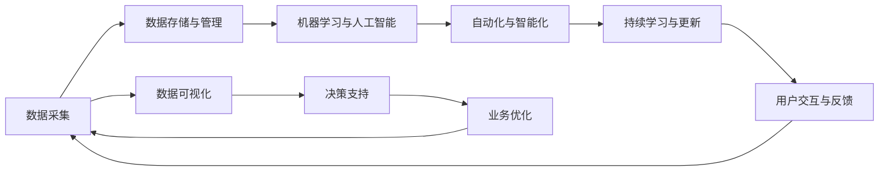

                 

## 1. 背景介绍

### 1.1 问题由来

在过去的几十年里，软件技术的迅猛发展为各行各业带来了巨大的变革。然而，在软件 1.0 时代，软件开发和应用主要依赖于人工编码和规则约束，编程人员需要花费大量时间和精力来确保软件的正确性和稳定性。随着机器学习和大数据技术的兴起，软件开发进入了一个全新的时代：软件 2.0 时代。

软件 2.0 时代标志着软件开发的范式转变，从依赖人工编码转向依赖数据驱动。在这个时代，软件不再仅仅是一组代码，而是基于数据的自动化、智能化的系统，能够根据数据进行自我学习、自我优化，从而提升软件的效率和效果。数据驱动的软件系统能够快速适应不断变化的环境，满足用户的实际需求，为各行各业带来了前所未有的机遇和挑战。

### 1.2 问题核心关键点

软件 2.0 时代的关键在于如何有效利用数据，构建智能化的软件系统。以下是一些核心关键点：

1. **数据质量的重要性**：软件 2.0 系统依赖于大量的数据进行训练和优化。因此，数据的质量、完整性和实时性直接影响了系统的性能和可靠性。

2. **自动化和智能化**：软件 2.0 系统通过机器学习算法，能够自动从数据中学习规律和模式，并进行自我优化。这种自动化和智能化是软件 2.0 与软件 1.0 的最大区别。

3. **持续学习与更新**：软件 2.0 系统需要不断地从新数据中学习，以保持其性能和准确性。持续学习机制是软件 2.0 系统能够适应不断变化环境的核心能力。

4. **用户体验**：数据驱动的软件系统不仅需要满足功能性需求，还需要具备良好的用户体验，能够快速响应用户的交互行为和反馈。

5. **安全性与隐私保护**：随着数据量的增加，数据驱动的软件系统需要具备强大的安全性和隐私保护机制，以防止数据泄露和滥用。

### 1.3 问题研究意义

软件 2.0 时代的到来，为软件开发和应用带来了全新的发展方向。其研究意义体现在以下几个方面：

1. **提升软件效率和效果**：数据驱动的软件系统能够根据用户行为和环境变化进行自我优化，显著提升软件的效率和效果。

2. **加速技术创新**：数据驱动的软件系统使得新技术和新算法的开发和应用变得更加快速和灵活，加速了技术创新和迭代。

3. **降低开发成本**：数据驱动的软件系统通过自动化和智能化，减少了人工编码和调试的工作量，降低了软件开发成本。

4. **增强用户体验**：数据驱动的软件系统能够实时响应用户需求，提供个性化和智能化的服务，显著提升用户体验。

5. **促进产业升级**：数据驱动的软件系统能够广泛应用于各个行业，为传统行业的数字化转型提供新的技术路径，促进产业升级和经济社会发展。

## 2. 核心概念与联系

### 2.1 核心概念概述

在软件 2.0 时代，数据驱动的软件系统依赖于多个核心概念，这些概念之间的联系和互动构成了软件 2.0 系统的完整架构。以下是一些关键概念：

- **数据采集**：从各种数据源（如传感器、社交媒体、日志文件等）收集数据，为软件 2.0 系统提供训练和优化素材。

- **数据存储与管理**：对采集到的数据进行存储和管理，确保数据的完整性、可用性和安全性。

- **机器学习与人工智能**：通过机器学习算法和人工智能技术，从数据中提取规律和模式，进行预测和优化。

- **自动化与智能化**：利用机器学习算法和人工智能技术，实现软件的自动化和智能化，提升软件的效率和效果。

- **持续学习与更新**：软件 2.0 系统需要不断地从新数据中学习，以保持其性能和准确性。

- **用户交互与反馈**：软件 2.0 系统通过与用户的交互获取反馈信息，进一步优化系统性能。

这些核心概念通过数据流和算法流相互连接，共同构建了软件 2.0 系统的架构。

### 2.2 核心概念原理和架构的 Mermaid 流程图



这个 Mermaid 流程图展示了数据流和算法流在软件 2.0 系统中的流动路径。数据从采集开始，经过存储与管理、机器学习与人工智能、自动化与智能化、持续学习与更新等多个环节，最终形成智能化的软件系统。同时，系统通过用户交互与反馈不断进行优化，形成正向的循环。

## 3. 核心算法原理 & 具体操作步骤

### 3.1 算法原理概述

软件 2.0 时代的数据驱动算法主要是基于机器学习和人工智能技术实现的。以下是几个核心的算法原理：

1. **监督学习**：通过标注数据训练模型，使得模型能够根据输入数据预测输出结果。监督学习广泛应用于分类和回归任务。

2. **无监督学习**：利用未标注的数据进行学习，自动发现数据中的模式和规律。无监督学习适用于聚类、降维等任务。

3. **强化学习**：通过与环境的交互，不断调整策略，使得智能体在特定环境中获得最佳结果。强化学习广泛应用于游戏、机器人控制等任务。

4. **深度学习**：利用深度神经网络对数据进行处理和分析，实现复杂的模式识别和预测。深度学习在图像识别、自然语言处理等领域表现优异。

### 3.2 算法步骤详解

以下是数据驱动的软件系统在构建和优化过程中的一些关键步骤：

**Step 1: 数据采集与预处理**

- 从各种数据源（如传感器、社交媒体、日志文件等）收集数据。
- 对数据进行清洗、去重、归一化等预处理操作，确保数据的质量和一致性。

**Step 2: 数据存储与管理**

- 将预处理后的数据存储在数据库或数据仓库中，确保数据的可访问性和安全性。
- 对数据进行分区、索引、压缩等操作，提高数据处理的效率。

**Step 3: 机器学习与模型训练**

- 选择合适的机器学习算法和模型架构，如决策树、随机森林、深度神经网络等。
- 使用标注数据训练模型，优化模型参数，提高模型的预测能力。

**Step 4: 自动化与智能化**

- 将训练好的模型集成到软件中，实现自动化的功能。
- 利用模型的预测结果进行智能化的决策和优化，提升系统的效率和效果。

**Step 5: 持续学习与更新**

- 定期从新数据中重新训练模型，更新模型参数，保持模型的性能和准确性。
- 根据用户反馈和新数据，不断优化模型和算法，提升系统的适应性和鲁棒性。

**Step 6: 用户交互与反馈**

- 与用户进行交互，收集反馈信息。
- 根据用户反馈进行模型优化和系统改进，提升用户体验。

### 3.3 算法优缺点

数据驱动的软件系统具有以下优点：

1. **高效性**：利用机器学习算法和人工智能技术，能够快速处理和分析大量数据，提高系统的效率和效果。

2. **自适应性**：系统能够根据环境和用户需求进行自我优化，适应不断变化的环境和需求。

3. **可扩展性**：系统可以通过添加更多数据和算法，实现功能的扩展和提升。

4. **准确性**：利用大量的标注数据和先进的机器学习算法，能够实现高精度的预测和优化。

5. **持续改进**：系统需要不断地从新数据中学习，进行自我改进，保持其性能和准确性。

然而，数据驱动的软件系统也存在一些缺点：

1. **数据依赖性**：系统的性能和效果高度依赖于数据的质量和数量，数据不足或数据偏差会影响系统的性能。

2. **模型复杂性**：高级机器学习算法和深度神经网络模型的复杂性较高，设计和调优难度大。

3. **计算资源需求高**：训练和优化模型需要大量的计算资源，对硬件设备和计算能力要求高。

4. **隐私和安全风险**：数据驱动的系统需要处理大量的敏感数据，存在数据泄露和滥用的风险，需要强大的隐私保护和数据安全机制。

### 3.4 算法应用领域

数据驱动的软件系统已经在多个领域得到广泛应用，以下是一些典型的应用场景：

1. **智能推荐系统**：利用用户行为数据和产品信息，推荐个性化的商品、内容和服务。

2. **金融风险管理**：利用金融市场数据和用户交易行为，进行风险预测和风险控制。

3. **智能客服**：利用用户对话数据和自然语言处理技术，实现智能化的客户服务。

4. **医疗健康**：利用患者数据和医学知识，进行疾病预测和健康管理。

5. **智能交通**：利用交通数据和车辆信息，进行交通流量预测和智能交通管理。

6. **智慧城市**：利用城市数据和传感器信息，进行城市管理和公共服务优化。

这些应用场景展示了数据驱动的软件系统在各行各业的广泛应用，为各个行业带来了新的发展机遇和挑战。

## 4. 数学模型和公式 & 详细讲解 & 举例说明

### 4.1 数学模型构建

在软件 2.0 时代，数据驱动的软件系统通常采用以下数学模型进行构建和优化：

- **线性回归模型**：用于预测连续型数值变量，表示为 $y = \beta_0 + \beta_1 x_1 + \beta_2 x_2 + ... + \beta_n x_n + \epsilon$。

- **逻辑回归模型**：用于分类问题，表示为 $P(y=1|x) = \frac{1}{1+e^{-\theta_0 - \theta_1 x_1 - \theta_2 x_2 - ... - \theta_n x_n}}$。

- **决策树模型**：用于分类和回归问题，通过将数据递归地划分，构建一棵决策树进行预测，表示为 $f(x) = \sum_{i=1}^{N} \alpha_i g(x, \theta_i)$。

- **随机森林模型**：通过组合多棵决策树，提高模型的稳定性和预测能力。

- **深度神经网络模型**：用于复杂模式识别和预测，表示为 $f(x) = \sum_{i=1}^{N} w_i \sigma(\sum_{j=1}^{M} \theta_{i,j} x_j + b_i)$。

这些数学模型在数据驱动的软件系统中广泛应用，用于预测、分类、聚类、回归等任务。

### 4.2 公式推导过程

以下是几个核心模型的公式推导过程：

**线性回归模型**：

$$
y = \beta_0 + \beta_1 x_1 + \beta_2 x_2 + ... + \beta_n x_n + \epsilon
$$

其中，$y$ 为预测值，$x_1, x_2, ..., x_n$ 为输入变量，$\beta_0, \beta_1, \beta_2, ..., \beta_n$ 为模型参数，$\epsilon$ 为误差项。

**逻辑回归模型**：

$$
P(y=1|x) = \frac{1}{1+e^{-\theta_0 - \theta_1 x_1 - \theta_2 x_2 - ... - \theta_n x_n}}
$$

其中，$P(y=1|x)$ 为输入 $x$ 下输出为 $1$ 的概率，$\theta_0, \theta_1, \theta_2, ..., \theta_n$ 为模型参数。

**决策树模型**：

$$
f(x) = \sum_{i=1}^{N} \alpha_i g(x, \theta_i)
$$

其中，$f(x)$ 为输入 $x$ 下的预测值，$\alpha_i$ 为权重，$g(x, \theta_i)$ 为决策树模型在输入 $x$ 下的输出。

**随机森林模型**：

随机森林模型通过组合多棵决策树，提高模型的稳定性和预测能力。其公式推导过程较为复杂，通常需要借助统计学和机器学习的相关知识。

**深度神经网络模型**：

$$
f(x) = \sum_{i=1}^{N} w_i \sigma(\sum_{j=1}^{M} \theta_{i,j} x_j + b_i)
$$

其中，$f(x)$ 为输入 $x$ 下的预测值，$w_i$ 为权重，$\sigma$ 为激活函数，$\theta_{i,j}$ 为模型参数，$b_i$ 为偏置项。

### 4.3 案例分析与讲解

以智能推荐系统为例，分析数据驱动的软件系统如何通过机器学习算法实现个性化推荐。

**数据采集**：从用户浏览行为、购买历史、评价数据等收集数据。

**数据预处理**：对数据进行清洗、去重、归一化等预处理操作，确保数据的质量和一致性。

**特征工程**：提取用户特征和商品特征，如用户年龄、性别、浏览时间、商品类别、价格等。

**模型训练**：利用用户行为数据和商品信息，训练机器学习模型，如协同过滤、矩阵分解、深度神经网络等。

**推荐算法**：根据用户特征和商品特征，预测用户对商品的兴趣程度，生成推荐列表。

**反馈优化**：利用用户点击、购买等反馈信息，不断优化推荐算法和模型，提升推荐效果。

## 5. 项目实践：代码实例和详细解释说明

### 5.1 开发环境搭建

在进行数据驱动的软件系统开发前，需要准备好开发环境。以下是使用 Python 进行 TensorFlow 开发的环境配置流程：

1. 安装 Anaconda：从官网下载并安装 Anaconda，用于创建独立的 Python 环境。

2. 创建并激活虚拟环境：

```bash
conda create -n tf-env python=3.8 
conda activate tf-env
```

3. 安装 TensorFlow：根据 GPU 版本，从官网获取对应的安装命令。例如：

```bash
conda install tensorflow -c tf -c conda-forge
```

4. 安装其他工具包：

```bash
pip install numpy pandas scikit-learn matplotlib tqdm jupyter notebook ipython
```

完成上述步骤后，即可在 `tf-env` 环境中开始开发。

### 5.2 源代码详细实现

下面我们以智能推荐系统为例，给出使用 TensorFlow 进行机器学习模型训练的 Python 代码实现。

首先，定义数据集和模型：

```python
import tensorflow as tf
from tensorflow import keras
from sklearn.model_selection import train_test_split
from sklearn.preprocessing import StandardScaler
from sklearn.metrics import mean_squared_error

# 定义数据集
X = df[['user_id', 'item_id', 'age', 'gender', 'browsing_time']]
y = df['rating']

# 标准化处理
scaler = StandardScaler()
X = scaler.fit_transform(X)

# 划分训练集和测试集
X_train, X_test, y_train, y_test = train_test_split(X, y, test_size=0.2, random_state=42)

# 定义模型
model = keras.Sequential([
    keras.layers.Dense(32, activation='relu', input_shape=(X_train.shape[1],)),
    keras.layers.Dense(16, activation='relu'),
    keras.layers.Dense(1, activation='linear')
])
```

然后，定义模型训练函数：

```python
def train_model(model, X_train, y_train, X_test, y_test, epochs=100, batch_size=32):
    # 定义优化器和损失函数
    optimizer = keras.optimizers.Adam(learning_rate=0.001)
    loss = keras.losses.MeanSquaredError()

    # 编译模型
    model.compile(optimizer=optimizer, loss=loss)

    # 训练模型
    history = model.fit(X_train, y_train, epochs=epochs, batch_size=batch_size, validation_data=(X_test, y_test))

    # 评估模型
    mse = mean_squared_error(y_test, model.predict(X_test))
    print(f'Mean Squared Error: {mse}')

    # 返回模型和训练历史
    return model, history
```

最后，启动训练流程：

```python
# 训练模型
model, history = train_model(model, X_train, y_train, X_test, y_test)

# 可视化训练过程
plt.plot(history.history['loss'], label='Train Loss')
plt.plot(history.history['val_loss'], label='Validation Loss')
plt.legend()
plt.show()

# 使用模型进行推荐
recommendations = model.predict(X_test)
```

以上就是使用 TensorFlow 进行智能推荐系统训练的完整代码实现。可以看到，借助 TensorFlow 的高级 API，我们可以用相对简洁的代码完成模型的定义、训练和预测。

### 5.3 代码解读与分析

让我们再详细解读一下关键代码的实现细节：

**数据集定义**：
- 从 Pandas 数据框中提取用户特征和商品特征，以及用户的评分。
- 使用 `StandardScaler` 进行数据标准化处理，确保数据的一致性。
- 使用 `train_test_split` 函数将数据集划分为训练集和测试集。

**模型定义**：
- 使用 TensorFlow 的 Sequential 模型定义三层神经网络，包含两个隐藏层和一个输出层。
- 使用 `Dense` 层定义全连接层，激活函数使用 ReLU。
- 输出层使用线性激活函数，表示回归问题。

**模型训练**：
- 定义优化器和损失函数，并编译模型。
- 使用 `fit` 函数进行模型训练，并记录训练历史。
- 计算模型在测试集上的均方误差，评估模型性能。
- 返回模型和训练历史。

**模型预测**：
- 使用训练好的模型对测试集进行预测，生成推荐列表。

可以看到，TensorFlow 提供了丰富的高级 API，使得数据驱动的软件系统开发变得更加高效和便捷。开发者可以专注于模型的设计和训练，而不必过多关注底层的实现细节。

## 6. 实际应用场景

### 6.1 智能推荐系统

智能推荐系统是数据驱动的软件系统的重要应用场景之一。传统的推荐系统依赖于规则和人工调整，无法充分考虑用户行为和商品特征。而利用数据驱动的方法，智能推荐系统可以更加准确地预测用户兴趣，生成个性化的推荐结果。

在技术实现上，可以使用协同过滤、矩阵分解、深度学习等方法，结合用户行为数据和商品信息，训练推荐模型。微调后的模型能够根据用户的历史行为和实时行为，生成个性化的推荐列表，显著提升用户体验和满意度。

### 6.2 金融风险管理

金融风险管理是数据驱动的软件系统的另一个典型应用场景。传统的金融风险管理依赖于人工分析和规则约束，难以应对市场波动和数据变化。而利用数据驱动的方法，金融风险管理系统可以自动分析市场数据和用户交易行为，进行风险预测和控制。

在技术实现上，可以使用时间序列预测、异常检测、强化学习等方法，结合金融市场数据和用户交易行为，训练风险预测模型。微调后的模型能够实时监测市场变化，预测风险事件，进行自动化风险控制，显著提升金融系统的稳定性和安全性。

### 6.3 智能客服

智能客服系统是数据驱动的软件系统的典型应用场景之一。传统的客服系统依赖于人工客服，无法提供24小时不间断服务，且难以保证服务质量和一致性。而利用数据驱动的方法，智能客服系统可以自动分析用户问题和历史互动记录，生成智能化的回复结果。

在技术实现上，可以使用自然语言处理和机器学习技术，结合用户对话数据和自然语言理解技术，训练智能客服模型。微调后的模型能够自动理解用户意图，匹配最佳答案，提升客服系统的响应速度和服务质量。

### 6.4 未来应用展望

随着数据驱动的软件系统不断发展和应用，未来将在更多领域得到广泛应用，为各行各业带来变革性影响。以下是一些未来应用展望：

1. **智慧医疗**：利用患者数据和医学知识，进行疾病预测和健康管理。数据驱动的软件系统可以帮助医生做出更准确的诊断，提升医疗服务质量。

2. **智能交通**：利用交通数据和车辆信息，进行交通流量预测和智能交通管理。数据驱动的软件系统可以提高交通效率，减少拥堵和事故。

3. **智慧城市**：利用城市数据和传感器信息，进行城市管理和公共服务优化。数据驱动的软件系统可以提高城市管理效率，提升市民生活质量。

4. **智能制造**：利用生产数据和设备信息，进行生产过程优化和故障预测。数据驱动的软件系统可以提高生产效率，降低生产成本。

5. **智能农业**：利用农业数据和气象信息，进行农作物种植和病虫害预测。数据驱动的软件系统可以提高农业生产效率，减少资源浪费。

6. **智能金融**：利用金融市场数据和用户交易行为，进行风险预测和金融创新。数据驱动的软件系统可以提高金融系统的稳定性和创新性。

这些应用场景展示了数据驱动的软件系统在各行各业的广泛应用，为各行各业带来了新的发展机遇和挑战。

## 7. 工具和资源推荐

### 7.1 学习资源推荐

为了帮助开发者系统掌握数据驱动的软件系统开发理论基础和实践技巧，这里推荐一些优质的学习资源：

1. **《Python深度学习》**：由 François Chollet 撰写，介绍了 TensorFlow 和 Keras 的基本原理和实践技巧。

2. **《机器学习实战》**：由 Peter Harrington 撰写，介绍了机器学习算法和 Python 实现的基本方法。

3. **Coursera 机器学习课程**：由 Andrew Ng 主讲，介绍了机器学习的基本概念和算法，适合初学者和进阶学习者。

4. **Udacity 深度学习专项课程**：由 Andrew Ng 和 Eric Jonas 主讲，介绍了深度神经网络的基本原理和实践技巧。

5. **Kaggle 数据竞赛**：Kaggle 提供了大量的数据集和竞赛任务，通过参与竞赛可以锻炼实际应用数据驱动的软件系统开发能力。

通过这些资源的学习实践，相信你一定能够快速掌握数据驱动的软件系统开发的核心知识和技能，并用于解决实际的业务问题。

### 7.2 开发工具推荐

高效的数据驱动的软件系统开发离不开优秀的工具支持。以下是几款用于数据驱动的软件系统开发的常用工具：

1. **TensorFlow**：由 Google 主导开发的开源深度学习框架，支持分布式计算和自动微分，适合大规模模型训练和优化。

2. **PyTorch**：由 Facebook 主导开发的开源深度学习框架，支持动态计算图和高效推理，适合快速迭代研究。

3. **Scikit-learn**：基于 Python 的机器学习库，提供了丰富的机器学习算法和工具，适合快速原型开发和模型训练。

4. **Jupyter Notebook**：基于 Python 的交互式编程环境，适合数据科学和机器学习开发，支持可视化展示和代码执行。

5. **Keras**：基于 TensorFlow 和 Theano 的高级 API，提供了简洁易用的接口，适合快速原型开发和模型训练。

6. **Microsoft Azure**：云服务提供商，提供了丰富的数据处理和机器学习工具，适合大规模数据驱动的软件系统开发。

合理利用这些工具，可以显著提升数据驱动的软件系统开发效率，加快创新迭代的步伐。

### 7.3 相关论文推荐

数据驱动的软件系统的发展得益于学界的持续研究。以下是几篇奠基性的相关论文，推荐阅读：

1. **《A Survey of Machine Learning in Software Engineering: Opportunities, Challenges and Future Directions》**：介绍了机器学习在软件开发中的应用，包括软件质量检测、性能优化、缺陷预测等。

2. **《Data Mining and Statistical Learning: A Statistical Perspective》**：由 Michael Steinbach 和 George Karypis 撰写，介绍了数据挖掘和统计学习的理论基础和应用方法。

3. **《Machine Learning Yearning》**：由 Andrew Ng 撰写，介绍了机器学习的基本概念和实践技巧，适合初学者和进阶学习者。

4. **《The Master Algorithm: How the Quest for the Ultimate Learning Machine Will Remake Our World》**：由 Pedro Domingos 撰写，介绍了机器学习的基本概念和应用前景，适合非专业读者。

这些论文代表了大数据和机器学习技术的发展脉络。通过学习这些前沿成果，可以帮助研究者把握学科前进方向，激发更多的创新灵感。

## 8. 总结：未来发展趋势与挑战

### 8.1 研究成果总结

数据驱动的软件系统在过去十年里取得了巨大的进展，成为软件工程和人工智能领域的重要研究方向。其核心研究成果包括以下几个方面：

1. **机器学习算法和深度神经网络的不断优化**：在深度神经网络、随机森林、协同过滤等算法的基础上，不断优化模型结构和参数，提高模型的预测能力和泛化能力。

2. **数据采集和预处理的自动化和智能化**：开发自动化数据采集和预处理工具，提高数据处理的效率和质量。

3. **数据驱动的软件架构设计和优化**：提出数据驱动的软件架构设计方法，优化软件系统的性能和可扩展性。

4. **智能推荐系统的广泛应用**：在电商、社交、金融等领域推广智能推荐系统，提升用户体验和业务价值。

5. **智能客服系统的普及**：在客户服务和智能助理等领域推广智能客服系统，提高服务效率和质量。

6. **数据驱动的智慧城市**：在智慧城市和公共服务领域推广数据驱动的系统，提高城市管理和公共服务效率。

### 8.2 未来发展趋势

展望未来，数据驱动的软件系统将呈现以下几个发展趋势：

1. **跨模态数据融合**：数据驱动的软件系统将更加注重跨模态数据的融合，结合视觉、语音、文本等多种数据源，提升系统的综合能力。

2. **实时数据分析和处理**：数据驱动的软件系统将更加注重实时数据分析和处理，支持实时决策和实时优化。

3. **自适应和动态优化**：数据驱动的软件系统将更加注重自适应和动态优化，根据环境和用户需求进行自我调整和优化。

4. **隐私保护和安全**：数据驱动的软件系统将更加注重隐私保护和安全，确保数据和算法的安全性和可靠性。

5. **伦理和法律规范**：数据驱动的软件系统将更加注重伦理和法律规范，确保算法的公平性和透明性。

### 8.3 面临的挑战

尽管数据驱动的软件系统取得了显著进展，但在发展和应用过程中仍面临诸多挑战：

1. **数据质量和可用性**：高质量、可用的数据是数据驱动系统的基础，但数据获取和标注成本高昂，数据质量参差不齐。

2. **模型复杂性和可解释性**：高级机器学习算法和深度神经网络模型的复杂性高，难以解释和调试。

3. **计算资源需求**：大规模数据驱动的软件系统需要大量的计算资源，对硬件设备和计算能力要求高。

4. **隐私和安全风险**：数据驱动的系统处理大量敏感数据，存在数据泄露和滥用的风险，需要强大的隐私保护和数据安全机制。

5. **伦理和法律问题**：数据驱动的系统可能存在伦理和法律问题，如算法偏见、歧视等，需要建立相应的规范和监管机制。

### 8.4 研究展望

面对数据驱动的软件系统面临的挑战，未来的研究需要在以下几个方面寻求新的突破：

1. **无监督学习和半监督学习**：探索无监督学习和半监督学习的方法，减少对标注数据的依赖，提高数据驱动系统的自适应能力。

2. **参数高效微调和深度学习压缩**：开发参数高效微调方法和深度学习压缩技术，提高数据驱动系统的计算效率和存储效率。

3. **跨模态数据融合和融合算法**：开发跨模态数据融合和融合算法，提升数据驱动系统的综合能力。

4. **实时数据处理和优化**：研究实时数据处理和优化方法，支持实时决策和实时优化。

5. **隐私保护和安全机制**：开发隐私保护和安全机制，确保数据驱动系统的数据安全和算法可靠性。

6. **伦理和法律规范**：建立伦理和法律规范，确保数据驱动系统的公平性和透明性。

这些研究方向将引领数据驱动的软件系统迈向更高的台阶，为各行各业带来新的发展机遇和挑战。

## 9. 附录：常见问题与解答

**Q1：数据驱动的软件系统如何确保数据质量？**

A: 确保数据质量是数据驱动系统的基础。以下是一些常见的方法：

1. **数据清洗**：对数据进行清洗、去重、归一化等预处理操作，确保数据的一致性和完整性。

2. **数据验证**：通过数据验证工具，如数据校验器、测试用例等，检测数据的质量和完整性。

3. **数据标注**：对数据进行标注，确保数据的准确性和可靠性。标注数据可以通过人工标注和机器标注相结合的方式进行。

4. **数据采集自动化**：利用数据采集工具和自动化技术，提高数据采集的效率和质量。

5. **数据集成**：将多个数据源的数据集成到统一的数据仓库中，确保数据的一致性和可用性。

**Q2：数据驱动的软件系统如何进行自适应和动态优化？**

A: 数据驱动的软件系统需要不断地从新数据中学习，进行自我优化和调整。以下是一些常见的方法：

1. **增量学习和在线学习**：通过增量学习和在线学习算法，系统能够不断地从新数据中学习，进行自我优化。

2. **自适应算法**：利用自适应算法，如遗传算法、粒子群算法等，根据环境和用户需求进行自我调整和优化。

3. **自反馈机制**：通过自反馈机制，系统能够根据自身的运行状态和性能指标进行自我调整和优化。

4. **模型集成和融合**：通过模型集成和融合方法，结合多个模型的预测结果，提升系统的准确性和鲁棒性。

5. **持续学习机制**：通过持续学习机制，系统能够不断地从新数据中学习，进行自我更新和优化。

**Q3：数据驱动的软件系统如何进行隐私保护？**

A: 数据驱动的软件系统处理大量敏感数据，存在数据泄露和滥用的风险，需要进行隐私保护。以下是一些常见的方法：

1. **数据匿名化**：对数据进行匿名化处理，如去标识化、泛化等，保护用户隐私。

2. **数据加密**：对数据进行加密处理，防止数据泄露和滥用。

3. **访问控制**：通过访问控制机制，限制对数据的访问权限，保护数据安全。

4. **数据审计**：定期对数据进行审计，检测和防止数据泄露和滥用。

5. **隐私保护技术**：利用隐私保护技术，如差分隐私、同态加密等，保护数据隐私。

**Q4：数据驱动的软件系统如何进行伦理和法律规范？**

A: 数据驱动的软件系统可能存在伦理和法律问题，需要进行伦理和法律规范。以下是一些常见的方法：

1. **算法透明性**：确保算法的透明性，公开算法的原理和实现过程，接受外部监督和审查。

2. **公平性和无偏见**：确保算法的公平性和无偏见，避免算法偏见和歧视。

3. **隐私保护和数据安全**：确保数据的隐私保护和数据安全，避免数据泄露和滥用。

4. **伦理和法律规范**：建立伦理和法律规范，确保数据驱动系统的公平性和透明性。

5. **用户知情同意**：确保用户知情同意，保护用户隐私和权益。

这些方法有助于确保数据驱动的软件系统符合伦理和法律规范，保护用户隐私和权益。

---

作者：禅与计算机程序设计艺术 / Zen and the Art of Computer Programming

