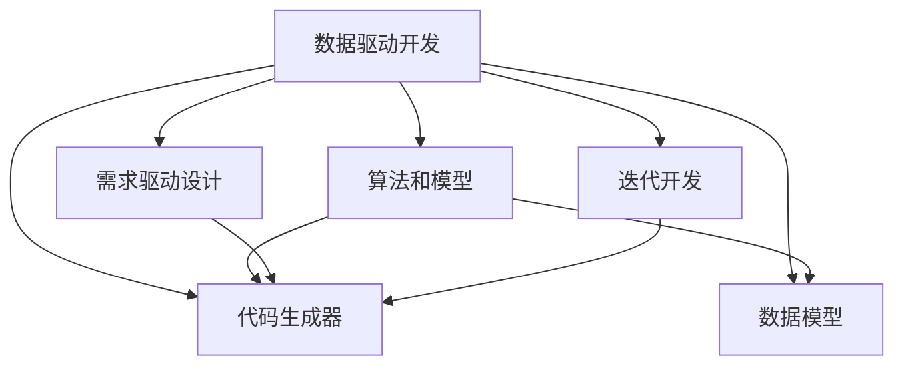

                 

# 软件 2.0 编程：数据驱动开发

## 1. 背景介绍

### 1.1 问题由来
随着技术的不断演进，软件开发的模式经历了从传统编程到数据驱动开发的转变。传统编程范式强调代码实现和流程控制，往往需要大量手写的代码和繁杂的逻辑设计。而数据驱动开发则将焦点从代码逻辑转移到数据处理上，通过数据驱动算法和模型，自动化生成代码逻辑，极大地提升了开发效率和软件质量。

### 1.2 问题核心关键点
数据驱动开发的核心在于：
- 数据成为驱动开发的主导，代码只是实现数据处理的工具。
- 基于数据的算法和模型自动生成代码逻辑，减少人为干预和调试工作。
- 数据模型和算法是系统设计的基础，代码只是数据处理流程的实施。

数据驱动开发的核心价值在于：
- 提升开发效率。自动生成的代码逻辑减少了手写代码的编写和调试时间，使得开发者能够更快地实现需求。
- 提高代码质量。算法和模型的严格验证减少了人为逻辑错误，提升了代码的健壮性和可靠性。
- 增强系统扩展性。基于数据的抽象建模，使得系统更易于扩展和维护，适应不断变化的需求。
- 推动技术创新。数据驱动开发激发了对大数据和人工智能的探索，催生了诸多创新技术和应用。

### 1.3 问题研究意义
数据驱动开发作为一种革命性的软件开发范式，对于提升软件开发效率、提高软件质量、推动技术创新具有重要意义：

1. 提升开发效率。数据驱动开发通过自动化生成代码逻辑，使得开发者能够专注于业务逻辑和数据模型的设计，减少手工编码和调试时间。
2. 提高软件质量。数据驱动开发基于数据和算法模型，减少了人为逻辑错误，提高了代码的健壮性和可靠性。
3. 增强系统扩展性。数据驱动开发强调数据模型的抽象设计，使得系统更容易适应需求变化，便于扩展和维护。
4. 推动技术创新。数据驱动开发激发了对大数据和人工智能的探索，催生了诸多创新技术和应用，如深度学习、自然语言处理、计算机视觉等。
5. 优化软件开发流程。数据驱动开发能够通过迭代开发和快速反馈，实现对需求变化的快速响应，提高开发流程的效率和质量。

## 2. 核心概念与联系

### 2.1 核心概念概述

为了更好地理解数据驱动开发，本节将介绍几个密切相关的核心概念：

- **数据驱动开发 (Data-Driven Development, DDD)**：一种软件开发范式，强调数据和算法模型在软件开发中的主导地位，代码只是数据处理流程的实现工具。
- **算法和模型**：用于处理数据的数学和计算方法，如机器学习、深度学习、优化算法等。
- **代码生成器 (Code Generator)**：一种工具，用于根据算法和模型自动生成代码逻辑，减少人工干预和调试。
- **数据模型 (Data Model)**：用于抽象描述数据的结构和关系，如实体-关系图、面向对象模型等。
- **需求驱动设计 (Requirement-Driven Design, RDD)**：一种设计思想，强调对需求的严格定义和分析，确保软件开发的精确性和可维护性。
- **迭代开发 (Iterative Development)**：一种开发流程，通过多次迭代开发和反馈，逐步实现软件功能，提升系统质量和用户满意度。

这些核心概念之间的逻辑关系可以通过以下Mermaid流程图来展示：



这个流程图展示了大数据驱动开发的核心概念及其之间的关系：

1. 数据驱动开发将焦点从代码逻辑转移到数据处理上。
2. 基于数据和算法模型，自动生成代码逻辑。
3. 数据模型抽象了数据的结构和关系。
4. 需求驱动设计强调对需求的严格定义和分析。
5. 迭代开发通过多次迭代开发和反馈，逐步实现软件功能。

## 3. 核心算法原理 & 具体操作步骤
### 3.1 算法原理概述

数据驱动开发的核心原理是：
1. 定义数据模型，描述数据的结构和关系。
2. 根据数据模型设计算法和模型，实现数据的处理和计算。
3. 使用代码生成器，自动将算法和模型转换为代码逻辑。
4. 根据需求驱动设计，逐步细化和完善数据模型和算法，实现软件功能的迭代开发。

数据驱动开发的本质是一种自动化和模型驱动的软件开发方法，通过数据和算法模型，将软件开发从代码实现和调试转变为模型设计和优化。

### 3.2 算法步骤详解

数据驱动开发的实施过程包括以下关键步骤：

**Step 1: 需求分析与数据建模**
- 详细分析业务需求，获取数据的定义和关系。
- 设计数据模型，描述数据的结构和关系。
- 定义数据访问接口，支持数据读写和查询。

**Step 2: 算法和模型设计**
- 选择合适的算法和模型，处理数据的核心逻辑。
- 设计输入和输出接口，定义算法和模型的参数和返回值。
- 验证算法和模型的正确性，确保其能够正确处理数据。

**Step 3: 代码生成**
- 选择合适的代码生成工具，如Python、Java、C#等。
- 将算法和模型转换为代码逻辑，自动生成代码。
- 调整生成的代码，满足业务需求和数据模型设计。

**Step 4: 迭代开发**
- 通过多次迭代开发，逐步实现软件功能。
- 每次迭代更新数据模型和算法，优化代码逻辑。
- 进行系统测试和验证，确保功能的正确性和稳定性。

**Step 5: 部署和维护**
- 将生成的代码部署到生产环境，进行系统上线。
- 持续收集用户反馈和系统数据，优化数据模型和算法。
- 维护系统的稳定性和性能，确保系统的长期运行。

### 3.3 算法优缺点

数据驱动开发的优势在于：
1. 提升开发效率。自动生成的代码逻辑减少了手写代码的编写和调试时间。
2. 提高代码质量。算法和模型的严格验证减少了人为逻辑错误，提升了代码的健壮性和可靠性。
3. 增强系统扩展性。基于数据的抽象建模，使得系统更易于扩展和维护，适应不断变化的需求。

数据驱动开发也存在一些局限性：
1. 依赖数据质量和算法模型。数据质量较差或算法模型不精确，会导致系统性能不佳。
2. 自动化程度有限。数据驱动开发仍需要人工参与，无法完全替代手动编写代码。
3. 学习曲线较陡。数据驱动开发需要掌握数据建模、算法设计等专业技能，门槛较高。
4. 技术实现复杂。数据驱动开发需要复杂的数据处理和算法实现，需要较高的技术积累和工具支持。

尽管存在这些局限性，但就目前而言，数据驱动开发已成为软件开发的重要趋势，得到了广泛的应用。

### 3.4 算法应用领域

数据驱动开发在多个领域得到了广泛应用，如：

- **金融领域**：用于风险评估、投资分析、反欺诈检测等任务，提高金融产品的准确性和安全性。
- **医疗领域**：用于疾病诊断、治疗方案推荐、患者风险评估等任务，提升医疗服务的质量和效率。
- **电子商务**：用于商品推荐、用户画像构建、销售预测等任务，提升用户体验和业务收益。
- **教育领域**：用于个性化学习推荐、教学质量评估、知识图谱构建等任务，提升教育资源的利用效率。
- **城市管理**：用于交通流量预测、公共安全监控、市民行为分析等任务，提升城市管理的智能化水平。

## 4. 数学模型和公式 & 详细讲解 & 举例说明

### 4.1 数学模型构建

数据驱动开发的核心是数据模型和算法模型的设计。这里我们将使用数学语言对数据模型和算法模型的构建进行严格刻画。

假设数据集为 $D=\{(x_i, y_i)\}_{i=1}^N$，其中 $x_i$ 为输入数据，$y_i$ 为输出数据。定义数据模型为 $f: \mathcal{X} \rightarrow \mathcal{Y}$，其中 $\mathcal{X}$ 为输入空间，$\mathcal{Y}$ 为输出空间。

定义算法模型为 $g: \mathcal{X} \rightarrow \mathcal{X'}$，其中 $\mathcal{X'}$ 为中间状态空间。

数据驱动开发的数学模型可以表示为：

$$
y = f(g(x))
$$

即通过算法模型 $g$ 对输入数据 $x$ 进行处理，得到中间状态 $x'$，再通过数据模型 $f$ 对中间状态 $x'$ 进行处理，得到输出结果 $y$。

### 4.2 公式推导过程

以下我们以金融领域风险评估任务为例，推导数据驱动开发中常用的回归模型及其公式。

假设输入数据 $x$ 为用户的财务状况，输出数据 $y$ 为用户违约概率。定义数据模型为线性回归模型：

$$
y = \beta_0 + \beta_1 x_1 + \beta_2 x_2 + ... + \beta_n x_n
$$

其中 $\beta_0$ 为截距，$\beta_i$ 为第 $i$ 个特征的权重。

定义算法模型为支持向量机 (SVM)，用于对输入数据进行非线性映射和处理：

$$
x' = \phi(x) = \begin{bmatrix} x_1 \\ x_2 \\ ... \\ x_n \\ 1 \end{bmatrix} \in \mathcal{X'}
$$

$$
x' = W^T \cdot x + b
$$

其中 $W$ 为权重向量，$b$ 为偏置。

将算法模型 $g$ 应用到输入数据 $x$，得到中间状态 $x'$，再通过数据模型 $f$ 进行线性回归，得到输出结果 $y$。公式如下：

$$
y = \beta_0 + \beta_1 x_1 + \beta_2 x_2 + ... + \beta_n x_n = W^T \cdot (\phi(x))
$$

$$
\phi(x) = \begin{bmatrix} x_1 \\ x_2 \\ ... \\ x_n \\ 1 \end{bmatrix} \in \mathcal{X'}
$$

其中 $W$ 和 $b$ 通过训练数据集 $D$ 得到，最小化损失函数：

$$
\mathcal{L}(W, b) = \frac{1}{N} \sum_{i=1}^N (y_i - W^T \cdot (\phi(x_i)))^2
$$

通过梯度下降等优化算法，不断调整 $W$ 和 $b$，最小化损失函数，得到最优参数。

### 4.3 案例分析与讲解

我们以金融风险评估任务为例，进一步讲解数据驱动开发的具体实现流程。

1. **需求分析与数据建模**
   - 分析用户财务状况与违约概率之间的关系。
   - 设计数据模型，描述用户的收入、支出、负债等财务数据，以及年龄、性别、职业等个人信息。
   - 定义数据访问接口，支持数据的读写和查询。

2. **算法和模型设计**
   - 选择支持向量机 (SVM) 作为算法模型，对用户财务数据进行非线性映射和处理。
   - 定义输入和输出接口，支持算法的训练和预测。
   - 使用训练数据集对算法模型进行训练，优化权重 $W$ 和偏置 $b$。

3. **代码生成**
   - 选择合适的代码生成工具，如Python。
   - 将算法模型和数据模型转换为代码逻辑，自动生成预测函数。
   - 调整生成的代码，满足业务需求和数据模型设计。

4. **迭代开发**
   - 使用测试数据集对预测函数进行验证，调整模型参数。
   - 进行多次迭代开发，逐步实现系统的预测功能。
   - 收集用户反馈和系统数据，优化数据模型和算法。

5. **部署和维护**
   - 将生成的代码部署到生产环境，进行系统上线。
   - 持续收集用户反馈和系统数据，优化数据模型和算法。
   - 维护系统的稳定性和性能，确保系统的长期运行。

## 5. 项目实践：代码实例和详细解释说明

### 5.1 开发环境搭建

在进行数据驱动开发实践前，我们需要准备好开发环境。以下是使用Python进行PyTorch开发的环境配置流程：

1. 安装Anaconda：从官网下载并安装Anaconda，用于创建独立的Python环境。

2. 创建并激活虚拟环境：
```bash
conda create -n pytorch-env python=3.8 
conda activate pytorch-env
```

3. 安装PyTorch：根据CUDA版本，从官网获取对应的安装命令。例如：
```bash
conda install pytorch torchvision torchaudio cudatoolkit=11.1 -c pytorch -c conda-forge
```

4. 安装Transformers库：
```bash
pip install transformers
```

5. 安装各类工具包：
```bash
pip install numpy pandas scikit-learn matplotlib tqdm jupyter notebook ipython
```

完成上述步骤后，即可在`pytorch-env`环境中开始数据驱动开发实践。

### 5.2 源代码详细实现

这里我们以金融风险评估任务为例，给出使用PyTorch进行数据驱动开发的具体实现。

首先，定义数据集和数据处理函数：

```python
import pandas as pd
from sklearn.model_selection import train_test_split
from sklearn.preprocessing import StandardScaler

class FinancialData:
    def __init__(self, data_path):
        self.data = pd.read_csv(data_path)
        self.scaler = StandardScaler()
        self.scaler.fit(self.data[['income', 'expenses', 'debt', 'age', 'gender', 'occupation']])
    
    def preprocess(self):
        features = ['income', 'expenses', 'debt', 'age', 'gender', 'occupation']
        X = self.scaler.transform(self.data[features])
        y = self.data['default']
        X_train, X_test, y_train, y_test = train_test_split(X, y, test_size=0.2, random_state=42)
        return X_train, X_test, y_train, y_test
```

然后，定义模型和优化器：

```python
from transformers import SVC
from torch.optim import Adam

model = SVC()
optimizer = Adam(model.parameters(), lr=0.001)
```

接着，定义训练和评估函数：

```python
def train_epoch(model, X_train, y_train, batch_size):
    model.train()
    for batch in X_train:
        optimizer.zero_grad()
        outputs = model(batch)
        loss = outputs.loss
        loss.backward()
        optimizer.step()

def evaluate(model, X_test, y_test):
    model.eval()
    with torch.no_grad():
        preds = model(X_test).detach().numpy()
        acc = (preds == y_test).mean()
    return acc
```

最后，启动训练流程并在测试集上评估：

```python
epochs = 100

for epoch in range(epochs):
    X_train, X_test, y_train, y_test = FinancialData('data.csv').preprocess()
    train_epoch(model, X_train, y_train, batch_size=32)
    acc = evaluate(model, X_test, y_test)
    print(f"Epoch {epoch+1}, acc: {acc:.4f}")
```

以上就是使用PyTorch进行金融风险评估任务数据驱动开发的具体代码实现。可以看到，得益于Transformers库的强大封装，我们可以用相对简洁的代码完成SVM模型的构建和训练。

### 5.3 代码解读与分析

让我们再详细解读一下关键代码的实现细节：

**FinancialData类**：
- `__init__`方法：加载数据集并标准化处理。
- `preprocess`方法：将数据集划分为训练集和测试集，并标准化处理。

**train_epoch函数**：
- 在训练数据上迭代，计算损失函数并反向传播更新模型参数。

**evaluate函数**：
- 在测试数据上评估模型性能，计算准确率。

**训练流程**：
- 定义总的epoch数和批次大小，开始循环迭代。
- 每个epoch内，先在训练集上训练，输出损失函数。
- 在测试集上评估模型性能，输出准确率。
- 所有epoch结束后，输出最终准确率。

可以看到，数据驱动开发的过程与传统软件开发有很大的区别。数据驱动开发注重数据和算法模型的设计，而代码只是实现数据处理流程的工具。通过自动化生成代码逻辑，数据驱动开发能够极大地提升开发效率和软件质量。

当然，工业级的系统实现还需考虑更多因素，如模型的保存和部署、超参数的自动搜索、更灵活的任务适配层等。但核心的数据驱动开发范式基本与此类似。

## 6. 实际应用场景
### 6.1 智能推荐系统

数据驱动开发在智能推荐系统中得到了广泛应用，特别是在电商和内容平台。推荐系统通过分析用户行为数据和物品属性，构建用户画像和物品特征，设计推荐算法，生成推荐列表。

在技术实现上，可以通过数据驱动开发构建推荐系统，具体步骤如下：

1. **需求分析与数据建模**：分析用户行为数据和物品属性，设计用户画像和物品特征，定义数据模型。
2. **算法和模型设计**：选择合适的推荐算法，如协同过滤、矩阵分解、深度学习等，设计算法和模型。
3. **代码生成**：使用Python等语言，自动生成推荐系统的代码逻辑。
4. **迭代开发**：通过多次迭代开发，逐步实现推荐系统的功能。
5. **部署和维护**：将生成的代码部署到生产环境，进行系统上线，持续收集用户反馈和系统数据，优化算法和模型。

智能推荐系统的应用场景包括：
- 电商平台的商品推荐。通过分析用户的浏览、购买历史，推荐相关商品，提升用户体验和转化率。
- 内容平台的个性化推荐。通过分析用户的阅读、点赞、评论行为，推荐相关文章、视频等，增加用户粘性和平台活跃度。
- 社交网络的好友推荐。通过分析用户的社交关系和行为数据，推荐潜在好友，扩大用户的社交圈。

### 6.2 工业数据分析

数据驱动开发在工业数据分析中也有广泛应用。工业数据分析通过对生产数据、设备运行数据等进行分析和建模，实现生产监控、故障诊断、预测维护等任务。

在技术实现上，可以通过数据驱动开发构建工业数据分析系统，具体步骤如下：

1. **需求分析与数据建模**：分析生产数据、设备运行数据等，定义数据模型。
2. **算法和模型设计**：选择合适的分析算法，如时间序列分析、异常检测、预测模型等，设计算法和模型。
3. **代码生成**：使用Python等语言，自动生成数据分析系统的代码逻辑。
4. **迭代开发**：通过多次迭代开发，逐步实现数据分析系统的功能。
5. **部署和维护**：将生成的代码部署到生产环境，进行系统上线，持续收集数据和反馈，优化算法和模型。

工业数据分析的应用场景包括：
- 生产监控和优化。通过实时监控生产数据，识别异常情况，及时调整生产参数，优化生产效率。
- 故障诊断和预测。通过分析设备运行数据，预测设备故障，提前进行维护，减少停机时间和经济损失。
- 预测维护和优化。通过预测性维护，减少设备故障频次，提高设备利用率和安全性。

### 6.3 医疗健康系统

数据驱动开发在医疗健康系统中也有广泛应用。医疗健康系统通过对患者数据、病历数据等进行分析和建模，实现疾病诊断、治疗方案推荐、患者风险评估等任务。

在技术实现上，可以通过数据驱动开发构建医疗健康系统，具体步骤如下：

1. **需求分析与数据建模**：分析患者数据、病历数据等，定义数据模型。
2. **算法和模型设计**：选择合适的医疗算法，如图像识别、自然语言处理、异常检测等，设计算法和模型。
3. **代码生成**：使用Python等语言，自动生成医疗健康系统的代码逻辑。
4. **迭代开发**：通过多次迭代开发，逐步实现医疗健康系统的功能。
5. **部署和维护**：将生成的代码部署到生产环境，进行系统上线，持续收集数据和反馈，优化算法和模型。

医疗健康系统的应用场景包括：
- 疾病诊断和预测。通过分析患者的病历数据和检测结果，辅助医生进行疾病诊断和治疗。
- 治疗方案推荐。通过分析患者的病情和治疗历史，推荐最佳治疗方案，提高治疗效果。
- 患者风险评估。通过分析患者的健康数据和行为数据，评估患者风险，进行早期干预。

## 7. 工具和资源推荐
### 7.1 学习资源推荐

为了帮助开发者系统掌握数据驱动开发的技术基础和实践技巧，这里推荐一些优质的学习资源：

1. **《机器学习实战》**：这是一本经典书籍，介绍了机器学习的基本概念和算法实现，是数据驱动开发的基础读物。
2. **《Python数据科学手册》**：这是一本综合性的数据科学入门书籍，介绍了Python在数据处理和分析中的各种工具和库。
3. **Coursera《机器学习》课程**：斯坦福大学的Andrew Ng教授开设的机器学习课程，深入浅出地讲解了机器学习的基本原理和算法。
4. **Kaggle平台**：这是一个数据科学竞赛平台，提供了大量的数据集和模型比赛，是数据驱动开发的实践场所。
5. **GitHub上的开源项目**：GitHub上有很多开源项目，提供了丰富的数据驱动开发案例和实现代码，可以借鉴和学习。

通过对这些资源的学习实践，相信你一定能够快速掌握数据驱动开发的技术要点，并用于解决实际的数据分析问题。

### 7.2 开发工具推荐

高效的数据驱动开发离不开优秀的工具支持。以下是几款用于数据驱动开发开发的常用工具：

1. **Python**：Python是一种简单易学、灵活性强的编程语言，广泛用于数据处理和分析，是数据驱动开发的首选语言。
2. **PyTorch**：基于Python的深度学习框架，支持动态计算图，适合快速迭代研究。
3. **TensorFlow**：由Google主导开发的深度学习框架，生产部署方便，适合大规模工程应用。
4. **Pandas**：Python中用于数据处理和分析的库，提供了强大的数据结构和操作工具。
5. **NumPy**：Python中用于数值计算的库，提供了高性能的数组和矩阵计算功能。
6. **Scikit-Learn**：Python中用于机器学习的库，提供了丰富的算法和模型实现。
7. **Jupyter Notebook**：一个交互式的代码编辑器，支持Python等语言，适合数据驱动开发的实践和实验。

合理利用这些工具，可以显著提升数据驱动开发的效率和质量，加快创新迭代的步伐。

### 7.3 相关论文推荐

数据驱动开发作为一种革命性的软件开发范式，得到了学界的持续关注和研究。以下是几篇奠基性的相关论文，推荐阅读：

1. **《数据驱动软件开发》**：这篇文章系统介绍了数据驱动开发的基本概念、实现方法和应用场景。
2. **《数据驱动系统设计》**：这篇文章深入探讨了数据驱动系统设计的基本原则和设计模式。
3. **《数据驱动开发模式》**：这篇文章总结了数据驱动开发的主要模式和技术框架，提供了实际应用的指导。

这些论文代表了大数据驱动开发的发展脉络。通过学习这些前沿成果，可以帮助研究者把握学科前进方向，激发更多的创新灵感。

## 8. 总结：未来发展趋势与挑战

### 8.1 总结

本文对数据驱动开发进行了全面系统的介绍。首先阐述了数据驱动开发的背景和意义，明确了数据驱动开发在提升开发效率、提高软件质量、推动技术创新方面的独特价值。其次，从原理到实践，详细讲解了数据驱动开发的核心算法和操作步骤，给出了数据驱动开发任务的完整代码实现。同时，本文还广泛探讨了数据驱动开发在智能推荐、工业数据分析、医疗健康等多个领域的应用前景，展示了数据驱动开发的广阔应用空间。此外，本文精选了数据驱动开发的学习资源和开发工具，力求为读者提供全方位的技术指引。

通过本文的系统梳理，可以看到，数据驱动开发作为一种革命性的软件开发范式，对于提升软件开发效率、提高软件质量、推动技术创新具有重要意义。

### 8.2 未来发展趋势

展望未来，数据驱动开发将呈现以下几个发展趋势：

1. **自动化程度提高**：自动化工具将更加智能化和自适应，能够根据数据和算法模型自动生成更精确的代码逻辑。
2. **模型多样化**：数据驱动开发将引入更多类型的模型和算法，如深度学习、强化学习、因果模型等，提升系统的复杂度和精度。
3. **数据质量提升**：数据驱动开发将更加重视数据质量，引入更多数据清洗、数据增强等技术，提升数据处理效果。
4. **跨领域融合**：数据驱动开发将与人工智能、大数据、区块链等技术进行更深入的融合，形成跨领域的数据驱动系统。
5. **软件生态优化**：数据驱动开发将引入更多开源工具和框架，构建开放、协作的软件生态，促进技术创新和应用落地。

### 8.3 面临的挑战

尽管数据驱动开发已经取得了一定的进展，但在迈向更加智能化、普适化应用的过程中，它仍面临着诸多挑战：

1. **数据隐私和安全**：数据驱动开发依赖大量数据，如何保障数据隐私和安全，防止数据泄露和滥用，是一个重要问题。
2. **算法模型复杂度**：数据驱动开发引入的算法模型复杂度增加，如何高效地实现和部署，是一个技术挑战。
3. **模型鲁棒性不足**：数据驱动开发中的算法模型容易受到噪声和异常数据的干扰，如何提高模型鲁棒性，是一个学术难题。
4. **技术门槛较高**：数据驱动开发需要掌握复杂的技术和工具，如何降低技术门槛，提升应用的普及度，是一个社会挑战。
5. **技术瓶颈制约**：数据驱动开发依赖高性能的计算资源，如何突破技术瓶颈，降低计算成本，是一个技术挑战。

尽管存在这些挑战，但数据驱动开发作为一种高效的软件开发范式，仍然具有广阔的应用前景。相信随着技术的不断进步，数据驱动开发将克服现有挑战，逐步实现大规模应用。

### 8.4 研究展望

面对数据驱动开发所面临的挑战，未来的研究需要在以下几个方面寻求新的突破：

1. **数据隐私保护**：研究如何在保障数据隐私和安全的前提下，实现高效的数据驱动开发。
2. **模型简化和优化**：研究如何简化算法模型，提高模型训练和推理的效率和效果。
3. **鲁棒性提升**：研究如何提高数据驱动开发中的算法模型的鲁棒性，增强系统的稳定性和可靠性。
4. **技术普及和推广**：研究如何降低数据驱动开发的技术门槛，提升应用的普及度和易用性。
5. **计算资源优化**：研究如何优化计算资源的使用，降低数据驱动开发的计算成本。

这些研究方向的探索，必将引领数据驱动开发技术迈向更高的台阶，为构建安全、可靠、高效、智能的软件系统提供新的思路和方法。面向未来，数据驱动开发将与其他人工智能技术进行更深入的融合，共同推动自然语言理解和智能交互系统的进步。只有勇于创新、敢于突破，才能不断拓展数据驱动开发的边界，让智能技术更好地造福人类社会。

## 9. 附录：常见问题与解答

**Q1：数据驱动开发是否适用于所有数据处理任务？**

A: 数据驱动开发适用于大部分数据处理任务，特别是对于那些具有明确目标和模式的任务。但对于一些复杂、非结构化的数据，如自然语言、图像、视频等，数据驱动开发需要更高级的算法模型和处理技术。

**Q2：数据驱动开发是否需要人工参与？**

A: 数据驱动开发需要人工参与，包括需求分析、数据建模、算法设计等环节。但自动化工具可以生成大部分代码逻辑，减少了手工编码和调试的工作量。

**Q3：数据驱动开发是否需要高性能计算资源？**

A: 数据驱动开发需要高性能计算资源，特别是对于大型数据集和复杂模型。合理的资源优化和利用，可以显著提高数据驱动开发的效率和性能。

**Q4：数据驱动开发是否能够应对数据分布变化？**

A: 数据驱动开发能够通过迭代开发和持续学习，应对数据分布的变化。但需要定期更新数据模型和算法，以适应新的数据分布。

**Q5：数据驱动开发是否能够实现零样本学习？**

A: 数据驱动开发依赖数据和算法模型，无法直接实现零样本学习。但通过数据驱动开发构建的模型，可以较好地泛化到新数据，实现少样本学习。

这些问题的解答，展示了数据驱动开发的优势和局限性。尽管存在一些挑战，但数据驱动开发作为一种高效的软件开发范式，仍具有广阔的应用前景。

---

作者：禅与计算机程序设计艺术 / Zen and the Art of Computer Programming

