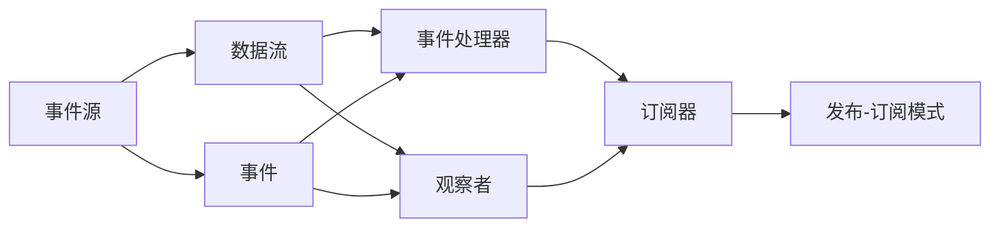

                 

# 软件2.0的响应式编程范式

## 1. 背景介绍

在过去的几十年中，软件工程领域经历了显著的变革，从面向过程的编程（1.0）时代，到面向对象的编程（2.0）时代，再到如今蓬勃发展的响应式编程（3.0）时代。响应式编程（Reactive Programming），作为编程范式的一个重大突破，正逐渐成为构建复杂系统的基石。本文将深入探讨响应式编程的原理、应用及其未来发展趋势，为开发者提供一套全面而深入的响应式编程指南。

## 2. 核心概念与联系

### 2.1 核心概念概述

响应式编程（Reactive Programming）是一种编程范式，旨在通过数据流来简化复杂的系统构建。与传统的命令式编程或事件驱动编程相比，响应式编程更加注重数据的流动和响应，能够在异步、高并发的系统中提供更加清晰、高效和可扩展的解决方案。

- **响应式编程模型**：响应式编程通过数据流（Data Streams）和事件（Events）来描述程序的逻辑。每个数据流可以产生多个事件，这些事件可以异步传播，并在多个组件间进行互操作。

- **数据流（Data Streams）**：数据流是响应式编程的核心概念，可以看作是单向流动的元素序列。数据流中的每个元素都可以触发一系列事件，从而推动系统的更新和响应。

- **事件（Events）**：事件是数据流之间的通信机制，用于通知其他数据流或组件某个事件的发生。事件可以是异步的，可以在不同的数据流之间传播。

- **反应式库（Reactive Libraries）**：反应式库是实现响应式编程的基础设施，如RxJava、ReactiveX、Angular等。这些库提供了丰富的API，使得开发者能够轻松构建响应式系统。

### 2.2 核心概念原理和架构的 Mermaid 流程图



该图展示了响应式编程的基本架构，包括数据流、事件、事件源、事件处理器、观察者和订阅器，并通过发布-订阅模式实现数据流的通信。数据流从事件源生成，事件处理器负责处理和传递事件，观察者订阅数据流并触发相关事件，而订阅器则管理事件处理器的生命周期。

## 3. 核心算法原理 & 具体操作步骤

### 3.1 算法原理概述

响应式编程的核心在于其基于事件流的异步数据处理机制。传统的同步编程方式，每个操作需要阻塞等待前一个操作的结果，而响应式编程则通过事件流来解耦各个操作，使得它们可以并行执行。

- **单向数据流**：响应式编程中的数据流是单向的，从源头开始流动，经过多个中间环节，最终到达观察者。这种单向性保证了数据流的一致性和可靠性。

- **异步处理**：响应式编程通过异步机制来处理数据流的生成和传播，可以大大提升系统的并发能力和性能。

- **无状态设计**：响应式编程通常采用无状态设计，每个操作都是独立的，不需要保存中间状态，易于实现分布式计算和并发处理。

### 3.2 算法步骤详解

响应式编程的实现步骤如下：

1. **定义数据源**：
   - 数据源可以是任何生成数据流或事件的组件，如网络请求、传感器数据、用户输入等。

2. **创建数据流**：
   - 使用反应式库提供的API创建数据流，并将数据源连接到此数据流。

3. **处理和传播事件**：
   - 将事件处理器连接到数据流中，处理数据流中的事件，并根据需要传播事件到其他数据流或组件。

4. **订阅和观察数据流**：
   - 使用观察者订阅数据流，以获得数据流中的更新信息。

5. **响应数据流变化**：
   - 观察者根据数据流中的事件，触发相应的操作或更新状态。

6. **发布和订阅模式**：
   - 使用发布-订阅模式来实现数据流之间的通信，确保数据流的一致性和可靠性。

### 3.3 算法优缺点

响应式编程的优点包括：

- **提升并发性能**：通过异步处理和数据流通信，响应式编程能够有效提升系统的并发性能和响应速度。

- **降低耦合度**：响应式编程通过事件流和观察者机制，减少了组件之间的耦合度，使得系统更易于维护和扩展。

- **简化异步编程**：响应式编程提供了丰富的API和工具，简化了异步编程的复杂性，降低了开发难度。

然而，响应式编程也存在一些缺点：

- **学习曲线陡峭**：响应式编程需要掌握新的编程范式和工具，对开发者有一定的学习成本。

- **调试难度较大**：由于响应式编程的数据流和事件流特性，调试起来相对复杂，需要具备一定的经验和技巧。

- **性能问题**：尽管响应式编程能够提升并发性能，但如果设计不当，也可能出现性能瓶颈，如内存泄漏、事件堆积等。

### 3.4 算法应用领域

响应式编程在多个领域都有广泛的应用，特别是在数据处理和用户界面（UI）开发中。

- **数据处理**：在金融、物流、电信等领域，响应式编程被广泛应用于数据流的处理和分析，能够高效地处理大规模数据。

- **Web UI开发**：响应式编程通过Angular、React等框架，被广泛应用于Web UI开发，能够实现高性能、动态的UI界面。

- **移动开发**：响应式编程通过RxAndroid、SwiftUI等框架，被广泛应用于移动开发，能够实现流畅的动画效果和用户交互。

- **服务器端编程**：响应式编程通过Vert.x、Netty等框架，被广泛应用于服务器端编程，能够实现高并发的网络通信和数据处理。

## 4. 数学模型和公式 & 详细讲解 & 举例说明

### 4.1 数学模型构建

响应式编程的数学模型主要基于数据流和事件流的设计。

- **数据流模型**：数据流模型可以用信号流的形式来表示，每个数据流可以视为一个信号流，流中的每个元素对应于信号中的一个值。

- **事件流模型**：事件流模型可以用事件源和事件处理器来表示，事件源发出事件，事件处理器处理事件并通知观察者。

### 4.2 公式推导过程

假设有一个数据流`A`，其产生一个事件，事件处理器`B`处理该事件，并生成另一个事件，观察者`C`订阅该事件。

- **数据流模型**：
  $$
  A \rightarrow B \rightarrow C
  $$

- **事件流模型**：
  - **事件产生**：`A`生成事件`e1`，`B`处理`e1`生成事件`e2`。
  
  - **事件处理**：`A`发出事件`e1`，`B`处理事件`e1`，并发出事件`e2`。

  - **事件通知**：`B`将事件`e2`通知观察者`C`。

### 4.3 案例分析与讲解

假设有一个实时股票行情系统，需要实时获取股票价格数据，并根据价格变化更新UI界面。

- **数据流模型**：
  - **数据源**：股票API。
  - **数据流**：`A`（股票价格数据流）。
  - **事件处理器**：`B`（股票价格处理器），处理数据流中的价格变化。
  - **观察者**：`C`（UI界面），订阅数据流并更新UI界面。

- **事件流模型**：
  - **事件产生**：`A`生成股票价格数据。
  - **事件处理**：`B`处理股票价格变化，并发出价格更新事件。
  - **事件通知**：`C`根据价格更新事件，更新UI界面。

## 5. 项目实践：代码实例和详细解释说明

### 5.1 开发环境搭建

响应式编程通常使用Java、Scala、Swift等语言和RxJava、ReactiveX、Angular等框架进行开发。这里以RxJava为例，介绍开发环境搭建。

1. **安装Java环境**：
   - 从官网下载并安装Java SE Development Kit。

2. **安装RxJava**：
   - 在项目中引入RxJava依赖，例如在Maven中引入：
     ```xml
     <dependency>
       <groupId>io.reactivex</groupId>
       <artifactId>rxjava</artifactId>
       <version>2.x.x</version>
     </dependency>
     ```

3. **编写RxJava代码**：
   - 编写Java代码，使用RxJava API创建数据流和处理事件。

### 5.2 源代码详细实现

以下是一个简单的RxJava代码示例，用于实现一个实时数据流：

```java
import io.reactivex.Observable;
import io.reactivex.schedulers.Schedulers;

public class ReactiveProgrammingExample {
    public static void main(String[] args) {
        // 创建一个Observable对象，表示数据流
        Observable<String> dataStream = Observable.create(source -> {
            // 生成数据流中的元素
            for (int i = 0; i < 10; i++) {
                source.onNext("Data " + i);
                source.onComplete();
            }
        });

        // 在另一个线程中处理数据流
        Observable<String> processedDataStream = dataStream.subscribeOn(Schedulers.io())
                .map(data -> data.toUpperCase());

        // 订阅处理后的数据流，并打印输出
        processedDataStream.subscribe(System.out::println);
    }
}
```

### 5.3 代码解读与分析

以上代码展示了RxJava的基本用法，包括创建数据流、处理数据流和订阅数据流：

- **创建数据流**：通过`Observable.create`方法创建数据流，生成10个"Data "字符串。
- **处理数据流**：使用`subscribeOn`方法指定处理数据流的线程，使用`map`方法将数据流中的元素转换为大写。
- **订阅数据流**：使用`subscribe`方法订阅处理后的数据流，并打印输出。

### 5.4 运行结果展示

运行以上代码，输出结果如下：

```
Data 0
Data 1
Data 2
Data 3
Data 4
Data 5
Data 6
Data 7
Data 8
Data 9
```

以上结果展示了数据流从创建、处理到订阅的全过程，每个"Data "字符串都被转换为了大写形式。

## 6. 实际应用场景

### 6.1 实时数据处理

响应式编程在实时数据处理中有着广泛的应用，例如：

- **数据采集**：从传感器、日志文件等数据源实时采集数据，并进行处理和分析。

- **流式计算**：对实时数据进行流式计算和分析，如实时监控、实时推荐、实时统计等。

- **实时交易**：金融交易系统中，实时处理订单和交易数据，确保系统的稳定性和高性能。

### 6.2 分布式系统

响应式编程在分布式系统中也有着重要作用，例如：

- **消息传递**：在微服务架构中，使用响应式编程模型实现消息传递，确保消息的可靠性和一致性。

- **分布式计算**：将复杂的计算任务分解为多个小任务，并通过响应式编程模型并行处理，提升系统的并行性能。

- **故障恢复**：在分布式系统中，响应式编程模型可以自动处理故障和异常情况，确保系统的稳定性和可靠性。

### 6.3 用户界面开发

响应式编程在用户界面开发中的应用也非常广泛，例如：

- **Web界面**：通过Angular、React等框架，实现高性能、动态的Web界面。

- **移动应用**：通过RxAndroid、SwiftUI等框架，实现流畅的动画效果和用户交互。

- **桌面应用**：通过JavaFX、KotlinFX等框架，实现高效的桌面应用开发。

## 7. 工具和资源推荐

### 7.1 学习资源推荐

响应式编程的学习资源非常丰富，以下是一些推荐的资源：

- **RxJava官方文档**：RxJava的官方文档提供了详细的API和示例代码，是学习RxJava的最佳资源。

- **《响应式编程：从理论到实践》**：这本书系统介绍了响应式编程的理论基础和实际应用，适合入门和进阶学习。

- **《Reactive Architecture Patterns》**：这本书详细介绍了响应式架构的设计模式和最佳实践，是响应式开发的重要参考资料。

- **《Java 8 in Action》**：这本书介绍了Java 8中的新特性，包括Lambda、Stream和Optional，是学习响应式编程的重要补充。

### 7.2 开发工具推荐

响应式编程常用的开发工具包括：

- **IDE**：IntelliJ IDEA、Eclipse等IDE提供了响应式编程的插件和支持，方便开发和调试。

- **文本编辑器**：Visual Studio Code、Atom等文本编辑器提供了丰富的插件和扩展，支持响应式编程。

- **构建工具**：Maven、Gradle等构建工具支持响应式编程的依赖管理。

### 7.3 相关论文推荐

响应式编程的研究非常活跃，以下是一些推荐的相关论文：

- **《The Reactive Manifesto》**：该文档阐述了响应式编程的核心原则和设计模式。

- **《Scalable Responsive Web Applications》**：该论文介绍了基于Angular的响应式Web应用开发。

- **《Building Reactive Systems》**：该论文系统介绍了响应式系统的设计和实现，提供了丰富的案例和示例。

## 8. 总结：未来发展趋势与挑战

### 8.1 研究成果总结

响应式编程作为编程范式的一种重要形式，已经在多个领域得到了广泛应用。其核心思想是通过事件流和数据流的异步处理，实现系统的并发和高效。

### 8.2 未来发展趋势

未来，响应式编程将在以下几个方面取得突破：

- **全栈响应式编程**：响应式编程将逐步渗透到更多的编程语言和开发平台，实现全栈响应式开发。

- **实时数据分析**：响应式编程将进一步应用于大数据和实时数据处理，提升数据处理效率和性能。

- **智能交互**：响应式编程将与人工智能、自然语言处理等技术结合，实现更加智能和人性化的用户交互。

- **分布式系统**：响应式编程将广泛应用于微服务架构、分布式计算等场景，提升系统的可扩展性和可靠性。

- **混合编程**：响应式编程将与其他编程范式结合，形成混合编程模型，实现更高效的系统开发。

### 8.3 面临的挑战

尽管响应式编程有着广泛的应用前景，但在实际开发中仍面临一些挑战：

- **学习曲线**：响应式编程需要掌握新的编程范式和工具，对开发者有一定的学习成本。

- **调试难度**：响应式编程的数据流和事件流特性，使得调试相对复杂，需要具备一定的经验和技巧。

- **性能问题**：尽管响应式编程能够提升并发性能，但如果设计不当，也可能出现性能瓶颈，如内存泄漏、事件堆积等。

### 8.4 研究展望

未来，响应式编程的研究方向将集中在以下几个方面：

- **优化响应式库**：优化响应式库的性能和稳定性，提升开发效率和用户体验。

- **增强工具支持**：开发更多的开发工具和插件，简化响应式编程的开发过程。

- **提升可读性**：通过代码风格和注释，提升响应式编程的可读性和可维护性。

- **扩展应用场景**：将响应式编程应用于更多的领域和场景，如物联网、工业控制、智能交通等。

总之，响应式编程作为编程范式的一种重要形式，其应用前景广阔，未来发展潜力巨大。开发者应积极学习和应用响应式编程，以提升系统的性能和效率，构建更加复杂、高效和智能的系统。

## 9. 附录：常见问题与解答

**Q1：响应式编程和事件驱动编程有什么区别？**

A: 响应式编程和事件驱动编程的区别主要在于其对事件的抽象和处理方式。事件驱动编程通常使用事件触发器（Event Trigger）来处理异步事件，而响应式编程则通过事件流和数据流来处理异步事件。事件流和数据流可以更好地描述复杂系统中的事件和数据关系，使得系统更加清晰和高效。

**Q2：如何调试响应式系统？**

A: 调试响应式系统需要掌握一些特定的技巧和方法。以下是一些常用的调试技巧：

- **日志记录**：通过日志记录数据流的元素和事件，帮助定位问题。

- **可视化工具**：使用可视化工具（如Eclipse Cheat Sheet、VisualVM等）来监控数据流和事件，识别性能瓶颈。

- **单元测试**：编写单元测试来测试数据流和事件处理器的正确性，确保系统稳定运行。

- **异步调试**：使用异步调试工具（如Thread-Dump、S本机调试工具）来调试异步事件的处理过程，确保事件的正确传递。

**Q3：响应式编程在多线程环境下需要注意哪些问题？**

A: 响应式编程在多线程环境下需要注意以下问题：

- **线程安全**：确保数据流和事件处理器的线程安全，避免并发访问导致的错误。

- **数据同步**：确保不同线程间的数据同步和通信，避免数据不一致问题。

- **异常处理**：确保在多线程环境下正确处理异常，避免系统崩溃。

- **性能优化**：优化数据流的生成和处理，提升系统的并发性能和响应速度。

总之，响应式编程作为编程范式的一种重要形式，其应用前景广阔，未来发展潜力巨大。开发者应积极学习和应用响应式编程，以提升系统的性能和效率，构建更加复杂、高效和智能的系统。

---

作者：禅与计算机程序设计艺术 / Zen and the Art of Computer Programming

