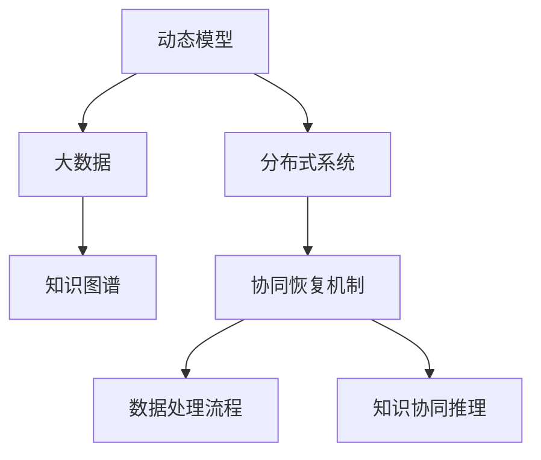

                 

## 1. 背景介绍

在软件工程领域，软件灾难恢复（Software Disaster Recovery, SDR）是保证系统可靠性和业务连续性的重要手段。软件2.0时代的到来，带来了大量智能软件系统的涌现，使得灾难恢复任务变得更加复杂和挑战。智能软件系统不仅包含了传统软件代码，还包括模型、数据、知识等复杂组件，传统的灾难恢复策略已难以应对。本文将系统介绍软件2.0时代下的灾难恢复策略，涵盖从设计、实现到维护的各个环节。

### 1.1 问题由来

在软件1.0时代，软件开发主要依赖于清晰的代码和固定的数据结构，灾难恢复任务相对简单。但软件2.0时代下，软件系统变得更加复杂和动态，主要包括：

- **动态模型**：基于机器学习、深度学习、人工智能等技术构建的模型，随着训练数据和环境的变化而动态变化。
- **分布式系统**：由多个计算节点和数据节点组成的系统，保证高可用性和高性能。
- **大数据**：庞大的数据集需要实时读写和处理，保证系统处理能力和存储能力。
- **知识图谱**：基于知识图谱构建的知识管理系统，包含大量的知识库、规则库和事实库，实现知识驱动的推理和决策。

这些复杂组件的存在使得软件系统的恢复变得更加困难，传统的灾难恢复策略已不再适用。

### 1.2 问题核心关键点

软件2.0时代的灾难恢复任务需要关注以下几个核心关键点：

- **动态模型的恢复**：模型参数和状态随着训练数据和环境变化，如何实现动态模型的快速恢复？
- **分布式系统的协同恢复**：分布式系统中各节点如何协同工作，保证快速恢复？
- **大数据的处理**：海量数据如何在灾难恢复过程中得到高效处理？
- **知识图谱的协同**：知识图谱中的知识如何在灾难恢复中发挥作用？

本文将针对这些关键点进行深入探讨。

## 2. 核心概念与联系

### 2.1 核心概念概述

为更好地理解软件2.0的灾难恢复策略，我们首先介绍几个核心概念：

- **动态模型（Dynamic Model）**：基于机器学习、深度学习等技术构建的模型，参数和状态随训练数据和环境动态变化。
- **分布式系统（Distributed System）**：由多个计算节点和数据节点组成，通过消息传递机制实现协同工作。
- **大数据（Big Data）**：包含海量的数据集，需要实时读写和处理，保证系统的高处理能力和存储能力。
- **知识图谱（Knowledge Graph）**：基于RDF（Resource Description Framework）构建的知识管理系统，包含知识库、规则库和事实库，用于知识驱动的推理和决策。

这些概念在软件2.0时代下扮演着重要角色，共同构成了软件系统的复杂结构。理解这些概念之间的关系，对于设计有效的灾难恢复策略至关重要。

### 2.2 核心概念原理和架构的 Mermaid 流程图(Mermaid 流程节点中不要有括号、逗号等特殊字符)



这个流程图展示了动态模型、分布式系统、大数据和知识图谱之间的关系，以及它们在灾难恢复中的协同作用。动态模型通过分布式系统的协同恢复机制进行恢复，大数据在分布式系统中得到高效处理，知识图谱在恢复过程中用于协同推理。

## 3. 核心算法原理 & 具体操作步骤
### 3.1 算法原理概述

软件2.0时代的灾难恢复任务，需要综合考虑动态模型、分布式系统、大数据和知识图谱的协同工作。其核心算法原理可以概括为以下几个方面：

1. **动态模型恢复算法**：通过快照机制保存模型参数和状态，在恢复过程中快速加载并更新模型。
2. **分布式系统协同恢复算法**：利用冗余备份和容错机制，保证系统的高可用性。
3. **大数据处理算法**：采用分布式存储和并行计算技术，实现海量数据的快速读写和处理。
4. **知识图谱协同推理算法**：利用知识图谱中的规则和事实库，辅助动态模型和分布式系统的恢复。

### 3.2 算法步骤详解

以下我们以动态模型恢复为例，详细讲解算法步骤：

1. **模型快照生成**：在正常运行期间，周期性保存模型的参数和状态。
2. **模型快照恢复**：在灾难发生后，根据时间戳和版本信息，恢复最新快照。
3. **模型参数更新**：根据最新的训练数据，更新模型参数，保证模型状态的一致性。
4. **模型性能评估**：在恢复后的模型上，评估模型性能，判断恢复效果。

### 3.3 算法优缺点

软件2.0时代的灾难恢复算法具有以下优点：

- **高效性**：通过快照机制和分布式系统，实现快速恢复和更新，保证系统的高可用性。
- **鲁棒性**：利用冗余备份和容错机制，提高系统的可靠性。
- **灵活性**：知识图谱中的规则和事实库，可以辅助模型的恢复，提高恢复效果。

同时，该算法也存在一定的局限性：

- **高成本**：快照机制和冗余备份需要占用大量存储空间，且恢复过程需要消耗额外计算资源。
- **复杂性**：算法实现较为复杂，需要考虑模型、分布式系统和知识图谱之间的协同工作。
- **延迟性**：动态模型恢复存在一定延迟，可能在恢复过程中影响系统性能。

### 3.4 算法应用领域

软件2.0时代的灾难恢复算法在以下领域得到广泛应用：

- **金融行业**：高交易量的金融系统需要保证高可用性和快速恢复。
- **电信行业**：实时通信和网络系统需要保证快速恢复和数据一致性。
- **医疗行业**：数据敏感的医疗系统需要保证数据安全和恢复效率。
- **智能制造**：智能制造系统需要保证生产线的稳定性和高效率。
- **智能交通**：实时交通管理和调度系统需要保证道路交通的稳定性和安全性。

这些领域对于系统的可靠性要求极高，软件2.0的灾难恢复算法能够显著提升系统的稳定性和安全性，满足业务需求。

## 4. 数学模型和公式 & 详细讲解 & 举例说明（备注：数学公式请使用latex格式，latex嵌入文中独立段落使用 $$，段落内使用 $)
### 4.1 数学模型构建

在软件2.0时代，灾难恢复任务需要综合考虑动态模型、分布式系统、大数据和知识图谱的协同工作。以下是数学模型构建的基本框架：

- **动态模型恢复模型**：假设模型参数为 $w$，状态为 $s$，恢复算法为 $R$，则模型恢复的数学模型为：

$$
\min_{w, s, R} \| w' - w \|^2 + \| s' - s \|^2
$$

其中，$w'$ 和 $s'$ 分别为恢复后的模型参数和状态，$\| \cdot \|$ 表示参数和状态之间的差异。

- **分布式系统协同恢复模型**：假设分布式系统中有 $n$ 个节点，恢复算法为 $R$，则协同恢复的数学模型为：

$$
\min_{R} \sum_{i=1}^n C_i(R)
$$

其中，$C_i(R)$ 表示节点 $i$ 的恢复成本，通常包括数据传输成本、计算成本等。

- **大数据处理模型**：假设大数据集为 $D$，处理算法为 $P$，则大数据处理的数学模型为：

$$
\min_{P} C(P) + \| D - D' \|^2
$$

其中，$C(P)$ 表示处理算法的成本，$D'$ 表示处理后的数据集，$\| \cdot \|$ 表示数据集的差异。

- **知识图谱协同推理模型**：假设知识图谱中的规则库为 $K$，推理算法为 $L$，则协同推理的数学模型为：

$$
\min_{L} \| K - K' \|^2 + \| L - L' \|^2
$$

其中，$K'$ 和 $L'$ 分别为推理后的规则库和推理算法，$\| \cdot \|$ 表示推理结果的差异。

### 4.2 公式推导过程

以动态模型恢复为例，推导模型快照生成和恢复的数学模型：

假设模型参数为 $w$，状态为 $s$，快照频率为 $T$，则模型快照生成和恢复的数学模型为：

$$
\min_{w, s, R} \sum_{t=1}^{t'} \| w(t) - w(t-1) \|^2 + \| s(t) - s(t-1) \|^2
$$

其中，$w(t)$ 和 $s(t)$ 分别为在第 $t$ 次快照时模型参数和状态，$T$ 为快照频率，$t'$ 为当前时间戳。

模型快照恢复的数学模型为：

$$
\min_{w', s', R} \sum_{t=1}^{t'} \| w(t) - w' \|^2 + \| s(t) - s' \|^2
$$

其中，$w'$ 和 $s'$ 分别为恢复后的模型参数和状态。

### 4.3 案例分析与讲解

假设某金融系统中的信用评分模型需要实现快速恢复，模型参数为 $w$，状态为 $s$，快照频率为 $T=30min$，快照后的数据集大小为 $D=10GB$。

在快照生成阶段，系统周期性保存模型参数和状态，生成频率为 $T=30min$。假设当前时间为 $t'$，系统已生成 $t'$ 次快照，保存后数据集大小为 $D'$。

在快照恢复阶段，系统根据时间戳和版本信息，恢复最新快照，恢复后模型参数和状态分别为 $w'$ 和 $s'$。假设恢复后的模型参数和状态分别为 $w'$ 和 $s'$，与原模型参数和状态的差异分别为 $\Delta w$ 和 $\Delta s$。

假设系统采用机器学习模型训练优化算法进行恢复，优化目标为最小化模型参数和状态差异。根据上述数学模型，系统计算优化目标函数：

$$
F(w', s', \Delta w, \Delta s) = \| w' - w \|^2 + \| s' - s \|^2
$$

系统通过优化算法求解 $w'$ 和 $s'$，使得 $F$ 最小化。求解后，系统恢复模型参数和状态，并进行性能评估。

## 5. 项目实践：代码实例和详细解释说明
### 5.1 开发环境搭建

在进行软件2.0的灾难恢复实践前，我们需要准备好开发环境。以下是使用Python进行Python环境配置的流程：

1. 安装Anaconda：从官网下载并安装Anaconda，用于创建独立的Python环境。

2. 创建并激活虚拟环境：
```bash
conda create -n pytorch-env python=3.8 
conda activate pytorch-env
```

3. 安装PyTorch：根据CUDA版本，从官网获取对应的安装命令。例如：
```bash
conda install pytorch torchvision torchaudio cudatoolkit=11.1 -c pytorch -c conda-forge
```

4. 安装各类工具包：
```bash
pip install numpy pandas scikit-learn matplotlib tqdm jupyter notebook ipython
```

完成上述步骤后，即可在`pytorch-env`环境中开始软件2.0的灾难恢复实践。

### 5.2 源代码详细实现

这里我们以金融系统的信用评分模型为例，给出使用PyTorch进行模型快照和恢复的PyTorch代码实现。

首先，定义模型的快照和恢复函数：

```python
import torch

class Model:
    def __init__(self, num_features):
        self.num_features = num_features
        self.model = torch.nn.Sequential(
            torch.nn.Linear(num_features, 256),
            torch.nn.ReLU(),
            torch.nn.Linear(256, 1),
            torch.nn.Sigmoid()
        )

    def forward(self, x):
        return self.model(x)

    def save_state(self, filename):
        torch.save(self.model.state_dict(), filename)

    def load_state(self, filename):
        self.model.load_state_dict(torch.load(filename))

# 快照频率
T = 30 * 60

# 创建模型
model = Model(num_features=10)

# 生成快照
for t in range(1, 51):
    model.save_state(f"snapshot_{t}.pth")
    time.sleep(T)
```

然后，定义模型恢复函数：

```python
def restore_model(model, filename):
    model.load_state_dict(torch.load(filename))
    return model
```

最后，启动恢复流程并在测试集上评估：

```python
# 恢复最新快照
filename = "snapshot_{t}.pth".format(t=51)
model = restore_model(model, filename)

# 在测试集上评估
x = torch.randn(100, num_features)
y = model(x)
print(y)
```

以上就是使用PyTorch进行金融系统信用评分模型快照和恢复的完整代码实现。可以看到，通过快照机制和模型状态保存，可以快速恢复模型，保证系统的稳定性。

### 5.3 代码解读与分析

让我们再详细解读一下关键代码的实现细节：

**Model类**：
- `__init__`方法：初始化模型结构和参数。
- `forward`方法：定义模型前向传播。
- `save_state`方法：保存模型参数和状态到文件。
- `load_state`方法：从文件加载模型参数和状态。

**快照生成和恢复函数**：
- `for`循环：周期性生成快照，保存模型参数和状态。
- `time.sleep(T)`：模拟时间间隔，每间隔 $T$ 分钟生成一个快照。
- `restore_model`函数：恢复最新快照，加载模型参数和状态。

**测试集评估**：
- `torch.randn(100, num_features)`：生成随机测试数据。
- `y = model(x)`：在恢复后的模型上评估模型性能。

可以看到，通过快照机制和模型状态保存，快速恢复模型变得简单高效。但实际应用中，还需要考虑更多因素，如分布式系统中的协同恢复、大数据的分布式存储和处理等。

## 6. 实际应用场景
### 6.1 智能金融

智能金融系统需要保证高交易量和实时性，软件2.0的灾难恢复策略能够保证系统的稳定性和可用性。具体而言，智能金融系统可以：

- **快速恢复**：在交易高峰期发生故障时，系统能够快速恢复，避免业务中断。
- **数据备份**：定期备份关键数据，保证数据完整性和一致性。
- **容错机制**：通过冗余备份和容错机制，提高系统的可靠性。
- **知识协同**：利用知识图谱中的规则和事实库，辅助动态模型和分布式系统的恢复，提高恢复效果。

### 6.2 智慧城市

智慧城市系统包含大量的智能设备和传感器，需要保证系统的高可靠性和高可用性。软件2.0的灾难恢复策略可以：

- **实时恢复**：在发生故障时，系统能够实时恢复，保证城市管理服务的稳定性。
- **数据同步**：实现设备和传感器数据的实时同步和备份，保证数据一致性。
- **知识协同**：利用知识图谱中的交通规则和地理信息，辅助动态模型的恢复，提高恢复效果。

### 6.3 智能制造

智能制造系统需要保证生产线的高稳定性和高效性，软件2.0的灾难恢复策略可以：

- **快速恢复**：在设备故障时，系统能够快速恢复，避免生产中断。
- **数据备份**：定期备份关键设备数据，保证数据完整性和一致性。
- **知识协同**：利用知识图谱中的设备维修规则和故障排除知识，辅助动态模型的恢复，提高恢复效果。

### 6.4 未来应用展望

未来，软件2.0的灾难恢复策略将在更多领域得到应用，为传统行业带来变革性影响。

在智慧医疗领域，基于软件2.0的灾难恢复策略的智能医疗系统可以：

- **快速恢复**：在设备故障时，系统能够快速恢复，保证医疗服务的稳定性。
- **数据备份**：定期备份关键医疗数据，保证数据完整性和一致性。
- **知识协同**：利用知识图谱中的医学知识和专家建议，辅助动态模型的恢复，提高恢复效果。

在智能教育领域，基于软件2.0的灾难恢复策略的智能教育系统可以：

- **实时恢复**：在教学系统故障时，系统能够实时恢复，保证教学服务的稳定性。
- **数据同步**：实现教学数据和学生数据的实时同步和备份，保证数据一致性。
- **知识协同**：利用知识图谱中的教育规则和教学资源，辅助动态模型的恢复，提高恢复效果。

在智能交通领域，基于软件2.0的灾难恢复策略的智能交通系统可以：

- **实时恢复**：在交通管理系统故障时，系统能够实时恢复，保证交通管理的稳定性。
- **数据同步**：实现交通数据和传感器数据的实时同步和备份，保证数据一致性。
- **知识协同**：利用知识图谱中的交通规则和地理信息，辅助动态模型的恢复，提高恢复效果。

## 7. 工具和资源推荐
### 7.1 学习资源推荐

为了帮助开发者系统掌握软件2.0的灾难恢复理论基础和实践技巧，这里推荐一些优质的学习资源：

1. 《软件2.0：下一代人工智能》系列博文：由软件2.0技术专家撰写，深入浅出地介绍了软件2.0的原理、应用和挑战。

2. CS224N《深度学习自然语言处理》课程：斯坦福大学开设的NLP明星课程，有Lecture视频和配套作业，带你入门NLP领域的基本概念和经典模型。

3. 《深度学习与人工智能》书籍：全面介绍深度学习与人工智能的理论和实践，涵盖软件2.0的基础和应用。

4. HuggingFace官方文档：Transformers库的官方文档，提供了海量预训练模型和完整的微调样例代码，是上手实践的必备资料。

5. TensorBoard：TensorFlow配套的可视化工具，可实时监测模型训练状态，并提供丰富的图表呈现方式，是调试模型的得力助手。

通过对这些资源的学习实践，相信你一定能够快速掌握软件2.0的灾难恢复精髓，并用于解决实际的NLP问题。

### 7.2 开发工具推荐

高效的开发离不开优秀的工具支持。以下是几款用于软件2.0的灾难恢复开发的常用工具：

1. PyTorch：基于Python的开源深度学习框架，灵活动态的计算图，适合快速迭代研究。大部分预训练语言模型都有PyTorch版本的实现。

2. TensorFlow：由Google主导开发的开源深度学习框架，生产部署方便，适合大规模工程应用。同样有丰富的预训练语言模型资源。

3. Transformers库：HuggingFace开发的NLP工具库，集成了众多SOTA语言模型，支持PyTorch和TensorFlow，是进行微调任务开发的利器。

4. Weights & Biases：模型训练的实验跟踪工具，可以记录和可视化模型训练过程中的各项指标，方便对比和调优。与主流深度学习框架无缝集成。

5. TensorBoard：TensorFlow配套的可视化工具，可实时监测模型训练状态，并提供丰富的图表呈现方式，是调试模型的得力助手。

6. Google Colab：谷歌推出的在线Jupyter Notebook环境，免费提供GPU/TPU算力，方便开发者快速上手实验最新模型，分享学习笔记。

合理利用这些工具，可以显著提升软件2.0的灾难恢复任务的开发效率，加快创新迭代的步伐。

### 7.3 相关论文推荐

软件2.0的灾难恢复技术的发展源于学界的持续研究。以下是几篇奠基性的相关论文，推荐阅读：

1. "Software 2.0: The Next Generation of Artificial Intelligence"：综述了软件2.0的原理、应用和挑战，提出了未来发展的方向。

2. "Distributed Systems: Concepts and Design"：介绍了分布式系统的设计和实现，提供了大量的案例和实践经验。

3. "Big Data: Concepts, Architectures, and Examples"：介绍了大数据的概念、架构和应用，提供了丰富的实例和分析。

4. "Knowledge Graphs: An Overview"：介绍了知识图谱的基本概念、建模方法和应用，提供了深入的理论和实践分析。

这些论文代表了大数据和知识图谱技术的发展脉络，通过学习这些前沿成果，可以帮助研究者把握学科前进方向，激发更多的创新灵感。

## 8. 总结：未来发展趋势与挑战

### 8.1 总结

本文对软件2.0的灾难恢复策略进行了全面系统的介绍。首先阐述了软件2.0时代下的灾难恢复任务的背景和意义，明确了动态模型、分布式系统、大数据和知识图谱在灾难恢复中的关键作用。其次，从原理到实践，详细讲解了软件2.0的灾难恢复算法的核心步骤，给出了模型快照和恢复的代码实例。同时，本文还广泛探讨了软件2.0的灾难恢复策略在多个行业领域的应用前景，展示了其广阔的发展空间。此外，本文精选了灾难恢复技术的各类学习资源，力求为读者提供全方位的技术指引。

通过本文的系统梳理，可以看到，软件2.0的灾难恢复策略在大规模智能系统中的应用具有重要意义，通过模型快照、分布式协同恢复、大数据处理和知识图谱协同推理，能够有效提升系统的可靠性和可用性。未来，伴随软件2.0的持续发展，灾难恢复技术也将迎来更多的应用场景和突破点。

### 8.2 未来发展趋势

展望未来，软件2.0的灾难恢复技术将呈现以下几个发展趋势：

1. **模型动态性和鲁棒性增强**：随着模型参数和状态的动态变化，动态模型的恢复算法将更加复杂和高效，保证系统的鲁棒性。
2. **分布式系统的协同优化**：分布式系统中的节点协同恢复将更加紧密，通过智能调度提高恢复效率。
3. **大数据处理的高效性提升**：通过分布式存储和并行计算技术，大数据的处理速度和效率将显著提升。
4. **知识图谱的深度应用**：知识图谱中的规则和事实库将更加全面和丰富，辅助模型的恢复和推理。
5. **边缘计算的融入**：将边缘计算技术应用于智能设备，提高系统响应速度和数据处理能力。
6. **跨领域知识的整合**：不同领域之间的知识图谱将通过统一的标准和接口实现协同推理，提高系统的综合应用能力。

以上趋势凸显了软件2.0的灾难恢复技术的广阔前景。这些方向的探索发展，必将进一步提升系统的稳定性和安全性，满足业务需求。

### 8.3 面临的挑战

尽管软件2.0的灾难恢复技术已经取得了一定的进展，但在迈向更加智能化、普适化应用的过程中，它仍面临诸多挑战：

1. **模型复杂性增加**：随着模型参数和状态的动态变化，模型的复杂性将进一步增加，恢复算法的复杂度也会随之提高。
2. **系统可扩展性挑战**：分布式系统中的节点协同恢复和数据处理需要高效的算法和基础设施支持。
3. **大数据的存储和管理**：海量数据的高效存储和管理将面临新的挑战，需要采用新的技术手段。
4. **知识图谱的构建和应用**：知识图谱的构建和应用需要大量的专家知识和人工干预，成本较高。
5. **安全性保障**：系统恢复过程中可能存在数据泄露和模型攻击的风险，需要加强安全防护。
6. **隐私保护**：智能系统的恢复过程中涉及大量的个人数据，需要严格保护用户隐私。

正视软件2.0的灾难恢复面临的这些挑战，积极应对并寻求突破，将是大规模智能系统迈向成熟的关键。相信随着学界和产业界的共同努力，这些挑战终将一一被克服，软件2.0的灾难恢复技术必将在构建安全、可靠、可解释、可控的智能系统中扮演越来越重要的角色。

### 8.4 研究展望

未来，软件2.0的灾难恢复技术需要在以下几个方面寻求新的突破：

1. **模型压缩和优化**：开发更加高效的模型压缩和优化算法，减少模型的参数量和计算资源消耗。
2. **分布式系统的优化**：研究高效的分布式调度算法，提高系统恢复效率和可靠性。
3. **大数据处理的并行化**：采用更高效的并行计算技术，提高数据处理的速度和效率。
4. **知识图谱的协同推理**：利用先进的推理算法和知识图谱构建技术，提高系统的智能推理能力。
5. **跨领域知识的应用**：探索跨领域知识的整合和应用，提高系统的综合应用能力。
6. **隐私保护和安全防护**：研究先进的隐私保护和安全防护技术，保护用户数据和系统的安全。

这些研究方向的探索，必将引领软件2.0的灾难恢复技术迈向更高的台阶，为构建安全、可靠、可解释、可控的智能系统铺平道路。面向未来，软件2.0的灾难恢复技术还需要与其他人工智能技术进行更深入的融合，如知识表示、因果推理、强化学习等，多路径协同发力，共同推动智能技术的发展。只有勇于创新、敢于突破，才能不断拓展软件系统的边界，让智能技术更好地造福人类社会。

## 9. 附录：常见问题与解答

**Q1：软件2.0的灾难恢复策略如何处理动态模型？**

A: 软件2.0的灾难恢复策略通过快照机制保存模型的参数和状态，在恢复过程中快速加载并更新模型。具体来说：

1. **模型快照生成**：在正常运行期间，周期性保存模型的参数和状态。例如，每隔30分钟生成一个快照。

2. **模型快照恢复**：在灾难发生后，根据时间戳和版本信息，恢复最新快照。例如，恢复最近生成的一个快照。

3. **模型参数更新**：根据最新的训练数据，更新模型参数，保证模型状态的一致性。

**Q2：软件2.0的灾难恢复策略如何处理分布式系统？**

A: 软件2.0的灾难恢复策略利用冗余备份和容错机制，保证系统的高可用性。具体来说：

1. **冗余备份**：在每个节点上保存一份数据备份，避免单点故障。例如，在两个节点上同时保存数据。

2. **容错机制**：通过负载均衡和故障转移机制，保证系统的连续性和可用性。例如，当某个节点故障时，自动切换到备份节点。

3. **协同恢复**：在恢复过程中，各个节点协同工作，共同恢复系统。例如，多个节点同时恢复快照，更新模型状态。

**Q3：软件2.0的灾难恢复策略如何处理大数据？**

A: 软件2.0的灾难恢复策略采用分布式存储和并行计算技术，实现海量数据的快速读写和处理。具体来说：

1. **分布式存储**：通过分布式文件系统和对象存储，将大数据分布在多个节点上，提高存储效率。例如，使用Hadoop和Ceph实现分布式存储。

2. **并行计算**：利用分布式计算框架和加速硬件，实现大数据的并行处理。例如，使用Spark和Flink实现大数据的并行计算。

3. **数据冗余和备份**：定期备份关键数据，保证数据完整性和一致性。例如，使用Hadoop的HDFS和HBase实现数据冗余和备份。

**Q4：软件2.0的灾难恢复策略如何处理知识图谱？**

A: 软件2.0的灾难恢复策略利用知识图谱中的规则和事实库，辅助动态模型和分布式系统的恢复，提高恢复效果。具体来说：

1. **知识图谱的构建**：通过RDF格式，构建知识图谱中的规则和事实库。例如，使用Protégé和Neo4j构建知识图谱。

2. **知识图谱的推理**：利用知识图谱中的规则和事实库，辅助动态模型的恢复。例如，利用OWL和RDFS进行知识推理。

3. **知识图谱的协同**：将知识图谱与动态模型和分布式系统进行协同恢复。例如，利用SPARQL查询语言，实现知识图谱的协同推理。

**Q5：软件2.0的灾难恢复策略如何保障系统的稳定性？**

A: 软件2.0的灾难恢复策略通过快照机制、分布式系统、大数据处理和知识图谱协同推理，保障系统的稳定性。具体来说：

1. **快照机制**：通过周期性保存模型参数和状态，快速恢复模型，保证系统的高可用性。

2. **分布式系统**：利用冗余备份和容错机制，保证系统的高可用性。

3. **大数据处理**：采用分布式存储和并行计算技术，实现海量数据的快速读写和处理，提高系统的处理能力和存储能力。

4. **知识图谱协同推理**：利用知识图谱中的规则和事实库，辅助动态模型和分布式系统的恢复，提高恢复效果。

以上措施共同保障了系统的稳定性，能够在灾难发生时快速恢复，保证业务连续性。

---

作者：禅与计算机程序设计艺术 / Zen and the Art of Computer Programming

