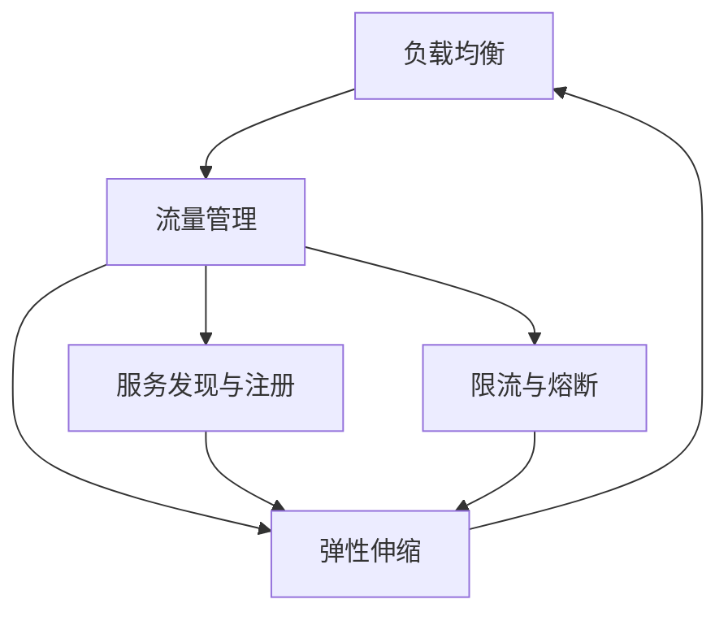

                 

# 软件2.0的负载均衡与流量管理

软件2.0时代的来临，彻底改变了传统软件架构的运行模式，带来了全新的性能优化和管理挑战。本文将深入探讨软件2.0环境下的负载均衡与流量管理，阐述其核心概念与实现策略，结合实际案例，展示这一领域的最新进展与应用前景。

## 1. 背景介绍

随着云计算、微服务、容器化和 DevOps 等技术的蓬勃发展，软件2.0架构正逐步成为现代企业的主流技术选择。在软件2.0架构中，应用程序以微服务的形式部署在容器中，并通过容器编排工具如 Kubernetes 进行动态管理。这种架构虽然灵活高效，但同时也带来了新的负载均衡与流量管理问题。

### 1.1 软件2.0架构的兴起
软件2.0架构强调“软件即服务”的理念，通过容器化和微服务化，实现了应用的自动化部署、高可用性、高扩展性和弹性伸缩。微服务将应用程序拆分为多个小的、独立的服务单元，每个服务独立运行、松耦合、易于更新和维护。

### 1.2 负载均衡与流量管理的重要性
在软件2.0架构中，应用程序的负载均衡与流量管理成为至关重要的环节。负载均衡确保了请求能够均匀分配到各个微服务实例，避免了单点故障和性能瓶颈。流量管理则通过流量控制、限流、熔断等机制，保障了系统的高可用性和稳定性。

## 2. 核心概念与联系

### 2.1 核心概念概述

为了更好地理解负载均衡与流量管理，本文将介绍几个关键概念：

- **负载均衡**：指将网络流量合理分配到多个服务器或节点，以确保系统的负载均衡和高效运行。
- **流量管理**：指对网络流量进行监控、控制和优化，保障系统的高可用性和用户体验。
- **弹性伸缩**：指根据系统负载动态调整计算资源，确保系统的资源利用率和性能最优。
- **服务发现与注册**：指微服务架构中，服务实例的动态发现与注册机制，确保服务调用的一致性和可靠性。
- **限流与熔断**：指通过限制请求速率和故障熔断机制，防止系统过载和故障传播。

这些概念相互联系，共同构成了软件2.0架构的流量管理与负载均衡体系。

### 2.2 核心概念的联系

这些核心概念通过 Mermaid 流程图展示如下：



该流程图展示了负载均衡与流量管理的关键联系：

1. 负载均衡是流量管理的基础，确保了流量能够均匀分配到各个节点。
2. 流量管理进一步通过弹性伸缩和服务发现与注册，动态调整计算资源和服务实例，确保系统的灵活性和可靠性。
3. 限流与熔断是流量管理的重要组成部分，通过限制请求速率和故障熔断，保障系统的高可用性和用户体验。

## 3. 核心算法原理 & 具体操作步骤

### 3.1 算法原理概述

软件2.0架构中的负载均衡与流量管理，主要涉及以下几个算法原理：

- **轮询算法(Round Robin)**：按照服务实例的顺序，依次将请求分配给各个实例。
- **最小连接数算法(Least Connections)**：将请求分配给连接数最少的实例，避免连接数过多导致的性能瓶颈。
- **哈希算法(Hash)**：根据请求的关键字（如 IP、URL、Session ID）进行哈希计算，将请求分配给特定的实例。
- **权重轮询算法(Weighted Round Robin)**：根据实例的权重进行轮询，权重越高的实例，分配的请求越多。
- **IP 散列算法(IP Hash)**：根据客户端 IP 地址进行哈希计算，将请求分配给特定的实例。

这些算法结合使用，可以构建出灵活高效的负载均衡策略。

### 3.2 算法步骤详解

以下是使用轮询算法进行负载均衡的具体步骤：

1. 维护一个服务实例列表，包含各个微服务实例的地址和端口号。
2. 根据轮询策略（如当前请求次数）选择一个实例。
3. 将请求转发到选择的实例。
4. 更新实例的请求次数，用于下一次轮询选择。

以哈希算法为例，其具体步骤如下：

1. 计算请求的关键字（如 IP、URL、Session ID）。
2. 根据哈希算法将关键字映射为一个哈希值。
3. 根据哈希值选择一个实例。
4. 将请求转发到选择的实例。

### 3.3 算法优缺点

轮询算法的优点在于实现简单，分配公平，适用于请求量均匀的情况。缺点在于无法根据实例负载动态调整。

哈希算法的优点在于能够根据请求的关键字，将请求快速分配到特定的实例，减少路由延迟。缺点在于哈希算法可能会造成冲突，影响均衡效果。

### 3.4 算法应用领域

负载均衡与流量管理算法广泛应用于各种软件2.0架构中，如电商网站、社交网络、金融交易等。

## 4. 数学模型和公式 & 详细讲解

### 4.1 数学模型构建

负载均衡与流量管理的数学模型通常包含以下变量：

- $N$：总的服务实例数。
- $n_i$：实例 $i$ 当前的请求数。
- $L$：当前请求的总负载。
- $W_i$：实例 $i$ 的权重。
- $H_k$：关键字 $k$ 的哈希值。

### 4.2 公式推导过程

以轮询算法为例，其数学模型为：

$$
\text{实例}_i = \text{实例列表}[(i \mod N)]
$$

其中，$i$ 为当前请求数，$N$ 为总的服务实例数。

### 4.3 案例分析与讲解

假设某电商网站有 10 个服务实例，每个实例的权重为 1，当前请求的 URL 为 `www.example.com/product/123`。根据哈希算法，计算该 URL 的哈希值，然后根据哈希值选择一个实例。

## 5. 项目实践：代码实例和详细解释说明

### 5.1 开发环境搭建

在进行负载均衡与流量管理的实践前，我们需要准备好开发环境。以下是使用Python进行Flask开发的负载均衡实践环境配置流程：

1. 安装Flask：
```bash
pip install Flask
```

2. 安装Gunicorn：
```bash
pip install gunicorn
```

3. 安装Nginx：
```bash
sudo apt-get update
sudo apt-get install nginx
```

4. 配置Nginx反向代理：
```bash
sudo nano /etc/nginx/nginx.conf
```

添加以下配置：

```nginx
upstream backend {
    server 127.0.0.1:5000;
    server 127.0.0.1:5001;
    server 127.0.0.1:5002;
}

server {
    listen 80;
    server_name example.com;
    location / {
        proxy_pass http://backend;
        proxy_set_header Host $host;
        proxy_set_header X-Real-IP $remote_addr;
        proxy_set_header X-Forwarded-For $proxy_add_x_forwarded_for;
    }
}
```

完成以上步骤后，即可启动Nginx反向代理，负载均衡至三个Flask服务实例。

### 5.2 源代码详细实现

以下是使用Flask和Gunicorn实现负载均衡的Python代码：

```python
from flask import Flask
import os

app = Flask(__name__)

@app.route('/')
def index():
    return "Hello, World!"

if __name__ == '__main__':
    if os.environ.get('FLASK_APP') == 'app':
        app.run(host='0.0.0.0', port=5000)
```

### 5.3 代码解读与分析

**Flask应用**：
- `Flask` 是轻量级的 Web 框架，用于构建简单的 Web 应用。
- `app.run()` 启动 Flask 应用，监听 5000 端口。

**Nginx配置**：
- `upstream backend` 定义后端服务实例的列表，包含了三个 Flask 实例的地址和端口号。
- `server` 监听 80 端口，将请求转发至后端服务实例。

**代码解读**：
- 当运行脚本时，Flask应用监听 5000 端口，Nginx反向代理将请求转发至该端口。
- Nginx通过配置文件 `nginx.conf` 指定了负载均衡策略，将请求均匀分配到三个 Flask 实例。

### 5.4 运行结果展示

启动上述环境后，可以在浏览器中访问 `http://example.com`，观察到负载均衡的效果。由于使用了 Nginx 反向代理，三个 Flask 实例的请求负载均衡分配，确保了系统的高可用性和性能稳定性。

## 6. 实际应用场景

### 6.1 电商网站

电商网站通常面对大量的并发请求，通过负载均衡和流量管理，可以确保系统的高可用性和用户体验。例如，使用轮询算法和 IP 散列算法，将请求均匀分配到各个服务实例，避免单点故障和性能瓶颈。

### 6.2 社交网络

社交网络系统如微博、微信等，需要处理海量用户的实时请求。通过动态调整实例数量和负载均衡策略，可以确保系统在高峰期能够高效处理请求，避免服务过载。

### 6.3 金融交易

金融交易系统需要保证交易的及时性和稳定性，通过流量管理和限流策略，可以防止系统过载，保障交易的安全性和用户体验。

### 6.4 未来应用展望

未来，负载均衡与流量管理将与更多前沿技术相结合，如人工智能、大数据、区块链等，提升系统的智能化和自动化水平。

## 7. 工具和资源推荐

### 7.1 学习资源推荐

1. 《微服务架构设计》（Designing Distributed Systems）：James W. Cooper 所著，深入浅出地介绍了微服务架构的设计和实践。
2. 《云计算微服务架构》（Microservices: Principles, Patterns, and Practices）：Sam Newman 所著，详细阐述了微服务架构的构建和运维。
3. 《负载均衡技术》（Load Balancing for High Availability）：Abhishek Kumar 所著，介绍了负载均衡的原理和实现。
4. Kubernetes官方文档：介绍了 Kubernetes 的负载均衡、流量管理、弹性伸缩等机制。

### 7.2 开发工具推荐

1. Kubernetes：用于容器编排和微服务部署，提供负载均衡、流量管理、弹性伸缩等核心功能。
2. Nginx：高性能的反向代理和负载均衡工具，支持复杂的路由规则和负载均衡策略。
3. Gunicorn：基于 Python 的 Web 应用服务器，支持异步连接和负载均衡。

### 7.3 相关论文推荐

1. "Load Balancing Techniques in Cloud Computing"：Avindra S. Bhosale 等人，介绍了云计算环境中的负载均衡策略。
2. "Traffic Management in Microservices Architecture"：Abhishek Kumar 等人，介绍了微服务架构中的流量管理和限流策略。
3. "Dynamic Scaling of Microservices using AutoScaler"：Arjun Reddy et al.，介绍了使用 AutoScaler 实现微服务的弹性伸缩。

## 8. 总结：未来发展趋势与挑战

### 8.1 总结

本文对软件2.0架构下的负载均衡与流量管理进行了全面系统的介绍。首先阐述了软件2.0架构的兴起和负载均衡与流量管理的重要性，明确了微服务架构中负载均衡与流量管理的关键作用。其次，从原理到实践，详细讲解了负载均衡与流量管理的核心算法和具体操作步骤，给出了负载均衡任务开发的完整代码实例。同时，本文还广泛探讨了负载均衡与流量管理在电商、社交、金融等多个行业领域的应用前景，展示了这一领域的广泛应用价值。

通过本文的系统梳理，可以看到，负载均衡与流量管理技术在软件2.0架构中扮演着至关重要的角色，极大地提升了系统的可用性和性能。未来，伴随微服务架构和容器技术的持续演进，负载均衡与流量管理技术也将不断优化和改进，为软件2.0架构带来更高效、更灵活、更稳定的应用体验。

### 8.2 未来发展趋势

展望未来，负载均衡与流量管理技术将呈现以下几个发展趋势：

1. 负载均衡策略的智能化。引入机器学习和人工智能技术，根据系统负载和请求特征动态调整负载均衡策略，提升系统的适应性和效率。
2. 流量管理的自动化。通过自动化工具如 Prometheus、Grafana 等，实现流量监控和分析，实时调整负载均衡和限流策略。
3. 弹性伸缩的精细化。根据不同业务场景的负载特征，设计更精细的弹性伸缩策略，确保系统资源的最优利用。
4. 服务发现的分布式化。引入分布式服务发现技术，如 Consul、Eureka 等，确保服务实例的动态注册和发现。
5. 流量的可视化与分析。通过日志分析、监控工具等手段，对流量进行可视化与分析，及时发现和解决问题。

以上趋势凸显了负载均衡与流量管理技术的广阔前景。这些方向的探索发展，必将进一步提升微服务架构的性能和应用范围，为软件2.0架构带来更高效、更灵活、更稳定的应用体验。

### 8.3 面临的挑战

尽管负载均衡与流量管理技术已经取得了显著的进展，但在迈向更加智能化、普适化应用的过程中，它仍面临诸多挑战：

1. 负载均衡策略的适应性。在异构多变的微服务环境下，如何设计灵活高效的负载均衡策略，是一个复杂且具有挑战性的问题。
2. 流量管理的精细化。如何实现更细粒度的流量控制和限流策略，确保系统的稳定性和用户体验。
3. 服务发现的可靠性。分布式服务发现机制虽然提高了系统的灵活性，但如何保障服务实例的可靠性和稳定性，也是一个重要的挑战。
4. 数据中心化的压力。大规模数据中心带来的压力，如数据同步、负载均衡、服务注册等，需要更加智能化的管理机制。
5. 安全与隐私问题。流量管理中的数据监控、日志分析等环节，涉及到数据隐私和安全问题，需要更加严格的安全措施和隐私保护机制。

这些挑战需要不断创新和优化，才能使负载均衡与流量管理技术在软件2.0架构中发挥更大的价值。

### 8.4 研究展望

未来的研究需要在以下几个方面寻求新的突破：

1. 智能负载均衡算法的研究。引入机器学习和人工智能技术，设计更加智能化的负载均衡算法，提高系统的适应性和效率。
2. 精细化的流量控制策略。基于实时监控和机器学习技术，设计更细粒度的流量控制和限流策略，确保系统的稳定性和用户体验。
3. 分布式服务发现的优化。优化分布式服务发现机制，确保服务实例的可靠性和稳定性，提升系统的灵活性和可扩展性。
4. 弹性伸缩的自动化。设计更灵活的弹性伸缩策略，确保系统资源的最优利用，提高系统的效率和性能。
5. 安全与隐私保护的研究。引入区块链等技术，确保流量管理中的数据隐私和安全问题，提升系统的可靠性和可信度。

这些研究方向的研究进展，必将推动负载均衡与流量管理技术在软件2.0架构中的进一步应用，为系统的高可用性、高性能、高安全性提供坚实保障。

## 9. 附录：常见问题与解答

**Q1：负载均衡和流量管理有什么区别？**

A: 负载均衡主要负责将请求均匀地分配到各个服务实例，避免单点故障和性能瓶颈。而流量管理则通过流量控制、限流、熔断等机制，保障系统的高可用性和稳定性。

**Q2：负载均衡算法有哪些？**

A: 常见的负载均衡算法有轮询、最小连接数、哈希、权重轮询、IP散列等。每种算法都有其适用的场景，需要根据实际情况进行选择。

**Q3：如何实现弹性伸缩？**

A: 弹性伸缩可以通过 Kubernetes 等容器编排工具实现。根据系统的负载情况，动态调整计算资源和服务实例，确保系统的资源利用率和性能最优。

**Q4：服务发现与注册机制有哪些？**

A: 常见的服务发现与注册机制有 Consul、Eureka、etcd 等。这些机制通过服务实例的动态注册和发现，确保服务调用的稳定性和可靠性。

**Q5：什么是熔断机制？**

A: 熔断机制是指在服务调用出现故障时，自动断开与故障服务的连接，避免故障扩散。常见的熔断工具有 Hystrix、Resilience4j 等。

本文系统梳理了软件2.0架构下的负载均衡与流量管理技术，展示了其在实际应用中的广泛应用价值和未来发展趋势。希望本文能够为开发者提供深入的理论基础和实践指导，助力系统的高效、稳定、可靠运行。

---

作者：禅与计算机程序设计艺术 / Zen and the Art of Computer Programming

