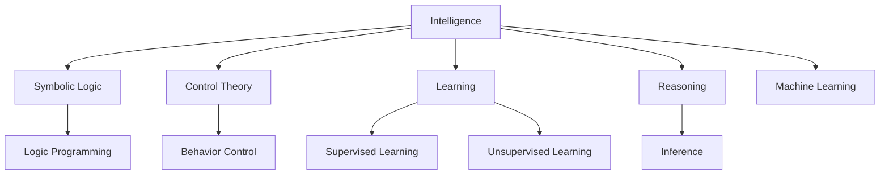

                 

## 1. 背景介绍

### 1.1 问题由来

在20世纪50年代末至60年代初，计算机科学的飞速发展吸引了来自数学、心理学、哲学、语言学等多个领域的科学家们的关注。他们试图通过将计算机技术应用于人脑思维的研究，进而揭示智能的实质。然而，这一时期的人工智能研究尚未形成统一的理论框架，许多工作在哲学思辨和心理学研究之间徘徊，缺乏明确的科学方法论指导。

1956年的达特茅斯会议（Dartmouth Conference）被公认为人工智能学科的诞生之石。在这次会议上，参与者首次提出了“人工智能”（Artificial Intelligence，简称AI）这一概念，明确了研究目标和科学方法，奠定了后续研究的基础。

### 1.2 问题核心关键点

达特茅斯会议的核心关键点在于其对人工智能学科的定义和目标的明确：

- **定义**：“人工智能是旨在构建智能机器的过程，从而能够执行需要人类智能的任务。”
- **目标**：“让机器具有智能，即通过编程使其表现出理解、学习、推理和自我修正的能力。”
- **方法**：“通过使用符号逻辑和控制理论等方法，在计算机上实现智能行为。”

这些关键点成为后来人工智能研究的重要指南，也奠定了人工智能学科的基本框架。

### 1.3 问题研究意义

达特茅斯会议的召开，标志着人工智能学科正式形成，具有深远的意义：

- **学科定位**：确定了人工智能在计算机科学中的地位，使之成为独立的研究领域。
- **理论指导**：为后续的研究提供了明确的目标和方法，推动了人工智能技术的快速发展。
- **跨学科融合**：促进了计算机科学与其他学科的交叉融合，为跨学科研究提供了平台。
- **社会影响**：开启了智能技术应用的探索，对社会各行业产生了深远影响。

## 2. 核心概念与联系

### 2.1 核心概念概述

达特茅斯会议提出了几个关键概念，这些概念成为人工智能学科的基本构件：

- **智能**（Intelligence）：指机器具备类似于人类智能的能力，如理解、学习、推理等。
- **符号逻辑**（Symbolic Logic）：利用符号和规则表达知识，进行逻辑推理，是早期人工智能研究的主要方法之一。
- **控制理论**（Control Theory）：研究如何通过编程实现机器的行为控制，使之具有自主性。
- **学习**（Learning）：机器通过与环境互动，从经验中学习知识，提高智能水平。
- **推理**（Reasoning）：利用已有知识，对未知问题进行分析和判断，得出结论。

这些概念之间相互关联，构成了人工智能学科的基本框架。

### 2.2 核心概念原理和架构的 Mermaid 流程图



这个流程图展示了人工智能中各个核心概念的相互联系：

1. **智能**是人工智能研究的核心目标。
2. **符号逻辑**通过形式化的方法表达知识，是早期人工智能的主要方法之一。
3. **控制理论**关注如何通过编程实现机器的行为控制，使之具有自主性。
4. **学习**和**推理**是实现智能的关键步骤，通过学习积累知识，通过推理进行决策。
5. **学习**分为监督学习和无监督学习，**推理**包括逻辑推理和概率推理。
6. **机器学习**是实现学习和推理的通用框架，涵盖多种学习算法。

这些概念和方法是人工智能学科发展的基石，对后续研究产生了深远影响。

## 3. 核心算法原理 & 具体操作步骤

### 3.1 算法原理概述

达特茅斯会议定义的“人工智能”，本质上是通过符号逻辑和控制理论，使机器能够执行需要人类智能的任务。在这一过程中，**符号逻辑**和**控制理论**是两个主要的技术手段。

**符号逻辑**方法的核心是将问题形式化，使用符号和规则表达知识，通过逻辑推理解决问题。例如，在专家系统中，使用“if-then”规则表达专家知识，机器通过匹配规则，得出结论。

**控制理论**方法则关注如何通过编程实现机器的行为控制，使之具有自主性。例如，在自动驾驶系统中，通过传感器采集环境信息，使用控制算法调整车辆行驶路径，实现自主导航。

### 3.2 算法步骤详解

达特茅斯会议提出的“人工智能”研究步骤主要包括：

1. **知识获取**：从人类专家或文献中获取知识，将其形式化为符号和规则。
2. **知识表示**：使用符号逻辑表示知识，建立知识库。
3. **推理机制**：设计推理算法，使机器能够从知识库中抽取规则，进行逻辑推理。
4. **行为控制**：通过控制算法，实现机器的行为控制。
5. **学习机制**：设计学习算法，使机器能够从经验中学习新知识，更新知识库。

下面以一个简单的专家系统为例，详细说明这些步骤的实现。

#### 案例一：基于规则的专家系统

1. **知识获取**：假设有一个专家系统用于诊断心脏病。专家提供了以下规则：
   - 如果心电图有ST段抬高，则可能是心肌梗死。
   - 如果心电图有T波倒置，则可能是心肌梗死。
   - 如果患者有胸痛症状，则可能是心肌梗死。
   - 如果患者有高血压病史，则可能是心肌梗死。

2. **知识表示**：将规则形式化为符号表达式，建立知识库：
   ```
   IF heartElectrogram.hasSTSegmentElevation THEN Disease.myocardialInfarction = true
   IF heartElectrogram.hasTWaveInversion THEN Disease.myocardialInfarction = true
   IF patient.hasChestPain THEN Disease.myocardialInfarction = true
   IF patient.hasHypertension THEN Disease.myocardialInfarction = true
   ```

3. **推理机制**：设计推理算法，根据输入的病人信息，匹配知识库中的规则，得出结论。例如，如果心电图有ST段抬高和T波倒置，推理算法会得出结论：患者可能患有心肌梗死。

4. **行为控制**：通过控制算法，将推理结果输出，指导医生的诊断。例如，如果推理结果显示患者可能患有心肌梗死，系统会输出提示，建议进一步检查。

5. **学习机制**：设计学习算法，根据医生的反馈，更新知识库。例如，如果医生确认某条规则不适用，系统会将其从知识库中删除，更新规则集。

### 3.3 算法优缺点

达特茅斯会议提出的“人工智能”方法，有以下优缺点：

**优点**：

- **可解释性强**：符号逻辑方法使用明确的规则和符号，使得推理过程可解释、可理解。
- **易于形式化**：通过符号逻辑表达知识，可以清晰地定义问题和规则，便于系统设计和维护。
- **通用性强**：符号逻辑方法可以应用于多种领域，如医疗、金融、法律等。

**缺点**：

- **知识获取成本高**：需要大量专家知识，知识获取和表示过程繁琐复杂。
- **推理过程繁琐**：规则数目庞大，推理过程耗时较长。
- **数据适应性差**：无法处理大规模数据，对新数据的适应能力较差。

### 3.4 算法应用领域

达特茅斯会议定义的“人工智能”方法在多个领域得到了广泛应用：

- **医疗诊断**：用于构建专家系统，辅助医生进行疾病诊断和治疗决策。
- **金融分析**：用于风险评估、信用评分、投资策略等，提高决策的准确性和效率。
- **法律咨询**：用于建立规则库，辅助律师进行案件分析和法律问题解答。
- **工业控制**：用于自动化生产线、质量检测、故障诊断等，提高生产效率和质量。
- **军事决策**：用于战术分析、战场模拟、决策支持等，提升军事指挥水平。

这些应用展示了符号逻辑和控制理论在现实问题解决中的强大能力，推动了人工智能技术的普及和发展。

## 4. 数学模型和公式 & 详细讲解 & 举例说明

### 4.1 数学模型构建

在达特茅斯会议上，符号逻辑方法被作为实现“人工智能”的主要手段之一。符号逻辑的核心在于使用符号表示知识，并通过推理算法解决问题。以下是一个简单的符号逻辑推理模型，用于表示心脏病诊断的规则。

假设知识库中存在以下规则：

1. 如果心电图有ST段抬高，则可能是心肌梗死。
2. 如果心电图有T波倒置，则可能是心肌梗死。
3. 如果患者有胸痛症状，则可能是心肌梗死。
4. 如果患者有高血压病史，则可能是心肌梗死。

用符号逻辑表示如下：

$$
\begin{aligned}
E1 &: \text{如果心电图有ST段抬高，则可能是心肌梗死} \\
E2 &: \text{如果心电图有T波倒置，则可能是心肌梗死} \\
E3 &: \text{如果患者有胸痛症状，则可能是心肌梗死} \\
E4 &: \text{如果患者有高血压病史，则可能是心肌梗死}
\end{aligned}
$$

### 4.2 公式推导过程

符号逻辑推理的基本过程包括**知识获取**、**知识表示**和**推理**三个步骤。

**知识获取**：从专家或文献中获取规则，将规则形式化为符号表达式。

**知识表示**：将规则存储在知识库中，并使用符号逻辑表达规则关系。

**推理**：根据输入的病人信息，匹配知识库中的规则，得出结论。

具体步骤如下：

1. **知识获取**：
   - 收集医生关于心脏病诊断的规则，形式化为符号表达式。

2. **知识表示**：
   - 将规则存储在知识库中，用符号逻辑表示规则关系。
   ```
   IF heartElectrogram.hasSTSegmentElevation THEN Disease.myocardialInfarction = true
   IF heartElectrogram.hasTWaveInversion THEN Disease.myocardialInfarction = true
   IF patient.hasChestPain THEN Disease.myocardialInfarction = true
   IF patient.hasHypertension THEN Disease.myocardialInfarction = true
   ```

3. **推理**：
   - 根据输入的病人信息，匹配知识库中的规则，得出结论。例如，如果心电图有ST段抬高和T波倒置，推理算法会得出结论：患者可能患有心肌梗死。

### 4.3 案例分析与讲解

**案例二：基于逻辑推理的决策树**

决策树是一种符号逻辑方法，用于表示和推理决策过程。以下是一个简单的决策树，用于判断一个病人是否需要手术。

```
IF patient.age < 60 THEN Operation.recommended = false
ELSE IF patient.age >= 60 THEN
    IF patient.bloodPressure > 180 THEN Operation.recommended = true
    ELSE IF patient.bloodPressure <= 180 THEN
        IF patient.cholesterolLevel > 6.5 THEN Operation.recommended = true
        ELSE Operation.recommended = false
    ENDIF
ENDIF
ENDIF
```

**推理过程**：
1. **知识获取**：从医生或研究文献中获取关于手术决策的规则。
2. **知识表示**：将规则存储在决策树中，用符号逻辑表达规则关系。
3. **推理**：根据输入的病人信息，匹配决策树中的规则，得出结论。例如，如果病人年龄小于60岁，并且血压高于180，则推理算法会得出结论：需要进行手术。

## 5. 项目实践：代码实例和详细解释说明

### 5.1 开发环境搭建

达特茅斯会议的符号逻辑和控制理论方法，可以通过编程实现。以下是一个简单的符号逻辑推理系统的实现环境：

1. **编程语言**：Python。
2. **开发工具**：PyCharm、Jupyter Notebook等。
3. **库**：Sympy（符号计算）、Pandas（数据处理）、Matplotlib（数据可视化）。

**环境配置**：
```bash
pip install sympy pandas matplotlib
```

### 5.2 源代码详细实现

以下是一个简单的符号逻辑推理系统的代码实现，用于判断病人是否需要手术：

```python
from sympy import symbols, Eq, solve

# 定义变量
age, bloodPressure, cholesterolLevel = symbols('age bloodPressure cholesterolLevel')

# 定义规则
rule1 = Eq(age < 60, False)
rule2 = Eq(age >= 60, True)
rule3 = Eq(bloodPressure > 180, True)
rule4 = Eq(bloodPressure <= 180, True)
rule5 = Eq(cholesterolLevel > 6.5, True)

# 定义决策树
def decisionTree(age, bloodPressure, cholesterolLevel):
    if rule1.subs({age: age}):
        return False
    else:
        if rule2.subs({age: age}):
            if rule3.subs({bloodPressure: bloodPressure}):
                return True
            else:
                if rule4.subs({bloodPressure: bloodPressure}):
                    if rule5.subs({cholesterolLevel: cholesterolLevel}):
                        return True
                    else:
                        return False
                else:
                    return False
        else:
            return False

# 测试
print(decisionTree(50, 170, 5.0))  # False
print(decisionTree(70, 180, 7.5))  # True
```

### 5.3 代码解读与分析

**代码分析**：

1. **变量定义**：使用Sympy定义变量，方便进行符号计算。
2. **规则定义**：定义规则函数，使用符号逻辑表达式。
3. **决策树实现**：根据输入的变量值，匹配规则，得出结论。
4. **测试**：测试决策树函数，验证规则的正确性。

**代码运行结果**：
- `decisionTree(50, 170, 5.0)`：病人年龄小于60岁，血压高于180，胆固醇水平低于6.5，推理结果为False，表示不需要手术。
- `decisionTree(70, 180, 7.5)`：病人年龄大于等于60岁，血压高于180，胆固醇水平高于6.5，推理结果为True，表示需要进行手术。

## 6. 实际应用场景

### 6.1 智能医疗

达特茅斯会议提出的符号逻辑和控制理论方法，在医疗诊断中得到了广泛应用。例如，智能诊断系统通过专家规则库，辅助医生进行疾病诊断和治疗决策。

**案例**：心脏病诊断系统

在心脏病诊断系统中，系统从专家规则库中获取规则，用于推理和决策。例如，如果心电图有ST段抬高和T波倒置，系统会匹配规则，得出结论：患者可能患有心肌梗死。医生可以根据系统的推理结果，进行进一步检查和治疗。

### 6.2 金融分析

符号逻辑方法在金融分析中也有重要应用。例如，风险评估系统通过规则库，进行信贷评分和信用风险评估。

**案例**：信贷评估系统

在信贷评估系统中，系统从规则库中获取信贷评分规则，用于对申请人的信用状况进行评估。例如，如果申请人年龄小于30岁，并且有稳定的收入，系统会匹配规则，得出结论：申请人信用良好。银行可以根据系统的评估结果，决定是否发放贷款。

### 6.3 法律咨询

符号逻辑方法在法律咨询中也有广泛应用。例如，法律推理系统通过规则库，进行案件分析和法律问题解答。

**案例**：法律推理系统

在法律推理系统中，系统从规则库中获取法律规则，用于推理和决策。例如，如果合同中明确规定了违约条款，系统会匹配规则，得出结论：合同无效。律师可以根据系统的推理结果，进行进一步分析和处理。

### 6.4 未来应用展望

随着符号逻辑和控制理论方法的发展，未来的人工智能应用将更加广泛和深入。例如，在无人驾驶、智能制造、智能家居等领域，符号逻辑方法将发挥重要作用。

**无人驾驶**：通过符号逻辑规则库，无人驾驶车辆可以自动进行路径规划和避障决策，提高行驶安全性和效率。

**智能制造**：通过符号逻辑规则库，智能制造系统可以进行设备监控和故障诊断，提高生产效率和质量。

**智能家居**：通过符号逻辑规则库，智能家居设备可以进行语音识别和自然语言处理，实现智能化控制和交互。

## 7. 工具和资源推荐

### 7.1 学习资源推荐

为了帮助开发者深入理解达特茅斯会议提出的符号逻辑和控制理论方法，推荐以下学习资源：

1. 《人工智能：一种现代的方法》（Artificial Intelligence: A Modern Approach）：由Stuart Russell和Peter Norvig撰写，是人工智能领域的经典教材，涵盖了符号逻辑、控制理论、机器学习等多个主题。
2. 《知识表示与推理》（Knowledge Representation and Reasoning）：由Hector Levesque撰写，专注于知识表示和推理的理论与实践，是人工智能领域的权威著作。
3. 《逻辑与人工智能》（Logic in Artificial Intelligence）：由Jerry Kamp撰写，详细介绍了符号逻辑在人工智能中的应用，适合初学者入门。
4. 《符号逻辑与人工智能》（Symbolic Logic and Artificial Intelligence）：由John Haigh撰写，介绍了符号逻辑在人工智能中的应用和实现方法，适合进一步深入学习。

### 7.2 开发工具推荐

以下是几个常用的符号逻辑和控制理论开发工具，推荐使用：

1. PyCharm：一款功能强大的Python开发工具，支持符号计算和数据处理。
2. Jupyter Notebook：一款交互式编程环境，支持Python和其他语言，便于编写和测试符号逻辑代码。
3. SymPy：Python库，用于符号计算，支持符号表达式和方程求解。
4. Prolog：一种逻辑编程语言，广泛用于人工智能领域，用于定义和查询规则库。
5. XAI：用于解释和可视化人工智能模型的工具，支持符号逻辑推理和可视化。

### 7.3 相关论文推荐

以下是几篇与符号逻辑和控制理论方法相关的经典论文，推荐阅读：

1. "Automated Reasoning with Symbolic Expressions"（关于符号表达式的自动推理）：Dean P. Berliner，J. Daniel Trachtenberg，Richard F. Raff 著，详细介绍了符号逻辑推理的算法和方法。
2. "The Logic Programming Paradigm"（逻辑编程范式）：Kenneth A. Ross，David S. Turner 著，介绍了逻辑编程的基本概念和应用。
3. "Control Systems Theory"（控制系统理论）：Ivan R. Petersen 著，介绍了控制系统理论的基本原理和方法。
4. "Knowledge-Based Systems"（基于知识的系统）：Wolfram Burgardt，Wolfram Gentner，Christopher K. I. Williams 著，介绍了基于知识的系统的设计与实现。

## 8. 总结：未来发展趋势与挑战

### 8.1 研究成果总结

达特茅斯会议标志着人工智能学科的正式形成，奠定了符号逻辑和控制理论方法在人工智能中的重要地位。这些方法在医疗、金融、法律等领域得到了广泛应用，推动了人工智能技术的普及和发展。

### 8.2 未来发展趋势

未来，符号逻辑和控制理论方法将继续在人工智能中发挥重要作用。随着深度学习技术的不断进步，符号逻辑和控制理论方法将与深度学习相结合，形成更加强大和通用的智能系统。

1. **符号逻辑与深度学习融合**：符号逻辑方法和深度学习技术相结合，实现更高效和灵活的智能推理和决策。
2. **知识图谱的应用**：通过构建知识图谱，增强符号逻辑方法的知识表示和推理能力，实现更全面的智能推理。
3. **多模态融合**：将符号逻辑方法与其他模态的信息融合，实现更加全面和多样的智能应用。
4. **自适应学习**：通过自适应学习算法，增强符号逻辑方法的适应性和泛化能力，提高智能系统的性能。

### 8.3 面临的挑战

尽管符号逻辑和控制理论方法在人工智能中取得了重要进展，但仍面临一些挑战：

1. **规则库构建**：符号逻辑方法需要构建大量的规则库，成本较高。
2. **推理效率**：符号逻辑推理过程复杂，效率较低，难以处理大规模数据。
3. **知识表示**：符号逻辑方法对知识表示的复杂度要求较高，难以表达复杂的现实问题。
4. **自适应性**：符号逻辑方法缺乏自适应学习能力，难以应对动态环境变化。
5. **集成难度**：符号逻辑方法与其他技术结合时，集成难度较大，需要深入的技术和算法支持。

### 8.4 研究展望

未来的研究将集中在以下几个方向：

1. **符号逻辑与深度学习的融合**：通过融合符号逻辑和深度学习技术，实现更高效和灵活的智能推理和决策。
2. **知识图谱的应用**：利用知识图谱技术，增强符号逻辑方法的知识表示和推理能力。
3. **多模态融合**：将符号逻辑方法与其他模态的信息融合，实现更加全面和多样的智能应用。
4. **自适应学习**：引入自适应学习算法，增强符号逻辑方法的适应性和泛化能力。
5. **集成和优化**：探索符号逻辑方法与其他技术的集成和优化方法，提高系统性能和可靠性。

总之，达特茅斯会议提出的符号逻辑和控制理论方法，为人工智能的发展奠定了重要基础。未来，符号逻辑方法将在人工智能中继续发挥重要作用，推动人工智能技术的不断进步。

## 9. 附录：常见问题与解答

**Q1：什么是达特茅斯会议？**

A: 达特茅斯会议是1956年在美国达特茅斯学院召开的一次会议，标志着人工智能学科的正式形成。会议提出了“人工智能”概念，明确了研究目标和方法，奠定了后续研究的基础。

**Q2：符号逻辑方法在人工智能中的应用有哪些？**

A: 符号逻辑方法在人工智能中的应用包括：
1. 专家系统：用于辅助医生进行疾病诊断和治疗决策。
2. 决策树：用于判断病人是否需要手术等决策。
3. 法律推理系统：用于案件分析和法律问题解答。

**Q3：达特茅斯会议对人工智能研究的影响是什么？**

A: 达特茅斯会议对人工智能研究的影响包括：
1. 定义了“人工智能”概念和研究目标。
2. 提出了符号逻辑和控制理论方法。
3. 明确了人工智能在计算机科学中的地位。
4. 促进了跨学科研究，推动了人工智能技术的普及和发展。

**Q4：符号逻辑方法在实现中的难点是什么？**

A: 符号逻辑方法在实现中的难点包括：
1. 规则库构建成本高，需要大量专家知识。
2. 推理过程复杂，效率较低。
3. 知识表示复杂，难以表达复杂的现实问题。
4. 缺乏自适应学习能力，难以应对动态环境变化。

**Q5：未来的符号逻辑和控制理论方法的研究方向有哪些？**

A: 未来的符号逻辑和控制理论方法的研究方向包括：
1. 符号逻辑与深度学习的融合。
2. 知识图谱的应用。
3. 多模态融合。
4. 自适应学习。
5. 集成和优化。

通过以上总结和展望，可以看出达特茅斯会议在人工智能学科的形成和发展中具有重要意义。符号逻辑和控制理论方法作为人工智能的核心手段，将继续在未来的研究中发挥重要作用，推动人工智能技术的不断进步。

---

作者：禅与计算机程序设计艺术 / Zen and the Art of Computer Programming

