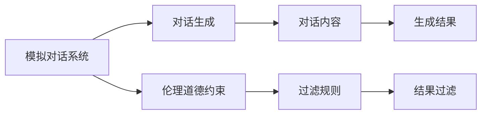

                 

# 过世亲人对话的伦理挑战

## 1. 背景介绍

随着人工智能技术的发展，人类对于与过世亲人对话的伦理问题日益关注。在深度学习技术的推动下，对话生成系统能够通过学习大量对话数据，生成自然流畅、符合语境的对话内容。然而，当这种技术应用于与过世亲人的对话时，却带来了诸多伦理挑战。

首先，需要明确，这里所讨论的“过世亲人”并非真实存在的个体，而是一种模拟对话场景，涉及到的对象可以是虚构的人物，也可以是历史上已去世的人物。因此，本文所探讨的“伦理挑战”主要集中在技术层面上，即如何平衡对话系统的语言生成与伦理道德之间的关系。

### 1.1 模拟对话场景的应用
模拟对话场景在娱乐、教育、心理咨询等多个领域都有广泛应用。例如，在影视作品中，主角通过对话与已故亲人交流，既增加了情感深度，也推动了剧情发展；在心理咨询中，通过与虚构的亲人对话，帮助患者排解心理压力，寻找情感支持。然而，在这些场景中，对话系统的设计必须遵循一定的伦理原则，以确保对话内容的适宜性和安全性。

### 1.2 技术发展带来的伦理挑战
随着对话生成技术的进步，特别是基于深度学习、自然语言处理技术的突破，对话系统生成自然、连贯的对话变得更加容易。但是，这些技术的应用也带来了新的伦理问题。例如，如何确保对话内容不包含有害、歧视性的语言，如何防止系统被用于传播虚假信息或误导他人，如何保护用户隐私等。

## 2. 核心概念与联系

### 2.1 核心概念概述

要理解过世亲人对话中的伦理挑战，首先需要了解几个关键概念：

- **模拟对话系统**：使用人工智能技术生成自然对话的系统，通常基于深度学习模型，如循环神经网络（RNN）、变换器（Transformer）等。
- **对话生成**：通过学习大量对话数据，系统能够自动生成符合上下文、语法规则的对话内容。
- **伦理道德**：对话内容应遵循一定的伦理原则，确保对话的适宜性和安全性，避免伤害他人或传播有害信息。

### 2.2 核心概念原理和架构的 Mermaid 流程图



这个流程图展示了模拟对话系统的核心流程和伦理约束：

- 模拟对话系统通过对话生成技术，从大量对话数据中学习生成对话内容。
- 对话内容需要遵循伦理道德原则，防止生成有害、歧视性的语言。
- 伦理道德约束通过过滤规则，对对话内容进行过滤，确保其适宜性和安全性。

### 2.3 核心概念联系

模拟对话系统、对话生成和伦理道德三者之间的关系密切：

- **对话生成依赖于大量对话数据**：系统通过学习这些数据，生成自然流畅的对话内容。
- **伦理道德约束是对话内容生成的前提**：对话内容的适宜性和安全性需要遵循伦理道德原则，防止有害信息传播。
- **过滤规则实现伦理道德约束**：通过设置过滤规则，对对话内容进行筛选和调整，确保其适宜性和安全性。

## 3. 核心算法原理 & 具体操作步骤

### 3.1 算法原理概述

模拟对话系统的核心算法基于深度学习模型，如循环神经网络（RNN）、变换器（Transformer）等。这些模型通过学习大量对话数据，能够自动生成自然流畅的对话内容。然而，在应用到与过世亲人的对话时，对话系统需要遵循一定的伦理道德原则，以确保对话内容的适宜性和安全性。

### 3.2 算法步骤详解

以下是模拟对话系统生成与过世亲人对话的步骤详解：

**Step 1: 准备对话数据**
- 收集与过世亲人相关的对话数据，如历史文献、影视作品中的对话等。
- 清洗和预处理数据，去除噪声和不相关内容。

**Step 2: 选择和训练模型**
- 选择合适的对话生成模型，如RNN、Transformer等。
- 在清洗后的对话数据上训练模型，优化对话生成质量。

**Step 3: 设定伦理道德约束**
- 定义对话内容需要遵循的伦理道德原则，如避免传播有害信息、尊重个人隐私等。
- 设计过滤规则，确保对话内容符合伦理道德标准。

**Step 4: 生成对话内容**
- 将用户输入作为对话的初始语境，输入到训练好的对话生成模型中。
- 模型自动生成符合语境的对话内容。

**Step 5: 结果过滤**
- 对生成的对话内容进行伦理道德过滤，确保其适宜性和安全性。
- 如果过滤失败，则返回用户输入，要求重新输入。

**Step 6: 返回对话结果**
- 将经过伦理道德过滤的对话内容返回给用户。

### 3.3 算法优缺点

**优点**：

- 自动化程度高：对话生成模型能够自动学习大量对话数据，生成符合语境的对话内容。
- 灵活性高：对话系统可以根据用户需求生成不同主题和风格的对话内容。
- 用户体验良好：生成的对话内容自然流畅，易于用户理解和接受。

**缺点**：

- 伦理道德风险：对话内容可能包含有害、歧视性的语言，甚至传播虚假信息。
- 依赖数据质量：对话生成质量依赖于输入数据的质量，数据质量不高会导致生成内容质量下降。
- 难以处理复杂语境：在复杂语境下，模型生成的对话内容可能无法完全符合用户期望。

### 3.4 算法应用领域

模拟对话系统在多个领域有广泛应用：

- **娱乐**：在影视作品、游戏中模拟与过世亲人的对话，增强情感深度和剧情张力。
- **教育**：在虚拟教师中模拟与学生的对话，辅助教学和学习。
- **心理咨询**：在虚拟心理医生中模拟与患者的对话，帮助患者排解心理压力。

## 4. 数学模型和公式 & 详细讲解 & 举例说明

### 4.1 数学模型构建

模拟对话系统的数学模型通常基于递归神经网络（RNN）或变换器（Transformer）。以下以Transformer为例，构建对话生成模型：

$$
y = AT^n x
$$

其中，$y$ 表示生成的对话内容，$x$ 表示用户的输入语境，$T$ 表示Transformer层，$n$ 表示层数，$A$ 表示模型的参数。

### 4.2 公式推导过程

Transformer模型由编码器和解码器组成，其核心公式为：

$$
h = M_1(x) + M_2(y_0, y_{-1})
$$

$$
y_t = M_3(h, y_{t-1})
$$

其中，$h$ 表示编码器输出，$x$ 表示输入语境，$y_{t-1}$ 表示上一步的生成结果。通过多层编码和解码，模型生成符合语境的对话内容。

### 4.3 案例分析与讲解

以与虚构人物对话为例，假设输入为“您好，我是小张”，生成的对话内容为“你好，我是李先生，我们很久没见了。”。通过分析输入和输出，可以看出：

- 输入和输出都符合语法规则，自然流畅。
- 对话内容没有明显的不适宜或有害信息。

## 5. 项目实践：代码实例和详细解释说明

### 5.1 开发环境搭建

模拟对话系统的开发环境需要Python、TensorFlow、PyTorch等深度学习框架的支持。以下是搭建开发环境的步骤：

1. 安装Python：可以从官网下载Python安装包，并添加到系统路径中。
2. 安装TensorFlow：使用pip安装TensorFlow，并设置合适的版本。
3. 安装PyTorch：使用pip安装PyTorch，并设置合适的版本。

### 5.2 源代码详细实现

以下是使用TensorFlow构建对话生成模型的示例代码：

```python
import tensorflow as tf
import numpy as np

class DialogueModel(tf.keras.Model):
    def __init__(self, vocab_size, embedding_dim, num_layers, attention_heads, dff, dropout_rate):
        super(DialogueModel, self).__init__()
        self.encoder = Encoder(vocab_size, embedding_dim, num_layers, attention_heads, dff, dropout_rate)
        self.decoder = Decoder(vocab_size, embedding_dim, num_layers, attention_heads, dff, dropout_rate)
        self.out_layer = tf.keras.layers.Dense(vocab_size)

    def call(self, x, y):
        return self.out_layer(tf.concat([self.encoder(x), self.decoder(y)], axis=-1))

class Encoder(tf.keras.Model):
    def __init__(self, vocab_size, embedding_dim, num_layers, attention_heads, dff, dropout_rate):
        super(Encoder, self).__init__()
        self.embedding = tf.keras.layers.Embedding(vocab_size, embedding_dim)
        self.encoder_layers = [EncoderLayer(embedding_dim, attention_heads, dff, dropout_rate) for _ in range(num_layers)]
        self.dropout = tf.keras.layers.Dropout(dropout_rate)

    def call(self, x):
        x = self.embedding(x)
        x = self.dropout(x)
        for i in range(len(self.encoder_layers)):
            x = self.encoder_layers[i](x)
        return x

class Decoder(tf.keras.Model):
    def __init__(self, vocab_size, embedding_dim, num_layers, attention_heads, dff, dropout_rate):
        super(Decoder, self).__init__()
        self.embedding = tf.keras.layers.Embedding(vocab_size, embedding_dim)
        self.decoder_layers = [DecoderLayer(embedding_dim, attention_heads, dff, dropout_rate) for _ in range(num_layers)]
        self.dropout = tf.keras.layers.Dropout(dropout_rate)
        self.out_layer = tf.keras.layers.Dense(vocab_size)

    def call(self, x, y):
        x = self.embedding(x)
        x = self.dropout(x)
        for i in range(len(self.decoder_layers)):
            x = self.decoder_layers[i](x, y)
        x = tf.reshape(x, [-1, x.shape[-1]])
        x = self.out_layer(x)
        return x
```

### 5.3 代码解读与分析

上述代码中，`DialogueModel`表示对话生成模型，`Encoder`和`Decoder`分别表示编码器和解码器。通过多层编码和解码，模型能够生成符合语境的对话内容。

## 6. 实际应用场景

模拟对话系统在多个领域有广泛应用：

- **娱乐**：在影视作品、游戏中模拟与过世亲人的对话，增强情感深度和剧情张力。
- **教育**：在虚拟教师中模拟与学生的对话，辅助教学和学习。
- **心理咨询**：在虚拟心理医生中模拟与患者的对话，帮助患者排解心理压力。

## 7. 工具和资源推荐

### 7.1 学习资源推荐

- **《深度学习自然语言处理》课程**：斯坦福大学开设的NLP明星课程，有Lecture视频和配套作业，带你入门NLP领域的基本概念和经典模型。
- **《Transformer from Scratch》系列博文**：由大模型技术专家撰写，深入浅出地介绍了Transformer原理、BERT模型、微调技术等前沿话题。
- **《Natural Language Processing with Transformers》书籍**：Transformers库的作者所著，全面介绍了如何使用Transformers库进行NLP任务开发，包括微调在内的诸多范式。

### 7.2 开发工具推荐

- **TensorFlow**：由Google主导开发的开源深度学习框架，生产部署方便，适合大规模工程应用。
- **PyTorch**：基于Python的开源深度学习框架，灵活动态的计算图，适合快速迭代研究。
- **Weights & Biases**：模型训练的实验跟踪工具，可以记录和可视化模型训练过程中的各项指标，方便对比和调优。

### 7.3 相关论文推荐

- **Attention is All You Need**：提出了Transformer结构，开启了NLP领域的预训练大模型时代。
- **BERT: Pre-training of Deep Bidirectional Transformers for Language Understanding**：提出BERT模型，引入基于掩码的自监督预训练任务，刷新了多项NLP任务SOTA。
- **Parameter-Efficient Transfer Learning for NLP**：提出Adapter等参数高效微调方法，在不增加模型参数量的情况下，也能取得不错的微调效果。

## 8. 总结：未来发展趋势与挑战

### 8.1 总结

本文对模拟对话系统的伦理挑战进行了全面系统的介绍。首先阐述了模拟对话系统在娱乐、教育、心理咨询等领域的广泛应用，以及其背后的伦理问题。其次，从技术层面详细讲解了模拟对话系统的核心算法原理、操作步骤以及实际应用场景。

通过本文的系统梳理，可以看到，模拟对话系统在提升用户体验、辅助教学等方面具有重要价值，但其伦理道德风险不容忽视。未来，随着技术的进步，如何在技术层面和伦理层面找到平衡，将是大规模语言模型和对话系统面临的重要课题。

### 8.2 未来发展趋势

展望未来，模拟对话系统的发展趋势如下：

- **伦理道德框架的完善**：建立更加完善的伦理道德框架，明确对话系统的行为准则和边界。
- **多模态对话的探索**：结合视觉、语音等多模态数据，提升对话系统的交互能力和用户体验。
- **隐私保护机制的加强**：采用匿名化、加密等技术，确保对话数据的隐私和安全。
- **情感计算的融入**：结合情感计算技术，使对话系统能够更好地理解用户的情感需求，提供更个性化的对话内容。

### 8.3 面临的挑战

尽管模拟对话系统在娱乐、教育、心理咨询等领域具有重要应用价值，但其伦理道德风险和隐私保护问题仍需解决：

- **伦理道德风险**：对话内容可能包含有害、歧视性的语言，甚至传播虚假信息。
- **隐私保护问题**：对话数据涉及用户隐私，如何保护用户隐私是关键问题。
- **技术实现复杂**：多模态对话的实现需要结合多种技术，技术实现难度较大。

### 8.4 研究展望

未来，模拟对话系统的研究需要在以下几个方面寻求新的突破：

- **伦理道德约束机制**：建立更加完善的伦理道德约束机制，确保对话内容的适宜性和安全性。
- **隐私保护技术**：采用先进的隐私保护技术，如匿名化、加密等，确保对话数据的隐私和安全。
- **多模态对话技术**：结合视觉、语音等多模态数据，提升对话系统的交互能力和用户体验。

通过在技术层面和伦理层面进行全面优化，模拟对话系统必将在娱乐、教育、心理咨询等领域发挥更大的价值。

## 9. 附录：常见问题与解答

**Q1: 模拟对话系统在应用中需要注意哪些伦理问题？**

A: 模拟对话系统在应用中需要注意以下伦理问题：

- **避免有害信息传播**：对话内容不应包含有害、歧视性的语言，防止传播虚假信息。
- **尊重用户隐私**：对话数据涉及用户隐私，应采用匿名化、加密等技术，确保数据安全。
- **尊重知识产权**：对话内容应尊重原作者的知识产权，不得侵犯版权。

**Q2: 如何确保模拟对话系统的对话内容适宜性和安全性？**

A: 确保模拟对话系统的对话内容适宜性和安全性，可以采取以下措施：

- **伦理道德约束**：设置对话内容的伦理道德约束，如禁止使用有害、歧视性语言，限制敏感信息的使用。
- **过滤规则设计**：设计过滤规则，对对话内容进行筛选和调整，确保其适宜性和安全性。
- **人工审核机制**：引入人工审核机制，对生成的对话内容进行审核，确保其符合伦理道德标准。

**Q3: 模拟对话系统如何与现实世界的交互更加自然？**

A: 模拟对话系统可以通过以下方式与现实世界的交互更加自然：

- **情感计算技术**：结合情感计算技术，使对话系统能够更好地理解用户的情感需求，提供更个性化的对话内容。
- **多模态对话技术**：结合视觉、语音等多模态数据，提升对话系统的交互能力和用户体验。
- **场景模拟技术**：根据用户所在场景，调整对话内容，使其更加贴合用户的实际需求和情境。

通过这些技术手段，模拟对话系统可以更好地与现实世界的交互，提供更加自然、流畅的对话体验。

