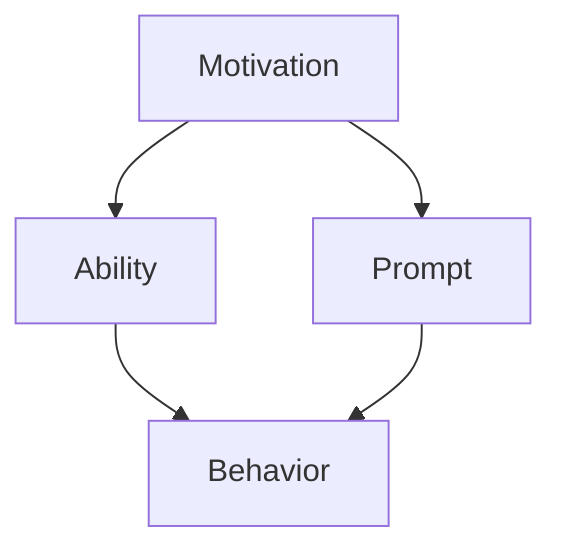

                 

# 运用福格模型培养团队良习惯

## 1. 背景介绍

在科技领域，一个团队的效能直接影响着项目的进展和成功。然而，培养团队成员形成优秀的习惯，并非易事。福格行为模型（Fogg's Behavior Model），由斯坦福大学的B.J. Fogg提出，它提供了一种明确的方法来理解并培养人们的习惯，进而应用于团队建设和管理中。

### 1.1 问题由来

面对不断变化的科技环境，传统管理方式往往难以应对团队成员行为习惯的差异和复杂性。团队的创新力、协作性和执行力受到诸多因素影响，包括工作压力、团队文化、任务分配等。

### 1.2 问题核心关键点

如何运用福格行为模型，在团队中建立高效、自律、协作的良性习惯，提升团队整体效能？如何设计并实施可操作的步骤，促使团队成员养成良好的工作习惯？如何确保团队习惯培养的持续性和稳定性？

## 2. 核心概念与联系

### 2.1 核心概念概述

福格行为模型提出了行为形成的三要素：动机（ Motivation）、能力（Ability）、提示（Prompts）。该模型认为，当动机足够强烈，能力足够完成动作，并且有了足够提示时，行为形成将变得非常可能。

**动机（Motivation）**：是指一个人做某事的愿望和驱动力。团队成员必须对某个目标有强烈的动机，才能主动采取行动。

**能力（Ability）**：指执行某行为所需的时间、空间、资源等。在团队中，提高成员完成特定任务的能力，是培养良好习惯的重要步骤。

**提示（Prompts）**：是指触发行为的外在提示。良好的提示设计，可以引导成员在合适的时间和情境下采取行动。

### 2.2 核心概念原理和架构的 Mermaid 流程图



该流程图展示了福格行为模型的核心原理。动机通过能力驱动行为，而提示为行为提供了启动的机会。在团队建设和管理中，合理利用这三个要素，可以帮助团队成员形成良好的习惯，提高整体效能。

## 3. 核心算法原理 & 具体操作步骤
### 3.1 算法原理概述

福格行为模型在团队习惯培养中的应用，主要体现在三个关键阶段：动机激发、能力提升和提示设计。该模型通过量化和结构化的方式，帮助团队成员建立并维持良好的工作习惯。

### 3.2 算法步骤详解

#### 3.2.1 动机激发

**步骤一：明确团队目标与个人目标的契合度**

1. **设定长期目标**：明确团队的项目目标和远期愿景，将其分解为具体、可衡量的短期目标。
2. **与个人目标对齐**：确保团队目标与个人职业发展和兴趣相符，增强成员的内在动机。

**步骤二：增强团队凝聚力**

1. **开展团队建设活动**：定期举行团建活动，增强团队成员间的信任与协作。
2. **鼓励正向反馈**：及时给予肯定和表扬，增强成员的成就感和归属感。

#### 3.2.2 能力提升

**步骤三：提高团队成员的技能水平**

1. **持续培训与学习**：定期安排专业培训和技术交流，提升团队成员的技术能力。
2. **项目经验分享**：通过项目回顾与经验分享，总结成功经验和教训，提高团队的整体能力。

**步骤四：优化工作流程**

1. **流程优化与改进**：通过流程审查与优化，减少不必要的环节，提高工作效率。
2. **自动化工具引入**：引入自动化工具，如自动化测试、代码审查等，提高工作质量。

#### 3.2.3 提示设计

**步骤五：设计有效的提示**

1. **日常惯例**：设定每日的工作惯例，如固定的会议时间、代码审查流程等。
2. **即时反馈**：使用即时反馈工具，如即时通讯、任务管理软件等，及时跟踪和反馈工作进展。

### 3.3 算法优缺点

#### 3.3.1 优点

1. **系统性**：福格行为模型提供了系统化的框架，便于团队对行为培养进行规划和实施。
2. **可操作性**：通过具体步骤和量化指标，该模型能够指导团队在实践中进行操作。
3. **灵活性**：该模型适用于不同规模和背景的团队，可根据实际情况进行调整。

#### 3.3.2 缺点

1. **复杂度**：模型涉及动机、能力和提示三个要素，设计和管理可能相对复杂。
2. **动态变化**：团队成员的工作习惯和环境可能会随时间变化，需要定期评估和调整。

### 3.4 算法应用领域

福格行为模型在多个团队管理和建设领域都有广泛应用，如软件开发团队、数据分析团队、项目管理团队等。通过量化和结构化的方式，该模型可以有效提升团队成员的工作效率和满意度。

## 4. 数学模型和公式 & 详细讲解 & 举例说明

### 4.1 数学模型构建

福格行为模型通过以下公式描述行为的形成：

$$ B=f(p,m,a) $$

其中：
- $B$ 代表行为（Behavior），表示团队成员执行某个任务或习惯的频率。
- $p$ 代表提示（Prompts），触发行为的信号或情境。
- $m$ 代表动机（Motivation），驱动行为的意愿和冲动。
- $a$ 代表能力（Ability），执行行为所需的时间和资源。

### 4.2 公式推导过程

假设团队成员在某个时间点接受到提示 $p$，其动机 $m$ 和能力 $a$ 满足一定的条件，则行为 $B$ 的发生概率可以通过以下公式计算：

$$ P(B)=\frac{1}{p}=\frac{1}{\frac{m}{a}} $$

这表明，当动机和能力满足一定条件时，行为的发生概率与提示的频率成反比。因此，增加提示的频率可以提高行为发生的概率。

### 4.3 案例分析与讲解

**案例一：软件开发团队**

一家软件开发公司希望提升团队代码审查的频率。通过福格行为模型分析，公司采取了以下措施：

1. **动机激发**：公司定期组织团队分享会，鼓励成员展示自己的代码改进和创新。
2. **能力提升**：提供代码审查的培训课程，提升成员的审查技能。
3. **提示设计**：每周设定固定的时间段进行代码审查，同时使用即时通讯工具提醒成员。

实施后，代码审查的频率显著提升，代码质量也得到了提高。

## 5. 项目实践：代码实例和详细解释说明

### 5.1 开发环境搭建

为了实践福格行为模型在软件开发团队中的应用，需要搭建以下开发环境：

1. **项目管理工具**：如JIRA、Trello等，用于任务管理与进度跟踪。
2. **即时通讯工具**：如Slack、Microsoft Teams等，用于实时沟通和即时反馈。
3. **代码审查工具**：如GitHub、Bitbucket等，用于代码审查和版本控制。
4. **团队建设工具**：如Zoom、Meetup等，用于组织团建活动和线上会议。

### 5.2 源代码详细实现

以下是一个基于Fogg行为模型的工作流程示例：

**步骤一：设定目标**

1. **目标明确**：在项目管理工具中设定团队项目目标和短期任务，确保每个成员都清楚自己的工作内容。
2. **目标对齐**：与每个成员进行一对一沟通，确保个人目标与团队目标一致。

**步骤二：培训与学习**

1. **技能培训**：定期安排培训课程，提升成员的专业技能。
2. **知识分享**：每周举行技术分享会，成员轮流讲解自己的新知识和新技能。

**步骤三：代码审查**

1. **审查流程**：设定每周的代码审查日，确保所有代码提交都经过审查。
2. **即时反馈**：使用即时通讯工具，及时反馈代码审查的意见和建议。

**步骤四：团队建设**

1. **团队活动**：每月组织一次团队建设活动，增强成员间的信任与协作。
2. **正向反馈**：定期进行团队成员表现评估，给予正向反馈和奖励。

### 5.3 代码解读与分析

**代码示例**：

```python
class TeamManager:
    def __init__(self, target, members):
        self.target = target
        self.members = members
        self.current_state = None
    
    def set_target(self, new_target):
        self.target = new_target
        self.current_state = 'target_set'
    
    def conduct_training(self):
        for member in self.members:
            member.train()
        self.current_state = 'training_completed'
    
    def conduct_code_review(self):
        for member in self.members:
            member.review_code()
        self.current_state = 'code_review_completed'
    
    def conduct_team_building(self):
        self.members.join_building_activity()
        self.current_state = 'team_building_completed'
    
    def give_feedback(self, feedback):
        for member in self.members:
            member.receive_feedback(feedback)
```

**代码解读**：
- `TeamManager` 类用于管理团队，通过设定目标、培训、代码审查和团队建设等方法，实现行为培养的目标。
- `set_target` 方法用于设定团队项目目标。
- `conduct_training` 方法用于安排技能培训。
- `conduct_code_review` 方法用于安排代码审查。
- `conduct_team_building` 方法用于组织团队建设活动。
- `give_feedback` 方法用于给予正向反馈和奖励。

### 5.4 运行结果展示

通过以上代码，团队可以按以下流程执行：

1. **设定目标**：明确团队项目目标。
2. **培训与学习**：提升成员专业技能。
3. **代码审查**：确保代码质量。
4. **团队建设**：增强团队凝聚力。

**运行结果**：

- 目标设定：团队成员明确项目目标和短期任务。
- 技能提升：成员专业技能得到提升。
- 代码质量：代码审查频率增加，代码质量提高。
- 团队凝聚：团队成员信任与协作增强。

## 6. 实际应用场景

### 6.1 软件开发团队

福格行为模型在软件开发团队中的应用非常广泛。通过设定明确的目标、提升专业技能、定期代码审查和团队建设，可以提高团队成员的工作效率和满意度。

**案例二：数据分析团队**

一家数据分析公司希望提升团队的数据分析和报告生成效率。通过福格行为模型分析，公司采取了以下措施：

1. **动机激发**：设定数据分析竞赛，鼓励成员参与并分享成果。
2. **能力提升**：提供数据分析和报告生成的培训课程，提升成员的技能。
3. **提示设计**：每周设定固定的时间段进行数据分析和报告生成，同时使用项目管理工具提醒成员。

实施后，数据分析和报告生成的效率显著提升，质量也得到了提高。

### 6.2 项目管理团队

福格行为模型在项目管理团队中的应用同样重要。通过设定明确的项目目标、提升项目管理技能、定期项目回顾和团队建设，可以提高团队成员的执行力和工作质量。

**案例三：市场营销团队**

一家市场营销公司希望提升团队的市场推广和客户反馈收集效率。通过福格行为模型分析，公司采取了以下措施：

1. **动机激发**：设定季度销售目标，并与每个成员的绩效考核挂钩。
2. **能力提升**：提供市场推广和客户反馈收集的培训课程，提升成员的技能。
3. **提示设计**：每周设定固定的时间段进行市场推广和客户反馈收集，同时使用项目管理工具提醒成员。

实施后，市场推广和客户反馈收集的效率显著提升，客户满意度提高。

## 7. 工具和资源推荐

### 7.1 学习资源推荐

1. **《行为科学导论》**：詹姆斯·皮特曼著，介绍行为科学的理论基础和实践方法，帮助理解福格行为模型的理论背景。
2. **《高效能人士的七个习惯》**：史蒂芬·柯维著，通过七个习惯的培养，提升个人和团队的工作效率。
3. **《敏捷管理的艺术》**：David H. Johnson著，介绍敏捷管理的方法和实践，帮助团队提升灵活性和协作性。

### 7.2 开发工具推荐

1. **JIRA**：项目管理工具，用于任务管理与进度跟踪。
2. **Slack**：即时通讯工具，用于实时沟通和即时反馈。
3. **GitHub**：代码审查工具，用于代码审查和版本控制。
4. **Zoom**：团队建设工具，用于组织线上会议和团队建设活动。

### 7.3 相关论文推荐

1. **《设计良好习惯的原理》**：B.J. Fogg著，介绍行为设计的方法和案例，帮助理解福格行为模型的应用。
2. **《敏捷团队管理》**：James Shore著，介绍敏捷团队的管理方法和实践，帮助团队提升灵活性和协作性。
3. **《行为科学在项目管理中的应用》**：Linda Carriere、Margaret Anne Hume 著，介绍行为科学在项目管理中的应用，帮助团队提升执行力和工作质量。

## 8. 总结：未来发展趋势与挑战

### 8.1 研究成果总结

福格行为模型在团队建设和管理中的应用，已经取得了显著的效果。通过动机激发、能力提升和提示设计，帮助团队成员形成良好的工作习惯，提升整体效能。该模型具有系统性、可操作性和灵活性，适用于不同规模和背景的团队。

### 8.2 未来发展趋势

1. **AI驱动的个性化管理**：利用AI技术，根据团队成员的特点和需求，提供个性化的管理建议和行为设计。
2. **实时数据分析**：通过实时数据分析，动态调整行为培养策略，及时响应团队变化。
3. **跨文化应用**：在全球化背景下，福格行为模型需要进一步适应不同文化和地域的差异，实现跨文化管理。

### 8.3 面临的挑战

1. **复杂度增加**：随着团队规模和复杂性的增加，福格行为模型的应用将更加复杂，需要更多专业知识和技能。
2. **数据隐私问题**：在使用数据分析和实时反馈时，需要确保数据隐私和安全，避免信息泄露和滥用。
3. **多样性管理**：在多元文化背景下的团队中，如何平衡不同文化背景成员的需求，是未来面临的一大挑战。

### 8.4 研究展望

1. **行为设计工具**：开发更多行为设计工具，帮助团队自动化行为培养过程。
2. **多维度评估**：引入多维度评估方法，全面评估团队成员的行为和效能。
3. **跨领域应用**：拓展福格行为模型的应用领域，覆盖更多行业和管理场景。

## 9. 附录：常见问题与解答

**Q1：福格行为模型如何适用于不同规模的团队？**

A: 福格行为模型适用于不同规模的团队。通过动机激发、能力提升和提示设计，团队成员可以形成良好的工作习惯，提升整体效能。针对不同规模的团队，可以根据实际情况进行调整和优化。

**Q2：如何在团队中实施福格行为模型？**

A: 在团队中实施福格行为模型，需要进行以下步骤：
1. **设定目标**：明确团队项目目标和个人目标，确保一致性。
2. **培训与学习**：提升成员的专业技能，定期安排培训和知识分享。
3. **代码审查**：设定代码审查流程，确保代码质量。
4. **团队建设**：组织团队建设活动，增强成员的信任与协作。

**Q3：福格行为模型在跨文化团队中的应用需要注意哪些问题？**

A: 在跨文化团队中应用福格行为模型，需要注意以下问题：
1. **文化差异**：了解不同文化背景成员的需求和习惯，避免文化冲突。
2. **语言沟通**：提供多语言支持，确保沟通顺畅。
3. **团队融合**：增强团队成员之间的交流和理解，促进文化融合。

---

作者：禅与计算机程序设计艺术 / Zen and the Art of Computer Programming

