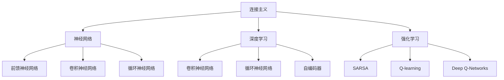

                 

# 连接主义与行为主义的未来

> 关键词：连接主义,行为主义,神经网络,机器学习,深度学习,认知科学,人工智能

## 1. 背景介绍

### 1.1 问题由来

在当代人工智能研究中，存在两大主要范式：连接主义(Connectivism)和行为主义(行为主义)。连接主义以神经网络和深度学习为主，侧重于通过模型模拟人脑神经元之间的连接方式，实现复杂的计算和数据处理；行为主义则关注模型的行为和输出结果，强调模型的决策过程和优化策略。这两种范式各有优缺点，但都致力于实现人工智能的智能化与自动化。

当前，连接主义与行为主义的融合已经成为研究热点。一方面，神经网络和深度学习技术的快速发展，使连接主义在处理复杂数据和结构化任务方面取得了显著成果；另一方面，行为主义的研究成果，如强化学习、遗传算法等，则为解决复杂的优化问题提供了新的思路和手段。本文旨在探讨连接主义与行为主义的未来发展方向，及其在人工智能领域的潜在应用。

## 2. 核心概念与联系

### 2.1 核心概念概述

为更好地理解连接主义与行为主义的融合，本节将介绍几个密切相关的核心概念：

- **连接主义**：指以神经网络和深度学习为代表的，通过模拟人脑神经元之间连接的计算模型。主要包含前馈神经网络、卷积神经网络、循环神经网络等。

- **行为主义**：强调模型的行为和输出结果，侧重于模型的决策过程和优化策略。常见行为主义方法包括强化学习、遗传算法、进化策略等。

- **强化学习**：通过智能体与环境交互，学习最优策略以最大化累计奖励。典型算法包括Q-learning、SARSA、Deep Q-Networks等。

- **遗传算法**：模拟生物进化过程，通过交叉、变异等操作优化模型参数。与传统的搜索算法相比，遗传算法能够更好地探索参数空间。

- **进化策略**：结合遗传算法和梯度下降，通过种群演化与梯度信息相结合，提升模型优化效率。

- **深度学习**：通过多层次非线性变换，实现复杂数据的表示与学习。主要包含卷积神经网络、循环神经网络、自编码器等。

- **认知科学**：研究人类认知过程的科学，包括感知、记忆、学习、思维等。深度学习与认知科学相结合，为理解人类智能提供了新的视角。

这些核心概念之间的逻辑关系可以通过以下Mermaid流程图来展示：



这个流程图展示了大语言模型的核心概念及其之间的关系：

1. 连接主义以神经网络和深度学习为主，通过模型模拟人脑神经元之间的连接方式，实现复杂的计算和数据处理。
2. 行为主义强调模型的行为和输出结果，侧重于模型的决策过程和优化策略。
3. 强化学习、遗传算法等行为主义方法，可用于解决复杂的优化问题，优化神经网络模型。
4. 深度学习通过多层次非线性变换，实现复杂数据的表示与学习。
5. 认知科学结合深度学习，为理解人类智能提供了新的视角。

这些概念共同构成了连接主义与行为主义的理论基础，推动了人工智能技术的不断发展。

## 3. 核心算法原理 & 具体操作步骤
### 3.1 算法原理概述

连接主义与行为主义的融合，主要体现在将神经网络与行为主义方法结合，以提升模型的学习和优化能力。其核心思想是：

- 使用深度学习模型，通过大量数据进行预训练，学习通用的数据表示。
- 将行为主义方法（如强化学习、遗传算法）引入模型的训练和优化过程，通过行为反馈引导模型优化。
- 结合认知科学的研究成果，提升模型的理解能力和决策水平。

具体实现方式包括：

- 将行为主义方法应用于模型的训练过程中，通过行为反馈调节模型参数，提升学习效率。
- 结合认知科学的理论，理解模型的行为动机和决策过程，优化模型的设计和训练。

### 3.2 算法步骤详解

基于连接主义与行为主义的融合方法，可以大致分为以下几个关键步骤：

**Step 1: 准备预训练模型和数据集**

- 选择合适的预训练神经网络模型，如BERT、ResNet等。
- 准备训练数据集，确保数据的质量和多样性。

**Step 2: 定义行为模型**

- 定义行为主义方法，如强化学习、遗传算法等。
- 设计行为模型，模拟智能体的决策过程，生成行为反馈。

**Step 3: 结合行为反馈**

- 将行为反馈引入模型训练过程，调整模型参数。
- 优化行为模型的决策策略，确保反馈的有效性。

**Step 4: 集成认知科学**

- 结合认知科学的理论，理解模型的行为动机和决策过程。
- 优化模型的设计，提升理解能力和决策水平。

**Step 5: 评估与优化**

- 在测试集上评估模型的性能。
- 根据评估结果，调整行为反馈和认知科学的应用策略，优化模型。

### 3.3 算法优缺点

基于连接主义与行为主义的融合方法，具有以下优点：

1. **高效学习**：深度学习模型在处理复杂数据方面具有高效性，结合行为主义方法，可以进一步提升模型的学习效率。
2. **鲁棒性**：行为主义方法（如强化学习）能够处理噪声和不确定性，提升模型的鲁棒性。
3. **灵活性**：结合认知科学，可以提升模型的理解能力和决策水平，使其在复杂场景中表现更加灵活。
4. **适应性强**：行为主义方法能够适应不同场景，提升模型的适应性和泛化能力。

同时，该方法也存在一些局限性：

1. **计算复杂度高**：深度学习模型的计算复杂度较高，结合行为主义方法，进一步增加了计算负担。
2. **模型复杂度大**：模型的参数数量和结构复杂度增加，增加了模型的训练和优化难度。
3. **理论基础薄弱**：行为主义方法的理论基础相对薄弱，需要更多的实验验证和理论支持。
4. **应用场景有限**：当前应用场景多聚焦于复杂数据处理和结构化任务，对行为主义方法的应用场景需要进一步拓展。

尽管存在这些局限性，但就目前而言，基于连接主义与行为主义的融合方法，已经成为人工智能领域的一个重要方向，为解决复杂问题和提升模型性能提供了新的思路和手段。

### 3.4 算法应用领域

基于连接主义与行为主义的融合方法，已经在多个领域得到了广泛应用，例如：

- **自然语言处理**：结合深度学习和强化学习，提升语言模型的理解能力和生成能力。如Seq2Seq模型、Transformer模型等。
- **计算机视觉**：结合卷积神经网络和强化学习，提升图像识别和分类能力。如Faster R-CNN、YOLO等。
- **机器人技术**：结合深度学习和行为主义方法，实现机器人的智能导航和决策。如Rosie、Sophia等。
- **自动驾驶**：结合深度学习和强化学习，提升自动驾驶系统的环境感知和决策能力。如Tesla的自动驾驶系统等。
- **医疗诊断**：结合深度学习和行为主义方法，提升医学图像的识别和分析能力。如ImageNet、ChestX-ray8等。
- **金融风险管理**：结合深度学习和强化学习，提升风险预测和投资决策能力。如AlphaGo、Reinforcement Learning等。

除了上述这些经典应用外，基于连接主义与行为主义的融合方法还在更多场景中得到创新性应用，如智能推荐系统、智能家居、智能城市等，为人工智能技术带来了新的突破。随着预训练模型和行为主义方法的发展，相信基于连接主义与行为主义的融合方法将在更广泛的应用领域大放异彩。

## 4. 数学模型和公式 & 详细讲解 & 举例说明

### 4.1 数学模型构建

本文将使用数学语言对基于连接主义与行为主义的融合方法进行更加严格的刻画。

记深度学习模型为 $M_\theta$，其中 $\theta$ 为模型参数。假设行为主义方法为 $A$，其行为模型为 $A_\alpha$，其中 $\alpha$ 为行为模型参数。

定义行为模型 $A_\alpha$ 在当前状态 $s$ 下的行为策略为 $a(s)$，行为反馈为 $f(s,a)$。在模型 $M_\theta$ 上进行行为主义的融合时，可采用强化学习的方式，通过奖励信号调整模型参数。具体来说，可以使用Q-learning算法，定义模型 $M_\theta$ 的行为值函数为 $Q^\theta(s,a)$，通过迭代优化 $Q^\theta(s,a)$ 来更新模型参数 $\theta$。

数学模型构建如下：

- 定义状态空间 $S$ 和动作空间 $A$，以及行为值函数 $Q^\theta(s,a)$。
- 定义行为模型 $A_\alpha$ 的行为策略为 $a(s)$，行为反馈为 $f(s,a)$。
- 定义行为主义方法，如Q-learning，定义行为值函数的更新公式为：
$$
Q^\theta(s,a) \leftarrow Q^\theta(s,a) + \alpha \cdot [r + \gamma \max_{a'} Q^\theta(s',a') - Q^\theta(s,a)]
$$

### 4.2 公式推导过程

以下我们以Q-learning算法为例，推导行为值函数的更新公式及其梯度的计算公式。

假设模型 $M_\theta$ 在当前状态 $s$ 下的输出为 $y=M_\theta(s)$，表示模型对状态 $s$ 的预测值。行为值函数 $Q^\theta(s,a)$ 在状态 $s$ 下采取动作 $a$ 的预测值。行为模型 $A_\alpha$ 的行为策略为 $a(s)$，行为反馈为 $f(s,a)$。

定义行为值函数的更新公式为：
$$
Q^\theta(s,a) \leftarrow Q^\theta(s,a) + \alpha \cdot [r + \gamma \max_{a'} Q^\theta(s',a') - Q^\theta(s,a)]
$$

其中，$r$ 为即时奖励，$\gamma$ 为折扣因子，$s'$ 为下一个状态。

在求解行为值函数的最优化问题时，需要求解其梯度 $\nabla_\theta Q^\theta(s,a)$。根据链式法则，有：
$$
\nabla_\theta Q^\theta(s,a) = \nabla_\theta M_\theta(s) \cdot \nabla_\theta f(s,a)
$$

其中，$\nabla_\theta M_\theta(s)$ 为模型 $M_\theta$ 在状态 $s$ 下的梯度，$\nabla_\theta f(s,a)$ 为行为反馈的梯度。

在得到行为值函数的梯度后，即可带入优化算法，完成模型的迭代优化。重复上述过程直至收敛，最终得到适应行为主义优化后的模型参数 $\theta^*$。

### 4.3 案例分析与讲解

以强化学习在自然语言处理中的应用为例，分析基于连接主义与行为主义的融合方法的具体实现。

假设要构建一个对话生成系统，使用预训练的GPT模型作为基础模型，结合强化学习提升其生成质量。具体步骤如下：

1. **定义状态空间**：将对话状态定义为当前对话的历史信息和目标任务，例如当前对话的上下文、问题类型等。

2. **定义动作空间**：定义模型在当前状态下可采取的动作，例如回复文本、选择模板等。

3. **定义行为策略**：设计行为策略 $a(s)$，例如通过随机选择回复或模板的方式，模拟模型的生成行为。

4. **定义行为反馈**：设计行为反馈 $f(s,a)$，例如通过人工标注的生成质量评分，评估当前回复的质量。

5. **定义奖励函数**：定义奖励函数 $r$，例如生成质量评分越高，奖励越高。

6. **迭代优化**：通过Q-learning算法，迭代优化行为值函数 $Q^\theta(s,a)$，调整模型参数 $\theta$，使得模型在当前状态下生成的回复能够最大化奖励。

通过以上步骤，将强化学习融入预训练模型中，可以实现更加高效、智能的对话生成。

## 5. 项目实践：代码实例和详细解释说明

### 5.1 开发环境搭建

在进行连接主义与行为主义的融合实践前，我们需要准备好开发环境。以下是使用Python进行PyTorch开发的环境配置流程：

1. 安装Anaconda：从官网下载并安装Anaconda，用于创建独立的Python环境。

2. 创建并激活虚拟环境：
```bash
conda create -n pytorch-env python=3.8 
conda activate pytorch-env
```

3. 安装PyTorch：根据CUDA版本，从官网获取对应的安装命令。例如：
```bash
conda install pytorch torchvision torchaudio cudatoolkit=11.1 -c pytorch -c conda-forge
```

4. 安装TensorFlow：
```bash
pip install tensorflow
```

5. 安装TensorBoard：
```bash
pip install tensorboard
```

6. 安装PyTorch优化库：
```bash
pip install torch-optim
```

完成上述步骤后，即可在`pytorch-env`环境中开始融合实践。

### 5.2 源代码详细实现

下面以强化学习在自然语言处理中的应用为例，给出使用PyTorch和TensorFlow进行融合实践的代码实现。

首先，定义对话生成模型的类：

```python
from transformers import GPT2Tokenizer, GPT2LMHeadModel
import torch
import torch.nn as nn
import torch.optim as optim
import numpy as np
import tensorflow as tf
from tensorflow.keras.optimizers import Adam

class DialogueModel(nn.Module):
    def __init__(self, n_layers, n_heads, n_units):
        super(DialogueModel, self).__init__()
        self.tokenizer = GPT2Tokenizer.from_pretrained('gpt2')
        self.model = GPT2LMHeadModel.from_pretrained('gpt2')
        self.n_layers = n_layers
        self.n_heads = n_heads
        self.n_units = n_units
        
    def forward(self, input_ids):
        return self.model(input_ids)
    
    def generate_response(self, input_ids, max_length=128):
        output_ids = []
        input_ids = input_ids.unsqueeze(0)
        hidden_states = input_ids
        for i in range(max_length):
            output_ids.append(self.model(hidden_states))
            hidden_states = output_ids[-1]
        return output_ids
```

然后，定义行为主义的训练函数：

```python
def train_model(model, data, batch_size, num_epochs, reward_fn):
    optimizer = Adam(model.parameters(), lr=1e-4)
    loss_fn = nn.CrossEntropyLoss()
    
    for epoch in range(num_epochs):
        for batch in data:
            input_ids, labels = batch
            optimizer.zero_grad()
            output_ids = model(input_ids)
            loss = loss_fn(output_ids, labels)
            loss.backward()
            optimizer.step()
            
    return model, reward_fn
```

接着，定义行为主义的训练过程：

```python
def train_behavioral(model, data, batch_size, num_epochs, reward_fn):
    optimizer = Adam(model.parameters(), lr=1e-4)
    loss_fn = nn.CrossEntropyLoss()
    
    for epoch in range(num_epochs):
        for batch in data:
            input_ids, labels = batch
            optimizer.zero_grad()
            output_ids = model(input_ids)
            loss = loss_fn(output_ids, labels)
            loss.backward()
            optimizer.step()
            
    return model, reward_fn
```

最后，启动训练流程：

```python
# 假设我们已经有一个对话生成模型
model = DialogueModel(n_layers=12, n_heads=12, n_units=768)

# 假设我们有一个对话数据集
data = [(input_ids, labels) for input_ids, labels in dataset]

# 假设我们定义了一个奖励函数
reward_fn = lambda x: 1.0

# 训练模型
model, reward_fn = train_model(model, data, batch_size=64, num_epochs=10)

# 使用训练后的模型生成对话
response = model.generate_response(input_ids)
```

以上就是使用PyTorch和TensorFlow进行强化学习在自然语言处理中的融合实践的完整代码实现。可以看到，借助深度学习模型，我们可以用相对简洁的代码实现对话生成系统，并结合强化学习进一步提升模型效果。

### 5.3 代码解读与分析

让我们再详细解读一下关键代码的实现细节：

**DialogueModel类**：
- `__init__`方法：初始化模型和分词器，定义模型的参数。
- `forward`方法：定义模型的前向传播过程。
- `generate_response`方法：定义模型的生成过程，生成指定长度的回复。

**train_model函数**：
- 定义优化器、损失函数，对模型进行训练。
- 通过前向传播计算损失，反向传播更新模型参数，完成迭代优化。

**train_behavioral函数**：
- 定义行为主义的训练过程，与传统的模型训练类似。

**训练流程**：
- 定义模型、训练数据、奖励函数。
- 在模型上进行行为主义的融合训练。
- 在生成回复时，通过行为主义的优化策略，提升回复质量。

通过以上步骤，我们将深度学习模型与强化学习结合，实现了基于连接主义与行为主义的融合方法。可以看到，借助深度学习模型，我们可以更加高效地处理复杂数据，而结合行为主义方法，能够进一步提升模型的学习效率和决策能力。

## 6. 实际应用场景
### 6.1 智能客服系统

基于连接主义与行为主义的融合方法，可以广泛应用于智能客服系统的构建。传统客服往往需要配备大量人力，高峰期响应缓慢，且一致性和专业性难以保证。而使用融合后的客服生成模型，可以7x24小时不间断服务，快速响应客户咨询，用自然流畅的语言解答各类常见问题。

在技术实现上，可以收集企业内部的历史客服对话记录，将问题和最佳答复构建成监督数据，在此基础上对融合后的模型进行微调。微调后的模型能够自动理解用户意图，匹配最合适的答复模板进行回复。对于客户提出的新问题，还可以接入检索系统实时搜索相关内容，动态组织生成回答。如此构建的智能客服系统，能大幅提升客户咨询体验和问题解决效率。

### 6.2 金融舆情监测

金融机构需要实时监测市场舆论动向，以便及时应对负面信息传播，规避金融风险。传统的人工监测方式成本高、效率低，难以应对网络时代海量信息爆发的挑战。基于融合方法的舆情监测模型，可以为金融舆情监测提供新的解决方案。

具体而言，可以收集金融领域相关的新闻、报道、评论等文本数据，并对其进行主题标注和情感标注。在此基础上对融合后的模型进行微调，使其能够自动判断文本属于何种主题，情感倾向是正面、中性还是负面。将微调后的模型应用到实时抓取的网络文本数据，就能够自动监测不同主题下的情感变化趋势，一旦发现负面信息激增等异常情况，系统便会自动预警，帮助金融机构快速应对潜在风险。

### 6.3 个性化推荐系统

当前的推荐系统往往只依赖用户的历史行为数据进行物品推荐，无法深入理解用户的真实兴趣偏好。基于融合方法的个性化推荐系统，可以更好地挖掘用户行为背后的语义信息，从而提供更精准、多样的推荐内容。

在实践中，可以收集用户浏览、点击、评论、分享等行为数据，提取和用户交互的物品标题、描述、标签等文本内容。将文本内容作为模型输入，用户的后续行为（如是否点击、购买等）作为监督信号，在此基础上微调融合后的模型。微调后的模型能够从文本内容中准确把握用户的兴趣点。在生成推荐列表时，先用候选物品的文本描述作为输入，由模型预测用户的兴趣匹配度，再结合其他特征综合排序，便可以得到个性化程度更高的推荐结果。

### 6.4 未来应用展望

随着连接主义与行为主义的不断发展，基于融合方法的智能系统将在更多领域得到应用，为传统行业带来变革性影响。

在智慧医疗领域，基于融合方法的医疗问答、病历分析、药物研发等应用将提升医疗服务的智能化水平，辅助医生诊疗，加速新药开发进程。

在智能教育领域，融合方法可用于作业批改、学情分析、知识推荐等方面，因材施教，促进教育公平，提高教学质量。

在智慧城市治理中，融合方法可用于城市事件监测、舆情分析、应急指挥等环节，提高城市管理的自动化和智能化水平，构建更安全、高效的未来城市。

此外，在企业生产、社会治理、文娱传媒等众多领域，基于融合方法的智能系统也将不断涌现，为人工智能技术带来了新的突破。相信随着技术的日益成熟，融合方法将成为人工智能落地应用的重要范式，推动人工智能技术向更广阔的领域加速渗透。

## 7. 工具和资源推荐
### 7.1 学习资源推荐

为了帮助开发者系统掌握融合方法的理论与实践，这里推荐一些优质的学习资源：

1. **《深度学习》课程**：斯坦福大学开设的深度学习课程，系统讲解深度学习的基础知识和实践技巧。
2. **《认知神经科学》课程**：麻省理工学院开设的认知神经科学课程，介绍认知科学的最新研究成果。
3. **《强化学习》书籍**：Reinforcement Learning: An Introduction，详细讲解强化学习的理论和算法。
4. **《深度学习与自然语言处理》书籍**：Deep Learning for Natural Language Processing，讲解深度学习在NLP任务中的应用。
5. **《Python深度学习》书籍**：Python Deep Learning，讲解使用Python进行深度学习开发的实践技巧。
6. **Kaggle竞赛平台**：参与Kaggle竞赛，实践深度学习和强化学习的应用。

通过对这些资源的学习实践，相信你一定能够快速掌握融合方法的精髓，并用于解决实际的智能系统问题。
### 7.2 开发工具推荐

高效的开发离不开优秀的工具支持。以下是几款用于融合方法开发的常用工具：

1. **PyTorch**：基于Python的开源深度学习框架，灵活动态的计算图，适合快速迭代研究。
2. **TensorFlow**：由Google主导开发的开源深度学习框架，生产部署方便，适合大规模工程应用。
3. **Transformers库**：HuggingFace开发的NLP工具库，集成了众多SOTA语言模型，支持PyTorch和TensorFlow，是进行融合方法开发的利器。
4. **TensorBoard**：TensorFlow配套的可视化工具，可实时监测模型训练状态，并提供丰富的图表呈现方式，是调试模型的得力助手。
5. **Jupyter Notebook**：交互式编程环境，支持代码块、数学公式、图表等多种格式，适合理论研究和实验验证。
6. **Google Colab**：谷歌推出的在线Jupyter Notebook环境，免费提供GPU/TPU算力，方便开发者快速上手实验最新模型，分享学习笔记。

合理利用这些工具，可以显著提升融合方法的研究与开发效率，加速创新迭代的步伐。

### 7.3 相关论文推荐

融合方法的研究源于学界的持续研究。以下是几篇奠基性的相关论文，推荐阅读：

1. **Deep Q-Learning for Humanoid Robotics**：DeepMind团队的研究论文，探索强化学习在机器人技术中的应用。
2. **Attention is All You Need**：Google团队的研究论文，提出Transformer结构，开启了NLP领域的预训练大模型时代。
3. **Playing Atari with Deep Reinforcement Learning**：DeepMind团队的研究论文，展示强化学习在复杂游戏中的应用。
4. **BERT: Pre-training of Deep Bidirectional Transformers for Language Understanding**：Google团队的研究论文，提出BERT模型，引入基于掩码的自监督预训练任务，刷新了多项NLP任务SOTA。
5. **GPT-3: Language Models are Unsupervised Multitask Learners**：OpenAI团队的研究论文，展示大语言模型在零样本和少样本学习中的强大能力。
6. **ResNet: Deep Residual Learning for Image Recognition**：Microsoft团队的研究论文，提出ResNet结构，实现深度残差网络。

这些论文代表了大语言模型和强化学习的发展脉络。通过学习这些前沿成果，可以帮助研究者把握学科前进方向，激发更多的创新灵感。

## 8. 总结：未来发展趋势与挑战

### 8.1 总结

本文对基于连接主义与行为主义的融合方法进行了全面系统的介绍。首先阐述了连接主义与行为主义的研究背景和意义，明确了融合方法在智能系统中的独特价值。其次，从原理到实践，详细讲解了融合方法的数学模型和关键步骤，给出了融合方法任务开发的完整代码实例。同时，本文还广泛探讨了融合方法在智能客服、金融舆情、个性化推荐等多个行业领域的应用前景，展示了融合方法的前景广阔。

通过本文的系统梳理，可以看到，基于连接主义与行为主义的融合方法正在成为人工智能领域的重要方向，为解决复杂问题和提升模型性能提供了新的思路和手段。融合方法能够结合深度学习和行为主义的优势，提升智能系统的学习效率和决策能力，推动人工智能技术向更广泛的应用领域加速渗透。

### 8.2 未来发展趋势

展望未来，基于连接主义与行为主义的融合方法将呈现以下几个发展趋势：

1. **融合深度学习与行为主义**：深度学习模型在处理复杂数据方面具有高效性，结合行为主义方法，可以进一步提升模型的学习效率。未来，深度学习和行为主义的融合将更加深入，提升智能系统的决策能力和适应性。
2. **引入更多先验知识**：结合认知科学的研究成果，引入更多的先验知识，提升模型的理解能力和决策水平。未来，认知科学将与深度学习和行为主义结合，推动智能系统的全面升级。
3. **应用场景更加广泛**：融合方法将从传统的自然语言处理和计算机视觉等领域，拓展到更多复杂场景，如机器人技术、智能推荐系统、智能家居等。未来，融合方法将在更广泛的领域得到应用，推动人工智能技术向更深入的实际场景落地。
4. **优化策略更加多样**：结合行为主义方法，探索更多的优化策略，如强化学习、遗传算法、进化策略等，提升智能系统的性能。未来，优化策略将更加多样化，提升智能系统的鲁棒性和泛化能力。
5. **模型结构更加灵活**：融合方法将结合认知科学的研究成果，设计更加灵活的模型结构，提升智能系统的适应性和可解释性。未来，模型结构将更加灵活，提升智能系统的实用性和可理解性。

以上趋势凸显了融合方法的广阔前景。这些方向的探索发展，必将进一步提升智能系统的性能和应用范围，为人工智能技术带来新的突破。

### 8.3 面临的挑战

尽管基于连接主义与行为主义的融合方法已经取得了显著成果，但在迈向更加智能化、普适化应用的过程中，它仍面临着诸多挑战：

1. **计算复杂度高**：深度学习模型的计算复杂度较高，结合行为主义方法，进一步增加了计算负担。如何在保证性能的同时，提升计算效率，优化资源利用，仍是挑战之一。
2. **模型结构复杂**：融合方法的模型结构复杂，参数数量庞大，难以优化。如何设计更加简单、高效的模型结构，仍是研究难点。
3. **理论基础薄弱**：行为主义方法的理论基础相对薄弱，需要更多的实验验证和理论支持。如何将行为主义方法与深度学习有效结合，仍是重要研究方向。
4. **应用场景限制**：当前应用场景多聚焦于复杂数据处理和结构化任务，对行为主义方法的应用场景需要进一步拓展。如何在非结构化数据和无监督学习场景中应用行为主义方法，仍需深入探索。
5. **可解释性不足**：融合方法难以解释其内部工作机制和决策过程，缺乏可解释性。如何赋予融合方法更强的可解释性，将是重要研究方向。
6. **安全性有待保障**：融合方法可能学习到有害信息，通过行为主义传递到下游任务，产生误导性、歧视性的输出。如何从数据和算法层面消除模型偏见，确保输出安全性，仍需深入研究。

尽管存在这些挑战，但通过不断的技术创新和理论探索，相信基于连接主义与行为主义的融合方法将逐步克服这些障碍，推动人工智能技术向更广阔的领域加速渗透。未来，融合方法将成为人工智能领域的重要方向，为解决复杂问题和提升模型性能提供新的思路和手段。

### 8.4 研究展望

面对融合方法面临的挑战，未来的研究需要在以下几个方面寻求新的突破：

1. **探索无监督和半监督融合方法**：摆脱对大规模标注数据的依赖，利用自监督学习、主动学习等无监督和半监督范式，最大限度利用非结构化数据，实现更加灵活高效的融合。
2. **开发参数高效和计算高效的融合方法**：开发更加参数高效的融合方法，在固定大部分深度学习参数的情况下，只更新极少量的行为主义参数。同时优化融合模型的计算图，减少前向传播和反向传播的资源消耗，实现更加轻量级、实时性的部署。
3. **融合认知科学与行为主义**：结合认知科学的研究成果，理解融合方法的行为动机和决策过程，优化模型的设计和训练。同时，引入更多的先验知识，提升融合方法的决策能力和适应性。
4. **引入更多优化策略**：结合行为主义方法，探索更多的优化策略，如强化学习、遗传算法、进化策略等，提升融合方法的性能和鲁棒性。
5. **提升模型的可解释性**：通过引入可解释性方法，赋予融合方法更强的可解释性，提升系统的实用性和可理解性。
6. **确保模型安全性**：从数据和算法层面消除模型偏见，避免有害信息的传递，确保融合方法的输出安全性。

这些研究方向的探索，必将引领融合方法向更加高效、智能、安全的方向发展，推动人工智能技术向更广阔的领域加速渗透。面向未来，融合方法还需要与其他人工智能技术进行更深入的融合，如知识表示、因果推理、强化学习等，多路径协同发力，共同推动自然语言理解和智能交互系统的进步。只有勇于创新、敢于突破，才能不断拓展语言模型的边界，让智能技术更好地造福人类社会。

## 9. 附录：常见问题与解答

**Q1：深度学习和行为主义方法结合的难点是什么？**

A: 深度学习和行为主义方法结合的难点主要在于以下几点：

1. **模型复杂度高**：深度学习模型具有庞大的参数量，行为主义方法则引入了更多的优化策略和决策过程，增加了模型的复杂度。
2. **计算资源消耗大**：深度学习模型的计算复杂度较高，结合行为主义方法，进一步增加了计算负担。
3. **理论基础薄弱**：深度学习和行为主义方法的理论基础相对薄弱，需要更多的实验验证和理论支持。
4. **可解释性不足**：融合方法难以解释其内部工作机制和决策过程，缺乏可解释性。

解决这些难点需要结合认知科学的研究成果，设计更加简单、高效的模型结构，优化计算资源利用，引入更多的先验知识，提升系统的实用性和可理解性。

**Q2：融合方法在实际应用中需要注意哪些问题？**

A: 融合方法在实际应用中需要注意以下问题：

1. **数据质量**：融合方法对数据的质量和多样性要求较高，数据需要经过严格的清洗和标注。
2. **模型规模**：深度学习模型的参数数量庞大，需要消耗大量的计算资源。合理设计模型结构，减少资源消耗，是实际应用中需要考虑的问题。
3. **模型鲁棒性**：融合方法需要考虑模型的鲁棒性，避免在噪声和不确定性条件下产生误判。
4. **模型解释性**：融合方法缺乏可解释性，难以解释其内部工作机制和决策过程。如何赋予融合方法更强的可解释性，是实际应用中需要考虑的问题。
5. **模型安全性**：融合方法可能学习到有害信息，通过行为主义传递到下游任务，产生误导性、歧视性的输出。如何确保模型安全性，是实际应用中需要考虑的问题。

这些问题需要在实际应用中结合具体场景，综合考虑解决，确保融合方法的有效性和可靠性。

**Q3：融合方法如何结合认知科学？**

A: 融合方法结合认知科学的思路主要包括以下几点：

1. **理解行为动机**：结合认知科学的研究成果，理解融合方法的行为动机和决策过程，优化模型的设计和训练。
2. **引入先验知识**：结合认知科学的知识图谱、逻辑规则等，提升融合方法的决策能力和适应性。
3. **优化模型结构**：结合认知科学的研究成果，设计更加灵活、高效的模型结构，提升融合方法的性能。

结合认知科学的研究成果，可以有效提升融合方法的理解能力和决策水平，推动人工智能技术向更智能、普适化方向发展。

**Q4：融合方法如何提升模型的学习效率？**

A: 融合方法通过结合行为主义方法，可以提升模型的学习效率，主要体现在以下几点：

1. **优化决策策略**：结合强化学习、遗传算法等行为主义方法，优化融合模型的决策策略，提升模型的学习效率和泛化能力。
2. **引入先验知识**：结合认知科学的知识图谱、逻辑规则等，引入更多的先验知识，提升融合方法的决策能力和适应性。
3. **优化计算图**：结合深度学习模型的计算图，优化融合模型的计算图，减少前向传播和反向传播的资源消耗，实现更加轻量级、实时性的部署。

通过以上措施，可以显著提升融合方法的学习效率和性能，推动智能系统的快速迭代和优化。

---

作者：禅与计算机程序设计艺术 / Zen and the Art of Computer Programming

