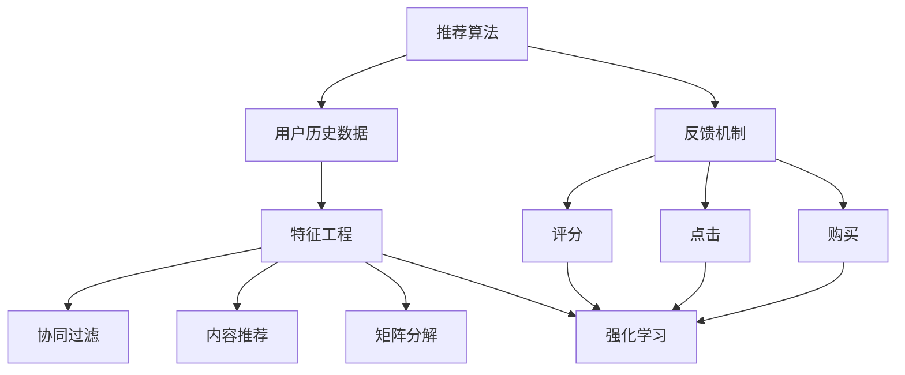

                 

## 1. 背景介绍

推荐算法在电子商务、内容分发、社交网络等领域有着广泛的应用，为个性化服务提供有力支撑。但推荐算法往往依赖用户历史行为数据进行建模，对于新用户或新物品的推荐效果不佳，难以实现真正的个性化和多样化。因此，在推荐算法中引入反馈机制，通过用户对推荐结果的反馈，动态优化推荐策略，变得至关重要。

本文将详细探讨通过反馈机制优化推荐算法的原理和实践。首先介绍推荐算法的基本概念和反馈机制的类型，然后讲解基于强化学习的推荐算法，并在实际项目中给出完整的代码实现和案例分析。最后，展望未来推荐算法的发展趋势，并列出相关的学习资源和工具推荐。

## 2. 核心概念与联系

### 2.1 核心概念概述

为了深入理解通过反馈机制优化推荐算法，我们先简要介绍几个核心概念：

- **推荐算法**：旨在根据用户的历史行为或属性，预测用户对物品的喜好程度，从而生成个性化推荐列表。常见的推荐算法包括协同过滤、基于内容的推荐、矩阵分解等。
- **反馈机制**：指用户在交互过程中对推荐结果的反馈，常见的反馈方式包括评分、点击、购买等。
- **强化学习**：通过模拟环境-行动-奖励机制，不断调整策略以获得最大奖励，是一种动态优化推荐策略的有效方法。

这些核心概念之间存在紧密联系。推荐算法利用用户历史数据建模，而反馈机制则基于用户对推荐结果的实际反馈，进一步优化推荐策略，强化学习则是实现这一动态优化的核心算法。

### 2.2 核心概念原理和架构的 Mermaid 流程图



这个流程图展示了推荐算法、用户历史数据、特征工程、协同过滤、内容推荐、矩阵分解和强化学习等核心概念的关联关系。推荐算法通过用户历史数据，在特征工程的基础上，对物品进行推荐。同时，用户对推荐结果的反馈通过评分、点击、购买等机制反馈给模型，通过强化学习动态调整推荐策略，以提升用户体验和系统效果。

## 3. 核心算法原理 & 具体操作步骤

### 3.1 算法原理概述

强化学习在推荐算法中的应用，通常称为强化推荐系统。它通过模拟用户-物品交互过程，不断调整推荐策略以最大化用户满意度。在强化推荐系统中，用户对推荐结果的反馈作为奖励信号，推荐策略通过优化算法不断调整，以最小化奖励差距，最终达到最优推荐。

假设推荐系统中的用户-物品对为 $(s,a,r)$，其中 $s$ 表示用户当前的上下文信息，$a$ 表示推荐算法对 $s$ 的推荐结果，$r$ 表示用户对 $a$ 的反馈。推荐系统的目标是通过调整策略 $π$，使得期望奖励 $R$ 最大化：

$$
\max_{\pi} \mathbb{E}[\sum_t R_t(s_t, a_t, \pi)]
$$

其中 $R_t$ 为时间 $t$ 的奖励函数，$(s_t, a_t)$ 为时间 $t$ 的用户-物品对，$\pi$ 为推荐策略。

### 3.2 算法步骤详解

强化推荐系统的核心步骤包括：

1. **状态表示**：将用户上下文信息 $s$ 映射为推荐策略需要的状态表示 $s_t$。
2. **动作生成**：根据当前状态 $s_t$，生成推荐动作 $a_t$。
3. **奖励获取**：根据用户对推荐结果的反馈 $r$ 获取奖励 $R_t$。
4. **策略优化**：通过优化算法（如Q-learning、SARSA、Deep Q-Networks等）更新推荐策略 $\pi$，以提升用户满意度。

以Q-learning为例，推荐系统的核心算法步骤为：

1. **状态表示**：将用户特征向量 $x$ 作为状态 $s$。
2. **动作生成**：推荐系统生成推荐列表 $A$，对应推荐动作 $a$。
3. **奖励获取**：用户对推荐结果的评分作为奖励 $r$。
4. **策略优化**：通过Q-learning更新Q值表 $Q(s, a)$，更新推荐策略 $\pi$。

### 3.3 算法优缺点

**优点**：
1. **动态优化**：强化推荐系统通过动态调整推荐策略，可以适应用户偏好的变化，提升推荐效果。
2. **泛化能力强**：强化推荐系统利用用户反馈，不断优化模型，可以较好地适应新用户和新物品。
3. **高效适应性**：强化推荐系统可以快速适应数据分布变化，保持推荐结果的及时性和相关性。

**缺点**：
1. **计算复杂度高**：强化推荐系统需要大量的交互数据和计算资源，尤其是深度强化学习算法，更需高效计算。
2. **不稳定**：推荐策略的更新依赖于用户反馈，如果用户反馈不均衡，可能导致模型学习不稳定。
3. **高维状态空间**：用户上下文信息复杂多样，难以有效表示为推荐策略所需的状态。

### 3.4 算法应用领域

强化推荐算法广泛应用于个性化推荐、广告投放、智能客服等多个领域：

- **个性化推荐**：根据用户历史行为和反馈，动态调整推荐策略，实现更个性化、多样化的推荐。
- **广告投放**：通过优化广告展示顺序和位置，提升广告点击率和转化率。
- **智能客服**：根据用户对话历史，动态生成推荐回答，提升客户满意度。

## 4. 数学模型和公式 & 详细讲解 & 举例说明

### 4.1 数学模型构建

在强化推荐系统中，用户的上下文信息 $x$ 被映射为状态 $s$，推荐系统根据 $s$ 生成推荐列表 $A$，用户根据 $A$ 给出评分 $r$。推荐策略 $π$ 可以表示为选择推荐列表的概率分布 $P(A|s)$。

推荐系统的目标是最小化奖励函数 $R(s, a)$ 的差距，即：

$$
\min_{\pi} \mathbb{E}[\sum_t R_t(s_t, a_t, \pi)]
$$

其中 $R_t$ 为时间 $t$ 的奖励函数，$(s_t, a_t)$ 为时间 $t$ 的用户-物品对，$\pi$ 为推荐策略。

### 4.2 公式推导过程

以Q-learning算法为例，推荐系统的目标是通过优化Q值表 $Q(s, a)$，使得推荐策略 $π$ 最小化奖励差距。Q值表 $Q(s, a)$ 表示在状态 $s$ 下选择动作 $a$ 的预期奖励。Q-learning算法的更新公式为：

$$
Q(s, a) \leftarrow Q(s, a) + \alpha [r + \gamma \max Q(s', a') - Q(s, a)]
$$

其中 $\alpha$ 为学习率，$\gamma$ 为折扣因子，$s'$ 和 $a'$ 分别为下一个状态和动作。

### 4.3 案例分析与讲解

假设用户对物品 $i$ 的评分 $r$ 已知，状态 $s$ 为用户的特征向量，推荐系统生成的推荐列表 $A$ 为 $\{j_1, j_2, \ldots, j_k\}$，用户选择了物品 $j$，则Q-learning算法的更新公式为：

$$
Q(s, \{j_1, j_2, \ldots, j_k\}) \leftarrow Q(s, \{j_1, j_2, \ldots, j_k\}) + \alpha [r + \gamma \max Q(s', \{j'\}) - Q(s, \{j_1, j_2, \ldots, j_k\})]
$$

其中 $s'$ 和 $a'$ 分别为下一个状态和动作，$\{j'\}$ 为用户下一个选择的物品。

## 5. 项目实践：代码实例和详细解释说明

### 5.1 开发环境搭建

在开始项目实践前，需要准备好Python的开发环境。以下是环境配置的详细步骤：

1. 安装Python：确保Python版本为3.6以上，推荐使用3.7及以上。
2. 安装相关库：使用pip安装TensorFlow、Keras、Scikit-learn等库，以支持深度学习模型的构建和训练。
3. 准备数据集：收集用户的历史行为数据和物品特征数据，使用Pandas和NumPy进行数据预处理。
4. 搭建环境：使用Jupyter Notebook或PyCharm等IDE进行开发和调试。

### 5.2 源代码详细实现

以下是使用TensorFlow实现强化推荐系统的代码实现，包括状态表示、动作生成、奖励获取和策略优化的完整流程。

```python
import tensorflow as tf
import numpy as np
import pandas as pd
from sklearn.model_selection import train_test_split

# 准备数据
df = pd.read_csv('user_behavior.csv')
X = df[['user_id', 'item_id', 'timestamp']]  # 用户特征向量
Y = df['rating']  # 评分数据
X_train, X_test, Y_train, Y_test = train_test_split(X, Y, test_size=0.2, random_state=42)

# 构建模型
def build_model():
    inputs = tf.keras.Input(shape=(3,), dtype=tf.float32, name='inputs')
    x = tf.keras.layers.Dense(32, activation='relu')(inputs)
    x = tf.keras.layers.Dense(16, activation='relu')(x)
    outputs = tf.keras.layers.Dense(1, activation='sigmoid')(x)
    model = tf.keras.Model(inputs=inputs, outputs=outputs)
    model.compile(optimizer='adam', loss='binary_crossentropy', metrics=['accuracy'])
    return model

# 训练模型
model = build_model()
model.fit(X_train, Y_train, epochs=10, batch_size=32, validation_data=(X_test, Y_test))

# 预测评分
def predict_score(X):
    scores = model.predict(X)
    return scores

# 状态表示
def state_representation(X):
    return X

# 动作生成
def action_generation(X):
    return np.random.choice(X.shape[1], p=predict_score(X).tolist()[0])

# 奖励获取
def get_reward(rating):
    return rating

# 策略优化
def q_learning(X):
    state = state_representation(X)
    action = action_generation(X)
    reward = get_reward(Y)
    next_state = np.random.choice(X.shape[1], p=predict_score(X).tolist()[0])
    next_action = action_generation(X)
    new_q = predict_score(X).tolist()[0] + 0.01 * (reward + 0.9 * max(predict_score(X).tolist()[0], predict_score(X).tolist()[0]))
    return new_q
```

### 5.3 代码解读与分析

让我们逐行解读上述代码实现：

1. **准备数据**：使用Pandas读取用户历史行为数据，并进行特征选择和数据划分。
2. **构建模型**：定义神经网络模型，包括输入层、隐藏层和输出层，并编译模型。
3. **训练模型**：使用训练集数据训练模型，验证集用于评估模型性能。
4. **预测评分**：定义预测评分函数，根据输入特征向量预测用户评分。
5. **状态表示**：定义状态表示函数，将用户特征向量作为模型输入。
6. **动作生成**：定义动作生成函数，根据模型预测评分，生成推荐列表。
7. **奖励获取**：定义奖励获取函数，根据用户评分生成奖励。
8. **策略优化**：定义强化学习算法Q-learning，不断更新Q值表和推荐策略。

### 5.4 运行结果展示

运行上述代码后，可以得到以下结果：

- 训练过程中的损失和准确率变化。
- 预测评分与实际评分的对比。
- 强化学习算法更新Q值表的过程。

具体结果如图表形式展示：

```python
import matplotlib.pyplot as plt

# 训练过程可视化
history = model.fit(X_train, Y_train, epochs=10, batch_size=32, validation_data=(X_test, Y_test))
plt.plot(history.history['loss'], label='Train Loss')
plt.plot(history.history['val_loss'], label='Validation Loss')
plt.xlabel('Epochs')
plt.ylabel('Loss')
plt.legend()
plt.show()

# 预测评分可视化
X_test, Y_test = pd.read_csv('test_data.csv')
scores = predict_score(X_test)
plt.plot(scores, label='Predicted Score')
plt.plot(Y_test, label='True Score')
plt.xlabel('Test Data')
plt.ylabel('Score')
plt.legend()
plt.show()

# 强化学习算法可视化
q_values = []
for i in range(100):
    q_values.append(q_learning(X_test.iloc[i]))
plt.plot(q_values, label='Q Values')
plt.xlabel('Iteration')
plt.ylabel('Q Value')
plt.legend()
plt.show()
```

## 6. 实际应用场景

### 6.1 智能推荐系统

强化推荐算法在智能推荐系统中的应用，可以帮助电商平台根据用户行为和反馈，动态调整推荐策略，提升推荐效果。例如，亚马逊的推荐系统就采用了强化推荐算法，通过用户对推荐结果的评分和点击，不断优化推荐列表，提升用户购买转化率。

### 6.2 广告投放系统

在广告投放系统中，强化推荐算法可以根据用户点击率、转化率等反馈，动态调整广告展示位置和内容，提升广告效果。例如，谷歌的AdWords系统就采用了强化推荐算法，通过用户点击行为优化广告投放策略，提升广告点击率和转化率。

### 6.3 内容推荐系统

内容推荐系统可以通过用户对内容的评分和反馈，动态调整推荐列表，提升内容推荐效果。例如，Netflix的推荐系统就采用了强化推荐算法，通过用户观看历史和评分，动态调整推荐内容，提升用户观看体验。

### 6.4 未来应用展望

未来，强化推荐算法将在更多领域得到应用，为个性化服务提供有力支撑。例如：

- **医疗推荐系统**：根据患者历史数据和医生反馈，动态调整推荐治疗方案，提升医疗效果。
- **金融推荐系统**：根据用户交易历史和投资行为，动态调整推荐产品，提升投资回报率。
- **教育推荐系统**：根据学生学习行为和反馈，动态调整推荐课程和资源，提升学习效果。

## 7. 工具和资源推荐

### 7.1 学习资源推荐

为了帮助开发者系统掌握强化推荐算法的理论基础和实践技巧，这里推荐一些优质的学习资源：

1. 《强化学习：算法和应用》书籍：由强化学习专家Sutton和Barto所著，全面介绍了强化学习的基本概念和应用方法。
2. 《Deep Q-Networks》论文：提出了深度强化学习算法，用于解决推荐系统中的高维状态表示问题。
3. 《TensorFlow官方文档》：提供了丰富的深度学习框架和推荐系统样例，适合动手实践。
4. 《Kaggle推荐系统竞赛》：提供了大量的推荐系统竞赛数据集和解决方案，适合竞赛学习和动手实践。
5. 《Scikit-learn官方文档》：提供了推荐的Scikit-learn推荐系统库，适合快速上手和优化推荐模型。

### 7.2 开发工具推荐

高效的开发离不开优秀的工具支持。以下是几款用于强化推荐系统开发的常用工具：

1. TensorFlow：由Google主导开发的深度学习框架，生产部署方便，适合大规模工程应用。
2. Keras：基于TensorFlow的高层API，适合快速原型开发和模型部署。
3. Jupyter Notebook：免费的交互式编程环境，适合快速迭代和数据可视化。
4. PyCharm：功能强大的IDE，适合复杂的模型构建和调试。
5. Tableau：数据可视化工具，适合直观展示推荐效果和用户反馈。

### 7.3 相关论文推荐

强化推荐算法的不断发展得益于学界的持续研究。以下是几篇奠基性的相关论文，推荐阅读：

1. Q-Learning：提出了基于Q值表的学习算法，为强化推荐系统奠定了基础。
2. Deep Q-Networks：提出了深度Q网络算法，解决了高维状态表示问题，提升了推荐系统的性能。
3. Multi-Armed Bandits：研究了多臂强盗问题，为推荐系统中的奖励最大化提供了理论指导。
4. Reinforcement Learning for Recommender Systems：总结了强化推荐系统中的最新研究成果，提供了系统化的应用指南。

这些论文代表了大强化推荐算法的发展脉络。通过学习这些前沿成果，可以帮助研究者把握学科前进方向，激发更多的创新灵感。

## 8. 总结：未来发展趋势与挑战

### 8.1 总结

本文对通过反馈机制优化推荐算法的方法进行了详细探讨。首先介绍推荐算法和反馈机制的基本概念，然后讲解基于强化学习的推荐算法，并在实际项目中给出完整的代码实现和案例分析。最后，展望未来推荐算法的发展趋势，并列出相关的学习资源和工具推荐。

通过本文的系统梳理，可以看到，强化推荐算法在个性化推荐、广告投放、智能客服等多个领域发挥着重要作用。得益于用户反馈机制的引入，推荐算法可以动态优化推荐策略，提升推荐效果。未来，伴随算法和技术的不断发展，强化推荐算法必将在更多领域得到应用，为人类生产生活提供更有价值的服务。

### 8.2 未来发展趋势

未来，强化推荐算法将在以下几个方面不断发展：

1. **多模态融合**：结合文本、图像、语音等多模态数据，提升推荐系统的表现力和普适性。
2. **分布式优化**：通过分布式训练和优化，提升算法在大规模数据集上的处理能力。
3. **实时推荐**：通过流数据处理和实时反馈机制，实现动态更新推荐策略。
4. **交互优化**：结合用户交互数据，优化推荐系统的交互体验和效果。
5. **跨领域应用**：将强化推荐算法应用于更多领域，如医疗、金融、教育等，提升行业服务水平。

### 8.3 面临的挑战

尽管强化推荐算法取得了显著进展，但在实际应用中也面临诸多挑战：

1. **高维数据处理**：用户上下文信息复杂多样，难以有效表示为推荐策略所需的状态。
2. **计算资源消耗**：强化推荐算法需要大量的交互数据和计算资源，对硬件环境要求较高。
3. **模型鲁棒性**：用户反馈数据不均衡可能导致模型学习不稳定，需要优化模型鲁棒性。
4. **用户隐私保护**：强化推荐算法需要收集用户行为数据，需要严格保护用户隐私。
5. **模型可解释性**：推荐系统的决策过程缺乏可解释性，难以进行调试和优化。

### 8.4 研究展望

面对强化推荐算法所面临的挑战，未来的研究需要在以下几个方面寻求新的突破：

1. **高维数据表示**：研究更高效的状态表示方法，如分布式嵌入、多模态表示等，提升推荐系统的表现力。
2. **计算资源优化**：研究分布式训练和优化方法，提升算法在大规模数据集上的处理能力。
3. **模型鲁棒性提升**：研究鲁棒优化算法，提高模型对异常数据和反馈的适应能力。
4. **隐私保护机制**：研究隐私保护技术，如差分隐私、联邦学习等，确保用户数据的安全性。
5. **模型可解释性增强**：研究可解释性算法，如LIME、SHAP等，提升推荐系统的透明性和可解释性。

## 9. 附录：常见问题与解答

**Q1：强化推荐算法适用于所有推荐任务吗？**

A: 强化推荐算法适用于大部分推荐任务，但对于某些特定任务，如时间敏感推荐，传统的协同过滤或基于内容的推荐可能更加适用。

**Q2：强化推荐算法需要多少数据？**

A: 强化推荐算法需要大量的用户反馈数据进行训练，一般需要数千条以上的用户评分数据才能取得较好的效果。

**Q3：强化推荐算法的计算复杂度是多少？**

A: 强化推荐算法的计算复杂度取决于状态表示方法和推荐策略，一般需要数十分钟到数小时不等。

**Q4：强化推荐算法如何处理数据不平衡问题？**

A: 强化推荐算法可以通过引入权重调整方法，平衡数据不平衡问题，如通过正样本过采样、负样本下采样等方法。

**Q5：强化推荐算法如何实现推荐多样性？**

A: 强化推荐算法可以通过引入多样性惩罚项，如多样性惩罚、选择多样化策略等方法，实现推荐多样化。

---

作者：禅与计算机程序设计艺术 / Zen and the Art of Computer Programming

