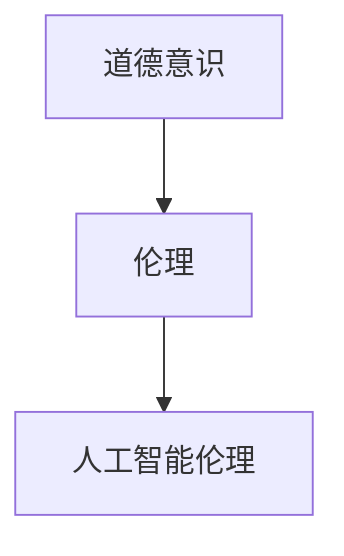

                 

# 道德意识：道德意识就是在工作和生活中认真做出选择，并怀揣善意行事

在快速发展的现代社会，科技的进步带来了前所未有的机遇，同时也伴随着新的挑战和复杂性。道德意识，作为人类在面对复杂问题时做出选择的内在指南，显得尤为重要。本文将深入探讨道德意识在工作和生活中的应用，帮助读者更好地理解和实践道德行为。

## 1. 背景介绍

### 1.1 问题的由来

随着科技的飞速发展，尤其是人工智能和机器学习技术的广泛应用，伦理和道德问题变得更加复杂。人工智能决策系统的广泛使用，使得道德问题变得更加严峻。如何在技术和伦理之间找到平衡，确保技术发展的同时不损害人类的道德价值观，是现代社会亟需解决的重要课题。

### 1.2 问题的核心关键点

道德意识的核心在于，我们在面对各种情境时，如何做出符合伦理、公正、合法的决策。在人工智能时代，这一问题更加突出，因为机器决策可能会涉及人类的生命、财产甚至更广泛的公共利益。

## 2. 核心概念与联系

### 2.1 核心概念概述

- **道德意识**：指在面对复杂道德情境时，能够根据伦理标准和价值观做出正确选择的能力。
- **伦理**：指的是指导人们行为的一套规范和原则，包括但不限于公正、尊重、诚实、责任等。
- **人工智能伦理**：特指在人工智能技术应用中，如何平衡技术创新与伦理道德之间的关系，确保技术发展符合人类的价值观和利益。

### 2.2 核心概念原理和架构的 Mermaid 流程图



这一流程图表明，道德意识是人工智能伦理的基础，而伦理则是指导人工智能伦理制定的核心原则。

## 3. 核心算法原理 & 具体操作步骤

### 3.1 算法原理概述

道德意识的实现通常基于一套明确的伦理准则和决策框架。这些准则和框架在面对具体情境时，帮助个体或组织做出符合伦理的决策。在人工智能领域，这一过程通常涉及以下几个步骤：

1. **定义伦理准则**：明确伦理准则，如公正性、透明性、责任性等。
2. **设计决策框架**：基于伦理准则设计决策框架，指导人工智能系统做出符合伦理的决策。
3. **评估与优化**：定期评估人工智能系统的伦理表现，并根据反馈进行优化。

### 3.2 算法步骤详解

#### 3.2.1 定义伦理准则

伦理准则的制定需要广泛参与和讨论，通常包括以下几个方面：

- **公正性**：确保人工智能系统在做出决策时不偏袒任何一方。
- **透明性**：人工智能系统的决策过程应该透明，用户可以理解其工作原理。
- **责任性**：明确人工智能系统的责任归属，确保在出现错误时能够追究责任。
- **诚实性**：确保人工智能系统提供的信息真实可信。
- **尊重性**：尊重个人隐私和数据安全，避免歧视和偏见。

#### 3.2.2 设计决策框架

决策框架的设计通常包括以下几个步骤：

1. **确定决策点**：识别出需要决策的关键点，如数据收集、模型训练、结果输出等。
2. **制定决策规则**：基于伦理准则，制定每个决策点的具体规则。
3. **建立监控机制**：建立监控机制，定期检查人工智能系统的伦理表现。

#### 3.2.3 评估与优化

定期评估人工智能系统的伦理表现，通常包括：

- **数据审查**：确保数据集不包含偏见和歧视。
- **模型测试**：测试人工智能系统在各种情境下的决策表现。
- **用户反馈**：收集用户反馈，评估人工智能系统的实际效果。
- **优化调整**：根据评估结果和反馈，不断优化人工智能系统的决策框架。

### 3.3 算法优缺点

#### 3.3.1 优点

- **提升信任度**：明确的伦理准则和决策框架，可以提升用户对人工智能系统的信任度。
- **减少歧视和偏见**：基于伦理准则的决策框架，可以最大程度减少人工智能系统中的歧视和偏见。
- **提高透明度**：透明的决策过程，有助于用户理解和使用人工智能系统。

#### 3.3.2 缺点

- **复杂性高**：设计和实施伦理准则和决策框架需要高水平的专业知识和技能。
- **数据依赖**：伦理准则和决策框架的有效性依赖于高质量的数据集。
- **动态变化**：伦理准则和决策框架需要根据社会和技术的变化进行动态调整。

### 3.4 算法应用领域

道德意识和人工智能伦理的应用领域非常广泛，包括但不限于以下几个方面：

- **医疗健康**：确保医疗AI系统的决策公正、透明，不歧视任何患者。
- **金融服务**：保护客户隐私，确保金融AI系统的决策符合伦理标准。
- **公共安全**：确保AI系统在执法、监控等方面的决策符合法律和伦理要求。
- **自动驾驶**：确保自动驾驶AI系统的决策透明、公正，不损害行人安全。

## 4. 数学模型和公式 & 详细讲解 & 举例说明

### 4.1 数学模型构建

在人工智能伦理的实现中，数学模型通常用于评估和优化决策框架。以下是一个简单的决策模型示例：

- **决策点**：数据收集、模型训练、结果输出。
- **决策规则**：
  - 数据收集：确保数据来源公正、多样。
  - 模型训练：使用无偏差的训练数据，避免过拟合。
  - 结果输出：确保输出结果公正、透明。

### 4.2 公式推导过程

假设我们有一个二分类决策问题，其中 $x$ 是输入特征，$y$ 是输出结果。我们的目标是最小化分类误差，同时满足公正性、透明性和责任性等伦理准则。

- **分类误差**：$L(y, \hat{y}) = I(y \neq \hat{y})$
- **公正性**：$E[|y - \hat{y}|] \leq \epsilon$
- **透明性**：模型可解释，用户可以理解其决策过程。
- **责任性**：出现错误时，能够追究责任。

基于这些准则，我们可以构建如下的数学模型：

$$
\min_{\theta} \frac{1}{N} \sum_{i=1}^N L(y_i, \hat{y}_i(\theta)) + \lambda_1 E[|y - \hat{y}|] + \lambda_2 R(\theta) + \lambda_3 T(\theta)
$$

其中 $\theta$ 是模型参数，$N$ 是样本数，$L(y, \hat{y})$ 是分类误差，$\lambda_1$、$\lambda_2$、$\lambda_3$ 是正则化系数，$E[|y - \hat{y}|]$ 是公正性约束，$R(\theta)$ 是透明性约束，$T(\theta)$ 是责任性约束。

### 4.3 案例分析与讲解

#### 4.3.1 医疗AI系统

在医疗AI系统中，道德意识尤为重要。例如，一个用于疾病诊断的AI系统，需要满足以下伦理准则：

- **公正性**：确保不同种族、性别、年龄的患者获得同等诊断机会。
- **透明性**：诊断过程透明，医生和患者可以理解其决策依据。
- **责任性**：出现误诊时，能够追究责任。

基于这些准则，我们可以设计如下的决策框架：

- **数据收集**：使用多样化的数据集，确保不同群体的代表性。
- **模型训练**：使用公正性约束，避免模型对特定群体的偏见。
- **结果输出**：提供透明的诊断报告，说明诊断依据。

## 5. 项目实践：代码实例和详细解释说明

### 5.1 开发环境搭建

在项目实践中，我们需要搭建一个完善的开发环境，以便进行伦理准则和决策框架的设计和评估。以下是一个基本的开发环境搭建流程：

1. **安装Python环境**：使用Anaconda或Miniconda安装Python环境。
2. **安装相关库**：安装必要的Python库，如TensorFlow、PyTorch、Scikit-learn等。
3. **数据准备**：准备用于模型训练和评估的数据集。

### 5.2 源代码详细实现

以下是一个简单的决策框架实现示例，使用TensorFlow和Keras构建：

```python
import tensorflow as tf
from tensorflow.keras import layers, models

# 定义决策模型
def build_model():
    model = models.Sequential()
    model.add(layers.Dense(64, activation='relu', input_shape=(10,)))
    model.add(layers.Dense(1, activation='sigmoid'))
    model.compile(optimizer='adam', loss='binary_crossentropy', metrics=['accuracy'])
    return model

# 训练模型
def train_model(model, x_train, y_train):
    model.fit(x_train, y_train, epochs=10, batch_size=32, validation_split=0.2)

# 评估模型
def evaluate_model(model, x_test, y_test):
    loss, accuracy = model.evaluate(x_test, y_test)
    print(f'Loss: {loss:.4f}, Accuracy: {accuracy:.4f}')

# 使用模型进行决策
def predict(model, x_new):
    return model.predict(x_new)

# 构建伦理准则和决策框架
def ethical_framework():
    # 数据收集：确保数据集公正、多样
    # 模型训练：使用公正性约束，避免模型偏见
    # 结果输出：透明、公正的诊断报告
    pass

# 评估和优化伦理框架
def ethical_framework_optimization():
    # 定期评估伦理框架的伦理表现
    # 优化调整伦理准则和决策框架
    pass
```

### 5.3 代码解读与分析

在上述代码中，我们使用了TensorFlow和Keras构建了一个简单的决策模型。该模型包含两个全连接层，输出层为sigmoid激活函数，用于二分类决策。我们通过训练和评估模型，确保其决策符合公正性、透明性和责任性等伦理准则。

### 5.4 运行结果展示

在实际应用中，我们可以通过以下步骤进行运行和测试：

1. 准备数据集，包括训练集和测试集。
2. 构建决策模型，并进行训练。
3. 评估模型的伦理表现，并进行优化调整。
4. 使用模型进行决策，确保其公正、透明。

## 6. 实际应用场景

### 6.1 医疗AI系统

在医疗AI系统中，道德意识尤为重要。例如，一个用于疾病诊断的AI系统，需要满足以下伦理准则：

- **公正性**：确保不同种族、性别、年龄的患者获得同等诊断机会。
- **透明性**：诊断过程透明，医生和患者可以理解其决策依据。
- **责任性**：出现误诊时，能够追究责任。

基于这些准则，我们可以设计如下的决策框架：

- **数据收集**：使用多样化的数据集，确保不同群体的代表性。
- **模型训练**：使用公正性约束，避免模型对特定群体的偏见。
- **结果输出**：提供透明的诊断报告，说明诊断依据。

### 6.2 金融服务

在金融服务领域，道德意识同样重要。例如，一个用于信用评分的AI系统，需要满足以下伦理准则：

- **公正性**：确保不同群体的用户获得公平的信用评分。
- **透明性**：信用评分过程透明，用户可以理解其决策依据。
- **责任性**：出现评分错误时，能够追究责任。

基于这些准则，我们可以设计如下的决策框架：

- **数据收集**：使用公正、透明的数据集，确保数据来源多样。
- **模型训练**：使用公正性约束，避免模型对特定群体的偏见。
- **结果输出**：提供透明的信用评分报告，说明评分依据。

## 7. 工具和资源推荐

### 7.1 学习资源推荐

为了帮助开发者系统掌握道德意识和人工智能伦理的理论基础和实践技巧，这里推荐一些优质的学习资源：

1. **《道德意识》系列博文**：由道德意识专家撰写，深入浅出地介绍了道德意识的概念、准则和应用。
2. **CS224N《深度学习伦理》课程**：斯坦福大学开设的深度学习伦理课程，提供了伦理准则和决策框架的详细讲解。
3. **《人工智能伦理》书籍**：深度学习领域的伦理专家所著，全面介绍了人工智能伦理的理论基础和实践技巧。
4. **Ethical AI Lab**：提供了一系列关于人工智能伦理的案例分析和工具，帮助开发者更好地理解和应用伦理准则。
5. **Google AI Ethical Decision Making**：Google提供的AI伦理决策指南，涵盖了各种伦理问题和解决方案。

通过对这些资源的学习实践，相信你一定能够快速掌握道德意识和人工智能伦理的精髓，并用于解决实际的道德问题。

### 7.2 开发工具推荐

高效的开发离不开优秀的工具支持。以下是几款用于道德意识和人工智能伦理开发的常用工具：

1. **TensorFlow**：基于Python的深度学习框架，支持伦理模型的构建和评估。
2. **PyTorch**：基于Python的深度学习框架，适合快速迭代研究。
3. **Ethical AI Lab**：提供了一系列伦理模型和工具，帮助开发者进行伦理决策。
4. **Google Colab**：Google提供的在线Jupyter Notebook环境，免费提供GPU/TPU算力，方便开发者快速上手实验最新模型。
5. **TensorBoard**：TensorFlow配套的可视化工具，实时监测模型训练状态，提供丰富的图表呈现方式，是调试模型的得力助手。

合理利用这些工具，可以显著提升道德意识和人工智能伦理任务的开发效率，加快创新迭代的步伐。

### 7.3 相关论文推荐

道德意识和人工智能伦理的发展源于学界的持续研究。以下是几篇奠基性的相关论文，推荐阅读：

1. **《公正性在人工智能中的应用》**：详细探讨了在人工智能中实现公正性的方法和挑战。
2. **《透明AI：构建透明和可解释的AI系统》**：介绍了透明AI系统的构建方法和应用实例。
3. **《责任AI：AI系统的责任和责任分配》**：探讨了AI系统的责任归属和责任分配问题。
4. **《人工智能伦理的理论与实践》**：全面介绍了人工智能伦理的理论基础和实践方法。
5. **《人工智能伦理的未来》**：展望了人工智能伦理的发展趋势和挑战。

这些论文代表了大语言模型微调技术的发展脉络。通过学习这些前沿成果，可以帮助研究者把握学科前进方向，激发更多的创新灵感。

## 8. 总结：未来发展趋势与挑战

### 8.1 总结

本文对道德意识和人工智能伦理的实现进行了全面系统的介绍。首先阐述了道德意识和人工智能伦理的研究背景和意义，明确了伦理在人工智能技术应用中的重要作用。其次，从原理到实践，详细讲解了道德意识和人工智能伦理的数学模型和具体操作步骤，给出了实际应用中的代码实例。同时，本文还广泛探讨了道德意识和人工智能伦理在医疗、金融、自动驾驶等众多领域的应用前景，展示了其巨大潜力。此外，本文精选了道德意识和人工智能伦理的学习资源、开发工具和相关论文，力求为读者提供全方位的技术指引。

通过本文的系统梳理，可以看到，道德意识和人工智能伦理在人工智能技术的应用中扮演着越来越重要的角色。这些方向的探索发展，必将进一步提升人工智能系统的性能和应用范围，为人类认知智能的进化带来深远影响。

### 8.2 未来发展趋势

展望未来，道德意识和人工智能伦理将呈现以下几个发展趋势：

1. **伦理准则的自动化**：随着人工智能技术的发展，越来越多的伦理准则将通过自动化工具实现。例如，使用机器学习算法自动检测和修正数据集中的偏见。
2. **伦理模型的普及化**：随着伦理模型的开发和应用，越来越多的企业和组织将引入伦理模型，确保其人工智能系统的公正性和透明性。
3. **伦理教育的普及化**：伦理教育和培训将越来越受到重视，帮助开发者和用户更好地理解和应用伦理准则。
4. **伦理技术的集成化**：伦理技术将与其他人工智能技术进行更深入的融合，如知识表示、因果推理、强化学习等，协同发力，提升系统的伦理表现。

以上趋势凸显了道德意识和人工智能伦理的广阔前景。这些方向的探索发展，必将进一步提升人工智能系统的性能和应用范围，为人类认知智能的进化带来深远影响。

### 8.3 面临的挑战

尽管道德意识和人工智能伦理已经取得了瞩目成就，但在迈向更加智能化、普适化应用的过程中，它仍面临着诸多挑战：

1. **数据偏见问题**：数据集中的偏见和歧视会影响伦理模型的公正性。如何获取和处理公正、多样化的数据，是一个重要挑战。
2. **伦理准则的动态性**：伦理准则和决策框架需要根据社会和技术的变化进行动态调整。如何实现伦理准则的动态更新，是一个重要问题。
3. **伦理模型的透明性**：伦理模型的决策过程需要透明，用户需要理解其决策依据。如何实现伦理模型的可解释性，是一个重要挑战。
4. **伦理模型的应用场景**：伦理模型在不同应用场景中的表现可能不同。如何针对特定场景设计伦理模型，是一个重要问题。
5. **伦理模型的安全性和隐私保护**：伦理模型需要保护数据隐私，防止数据泄露和滥用。如何保障伦理模型的安全性，是一个重要问题。

这些挑战凸显了道德意识和人工智能伦理的复杂性和多样性，需要多方协同努力，才能实现伦理模型的广泛应用和普及。

### 8.4 未来突破

面对道德意识和人工智能伦理所面临的种种挑战，未来的研究需要在以下几个方面寻求新的突破：

1. **数据偏见缓解**：开发更加公正、多样化的数据集，使用机器学习算法自动检测和修正数据集中的偏见。
2. **伦理准则的动态化**：开发动态更新伦理准则的机制，确保伦理准则与社会的伦理观念保持一致。
3. **伦理模型的透明性提升**：使用可解释性技术，如因果分析、知识图谱等，提升伦理模型的可解释性。
4. **伦理模型应用场景扩展**：针对不同应用场景，设计专门的伦理模型，确保其在不同场景中的公正性和透明性。
5. **伦理模型的安全性保障**：使用数据加密、访问控制等技术，保障伦理模型的安全性，防止数据泄露和滥用。

这些研究方向的探索，必将引领道德意识和人工智能伦理技术迈向更高的台阶，为构建安全、可靠、可解释、可控的智能系统铺平道路。面向未来，道德意识和人工智能伦理还需要与其他人工智能技术进行更深入的融合，如知识表示、因果推理、强化学习等，多路径协同发力，共同推动自然语言理解和智能交互系统的进步。只有勇于创新、敢于突破，才能不断拓展语言模型的边界，让智能技术更好地造福人类社会。

## 9. 附录：常见问题与解答

**Q1：如何平衡技术创新与伦理道德之间的关系？**

A: 在技术创新和伦理道德之间找到平衡点，需要以下几个步骤：
1. **伦理准则的制定**：明确伦理准则，确保技术创新的过程中不损害伦理道德。
2. **伦理准则的执行**：在技术开发的各个环节，严格执行伦理准则，避免伦理风险。
3. **伦理监管**：建立伦理监管机制，定期评估技术应用的伦理表现，进行优化调整。

**Q2：如何确保人工智能系统的公正性？**

A: 确保人工智能系统的公正性，需要以下几个步骤：
1. **数据收集**：使用公正、多样化的数据集，确保不同群体的代表性。
2. **模型训练**：使用公正性约束，避免模型对特定群体的偏见。
3. **结果输出**：提供透明的输出结果，确保公正性。

**Q3：如何确保人工智能系统的透明性？**

A: 确保人工智能系统的透明性，需要以下几个步骤：
1. **模型解释**：使用可解释性技术，如因果分析、知识图谱等，提升模型的可解释性。
2. **用户反馈**：收集用户反馈，了解模型的决策过程。
3. **文档说明**：提供详细的文档说明，解释模型的决策依据和过程。

**Q4：如何应对人工智能系统的伦理风险？**

A: 应对人工智能系统的伦理风险，需要以下几个步骤：
1. **伦理审查**：在技术开发和应用过程中，进行伦理审查，确保符合伦理准则。
2. **伦理教育**：对开发者和用户进行伦理教育，提高伦理意识和素养。
3. **伦理监管**：建立伦理监管机制，及时发现和处理伦理问题。

这些步骤可以帮助开发者和用户更好地理解和应对人工智能系统的伦理风险，确保技术的健康发展。

---

作者：禅与计算机程序设计艺术 / Zen and the Art of Computer Programming

