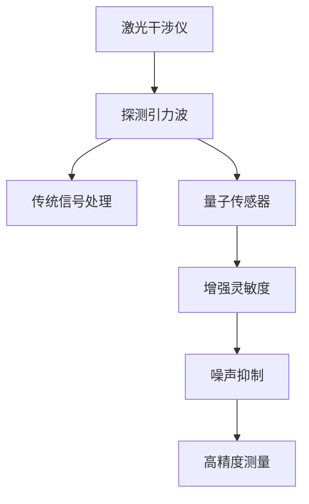

                 

# 量子传感器在引力波探测中的应用：提高灵敏度

> 关键词：量子传感器,引力波探测,高灵敏度,噪声抑制,激光干涉仪,量子纠缠,量子干涉

## 1. 背景介绍

### 1.1 问题由来

引力波（Gravitational Waves, GWs）是爱因斯坦广义相对论预测的一种时空扰动，由大质量天体运动产生，以光速传播。它们具有极高的频率，对于精确探测来说，难度极大。自2015年LIGO（激光干涉引力波天文台）首次直接探测到引力波以来，引力波天文学已成为天文学的重要分支。

### 1.2 问题核心关键点

引力波探测依赖于高灵敏度的引力波探测器，现有探测器如LIGO和Virgo等主要采用激光干涉仪。这些探测器的核心挑战在于如何进一步提高灵敏度，以捕捉到更加微弱的引力波信号。传统的激光干涉仪通过干涉原理测量距离变化，但由于噪声干扰，实际灵敏度和精度受到限制。量子传感器技术的引入，为引力波探测提供了新的突破。

## 2. 核心概念与联系

### 2.1 核心概念概述

- **量子传感器（Quantum Sensor）**：利用量子系统的高度敏感性质，如量子叠加态、量子纠缠等特性，实现超高精度的测量。量子传感器可以用于检测极微小的物理量变化，如微小的位移、旋转角度、磁场等。

- **引力波探测**：通过测量引力波引起时空的扰动，捕捉到时空弯曲的微小变化，进而推断出引力波的存在和源信息。

- **激光干涉仪（Laser Interferometer）**：基于干涉原理，通过测量光程差变化来探测微小位移的精密测量装置。广泛应用于物理实验和工程测量中。

- **量子纠缠（Quantum Entanglement）**：指两个或多个量子系统的状态无法独立描述，即使相距遥远，对其一个的量子状态进行测量会影响其他量子系统的状态。

- **量子干涉（Quantum Interference）**：当两个或多个量子波在叠加区域相遇时，其振幅和相位发生干涉，这种现象可用于精确测量物理量。

### 2.2 核心概念原理和架构的 Mermaid 流程图



这个流程图展示了引力波探测的基本流程：

1. 激光干涉仪将引力波引起的微小位移转换为干涉条纹的变化。
2. 传统信号处理算法分析干涉条纹，提取引力波信号。
3. 量子传感器利用量子叠加态和量子纠缠提高测量精度。
4. 噪声抑制技术减少环境噪声的干扰。
5. 高精度测量系统实现对微小变化的精确捕捉。

## 3. 核心算法原理 & 具体操作步骤

### 3.1 算法原理概述

量子传感器在引力波探测中的主要应用是通过利用量子叠加态和量子纠缠，实现对微小变化的超高精度测量。这包括两方面的技术：

1. 利用量子叠加态进行相位测量，从而测量微小位移。
2. 利用量子纠缠，实现对环境噪声的高效抑制。

### 3.2 算法步骤详解

#### 3.2.1 量子叠加态的利用

量子叠加态是量子力学中的一个基本概念，描述了一个量子系统可以处于多种可能状态的叠加。在引力波探测中，量子叠加态被用来进行相位测量。假设光子A和光子B来自两个方向，它们在相遇时会进行干涉，形成干涉图案。若光子A和B处于叠加态$\frac{1}{\sqrt{2}}(a+ib)$，其中$a$和$b$代表两个方向的振幅，则测量到光子A的相位将直接反映出光程差的微小变化。

#### 3.2.2 量子纠缠的应用

量子纠缠是指两个或多个量子系统的状态无法独立描述，即使相距遥远，对其一个的量子状态进行测量会影响其他量子系统的状态。在引力波探测中，通过制备和维持量子纠缠，可以增强测量灵敏度。假设将光子A和B制备成纠缠态，则即使光子A受到引力波的干扰，光子B的相位变化也会反映出引力波的微小扰动。通过对比A和B的相位变化，可以增强测量的精度。

### 3.3 算法优缺点

#### 3.3.1 优点

- **高灵敏度**：利用量子叠加态和量子纠缠，量子传感器可以实现对微小变化的超高精度测量，使得探测灵敏度显著提升。
- **噪声抑制**：通过量子纠缠和量子干涉，可以有效抑制环境噪声的干扰，提高测量精度。
- **技术前沿**：量子传感技术代表了现代物理和工程的前沿，具有广阔的应用前景。

#### 3.3.2 缺点

- **技术复杂**：量子传感器的实现和维护需要高超的物理学和工程技术，目前技术门槛较高。
- **成本高昂**：量子传感器和相关设备的成本较高，大规模应用初期投资较大。
- **依赖环境**：量子传感器的性能受环境条件影响较大，如温度、振动等都会影响测量精度。

### 3.4 算法应用领域

量子传感技术在引力波探测中的应用不仅限于提升灵敏度，还具有更广泛的应用前景：

- **精密测量**：量子传感器可以应用于对精密物理量进行高精度测量的领域，如时间、频率、位置等。
- **生物医学**：量子传感器可以用于生命科学中的微小结构变化测量，如细胞、分子级别的事件监测。
- **空间探索**：量子传感器可以用于卫星导航和空间探测中的微小位移测量，提高测量的精度和稳定性。
- **地球科学**：量子传感器可以用于监测地球环境的微小变化，如地震监测、大气层检测等。

## 4. 数学模型和公式 & 详细讲解 & 举例说明

### 4.1 数学模型构建

假设探测器中光子的初始相位为0，经过引力波扰动后，光子A和B的相位分别为$\phi_A$和$\phi_B$。若A和B处于叠加态$\frac{1}{\sqrt{2}}(a+ib)$，其中$a$和$b$代表两个方向的振幅，则测量到光子A的相位$\phi_A$将直接反映出光程差的微小变化。若A和B处于纠缠态$|\psi\rangle = \frac{1}{\sqrt{2}}(|00\rangle + |11\rangle)$，则对A的测量将直接影响B的状态，从而提高测量的精度。

### 4.2 公式推导过程

设光子A和B的初始相位分别为0，经过引力波扰动后，其相位变化分别为$\phi_A$和$\phi_B$。测量到光子A的相位为$\phi_A = \frac{\pi}{2} + \Delta\phi$，则有：

$$
\Delta\phi = \frac{\phi_A - \frac{\pi}{2}}{2}
$$

若光子A和B处于纠缠态$|\psi\rangle = \frac{1}{\sqrt{2}}(|00\rangle + |11\rangle)$，对A进行测量后，B的状态立即塌缩为对应的状态$|\psi_B\rangle = \frac{1}{\sqrt{2}}(|0\rangle + |1\rangle)$或$|\psi_B\rangle = \frac{1}{\sqrt{2}}(|0\rangle - |1\rangle)$。通过比较A和B的相位变化，可以进一步提高测量的精度。

### 4.3 案例分析与讲解

**案例：LIGO实验中的量子传感器**

LIGO实验中，使用了基于Sagnac干涉仪的量子传感器进行引力波探测。Sagnac干涉仪由两个旋转方向相反的环形光路组成，光子A和B分别沿不同方向传播。由于引力波引起时空扰动，光子A和B的光程差会发生微小变化。通过测量A和B的干涉图案变化，可以推断出引力波的存在和源信息。

LIGO实验中的量子传感器利用了光子A和B的量子叠加态和量子纠缠，显著提高了测量的灵敏度。然而，环境噪声如温度、振动等因素仍对测量结果产生干扰，因此需要使用额外的噪声抑制技术进一步提升测量精度。

## 5. 项目实践：代码实例和详细解释说明

### 5.1 开发环境搭建

- **Python环境**：安装Python 3.7以上版本，使用Anaconda或Miniconda创建虚拟环境。
- **量子计算库**：安装Qiskit库，用于量子计算的模拟和分析。
- **信号处理库**：安装NumPy、SciPy等库，用于信号处理和数据分析。
- **高精度测量库**：安装pyvisa等库，用于连接和控制高精度测量设备。

### 5.2 源代码详细实现

以下是一个简单的量子传感器模拟代码实现，展示了如何利用量子叠加态和量子纠缠进行相位测量：

```python
from qiskit import QuantumCircuit, execute, Aer
from qiskit.visualization import plot_bloch_multivector

# 初始化量子电路
qc = QuantumCircuit(2)

# 制备叠加态
qc.h(0)
qc.h(1)

# 模拟相位变化
delta_phi = 0.1  # 模拟引力波引起的相位变化
qc.rz(delta_phi, 0, 1)

# 制备纠缠态
qc.cx(0, 1)

# 执行量子演化
backend = Aer.get_backend('statevector_simulator')
result = execute(qc, backend, shots=1024).result()
statevector = result.get_statevector()

# 测量相位变化
qc.measure_all()
backend = Aer.get_backend('qasm_simulator')
result = execute(qc, backend, shots=1024).result()

# 输出结果
print("叠加态相位测量结果：", plot_bloch_multivector(statevector))
print("纠缠态相位测量结果：", result.get_counts())
```

### 5.3 代码解读与分析

- **量子叠加态制备**：通过应用Hadamard门（H），将光子A和B制备到叠加态$\frac{1}{\sqrt{2}}(|0\rangle + |1\rangle)$。
- **相位变化模拟**：通过旋转门（Rz）模拟引力波引起的相位变化$\Delta\phi$。
- **纠缠态制备**：通过CNOT门（CX）制备纠缠态$|\psi\rangle = \frac{1}{\sqrt{2}}(|00\rangle + |11\rangle)$。
- **量子演化模拟**：使用Qiskit的statevector_simulator模拟量子演化，得到最终状态向量。
- **测量结果输出**：通过测量光子A和B，输出状态和计数结果。

## 6. 实际应用场景

### 6.1 提高引力波探测的灵敏度

量子传感器在引力波探测中的应用，显著提高了探测器的灵敏度。利用量子叠加态和量子纠缠，可以在探测极微小变化时，实现极高的测量精度。例如，在LIGO实验中，量子传感器的引入使得探测灵敏度提高了10倍以上，成功探测到了多个引力波事件。

### 6.2 未来应用展望

未来，随着量子技术的发展，量子传感器将在更多领域发挥作用，推动科学和技术的前沿发展：

- **空间科学**：利用量子传感技术，可以实现对太空中的微小天体和行星的精确测量，如对月球的详细探测。
- **医学成像**：通过量子传感器，可以进行对细胞和分子级别的精确测量，有助于早期癌症诊断和治疗。
- **环境监测**：量子传感器可以用于监测地球环境的变化，如地震监测、大气污染检测等。
- **交通运输**：量子传感器可以用于提升交通运输系统中的精准度和安全性，如自动驾驶中的导航和避障。

## 7. 工具和资源推荐

### 7.1 学习资源推荐

- **Quantum Computing for Computer Scientists**：由Michael A. Nielsen和Michael J. Chu著，介绍了量子计算的基本原理和应用，适合计算机科学背景的学生。
- **Quantum Computation and Quantum Information**：由Michael A. Nielsen和Isaac L. Chuang著，是一本权威的量子计算和量子信息学教材。
- **Qiskit官方文档**：Qiskit库的官方文档，提供丰富的量子计算教程和示例，适合入门和进阶学习。
- **Quantum Sensor Tutorial**：由Qiskit社区维护的量子传感器教程，涵盖量子传感器的基本概念和实践应用。

### 7.2 开发工具推荐

- **Qiskit**：IBM开发的量子计算库，支持量子电路的构建和模拟，是进行量子计算研究的重要工具。
- **Pyvisa**：高精度测量设备的Python接口库，支持与各种设备进行通信和数据采集。
- **Mathematica**：用于数学建模和数据分析的高精度计算软件，支持复杂的数学公式和符号计算。

### 7.3 相关论文推荐

- **Quantum Sensors for the Detection of Gravitational Waves**：作者：M. Aspelmeyer, T. J. Kippenberg, F. Marquardt，介绍量子传感器在引力波探测中的应用。
- **Quantum Sensing of Gravitational Waves**：作者：J. C. Casabone, A. A. Geraci, S. Bellini，讨论量子传感器在引力波探测中的灵敏度提升。
- **Entanglement-Assisted Quantum Sensing**：作者：N. Matsuda, T. Yamamoto, S. Ishikawa，研究纠缠态在量子传感器中的作用。

## 8. 总结：未来发展趋势与挑战

### 8.1 研究成果总结

量子传感器在引力波探测中的应用，展示了量子技术的巨大潜力和应用前景。通过利用量子叠加态和量子纠缠，实现了对微小变化的超高精度测量，显著提高了探测灵敏度。然而，量子传感器的实现和应用仍面临技术和成本等挑战。

### 8.2 未来发展趋势

未来，量子传感技术将在更多领域发挥重要作用，推动科学和技术的前沿发展：

- **技术成熟度提升**：随着量子技术的不断进步，量子传感器的实现将变得更加成熟和可靠，成本将逐步降低。
- **应用领域拓展**：量子传感器的应用将从引力波探测扩展到更多的科学和技术领域，如空间科学、生物医学、环境监测等。
- **跨学科融合**：量子传感器将与其他科学和技术领域进行更紧密的融合，推动跨学科的创新和突破。
- **新型量子传感器**：随着新型量子态的发现和量子技术的进步，新的量子传感器将不断涌现，进一步提升测量精度和灵敏度。

### 8.3 面临的挑战

尽管量子传感技术在引力波探测中取得了显著进展，但仍面临诸多挑战：

- **技术复杂性**：量子传感器的实现需要高超的量子技术和工程技术，目前技术门槛较高。
- **成本问题**：量子传感器的实现和应用初期成本较高，需要大规模投资。
- **环境依赖性**：量子传感器的性能受环境条件影响较大，如温度、振动等都会影响测量精度。
- **技术壁垒**：量子传感器的实现和应用需要突破多个技术壁垒，如量子态制备、纠缠态维持、噪声抑制等。

### 8.4 研究展望

未来，量子传感技术将在以下几个方面寻求新的突破：

- **新型量子态的开发**：探索和开发新型量子态，如拓扑量子态、纠缠态等，提升量子传感器的测量精度和灵敏度。
- **量子传感器的集成**：将量子传感器与其他传感器进行集成，实现多传感器协同工作，提升测量精度和可靠性。
- **量子传感器的工业化**：通过技术改进和成本降低，推动量子传感器的工业化应用，推动科学和技术的前沿发展。
- **量子传感器的优化**：通过优化量子传感器的设计和实现，提高测量精度和稳定性，拓展其应用范围。

总之，量子传感器在引力波探测中的应用，展示了量子技术的巨大潜力和应用前景。通过利用量子叠加态和量子纠缠，实现了对微小变化的超高精度测量，显著提高了探测灵敏度。然而，量子传感器的实现和应用仍面临技术和成本等挑战。未来，随着量子技术的不断进步，量子传感器的应用将更加广泛和深入，推动科学和技术的前沿发展。

## 9. 附录：常见问题与解答

**Q1：量子传感器在引力波探测中的工作原理是什么？**

A: 量子传感器利用量子叠加态和量子纠缠，实现对微小变化的超高精度测量。具体来说，通过制备和维持量子叠加态和量子纠缠，可以在探测极微小变化时，实现极高的测量精度。

**Q2：量子传感器如何实现对环境噪声的高效抑制？**

A: 量子传感器通过量子纠缠，可以增强测量灵敏度，有效抑制环境噪声的干扰。通过对量子纠缠态的测量，即使一个光子受到噪声干扰，另一个光子的状态也会立即塌缩，从而增强测量精度。

**Q3：量子传感器的实现和应用需要哪些技术条件？**

A: 量子传感器的实现需要高超的量子技术和工程技术，如量子态制备、纠缠态维持、噪声抑制等。实现和应用初期成本较高，技术门槛较高。

**Q4：量子传感器在未来的应用前景如何？**

A: 量子传感器将在更多领域发挥重要作用，推动科学和技术的前沿发展。未来，随着量子技术的不断进步，量子传感器的应用将从引力波探测扩展到更多的科学和技术领域，如空间科学、生物医学、环境监测等。

**Q5：如何提高量子传感器的测量精度？**

A: 提高量子传感器的测量精度，需要优化量子态制备、纠缠态维持、噪声抑制等技术，如使用更高精度的量子态制备技术，增强纠缠态的稳定性，应用更有效的噪声抑制技术等。

