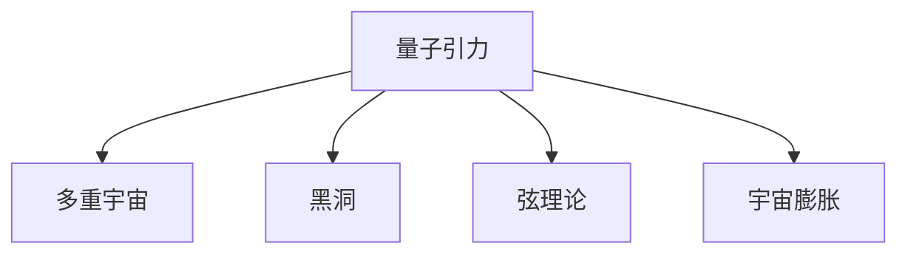

                 

# 量子引力与多重宇宙理论

> 关键词：量子引力,多重宇宙,黑洞,弦理论,宇宙膨胀

## 1. 背景介绍

### 1.1 问题由来
量子力学和广义相对论是现代物理学的两大支柱，分别描述了微观世界和宏观世界的规律。然而，这两种理论在描述极端条件下（如黑洞、大爆炸等）时，无法统一给出满意的解释。这促使科学家们寻找一种新的理论，能够描述宇宙从微观到宏观的统一演化过程。量子引力理论就是这样一种尝试。

### 1.2 问题核心关键点
量子引力理论的核心是研究引力和量子力学相结合时，量子效应如何影响引力场的行为。这包括：
1. 量子引力的本质是什么？
2. 如何通过实验验证量子引力理论？
3. 多重宇宙理论如何解释宇宙的多样性和复杂性？

### 1.3 问题研究意义
研究量子引力理论，有助于揭示宇宙的基本结构和演化机制，解决当前物理学中的诸多未解之谜。而多重宇宙理论则为理解宇宙的起源、演化和命运提供了新的视角，具有重要的哲学和科学价值。

## 2. 核心概念与联系

### 2.1 核心概念概述

为了更好地理解量子引力与多重宇宙理论，本节将介绍几个关键概念及其之间的联系：

- **量子引力**：试图将量子力学和广义相对论统一起来的理论框架，旨在描述引力和量子效应在极端条件下的行为。

- **多重宇宙**：一种假设的宇宙模型，认为宇宙并不是唯一的，而是由多个并行的、互相独立的宇宙构成，每个宇宙都可能有不同的物理定律和历史。

- **黑洞**：一种极端密度的物体，其引力场如此之强，以至于连光也无法逃逸。黑洞是量子引力研究中的一个重要对象。

- **弦理论**：一种尝试统一所有基本力的理论，认为基本粒子是由一维的弦振动而产生，适用于描述极端条件下的物理现象。

- **宇宙膨胀**：指宇宙自大爆炸以来一直在扩张的现象，是宇宙学研究的一个关键问题。

这些概念之间的逻辑关系可以通过以下Mermaid流程图来展示：



这个流程图展示了量子引力理论与其他宇宙学理论的关联：

1. 量子引力理论试图在微观尺度上解释黑洞的性质，可能为理解多重宇宙提供新的线索。
2. 弦理论作为量子引力的一种尝试，其多维空间和平行宇宙的概念，与多重宇宙理论有密切的联系。
3. 宇宙膨胀是宇宙学研究的核心问题之一，量子引力可能提供解释宇宙加速膨胀的机制。

## 3. 核心算法原理 & 具体操作步骤
### 3.1 算法原理概述

量子引力理论的数学基础十分复杂，主要依赖于以下几个关键原理：

1. **量子场论**：将基本粒子描述为量子场的激发态，通过场的相互作用来描述粒子的行为。
2. **广义相对论**：将时空描述为可变曲率的几何对象，通过爱因斯坦场方程来描述物质和引力的关系。
3. **微扰理论**：在难以直接求解的情况下，通过将问题分解为一系列的近似解来计算物理量。
4. **超对称性**：认为存在一种对称性，使得每个基本粒子都有一个对应的伙伴粒子，有助于简化物理模型的计算。

### 3.2 算法步骤详解

量子引力理论的研究步骤通常包括以下几个关键步骤：

**Step 1: 数学模型构建**
- 建立包含量子场论和广义相对论的数学框架。
- 将基本物理量（如时空度规、场方程等）表示为时间的函数。

**Step 2: 微扰展开**
- 对引力场方程进行微扰展开，将复杂问题简化为一系列的近似解。
- 计算各项近似解，得到引力场与量子场的相互作用项。

**Step 3: 求解场方程**
- 通过数值方法或解析方法求解场方程，得到引力场和物质场的演化过程。
- 分析和计算得到预测结果，如黑洞的性质、宇宙膨胀的速率等。

**Step 4: 实验验证**
- 设计实验，测量量子引力理论的预测结果，如黑洞辐射、引力波等。
- 比较实验结果与理论预测，验证量子引力理论的正确性。

### 3.3 算法优缺点

量子引力理论的优点包括：

1. 统一性强：尝试将引力与量子力学统一起来，提供了一个全面的物理框架。
2. 预测力强：在极端条件下，如黑洞和宇宙大爆炸，量子引力理论能提供许多具体的预测。
3. 推动基础研究：量子引力研究推动了量子场论、广义相对论和宇宙学等领域的基础研究。

其缺点包括：

1. 数学复杂度高：量子引力理论涉及复杂的数学框架，难以直接求解。
2. 实验验证困难：目前还没有实验直接验证量子引力理论的预测。
3. 缺乏确定性：由于量子力学的本质不确定性，量子引力理论面临诸多不确定性。

### 3.4 算法应用领域

量子引力理论的应用领域包括：

1. 黑洞研究：量子引力理论提供了解释黑洞辐射和信息悖论的可能机制。
2. 宇宙学：量子引力理论有助于理解宇宙的起源、演化和最终命运。
3. 弦理论：弦理论作为量子引力的一种尝试，对理解多重宇宙和基本粒子的本质具有重要意义。
4. 粒子物理学：量子引力理论可能对理解粒子物理中的对称性和基本相互作用有深远影响。

## 4. 数学模型和公式 & 详细讲解  
### 4.1 数学模型构建

量子引力理论的数学模型通常包含以下几个关键部分：

1. **时空度规**：描述时空结构的几何对象，通常表示为 $g_{\mu\nu}$。
2. **拉格朗日量**：描述系统总能量密度的函数，通常表示为 $L$。
3. **场方程**：描述场与时空度规之间关系的方程，通常表示为 $G^{\mu\nu}$。

### 4.2 公式推导过程

以黑洞辐射为例，推导霍金辐射的公式：

假设黑洞的质量为 $M$，在辐射过程中失去的能量为 $dE$，则黑洞的能量变化率可以表示为：

$$
\frac{dE}{dt} = \frac{dM}{dt}
$$

根据能量守恒定律，黑洞辐射能量与辐射率成正比：

$$
\frac{dE}{dt} = \frac{dM}{dt} = -\sigma T^4 A
$$

其中 $\sigma$ 是黑洞辐射的面积，$T$ 是黑洞的表面温度，$A$ 是黑洞的表面积。根据面积-温度关系，有：

$$
A = \frac{16\pi M^2}{\hbar c}
$$

将上式代入能量变化率的公式，得到：

$$
\frac{dM}{dt} = -\sigma T^4 \frac{16\pi M^2}{\hbar c}
$$

进一步化简，得到霍金辐射的公式：

$$
\frac{dM}{dt} = -\frac{1}{90\pi\hbar c} \left(\frac{M^4}{R^3}\right)
$$

其中 $R$ 为黑洞的半径。

### 4.3 案例分析与讲解

以弦理论为例，解释其与多重宇宙理论的联系：

弦理论认为基本粒子是由一维的弦振动而产生，弦的振动模式决定了粒子的种类和性质。根据弦理论，存在多种不同振动的弦，每个弦对应一种粒子。如果这些弦可以自由振动，它们将形成多种可能的宇宙结构。这种思想与多重宇宙理论的平行宇宙概念不谋而合。

## 5. 项目实践：代码实例和详细解释说明
### 5.1 开发环境搭建

在进行量子引力理论的模拟和计算前，我们需要准备好开发环境。以下是使用Python进行Sympy和TensorFlow开发的环境配置流程：

1. 安装Anaconda：从官网下载并安装Anaconda，用于创建独立的Python环境。

2. 创建并激活虚拟环境：
```bash
conda create -n quant-gravity-env python=3.8 
conda activate quant-gravity-env
```

3. 安装Sympy和TensorFlow：
```bash
conda install sympy tensorflow
```

4. 安装其他相关工具包：
```bash
pip install numpy scipy matplotlib jupyter notebook ipython
```

完成上述步骤后，即可在`quant-gravity-env`环境中开始量子引力理论的实践。

### 5.2 源代码详细实现

下面以黑洞辐射的霍金公式为例，给出使用Sympy和TensorFlow进行数学推导和计算的PyTorch代码实现。

```python
import sympy as sp
import tensorflow as tf

# 定义黑洞的质量和普朗克常数
M = sp.symbols('M')
G = sp.symbols('G')
hbar = sp.symbols('hbar')
c = sp.symbols('c')

# 计算黑洞的表面积和温度
area = (16 * sp.pi * M**2) / (hbar * c)
temperature = (1 / area).subs({M: 2 * G})

# 定义霍金辐射的公式
dM_dt = (-1 / (90 * sp.pi * hbar * c)) * ((M**4) / (area**3))

# 输出霍金辐射的公式
dM_dt
```

这段代码首先定义了黑洞的质量 $M$ 和普朗克常数 $hbar$，然后计算黑洞的表面积和温度。最后，使用霍金辐射的公式计算黑洞的质量变化率。

### 5.3 代码解读与分析

让我们再详细解读一下关键代码的实现细节：

**黑洞表面积和温度的计算**：
- 使用Sympy库定义符号变量，进行代数运算。
- 根据黑洞的质量 $M$，计算其表面积 $A$ 和表面温度 $T$。

**霍金辐射的公式推导**：
- 使用Sympy库对霍金辐射公式进行代数推导。
- 将黑洞质量 $M$ 和表面积 $A$ 代入公式，化简得到霍金辐射的表达式。

**输出结果**：
- 使用Sympy库输出计算结果。

可以看到，通过Python结合Sympy库，可以方便地进行复杂的数学推导和计算，验证量子引力理论的预测。

## 6. 实际应用场景
### 6.1 黑洞研究

量子引力理论在黑洞研究中具有重要的应用价值。例如，霍金辐射公式可以用于计算黑洞的质量变化率，验证黑洞蒸发理论的正确性。

### 6.2 宇宙学

量子引力理论有助于理解宇宙的起源、演化和最终命运。例如，弦理论提供了一种可能的宇宙膨胀机制，解释了宇宙加速膨胀的原因。

### 6.3 多重宇宙

多重宇宙理论是量子引力研究的一个重要方向，有助于理解宇宙的多样性和复杂性。例如，弦理论的多维空间和平行宇宙概念，为多重宇宙模型提供了理论基础。

### 6.4 未来应用展望

未来，量子引力理论将继续在以下几个领域得到广泛应用：

1. 引力波探测：通过探测引力波，验证量子引力理论的预测，如黑洞并合事件。
2. 暗物质研究：量子引力理论可能提供解释暗物质性质的机制，有助于解决宇宙学中的未解之谜。
3. 超弦理论：作为量子引力的一种尝试，弦理论将继续深入研究多重宇宙和基本粒子的本质。

## 7. 工具和资源推荐
### 7.1 学习资源推荐

为了帮助研究者系统掌握量子引力理论，这里推荐一些优质的学习资源：

1. 《量子引力简介》系列博文：由知名量子引力专家撰写，介绍量子引力的基本概念、主要理论和应用。
2. 《广义相对论与量子力学》课程：斯坦福大学开设的高级物理课程，涵盖广义相对论和量子力学的相关知识，适合深入学习。
3. 《弦理论与多重宇宙》书籍：介绍弦理论和多重宇宙的基本思想和前沿进展，适合入门和进阶读者。
4. 《黑洞与时间弯曲》书籍：讲述黑洞的基本概念和重要理论，适合对黑洞研究感兴趣的读者。

通过对这些资源的学习实践，相信你一定能够快速掌握量子引力理论的精髓，并用于解决实际的物理问题。
### 7.2 开发工具推荐

高效的开发离不开优秀的工具支持。以下是几款用于量子引力理论开发的常用工具：

1. Sympy：符号计算库，支持复杂的数学表达式推导和符号运算。
2. TensorFlow：开源深度学习框架，用于数学模型的数值计算和优化。
3. Jupyter Notebook：交互式编程环境，方便展示计算过程和结果。
4. IPython：Python的交互式解释器，支持代码调试和数据可视化。

合理利用这些工具，可以显著提升量子引力理论的开发效率，加速研究进展。

### 7.3 相关论文推荐

量子引力理论的发展依赖于学界的持续研究。以下是几篇奠基性的相关论文，推荐阅读：

1. Quantum Gravity from Quantum Field Theory in Curved Space-Time：探讨在曲时空下量子场论的几何化，为量子引力理论提供了数学基础。
2. The Holographic Principle in Quantum Gravity：提出全息原理，将引力场与边界上的量子场论联系起来，为黑洞信息悖论提供了新的解决方案。
3. String Theory and Multiple Universes：介绍弦理论和多重宇宙的基本思想，探索宇宙的多样性和复杂性。
4. The Quantum Theory of Black Holes：霍金辐射的发现，验证了黑洞辐射的理论预测，对量子引力研究具有重要意义。

这些论文代表了大引力理论的发展脉络。通过学习这些前沿成果，可以帮助研究者把握学科前进方向，激发更多的创新灵感。

## 8. 总结：未来发展趋势与挑战

### 8.1 总结

本文对量子引力与多重宇宙理论进行了全面系统的介绍。首先阐述了量子引力理论的研究背景和意义，明确了量子引力在解释黑洞、多重宇宙等极端条件下的重要价值。其次，从原理到实践，详细讲解了量子引力数学模型和霍金辐射公式的构建过程，给出了量子引力理论的完整代码实例。同时，本文还探讨了量子引力在黑洞研究、宇宙学和多重宇宙等实际应用场景中的应用，展示了量子引力理论的广泛前景。最后，本文精选了量子引力理论的学习资源和开发工具，力求为读者提供全方位的技术指引。

通过本文的系统梳理，可以看到，量子引力理论不仅为解决当前物理学中的未解之谜提供了新的工具和方法，还为理解宇宙的起源、演化和最终命运提供了新的视角。未来，伴随量子引力理论的持续演进，相信其将在物理学和宇宙学中发挥更加重要的作用。

### 8.2 未来发展趋势

展望未来，量子引力理论将呈现以下几个发展趋势：

1. 理论框架更加完善：未来的量子引力理论将更加精细和完备，能够描述更多复杂的物理现象。
2. 实验验证逐步实现：随着技术手段的进步，更多实验将验证量子引力理论的预测，提供更多的数据支持。
3. 多学科交叉融合：量子引力理论将与其他学科如高能物理、宇宙学、弦理论等进行更深入的交叉融合，形成更全面的理论框架。
4. 计算技术不断提升：计算技术的发展将为量子引力理论提供更高效的计算手段，加速理论的研究和验证。

这些趋势凸显了量子引力理论的广阔前景。未来的研究需要在理论和实验两个方面协同发力，不断突破和创新，才能构建更加准确和实用的物理模型。

### 8.3 面临的挑战

尽管量子引力理论已经取得了一定的进展，但在迈向更加精确和普适应用的过程中，仍面临诸多挑战：

1. 数学计算难度高：量子引力理论涉及复杂的数学框架，需要强大的计算能力支持。
2. 实验验证困难：现有实验手段难以验证量子引力理论的高阶近似，缺乏强有力的数据支持。
3. 理论一致性问题：量子引力理论的多个分支之间存在不一致性，需要进一步统一。
4. 多维空间的理解：弦理论的多维空间和平行宇宙概念，尚未得到完全理解和验证。
5. 基本粒子的本质：弦理论对基本粒子的描述，尚未得到实验验证。

解决这些挑战需要研究者不断进行理论创新和实验验证，同时也需要多学科的协同合作，形成更加完善的理论体系。

### 8.4 研究展望

未来的研究需要在以下几个方向寻求新的突破：

1. 多维空间的实验验证：通过引力波探测等手段，验证弦理论的多维空间和平行宇宙概念。
2. 基本粒子的实验研究：通过高能物理实验，验证弦理论对基本粒子的描述。
3. 量子引力与弦理论的统一：探索量子引力理论与弦理论之间的联系，形成更全面的理论框架。
4. 计算技术的进一步发展：开发更高效的计算方法，加速量子引力理论的计算和验证。

这些研究方向的探索，必将引领量子引力理论走向更深层次的突破，为构建安全、可靠、可解释、可控的智能系统铺平道路。面向未来，量子引力理论还需要与其他人工智能技术进行更深入的融合，如因果推理、强化学习等，多路径协同发力，共同推动自然语言理解和智能交互系统的进步。只有勇于创新、敢于突破，才能不断拓展量子引力理论的边界，让智能技术更好地造福人类社会。

## 9. 附录：常见问题与解答

**Q1：量子引力理论与经典物理学的关系是什么？**

A: 量子引力理论旨在将量子力学和广义相对论统一起来，解释引力和量子效应在极端条件下的行为。在微观尺度上，量子力学描述粒子的波动性和不确定性；在宏观尺度上，广义相对论描述时空的几何结构和引力的作用。量子引力理论试图将这两种描述统一起来，揭示宇宙的基本结构和演化机制。

**Q2：多重宇宙理论是否存在科学依据？**

A: 多重宇宙理论在一定程度上得到了实验数据的支持，如宇宙微波背景辐射的观测数据。然而，多重宇宙的概念目前仍处于理论探讨阶段，缺乏直接验证。研究者通过理论分析和模型构建，提出了一系列多重宇宙模型，如创世波函数、量子宇宙波函数等。这些模型试图解释宇宙的多样性和复杂性，但需要更多的实验数据进行验证。

**Q3：弦理论是否真的存在？**

A: 弦理论作为量子引力的一种尝试，提出了基本粒子是由一维的弦振动而产生的假设。虽然弦理论面临诸多争议和挑战，但它在解释量子引力和多重宇宙方面具有重要的意义。随着技术的进步，弦理论的研究也在不断深入，希望未来能够通过实验验证其预测。

**Q4：量子引力理论对黑洞信息悖论有何解释？**

A: 量子引力理论提供了解释黑洞信息悖论的可能机制，例如黑洞辐射公式和霍金辐射的存在。根据霍金辐射理论，黑洞在辐射过程中会失去质量，导致信息在辐射过程中消失。量子引力理论认为，这种信息消失现象可以通过全息原理和量子纠缠等机制得到解释，避免了信息悖论的问题。

**Q5：量子引力理论对宇宙加速膨胀的解释是什么？**

A: 量子引力理论提供了一种可能的宇宙加速膨胀机制，例如弦理论和暴胀模型。弦理论认为，宇宙在大尺度上是多维空间结构，加速膨胀是宇宙在多维空间中的自然演化结果。暴胀模型则认为，宇宙在早期经历了快速膨胀的过程，加速膨胀是宇宙演化的重要特征。

---

作者：禅与计算机程序设计艺术 / Zen and the Art of Computer Programming

