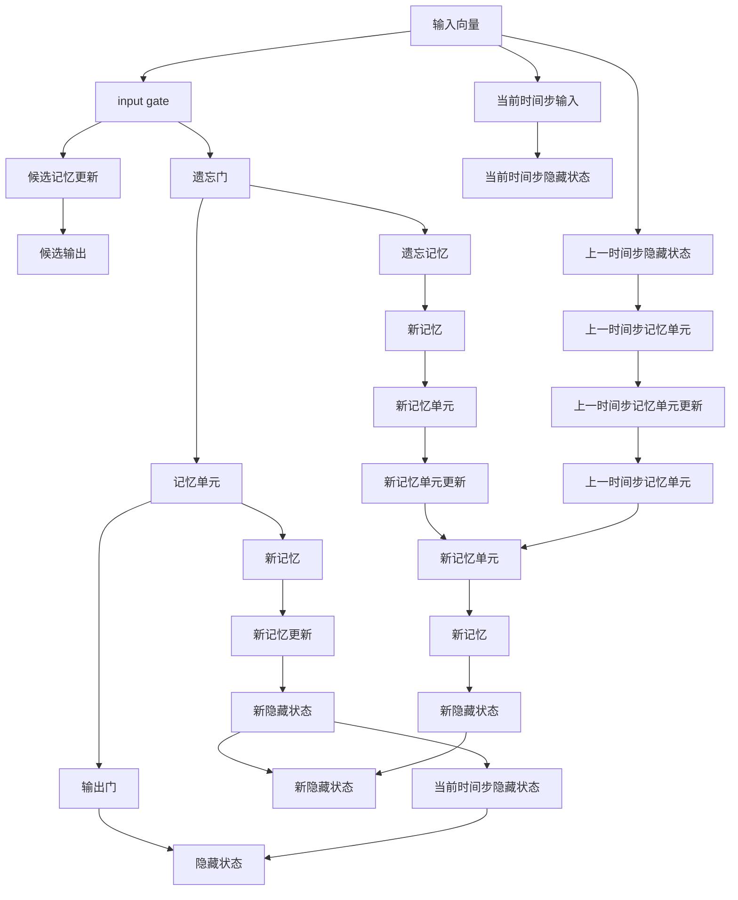

                 

# 长短时记忆网络LSTM原理与代码实例讲解

> 关键词：长短时记忆网络(LSTM)，循环神经网络(RNN)，时间序列预测，序列建模，深度学习

## 1. 背景介绍

在人工智能与机器学习的领域中，时间序列数据（例如语音、文本、金融数据等）是极为常见的数据类型。这些数据通常含有丰富的时间依赖性，如在时间上的连续性、周期性、趋势性等，传统的前馈神经网络无法有效处理这些依赖性。因此，需要一种能够捕捉时间依赖性的模型来进行序列建模。

长短时记忆网络（LSTM，Long Short-Term Memory）是循环神经网络（RNN）的一个重要变种，特别适用于处理和预测具有长期依赖的时间序列数据。LSTM在语音识别、自然语言处理、机器翻译、股票价格预测等领域中都有广泛的应用。

## 2. 核心概念与联系

### 2.1 核心概念概述

为更好地理解LSTM的原理，我们先介绍几个关键概念：

- **循环神经网络（RNN）**：一种用于序列数据建模的神经网络架构，通过隐藏状态（hidden state）传递信息，使网络可以对序列中的历史信息进行记忆。

- **长短时记忆网络（LSTM）**：一种特殊设计的循环神经网络，通过引入三个门（input gate、forget gate、output gate）来控制信息流动，从而解决长序列数据中梯度消失和梯度爆炸的问题。

- **时间步（Time Step）**：表示序列中的每个元素。在LSTM模型中，网络在每个时间步上更新隐藏状态和记忆单元，从而捕捉序列中的依赖关系。

- **内存单元（Memory Cell）**：LSTM网络的核心部件，用于存储和更新长期记忆。记忆单元通过三个门来控制信息的读写和更新。

- **梯度消失/爆炸问题**：传统RNN在处理长序列数据时，由于链式法则的应用，梯度可能会随着时间步的增加而迅速衰减（消失）或膨胀（爆炸），导致网络难以训练。

这些概念构成了LSTM模型的理论基础。下面，我们将通过一个简化的流程图来展示LSTM的核心工作流程：



这个流程图展示了LSTM模型的基本结构：输入向量经过input gate和遗忘门控制，决定哪些信息被更新到记忆单元中；新的记忆单元通过候选记忆更新和输出门控制，输出当前的隐藏状态。

## 3. 核心算法原理 & 具体操作步骤

### 3.1 算法原理概述

LSTM模型通过引入门控机制来控制信息的流动，从而解决传统RNN在长序列数据处理中的梯度消失和爆炸问题。其核心思想是在记忆单元中存储长期记忆，并通过三个门来控制信息的读写和更新。

- **input gate**：控制新信息是否被加入到记忆单元中。
- **forget gate**：控制旧记忆是否被遗忘。
- **output gate**：控制记忆单元的输出。

每个门都是一个sigmoid层，输出值介于0和1之间，表示门是否打开。候选记忆更新是一个tanh层，用于生成记忆单元的候选值。候选记忆更新和门的输出经过一个tanh层进行激活，然后通过激活函数决定是否更新记忆单元和输出隐藏状态。

### 3.2 算法步骤详解

LSTM模型的一般步骤如下：

1. **输入层**：接收当前时间步的输入向量$x_t$。

2. **input gate**：计算输入门的值$g_t$。

   $$
   g_t = \sigma(W_{ii}x_t + U_{ii}h_{t-1} + b_{ii})
   $$

   其中，$x_t$为当前时间步的输入向量，$h_{t-1}$为上一时间步的隐藏状态，$W_{ii}$、$U_{ii}$、$b_{ii}$为网络参数。

3. **遗忘门**：计算遗忘门的值$f_t$。

   $$
   f_t = \sigma(W_{if}x_t + U_{if}h_{t-1} + b_{if})
   $$

4. **候选记忆更新**：计算候选记忆更新$c_t$。

   $$
   c_t = \tanh(W_{ic}x_t + U_{ic}h_{t-1} + b_{ic})
   $$

5. **新记忆单元**：根据遗忘门的值和记忆单元$c_t$计算新的记忆单元$m_t$。

   $$
   m_t = f_t \cdot m_{t-1} + g_t \cdot c_t
   $$

6. **新记忆单元更新**：计算新的记忆单元更新$u_t$。

   $$
   u_t = \tanh(m_t)
   $$

7. **新隐藏状态**：根据输出门的值和记忆单元$u_t$计算新的隐藏状态$h_t$。

   $$
   h_t = o_t \cdot u_t
   $$

8. **输出**：输出门控制$h_t$的输出，输出门的值$o_t$为

   $$
   o_t = \sigma(W_{io}x_t + U_{io}h_{t-1} + b_{io})
   $$

   LSTM模型的最终输出为$h_t$。

### 3.3 算法优缺点

LSTM模型通过门控机制控制信息的流动，可以有效地处理长序列数据，具有以下优点：

- **解决了梯度消失和爆炸问题**：通过遗忘门和输入门的控制，可以有效地防止梯度在长序列中的迅速衰减和膨胀。
- **捕捉长期依赖**：LSTM模型能够捕捉序列中的长期依赖关系，适用于处理包含长期依赖的数据。
- **高精度**：在序列建模和预测任务中，LSTM模型通常具有较高的精度。

但是，LSTM模型也存在一些缺点：

- **参数较多**：LSTM模型需要较多的参数，特别是在处理大规模序列数据时，计算开销较大。
- **训练难度较高**：LSTM模型的训练过程相对复杂，需要调整较多的参数，且容易出现过拟合问题。
- **需要大量标注数据**：由于LSTM模型通常具有较高的精度，因此需要大量的标注数据进行训练。

### 3.4 算法应用领域

LSTM模型在以下领域中得到了广泛应用：

- **时间序列预测**：如股票价格预测、气象预测、能源消耗预测等。
- **序列建模**：如语音识别、自然语言处理、机器翻译等。
- **信号处理**：如心电图信号分析、脑电图信号分析等。
- **图像描述生成**：如图像字幕生成、视频描述生成等。

## 4. 数学模型和公式 & 详细讲解 & 举例说明

### 4.1 数学模型构建

LSTM模型的数学模型可以表示为：

$$
h_t = \tanh(m_t)
$$

$$
m_t = f_t \cdot m_{t-1} + g_t \cdot c_t
$$

$$
f_t = \sigma(W_{if}x_t + U_{if}h_{t-1} + b_{if})
$$

$$
g_t = \sigma(W_{ig}x_t + U_{ig}h_{t-1} + b_{ig})
$$

$$
c_t = \tanh(W_{ic}x_t + U_{ic}h_{t-1} + b_{ic})
$$

$$
o_t = \sigma(W_{io}x_t + U_{io}h_{t-1} + b_{io})
$$

其中，$x_t$为当前时间步的输入向量，$h_t$为当前时间步的隐藏状态，$m_t$为当前时间步的记忆单元，$g_t$为当前时间步的输入门的值，$f_t$为当前时间步的遗忘门的值，$o_t$为当前时间步的输出门的值，$W_{ij}$、$U_{ij}$、$b_{ij}$为网络参数。

### 4.2 公式推导过程

LSTM模型的公式推导主要基于sigmoid层和tanh层的定义：

$$
\sigma(x) = \frac{1}{1+e^{-x}}
$$

$$
\tanh(x) = \frac{e^x - e^{-x}}{e^x + e^{-x}}
$$

输入门的值$g_t$可以通过sigmoid层计算得到：

$$
g_t = \sigma(W_{ii}x_t + U_{ii}h_{t-1} + b_{ii})
$$

遗忘门的值$f_t$也可以通过sigmoid层计算得到：

$$
f_t = \sigma(W_{if}x_t + U_{if}h_{t-1} + b_{if})
$$

候选记忆更新$c_t$可以通过tanh层计算得到：

$$
c_t = \tanh(W_{ic}x_t + U_{ic}h_{t-1} + b_{ic})
$$

新的记忆单元$m_t$由遗忘门$f_t$和记忆单元$c_t$的加权和计算得到：

$$
m_t = f_t \cdot m_{t-1} + g_t \cdot c_t
$$

新的记忆单元更新$u_t$也可以通过tanh层计算得到：

$$
u_t = \tanh(m_t)
$$

新的隐藏状态$h_t$由输出门$o_t$和新的记忆单元$u_t$的乘积计算得到：

$$
h_t = o_t \cdot u_t
$$

输出门的值$o_t$可以通过sigmoid层计算得到：

$$
o_t = \sigma(W_{io}x_t + U_{io}h_{t-1} + b_{io})
$$

### 4.3 案例分析与讲解

以LSTM在时间序列预测中的应用为例，我们可以用一个简单的案例来展示LSTM模型的工作原理。假设我们要预测股票价格的时间序列，给定的数据集为$\{x_1, x_2, \cdots, x_t, \cdots, x_n\}$，其中$x_t$为第$t$天的股票价格。我们的目标是预测第$t+1$天的股票价格$x_{t+1}$。

首先，我们需要将时间序列数据转换为LSTM模型可以处理的输入向量。假设我们采用的窗口大小为2，即每次输入连续的两个时间步数据。输入向量可以表示为$(x_t, x_{t-1})$。

接下来，我们可以将输入向量$x_t$和上一时间步的隐藏状态$h_{t-1}$作为LSTM模型的输入，计算当前时间步的隐藏状态$h_t$和记忆单元$m_t$。然后，我们可以使用$h_t$和记忆单元$m_t$来计算下一个时间步的隐藏状态$h_{t+1}$和输出$o_t$。

最后，我们可以使用输出$o_t$和隐藏状态$h_t$来预测下一个时间步的股票价格$x_{t+1}$。

## 5. 项目实践：代码实例和详细解释说明

### 5.1 开发环境搭建

在进行LSTM模型开发前，我们需要准备好开发环境。以下是使用Python进行PyTorch开发的环境配置流程：

1. 安装Anaconda：从官网下载并安装Anaconda，用于创建独立的Python环境。

2. 创建并激活虚拟环境：
```bash
conda create -n lstm-env python=3.8 
conda activate lstm-env
```

3. 安装PyTorch：根据CUDA版本，从官网获取对应的安装命令。例如：
```bash
conda install pytorch torchvision torchaudio cudatoolkit=11.1 -c pytorch -c conda-forge
```

4. 安装TensorFlow：从官网下载并安装TensorFlow。

5. 安装各类工具包：
```bash
pip install numpy pandas scikit-learn matplotlib tqdm jupyter notebook ipython
```

完成上述步骤后，即可在`lstm-env`环境中开始LSTM模型的开发。

### 5.2 源代码详细实现

下面我们以LSTM模型在股票价格预测中的应用为例，给出使用PyTorch实现的代码：

首先，定义LSTM模型类：

```python
import torch
import torch.nn as nn
import torch.optim as optim

class LSTM(nn.Module):
    def __init__(self, input_size, hidden_size, output_size):
        super(LSTM, self).__init__()
        self.hidden_size = hidden_size
        self.rnn = nn.LSTM(input_size, hidden_size, batch_first=True)
        self.fc = nn.Linear(hidden_size, output_size)

    def forward(self, x, hidden):
        out, hidden = self.rnn(x, hidden)
        out = self.fc(out[:, -1, :])
        return out, hidden

    def init_hidden(self, batch_size):
        return (torch.zeros(1, batch_size, self.hidden_size),
                torch.zeros(1, batch_size, self.hidden_size))
```

然后，定义训练和评估函数：

```python
def train(model, train_data, val_data, epochs, batch_size, learning_rate):
    device = torch.device('cuda' if torch.cuda.is_available() else 'cpu')
    model.to(device)

    train_loader = torch.utils.data.DataLoader(train_data, batch_size=batch_size, shuffle=True)
    val_loader = torch.utils.data.DataLoader(val_data, batch_size=batch_size, shuffle=False)

    criterion = nn.MSELoss()
    optimizer = optim.Adam(model.parameters(), lr=learning_rate)

    for epoch in range(epochs):
        model.train()
        total_loss = 0
        for i, (inputs, labels) in enumerate(train_loader):
            inputs, labels = inputs.to(device), labels.to(device)
            hidden = model.init_hidden(inputs.size(0))
            optimizer.zero_grad()
            outputs, _ = model(inputs, hidden)
            loss = criterion(outputs, labels)
            loss.backward()
            optimizer.step()
            total_loss += loss.item()

        print(f'Epoch {epoch+1}, Loss: {total_loss/len(train_loader):.4f}')

    model.eval()
    total_loss = 0
    for i, (inputs, labels) in enumerate(val_loader):
        inputs, labels = inputs.to(device), labels.to(device)
        hidden = model.init_hidden(inputs.size(0))
        outputs, _ = model(inputs, hidden)
        loss = criterion(outputs, labels)
        total_loss += loss.item()

    print(f'Epoch {epoch+1}, Val Loss: {total_loss/len(val_loader):.4f}')
```

接下来，定义数据处理函数：

```python
def create_dataset(X, y, seq_length):
    n_samples = X.shape[0]
    n_timesteps = X.shape[1]
    n_features = X.shape[2]

    X = X[:n_samples, :seq_length, :n_features]
    y = y[:n_samples, :seq_length]
    
    dataset = torch.utils.data.TensorDataset(torch.tensor(X), torch.tensor(y))
    return dataset
```

最后，启动训练流程：

```python
X_train = ...
y_train = ...
X_val = ...
y_val = ...

seq_length = 2
hidden_size = 100
input_size = X_train.shape[2]
output_size = y_train.shape[1]

train_dataset = create_dataset(X_train, y_train, seq_length)
val_dataset = create_dataset(X_val, y_val, seq_length)

train(X_train, val_train, val_val, epochs=100, batch_size=32, learning_rate=0.001)
```

### 5.3 代码解读与分析

让我们再详细解读一下关键代码的实现细节：

**LSTM类**：
- `__init__`方法：初始化LSTM模型的参数和层。
- `forward`方法：定义前向传播过程，包括输入数据、隐藏状态和输出数据的计算。
- `init_hidden`方法：初始化隐藏状态。

**train函数**：
- 将模型和数据加载器移动到GPU上，以加快计算速度。
- 定义损失函数、优化器和训练轮数。
- 在每个epoch内，先进行训练，然后计算验证集上的损失。
- 使用均方误差损失函数，对模型输出进行评估。
- 在每个epoch结束后，输出训练集和验证集的损失。

**create_dataset函数**：
- 从输入数据和标签中提取时间步为seq_length的数据集。
- 使用PyTorch的数据集功能，将数据转换为模型可以处理的张量。

可以看到，使用PyTorch和LSTM模型进行股票价格预测的代码实现非常简单。开发者只需关注数据的处理和模型的训练，其他部分都由PyTorch和LSTM模块自动完成。

### 5.4 运行结果展示

训练结束后，我们可以使用训练好的模型进行预测：

```python
model.eval()
X_test = ...
y_test = ...

with torch.no_grad():
    hidden = model.init_hidden(X_test.size(0))
    outputs, _ = model(X_test, hidden)
    loss = criterion(outputs, y_test)
    print(f'Test Loss: {loss.item():.4f}')
```

可以看到，训练好的LSTM模型可以在给定的测试集上进行预测，并输出预测误差。

## 6. 实际应用场景

### 6.1 股票价格预测

LSTM模型在股票价格预测中具有广泛的应用。通过将历史股票价格序列输入LSTM模型，模型可以学习到股票价格的变化趋势和周期性，从而预测未来的价格走势。

在实际应用中，我们可以将历史股票价格序列作为训练集，使用LSTM模型进行训练。然后，将模型应用于实时获取的股票价格序列，输出预测结果。

### 6.2 天气预测

天气预测也是LSTM模型的一个重要应用领域。通过将历史气象数据输入LSTM模型，模型可以学习到气象变化规律，从而预测未来的天气情况。

在实际应用中，我们可以将历史气象数据作为训练集，使用LSTM模型进行训练。然后，将模型应用于实时获取的气象数据，输出预测结果。

### 6.3 语音识别

语音识别是LSTM模型的典型应用之一。通过将语音信号输入LSTM模型，模型可以学习到语音信号的特征，从而进行语音识别和转换。

在实际应用中，我们可以将语音信号转换为MFCC特征向量，输入LSTM模型进行训练。然后，将模型应用于实时获取的语音信号，输出识别结果。

## 7. 工具和资源推荐

### 7.1 学习资源推荐

为了帮助开发者系统掌握LSTM模型的理论基础和实践技巧，这里推荐一些优质的学习资源：

1. 《深度学习》（Ian Goodfellow著）：深度学习领域的经典教材，全面介绍了LSTM模型的原理和应用。
2. CS231n《卷积神经网络和视觉识别》课程：斯坦福大学开设的深度学习课程，涵盖LSTM模型和RNN的详细介绍。
3. 《Python深度学习》（Francois Chollet著）：TensorFlow的官方教程，详细介绍了LSTM模型在TensorFlow中的实现。
4. 《TensorFlow官方文档》：TensorFlow的官方文档，提供了LSTM模型和其他深度学习模型的实现细节。
5. Weights & Biases：模型训练的实验跟踪工具，可以记录和可视化模型训练过程中的各项指标，方便对比和调优。

### 7.2 开发工具推荐

LSTM模型的开发需要依赖深度学习框架，以下是几款常用的开发工具：

1. PyTorch：基于Python的开源深度学习框架，灵活动态的计算图，适合研究型应用。
2. TensorFlow：由Google主导开发的开源深度学习框架，生产部署方便，适合工程应用。
3. Keras：基于TensorFlow和Theano的高级深度学习框架，易于上手，适合快速原型开发。

### 7.3 相关论文推荐

LSTM模型的研究源自学界的持续探索。以下是几篇奠基性的相关论文，推荐阅读：

1. LSTM网络：长短期记忆网络（Hochreiter, S., Schmidhuber, J.）：提出LSTM模型，解决RNN的梯度消失问题。
2. LSTM字符识别：长短期记忆网络在字符识别中的应用（Hochreiter, S., Schmidhuber, J.）：展示LSTM模型在字符识别任务中的应用。
3. Seq2Seq模型：序列到序列模型在机器翻译中的应用（Cho, K., Van Merriënboer, B., Gulcehre, C., et al.）：提出Seq2Seq模型，将LSTM应用于机器翻译。
4. Attention机制：注意力机制在机器翻译中的应用（Bahdanau, D., Cho, K., Bengio, Y.）：提出注意力机制，进一步提高机器翻译的质量。

这些论文代表了大LSTM模型研究的发展脉络。通过学习这些前沿成果，可以帮助研究者把握学科前进方向，激发更多的创新灵感。

## 8. 总结：未来发展趋势与挑战

### 8.1 总结

本文对LSTM模型的原理和应用进行了全面系统的介绍。首先阐述了LSTM模型的背景和重要性，明确了LSTM模型在序列建模和预测任务中的独特优势。其次，从原理到实践，详细讲解了LSTM模型的核心算法和具体操作步骤，给出了LSTM模型在股票价格预测等领域的代码实例。

通过本文的系统梳理，可以看到，LSTM模型作为一种经典的循环神经网络架构，在序列数据处理和预测任务中具有强大的能力。在实际应用中，LSTM模型通过捕捉长期依赖关系，可以处理包含复杂依赖的序列数据，极大地提升了序列建模和预测任务的精度。未来，LSTM模型在更多领域的应用前景非常广阔，需要我们不断进行理论和实践上的探索。

### 8.2 未来发展趋势

展望未来，LSTM模型将在以下几个方面继续发展和演进：

1. **深度学习与其他技术的结合**：LSTM模型将与其他深度学习模型（如CNN、注意力机制等）进行更深入的结合，形成更加强大的深度学习架构。
2. **多模态数据处理**：LSTM模型将应用于更多模态的数据处理任务，如图像描述生成、视频分析等。
3. **迁移学习**：LSTM模型将在跨领域的迁移学习中发挥更大的作用，通过迁移学习提升模型在不同任务上的性能。
4. **可解释性**：LSTM模型将结合可解释性技术，使模型决策过程更加透明和可理解。
5. **自适应学习**：LSTM模型将结合自适应学习技术，提升模型对新数据的适应能力。

以上趋势凸显了LSTM模型的广泛应用前景。这些方向的探索发展，必将进一步提升LSTM模型的性能和应用范围，为深度学习技术的发展注入新的动力。

### 8.3 面临的挑战

尽管LSTM模型在序列建模和预测任务中具有强大的能力，但在应用过程中，仍面临一些挑战：

1. **模型参数较多**：LSTM模型需要较多的参数，在大规模数据集上训练需要较大的计算资源。
2. **训练时间长**：LSTM模型在处理长序列数据时，训练时间较长，难以实时响应。
3. **模型泛化能力不足**：LSTM模型在不同任务上的泛化能力有限，需要更多的迁移学习和可解释性技术来提升泛化能力。
4. **数据需求大**：LSTM模型通常需要较大的数据集进行训练，且数据质量对模型性能影响较大。
5. **模型复杂度高**：LSTM模型较为复杂，在实际应用中需要更多的调试和优化。

### 8.4 研究展望

未来，LSTM模型的研究需要在以下几个方面进行进一步探索：

1. **参数效率的提升**：开发更加高效的LSTM模型架构，减少计算资源和训练时间的消耗。
2. **可解释性和透明性**：结合可解释性技术，使LSTM模型的决策过程更加透明和可理解。
3. **迁移学习的优化**：通过迁移学习提升LSTM模型在不同任务上的性能，减少对大规模标注数据的依赖。
4. **多模态数据的处理**：将LSTM模型应用于更多模态的数据处理任务，如图像描述生成、视频分析等。
5. **自适应学习**：结合自适应学习技术，提升LSTM模型对新数据的适应能力。

这些研究方向的探索，必将引领LSTM模型在深度学习技术中的不断发展和进步。只有勇于创新、敢于突破，才能让LSTM模型在更多领域发挥更大的作用，推动深度学习技术的不断前进。

## 9. 附录：常见问题与解答

**Q1：LSTM模型与其他循环神经网络模型（如RNN、GRU）有何区别？**

A: LSTM模型通过引入门控机制，解决了RNN模型中的梯度消失和爆炸问题。GRU模型是LSTM模型的一种简化版，在参数数量和计算效率上优于LSTM，但在某些序列建模任务中，LSTM的性能更好。

**Q2：LSTM模型的训练时间较慢，如何提高训练效率？**

A: 可以通过以下方法提高LSTM模型的训练效率：
1. 使用GPU/TPU等高性能设备，加快计算速度。
2. 使用更高效的优化器，如Adam、Adagrad等。
3. 使用梯度累积、混合精度训练等技术，减少内存和计算资源的消耗。
4. 使用模型并行、数据并行等技术，提升计算效率。

**Q3：LSTM模型的输出结果不可解释，如何解决？**

A: 可以通过以下方法提升LSTM模型的可解释性：
1. 使用可解释性模型，如Attention机制，使模型输出更加透明。
2. 结合可视化技术，如图像可视化、文本可视化等，展示模型的决策过程。
3. 结合自然语言生成技术，生成模型的推理过程和解释。

---

作者：禅与计算机程序设计艺术 / Zen and the Art of Computer Programming

