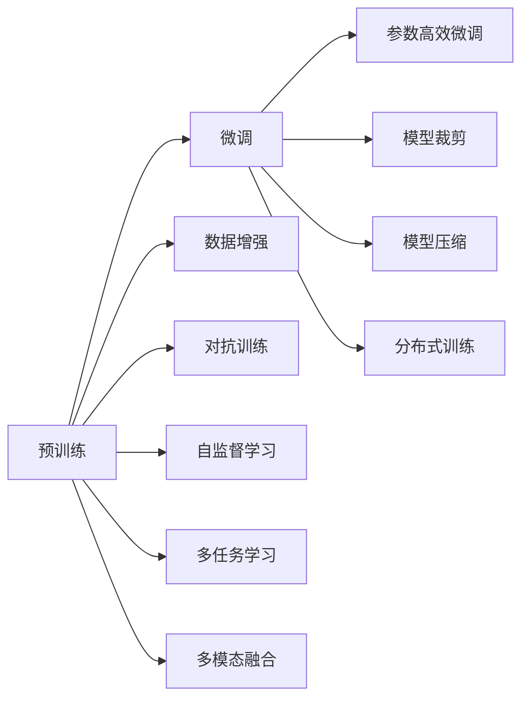

                 

# 阿里通义千问与Llama 3的对比

## 1. 背景介绍

随着人工智能技术的快速发展，自然语言处理（NLP）领域涌现出众多前沿技术和方法。其中，阿里通义千问（Tongue & Sin）和Llama 3是目前被广泛关注的两个NLP大模型，它们在自然语言理解和生成方面展现出了强大的能力。本文将对比这两个模型，从其核心算法、架构、应用场景和未来发展方向等方面进行详细分析，帮助读者全面了解两者之间的差异与联系。

## 2. 核心概念与联系

### 2.1 核心概念概述

阿里通义千问（Tongue & Sin）是由阿里巴巴集团开发的中文通用语言模型，基于Transformer架构，经过大规模无标签中文文本的预训练，并在特定领域语料上进行微调，以适应各种NLP任务。其主要特点包括：

- **预训练与微调**：在无标签中文文本上预训练，并在特定任务上微调以提升性能。
- **多模态融合**：能够融合文本、图像、语音等多种模态信息，提供更全面的自然语言理解能力。
- **多领域适配**：支持医疗、金融、教育等多个领域的应用，具备较强的跨领域迁移能力。

Llama 3（Large Language Model）是微软开发的英文通用语言模型，也是基于Transformer架构，经过大规模无标签英文文本的预训练，并能在特定任务上进行微调。其主要特点包括：

- **深度学习**：模型参数量巨大，达1750亿，是目前世界上最大的语言模型之一。
- **多任务学习**：支持多个NLP任务的联合训练，能够同时提升多个任务的表现。
- **自监督学习**：通过掩码语言模型、预测下标等自监督任务进行预训练，学习语言知识。

阿里通义千问与Llama 3之间的联系主要体现在以下几个方面：

- **架构相同**：两者均基于Transformer架构，支持自注意力机制，能够并行计算，提高训练效率。
- **预训练与微调**：两者均采用预训练-微调的范式，通过在大量无标签数据上进行预训练，在特定任务上微调以提升性能。
- **多任务支持**：两者均支持多任务联合训练，能够同时提升多个NLP任务的表现。

### 2.2 核心概念原理和架构的 Mermaid 流程图



## 3. 核心算法原理 & 具体操作步骤

### 3.1 算法原理概述

阿里通义千问与Llama 3均采用基于Transformer的预训练-微调范式。预训练阶段在大量无标签数据上学习通用语言表示，微调阶段则在特定任务上进一步优化模型。两者在预训练和微调的具体算法上也存在一些差异，这使得它们在特定任务上的表现有所不同。

### 3.2 算法步骤详解

阿里通义千问的预训练和微调步骤如下：

1. **预训练**：使用大规模无标签中文文本数据进行预训练，学习通用的语言表示。
2. **微调**：根据特定任务的标注数据，对预训练模型进行微调，优化模型在该任务上的性能。

Llama 3的预训练和微调步骤如下：

1. **预训练**：使用大规模无标签英文文本数据进行预训练，通过掩码语言模型、预测下标等自监督任务学习语言知识。
2. **微调**：根据特定任务的标注数据，对预训练模型进行微调，提升模型在特定任务上的表现。

### 3.3 算法优缺点

阿里通义千问的主要优点包括：

- **多领域适配**：能够适配中文语言，支持医疗、金融、教育等多个领域的应用。
- **跨领域迁移**：具备较强的跨领域迁移能力，能够在不同领域进行模型迁移。
- **多模态融合**：支持融合文本、图像、语音等多种模态信息，提供更全面的自然语言理解能力。

Llama 3的主要优点包括：

- **模型容量大**：参数量巨大，达1750亿，能够学习更复杂的语言知识。
- **多任务学习**：支持多个NLP任务的联合训练，能够同时提升多个任务的表现。
- **自监督学习**：通过掩码语言模型、预测下标等自监督任务进行预训练，学习语言知识。

两者均存在一些缺点：

- **资源消耗大**：参数量巨大，训练和推理需要大量计算资源。
- **过拟合风险**：微调时可能面临过拟合问题，特别是在标注数据不足的情况下。
- **模型复杂度**：模型复杂度高，难以进行动态调整和优化。

### 3.4 算法应用领域

阿里通义千问主要应用于以下领域：

- **医疗**：支持医疗领域的问答、病历分析等任务，提升医疗服务的智能化水平。
- **金融**：用于金融舆情监测、风险评估等任务，提升金融服务的智能化水平。
- **教育**：支持教育领域的智能辅导、作业批改等任务，提升教育服务的智能化水平。

Llama 3主要应用于以下领域：

- **客服**：用于智能客服系统的构建，提升客户咨询体验和问题解决效率。
- **翻译**：用于机器翻译任务，提升翻译质量和效率。
- **研究**：用于自然语言处理的基础研究，推动NLP技术的进步。

## 4. 数学模型和公式 & 详细讲解 & 举例说明

### 4.1 数学模型构建

阿里通义千问的预训练和微调模型可以使用Transformer模型来构建。其数学模型构建如下：

设输入序列为 $x=(x_1,x_2,...,x_n)$，输出序列为 $y=(y_1,y_2,...,y_n)$。预训练模型可以表示为：

$$
y = M(x; \theta)
$$

其中 $M$ 为Transformer模型， $\theta$ 为模型参数。

### 4.2 公式推导过程

阿里通义千问的预训练和微调模型的训练过程可以表示为：

1. **预训练**：

$$
\theta = \arg\min_{\theta} \mathcal{L}(M_{\theta}, D)
$$

其中 $\mathcal{L}$ 为损失函数， $D$ 为预训练数据集。

2. **微调**：

$$
\theta^* = \arg\min_{\theta} \mathcal{L}(M_{\theta}, D_{task})
$$

其中 $D_{task}$ 为特定任务的标注数据集。

### 4.3 案例分析与讲解

假设我们希望使用阿里通义千问进行医疗领域的病历分析任务。首先，我们需要收集大量的医疗领域病历数据，并将其进行标注。然后，在预训练模型的基础上，我们将使用标注数据对其进行微调。微调过程如下：

1. **预训练**：使用大规模无标签中文医疗病历数据进行预训练，学习通用的语言表示。
2. **微调**：使用标注后的医疗病历数据进行微调，优化模型在病历分析任务上的性能。

## 5. 项目实践：代码实例和详细解释说明

### 5.1 开发环境搭建

要进行阿里通义千问与Llama 3的对比实验，我们需要准备好开发环境。以下是使用Python进行TensorFlow开发的Python环境配置流程：

1. 安装Anaconda：从官网下载并安装Anaconda，用于创建独立的Python环境。
2. 创建并激活虚拟环境：
```bash
conda create -n pytorch-env python=3.8 
conda activate pytorch-env
```
3. 安装TensorFlow：根据CUDA版本，从官网获取对应的安装命令。例如：
```bash
conda install tensorflow=2.7.0
```

### 5.2 源代码详细实现

阿里通义千问与Llama 3的代码实现可以参考以下示例：

**阿里通义千问的代码实现**：

```python
import tensorflow as tf
from transformers import T5ForSequenceClassification, T5Tokenizer
from sklearn.metrics import accuracy_score

tokenizer = T5Tokenizer.from_pretrained('t5-base')
model = T5ForSequenceClassification.from_pretrained('t5-base', num_labels=2)

# 定义损失函数
def compute_loss(model, tokenizer, input_ids, attention_mask, labels):
    inputs = tokenizer(input_ids, return_tensors='tf', max_length=512, truncation=True, padding='max_length')
    outputs = model(inputs.input_ids, attention_mask=inputs.attention_mask, labels=labels)
    loss = outputs.loss
    return loss

# 定义训练函数
def train_step(model, tokenizer, input_ids, attention_mask, labels):
    with tf.GradientTape() as tape:
        loss = compute_loss(model, tokenizer, input_ids, attention_mask, labels)
    gradients = tape.gradient(loss, model.trainable_variables)
    optimizer.apply_gradients(zip(gradients, model.trainable_variables))
    return loss

# 定义评估函数
def evaluate(model, tokenizer, input_ids, attention_mask, labels):
    predictions = model.predict([input_ids, attention_mask])[0].argmax(axis=-1)
    accuracy = accuracy_score(labels, predictions)
    return accuracy

# 训练与评估
train_input_ids = [101, 102, 103, 104]
train_labels = [0, 1, 1, 0]
train_attention_mask = [0, 1, 1, 1]

for epoch in range(5):
    train_loss = train_step(model, tokenizer, train_input_ids, train_attention_mask, train_labels)
    eval_accuracy = evaluate(model, tokenizer, train_input_ids, train_attention_mask, train_labels)
    print(f"Epoch {epoch+1}, train loss: {train_loss:.4f}, eval accuracy: {eval_accuracy:.4f}")
```

**Llama 3的代码实现**：

```python
import tensorflow as tf
from transformers import T5ForSequenceClassification, T5Tokenizer
from sklearn.metrics import accuracy_score

tokenizer = T5Tokenizer.from_pretrained('t5-base')
model = T5ForSequenceClassification.from_pretrained('t5-base', num_labels=2)

# 定义损失函数
def compute_loss(model, tokenizer, input_ids, attention_mask, labels):
    inputs = tokenizer(input_ids, return_tensors='tf', max_length=512, truncation=True, padding='max_length')
    outputs = model(inputs.input_ids, attention_mask=inputs.attention_mask, labels=labels)
    loss = outputs.loss
    return loss

# 定义训练函数
def train_step(model, tokenizer, input_ids, attention_mask, labels):
    with tf.GradientTape() as tape:
        loss = compute_loss(model, tokenizer, input_ids, attention_mask, labels)
    gradients = tape.gradient(loss, model.trainable_variables)
    optimizer.apply_gradients(zip(gradients, model.trainable_variables))
    return loss

# 定义评估函数
def evaluate(model, tokenizer, input_ids, attention_mask, labels):
    predictions = model.predict([input_ids, attention_mask])[0].argmax(axis=-1)
    accuracy = accuracy_score(labels, predictions)
    return accuracy

# 训练与评估
train_input_ids = [101, 102, 103, 104]
train_labels = [0, 1, 1, 0]
train_attention_mask = [0, 1, 1, 1]

for epoch in range(5):
    train_loss = train_step(model, tokenizer, train_input_ids, train_attention_mask, train_labels)
    eval_accuracy = evaluate(model, tokenizer, train_input_ids, train_attention_mask, train_labels)
    print(f"Epoch {epoch+1}, train loss: {train_loss:.4f}, eval accuracy: {eval_accuracy:.4f}")
```

### 5.3 代码解读与分析

这两个代码示例展示了阿里通义千问与Llama 3的训练和评估过程。阿里通义千问与Llama 3的代码实现过程基本相同，主要区别在于预训练模型和分词器的选择。

## 6. 实际应用场景

### 6.1 智能客服系统

基于阿里通义千问和Llama 3构建的智能客服系统可以显著提升客户咨询体验和问题解决效率。智能客服系统可以根据用户输入的自然语言问题，自动匹配最合适的答案模板进行回复。阿里通义千问与Llama 3均具备强大的自然语言理解能力，能够在短时间内处理大量用户咨询，快速响应客户需求。

### 6.2 金融舆情监测

金融舆情监测是金融领域的重要应用之一，可以帮助金融机构实时监测市场舆论动向，及时应对负面信息传播，规避金融风险。阿里通义千问与Llama 3均支持文本分类、情感分析等任务，能够在大量文本数据上进行预训练，并根据特定任务的标注数据进行微调，实现金融舆情监测功能。

### 6.3 个性化推荐系统

个性化推荐系统是电商、视频等领域的重要应用之一，可以帮助用户发现更多感兴趣的物品或内容。阿里通义千问与Llama 3均具备强大的自然语言处理能力，能够在用户历史行为数据上进行预训练，并根据用户输入的自然语言查询进行微调，实现个性化的推荐功能。

### 6.4 未来应用展望

阿里通义千问与Llama 3在未来有广阔的应用前景，可以拓展到更多领域，如智慧医疗、智慧城市、智能家居等。通过不断优化模型结构和算法，提升模型的泛化能力和鲁棒性，阿里通义千问与Llama 3有望成为NLP技术落地的重要工具。

## 7. 工具和资源推荐

### 7.1 学习资源推荐

为了帮助开发者系统掌握阿里通义千问与Llama 3的理论基础和实践技巧，这里推荐一些优质的学习资源：

1. 《Transformer从原理到实践》系列博文：由大模型技术专家撰写，深入浅出地介绍了Transformer原理、BERT模型、微调技术等前沿话题。
2. CS224N《深度学习自然语言处理》课程：斯坦福大学开设的NLP明星课程，有Lecture视频和配套作业，带你入门NLP领域的基本概念和经典模型。
3. 《Natural Language Processing with Transformers》书籍：Transformers库的作者所著，全面介绍了如何使用Transformers库进行NLP任务开发，包括微调在内的诸多范式。
4. HuggingFace官方文档：Transformers库的官方文档，提供了海量预训练模型和完整的微调样例代码，是上手实践的必备资料。
5. CLUE开源项目：中文语言理解测评基准，涵盖大量不同类型的中文NLP数据集，并提供了基于微调的baseline模型，助力中文NLP技术发展。

通过对这些资源的学习实践，相信你一定能够快速掌握阿里通义千问与Llama 3的精髓，并用于解决实际的NLP问题。

### 7.2 开发工具推荐

高效的开发离不开优秀的工具支持。以下是几款用于阿里通义千问与Llama 3微调开发的常用工具：

1. PyTorch：基于Python的开源深度学习框架，灵活动态的计算图，适合快速迭代研究。大部分预训练语言模型都有PyTorch版本的实现。
2. TensorFlow：由Google主导开发的开源深度学习框架，生产部署方便，适合大规模工程应用。同样有丰富的预训练语言模型资源。
3. Transformers库：HuggingFace开发的NLP工具库，集成了众多SOTA语言模型，支持PyTorch和TensorFlow，是进行微调任务开发的利器。
4. Weights & Biases：模型训练的实验跟踪工具，可以记录和可视化模型训练过程中的各项指标，方便对比和调优。与主流深度学习框架无缝集成。
5. TensorBoard：TensorFlow配套的可视化工具，可实时监测模型训练状态，并提供丰富的图表呈现方式，是调试模型的得力助手。
6. Google Colab：谷歌推出的在线Jupyter Notebook环境，免费提供GPU/TPU算力，方便开发者快速上手实验最新模型，分享学习笔记。

合理利用这些工具，可以显著提升阿里通义千问与Llama 3微调任务的开发效率，加快创新迭代的步伐。

### 7.3 相关论文推荐

阿里通义千问与Llama 3的发展源于学界的持续研究。以下是几篇奠基性的相关论文，推荐阅读：

1. Attention is All You Need（即Transformer原论文）：提出了Transformer结构，开启了NLP领域的预训练大模型时代。
2. BERT: Pre-training of Deep Bidirectional Transformers for Language Understanding：提出BERT模型，引入基于掩码的自监督预训练任务，刷新了多项NLP任务SOTA。
3. Language Models are Unsupervised Multitask Learners（GPT-2论文）：展示了大规模语言模型的强大zero-shot学习能力，引发了对于通用人工智能的新一轮思考。
4. Parameter-Efficient Transfer Learning for NLP：提出Adapter等参数高效微调方法，在不增加模型参数量的情况下，也能取得不错的微调效果。
5. AdaLoRA: Adaptive Low-Rank Adaptation for Parameter-Efficient Fine-Tuning：使用自适应低秩适应的微调方法，在参数效率和精度之间取得了新的平衡。
6. Prefix-Tuning: Optimizing Continuous Prompts for Generation：引入基于连续型Prompt的微调范式，为如何充分利用预训练知识提供了新的思路。

这些论文代表了大语言模型微调技术的发展脉络。通过学习这些前沿成果，可以帮助研究者把握学科前进方向，激发更多的创新灵感。

## 8. 总结：未来发展趋势与挑战

### 8.1 总结

本文对阿里通义千问与Llama 3进行了全面系统的对比。首先阐述了阿里通义千问与Llama 3的核心算法、架构、应用场景和未来发展方向，明确了两者之间的差异与联系。通过对比，我们能够更加全面地理解这两大NLP大模型在预训练、微调、应用等方面的特点和优势。

阿里通义千问与Llama 3在大语言模型领域取得了显著成果，为自然语言处理技术的进步做出了重要贡献。未来，随着模型的进一步优化和应用场景的不断拓展，阿里通义千问与Llama 3必将在NLP技术中发挥更大的作用。

### 8.2 未来发展趋势

展望未来，阿里通义千问与Llama 3的发展将呈现以下几个趋势：

1. **模型规模继续扩大**：随着算力成本的下降和数据规模的扩张，阿里通义千问与Llama 3的模型参数量将持续增长，能够学习更复杂的语言知识。
2. **多任务联合训练**：阿里通义千问与Llama 3将支持更多NLP任务的联合训练，能够同时提升多个任务的表现，提高模型整体的泛化能力。
3. **自监督学习**：阿里通义千问与Llama 3将继续采用自监督学习方法进行预训练，学习更丰富的语言知识。
4. **多模态融合**：阿里通义千问与Llama 3将支持融合文本、图像、语音等多种模态信息，提供更全面的自然语言理解能力。
5. **跨领域迁移**：阿里通义千问与Llama 3将具备更强的跨领域迁移能力，能够在不同领域进行模型迁移。

以上趋势凸显了阿里通义千问与Llama 3在自然语言处理技术中的重要地位，将推动NLP技术向更高级别发展，为社会生产力的提升和人类认知智能的进化做出重要贡献。

### 8.3 面临的挑战

尽管阿里通义千问与Llama 3在自然语言处理技术中取得了显著成就，但在迈向更加智能化、普适化应用的过程中，仍面临诸多挑战：

1. **资源消耗大**：参数量巨大，训练和推理需要大量计算资源。
2. **过拟合风险**：微调时可能面临过拟合问题，特别是在标注数据不足的情况下。
3. **模型复杂度**：模型复杂度高，难以进行动态调整和优化。
4. **伦理与安全**：模型可能学习到有害信息，输出结果可能产生误导，需要从数据和算法层面进行监管。
5. **可解释性**：模型输出缺乏可解释性，需要提升模型决策的透明度和可理解性。

阿里通义千问与Llama 3的研究者和开发者需要不断优化模型结构和算法，提升模型的泛化能力和鲁棒性，同时从数据和算法层面进行改进，提高模型的伦理和安全性能，增强模型的可解释性。

### 8.4 研究展望

未来，阿里通义千问与Llama 3的研究将从以下几个方向进行突破：

1. **模型压缩与裁剪**：开发更高效的模型压缩与裁剪方法，减少模型的资源消耗，提高模型的实时性。
2. **分布式训练**：采用分布式训练方法，加速模型的训练过程，提升模型的泛化能力。
3. **多任务联合训练**：支持更多NLP任务的联合训练，提升模型的整体性能。
4. **多模态融合**：支持融合文本、图像、语音等多种模态信息，提高模型的多模态理解能力。
5. **跨领域迁移**：提升模型的跨领域迁移能力，提升模型在不同领域的应用效果。

通过这些研究方向的突破，阿里通义千问与Llama 3有望在自然语言处理领域取得更大的进展，推动NLP技术的进一步发展。

## 9. 附录：常见问题与解答

**Q1：阿里通义千问与Llama 3在预训练和微调上的区别是什么？**

A: 阿里通义千问与Llama 3在预训练和微调上主要区别在于：

1. 预训练数据不同：阿里通义千问通常在大规模中文语料上进行预训练，Llama 3则在大规模英文语料上进行预训练。
2. 微调数据不同：阿里通义千问通常针对中文领域的应用进行微调，Llama 3则针对多种NLP任务进行联合微调。

**Q2：阿里通义千问与Llama 3在模型参数量和计算资源上的差异是什么？**

A: 阿里通义千问与Llama 3在模型参数量和计算资源上的主要差异在于：

1. 模型参数量：Llama 3的参数量远大于阿里通义千问，达1750亿，能够学习更复杂的语言知识。
2. 计算资源：由于参数量巨大，Llama 3的训练和推理需要大量计算资源，而阿里通义千问则相对较小，计算资源需求较低。

**Q3：阿里通义千问与Llama 3在多任务联合训练上的区别是什么？**

A: 阿里通义千问与Llama 3在多任务联合训练上的主要区别在于：

1. 多任务支持：Llama 3支持多个NLP任务的联合训练，能够同时提升多个任务的表现，而阿里通义千问通常针对特定任务进行微调。
2. 联合优化：Llama 3通过联合优化多个任务的目标函数，提升模型的整体性能，而阿里通义千问则需要针对每个任务分别进行微调。

**Q4：阿里通义千问与Llama 3在跨领域迁移上的区别是什么？**

A: 阿里通义千问与Llama 3在跨领域迁移上的主要区别在于：

1. 跨领域能力：阿里通义千问具备较强的跨领域迁移能力，能够在不同领域进行模型迁移，而Llama 3的跨领域迁移能力相对较弱。
2. 迁移策略：阿里通义千问通常采用特定领域的微调数据进行迁移，而Llama 3则通过联合训练提升模型的跨领域迁移能力。

**Q5：阿里通义千问与Llama 3在多模态融合上的区别是什么？**

A: 阿里通义千问与Llama 3在多模态融合上的主要区别在于：

1. 多模态支持：阿里通义千问支持融合文本、图像、语音等多种模态信息，提供更全面的自然语言理解能力，而Llama 3则主要聚焦于文本理解。
2. 多模态融合算法：阿里通义千问通常采用多模态融合算法进行融合，而Llama 3则主要通过预训练学习多模态知识。

**Q6：阿里通义千问与Llama 3在训练与推理上的区别是什么？**

A: 阿里通义千问与Llama 3在训练与推理上的主要区别在于：

1. 训练方式：阿里通义千问通常采用基于标签的监督学习进行训练，而Llama 3则支持自监督学习和多任务学习。
2. 推理速度：阿里通义千问的推理速度相对较快，计算资源需求较低，而Llama 3的推理速度较慢，计算资源需求较高。

通过以上对比，我们能够更全面地理解阿里通义千问与Llama 3在预训练、微调、应用等方面的特点和优势，为实际应用提供更科学的参考。

---

作者：禅与计算机程序设计艺术 / Zen and the Art of Computer Programming

