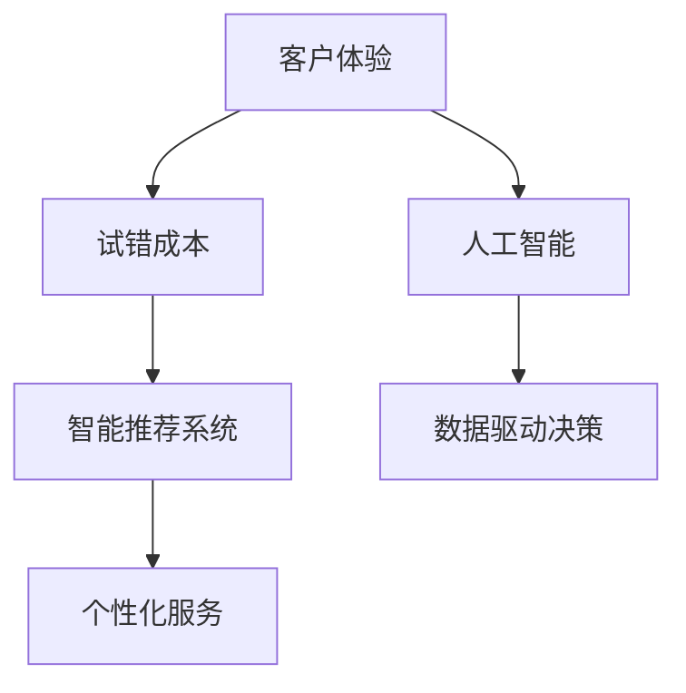

                 

# 降低客户试错成本促进产业繁荣

> 关键词：客户体验, 试错成本, 智能推荐系统, 个性化服务, 人工智能, 数据驱动决策

## 1. 背景介绍

在当前数字化转型的大背景下，客户体验（Customer Experience, CX）成为了企业竞争力的核心要素之一。然而，如何降低客户的试错成本，提升客户满意度，成为了众多企业亟需解决的问题。通过构建智能推荐系统和个性化服务体系，企业可以有效地降低客户的试错成本，提升客户黏性，促进产业繁荣。

## 2. 核心概念与联系

### 2.1 核心概念概述

为更好地理解如何降低客户试错成本，本节将介绍几个密切相关的核心概念：

- 客户体验（Customer Experience, CX）：指客户在使用产品或服务过程中，感受到的整体体验和满意度。良好的CX能够增强客户的忠诚度，提升企业的市场竞争力。
- 试错成本（Trial and Error Cost）：指客户在尝试新产品或服务过程中，由于不确定性导致的额外成本。包括时间、金钱、精力等各方面的损失。
- 智能推荐系统（Recommendation System, RS）：基于用户的历史行为数据，利用机器学习技术预测用户的兴趣和需求，提供个性化的推荐内容。
- 个性化服务（Personalized Service）：通过分析用户数据，提供符合用户特定需求和偏好的定制化服务。
- 人工智能（Artificial Intelligence, AI）：涵盖机器学习、自然语言处理、计算机视觉等多种技术，用于处理和分析大量数据，挖掘其中的有用信息。
- 数据驱动决策（Data-Driven Decision Making）：通过数据模型和算法，辅助企业做出科学的决策，提升运营效率和盈利能力。

这些核心概念之间的逻辑关系可以通过以下Mermaid流程图来展示：



这个流程图展示了一系列降低客户试错成本的流程和技术手段：

1. 通过提升客户体验，减少客户在尝试产品或服务时的疑虑和不确定性。
2. 构建智能推荐系统，基于用户历史行为和兴趣预测其未来的需求。
3. 提供个性化服务，减少客户在尝试新产品或服务时的试错成本。
4. 引入人工智能技术，利用机器学习算法和数据驱动决策，增强推荐系统的准确性和效率。

这些核心概念共同构成了降低客户试错成本、促进产业繁荣的技术框架，使得企业能够通过提升客户满意度和效率，获得更多的市场机会和收益。

## 3. 核心算法原理 & 具体操作步骤
### 3.1 算法原理概述

降低客户试错成本的核心在于构建智能推荐系统和个性化服务体系。其核心思想是：通过对用户历史行为数据的分析，预测其未来的需求和兴趣，提供个性化的推荐和定制化服务，从而降低客户在尝试新产品或服务时的试错成本。

形式化地，假设用户行为数据为 $D=\{(x_i,y_i)\}_{i=1}^N$，其中 $x_i$ 为用户的历史行为，$y_i$ 为实际发生的用户行为。则目标是在给定用户行为 $x_i$ 的情况下，预测用户将采取的后续行为 $y_i$。

通过机器学习算法，可以在用户行为数据上训练出一个预测模型 $M_{\theta}$，使得在给定新的用户行为 $x$ 时，能够预测用户将采取的行为 $y$，即：

$$
y = M_{\theta}(x)
$$

其中，$\theta$ 为模型参数。在实际应用中，我们可以使用协同过滤、深度学习等算法，构建推荐系统或进行个性化服务优化。

### 3.2 算法步骤详解

降低客户试错成本的具体操作步骤一般包括以下几个关键步骤：

**Step 1: 数据收集与预处理**
- 收集用户的行为数据，如点击记录、购买历史、浏览轨迹等，构建用户行为矩阵 $X \in \mathbb{R}^{N \times D}$，其中 $N$ 为样本数，$D$ 为特征数。
- 对原始数据进行清洗、去噪、归一化等预处理操作，确保数据的质量和一致性。

**Step 2: 构建推荐模型**
- 选择合适的推荐算法，如协同过滤、矩阵分解、深度学习等。
- 训练模型，得到参数 $\theta$，使得模型能够准确预测用户的行为。

**Step 3: 个性化服务优化**
- 根据用户的行为数据和兴趣标签，推荐个性化的产品或服务。
- 对用户反馈进行收集和分析，不断优化推荐算法和服务质量。

**Step 4: 实时监控与调整**
- 实时监控推荐系统的性能指标，如点击率、转化率等。
- 根据监控结果，动态调整推荐算法和服务策略，提高用户体验。

**Step 5: 应用部署与集成**
- 将训练好的模型和优化后的服务策略部署到实际应用系统中。
- 与业务系统进行集成，确保推荐的实时性和准确性。

以上是降低客户试错成本的一般流程。在实际应用中，还需要针对具体业务场景进行优化设计，如改进推荐算法、引入多模态数据、应用对抗样本等，以进一步提升推荐效果。

### 3.3 算法优缺点

降低客户试错成本的推荐算法具有以下优点：
1. 提升用户体验：通过个性化推荐，减少了客户的试错成本，提升了用户的满意度和黏性。
2. 增加转化率：精准的推荐能够提高用户对产品或服务的转化率，增加企业收益。
3. 优化库存管理：推荐算法可以优化库存管理，减少过剩或不足的库存，提高资源利用率。
4. 数据驱动决策：基于数据的推荐和优化过程，能够为企业提供可靠的数据支持，辅助科学决策。

同时，该方法也存在一定的局限性：
1. 数据隐私问题：推荐系统需要收集和分析用户的行为数据，涉及数据隐私和安全问题。
2. 算法偏见：推荐算法可能受到数据偏差的影响，产生不公正的推荐结果。
3. 模型复杂性：复杂的推荐算法需要大量计算资源，可能存在训练和推理速度慢的问题。
4. 用户依赖：过度依赖推荐系统可能导致用户主动探索性降低，形成"信息茧房"。

尽管存在这些局限性，但就目前而言，基于用户行为的推荐算法仍是在线服务、电子商务等场景中最有效的降低试错成本的方法之一。未来相关研究的重点在于如何进一步降低推荐算法对数据的依赖，提高模型的公正性和透明度，同时兼顾用户体验和业务效率。

### 3.4 算法应用领域

降低客户试错成本的推荐算法已经在多个领域得到了广泛的应用，如在线广告、电商推荐、个性化新闻、社交网络等。具体如下：

- 在线广告：通过推荐算法为用户推荐感兴趣的广告，提高广告点击率和转化率，降低广告主的试错成本。
- 电商推荐：根据用户的历史购买和浏览行为，推荐符合其兴趣的商品，提高用户的购买转化率，降低试错成本。
- 个性化新闻：根据用户的历史阅读记录，推荐其可能感兴趣的新闻，提高新闻阅读量和用户满意度。
- 社交网络：通过推荐算法为用户推荐新朋友或内容，降低用户在社交网络中的试错成本，提升用户体验。

此外，推荐算法还被创新性地应用到更多场景中，如智能客服、在线教育、医疗健康等，为不同行业的数字化转型升级提供新的技术路径。随着推荐算法的不断演进，相信其在降低客户试错成本、促进产业繁荣方面将发挥越来越重要的作用。

## 4. 数学模型和公式 & 详细讲解 & 举例说明
### 4.1 数学模型构建

本节将使用数学语言对推荐算法的构建和优化过程进行更加严格的刻画。

假设推荐系统的输入为用户行为数据 $x \in \mathbb{R}^D$，输出为用户将采取的行为 $y \in \mathbb{R}^O$，其中 $O$ 为行为空间。推荐系统的目标是通过输入 $x$ 预测输出 $y$，即：

$$
y = M_{\theta}(x)
$$

其中 $\theta$ 为模型参数。在实际应用中，推荐系统可以使用协同过滤、矩阵分解、深度学习等算法，构建预测模型。

### 4.2 公式推导过程

以下我们以协同过滤算法为例，推导用户行为预测的矩阵分解模型：

假设用户行为矩阵 $X \in \mathbb{R}^{N \times D}$ 和物品特征矩阵 $Y \in \mathbb{R}^{O \times D'}$，其中 $N$ 为用户数，$O$ 为物品数，$D$ 为用户行为维度，$D'$ 为物品特征维度。

协同过滤算法的基本思想是将用户和物品看作两个矩阵，通过矩阵分解，得到用户和物品的低维表示。设用户低维表示矩阵 $U \in \mathbb{R}^{N \times D_1}$，物品低维表示矩阵 $V \in \mathbb{R}^{O \times D_1}$，其中 $D_1$ 为低维向量维度。则用户行为预测公式为：

$$
\hat{y} = U_{ij} V_{jk} \quad \text{for} \quad j = 1,...,N; k = 1,...,O
$$

其中，$U_{ij}$ 为第 $i$ 个用户低维表示的第 $j$ 维，$V_{jk}$ 为第 $k$ 个物品低维表示的第 $j$ 维。

通过上述推导，我们可以看到，协同过滤算法通过矩阵分解，得到了用户和物品的低维表示，从而在低维空间中进行推荐。这种方法可以有效地降低计算复杂度，提高推荐效率。

### 4.3 案例分析与讲解

以电商推荐为例，推荐系统可以根据用户的历史购买和浏览行为，预测其对新物品的兴趣。具体步骤如下：

**Step 1: 数据收集与预处理**
- 收集用户的历史购买记录、浏览记录、评价记录等，构建用户行为矩阵 $X \in \mathbb{R}^{N \times D}$，其中 $N$ 为用户数，$D$ 为行为维度（如点击、购买、评价等）。
- 对原始数据进行清洗、去噪、归一化等预处理操作，确保数据的质量和一致性。

**Step 2: 构建推荐模型**
- 使用矩阵分解算法，将用户行为矩阵 $X$ 分解为 $U$ 和 $V$ 两个低维矩阵，得到用户低维表示矩阵 $U \in \mathbb{R}^{N \times D_1}$ 和物品低维表示矩阵 $V \in \mathbb{R}^{O \times D_1}$，其中 $D_1$ 为低维向量维度。
- 使用 $U$ 和 $V$ 计算用户对每个物品的预测评分 $\hat{y}_{ik} = U_{ij} V_{jk}$，得到推荐结果。

**Step 3: 个性化服务优化**
- 根据用户的历史行为和预测评分，推荐符合其兴趣的商品。
- 对用户反馈进行收集和分析，不断优化推荐算法和服务质量。

**Step 4: 实时监控与调整**
- 实时监控推荐系统的性能指标，如点击率、转化率等。
- 根据监控结果，动态调整推荐算法和服务策略，提高用户体验。

**Step 5: 应用部署与集成**
- 将训练好的模型和优化后的服务策略部署到实际应用系统中。
- 与业务系统进行集成，确保推荐的实时性和准确性。

通过上述步骤，电商推荐系统能够实现对用户行为的精准预测，提供个性化的商品推荐，从而降低用户的试错成本，提升用户满意度。

## 5. 项目实践：代码实例和详细解释说明
### 5.1 开发环境搭建

在进行推荐系统开发前，我们需要准备好开发环境。以下是使用Python进行Scikit-learn开发的推荐系统环境配置流程：

1. 安装Anaconda：从官网下载并安装Anaconda，用于创建独立的Python环境。

2. 创建并激活虚拟环境：
```bash
conda create -n recommend-env python=3.8 
conda activate recommend-env
```

3. 安装Scikit-learn：
```bash
conda install scikit-learn
```

4. 安装各类工具包：
```bash
pip install numpy pandas scikit-learn matplotlib tqdm jupyter notebook ipython
```

完成上述步骤后，即可在`recommend-env`环境中开始推荐系统实践。

### 5.2 源代码详细实现

下面我们以协同过滤算法为例，给出使用Scikit-learn构建电商推荐系统的代码实现。

首先，定义数据处理函数：

```python
from sklearn.decomposition import TruncatedSVD
from sklearn.metrics.pairwise import cosine_similarity
import pandas as pd

def read_data(file_path):
    data = pd.read_csv(file_path)
    return data

def preprocess_data(data, threshold=4):
    data['item_count'] = data.groupby('user_id')['item_id'].nunique()
    data = data[data['item_count'] >= threshold]
    data['user_item'] = data['user_id'] + '_' + data['item_id']
    return data

def build_user_item_matrix(data):
    user_item = data['user_item'].unique().tolist()
    user_item_dict = {item: i for i, item in enumerate(user_item)}
    data['user_item_idx'] = data['user_item'].map(user_item_dict)
    user_item_matrix = pd.pivot_table(data, values='rating', index='user_item_idx', columns='item_id', aggfunc='mean')
    user_item_matrix.fillna(0, inplace=True)
    return user_item_matrix

def train_test_split(matrix, test_ratio=0.2):
    indices = np.random.permutation(matrix.shape[0])
    split_index = int(matrix.shape[0] * test_ratio)
    train_indices = indices[:split_index]
    test_indices = indices[split_index:]
    train_matrix = matrix.iloc[train_indices]
    test_matrix = matrix.iloc[test_indices]
    return train_matrix, test_matrix

# 读取数据
data = read_data('data.csv')

# 预处理数据
data = preprocess_data(data)

# 构建用户物品矩阵
user_item_matrix = build_user_item_matrix(data)

# 训练集和测试集划分
train_matrix, test_matrix = train_test_split(user_item_matrix)
```

然后，定义推荐函数：

```python
from scipy.sparse.linalg import svds

def recommendation(train_matrix, test_matrix, num_factors=10, num_recommendations=10):
    U, S, V = svds(train_matrix, k=num_factors, return_singular_values=True)
    predictions = U @ S @ V.T
    test_predictions = predict(train_matrix, test_matrix)
    top_items = np.argsort(predictions, axis=0)[-num_recommendations:][0]
    recommendations = test_matrix.columns[test_predictions > 0]
    return recommendations

def predict(train_matrix, test_matrix):
    test_predictions = test_matrix @ U.T
    top_items = np.argsort(test_predictions, axis=0)[-num_recommendations:][0]
    recommendations = test_matrix.columns[test_predictions > 0]
    return top_items

# 推荐结果展示
recommendations = recommendation(train_matrix, test_matrix)
print('Recommended items:', recommendations)
```

最后，对推荐结果进行评估：

```python
from sklearn.metrics.pairwise import cosine_similarity

def evaluate(recommendations, test_matrix):
    predictions = test_matrix.reindex(columns=recommendations).mean(axis=1)
    top_items = np.argsort(predictions)[-10:][0]
    precision_at_10 = np.mean(test_matrix.columns.isin(top_items))
    return precision_at_10

# 推荐结果评估
precision = evaluate(recommendations, test_matrix)
print('Precision at 10:', precision)
```

以上就是使用Scikit-learn对协同过滤算法进行电商推荐系统的完整代码实现。可以看到，通过Scikit-learn，我们可以用相对简洁的代码完成推荐系统的构建和评估。

### 5.3 代码解读与分析

让我们再详细解读一下关键代码的实现细节：

**read_data函数**：
- 读取原始数据文件，返回Pandas DataFrame。

**preprocess_data函数**：
- 对数据进行预处理，包括去除低频用户和物品、构建用户物品索引、构建用户物品矩阵等操作。

**build_user_item_matrix函数**：
- 构建用户物品矩阵，将用户行为数据映射为稀疏矩阵，并计算用户和物品的相似度。

**train_test_split函数**：
- 将数据集划分为训练集和测试集，比例为80%和20%。

**recommendation函数**：
- 使用矩阵分解算法（SVD），计算用户对每个物品的预测评分，得到推荐结果。

**predict函数**：
- 使用训练好的模型，对测试集进行预测，得到推荐结果。

**evaluate函数**：
- 对推荐结果进行评估，计算精度。

通过上述步骤，电商推荐系统能够实现对用户行为的精准预测，提供个性化的商品推荐，从而降低用户的试错成本，提升用户满意度。

## 6. 实际应用场景
### 6.1 智能客服系统

智能客服系统能够利用推荐算法，根据用户的历史咨询记录和偏好，推荐最合适的解决方案，从而降低客户的试错成本，提升服务效率。具体实现如下：

**数据收集与预处理**：
- 收集用户的历史咨询记录、问题标签、满意度等信息，构建用户行为矩阵。
- 对原始数据进行清洗、去噪、归一化等预处理操作，确保数据的质量和一致性。

**推荐算法选择**：
- 选择合适的推荐算法，如协同过滤、深度学习等，构建推荐模型。
- 训练模型，得到用户对不同解决方案的推荐评分。

**个性化服务优化**：
- 根据用户的历史咨询记录和推荐评分，推荐最合适的解决方案。
- 对用户反馈进行收集和分析，不断优化推荐算法和服务质量。

**实时监控与调整**：
- 实时监控推荐系统的性能指标，如用户满意度、问题解决率等。
- 根据监控结果，动态调整推荐算法和服务策略，提高用户体验。

**应用部署与集成**：
- 将训练好的模型和优化后的服务策略部署到实际应用系统中。
- 与业务系统进行集成，确保推荐的实时性和准确性。

通过上述步骤，智能客服系统能够实现对用户咨询问题的精准推荐，提升服务效率，降低客户的试错成本。

### 6.2 金融舆情监测

金融舆情监测系统可以利用推荐算法，对海量的财经新闻、评论等文本数据进行分析，预测市场的情绪和趋势，从而降低投资者在投资决策中的试错成本。具体实现如下：

**数据收集与预处理**：
- 收集金融领域的财经新闻、评论、分析师报告等信息，构建文本数据集。
- 对原始文本数据进行清洗、去噪、分词、向量化等预处理操作，确保数据的质量和一致性。

**推荐算法选择**：
- 选择合适的推荐算法，如深度学习、文本分类等，构建推荐模型。
- 训练模型，得到市场情绪和趋势的预测评分。

**个性化服务优化**：
- 根据用户的历史投资记录和市场预测评分，推荐最合适的投资建议。
- 对用户反馈进行收集和分析，不断优化推荐算法和服务质量。

**实时监控与调整**：
- 实时监控推荐系统的性能指标，如投资回报率、市场预测准确率等。
- 根据监控结果，动态调整推荐算法和服务策略，提高投资决策的准确性。

**应用部署与集成**：
- 将训练好的模型和优化后的服务策略部署到实际应用系统中。
- 与业务系统进行集成，确保推荐的实时性和准确性。

通过上述步骤，金融舆情监测系统能够实现对市场情绪和趋势的精准预测，降低投资者在投资决策中的试错成本，提升投资回报。

### 6.3 个性化推荐系统

个性化推荐系统可以利用推荐算法，根据用户的历史行为和兴趣，推荐符合其需求的商品或服务，从而降低客户的试错成本，提升用户满意度。具体实现如下：

**数据收集与预处理**：
- 收集用户的历史浏览、购买、评价等信息，构建用户行为矩阵。
- 对原始数据进行清洗、去噪、归一化等预处理操作，确保数据的质量和一致性。

**推荐算法选择**：
- 选择合适的推荐算法，如协同过滤、深度学习等，构建推荐模型。
- 训练模型，得到用户对不同商品或服务的推荐评分。

**个性化服务优化**：
- 根据用户的历史行为和推荐评分，推荐符合其需求的商品或服务。
- 对用户反馈进行收集和分析，不断优化推荐算法和服务质量。

**实时监控与调整**：
- 实时监控推荐系统的性能指标，如点击率、转化率等。
- 根据监控结果，动态调整推荐算法和服务策略，提高用户体验。

**应用部署与集成**：
- 将训练好的模型和优化后的服务策略部署到实际应用系统中。
- 与业务系统进行集成，确保推荐的实时性和准确性。

通过上述步骤，个性化推荐系统能够实现对用户行为的精准预测，提供个性化的商品或服务推荐，从而降低用户的试错成本，提升用户满意度。

### 6.4 未来应用展望

随着推荐算法的不断演进，基于用户行为的推荐系统将在更多领域得到应用，为传统行业带来变革性影响。

在智慧医疗领域，推荐算法可以用于推荐个性化的诊疗方案、药物推荐等，降低患者在诊疗过程中的试错成本，提升诊疗效果。

在智能教育领域，推荐算法可以用于推荐个性化的学习资源、课程安排等，提高学生的学习效率，降低试错成本。

在智慧城市治理中，推荐算法可以用于推荐最佳的交通路线、旅游景点等，提高市民的出行体验和生活质量。

此外，在企业生产、社会治理、文娱传媒等众多领域，基于用户行为的推荐算法也将不断涌现，为不同行业的数字化转型升级提供新的技术路径。相信随着推荐算法的持续演进，其在降低客户试错成本、促进产业繁荣方面将发挥越来越重要的作用。

## 7. 工具和资源推荐
### 7.1 学习资源推荐

为了帮助开发者系统掌握推荐算法的理论基础和实践技巧，这里推荐一些优质的学习资源：

1. 《推荐系统实战》：一本全面介绍推荐算法、数据处理、系统实现的书籍，包含丰富的案例和代码示例。
2. 《Recommender Systems Handbook》：一本系统介绍推荐算法和系统的经典著作，适合深入研究。
3. 《Deep Learning for Recommendation Engines》：一本介绍深度学习在推荐系统中的应用，适合进阶学习。
4. Coursera上的《Recommender Systems Specialization》：由斯坦福大学开设的推荐系统课程，涵盖推荐算法、数据处理、系统实现等。
5. Udacity上的《Recommender Systems: From Theory to Practice》：一节介绍推荐系统的课程，适合实战学习。

通过对这些资源的学习实践，相信你一定能够快速掌握推荐算法的精髓，并用于解决实际的推荐问题。
### 7.2 开发工具推荐

高效的开发离不开优秀的工具支持。以下是几款用于推荐系统开发的常用工具：

1. Scikit-learn：基于Python的机器学习库，简单易用，适用于各种推荐算法。
2. TensorFlow和PyTorch：基于深度学习的开源框架，适合处理大规模数据和复杂模型。
3. Mahout：Apache提供的推荐系统框架，支持多种推荐算法和分布式计算。
4. ELKI：一个开源数据挖掘工具包，包含多种推荐算法和数据处理工具。
5. Hadoop和Spark：大数据处理平台，适合处理海量数据和分布式计算。

合理利用这些工具，可以显著提升推荐系统的开发效率，加快创新迭代的步伐。

### 7.3 相关论文推荐

推荐系统的研究已经积累了大量文献，以下是几篇奠基性的相关论文，推荐阅读：

1. 《Project-based Collaborative Filtering》：提出了基于用户-物品关联矩阵的协同过滤算法。
2. 《Word2Vec: Exploring the Hierarchical Structure of Word Embeddings》：提出了基于Word2Vec的词嵌入模型，用于文本推荐。
3. 《Deep Neural Networks for News Recommendation》：介绍了深度神经网络在新闻推荐中的应用。
4. 《A Bayesian Personalized Ranking Approach to Learning Recommender Systems》：提出了基于贝叶斯网络的推荐算法。
5. 《Item K-Nearest Neighbors with Side Information》：介绍了基于物品近邻的推荐算法。

这些论文代表了大数据和深度学习时代推荐系统的演进方向，是研究推荐算法的必备参考文献。

## 8. 总结：未来发展趋势与挑战
### 8.1 研究成果总结

本文对基于用户行为的推荐系统进行了全面系统的介绍。首先阐述了推荐系统的背景和意义，明确了推荐系统在降低客户试错成本、提升用户满意度方面的独特价值。其次，从原理到实践，详细讲解了推荐算法的构建和优化过程，给出了推荐系统开发的完整代码实例。同时，本文还广泛探讨了推荐系统在智能客服、金融舆情、个性化推荐等多个行业领域的应用前景，展示了推荐系统的发展潜力。

通过本文的系统梳理，可以看到，基于用户行为的推荐系统正在成为企业数字化转型升级的重要工具，为传统行业带来了新的价值。推荐系统通过精准的推荐和服务优化，大大降低了客户的试错成本，提升了用户的满意度和忠诚度，为企业的市场竞争力提供了有力保障。

### 8.2 未来发展趋势

展望未来，推荐系统的研究将继续向更深层次、更广领域拓展，呈现以下几个发展趋势：

1. 模型规模不断增大。随着算力成本的下降和数据规模的扩张，推荐系统的模型参数量将进一步增大，学习到的用户和物品表示将更加丰富和精确。

2. 推荐算法不断演进。推荐系统将更加注重多模态数据的融合，引入自然语言处理、图像识别等多种技术，提升推荐的全面性和准确性。

3. 实时性要求不断提高。推荐系统将更加注重实时性，支持实时数据流和动态推荐，提高用户的即时体验。

4. 用户隐私保护成为焦点。推荐系统将更加注重用户隐私保护，采用差分隐私、联邦学习等技术，确保数据安全和隐私保护。

5. 个性化推荐更加精准。推荐系统将更加注重个性化推荐，通过用户画像和行为分析，提供更符合用户需求的推荐内容。

6. 推荐系统集成化程度提升。推荐系统将更加注重与其他业务系统的集成，如智能客服、金融舆情、个性化新闻等，实现功能扩展和协同优化。

以上趋势凸显了推荐系统的广阔前景。这些方向的探索发展，将进一步提升推荐系统的性能和应用范围，为数字化转型提供更加有力的技术支撑。

### 8.3 面临的挑战

尽管推荐系统已经取得了巨大的成功，但在迈向更加智能化、普适化应用的过程中，它仍面临诸多挑战：

1. 数据隐私问题。推荐系统需要收集和分析用户的行为数据，涉及数据隐私和安全问题。如何在保障数据安全的前提下，提高推荐系统的性能，是一大难题。

2. 模型复杂性。复杂的推荐算法需要大量计算资源，可能存在训练和推理速度慢的问题。如何在保持高精度推荐的同时，降低模型复杂度，提高推荐效率，需要进一步优化算法和计算框架。

3. 用户依赖。过度依赖推荐系统可能导致用户主动探索性降低，形成"信息茧房"。如何在保持推荐效果的同时，增强用户的主动探索性，提升用户满意度，需要更精细化的推荐策略。

4. 推荐公平性。推荐算法可能受到数据偏差的影响，产生不公正的推荐结果。如何在推荐过程中引入公平性约束，消除偏见，提高推荐系统的公正性，是一大挑战。

5. 实时数据处理。推荐系统需要实时处理大量数据，存在计算资源和存储瓶颈。如何在保持实时性的同时，提高计算效率和数据管理能力，需要优化数据处理和存储策略。

6. 跨领域适用性。推荐系统在不同领域的应用，需要考虑行业特性和用户需求差异，难以形成通用化解决方案。如何在保持跨领域适用性的同时，兼顾行业特性和用户需求，需要深入行业研究和用户调查。

以上挑战凸显了推荐系统在实际应用中的复杂性和多样性，但通过不断的技术创新和实践优化，这些挑战终将逐步克服。相信在数据、算法、工程、业务等多个维度的协同努力下，推荐系统将在降低客户试错成本、促进产业繁荣方面发挥更加重要的作用。

### 8.4 研究展望

面对推荐系统所面临的种种挑战，未来的研究需要在以下几个方面寻求新的突破：

1. 无监督学习和半监督学习。探索无需大量标注数据的推荐方法，如协同过滤、自编码等，利用已有数据和用户行为，进行高质量的推荐。

2. 分布式计算和实时处理。利用分布式计算框架如Hadoop、Spark等，实现大规模数据的实时处理和动态推荐，提升推荐系统的实时性和稳定性。

3. 多模态数据融合。引入图像、语音、视频等多种模态的数据，实现多模态融合推荐，提升推荐系统的全面性和鲁棒性。

4. 自适应推荐。利用在线学习技术，不断调整推荐模型，适应用户行为变化，提升推荐系统的长期效果。

5. 推荐系统的伦理与公平性。引入伦理评估和公平性约束，确保推荐系统的透明性和公正性，防止算法偏见和歧视。

6. 用户主动探索性提升。设计更加灵活的推荐策略，引导用户主动探索新的内容，增强推荐系统的多样性和用户满意度。

这些研究方向将推动推荐系统在降低客户试错成本、促进产业繁荣方面发挥更大的作用，为数字化转型带来新的机遇和挑战。相信通过不断的技术创新和实践优化，推荐系统将在降低客户试错成本、提升用户体验、促进产业繁荣方面发挥更大的作用，为数字化转型提供更加有力的技术支撑。

## 9. 附录：常见问题与解答

**Q1：推荐系统为什么需要收集用户行为数据？**

A: 推荐系统通过分析用户的历史行为数据，学习用户的兴趣和偏好，从而实现精准的推荐。收集用户行为数据可以帮助推荐系统了解用户的真实需求，提供更加个性化的服务，降低客户的试错成本。

**Q2：如何确保推荐系统的数据隐私和安全？**

A: 推荐系统需要收集用户行为数据，涉及数据隐私和安全问题。为了保护用户隐私，可以采用差分隐私、联邦学习等技术，确保数据在传输和存储过程中的安全性。同时，应遵循相关法律法规，如GDPR等，保障用户的知情权和选择权。

**Q3：推荐系统的实时性如何实现？**

A: 推荐系统需要实时处理大量数据，存在计算资源和存储瓶颈。为了实现实时性，可以采用分布式计算框架如Hadoop、Spark等，实现大规模数据的实时处理和动态推荐。同时，可以优化算法和计算图，减少计算资源消耗，提升推荐系统的效率。

**Q4：推荐系统如何处理用户的主动探索性？**

A: 推荐系统需要在保持推荐效果的同时，增强用户的主动探索性，避免用户陷入"信息茧房"。可以通过设计灵活的推荐策略，如增加个性化选项、引入多样化推荐等，引导用户主动探索新的内容。同时，可以优化推荐算法，提高推荐多样性和个性化程度，满足用户的多样化需求。

**Q5：推荐系统的公平性如何确保？**

A: 推荐系统可能受到数据偏差的影响，产生不公正的推荐结果。为了确保推荐系统的公平性，可以引入公平性约束，如平等推荐、差异化推荐等，消除偏见，提高推荐系统的公正性。同时，可以引入用户反馈机制，对不公正推荐进行监控和调整，提升推荐系统的透明度和可信度。

通过对这些问题的解答，相信你能够更好地理解推荐系统的核心概念和实现细节，掌握推荐系统的开发和优化技巧。

---

作者：禅与计算机程序设计艺术 / Zen and the Art of Computer Programming

