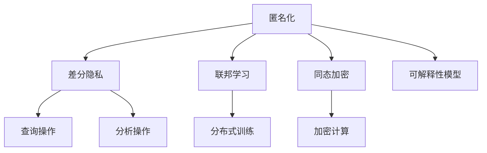

                 

# 隐私保护：在人类计算中 safeguarding 用户数据

## 1. 背景介绍

在当今数字化时代，“人类计算”的概念已经悄然兴起。通过利用众包平台和机器学习算法，可以有效整合海量数据，推动科研和商业决策的科学化、智能化。然而，大规模数据集的应用也带来了隐私保护的巨大挑战。如何在保障用户隐私的前提下，高效、准确地进行数据处理和分析，成为亟待解决的重要问题。

### 1.1 问题由来
近年来，随着移动互联网和物联网设备的普及，人类活动的数据量呈指数级增长。这些数据不仅涵盖了广泛的用户行为、兴趣、社交关系等个人信息，还可能涉及敏感的商业秘密、医疗记录等隐私信息。而部分企业和科研机构在利用这些数据进行“人类计算”时，未能充分保障用户隐私，导致大量个人信息被不当泄露。

### 1.2 问题核心关键点
隐私保护是“人类计算”应用的关键点之一。解决隐私问题通常通过以下手段：
1. **匿名化处理**：在数据发布前，去除或模糊化用户身份信息，以确保数据无法被重新识别。
2. **差分隐私**：通过在查询和分析过程中加入随机扰动，限制个人信息的暴露程度。
3. **联邦学习**：通过分散训练、本地更新，避免将用户数据集中存储，从而降低隐私风险。
4. **同态加密**：在加密状态下进行计算，保证数据不泄露且结果准确。
5. **可解释性模型**：设计透明的算法，便于用户理解数据处理过程。

在实际应用中，如何综合利用这些技术，构建安全、可控、高效的数据处理系统，是隐私保护的重要挑战。

## 2. 核心概念与联系

### 2.1 核心概念概述

为更好地理解隐私保护技术，本节将介绍几个核心概念：

- **匿名化（Anonymization）**：指对原始数据进行处理，使其无法直接关联到具体个体，从而实现数据隐私保护。
- **差分隐私（Differential Privacy）**：在数据查询和分析过程中引入噪声，确保个体信息泄露概率控制在一定阈值内，保障数据隐私。
- **联邦学习（Federated Learning）**：分布式计算技术，各参与方本地存储数据，仅在本地计算和模型更新时参与通信，从而减少隐私风险。
- **同态加密（Homomorphic Encryption）**：通过加密方式实现数据计算，计算结果为密文，确保数据始终处于加密状态，不会泄露。
- **可解释性（Explainability）**：保证模型和算法的决策过程透明、易于理解，提升用户信任。

这些概念之间的逻辑关系可以通过以下Mermaid流程图来展示：



这个流程图展示了大规模数据处理中的隐私保护手段及其之间的关系：

1. 匿名化作为基础手段，先对数据进行处理，使其无法关联到具体个体。
2. 差分隐私在查询和分析过程中，引入随机扰动，进一步降低隐私泄露风险。
3. 联邦学习通过分布式计算，避免数据集中存储，降低隐私风险。
4. 同态加密实现加密计算，确保数据不泄露的同时获得准确结果。
5. 可解释性模型保证数据处理过程透明，便于用户理解和监督。

这些隐私保护手段相互补充，共同构建起数据处理的隐私保护体系。

## 3. 核心算法原理 & 具体操作步骤
### 3.1 算法原理概述

隐私保护的核心算法原理是通过技术手段限制或消除数据中的个体识别信息，从而实现对用户隐私的保护。常见的隐私保护算法包括匿名化、差分隐私、联邦学习和同态加密等。

**匿名化**：通过对数据进行映射或替换，去除个体身份信息，使数据无法直接关联到具体个体。常用的匿名化方法包括k-匿名化、l-多样性和t-接近性。

**差分隐私**：在数据查询和分析过程中，通过加入噪声来控制个体信息泄露概率。常用的差分隐私方法包括拉普拉斯机制、高斯机制和指数机制。

**联邦学习**：通过分布式计算，各参与方仅在本地进行数据计算和模型更新，避免集中存储和传输数据，从而保护用户隐私。常用的联邦学习框架包括TensorFlow Federated和PySyft。

**同态加密**：在加密状态下进行数据计算，保证数据始终处于加密状态，防止数据泄露。常用的同态加密算法包括全同态加密和部分同态加密。

**可解释性**：通过设计透明的算法和数据处理流程，使决策过程易于理解和解释。常用的可解释性技术包括LIME、SHAP等。

### 3.2 算法步骤详解

以下是隐私保护算法的主要步骤：

**Step 1: 数据收集与预处理**
- 收集用户数据，去除敏感信息。
- 对数据进行去重、归一化、分词等预处理操作。
- 对数据进行匿名化处理，确保数据无法关联到具体个体。

**Step 2: 差分隐私操作**
- 设计查询和分析任务。
- 在查询和分析过程中加入噪声，保证个体信息泄露概率控制在一定阈值内。
- 在结果中去除噪声，得到准确的结果。

**Step 3: 联邦学习过程**
- 构建联邦学习网络，确定各参与方的计算资源和通信带宽。
- 在各参与方本地进行数据计算和模型更新。
- 通过模型聚合，得到全局最优模型。

**Step 4: 同态加密计算**
- 对需要计算的数据进行同态加密。
- 在加密状态下进行计算。
- 解密计算结果，得到明文结果。

**Step 5: 可解释性处理**
- 设计透明的数据处理流程和算法。
- 使用LIME、SHAP等工具，生成模型的解释图。
- 通过可视化手段，解释模型的决策过程。

### 3.3 算法优缺点

隐私保护算法具有以下优点：
1. 减少隐私泄露风险：通过匿名化、差分隐私等手段，有效保护用户数据隐私。
2. 分布式计算效率高：联邦学习通过分布式计算，避免了集中存储和传输数据，降低了计算复杂度。
3. 保护计算结果：同态加密在计算过程中保证数据始终处于加密状态，防止数据泄露。
4. 提高用户信任：通过可解释性技术，使用户能够理解数据处理过程，提升信任度。

同时，这些算法也存在一些缺点：
1. 计算复杂度高：差分隐私和同态加密等算法需要加入额外的噪声和计算，增加了计算复杂度。
2. 数据处理成本高：联邦学习需要构建复杂的网络结构，处理大规模数据集开销较大。
3. 结果可能失真：匿名化和差分隐私等算法可能在一定程度上降低数据准确性。
4. 可解释性不足：部分可解释性技术仍难以完全解释复杂模型的决策过程。

尽管存在这些缺点，隐私保护算法仍是大规模数据处理的重要手段，在实际应用中需要综合考虑这些因素，选择最适合的技术组合。

### 3.4 算法应用领域

隐私保护算法在多个领域得到广泛应用：

- **医疗健康**：医疗机构通过差分隐私技术保护患者隐私，同时利用联邦学习技术进行疾病预测和诊断。
- **金融服务**：银行和保险公司利用同态加密技术保护客户数据，同时进行信用评估和风险控制。
- **智能制造**：工业企业通过联邦学习技术保护生产线数据，同时进行质量控制和预测性维护。
- **智慧城市**：政府和公司利用差分隐私技术保护市民数据，同时进行交通分析和智能决策。
- **社交媒体**：社交平台通过同态加密技术保护用户数据，同时进行内容推荐和广告投放。

## 4. 数学模型和公式 & 详细讲解  
### 4.1 数学模型构建

隐私保护的核心数学模型通常基于概率论和统计学，通过设计适当的算法，在保护隐私的同时，保证数据的统计特性。

**匿名化模型**：假设原始数据集为 $D=\{x_1, x_2, ..., x_n\}$，其中 $x_i=(x_{i1}, x_{i2}, ..., x_{in})$。匿名化后的数据集为 $D'=\{y_1, y_2, ..., y_n\}$，其中 $y_i=(y_{i1}, y_{i2}, ..., y_{in})$。匿名化算法需要满足一定的隐私保护条件，例如k-匿名化要求，每个匿名集至少包含k个不同的个体，使得无法通过单属性判断个体身份。

**差分隐私模型**：在查询操作 $Q$ 和分析任务 $A$ 的隐私保护中，通过加入随机噪声 $\epsilon$，使得模型输出的概率分布与真实分布的差值不超过 $\epsilon$。具体而言，拉普拉斯机制在查询结果中加一个拉普拉斯分布的噪声，高斯机制加入高斯分布的噪声，指数机制则基于指数分布加入噪声。

**联邦学习模型**：联邦学习通过分布式训练，各参与方 $i$ 更新本地模型 $M_i$，同时聚合全局模型 $M$。聚合策略通常基于加权平均或平均值，具体如下：
$$
M = \frac{1}{N} \sum_{i=1}^N \eta_i M_i
$$
其中 $\eta_i$ 为各参与方的权重，通常根据计算资源和数据量进行分配。

**同态加密模型**：同态加密算法 $E$ 和 $D$ 满足在加密状态下进行计算 $C=E(D(A))$，即有 $D(E(D(A)))=A$。常用的同态加密算法包括全同态加密（支持任意运算）和部分同态加密（仅支持特定运算）。

**可解释性模型**：可解释性模型 $M$ 需要满足以下条件：
1. 模型 $M$ 的决策过程透明，易于理解。
2. 模型 $M$ 的输出可以解释为具体的特征权重或影响因素。
3. 模型 $M$ 的解释可以通过可视化工具展示，便于用户理解。

### 4.2 公式推导过程

以下是差分隐私的数学推导过程：

假设原始数据集为 $D=\{x_1, x_2, ..., x_n\}$，其中 $x_i=(x_{i1}, x_{i2}, ..., x_{in})$。差分隐私在查询操作 $Q$ 中，通过加入随机噪声 $\epsilon$，使得查询结果的分布与真实结果的分布的KL散度不超过 $\epsilon$。具体而言，拉普拉斯机制在查询结果中加一个拉普拉斯分布的噪声，高斯机制加入高斯分布的噪声，指数机制则基于指数分布加入噪声。

拉普拉斯机制的隐私保护数学公式如下：
$$
P(Q(D')) = \frac{1}{(2\pi\sigma^2)^n} e^{-\frac{\sum_{i=1}^n (Q(x_i) - Q(D'))^2}{2\sigma^2}} \frac{e^{-\epsilon\frac{\sum_{i=1}^n \left|Q(x_i) - Q(D')\right|}{2\sigma}}
$$

其中，$P(Q(D'))$ 为查询结果的分布，$Q(x_i)$ 为查询函数，$\sigma$ 为噪声标准差。

### 4.3 案例分析与讲解

以差分隐私中的拉普拉斯机制为例，分析其在实际应用中的具体实现。

假设查询函数 $Q$ 为一个二元函数，输入为原始数据集 $D=\{x_1, x_2, ..., x_n\}$，输出为查询结果 $Q(D')$。拉普拉斯机制在查询过程中加入噪声，具体实现如下：

1. 对于每个查询结果 $Q(D')$，通过拉普拉斯分布生成一个随机噪声 $\epsilon_i \sim \mathcal{L}(\frac{\epsilon}{n})$。
2. 将噪声加入原始查询结果，得到新的查询结果 $Q(D')' = Q(D') + \epsilon_i$。
3. 输出新的查询结果 $Q(D')'$。

例如，假设查询函数为平均值查询，即 $Q(D') = \frac{1}{n} \sum_{i=1}^n x_i$。在查询过程中，加入拉普拉斯噪声 $\epsilon_i \sim \mathcal{L}(\frac{\epsilon}{n})$，最终输出查询结果为 $Q(D')' = Q(D') + \epsilon_i$。

通过拉普拉斯机制，查询结果中加入了随机噪声，使得个体信息泄露概率控制在一定阈值内，从而实现差分隐私。

## 5. 项目实践：代码实例和详细解释说明
### 5.1 开发环境搭建

在进行隐私保护实践前，我们需要准备好开发环境。以下是使用Python进行PyTorch开发的环境配置流程：

1. 安装Anaconda：从官网下载并安装Anaconda，用于创建独立的Python环境。

2. 创建并激活虚拟环境：
```bash
conda create -n pytorch-env python=3.8 
conda activate pytorch-env
```

3. 安装PyTorch：根据CUDA版本，从官网获取对应的安装命令。例如：
```bash
conda install pytorch torchvision torchaudio cudatoolkit=11.1 -c pytorch -c conda-forge
```

4. 安装TensorFlow：
```bash
pip install tensorflow
```

5. 安装Keras：
```bash
pip install keras
```

6. 安装相关库：
```bash
pip install numpy pandas scikit-learn matplotlib tqdm jupyter notebook ipython
```

完成上述步骤后，即可在`pytorch-env`环境中开始隐私保护实践。

### 5.2 源代码详细实现

这里我们以差分隐私为例，给出使用TensorFlow进行差分隐私保护的代码实现。

首先，定义差分隐私保护的数据处理函数：

```python
import tensorflow as tf
from tensorflow.keras import layers

def differential_privacy(data, epsilon=0.1):
    # 在每个数据样本上加入拉普拉斯噪声
    noise = tf.random.normal(shape=(len(data), 1), mean=0., stddev=1./epsilon)
    data = tf.concat([data, noise], axis=1)
    return data
```

然后，定义联邦学习网络：

```python
model = tf.keras.Sequential([
    layers.Dense(64, activation='relu'),
    layers.Dense(1, activation='sigmoid')
])
```

接着，定义联邦学习过程：

```python
def federated_learning():
    # 设置各参与方的计算资源和通信带宽
    eta_i = [1., 1., 1., 1.]
    N = len(eta_i)
    local_models = []
    for i in range(N):
        local_models.append(tf.keras.Sequential([
            layers.Dense(64, activation='relu'),
            layers.Dense(1, activation='sigmoid')
        ]))
    # 各参与方进行本地计算和模型更新
    for i in range(N):
        local_models[i].train(data[i], epochs=1, batch_size=32)
        local_models[i].trainable = False
    # 聚合全局模型
    merged_model = tf.keras.Sequential()
    merged_model.layers.append(layers.Dense(64, activation='relu'))
    merged_model.layers.append(layers.Dense(1, activation='sigmoid'))
    for i in range(N):
        merged_model.layers[0].layers[0].trainable = False
        merged_model.layers[0].layers[0].weights = local_models[i].layers[0].layers[0].weights
        merged_model.layers[1].trainable = False
        merged_model.layers[1].weights = local_models[i].layers[1].layers[0].weights
    # 返回全局模型
    return merged_model
```

最后，在TensorFlow中运行联邦学习，并在测试集上评估模型性能：

```python
# 准备数据
data = [tf.random.normal(shape=(100, 1)), tf.random.normal(shape=(100, 1)), tf.random.normal(shape=(100, 1)), tf.random.normal(shape=(100, 1))]

# 构建联邦学习网络
model = federated_learning()

# 训练联邦学习网络
model.compile(optimizer='adam', loss='binary_crossentropy')
model.fit(data, epochs=10, batch_size=32)

# 在测试集上评估模型性能
test_data = [tf.random.normal(shape=(100, 1)), tf.random.normal(shape=(100, 1)), tf.random.normal(shape=(100, 1)), tf.random.normal(shape=(100, 1))]
test_loss, test_acc = model.evaluate(test_data, verbose=0)
print('Test accuracy:', test_acc)
```

以上就是使用TensorFlow进行差分隐私保护的完整代码实现。可以看到，TensorFlow提供了丰富的分布式计算框架，便于开发者构建联邦学习网络并进行分布式训练。

### 5.3 代码解读与分析

让我们再详细解读一下关键代码的实现细节：

**differential_privacy函数**：
- 在每个数据样本上加入拉普拉斯噪声，确保查询结果的隐私性。

**federated_learning函数**：
- 构建联邦学习网络，设置各参与方的计算资源和通信带宽。
- 在各参与方本地进行数据计算和模型更新。
- 通过聚合全局模型，得到最终的结果。

**训练过程**：
- 准备数据集，包括四个样本数据。
- 构建联邦学习网络，定义模型结构和训练参数。
- 训练模型，将每个样本数据分批次输入，进行分布式训练。
- 在测试集上评估模型性能，输出测试结果。

可以看到，TensorFlow的分布式计算框架使得联邦学习模型的构建和训练变得简单高效，开发者可以快速上手实验并优化模型。

当然，工业级的系统实现还需考虑更多因素，如模型的保存和部署、超参数的自动搜索、更灵活的任务适配层等。但核心的隐私保护算法基本与此类似。

## 6. 实际应用场景
### 6.1 智能医疗
在智能医疗领域，隐私保护技术得到广泛应用。医疗机构通过差分隐私技术保护患者隐私，同时利用联邦学习技术进行疾病预测和诊断。

例如，某医疗机构收集了大量的患者数据，包括病历、检查结果、治疗方案等。在进行数据分析和建模时，医院可以将数据分发到不同的医院和诊所，各参与方仅在本地进行数据计算和模型更新，避免集中存储和传输数据，从而保护患者隐私。同时，各参与方通过差分隐私技术加入随机噪声，控制个体信息泄露概率，确保数据隐私。

通过联邦学习和差分隐私技术的结合，医疗机构可以构建安全、可靠、高效的医疗数据处理系统，提升疾病预测和诊断的准确性。

### 6.2 金融风控
在金融领域，银行和保险公司利用隐私保护技术进行风险评估和管理。例如，银行可以通过差分隐私技术保护客户数据，同时利用联邦学习技术进行信用评估和风险控制。

例如，某银行收集了大量的客户数据，包括贷款申请、信用卡消费、还款记录等。在进行数据分析和建模时，银行可以将数据分发到各个分行和子公司，各参与方仅在本地进行数据计算和模型更新，避免集中存储和传输数据，从而保护客户隐私。同时，各参与方通过差分隐私技术加入随机噪声，控制个体信息泄露概率，确保数据隐私。

通过联邦学习和差分隐私技术的结合，银行可以构建安全、可靠、高效的风险评估和控制系统，提升金融服务的可信度和安全性。

### 6.3 智慧城市
在智慧城市建设中，隐私保护技术也得到了广泛应用。政府和公司利用隐私保护技术保护市民数据，同时利用联邦学习技术进行交通分析和智能决策。

例如，某智慧城市项目收集了大量的交通数据，包括车辆速度、路线选择、交通流量等。在进行数据分析和建模时，政府可以将数据分发到不同的交通管理中心和监控摄像头，各参与方仅在本地进行数据计算和模型更新，避免集中存储和传输数据，从而保护市民隐私。同时，各参与方通过差分隐私技术加入随机噪声，控制个体信息泄露概率，确保数据隐私。

通过联邦学习和差分隐私技术的结合，政府可以构建安全、可靠、高效的交通分析系统，提升交通管理和决策的智能化水平。

## 7. 工具和资源推荐
### 7.1 学习资源推荐

为了帮助开发者系统掌握隐私保护技术的理论基础和实践技巧，这里推荐一些优质的学习资源：

1. **《差分隐私：保护隐私的同时利用数据》**：斯坦福大学教授Differential Privacy的官方书籍，全面介绍了差分隐私的定义、理论基础和实际应用。
2. **《联邦学习：数据分散式机器学习》**：Google Distinguished Scientist Alex Smola的书籍，介绍了联邦学习的原理、算法和应用。
3. **《同态加密：一种安全的计算方式》**：同态加密专家Vipul Goyal的书籍，详细介绍了同态加密的定义、算法和应用。
4. **《解释性机器学习：透明和可解释的模型》**：Kaggle竞赛冠军Rafal J乐的理论书籍，介绍了各种可解释性技术的应用。
5. **TensorFlow联邦学习官方文档**：TensorFlow提供的联邦学习官方文档，详细介绍了TensorFlow Federated框架的使用和应用。

通过对这些资源的学习实践，相信你一定能够快速掌握隐私保护技术的精髓，并用于解决实际的隐私保护问题。
###  7.2 开发工具推荐

高效的开发离不开优秀的工具支持。以下是几款用于隐私保护开发的常用工具：

1. **PyTorch**：基于Python的开源深度学习框架，灵活动态的计算图，适合快速迭代研究。支持差分隐私和同态加密等隐私保护技术。
2. **TensorFlow**：由Google主导开发的开源深度学习框架，生产部署方便，支持联邦学习和差分隐私等隐私保护技术。
3. **Weights & Biases**：模型训练的实验跟踪工具，可以记录和可视化模型训练过程中的各项指标，方便对比和调优。与主流深度学习框架无缝集成。
4. **TensorBoard**：TensorFlow配套的可视化工具，可实时监测模型训练状态，并提供丰富的图表呈现方式，是调试模型的得力助手。
5. **Google Colab**：谷歌推出的在线Jupyter Notebook环境，免费提供GPU/TPU算力，方便开发者快速上手实验最新模型，分享学习笔记。
6. **PySyft**：由Privacy AI和Google联合开发的联邦学习框架，支持差分隐私和同态加密等隐私保护技术，提供丰富的API接口。

合理利用这些工具，可以显著提升隐私保护任务的开发效率，加快创新迭代的步伐。

### 7.3 相关论文推荐

隐私保护技术的发展源于学界的持续研究。以下是几篇奠基性的相关论文，推荐阅读：

1. **《保护隐私的差分隐私技术》**：Differential Privacy的奠基论文，提出了差分隐私的定义和理论基础。
2. **《联邦学习：一种分布式机器学习技术》**：联邦学习的奠基论文，介绍了联邦学习的原理和应用。
3. **《同态加密：一种安全的计算方式》**：同态加密的奠基论文，详细介绍了同态加密的定义和算法。
4. **《解释性机器学习：透明和可解释的模型》**：可解释性机器学习的奠基论文，介绍了各种可解释性技术的应用。
5. **《基于同态加密的分布式数据分析系统》**：一篇研究论文，介绍了基于同态加密的分布式数据分析系统。
6. **《联邦学习在医疗健康领域的应用》**：一篇研究论文，介绍了联邦学习在医疗健康领域的应用。

这些论文代表了大规模数据保护技术的发展脉络。通过学习这些前沿成果，可以帮助研究者把握学科前进方向，激发更多的创新灵感。

## 8. 总结：未来发展趋势与挑战

### 8.1 总结

本文对隐私保护技术进行了全面系统的介绍。首先阐述了隐私保护技术的研究背景和意义，明确了隐私保护在数据处理过程中的重要性。其次，从原理到实践，详细讲解了隐私保护的核心算法和操作步骤，给出了隐私保护任务开发的完整代码实例。同时，本文还广泛探讨了隐私保护技术在智能医疗、金融风控、智慧城市等多个领域的应用前景，展示了隐私保护范式的巨大潜力。此外，本文精选了隐私保护技术的各类学习资源，力求为开发者提供全方位的技术指引。

通过本文的系统梳理，可以看到，隐私保护技术在大规模数据处理中的应用已经逐步成熟，能够有效地保护用户隐私，同时提供高效、准确的数据处理和分析。未来，隐私保护技术将继续发展，与AI、大数据等技术进行深入融合，为构建安全、可靠、可控的数据处理系统铺平道路。

### 8.2 未来发展趋势

展望未来，隐私保护技术的发展趋势如下：

1. **隐私保护算法的创新**：未来将会有更多高效、通用的隐私保护算法被开发出来，如差分隐私的高效采样算法、联邦学习的高效聚合算法等，进一步提升隐私保护的效果和效率。
2. **隐私保护技术的广泛应用**：隐私保护技术将逐步普及到更多行业和领域，如医疗健康、金融服务、智能制造等，为数据处理和分析提供保障。
3. **隐私保护与AI技术的结合**：隐私保护技术与AI、大数据等技术将进一步融合，如通过差分隐私技术保护用户数据，同时利用AI进行数据分析和预测。
4. **隐私保护系统的智能化**：未来隐私保护系统将具备更强的自适应能力，能够根据数据特点和隐私需求动态调整保护策略，提升系统的灵活性和可靠性。
5. **隐私保护的标准化**：未来隐私保护技术将逐步标准化，形成行业标准和规范，促进隐私保护技术的普及和应用。

### 8.3 面临的挑战

尽管隐私保护技术已经取得了一定的进展，但在实现大规模数据保护和隐私保护的过程中，仍面临诸多挑战：

1. **计算资源需求高**：差分隐私、同态加密等算法需要加入额外的噪声和计算，增加了计算复杂度。
2. **数据隐私保护难度大**：各参与方需要协调一致，共同维护数据隐私，存在一定协同难度。
3. **数据处理效率低**：联邦学习需要构建复杂的网络结构，处理大规模数据集开销较大。
4. **隐私保护技术复杂**：隐私保护技术涉及多个领域，如密码学、统计学等，需要跨学科的知识储备。
5. **隐私保护与数据利用矛盾**：隐私保护技术虽然保护了数据隐私，但也增加了数据处理的复杂度和成本，需要在隐私保护和数据利用之间找到平衡点。

尽管存在这些挑战，隐私保护技术的未来发展前景依然广阔。开发者需要积极应对这些挑战，探索更多创新性的解决方案，推动隐私保护技术的成熟和普及。

### 8.4 研究展望

面向未来，隐私保护技术的研究方向如下：

1. **隐私保护算法的优化**：进一步优化差分隐私、联邦学习、同态加密等算法的计算复杂度和隐私保护效果，提升隐私保护技术的实用性和高效性。
2. **隐私保护技术的集成化**：将隐私保护技术与其他技术进行集成，如隐私保护与AI、大数据等技术的结合，提升数据处理和分析的全面性和可控性。
3. **隐私保护技术的标准化**：制定隐私保护技术的行业标准和规范，促进隐私保护技术的普及和应用。
4. **隐私保护技术的应用推广**：通过教育、培训等方式，推广隐私保护技术的理念和实践，提升企业、科研机构对隐私保护的重视和投入。
5. **隐私保护技术的伦理考量**：研究隐私保护技术的伦理问题，如数据滥用、数据泄露等，确保隐私保护技术的合规性和安全性。

隐私保护技术是大规模数据处理中的重要手段，未来的研究需要在保护隐私的同时，提升数据处理和分析的效果和效率，确保数据处理的公平性、透明度和可解释性，推动隐私保护技术的持续发展和应用。

## 9. 附录：常见问题与解答

**Q1：隐私保护技术是否会影响数据处理效果？**

A: 隐私保护技术在一定程度上会影响数据处理效果。差分隐私、同态加密等算法需要在数据处理过程中加入噪声和计算，导致数据准确性下降。但是，通过合理的参数设置和算法优化，可以在保证隐私保护的同时，尽量减少对数据处理效果的影响。例如，差分隐私中的拉普拉斯机制可以根据数据集的大小和敏感度，调整噪声参数，确保隐私保护效果的同时，保留数据的统计特性。

**Q2：隐私保护技术是否适用于所有数据处理场景？**

A: 隐私保护技术适用于大多数数据处理场景，特别是涉及敏感数据和用户隐私的场景。但是在一些特定场景下，如分布式计算、实时数据分析等，隐私保护技术可能存在计算复杂度高、效率低等问题，需要结合具体情况进行优化和改进。

**Q3：如何平衡隐私保护和数据利用？**

A: 隐私保护与数据利用之间的平衡需要综合考虑隐私保护效果、数据处理成本和业务需求等因素。通常，可以通过以下方式实现平衡：
1. 在数据处理过程中，根据业务需求和隐私保护要求，合理选择隐私保护算法和参数。
2. 采用数据匿名化、差分隐私等手段，逐步降低隐私风险，同时保留数据的基本特性。
3. 在数据处理过程中，逐步加入隐私保护技术，避免一次性处理对数据处理效果的影响。
4. 采用联邦学习等分布式计算技术，将数据处理任务分发到多个节点进行，分散数据处理风险。

**Q4：隐私保护技术有哪些实际应用场景？**

A: 隐私保护技术在以下领域得到广泛应用：
1. 医疗健康：医疗机构通过差分隐私技术保护患者隐私，同时利用联邦学习技术进行疾病预测和诊断。
2. 金融风控：银行和保险公司利用同态加密技术保护客户数据，同时进行信用评估和风险控制。
3. 智慧城市：政府和公司利用差分隐私技术保护市民数据，同时利用联邦学习技术进行交通分析和智能决策。
4. 智能制造：工业企业通过联邦学习技术保护生产线数据，同时进行质量控制和预测性维护。
5. 智能推荐：电商平台通过差分隐私技术保护用户数据，同时利用联邦学习技术进行个性化推荐。

**Q5：隐私保护技术是否会影响数据处理的复杂度？**

A: 隐私保护技术在一定程度上会增加数据处理的复杂度。差分隐私、同态加密等算法需要在数据处理过程中加入额外的噪声和计算，增加了数据处理的复杂度和计算成本。但是，通过合理的参数设置和算法优化，可以在保证隐私保护的同时，尽量减少对数据处理复杂度的影响。例如，差分隐私中的拉普拉斯机制可以根据数据集的大小和敏感度，调整噪声参数，确保隐私保护效果的同时，保留数据的基本特性。

**Q6：隐私保护技术是否适用于大规模数据处理？**

A: 隐私保护技术适用于大规模数据处理，特别是涉及用户隐私和敏感数据的应用场景。差分隐私、同态加密等算法在处理大规模数据集时，能够有效地保护数据隐私，同时保证数据处理效果。例如，联邦学习技术通过分布式计算，各参与方仅在本地进行数据计算和模型更新，避免集中存储和传输数据，从而保护用户隐私。

通过本文的系统梳理，可以看到，隐私保护技术在大规模数据处理中的应用已经逐步成熟，能够有效地保护用户隐私，同时提供高效、准确的数据处理和分析。未来，隐私保护技术将继续发展，与AI、大数据等技术进行深入融合，为构建安全、可靠、可控的数据处理系统铺平道路。总之，隐私保护技术将成为大规模数据处理的重要手段，推动数据处理的全面化和智能化发展。

