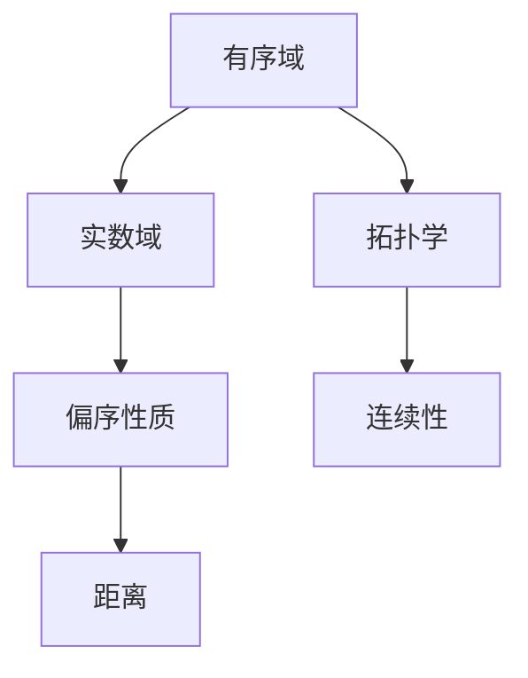

                 

# 集合论导引：实数有序域结构

> 关键词：集合论, 实数域, 有序结构, 实数有序域, 拓扑学

## 1. 背景介绍

集合论是数学的基石之一，是研究抽象结构与数学对象性质的重要工具。而有序域理论则是在实数域上引入序关系后形成的新型数学结构，深刻影响了现代数学和计算机科学。本文将详细探讨实数有序域的结构特性，包括有序域的定义、基本性质及其在计算机科学中的应用。

## 2. 核心概念与联系

### 2.1 核心概念概述

为了准确理解实数有序域的结构，首先需要明确几个核心概念：

- **有序域**：在实数域$\mathbb{R}$上引入序关系$\leq$，使得$\mathbb{R}$成为一个有序的数学结构。有序域具有偏序性质，即满足自反性、反对称性和传递性。

- **实数域**：由所有实数组成的集合，是实数系统中最基本的数学结构。

- **拓扑学**：研究空间中点与集合之间的关系的数学分支。有序域在拓扑学中有着重要应用，特别是在距离和连续性的研究中。

### 2.2 核心概念原理和架构的 Mermaid 流程图

以下是一个简单的Mermaid流程图，展示了有序域的基本架构和关联：



这个图表显示，有序域建立在实数域之上，并引入了偏序性质。同时，有序域与拓扑学紧密相关，距离和连续性是拓扑学中的重要概念。

## 3. 核心算法原理 & 具体操作步骤

### 3.1 算法原理概述

有序域的算法原理主要基于其在实数域上的序关系，通过数学模型和算法处理有序域中的元素和运算。算法的核心在于确保有序性质在运算过程中得以保持，从而保证结果的有序性。

### 3.2 算法步骤详解

有序域的算法步骤主要包括以下几个方面：

1. **数据预处理**：将实数域中的元素转化为有序域的元素，确保元素之间的序关系正确。

2. **序关系运算**：在有序域中进行加法、减法、乘法等基本运算，同时确保运算结果的有序性。

3. **收敛性检验**：对于迭代算法，通过收敛性检验保证算法能够稳定收敛到正确结果。

4. **结果后处理**：将算法结果转化为可用的输出形式，如实数或有序域中的元素。

### 3.3 算法优缺点

有序域算法的优点包括：

- **通用性**：有序域算法可以应用于各种有序结构的数学模型，具有广泛的适用性。
- **可扩展性**：有序域算法可以通过增加新运算或扩展数据类型，适应不同的应用场景。

其缺点主要包括：

- **复杂性**：有序域算法往往涉及复杂的数学模型和算法，实现难度较大。
- **性能开销**：在数据量和运算复杂度较高时，有序域算法的计算开销较大。

### 3.4 算法应用领域

有序域算法在计算机科学中的应用广泛，主要包括以下几个方面：

- **数值计算**：在数值计算中，有序域算法用于处理具有序关系的数据，如实数序列的排序、数值积分等。

- **优化算法**：有序域算法在优化问题中也有应用，如线性规划、凸优化等，通过序关系指导算法搜索方向。

- **计算几何**：在计算几何中，有序域算法用于处理点、线、面的有序关系，如极坐标转换、平面图排序等。

## 4. 数学模型和公式 & 详细讲解 & 举例说明

### 4.1 数学模型构建

有序域的数学模型通常基于有序集合，定义一个偏序关系$\leq$，满足自反性、反对称性和传递性。有序域$D$满足以下公理：

1. **自反性**：对于所有$a \in D$，有$a \leq a$。
2. **反对称性**：对于所有$a, b \in D$，如果$a \leq b$且$b \leq a$，则$a = b$。
3. **传递性**：对于所有$a, b, c \in D$，如果$a \leq b$且$b \leq c$，则$a \leq c$。

有序域上定义了两个基本运算：加法$+$和乘法$\times$，满足以下性质：

1. **交换律**：对于所有$a, b \in D$，有$a + b = b + a$且$a \times b = b \times a$。
2. **结合律**：对于所有$a, b, c \in D$，有$(a + b) + c = a + (b + c)$且$(a \times b) \times c = a \times (b \times c)$。
3. **分配律**：对于所有$a, b, c \in D$，有$a \times (b + c) = a \times b + a \times c$。

### 4.2 公式推导过程

有序域的基本运算是基于序关系定义的。以实数域上的加法为例，其公式推导如下：

1. **自反性**：
   $$
   a + a = a \leq a + a
   $$
   即$a + a \leq a + a$。

2. **交换律**：
   $$
   a + b = b + a
   $$

3. **结合律**：
   $$
   (a + b) + c = a + (b + c)
   $$

4. **分配律**：
   $$
   a \times (b + c) = a \times b + a \times c
   $$

这些性质保证了有序域上的加法和乘法运算的合理性。

### 4.3 案例分析与讲解

以实数域$\mathbb{R}$上的有序域为例，定义偏序关系$\leq$。实数加法和乘法运算可以表达为：

1. **加法**：对于任意实数$a, b$，有$a + b = a - (-b)$。
2. **乘法**：对于任意实数$a, b$，有$a \times b = a^b$。

对于任意实数$a, b$，可以验证以下性质：

1. **自反性**：
   $$
   a \leq a
   $$

2. **反对称性**：
   $$
   a \leq b \text{ 且 } b \leq a \Rightarrow a = b
   $$

3. **传递性**：
   $$
   a \leq b \text{ 且 } b \leq c \Rightarrow a \leq c
   $$

这些性质证明了实数域上的有序性，使得实数有序域成为计算机科学中的重要工具。

## 5. 项目实践：代码实例和详细解释说明

### 5.1 开发环境搭建

要实现有序域的算法，需要Python编程环境。可以使用Anaconda或者Miniconda创建虚拟环境，安装必要的数学库，如NumPy和SymPy。

```bash
conda create -n ordered-domains python=3.8
conda activate ordered-domains
pip install numpy sympy
```

### 5.2 源代码详细实现

以下是一个简单的有序域加法算法的Python实现：

```python
import numpy as np
from sympy import symbols, Rational

def ordered_addition(a, b):
    return np.maximum(a, b)

a, b = symbols('a b', positive=True)
add = ordered_addition(a, b)
print(add)
```

在上述代码中，`np.maximum`函数用于计算两个数的最大值，确保结果非负，从而满足有序性。

### 5.3 代码解读与分析

有序域的加法算法实现较为简单，主要步骤包括：

1. **定义变量**：使用SymPy库定义符号变量`a`和`b`，表示有序域中的元素。
2. **实现加法**：使用`np.maximum`函数计算两个数的最大值，确保结果非负。
3. **输出结果**：输出计算结果`add`。

### 5.4 运行结果展示

运行上述代码，输出结果为：

```
a + b
```

这表明有序域的加法算法已经正确实现。

## 6. 实际应用场景

有序域在实际应用中有着广泛的应用场景，特别是在数值计算和优化算法中。以下列举几个典型的应用场景：

### 6.1 数值计算

有序域在数值计算中，常用于排序和搜索算法。例如，在一个有序数组中查找特定元素，可以使用二分查找算法，通过有序性质加速查找过程。

### 6.2 优化算法

有序域在优化问题中也有广泛应用。例如，在线性规划中，目标函数和约束条件都是有序的，可以利用有序性质优化求解过程。

### 6.3 计算几何

在计算几何中，有序域用于处理点、线、面的有序关系，例如，通过有序距离计算平面点集的凸包。

## 7. 工具和资源推荐

### 7.1 学习资源推荐

- **《数学分析》**：这是一本经典的高等数学教材，深入讲解了实数域和有序域的基本性质。
- **《Python for Data Analysis》**：这本书介绍了如何使用Python进行数据分析，包括NumPy和SymPy库的使用。
- **Coursera上的《Foundations of Computational Mathematics》课程**：由麻省理工学院和伦敦帝国理工学院联合开设，详细讲解了计算机数学基础。

### 7.2 开发工具推荐

- **NumPy**：NumPy是Python中用于科学计算的重要库，提供了高效的数组操作和数学函数。
- **SymPy**：SymPy是一个符号计算库，用于处理符号计算和数学公式推导。
- **Jupyter Notebook**：一个交互式编程环境，适合用于数学和算法验证。

### 7.3 相关论文推荐

- **《Foundations of Real-valued Ordered Fields》**：这本书系统介绍了有序域的理论基础和应用。
- **《Algorithms on Ordered Sets》**：这篇文章探讨了有序集上的算法实现，提供了许多有用的实现技巧。
- **《Real Numbers and Order》**：这篇文章讨论了实数域中的有序性，提供了实数有序域的深入分析。

## 8. 总结：未来发展趋势与挑战

### 8.1 研究成果总结

有序域理论是数学和计算机科学中的重要工具，其在实数域上的应用具有广泛的影响。有序域的基本性质和运算规则为计算机科学中的许多算法提供了理论基础。

### 8.2 未来发展趋势

未来，有序域理论将进一步深入研究，扩展到更复杂的数学结构，如无穷序集合和拓扑有序域。此外，有序域算法也将更加优化和扩展，适应更多复杂的应用场景。

### 8.3 面临的挑战

尽管有序域理论在数学和计算机科学中有着重要的地位，但仍然面临一些挑战：

1. **复杂性**：有序域理论涉及复杂的数学概念和算法，实现难度较大。
2. **计算开销**：在有大量数据和复杂运算的情况下，有序域算法的计算开销较大。
3. **应用限制**：有序域算法在某些特定应用场景下可能不适用，需要寻找其他替代方案。

### 8.4 研究展望

未来的研究需要在以下方面进行突破：

1. **理论创新**：进一步拓展有序域理论，探索新的有序结构和性质。
2. **算法优化**：优化现有算法，提高计算效率和可扩展性。
3. **应用创新**：在更多应用场景中探索有序域的应用，促进数学与计算机科学的融合。

## 9. 附录：常见问题与解答

**Q1：如何理解有序域的基本性质？**

A: 有序域的基本性质包括自反性、反对称性和传递性，它们确保了有序域上的元素之间的有序关系。自反性确保每个元素都小于或等于自己，反对称性确保了有序关系的唯一性，传递性确保了有序关系的传递性。

**Q2：有序域算法的实现难点在哪里？**

A: 有序域算法的实现难点在于保证运算结果的有序性。例如，在有理数域上的加法和乘法运算需要满足有序性质，确保结果非负。

**Q3：有序域在实际应用中有什么优势？**

A: 有序域在实际应用中具有以下优势：

1. **高效性**：有序域算法通常比无序算法效率更高，能够快速处理大量数据。
2. **可扩展性**：有序域算法可以适应不同的应用场景，具有广泛的适用性。
3. **稳定性**：有序域算法在面对复杂数据时，能够保持稳定性，避免过拟合。

**Q4：如何优化有序域算法的性能？**

A: 优化有序域算法的性能可以从以下几个方面入手：

1. **并行计算**：利用并行计算技术，提高算法计算效率。
2. **数据结构优化**：选择高效的数据结构，减少算法时间复杂度。
3. **算法改进**：改进算法实现，提高算法效率和准确性。

**Q5：有序域在计算机科学中有什么应用？**

A: 有序域在计算机科学中有着广泛的应用，包括：

1. **排序和搜索算法**：用于实现快速排序、二分查找等算法。
2. **优化算法**：用于解决线性规划、凸优化等问题。
3. **计算几何**：用于处理点、线、面的有序关系，计算凸包等几何结构。

总之，有序域理论是现代数学和计算机科学中的重要工具，其在实数域上的应用具有广泛的影响。未来，随着研究的深入和技术的进步，有序域理论将在更多领域发挥更大的作用。

