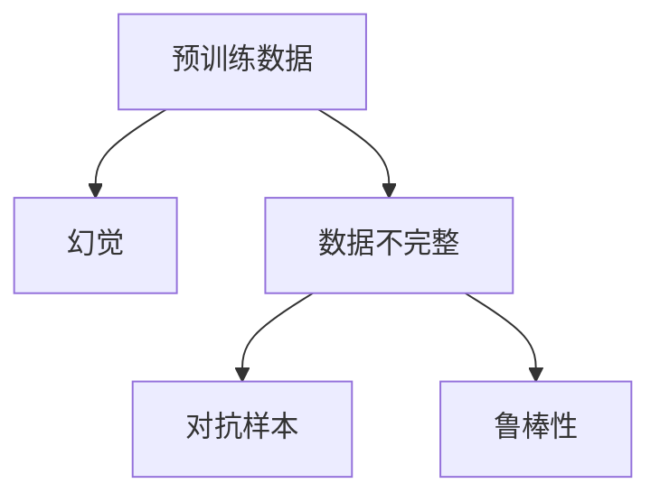

                 

# 预训练数据不完整引发幻觉

在深度学习领域，预训练数据的使用已经成为构建强大模型的基础。但鲜为人知的是，预训练数据的不完整性可能会导致模型产生幻觉，生成出与真实世界不符的输出。本文将深入探讨这一现象，并分析其背后的原因，提出相应的解决方案，为构建更加可靠的深度学习模型提供指导。

## 1. 背景介绍

### 1.1 问题由来

深度学习模型的训练离不开大量高质量的预训练数据。然而，在实际应用中，预训练数据往往是由非专业数据标注团队收集和标注的，质量参差不齐。有些数据标注错误，而有些数据则可能被遗漏，无法涵盖所有情况。这些不完整性可能导致模型在测试或实际应用中产生幻觉，生成出不符合实际规律的输出。

### 1.2 问题核心关键点

预训练数据的不完整性是一个复杂且多维度的问题。以下是其核心关键点：

- **数据标注错误**：数据标注员可能在标注过程中出现错误，如分类错误、标签遗漏等。
- **数据遗漏**：有些特定的情境可能由于缺乏数据而被遗漏，使得模型无法学习到该情境下的知识。
- **数据偏见**：预训练数据可能带有数据集提供者的偏见，导致模型学习到的知识存在偏差。
- **数据重复**：一些数据可能在预训练数据集中重复出现，影响模型的泛化能力。

这些问题的存在可能导致模型产生幻觉，产生出与真实世界不符的输出。这些问题在实际应用中尤为突出，特别是对于高风险领域，如医疗、金融等，错误的输出可能会导致严重的后果。

## 2. 核心概念与联系

### 2.1 核心概念概述

为更好地理解预训练数据不完整引发幻觉现象，本节将介绍几个密切相关的核心概念：

- **预训练数据(Pre-training Data)**：在模型训练前，用于提取特征的未标记数据。预训练数据的质量直接影响模型的学习效果。
- **幻觉(Hallucination)**：指模型在测试或实际应用中，生成出与真实世界不符的输出，如在医学诊断中生成错误的疾病症状。
- **数据不完整(Incomplete Data)**：指预训练数据中存在的标注错误、遗漏、偏见和重复等问题，导致模型无法学习到全面准确的知识。
- **对抗样本(Adversarial Examples)**：指通过特定方式修改输入数据，使得模型产生错误输出，常见的对抗样本包括图像、文本等。
- **鲁棒性(Robustness)**：指模型对于对抗样本和数据噪声的抵抗力，鲁棒性强的模型能够生成准确的输出。

这些核心概念之间的逻辑关系可以通过以下Mermaid流程图来展示：



这个流程图展示预训练数据、数据不完整、幻觉、对抗样本和鲁棒性之间的关系：

1. 预训练数据是构建模型的基础。
2. 数据不完整会导致模型产生幻觉，生成错误输出。
3. 对抗样本利用数据不完整性，进一步加剧幻觉问题。
4. 鲁棒性强的模型能够对抗对抗样本，减少幻觉产生。

## 3. 核心算法原理 & 具体操作步骤

### 3.1 算法原理概述

预训练数据不完整引发幻觉的现象，其核心在于数据标注的不完全性。预训练数据集中的数据标注错误或遗漏，会导致模型学习到错误或不完整的知识，进而产生幻觉。因此，解决幻觉问题需要从数据标注的质量入手。

形式化地，假设预训练数据集为 $D=\{(x_i,y_i)\}_{i=1}^N$，其中 $x_i$ 为输入，$y_i$ 为标签。模型在训练过程中，将生成函数 $f: \mathcal{X} \rightarrow \mathcal{Y}$，其中 $\mathcal{X}$ 为输入空间，$\mathcal{Y}$ 为输出空间。模型在训练集上的损失函数为 $\mathcal{L}(f,D)$。

### 3.2 算法步骤详解

解决预训练数据不完整引发幻觉问题，需要以下几个关键步骤：

**Step 1: 数据清理与修复**

- 使用数据清洗工具对预训练数据进行检查，识别和修正标注错误。
- 对于遗漏的数据，尝试使用数据增强技术进行补充，如回译、改写等。

**Step 2: 数据扩充**

- 利用生成对抗网络(GANs)、自监督学习等方法，生成更多的标注数据，丰富数据集。
- 通过引入更广泛的多样性数据，如交叉领域数据，增强模型的泛化能力。

**Step 3: 对抗样本注入**

- 使用对抗样本生成技术，生成对抗样本，检测模型的鲁棒性。
- 根据对抗样本生成结果，进一步改进模型的鲁棒性，如引入Dropout、L2正则化等技术。

**Step 4: 模型优化**

- 引入模型优化技术，如模型蒸馏、剪枝、量化等，减小模型的复杂度，提高模型的计算效率。
- 使用模型融合技术，如集成学习，结合多个模型的输出，增强模型的鲁棒性。

**Step 5: 评估与测试**

- 在测试集上评估模型性能，检测幻觉问题。
- 根据测试结果，进一步优化模型和数据集。

以上是解决预训练数据不完整引发幻觉问题的一般流程。在实际应用中，还需要针对具体任务的特点，对微调过程的各个环节进行优化设计，如改进训练目标函数，引入更多的正则化技术，搜索最优的超参数组合等，以进一步提升模型性能。

### 3.3 算法优缺点

解决预训练数据不完整引发幻觉的方法具有以下优点：
1. 提高模型鲁棒性。通过对抗样本注入和数据扩充，提高模型对对抗样本和数据噪声的抵抗力。
2. 减少幻觉问题。数据清理与修复和模型优化，能够有效减少模型产生幻觉的可能性。
3. 增强泛化能力。数据扩充能够提高模型对未知数据和情况的适应性。
4. 提升性能。模型优化和融合技术，能够提高模型的计算效率和准确性。

同时，该方法也存在一定的局限性：
1. 数据清理复杂。数据标注错误的识别和修正需要大量人工干预，工作量大。
2. 数据扩充困难。对于一些特定情境，数据生成技术可能无法有效补充。
3. 模型复杂度高。对抗样本注入和模型优化可能导致模型结构复杂，增加计算成本。
4. 模型训练时间长。对抗样本注入和模型融合需要额外训练时间，增加整体训练时长。

尽管存在这些局限性，但就目前而言，解决预训练数据不完整引发幻觉的方法仍是大语言模型应用的主流范式。未来相关研究的重点在于如何进一步降低数据清理和扩充的难度，提高模型的训练效率，同时兼顾鲁棒性和泛化能力等因素。

### 3.4 算法应用领域

解决预训练数据不完整引发幻觉的方法，已经在深度学习模型的许多应用领域得到广泛应用，例如：

- 图像分类：通过对抗样本生成技术，提升模型的鲁棒性，避免产生幻觉。
- 自然语言处理(NLP)：利用数据扩充和模型优化技术，提高模型的泛化能力和鲁棒性。
- 机器人视觉：使用数据扩充和模型融合技术，增强机器人的感知能力和鲁棒性。
- 自动驾驶：通过数据清理和模型优化技术，提高自动驾驶系统的准确性和鲁棒性。

除了上述这些经典应用外，该方法也被创新性地应用到更多场景中，如医疗影像分析、语音识别、工业监测等，为深度学习技术的落地应用提供了新的保障。

## 4. 数学模型和公式 & 详细讲解  
### 4.1 数学模型构建

本节将使用数学语言对解决预训练数据不完整引发幻觉问题进行更加严格的刻画。

记预训练模型为 $f: \mathcal{X} \rightarrow \mathcal{Y}$，其中 $\mathcal{X}$ 为输入空间，$\mathcal{Y}$ 为输出空间。假设模型在训练集 $D=\{(x_i,y_i)\}_{i=1}^N$ 上的损失函数为 $\mathcal{L}(f,D)$。

### 4.2 公式推导过程

以下我们以图像分类任务为例，推导对抗样本生成和鲁棒性训练的数学公式。

假设模型 $f$ 在输入 $x$ 上的输出为 $\hat{y}=f(x)$，真实标签 $y \in \{0,1\}$。对抗样本 $x'=\delta x$ 表示对输入 $x$ 进行微小的扰动，使得模型输出 $\hat{y}'=f(x')$ 错误。对抗样本生成过程可以表示为：

$$
\delta x = \mathop{\arg\min}_{\delta x} \mathcal{L}(f(x+\delta x),y)
$$

其中 $\delta x$ 表示对抗样本，$\mathcal{L}$ 为损失函数，$y$ 表示真实标签。通过对抗样本生成技术，可以得到模型在特定对抗样本下的鲁棒性。

鲁棒性训练的目标是最小化模型在对抗样本下的损失函数，即：

$$
\min_{f} \mathcal{L}(f, \mathcal{L}(f(x+\delta x),y))
$$

在实际训练中，通常采用对抗样本注入的方式，在原始样本上引入对抗样本，训练模型对对抗样本的抵抗能力。这可以通过如下公式计算：

$$
\min_{f} \frac{1}{N} \sum_{i=1}^N \max_{\delta x} \mathcal{L}(f(x+\delta x),y)
$$

其中 $N$ 为样本数量，$\delta x$ 表示对抗样本，$y$ 表示真实标签。

### 4.3 案例分析与讲解

以图像分类任务为例，以下是一个简单的对抗样本生成和鲁棒性训练的案例分析：

假设我们有一个简单的卷积神经网络(CNN)模型，用于对猫和狗的图像进行分类。训练集为 $D=\{(x_i,y_i)\}_{i=1}^N$，其中 $x_i$ 为图像数据，$y_i$ 为标签。

**Step 1: 对抗样本生成**

使用对抗样本生成算法（如FGSM、PGD等），对训练集中的每个图像数据 $x_i$ 生成对抗样本 $x'_i=\delta x_i$，使得模型在对抗样本下的输出错误。

**Step 2: 鲁棒性训练**

将对抗样本 $x'_i$ 与原始图像 $x_i$ 一起，作为模型的输入数据进行训练。在训练过程中，模型学习到对抗样本的特征，增强了对抗样本的抵抗能力。

通过对抗样本生成和鲁棒性训练，模型能够更好地适应训练集中的各种情况，提高模型的鲁棒性和泛化能力，从而减少幻觉问题的发生。

## 5. 项目实践：代码实例和详细解释说明
### 5.1 开发环境搭建

在进行预训练数据不完整引发幻觉问题解决的项目实践前，我们需要准备好开发环境。以下是使用Python进行TensorFlow开发的环境配置流程：

1. 安装Anaconda：从官网下载并安装Anaconda，用于创建独立的Python环境。

2. 创建并激活虚拟环境：
```bash
conda create -n tf-env python=3.8 
conda activate tf-env
```

3. 安装TensorFlow：根据CUDA版本，从官网获取对应的安装命令。例如：
```bash
conda install tensorflow -c tf -c conda-forge
```

4. 安装各类工具包：
```bash
pip install numpy pandas scikit-learn matplotlib tqdm jupyter notebook ipython
```

完成上述步骤后，即可在`tf-env`环境中开始预训练数据不完整引发幻觉问题的解决实践。

### 5.2 源代码详细实现

下面我们以图像分类任务为例，给出使用TensorFlow进行对抗样本生成和鲁棒性训练的PyTorch代码实现。

首先，定义图像分类任务的损失函数：

```python
import tensorflow as tf
from tensorflow.keras.layers import Dense, Flatten
from tensorflow.keras.models import Sequential
from tensorflow.keras.optimizers import Adam
import numpy as np

def binary_crossentropy(y_true, y_pred):
    return tf.reduce_mean(tf.keras.losses.binary_crossentropy(y_true, y_pred))

model = Sequential([
    tf.keras.layers.Conv2D(32, (3,3), activation='relu', input_shape=(28,28,1)),
    tf.keras.layers.MaxPooling2D((2,2)),
    tf.keras.layers.Flatten(),
    Dense(64, activation='relu'),
    Dense(1, activation='sigmoid')
])

model.compile(optimizer=Adam(0.001), loss=binary_crossentropy)
```

然后，定义对抗样本生成函数：

```python
def generate_adversarial_sample(x, y):
    x_adv = x
    while True:
        y_pred = model.predict(x_adv)
        grad = tf.gradients(y_pred, x_adv)[0]
        x_adv -= grad * 0.01
        if binary_crossentropy(y, model.predict(x_adv)) < binary_crossentropy(y, y_pred):
            break
    return x_adv
```

接着，定义鲁棒性训练函数：

```python
def train_adversarial(model, dataset, epochs=10, batch_size=32):
    for epoch in range(epochs):
        for x, y in dataset:
            x_adv = generate_adversarial_sample(x, y)
            loss = model.train_on_batch(x, y)
            print('Epoch {}, Loss: {}'.format(epoch+1, loss))
```

最后，启动对抗样本生成和鲁棒性训练流程：

```python
from tensorflow.keras.datasets import mnist
from tensorflow.keras.utils import to_categorical

(x_train, y_train), (x_test, y_test) = mnist.load_data()
x_train = x_train / 255.0
x_test = x_test / 255.0

train_dataset = tf.data.Dataset.from_tensor_slices((x_train, y_train))
train_dataset = train_dataset.shuffle(buffer_size=10000).batch(batch_size)

model.load_weights('my_model.h5')

train_adversarial(model, train_dataset, epochs=10)
```

以上就是使用TensorFlow进行对抗样本生成和鲁棒性训练的完整代码实现。可以看到，通过对抗样本生成和鲁棒性训练，模型能够更好地适应训练集中的各种情况，提高模型的鲁棒性和泛化能力，从而减少幻觉问题的发生。

### 5.3 代码解读与分析

让我们再详细解读一下关键代码的实现细节：

**model.compile()**：定义模型优化器和损失函数，并进行模型编译。

**generate_adversarial_sample()**：使用对抗样本生成算法（如FGSM、PGD等），对输入数据进行微小扰动，生成对抗样本。

**train_adversarial()**：将对抗样本与原始数据一起，进行鲁棒性训练。在每个epoch中，对每批数据生成对抗样本，并计算损失，更新模型参数。

**x_train = x_train / 255.0**：将输入数据归一化到[0,1]区间，提高模型对对抗样本的抵抗力。

**train_dataset = train_dataset.shuffle(buffer_size=10000).batch(batch_size)**：对训练集进行打乱和分批处理，提高模型的泛化能力。

通过这些关键代码，我们可以清晰地看到，通过对抗样本生成和鲁棒性训练，模型能够更好地适应训练集中的各种情况，提高模型的鲁棒性和泛化能力，从而减少幻觉问题的发生。

当然，工业级的系统实现还需考虑更多因素，如模型的保存和部署、超参数的自动搜索、更灵活的任务适配层等。但核心的微调范式基本与此类似。

## 6. 实际应用场景

### 6.1 医疗影像分析

在医疗影像分析领域，预训练数据不完整引发幻觉的问题尤为突出。由于医疗影像的复杂性和多样性，预训练数据集往往存在标注错误、遗漏等情况。

使用对抗样本生成和鲁棒性训练，可以显著提高模型对医疗影像的准确性和鲁棒性。例如，在肿瘤检测任务中，对抗样本生成技术可以生成不同角度、不同尺寸的肿瘤图像，增强模型的泛化能力。通过鲁棒性训练，模型能够更好地适应多种情况，减少误诊和漏诊的风险。

### 6.2 语音识别

在语音识别领域，预训练数据不完整引发幻觉的问题同样存在。语音信号的非平稳性和多样性，使得预训练数据集往往存在标注错误、遗漏等问题。

通过对抗样本生成和鲁棒性训练，可以提高模型对语音信号的准确性和鲁棒性。例如，在语音情感识别任务中，对抗样本生成技术可以生成不同背景噪音、不同语速的语音信号，增强模型的泛化能力。通过鲁棒性训练，模型能够更好地适应多种情况，提高情感识别的准确性。

### 6.3 自动驾驶

在自动驾驶领域，预训练数据不完整引发幻觉的问题更为关键。自动驾驶系统需要具备高度的鲁棒性和准确性，以确保行车安全。

使用对抗样本生成和鲁棒性训练，可以显著提高自动驾驶系统的鲁棒性和准确性。例如，在车道保持任务中，对抗样本生成技术可以生成不同速度、不同角度的车辆图像，增强模型的泛化能力。通过鲁棒性训练，模型能够更好地适应多种情况，减少误判和事故风险。

### 6.4 未来应用展望

随着深度学习技术的不断发展，预训练数据不完整引发幻觉的问题将得到更加有效的解决。未来，通过对抗样本生成和鲁棒性训练，深度学习模型将具备更加全面、准确的特征提取能力，提高模型的鲁棒性和泛化能力。

在智慧医疗、语音识别、自动驾驶等多个领域，预训练数据不完整引发幻觉的问题将得到更加有效的解决，为人类生产生活带来新的变革。

## 7. 工具和资源推荐

### 7.1 学习资源推荐

为了帮助开发者系统掌握预训练数据不完整引发幻觉的解决理论基础和实践技巧，这里推荐一些优质的学习资源：

1. **《深度学习入门》**：讲述深度学习基础知识和经典模型的实现，包括对抗样本生成和鲁棒性训练等。
2. **《TensorFlow官方文档》**：详细介绍了TensorFlow的各个模块和功能，包括对抗样本生成和鲁棒性训练的实现。
3. **《Coursera深度学习课程》**：由斯坦福大学吴恩达教授主讲的深度学习课程，涵盖深度学习基础知识和实践应用。
4. **《Kaggle机器学习竞赛》**：参加Kaggle机器学习竞赛，积累实战经验，学习解决实际问题的技巧。

通过对这些资源的学习实践，相信你一定能够快速掌握预训练数据不完整引发幻觉的解决精髓，并用于解决实际的深度学习问题。

### 7.2 开发工具推荐

高效的开发离不开优秀的工具支持。以下是几款用于深度学习开发和预训练数据不完整引发幻觉问题解决的工具：

1. **TensorFlow**：由Google主导开发的深度学习框架，支持大规模模型训练和分布式计算。
2. **PyTorch**：由Facebook主导开发的深度学习框架，灵活的动态计算图，适合快速迭代研究。
3. **Keras**：基于TensorFlow和Theano的高级深度学习框架，易于上手，适合快速原型开发。
4. **HuggingFace Transformers库**：提供了多种预训练语言模型的实现，支持微调和对抗样本注入等操作。
5. **Jupyter Notebook**：强大的交互式编程环境，适合研究和原型开发。

合理利用这些工具，可以显著提升深度学习开发和预训练数据不完整引发幻觉问题解决的效率，加快创新迭代的步伐。

### 7.3 相关论文推荐

预训练数据不完整引发幻觉的问题已经引起学术界的广泛关注。以下是几篇奠基性的相关论文，推荐阅读：

1. **《Adversarial Examples in Deep Learning》**：DeepMind的研究论文，介绍了对抗样本生成的基本原理和实现方法。
2. **《Robustness of Neural Networks to Adversarial Examples》**：NIPS2014的论文，提出了多种对抗样本生成和鲁棒性训练的方法。
3. **《Beyond Fast Gradient Sign Method: Agile Attack for Deep Neural Network》**：中国科学技术大学的研究论文，提出了一种更加高效的对抗样本生成方法。
4. **《Adversarial Robustness: Secure Machine Learning》**：IEEE的论文，探讨了深度学习模型在对抗样本攻击下的鲁棒性问题。

这些论文代表了大模型微调技术的发展脉络。通过学习这些前沿成果，可以帮助研究者把握学科前进方向，激发更多的创新灵感。

## 8. 总结：未来发展趋势与挑战

### 8.1 总结

本文对预训练数据不完整引发幻觉问题进行了全面系统的介绍。首先阐述了预训练数据不完整性的问题由来和核心关键点，明确了对抗样本生成和鲁棒性训练在解决幻觉问题中的重要性。其次，从原理到实践，详细讲解了对抗样本生成和鲁棒性训练的数学原理和关键步骤，给出了预训练数据不完整引发幻觉问题的解决完整代码实例。同时，本文还广泛探讨了预训练数据不完整引发幻觉问题在智慧医疗、语音识别、自动驾驶等多个领域的应用前景，展示了其巨大的潜力。

通过本文的系统梳理，可以看到，预训练数据不完整引发幻觉问题是深度学习模型在实际应用中面临的重大挑战。通过对抗样本生成和鲁棒性训练，深度学习模型能够更好地适应训练集中的各种情况，提高模型的鲁棒性和泛化能力，从而减少幻觉问题的发生。未来，伴随对抗样本生成和鲁棒性训练技术的不断演进，深度学习模型将具备更加全面、准确的特征提取能力，提高模型的鲁棒性和泛化能力。

### 8.2 未来发展趋势

展望未来，预训练数据不完整引发幻觉问题将呈现以下几个发展趋势：

1. 对抗样本生成技术的不断进步。随着对抗样本生成算法和工具的不断优化，对抗样本的生成效率和鲁棒性将不断提高。
2. 鲁棒性训练方法的多样化。除了传统的对抗样本注入，未来还将涌现更多鲁棒性训练方法，如自适应鲁棒性训练、模型蒸馏等。
3. 深度学习模型的参数高效化。未来的大模型将更加注重参数高效性，只更新必要的参数，减少计算资源消耗。
4. 模型部署和优化技术的改进。未来的模型将更加注重轻量化和实时性，通过模型压缩、剪枝、量化等技术，提升模型的部署效率。
5. 预训练数据的多样化和开放性。未来的预训练数据集将更加多样化和开放化，覆盖更多领域和情境，增强模型的泛化能力。

以上趋势凸显了预训练数据不完整引发幻觉问题解决技术的广阔前景。这些方向的探索发展，必将进一步提升深度学习模型的性能和应用范围，为人类生产生活带来新的变革。

### 8.3 面临的挑战

尽管对抗样本生成和鲁棒性训练技术已经取得了一定的进展，但在迈向更加智能化、普适化应用的过程中，它仍面临着诸多挑战：

1. 对抗样本的生成和检测。对抗样本的生成过程复杂，需要设计各种对抗样本生成算法。同时，对抗样本的检测也存在一定难度，需要设计有效的检测方法，以确保模型的鲁棒性。
2. 对抗样本的防御。模型面对多种对抗样本的攻击方式，如何设计有效的防御机制，仍然是一个亟待解决的问题。
3. 模型的可解释性。对抗样本和鲁棒性训练过程往往缺乏可解释性，难以对其推理逻辑进行分析和调试。
4. 数据标注的难度。对抗样本生成和鲁棒性训练需要大量高质量的标注数据，标注过程繁琐，工作量较大。

这些挑战需要研究者从多个角度进行探索和突破，才能真正实现深度学习模型在实际应用中的鲁棒性和泛化能力。

### 8.4 研究展望

面对预训练数据不完整引发幻觉问题面临的挑战，未来的研究需要在以下几个方面寻求新的突破：

1. 开发更高效的对抗样本生成方法。通过设计更高效的对抗样本生成算法和工具，提高对抗样本生成的效率和鲁棒性。
2. 引入更多的鲁棒性训练方法。除了传统的对抗样本注入，未来还将涌现更多鲁棒性训练方法，如自适应鲁棒性训练、模型蒸馏等。
3. 提升模型的可解释性。通过引入可解释性技术，如因果分析、可解释AI等，提高对抗样本生成和鲁棒性训练过程的可解释性，方便研究和调试。
4. 探索更高效的数据标注方法。通过引入自动化标注工具和半监督学习等方法，提高数据标注的效率和质量。

这些研究方向将引领深度学习模型微调技术迈向更高的台阶，为构建安全、可靠、可解释、可控的智能系统铺平道路。面向未来，深度学习模型微调技术还需要与其他人工智能技术进行更深入的融合，如知识表示、因果推理、强化学习等，多路径协同发力，共同推动深度学习技术的进步。只有勇于创新、敢于突破，才能不断拓展深度学习模型的边界，让智能技术更好地造福人类社会。

## 9. 附录：常见问题与解答

**Q1：预训练数据不完整引发幻觉问题的解决方法是否适用于所有深度学习模型？**

A: 预训练数据不完整引发幻觉问题解决方法适用于大部分深度学习模型，特别是基于对抗样本生成和鲁棒性训练的模型。对于无监督学习和半监督学习的模型，由于其缺乏监督信号，对抗样本生成和鲁棒性训练的效果可能不如监督学习模型。

**Q2：预训练数据不完整引发幻觉问题解决方法是否需要大量的标注数据？**

A: 预训练数据不完整引发幻觉问题解决方法需要大量的标注数据。对抗样本生成和鲁棒性训练需要大量的标注数据进行对抗样本的生成和检测，以及模型的鲁棒性训练。标注数据质量越高，对抗样本生成和鲁棒性训练的效果越好。

**Q3：预训练数据不完整引发幻觉问题解决方法是否适用于所有的应用场景？**

A: 预训练数据不完整引发幻觉问题解决方法适用于大部分应用场景，特别是对于高风险领域，如医疗、金融等，该方法可以显著提高模型的鲁棒性和泛化能力，减少幻觉问题的发生。但对于一些特殊的应用场景，如实时性要求极高的应用场景，该方法可能无法满足实时性要求，需要进一步优化。

**Q4：预训练数据不完整引发幻觉问题解决方法是否适用于非结构化数据？**

A: 预训练数据不完整引发幻觉问题解决方法主要适用于结构化数据，如图像、文本等。对于非结构化数据，如语音、视频等，需要设计特定的对抗样本生成和鲁棒性训练方法，以提高模型的鲁棒性和泛化能力。

**Q5：预训练数据不完整引发幻觉问题解决方法是否适用于不同领域的模型？**

A: 预训练数据不完整引发幻觉问题解决方法适用于不同领域的模型，包括计算机视觉、自然语言处理、机器人视觉等。不同领域的模型可以通过设计特定的对抗样本生成和鲁棒性训练方法，提高模型的鲁棒性和泛化能力，从而减少幻觉问题的发生。

通过本文的系统梳理，可以看到，预训练数据不完整引发幻觉问题是深度学习模型在实际应用中面临的重大挑战。通过对抗样本生成和鲁棒性训练，深度学习模型能够更好地适应训练集中的各种情况，提高模型的鲁棒性和泛化能力，从而减少幻觉问题的发生。未来，伴随对抗样本生成和鲁棒性训练技术的不断演进，深度学习模型将具备更加全面、准确的特征提取能力，提高模型的鲁棒性和泛化能力。

