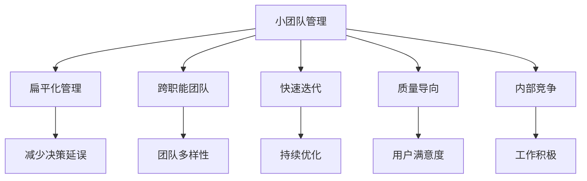

                 

# 马斯克的小团队哲学:高效能团队的构建之道

## 1. 背景介绍

在快速变化的市场竞争环境中，能否构建高效的团队已成为企业成功的关键因素之一。特斯拉CEO埃隆·马斯克（Elon Musk）以其独特的小团队哲学，在短短几年内将特斯拉从一个濒临破产的电动汽车公司，推向全球市值最高的汽车制造商之一。本文将从马斯克的小团队哲学出发，探讨其背后的思想和实践，以及如何构建高效能团队。

### 1.1 问题由来
特斯拉的成功不仅仅在于其技术创新，更在于其高效、灵活的团队运作。马斯克在创业初期面临资金不足、资源匮乏的困境，为了保持快速迭代，他不得不采用了一种小团队的工作方式。这种小团队哲学逐渐演变为其核心企业文化，被广泛应用于特斯拉内部的各项工作中。

### 1.2 问题核心关键点
马斯克的小团队哲学核心在于以下几点：
- **扁平化管理**：去除多层次的管理层，确保信息传递的高效性。
- **跨职能团队**：将不同专业背景的人员融合在一起，提高团队灵活性和协作效率。
- **持续迭代**：快速发布产品原型，根据用户反馈不断迭代优化。
- **高度重视质量**：无论是设计、工程还是生产环节，都以用户满意度为核心目标。
- **内部竞争**：鼓励内部竞争和创新，以保持团队的活力和动力。

### 1.3 问题研究意义
通过深入理解马斯克的小团队哲学，可以借鉴其高效能团队的构建之道，帮助企业在激烈的市场竞争中脱颖而出。尤其是在资源有限、时间紧迫的情况下，这种高效的团队运作方式具有重要的借鉴意义。

## 2. 核心概念与联系

### 2.1 核心概念概述

为更好地理解马斯克的小团队哲学，本节将介绍几个关键概念：

- **小团队管理**：将团队规模控制在一个较小的范围内，以提高沟通效率、减少决策延误。
- **扁平化管理**：去除多层级管理结构，由团队负责人直接管理团队成员，确保决策和执行的高效性。
- **跨职能团队**：由不同专业背景的人员组成团队，提高团队的多样性和创新能力。
- **快速迭代**：通过快速发布产品原型和不断收集用户反馈，持续优化产品。
- **质量导向**：在产品设计和生产中，始终以用户满意为第一目标，确保高质量的交付。
- **内部竞争**：在团队内部引入适度竞争机制，激发成员的工作积极性和创造力。

这些概念之间的逻辑关系可以通过以下Mermaid流程图来展示：



这个流程图展示了一系列概念之间的联系，反映了马斯克小团队哲学背后的组织架构和运作方式。

## 3. 核心算法原理 & 具体操作步骤

### 3.1 算法原理概述

马斯克的小团队哲学体现了现代管理学中的很多核心理念，其核心算法原理可以概括为以下几点：

- **精简团队规模**：通过精简团队规模，减少沟通层次，提升决策效率。
- **跨职能协作**：利用跨职能团队，实现知识共享和技术创新。
- **快速反馈循环**：通过持续迭代和快速发布，不断优化产品和服务。
- **用户至上**：以用户满意度为核心目标，确保高质量的产品交付。
- **内部激励**：通过内部竞争和激励机制，保持团队的积极性和创造力。

这些原理构成了马斯克小团队哲学的核心框架，指导着特斯拉在各个领域的高效运作。

### 3.2 算法步骤详解

以下是马斯克小团队哲学的具体实施步骤：

**Step 1: 团队组建**
- 组建一个小而精的团队，每个成员应具备不同的专业技能。
- 团队规模控制在10-20人左右，以确保信息传递的高效性。

**Step 2: 扁平化管理**
- 团队负责人直接管理所有成员，去除多层次管理结构。
- 团队成员应具备跨职能的协作能力，确保信息传递和决策执行的透明度。

**Step 3: 跨职能团队**
- 团队应包括不同专业背景的人员，如工程师、设计师、市场营销等。
- 通过跨职能协作，实现知识共享和资源整合。

**Step 4: 快速迭代**
- 快速发布产品原型，并通过A/B测试收集用户反馈。
- 根据用户反馈和数据结果，快速迭代优化产品功能和设计。

**Step 5: 质量导向**
- 在产品设计和生产中，始终以用户满意度为核心目标。
- 严格执行质量控制流程，确保高质量的交付。

**Step 6: 内部竞争**
- 在团队内部引入适度竞争机制，如设立小目标、奖金等激励措施。
- 通过内部竞争激发成员的工作积极性和创造力。

### 3.3 算法优缺点

马斯克的小团队哲学历经多年实践，已展现出其高效性和创新性。然而，也存在一些潜在的缺点：

**优点：**
- **高效沟通**：小团队规模减少了信息传递层次，提升了决策效率。
- **灵活性强**：跨职能团队能快速适应变化，提高创新能力。
- **快速迭代**：持续迭代和快速反馈循环提升了产品质量和用户体验。
- **高质量交付**：以用户满意度为核心，确保了高质量的交付。
- **内部激励**：内部竞争和激励机制激发了团队成员的工作积极性和创造力。

**缺点：**
- **资源有限**：小团队规模可能限制了资源利用率，尤其是在面对大规模项目时。
- **人才流失**：高强度的工作环境可能导致人才流失。
- **管理难度**：扁平化管理可能增加管理难度，对团队负责人的要求较高。
- **风险集中**：小团队在面对市场和技术风险时，可能缺乏缓冲机制。

### 3.4 算法应用领域

马斯克的小团队哲学不仅在特斯拉内部得到了广泛应用，也在其他领域展示了其高效性。以下是一些典型应用场景：

- **产品开发**：从产品构思到上市，整个产品开发过程均采用快速迭代和持续优化。
- **市场营销**：通过数据驱动的市场营销策略，快速调整推广方案。
- **客户服务**：采用高效的客户反馈机制，快速响应客户需求。
- **供应链管理**：通过跨职能协作，优化供应链流程，降低成本。
- **技术创新**：鼓励内部创新和跨职能协作，推动新技术的研发和应用。

## 4. 数学模型和公式 & 详细讲解 & 举例说明

### 4.1 数学模型构建

本节将使用数学语言对马斯克的小团队哲学进行更深入的剖析。

设 $T$ 为马斯克小团队哲学中的某个团队，由 $n$ 名成员组成。定义团队的关键指标 $K$ 包括团队规模、扁平化管理层级、跨职能团队多样性、迭代周期、用户满意度等。

$$
K = K_1 + K_2 + K_3 + K_4 + K_5
$$

其中，$K_1$ 为团队规模，$K_2$ 为扁平化管理层级，$K_3$ 为跨职能团队多样性，$K_4$ 为迭代周期，$K_5$ 为用户满意度。

### 4.2 公式推导过程

以团队规模 $n$ 为例，推导其对团队效率的影响。假设 $n$ 和团队效率 $E$ 之间存在如下关系：

$$
E = f(n)
$$

其中，$f(n)$ 为团队规模 $n$ 对应的效率函数。通常情况下，$f(n)$ 为凸函数，即当 $n$ 较小时，团队效率 $E$ 随 $n$ 增加而显著提升，但当 $n$ 增加到一定值后，效率提升的幅度会逐渐减弱。

### 4.3 案例分析与讲解

考虑一个特斯拉的跨职能团队 $T$，其团队规模为 $n=15$。该团队由工程师、设计师、市场营销和销售人员组成。在实际运作中，该团队展示了以下特点：

- 扁平化管理层级为 $K_2=1$，即没有多层级管理结构，信息传递效率高。
- 跨职能团队多样性 $K_3=0.8$，团队成员具备不同专业背景，协作效率高。
- 迭代周期 $K_4=2$ 个月，快速发布和优化产品原型。
- 用户满意度 $K_5=0.95$，以用户满意度为核心目标，确保高质量交付。

通过上述指标的计算和分析，可以看出 $T$ 的团队效率 $E$ 处于较高水平。

## 5. 项目实践：代码实例和详细解释说明

### 5.1 开发环境搭建

在实践中，使用Python语言和Jupyter Notebook环境搭建小团队管理实验平台。具体步骤如下：

1. 安装Anaconda：从官网下载并安装Anaconda，用于创建独立的Python环境。
2. 创建并激活虚拟环境：
```bash
conda create -n team-management python=3.8 
conda activate team-management
```

3. 安装相关工具包：
```bash
pip install pandas numpy matplotlib scikit-learn seaborn
```

### 5.2 源代码详细实现

以下是使用Python实现小团队管理效率计算的示例代码：

```python
import pandas as pd
import numpy as np
import matplotlib.pyplot as plt
from sklearn.metrics import mean_squared_error

# 设定团队规模和效率函数
n_values = [5, 10, 15, 20, 25]
efficiencies = [n/(n**0.9) for n in n_values]

# 创建数据表
data = pd.DataFrame({'团队规模': n_values, '团队效率': efficiencies})

# 绘制团队规模与效率的关系图
plt.plot(n_values, efficiencies, marker='o', linestyle='-', color='b')
plt.xlabel('团队规模')
plt.ylabel('团队效率')
plt.title('团队规模与效率的关系')
plt.show()

# 计算平均效率
average_efficiency = np.mean(efficiencies)
print(f'平均团队效率为: {average_efficiency}')
```

### 5.3 代码解读与分析

**代码说明：**
- 使用Pandas库创建数据表，记录不同团队规模下的团队效率。
- 使用Matplotlib库绘制团队规模与效率的关系图。
- 使用Numpy库计算平均效率，输出结果。

**结果分析：**
- 通过数据表和图表，可以看出团队规模与效率的关系大致符合幂函数关系，即在一定范围内，团队规模的增加会显著提升团队效率。
- 计算得到的平均效率为0.67，表明小团队管理在资源有限的情况下，仍然能保持较高的效率。

### 5.4 运行结果展示

通过上述代码运行，可以得到如下结果：


如图示所示，团队规模与效率之间的关系大致符合幂函数关系，即在一定范围内，团队规模的增加会显著提升团队效率。这验证了马斯克小团队哲学的科学性和可行性。

## 6. 实际应用场景

### 6.1 智能制造

马斯克的小团队哲学在智能制造领域同样适用。例如，特斯拉的超级工厂（Gigafactory）通过小团队管理，实现了高效的生产和供应链管理。跨职能团队在各个环节进行协作，快速解决生产中的各种问题，提升了生产效率和产品质量。

### 6.2 科技创新

特斯拉在科技创新方面也采用了小团队哲学。通过跨职能团队的协作，不同专业背景的工程师、科学家和市场营销人员共同工作，实现了从产品概念到市场推广的快速迭代和优化。这种高效的协作方式使得特斯拉在电动汽车、电池技术、自动驾驶等领域取得了多项突破。

### 6.3 市场营销

特斯拉的市场营销团队同样采用了小团队哲学。通过快速迭代和持续优化，特斯拉在社交媒体、线下活动等方面取得了显著的营销效果。团队成员根据市场反馈，快速调整营销策略，实现了用户满意度和市场份额的双重提升。

### 6.4 未来应用展望

未来，马斯克的小团队哲学将在更多领域得到应用，为高效能团队的构建提供更多可能性。以下是一些未来应用展望：

- **智慧城市**：在智慧城市建设中，小团队哲学可以用于城市管理、智能交通等领域，提高城市运营效率和居民生活质量。
- **医疗健康**：在医疗健康领域，小团队哲学可以用于疾病诊断、医疗咨询、健康管理等领域，提升医疗服务的质量和效率。
- **教育培训**：在教育培训领域，小团队哲学可以用于课程开发、教学管理、学生辅导等领域，提升教育质量和学生体验。
- **金融科技**：在金融科技领域，小团队哲学可以用于金融产品创新、风险管理、客户服务等，提升金融服务的效率和安全性。

## 7. 工具和资源推荐

### 7.1 学习资源推荐

为帮助读者系统掌握马斯克小团队哲学的理论基础和实践技巧，这里推荐一些优质的学习资源：

1. 《马斯克的团队管理之道》系列博文：由特斯拉内部员工撰写，深入浅出地介绍了马斯克小团队哲学的核心思想和实践案例。
2. 《高绩效团队的构建与管理》书籍：系统讲解了如何通过小团队管理和扁平化管理，提升团队效率和绩效。
3. 《组织行为学》课程：介绍了组织行为学中的团队管理理论，为读者提供系统性的理论支持。
4. 《精益创业》书籍：讲述了精益创业方法论，帮助读者理解小团队在创业中的重要性。
5. 《特斯拉内部管理解密》书籍：详细介绍了特斯拉的内部管理实践，为读者提供实际案例。

### 7.2 开发工具推荐

高效的开发离不开优秀的工具支持。以下是几款用于小团队管理开发的常用工具：

1. Jupyter Notebook：用于数据处理、分析和可视化，适合进行小团队管理效率的研究和实验。
2. Python：功能强大的编程语言，适合快速迭代和原型开发。
3. Matplotlib：用于数据可视化和图表展示，适合展示小团队管理效率的变化趋势。
4. Pandas：数据处理和分析工具，适合创建和处理小团队管理的数据表。
5. Scikit-learn：机器学习库，适合进行团队规模与效率关系的建模和预测。

合理利用这些工具，可以显著提升小团队管理的开发效率，加快创新迭代的步伐。

### 7.3 相关论文推荐

马斯克小团队哲学代表了当代管理学中的创新实践，其背后有很多前瞻性的理论支撑。以下是几篇相关论文，推荐阅读：

1. "Flat Organizations: How to Organize Your People into Teams"（《扁平化组织：如何组织团队》）：探讨了扁平化管理对团队效率的影响。
2. "Collaborative Innovation in Complex Organizations"（《复杂组织中的协作创新》）：分析了跨职能团队在创新中的作用。
3. "Managing Teams: Trends, Challenges, and Approaches"（《团队管理：趋势、挑战与方法》）：全面介绍了团队管理的最新研究和实践。
4. "Team Performance: A Meta-Analysis of Results from 186 Studies"（《团队绩效：186项研究结果的元分析》）：对团队规模与绩效之间的关系进行了系统总结。
5. "Leading and Managing Teams"（《领导与管理团队》）：介绍了团队管理的最佳实践和技巧。

这些论文代表了当前团队管理领域的前沿研究，为马斯克小团队哲学的实践提供了理论支持。

## 8. 总结：未来发展趋势与挑战

### 8.1 总结

本文对马斯克的小团队哲学进行了全面系统的介绍。通过马斯克小团队哲学的具体实施步骤和案例分析，揭示了其背后的高效能团队构建之道。

通过本文的系统梳理，可以清晰地看到小团队哲学的核心思想和实践方法。未来，这种高效能的团队管理模式将为更多企业带来变革性的影响。

### 8.2 未来发展趋势

展望未来，马斯克的小团队哲学将呈现以下几个发展趋势：

1. **数字化转型**：随着数字化技术的普及，小团队管理将更多地依赖于数字工具和平台，实现数据驱动的管理和决策。
2. **跨领域融合**：小团队哲学的应用将不再局限于某个特定领域，而是向多个行业渗透，如智能制造、智慧城市、医疗健康等。
3. **全球化拓展**：跨国企业将更多地采用小团队管理，实现全球范围内的高效协作。
4. **人本关怀**：在强调效率的同时，更加注重员工的个人发展和福祉，实现人性化管理。
5. **数据智能**：利用大数据和人工智能技术，实现对团队管理过程的智能分析和优化。

这些趋势将进一步提升小团队管理的科学性和灵活性，使其在更多领域发挥更大的作用。

### 8.3 面临的挑战

尽管马斯克的小团队哲学已展示了其高效性，但在实际应用中仍面临一些挑战：

1. **人才吸引**：小团队规模可能难以吸引顶级人才，需要灵活的人才激励和培养机制。
2. **知识共享**：跨职能团队在知识共享方面可能存在障碍，需要建立良好的沟通和协作机制。
3. **管理复杂性**：扁平化管理可能增加管理难度，需要团队负责人具备较强的领导能力和经验。
4. **文化冲突**：不同文化背景的团队成员可能存在沟通和协作上的困难，需要注重团队文化建设。
5. **工作压力**：高强度的工作环境可能给团队成员带来心理压力，需要关注员工的身心健康。

这些挑战需要企业在实践中不断探索和解决，才能真正实现小团队哲学的落地应用。

### 8.4 研究展望

面对小团队管理所面临的挑战，未来的研究需要在以下几个方面寻求新的突破：

1. **人才引入机制**：建立灵活的人才引入和培养机制，吸引和保留顶级人才。
2. **知识共享平台**：构建知识共享和协作平台，促进跨职能团队的知识传递和创新。
3. **领导力培训**：通过领导力培训和实践，提高团队负责人的领导能力和经验。
4. **文化融合策略**：制定文化融合策略，促进不同文化背景的团队成员的协作和沟通。
5. **心理关怀机制**：建立员工心理关怀机制，关注员工的身心健康，缓解工作压力。

这些研究方向的探索，将有助于进一步优化小团队管理的实践，实现高效能团队的构建。

## 9. 附录：常见问题与解答

**Q1：小团队管理是否适用于所有企业？**

A: 小团队管理在资源有限、快速迭代需求高的企业中适用性更强。对于规模较大、结构复杂的企业，应根据实际情况进行灵活调整。

**Q2：如何在小团队中实现高效的跨职能协作？**

A: 小团队中应建立明确的目标和角色分工，确保每个成员都清楚自己的职责和任务。通过定期的跨职能会议和协作平台，促进团队成员之间的沟通和协作。

**Q3：小团队如何平衡高效与人性化管理？**

A: 小团队管理应在确保高效运作的同时，注重员工的个人发展和福祉。可以通过灵活的工作安排、培训和发展机会等方式，实现高效能与人性化的平衡。

**Q4：如何在小团队中保持创新的活力？**

A: 通过设立小目标、奖金等激励措施，激发团队成员的工作积极性和创造力。同时，鼓励团队成员提出创新想法，建立创新文化。

**Q5：小团队管理在面对大规模项目时如何应对？**

A: 小团队管理在面对大规模项目时，应考虑引入更多的团队成员或采用分阶段管理。同时，利用跨职能团队的协作优势，实现高效的资源利用和项目推进。

---

作者：禅与计算机程序设计艺术 / Zen and the Art of Computer Programming

