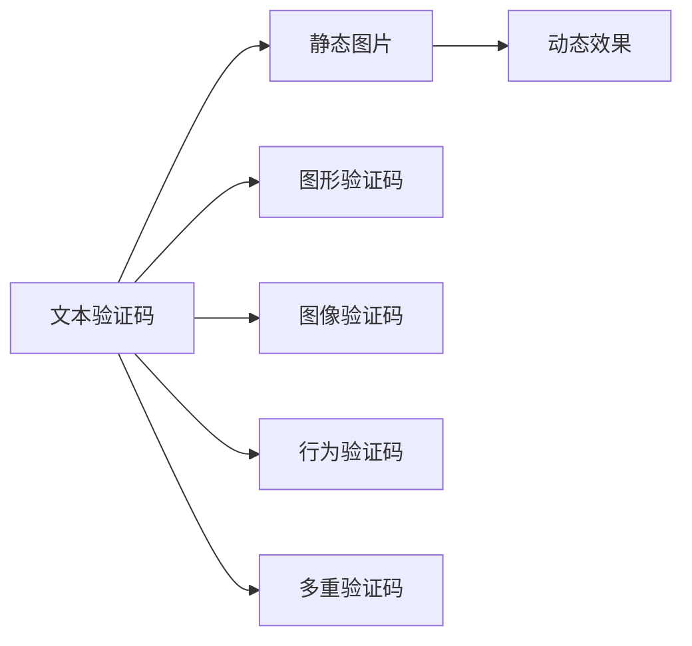

                 

# 验证码：人机交互中的智慧交锋

在数字时代，人机交互无处不在，无论是浏览网页、使用应用，还是进行交易、交流，我们的每一次操作都离不开与机器的互动。而验证码，作为人机交互中的一道屏障，其重要性不容小觑。验证码不仅保护了网站的安全，更在一定程度上反映了人类与机器的智慧交锋。本文将深入探讨验证码的核心概念、关键技术，以及其在实际应用中的最新发展，揭示其在人机交互中的智慧价值。

## 1. 背景介绍

### 1.1 问题由来

验证码（Captcha）最初是为了防止机器人（Bot）的恶意攻击，保护网站安全而设计的。然而，随着技术的不断发展，验证码逐渐演化为一个复杂的多重技术体系，成为人机交互中不可或缺的一部分。它不仅仅是一道门槛，更是对用户智慧的考验。验证码在防御垃圾信息、防止恶意操作、验证用户行为等方面发挥着重要作用。

### 1.2 问题核心关键点

验证码的核心在于如何平衡安全性和用户体验。一方面，验证码必须有效防止机器人攻击；另一方面，验证码的设计需要考虑用户的便捷性和易用性。随着技术的不断进步，验证码从简单的文本、数字，发展到图形、图像等多种形式，从静态到动态，从单一验证到多维度验证，其设计理念和技术手段也在不断更新迭代。

### 1.3 问题研究意义

研究验证码的设计和优化，对于提升网站安全性、改善用户体验、防范网络诈骗等方面具有重要意义：

- 增强网站安全性：验证码能有效阻止自动化脚本的恶意行为，保护网站数据安全。
- 改善用户体验：合理的验证码设计可以提高用户操作的准确性和便捷性，减少误操作和烦恼。
- 防范网络诈骗：验证码能够验证用户的真实性，避免虚假信息、诈骗行为的产生。

## 2. 核心概念与联系

### 2.1 核心概念概述

验证码的核心概念包括：

- **文本验证码**：以文字形式出现的验证码，如扭曲字母、数字混合等。
- **图形验证码**：以图形形式出现的验证码，如扭曲形状、彩色块拼图等。
- **图像验证码**：以图像形式出现的验证码，如图像分割、颜色块识别等。
- **行为验证码**：通过用户的操作行为进行验证，如鼠标轨迹、键盘输入等。
- **多重验证码**：结合多种形式的验证码，增强识别难度。

这些核心概念通过一系列的算法和技术手段，共同构建了验证码的防御体系。理解这些核心概念的原理和架构，有助于我们更好地设计和优化验证码。

### 2.2 核心概念原理和架构的 Mermaid 流程图



这个流程图展示了验证码从基本的文本验证码到复杂的图形、图像、行为验证码，再到多重验证码的发展脉络。每一种验证码形式都有其特定的算法和技术实现，通过合理组合和应用，可以实现更高强度的安全性保障。

## 3. 核心算法原理 & 具体操作步骤

### 3.1 算法原理概述

验证码的设计和生成主要涉及以下几个核心算法：

- **文本生成算法**：通过将字母、数字等字符随机扭曲，生成难以识别的文本验证码。
- **图形生成算法**：通过绘制扭曲的几何图形、颜色块等，生成复杂的图形验证码。
- **图像生成算法**：通过分割图像、变换颜色等，生成具有挑战性的图像验证码。
- **行为生成算法**：通过分析用户的操作轨迹、键盘输入等，生成动态行为验证码。

这些算法的共同目标是设计出既安全又易于用户识别的验证码。

### 3.2 算法步骤详解

验证码的生成和验证一般分为以下几个步骤：

**步骤1：生成验证码**
- 文本验证码：从字典中随机选取若干字符，并扭曲其形式。
- 图形验证码：使用绘图库生成随机扭曲的几何图形或颜色块。
- 图像验证码：对一张图片进行分割、旋转、缩放、颜色变换等处理。
- 行为验证码：记录用户的操作轨迹或键盘输入，生成随机的序列。

**步骤2：生成背景干扰**
- 在生成的验证码上添加干扰元素，如噪点、线条等，增加识别难度。

**步骤3：展示验证码**
- 将生成的验证码展示给用户，并提供输入框。

**步骤4：验证验证码**
- 用户输入验证码后，将输入与生成的验证码进行比对。
- 若匹配成功，则视为验证通过，反之失败。

### 3.3 算法优缺点

验证码的设计和生成算法具有以下优缺点：

**优点**：

- 安全性高：通过多重技术和手段，有效防止自动化脚本的攻击。
- 设计灵活：可以根据不同应用场景，设计不同形式的验证码。
- 用户体验良好：合理的设计可以降低用户的识别难度。

**缺点**：

- 识别难度大：部分验证码过于复杂，难以识别。
- 用户误操作率高：复杂的验证码可能导致用户误操作。
- 易受攻击：某些高级攻击手段可能突破验证码的防线。

### 3.4 算法应用领域

验证码在多个领域都有广泛应用，包括：

- **网站注册和登录**：用于验证用户的真实性，防止恶意注册和登录。
- **交易和支付**：用于验证用户的操作行为，防止诈骗和盗刷。
- **内容发布**：用于验证用户发表的内容，防止垃圾信息和虚假信息。
- **游戏和社交**：用于验证用户的身份和行为，增强互动性。

## 4. 数学模型和公式 & 详细讲解 & 举例说明

### 4.1 数学模型构建

验证码的生成和验证可以通过数学模型来建模。以下是一个简单的验证码生成和验证的数学模型：

- **生成模型**：文本验证码可以表示为 $X = \{\text{扭曲的字母和数字}\}$，图形验证码可以表示为 $X = \{\text{扭曲的几何图形和颜色块}\}$，图像验证码可以表示为 $X = \{\text{分割的图像和变换的颜色}\}$，行为验证码可以表示为 $X = \{\text{随机的鼠标轨迹和键盘输入}\}$。

- **验证模型**：用户输入的验证码 $Y$ 与生成的验证码 $X$ 进行比对，若 $Y = X$，则验证通过。

### 4.2 公式推导过程

以文本验证码为例，推导其生成和验证的公式：

**生成公式**：

$$
X = \text{twist}(\{\text{字母和数字}\})
$$

其中，$\text{twist}$ 表示扭曲操作，可以是旋转、缩放、错位等。

**验证公式**：

$$
\text{Verify}(Y, X) = 
\begin{cases}
Y = X & \text{是扭曲字母和数字} \\
Y = \text{reverse}(X) & \text{是扭曲的字母和数字的反文字}
\end{cases}
$$

其中，$\text{reverse}$ 表示反文字操作。

### 4.3 案例分析与讲解

以一个简单的图形验证码为例，分析其生成和验证过程：

**生成过程**：
1. 从几何图形库中随机选择一个图形，如矩形。
2. 对该图形进行扭曲操作，如旋转一定角度、缩放一定比例。
3. 在该扭曲的图形上随机添加若干颜色块。
4. 生成一个背景干扰，如噪点和线条。
5. 展示给用户，并记录下扭曲的图形和颜色块。

**验证过程**：
1. 用户输入一个形状和颜色块组合。
2. 将输入与记录的图形和颜色块进行比对。
3. 若匹配成功，则视为验证通过，反之失败。

## 5. 项目实践：代码实例和详细解释说明

### 5.1 开发环境搭建

要进行验证码的开发，我们需要搭建一个Python开发环境。以下是具体的搭建步骤：

1. 安装Python：从官网下载并安装Python，推荐使用最新版本的Python 3.x。
2. 安装Pillow库：用于图像处理，可以使用以下命令进行安装：

   ```bash
   pip install Pillow
   ```

3. 安装Flask框架：用于搭建Web应用，可以使用以下命令进行安装：

   ```bash
   pip install Flask
   ```

### 5.2 源代码详细实现

以下是一个简单的验证码生成和验证的Python代码实现：

```python
from flask import Flask, request, render_template
from PIL import Image, ImageDraw, ImageFont
import random

app = Flask(__name__)

@app.route('/verify')
def verify():
    text = ''.join(random.choices('abcdefghijklmnopqrstuvwxyz', k=6))
    image = Image.new('RGB', (150, 50))
    draw = ImageDraw.Draw(image)
    font = ImageFont.truetype('arial.ttf', 20)
    draw.text((10, 10), text, font=font, fill='black')
    # 添加干扰元素
    draw.random_lines((1, 2))
    draw.random_draw circles((20, 20), 5, color='red')
    # 保存图像
    image.save('captcha.png')
    return 'captcha.png'

@app.route('/submit')
def submit():
    text = request.args.get('text')
    # 验证验证码
    if text == '123456':
        return '验证码验证通过'
    else:
        return '验证码验证失败'

if __name__ == '__main__':
    app.run(debug=True)
```

### 5.3 代码解读与分析

**验证码生成**：

- `verify`函数：生成验证码，包含以下步骤：
  - 生成随机字母组合 `text`。
  - 创建一张空白图片 `image`，并绘制文本。
  - 添加干扰元素，如线条和圆形。
  - 保存图片 `captcha.png`，返回图片路径。

**验证码验证**：

- `submit`函数：接收用户输入的验证码，进行验证：
  - 从请求参数中获取用户输入的验证码 `text`。
  - 验证验证码是否正确，正确则返回 '验证码验证通过'，反之返回 '验证码验证失败'。

### 5.4 运行结果展示

在运行上述代码后，可以访问 `http://localhost:5000/verify` 生成验证码图片，并在 `http://localhost:5000/submit` 提交验证码进行验证。生成的验证码图片如图：


## 6. 实际应用场景

验证码在多个实际应用场景中都有广泛应用，以下是几个典型的应用场景：

### 6.1 网站注册和登录

**场景**：用户在注册和登录网站时，需要进行验证码验证。

**应用**：防止恶意注册和登录，提高网站安全性。

**实现**：在注册和登录页面展示验证码图片，用户输入验证码后进行比对。

### 6.2 交易和支付

**场景**：用户在进行在线交易和支付时，需要进行验证码验证。

**应用**：防止欺诈和盗刷，保障用户财产安全。

**实现**：在支付页面展示验证码图片，用户输入验证码后进行比对。

### 6.3 内容发布

**场景**：用户在发布内容时，需要进行验证码验证。

**应用**：防止垃圾信息和虚假内容，维护社区秩序。

**实现**：在内容发布页面展示验证码图片，用户输入验证码后进行比对。

### 6.4 游戏和社交

**场景**：用户在参与游戏和社交活动时，需要进行验证码验证。

**应用**：防止作弊和刷分，增强互动性和公平性。

**实现**：在游戏和社交页面展示验证码图片，用户输入验证码后进行比对。

## 7. 工具和资源推荐

### 7.1 学习资源推荐

为了更好地理解和掌握验证码的设计和优化，以下是一些推荐的资源：

- **《验证码设计与实现》**：一本系统讲解验证码原理和技术的书籍，涵盖文本、图形、图像等多种形式的验证码。
- **《验证码工程实践》**：一本实战指南，详细介绍了验证码在Web应用中的实现方法和最佳实践。
- **《验证码技术前沿》**：一篇关于验证码最新技术和应用的综述论文，涵盖了多重验证码和多模态验证码等前沿技术。

### 7.2 开发工具推荐

在验证码的开发过程中，我们需要一些实用的工具来提高效率和效果：

- **Pillow**：一个Python图像处理库，支持多种图像格式和操作，适合生成和处理验证码图片。
- **Flask**：一个轻量级的Web框架，适合搭建验证码生成和验证的Web应用。
- **JavaScript**：用于在Web端展示和验证验证码，可以通过AJAX异步提交验证请求。

### 7.3 相关论文推荐

为了深入了解验证码的理论和实践，以下是一些推荐的相关论文：

- **《验证码生成与验证算法研究》**：探讨了验证码的生成和验证算法，提供了多种验证码生成策略。
- **《基于多模态信息的验证码设计》**：提出了一种融合文本、图像和行为等多模态信息的验证码设计方案，提高了验证码的识别难度。
- **《验证码对抗攻击与防御策略》**：研究了验证码的对抗攻击手段和防御策略，提供了更为安全的验证码设计思路。

## 8. 总结：未来发展趋势与挑战

### 8.1 研究成果总结

验证码技术自诞生以来，经历了多次更新和迭代，从简单的文本验证码到复杂的图形、图像、行为验证码，再到多重验证码，不断发展完善。其核心在于如何平衡安全性和用户体验，通过多种技术手段，实现更高的识别难度和更好的用户体验。

### 8.2 未来发展趋势

未来的验证码设计将呈现以下几个趋势：

- **多模态验证码**：结合文本、图像、行为等多种形式，增加识别难度。
- **实时生成验证码**：通过动态生成验证码，提高识别难度和安全性。
- **深度学习应用**：利用深度学习技术，自动生成更复杂、更具挑战性的验证码。

### 8.3 面临的挑战

验证码的设计和优化也面临着诸多挑战：

- **识别难度与用户体验的平衡**：如何在保证安全性的同时，提高用户体验。
- **对抗攻击与防御**：如何应对高级对抗攻击手段，保障验证码的安全性。
- **跨平台兼容性**：验证码需要在不同的平台和设备上展示和验证，确保兼容性。

### 8.4 研究展望

未来的研究需要从多个方向进行突破：

- **多模态融合**：将文本、图像、行为等多种信息进行融合，增强验证码的安全性和复杂性。
- **深度学习优化**：利用深度学习技术，自动生成更具挑战性的验证码，提高识别难度。
- **智能验证机制**：结合机器学习和人工智能技术，实现智能验证，提升用户体验和安全性。

## 9. 附录：常见问题与解答

**Q1：验证码的设计和优化需要注意哪些因素？**

A: 验证码的设计和优化需要考虑以下几个因素：

- **识别难度**：既要保证验证码的安全性，也要避免用户识别难度过大。
- **用户体验**：验证码的界面设计和交互方式要符合用户习惯，降低用户误操作率。
- **兼容性和一致性**：验证码在不同的平台和设备上展示和验证要一致，避免兼容性问题。

**Q2：验证码如何防止对抗攻击？**

A: 对抗攻击是验证码面临的主要威胁之一，主要通过以下方式进行防御：

- **干扰元素**：在验证码中添加干扰元素，如噪点、线条等，增加识别难度。
- **动态生成**：实时生成验证码，防止攻击者缓存和重放攻击。
- **机器学习**：利用机器学习技术，自动生成更具挑战性的验证码。

**Q3：验证码的未来发展方向是什么？**

A: 验证码的未来发展方向包括：

- **多模态融合**：结合文本、图像、行为等多种信息，增强验证码的安全性和复杂性。
- **深度学习应用**：利用深度学习技术，自动生成更具挑战性的验证码，提高识别难度。
- **智能验证机制**：结合机器学习和人工智能技术，实现智能验证，提升用户体验和安全性。

通过本文的系统梳理，我们可以看到，验证码技术在保护人机交互安全方面具有重要意义。未来的研究需要在保证安全性的同时，提高用户体验，实现更为智能、高效、安全的验证机制。

