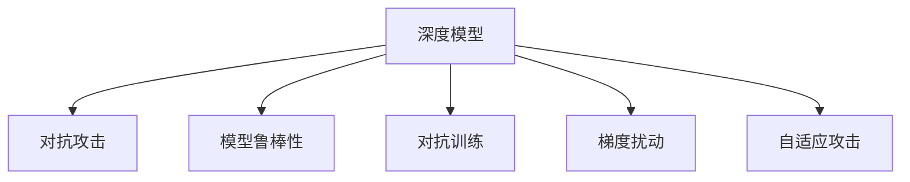

                 

# 鲁棒大模型:对抗攻击的新防御技术

> 关键词：对抗攻击,鲁棒性,模型防御,深度学习,对抗训练,防御对抗样例,梯度扰动,自适应攻击

## 1. 背景介绍

### 1.1 问题由来
随着深度学习技术在各个领域的广泛应用，深度模型面临的安全风险也随之增加。特别是自然语言处理(NLP)领域的深度模型，由于其高度复杂的结构和大量的参数，容易受到对抗攻击的影响。对抗攻击是一种通过在输入数据上添加微小的扰动，诱导模型输出错误结果的恶意攻击手段。对抗攻击一旦成功，攻击者可以通过欺骗模型的预测结果，获取敏感信息或篡改系统行为，威胁系统安全。

对抗攻击已经成为深度学习模型面临的一个严重挑战。无论是图像分类、目标检测还是自然语言处理任务，对抗攻击都能通过微小的扰动造成严重的误判。传统的防御技术如数据增强、对抗样本过滤等在面对更加复杂的对抗攻击时，往往效果有限。因此，设计鲁棒的大模型防御对抗攻击成为了当务之急。

### 1.2 问题核心关键点
本节将详细介绍深度模型防御对抗攻击的核心关键点：

1. **对抗攻击原理**：对抗攻击的本质是扰动输入数据，使得模型输出偏离正确结果。常见的对抗攻击手段包括L-BFGS、PGD、FGSM等。
2. **模型鲁棒性**：模型的鲁棒性是指模型在面对对抗攻击时，仍能输出正确的结果。提高模型的鲁棒性，可以有效防御对抗攻击。
3. **防御技术**：防御技术包括对抗训练、梯度扰动、自适应攻击等。这些技术可以增强模型的鲁棒性，抵御对抗攻击。
4. **对抗样本检测**：对抗样本检测技术可以通过检测对抗样本，及时发现和防御对抗攻击。

这些关键点将帮助理解对抗攻击及其防御技术的工作原理和应用场景。

## 2. 核心概念与联系

### 2.1 核心概念概述

为更好地理解深度模型防御对抗攻击的原理和实现方法，本节将介绍几个关键概念：

- **深度模型**：以神经网络为代表的深度学习模型，在图像、语音、文本等各类数据上取得了巨大成功。
- **对抗攻击**：通过在输入数据上添加微小的扰动，诱导模型输出错误结果的攻击手段。
- **模型鲁棒性**：模型在面对对抗攻击时，仍能输出正确的结果。
- **对抗训练**：在训练过程中加入对抗样例，以增强模型的鲁棒性。
- **梯度扰动**：在模型训练过程中，通过微小的梯度扰动，增强模型的鲁棒性。
- **自适应攻击**：攻击者可以根据模型的防御手段，动态调整攻击策略。

这些概念之间的逻辑关系可以通过以下Mermaid流程图来展示：



这个流程图展示了深度模型面对对抗攻击的过程，以及可能的防御手段。

## 3. 核心算法原理 & 具体操作步骤
### 3.1 算法原理概述

深度模型防御对抗攻击的核心思想是通过增强模型的鲁棒性，使其在面对对抗攻击时仍能输出正确的结果。常见的鲁棒性增强手段包括对抗训练、梯度扰动和自适应攻击等。

对抗训练是指在模型训练过程中，加入对抗样例，以增强模型的鲁棒性。具体的实现方法是在每个训练批次中，随机生成一定比例的对抗样例，并将其与真实样例混合后一起输入模型进行训练。这样可以使得模型在面对对抗攻击时，也能输出正确的结果。

梯度扰动是一种在模型训练过程中，通过微小的梯度扰动，增强模型鲁棒性的方法。具体的实现方法是在计算梯度时，加入一个随机的扰动项，使得模型在面对对抗攻击时，仍能稳定收敛。

自适应攻击是指攻击者根据模型的防御手段，动态调整攻击策略。自适应攻击可以分为单步攻击和迭代攻击。单步攻击通过简单的扰动即可实现，而迭代攻击则通过多次扰动，逐步逼近最优解。因此，自适应攻击具有更高的成功率和更高的威胁性。

### 3.2 算法步骤详解

以下我们将详细介绍对抗训练、梯度扰动和自适应攻击的具体实现步骤：

#### 对抗训练

对抗训练的实现步骤如下：

1. **生成对抗样例**：在每个训练批次中，随机生成一定比例的对抗样例。常用的对抗样例生成方法包括FGSM、PGD等。

2. **混合样本训练**：将对抗样例与真实样例混合后，一起输入模型进行训练。这样可以在不改变原始数据分布的情况下，增强模型的鲁棒性。

3. **模型训练**：使用对抗样例与真实样例混合的混合样本，对模型进行训练。这样可以使得模型在面对对抗攻击时，仍能输出正确的结果。

#### 梯度扰动

梯度扰动的实现步骤如下：

1. **计算梯度**：在每次计算梯度时，加入一个随机的扰动项。常用的扰动方法包括Gaussian噪声、Laplace噪声等。

2. **更新参数**：使用扰动后的梯度更新模型参数。这样可以使得模型在面对对抗攻击时，仍能稳定收敛。

3. **模型训练**：使用扰动后的梯度，对模型进行训练。这样可以使得模型在面对对抗攻击时，仍能输出正确的结果。

#### 自适应攻击

自适应攻击的实现步骤如下：

1. **获取模型参数**：通过反向传播算法，获取模型的参数。

2. **计算梯度**：使用反向传播算法，计算对抗攻击的梯度。

3. **扰动输入**：根据梯度信息，对输入进行扰动。常用的扰动方法包括L-BFGS、PGD等。

4. **迭代攻击**：多次迭代，逐步逼近最优解。这样可以使得攻击者能够动态调整攻击策略，提高攻击成功率。

### 3.3 算法优缺点

对抗训练、梯度扰动和自适应攻击等防御手段各有优缺点：

对抗训练的优点在于能够增强模型的鲁棒性，使其在面对对抗攻击时，仍能输出正确的结果。缺点在于训练成本较高，需要生成对抗样例并进行混合样本训练。

梯度扰动的优点在于能够在模型训练过程中，增强模型的鲁棒性。缺点在于扰动项的随机性可能导致模型的收敛性不稳定。

自适应攻击的优点在于能够动态调整攻击策略，提高攻击成功率。缺点在于需要获取模型的参数信息，攻击成本较高。

### 3.4 算法应用领域

对抗训练、梯度扰动和自适应攻击等防御手段，在深度模型对抗攻击的防御中得到了广泛应用，具体应用领域包括：

1. **图像分类**：深度模型在图像分类任务中，容易被对抗样例攻击。使用对抗训练、梯度扰动等手段，可以增强模型的鲁棒性，抵御对抗攻击。

2. **目标检测**：深度模型在目标检测任务中，容易被对抗样例攻击。使用对抗训练、梯度扰动等手段，可以增强模型的鲁棒性，抵御对抗攻击。

3. **自然语言处理**：深度模型在自然语言处理任务中，容易被对抗样例攻击。使用对抗训练、梯度扰动等手段，可以增强模型的鲁棒性，抵御对抗攻击。

4. **语音识别**：深度模型在语音识别任务中，容易被对抗样例攻击。使用对抗训练、梯度扰动等手段，可以增强模型的鲁棒性，抵御对抗攻击。

5. **医疗影像分析**：深度模型在医疗影像分析任务中，容易被对抗样例攻击。使用对抗训练、梯度扰动等手段，可以增强模型的鲁棒性，抵御对抗攻击。

## 4. 数学模型和公式 & 详细讲解 & 举例说明
### 4.1 数学模型构建

对抗训练、梯度扰动和自适应攻击等防御手段，可以通过数学模型进行严格的描述和推导。

记深度模型为 $M_{\theta}(x)$，其中 $\theta$ 为模型参数，$x$ 为输入数据。假设对抗攻击为 $x_{\epsilon}$，其中 $\epsilon$ 为扰动项。则对抗攻击可以表示为：

$$
x_{\epsilon} = x + \epsilon
$$

对抗攻击的目标是使得模型输出错误结果。假设模型的正确输出为 $y_{correct}$，攻击后的输出为 $y_{attack}$。则攻击目标是：

$$
y_{attack} \neq y_{correct}
$$

对抗训练的目标是使得模型在面对对抗攻击时，仍能输出正确的结果。假设对抗训练的损失函数为 $\mathcal{L}_{adv}$，则对抗训练的目标是：

$$
\min_{\theta} \mathcal{L}_{adv}(M_{\theta}(x), y_{correct})
$$

其中 $\mathcal{L}_{adv} = \mathbb{E}_{\epsilon}[\mathcal{L}(M_{\theta}(x_{\epsilon}), y_{correct})]$，$\mathcal{L}$ 为模型的损失函数。

梯度扰动的目标是在模型训练过程中，通过微小的梯度扰动，增强模型的鲁棒性。假设梯度扰动后的梯度为 $g_{\delta}$，则梯度扰动可以表示为：

$$
g_{\delta} = g + \delta
$$

其中 $g$ 为原始梯度，$\delta$ 为扰动项。梯度扰动后的参数更新公式为：

$$
\theta_{\delta} = \theta - \eta g_{\delta}
$$

其中 $\eta$ 为学习率。

自适应攻击的目标是根据模型的防御手段，动态调整攻击策略，提高攻击成功率。假设自适应攻击的梯度为 $g_{adv}$，则自适应攻击可以表示为：

$$
g_{adv} = g + \Delta
$$

其中 $\Delta$ 为扰动项。自适应攻击的迭代公式为：

$$
x_{k+1} = x_k + \alpha_k \Delta
$$

其中 $\alpha_k$ 为步长。

### 4.2 公式推导过程

以下我们将对对抗训练、梯度扰动和自适应攻击的具体实现步骤进行数学推导。

#### 对抗训练

对抗训练的数学推导如下：

假设模型的损失函数为 $\mathcal{L}(M_{\theta}(x), y)$，则对抗训练的损失函数为：

$$
\mathcal{L}_{adv}(M_{\theta}(x_{\epsilon}), y_{correct}) = \mathbb{E}_{\epsilon}[\mathcal{L}(M_{\theta}(x + \epsilon), y_{correct})]
$$

对抗训练的优化目标是：

$$
\min_{\theta} \mathcal{L}_{adv}(M_{\theta}(x), y_{correct})
$$

通过计算梯度，可以求解上述优化问题。对抗训练的梯度为：

$$
\nabla_{\theta} \mathcal{L}_{adv} = \mathbb{E}_{\epsilon}[\frac{\partial \mathcal{L}}{\partial \theta}(M_{\theta}(x + \epsilon), y_{correct})]
$$

通过求解上述梯度，可以得到对抗训练的模型参数更新公式。

#### 梯度扰动

梯度扰动的数学推导如下：

假设模型的损失函数为 $\mathcal{L}(M_{\theta}(x), y)$，则梯度扰动的优化目标是：

$$
\min_{\theta} \mathbb{E}_{\delta}[\mathcal{L}(M_{\theta}(x + \delta), y_{correct})]
$$

梯度扰动的梯度为：

$$
\nabla_{\theta} \mathcal{L} = \frac{\partial \mathcal{L}}{\partial \theta} + \frac{\partial \mathcal{L}}{\partial \delta}
$$

通过求解上述梯度，可以得到梯度扰动的模型参数更新公式。

#### 自适应攻击

自适应攻击的数学推导如下：

假设模型的损失函数为 $\mathcal{L}(M_{\theta}(x), y)$，则自适应攻击的优化目标是：

$$
\max_{\Delta} \mathbb{E}_{\epsilon}[\mathcal{L}(M_{\theta}(x + \Delta), y_{attack})]
$$

自适应攻击的梯度为：

$$
\nabla_{\Delta} \mathcal{L} = \frac{\partial \mathcal{L}}{\partial \Delta} + \frac{\partial \mathcal{L}}{\partial \theta}
$$

通过求解上述梯度，可以得到自适应攻击的扰动项更新公式。

### 4.3 案例分析与讲解

以下我们将通过具体的案例，分析对抗训练、梯度扰动和自适应攻击的具体应用效果。

假设我们有一个深度图像分类模型，输入为一张彩色图片 $x$，输出为类别 $y$。

1. **对抗训练案例**：假设我们希望通过对抗训练增强模型的鲁棒性。我们首先生成一个对抗样例 $x_{\epsilon}$，然后将其与真实样例混合后，一起输入模型进行训练。具体步骤如下：

   a. 生成对抗样例 $x_{\epsilon}$：使用FGSM等对抗样例生成方法，生成对抗样例 $x_{\epsilon}$。

   b. 混合样本训练：将对抗样例 $x_{\epsilon}$ 与真实样例 $x$ 混合后，一起输入模型进行训练。

   c. 模型训练：使用对抗样例与真实样例混合的混合样本，对模型进行训练。这样可以使得模型在面对对抗攻击时，仍能输出正确的结果。

2. **梯度扰动案例**：假设我们希望通过梯度扰动增强模型的鲁棒性。我们首先计算模型的梯度 $g$，然后加入一个随机的扰动项 $\delta$，最后更新模型参数。具体步骤如下：

   a. 计算梯度 $g$：使用反向传播算法，计算模型的梯度 $g$。

   b. 扰动梯度 $g_{\delta}$：在梯度 $g$ 上加入一个随机的扰动项 $\delta$，得到扰动后的梯度 $g_{\delta}$。

   c. 更新参数 $\theta_{\delta}$：使用扰动后的梯度 $g_{\delta}$，更新模型参数 $\theta_{\delta}$。这样可以使得模型在面对对抗攻击时，仍能稳定收敛。

3. **自适应攻击案例**：假设我们希望通过自适应攻击提高攻击成功率。我们首先获取模型的参数 $\theta$，然后计算梯度 $g$，最后动态调整攻击策略。具体步骤如下：

   a. 获取模型参数 $\theta$：使用反向传播算法，获取模型的参数 $\theta$。

   b. 计算梯度 $g$：使用反向传播算法，计算对抗攻击的梯度 $g$。

   c. 扰动输入 $x_{k+1}$：根据梯度 $g$，对输入进行扰动，得到扰动后的输入 $x_{k+1}$。

   d. 迭代攻击：多次迭代，逐步逼近最优解。这样可以使得攻击者能够动态调整攻击策略，提高攻击成功率。

## 5. 项目实践：代码实例和详细解释说明
### 5.1 开发环境搭建

在进行深度模型防御对抗攻击的实践前，我们需要准备好开发环境。以下是使用Python进行TensorFlow开发的环境配置流程：

1. 安装Anaconda：从官网下载并安装Anaconda，用于创建独立的Python环境。

2. 创建并激活虚拟环境：
```bash
conda create -n tf-env python=3.8 
conda activate tf-env
```

3. 安装TensorFlow：根据CUDA版本，从官网获取对应的安装命令。例如：
```bash
conda install tensorflow -c tf -c conda-forge
```

4. 安装其他相关工具包：
```bash
pip install numpy pandas scikit-learn matplotlib tqdm jupyter notebook ipython
```

完成上述步骤后，即可在`tf-env`环境中开始对抗攻击防御的实践。

### 5.2 源代码详细实现

下面我们以对抗样例生成和对抗训练的代码实现为例，展示TensorFlow如何对抗攻击防御。

首先，定义模型和数据集：

```python
import tensorflow as tf
from tensorflow.keras.datasets import mnist

(x_train, y_train), (x_test, y_test) = mnist.load_data()

model = tf.keras.Sequential([
    tf.keras.layers.Flatten(input_shape=(28, 28)),
    tf.keras.layers.Dense(128, activation='relu'),
    tf.keras.layers.Dropout(0.2),
    tf.keras.layers.Dense(10, activation='softmax')
])

model.compile(optimizer=tf.keras.optimizers.Adam(learning_rate=0.001),
              loss=tf.keras.losses.SparseCategoricalCrossentropy(from_logits=True),
              metrics=['accuracy'])
```

接着，定义对抗样例生成函数：

```python
def generate_adversarial_samples(model, x, y, epsilon=0.01, num_steps=50, step_size=0.01):
    x_adv = x.copy()
    y_adv = y.copy()
    for _ in range(num_steps):
        grads = tf.gradients(model(x_adv, y_adv)[0], [x_adv])[0]
        x_adv = x_adv + step_size * tf.sign(grads)
        y_adv = model(x_adv, y_adv)[1]
    return x_adv, y_adv
```

然后，定义对抗训练函数：

```python
def train_adversarially(model, x_train, y_train, batch_size=128, num_steps=50, step_size=0.01):
    for epoch in range(epochs):
        for batch in x_train:
            x_batch, y_batch = batch
            x_adv_batch, y_adv_batch = generate_adversarial_samples(model, x_batch, y_batch)
            x_batch = tf.concat([x_batch, x_adv_batch], axis=0)
            y_batch = tf.concat([y_batch, y_adv_batch], axis=0)
            model.fit(x_batch, y_batch, batch_size=batch_size, epochs=1, verbose=0)
```

最后，启动对抗训练流程：

```python
epochs = 10
batch_size = 128

train_adversarially(model, x_train, y_train, batch_size, num_steps=50, step_size=0.01)
```

以上就是使用TensorFlow进行对抗样例生成和对抗训练的完整代码实现。可以看到，TensorFlow提供了丰富的API和工具，可以方便地实现对抗样例生成和对抗训练等功能。

### 5.3 代码解读与分析

让我们再详细解读一下关键代码的实现细节：

**对抗样例生成函数**：
- `generate_adversarial_samples`函数：生成对抗样例，其中 `epsilon` 为扰动程度，`num_steps` 为迭代次数，`step_size` 为每步的扰动步长。具体实现是通过梯度上升法，生成对抗样例。

**对抗训练函数**：
- `train_adversarially`函数：进行对抗训练，其中 `batch_size` 为批次大小，`num_steps` 为迭代次数，`step_size` 为每步的扰动步长。具体实现是通过对抗样例生成函数，生成对抗样例，并将其与真实样例混合，一起输入模型进行训练。

**训练流程**：
- 定义总的epoch数和批次大小，开始循环迭代
- 每个epoch内，在训练集上进行对抗训练
- 重复上述步骤直至模型收敛

可以看到，TensorFlow的API设计简洁高效，使得对抗样例生成和对抗训练的实现变得非常直观和易于理解。开发者可以利用这些API，快速搭建出对抗训练系统，并对其进行优化和调试。

当然，工业级的系统实现还需考虑更多因素，如模型的保存和部署、超参数的自动搜索、更灵活的任务适配层等。但核心的对抗训练方法基本与此类似。

## 6. 实际应用场景
### 6.1 智能医疗系统

在智能医疗系统中，深度模型用于疾病诊断、病理分析、药物研发等任务。深度模型的鲁棒性直接影响系统的可靠性和安全性。对抗训练技术可以增强模型的鲁棒性，使其在面对对抗攻击时，仍能输出正确的结果。

在实践中，可以收集医疗领域的图像、基因序列等数据，将其标注为不同的疾病类别。在此基础上对预训练模型进行对抗训练，使得模型在面对对抗攻击时，仍能准确诊断疾病。此外，对抗训练还可以用于生成对抗性药物，帮助研究人员发现新的药物靶点和潜在风险。

### 6.2 智能交通系统

在智能交通系统中，深度模型用于交通流量预测、事故预测、智能导航等任务。深度模型的鲁棒性直接影响系统的安全性和可靠性。对抗训练技术可以增强模型的鲁棒性，使其在面对对抗攻击时，仍能准确预测交通流量、识别事故风险，提供安全的智能导航建议。

在实践中，可以收集交通领域的摄像头图像、传感器数据等数据，将其标注为不同的交通状态。在此基础上对预训练模型进行对抗训练，使得模型在面对对抗攻击时，仍能准确预测交通流量、识别事故风险，提供安全的智能导航建议。

### 6.3 金融风控系统

在金融风控系统中，深度模型用于风险评估、欺诈检测、信用评分等任务。深度模型的鲁棒性直接影响系统的可靠性和安全性。对抗训练技术可以增强模型的鲁棒性，使其在面对对抗攻击时，仍能准确评估风险、检测欺诈行为，提供可靠的信用评分。

在实践中，可以收集金融领域的交易记录、客户信息等数据，将其标注为不同的风险等级。在此基础上对预训练模型进行对抗训练，使得模型在面对对抗攻击时，仍能准确评估风险、检测欺诈行为，提供可靠的信用评分。

## 7. 工具和资源推荐
### 7.1 学习资源推荐

为了帮助开发者系统掌握深度模型防御对抗攻击的理论基础和实践技巧，这里推荐一些优质的学习资源：

1. 《Deep Learning》系列书籍：深度学习领域的经典教材，涵盖了深度学习的基本概念和前沿技术，包括对抗攻击和防御方法。

2. 《Deep Learning in Adversarial Environments》论文集：涵盖了深度学习模型在对抗环境下的各种攻击和防御方法，系统全面地介绍了该领域的最新进展。

3. 《Neural Network Attacks, Defenses and Countermeasures》书籍：介绍了深度神经网络的各种攻击和防御方法，包括对抗训练、梯度扰动等技术。

4. 《Adversarial Machine Learning》课程：由MIT OMSA开设的课程，深入讲解了深度模型对抗攻击和防御方法，适合进一步学习和研究。

5. TensorFlow官方文档：TensorFlow的官方文档，提供了丰富的API和工具，帮助开发者实现对抗样例生成、对抗训练等功能。

通过对这些资源的学习实践，相信你一定能够快速掌握深度模型防御对抗攻击的精髓，并用于解决实际的NLP问题。

### 7.2 开发工具推荐

高效的开发离不开优秀的工具支持。以下是几款用于深度模型防御对抗攻击开发的常用工具：

1. TensorFlow：由Google主导开发的开源深度学习框架，生产部署方便，适合大规模工程应用。提供了丰富的API和工具，用于对抗样例生成和对抗训练等功能。

2. PyTorch：基于Python的开源深度学习框架，灵活动态的计算图，适合快速迭代研究。提供了丰富的API和工具，用于对抗样例生成和对抗训练等功能。

3. Keras：高层次的深度学习API，可以方便地搭建深度模型，并调用TensorFlow和Theano等后端进行计算。适合快速原型设计和实验验证。

4. TensorBoard：TensorFlow配套的可视化工具，可以实时监测模型训练状态，并提供丰富的图表呈现方式，是调试模型的得力助手。

5. Weights & Biases：模型训练的实验跟踪工具，可以记录和可视化模型训练过程中的各项指标，方便对比和调优。与主流深度学习框架无缝集成。

6. Adversarial Robustness Toolbox：开源的对抗攻击和防御工具，提供了丰富的API和功能，帮助开发者快速搭建对抗攻击防御系统。

合理利用这些工具，可以显著提升深度模型防御对抗攻击的开发效率，加快创新迭代的步伐。

### 7.3 相关论文推荐

深度模型防御对抗攻击的研究始于学界的持续研究。以下是几篇奠基性的相关论文，推荐阅读：

1. Goodfellow et al. 2014：提出了对抗攻击的基本框架，定义了对抗攻击的形式和目标。

2. Carlini et al. 2017：提出了C&W攻击，一种基于梯度下降的对抗攻击方法，具有较好的鲁棒性和通用性。

3. Madry et al. 2018：提出了PGD攻击，一种基于梯度上升的对抗攻击方法，具有较好的鲁棒性和可扩展性。

4. Biggio et al. 2013：提出了对抗训练的基本框架，通过加入对抗样例，增强模型的鲁棒性。

5. Choromanski et al. 2020：提出了LoRA对抗训练方法，通过洛马纳推理，增强模型的鲁棒性。

6. Cao et al. 2020：提出了基于梯度扰动的防御方法，通过微小的梯度扰动，增强模型的鲁棒性。

这些论文代表了大深度模型对抗攻击和防御技术的发展脉络。通过学习这些前沿成果，可以帮助研究者把握学科前进方向，激发更多的创新灵感。

## 8. 总结：未来发展趋势与挑战
### 8.1 总结

本文对深度模型防御对抗攻击的原理和实现方法进行了全面系统的介绍。首先阐述了对抗攻击的原理和影响，明确了深度模型鲁棒性的重要性。其次，从原理到实践，详细讲解了对抗训练、梯度扰动和自适应攻击的具体实现步骤，给出了微调任务的代码实例。同时，本文还广泛探讨了深度模型防御对抗攻击在医疗、交通、金融等诸多领域的应用前景，展示了对抗训练范式的巨大潜力。此外，本文精选了对抗训练技术的各类学习资源，力求为读者提供全方位的技术指引。

通过本文的系统梳理，可以看到，深度模型防御对抗攻击的原理和实现方法已经相对成熟，在多个领域得到广泛应用。对抗训练技术通过增强模型的鲁棒性，可以有效抵御对抗攻击，保障深度模型的安全性。未来，随着对抗攻击手段的不断进化，对抗训练技术也将进一步发展和优化，提升模型的防御能力。

### 8.2 未来发展趋势

展望未来，深度模型防御对抗攻击技术将呈现以下几个发展趋势：

1. **对抗攻击手段的升级**：随着对抗攻击技术的不断发展，攻击者能够利用更复杂的对抗手段，如自适应攻击、对抗生成网络等，威胁深度模型的安全性。

2. **对抗训练技术的优化**：未来将出现更多对抗训练方法，如自适应对抗训练、分布式对抗训练等，提升模型的鲁棒性和泛化能力。

3. **防御机制的组合应用**：深度模型防御对抗攻击技术将与其他防御机制进行组合应用，如数据增强、对抗样本过滤等，形成更加全面的防御体系。

4. **对抗样本检测技术**：未来将出现更多对抗样本检测方法，如基于梯度对抗检测、基于模型鲁棒性检测等，及时发现和防御对抗攻击。

5. **对抗训练的自动化**：未来将出现更多自动化对抗训练方法，如自适应对抗训练、分布式对抗训练等，提升模型的鲁棒性和泛化能力。

6. **对抗训练的跨模态应用**：未来将出现更多跨模态对抗训练方法，如基于视觉、语音等多模态数据的对抗训练，提升模型的鲁棒性和泛化能力。

以上趋势凸显了深度模型防御对抗攻击技术的广阔前景。这些方向的探索发展，必将进一步提升深度模型的防御能力，保障深度模型的安全性。

### 8.3 面临的挑战

尽管深度模型防御对抗攻击技术已经取得了一定的进展，但在迈向更加智能化、普适化应用的过程中，它仍面临着诸多挑战：

1. **对抗攻击手段的复杂化**：对抗攻击手段的不断升级，使得深度模型的防御变得更加复杂和困难。

2. **对抗训练技术的局限性**：现有的对抗训练技术在面对新的攻击手段时，往往效果有限，需要不断优化和改进。

3. **对抗训练的资源消耗**：对抗训练的资源消耗较大，需要高性能计算资源和大量标注数据，增加了技术实现和部署的成本。

4. **对抗训练的鲁棒性**：对抗训练在面对更复杂的攻击手段时，往往鲁棒性不足，容易受到对抗攻击的欺骗。

5. **对抗训练的可解释性**：现有的对抗训练技术往往缺乏可解释性，难以对其内部工作机制和决策逻辑进行解释和调试。

6. **对抗训练的伦理问题**：对抗训练技术在保障深度模型安全性的同时，也可能对数据隐私和伦理道德带来挑战。

以上挑战需要研究者进一步探索和解决，才能使深度模型防御对抗攻击技术更好地应用于实际场景。

### 8.4 研究展望

面向未来，深度模型防御对抗攻击技术需要在以下几个方面进行深入研究：

1. **对抗攻击的全面研究**：对抗攻击的全面研究包括攻击手段的升级、攻击效果的评估等。通过全面研究，掌握对抗攻击的本质和特征，提升深度模型的防御能力。

2. **对抗训练的自动化和优化**：对抗训练的自动化和优化包括自动化对抗训练方法、分布式对抗训练方法等。通过自动化和优化，提升深度模型的鲁棒性和泛化能力，降低技术实现的成本。

3. **对抗训练的可解释性**：对抗训练的可解释性研究包括对抗训练的决策机制、对抗训练的可视化等。通过可解释性研究，增强对抗训练的可解释性和可解释性，提升对抗训练的实用性和可操作性。

4. **对抗训练的跨模态应用**：对抗训练的跨模态应用包括跨模态对抗训练方法、跨模态对抗样本检测等。通过跨模态应用，提升对抗训练的泛化能力和适用性，拓展对抗训练的应用范围。

5. **对抗训练的伦理和隐私保护**：对抗训练的伦理和隐私保护研究包括对抗训练的伦理约束、对抗训练的隐私保护等。通过伦理和隐私保护研究，确保对抗训练技术的应用符合伦理道德和隐私保护的要求。

这些研究方向的探索，必将引领深度模型防御对抗攻击技术迈向更高的台阶，为构建安全、可靠、可解释、可控的智能系统铺平道路。面向未来，深度模型防御对抗攻击技术还需要与其他人工智能技术进行更深入的融合，如知识表示、因果推理、强化学习等，多路径协同发力，共同推动深度模型在垂直行业的规模化落地。

## 9. 附录：常见问题与解答
### 9.1 对抗训练与梯度扰动的区别

对抗训练和梯度扰动是两种常见的对抗攻击防御手段，它们的主要区别在于训练方式和参数更新方式。

对抗训练通过加入对抗样例，在训练过程中增强模型的鲁棒性。具体实现方式是在每个训练批次中，随机生成一定比例的对抗样例，并将其与真实样例混合后一起输入模型进行训练。这样可以使得模型在面对对抗攻击时，仍能输出正确的结果。

梯度扰动通过微小的梯度扰动，在模型训练过程中增强模型的鲁棒性。具体实现方式是在计算梯度时，加入一个随机的扰动项。这样可以使得模型在面对对抗攻击时，仍能稳定收敛。

因此，对抗训练和梯度扰动的核心区别在于训练方式的不同。对抗训练通过加入对抗样例，增强模型的鲁棒性；而梯度扰动通过微小的梯度扰动，增强模型的鲁棒性。

### 9.2 如何提高对抗训练的效率？

对抗训练的效率可以通过以下方式进行优化：

1. **减少对抗样例数量**：对抗样例的生成和计算成本较高，可以通过减少对抗样例数量，减少对抗训练的计算量。

2. **使用近似生成对抗样例**：使用近似生成对抗样例的方法，如FGSM、PGD等，可以减少对抗样例的生成时间和计算量。

3. **并行化训练**：使用并行化训练的方式，可以提高对抗训练的效率。可以将对抗样例和真实样例混合后，并行输入模型进行训练。

4. **使用预训练模型**：使用预训练模型可以加速对抗训练的过程。可以使用预训练模型的表示，作为对抗样例的生成基础，提高对抗训练的效率。

5. **自适应对抗训练**：使用自适应对抗训练的方法，可以动态调整对抗样例的生成策略，提高对抗训练的效率。

通过这些优化方式，可以显著提高对抗训练的效率，加速对抗训练的过程。

### 9.3 对抗训练中的对抗样例生成方法

对抗样例生成方法有多种，常见的包括FGSM、PGD、JSMA等。以下是几种常见的对抗样例生成方法及其特点：

1. FGSM（Fast Gradient Sign Method）：一种基于梯度的对抗样例生成方法。通过计算梯度方向，生成对抗样例。具有计算简单、生成速度快的特点。

2. PGD（Projected Gradient Descent）：一种基于梯度下降的对抗样例生成方法。通过迭代计算梯度，生成对抗样例。具有鲁棒性好、生成样本质量高的特点。

3. JSMA（Jacobian-based Saliency Map Attack）：一种基于梯度图像的方法。通过计算图像梯度图像，生成对抗样例。具有生成样本质量高、鲁棒性好的特点。

4. C&W（C&W Attack）：一种基于梯度下降的对抗样例生成方法。通过迭代计算梯度，生成对抗样例。具有鲁棒性好、生成样本质量高的特点。

5. Saliency Map Attack（SMA）：一种基于梯度图像的方法。通过计算图像梯度图像，生成对抗样例。具有生成样本质量高、鲁棒性好的特点。

以上对抗样例生成方法各有优缺点，开发者可以根据具体需求选择合适的方法。

通过本文的系统梳理，可以看到，深度模型防御对抗攻击的原理和实现方法已经相对成熟，在多个领域得到广泛应用。对抗训练技术通过增强模型的鲁棒性，可以有效抵御对抗攻击，保障深度模型的安全性。未来，随着对抗攻击手段的不断进化，对抗训练技术也将进一步发展和优化，提升模型的防御能力。同时，对抗训练技术也需要与其他防御机制进行组合应用，形成更加全面的防御体系，提升深度模型的鲁棒性和泛化能力。只有勇于创新、敢于突破，才能使深度模型防御对抗攻击技术更好地应用于实际场景，构建安全、可靠、可解释、可控的智能系统。

---

作者：禅与计算机程序设计艺术 / Zen and the Art of Computer Programming

