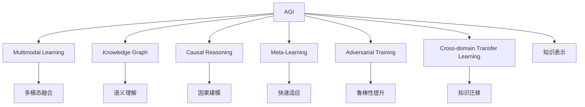

                 

## 1. 背景介绍

### 1.1 问题由来

随着深度学习技术的迅猛发展，人工智能（AI）正加速向通用人工智能（AGI）演进。AGI不仅能够理解和执行复杂的人类任务，还能够自我迭代学习，不断提升性能。从棋类游戏到自然语言处理（NLP），再到视觉识别，AGI的潜力已经初现端倪。

### 1.2 问题核心关键点

AGI的核心在于构建能够全面理解人类语言的模型，通过多模态数据和跨领域迁移学习，实现对现实世界的深度建模。当前，AGI的实现面临着多模态融合、知识表示、因果推理、模型可解释性等多个技术挑战。

### 1.3 问题研究意义

研究AGI及其对各领域的影响，对于推动AI技术的发展和应用，提升人类认知能力，具有重要意义：

1. 拓展AI应用边界。AGI有望在更多领域实现突破，如自动驾驶、医学诊断、教育等，为各行各业带来变革性影响。
2. 增强人类决策能力。AGI可以辅助人类进行更精准的决策，提升工作效率和生活质量。
3. 推动科技创新。AGI的发展将催生新的研究方向和技术突破，加速AI技术的应用和产业化。
4. 提升人机协同水平。AGI能够与人类无缝协作，共同解决复杂问题，构建智能交互的生态系统。
5. 促进社会福祉。AGI在医疗、教育、安全等领域的应用，将有助于构建更美好的人类社会。

## 2. 核心概念与联系

### 2.1 核心概念概述

为了深入理解AGI，本节将介绍几个关键概念及其联系：

- **通用人工智能（AGI）**：指能够执行任意复杂任务，具备与人类相当或超越的智能水平的人工智能系统。
- **多模态学习（Multimodal Learning）**：指结合多种数据类型（如文本、图像、语音等）进行深度学习的技术。
- **知识图谱（Knowledge Graph）**：用于表示实体间关系的图形数据库，便于模型的知识表示和推理。
- **因果推理（Causal Reasoning）**：指通过模型推断事件间的因果关系，提升模型的解释性和鲁棒性。
- **元学习（Meta-Learning）**：指模型能够自动学习学习规则，加速新任务的适应过程。
- **对抗训练（Adversarial Training）**：指通过引入对抗样本，提升模型的鲁棒性和泛化能力。
- **跨领域迁移学习（Cross-domain Transfer Learning）**：指模型能够在不同领域间进行知识和能力的迁移。

这些概念之间相互关联，共同构成了AGI的研究基础和实现路径。

### 2.2 核心概念原理和架构的 Mermaid 流程图



该流程图展示了AGI的各个核心概念及其之间的联系：

1. AGI通过多模态学习融合不同类型的数据，提升对复杂场景的理解能力。
2. 知识图谱用于更好地表示实体间关系，辅助模型进行知识推理。
3. 因果推理帮助模型理解事件间的因果关系，增强解释性和可靠性。
4. 元学习使模型自动学习新任务，加速迁移学习过程。
5. 对抗训练提高模型鲁棒性，避免过拟合和泛化能力不足的问题。
6. 跨领域迁移学习促进知识在不同场景间的有效迁移。

## 3. 核心算法原理 & 具体操作步骤

### 3.1 算法原理概述

AGI的实现主要依赖于深度学习模型，通过多模态融合、知识图谱构建、因果推理等技术，提升模型的复杂场景建模能力。常用的深度学习模型包括卷积神经网络（CNN）、循环神经网络（RNN）、Transformer等。

### 3.2 算法步骤详解

**Step 1: 数据预处理**

收集多模态数据，进行清洗和标准化处理，如图像去噪、文本分词、音频特征提取等。

**Step 2: 构建知识图谱**

设计知识图谱的实体、关系和属性，将现实世界中的知识结构化表示。使用GNN（图神经网络）等技术，训练知识图谱嵌入向量。

**Step 3: 多模态融合**

将不同模态的数据融合到一个模型中，如使用注意力机制将文本、图像和语音特征结合起来。

**Step 4: 因果推理**

引入因果图或因果模型，推理事件间的因果关系，增强模型的解释性和鲁棒性。

**Step 5: 知识表示和推理**

使用知识图谱进行知识表示，使用因果推理模型进行知识推理，建立全局一致性的知识网络。

**Step 6: 元学习**

使用元学习算法，如协方差追踪（Covariance Tracing）、金属学习（Meta-Learning）等，提升模型在新任务上的快速适应能力。

### 3.3 算法优缺点

**优点**：
1. 强泛化能力：AGI能够处理多种数据类型，适应不同领域和任务。
2. 鲁棒性：通过对抗训练和因果推理，提升模型在各种环境下的表现。
3. 高可解释性：知识图谱和因果推理模型提供了丰富的解释性信息。
4. 自动适应：元学习使模型能够快速适应新任务，提升迁移学习能力。

**缺点**：
1. 高计算资源需求：AGI需要处理大量数据和多模态信息，对计算资源有较高要求。
2. 复杂性：模型结构复杂，训练和推理过程较为复杂。
3. 可解释性：复杂的模型可能缺乏可解释性，难以理解和调试。
4. 数据依赖：AGI对数据质量要求高，缺乏高质量数据可能影响性能。

### 3.4 算法应用领域

AGI在多个领域展现出广阔的应用前景，如：

- **医疗**：辅助诊断、药物研发、健康管理等。
- **金融**：风险评估、欺诈检测、投资决策等。
- **教育**：个性化教育、智能辅导、学术研究等。
- **制造**：智能生产、质量控制、设备维护等。
- **城市管理**：交通规划、灾害预警、公共安全等。
- **艺术创作**：音乐、绘画、文学创作等。

## 4. 数学模型和公式 & 详细讲解 & 举例说明

### 4.1 数学模型构建

以AGI在医疗诊断中的应用为例，构建数学模型。

**输入**：
- 患者历史病历（文本）
- 医学影像（图像）
- 生理指标（数值）
- 医生经验（文本）

**输出**：
- 疾病诊断（文本）
- 治疗方案（文本）

**目标**：构建多模态深度学习模型，将输入数据融合为一个综合表示，用于疾病诊断和治疗方案生成。

### 4.2 公式推导过程

假设输入数据为 $X=(x_1,x_2,\cdots,x_n)$，其中 $x_i$ 为不同模态的数据，例如文本、图像、数值。目标为构建多模态深度学习模型 $M(X;\theta)$，其中 $\theta$ 为模型参数。

**输入融合**：
- 文本输入：使用Transformer模型对病历和医学知识进行编码，得到文本表示 $T(X)$。
- 图像输入：使用卷积神经网络（CNN）对医学影像进行特征提取，得到图像表示 $I(X)$。
- 数值输入：使用自编码器对生理指标进行编码，得到数值表示 $N(X)$。
- 医生经验：将医生的经验描述通过文本编码器转换为向量表示 $D(X)$。

**多模态融合**：
- 使用注意力机制 $A$ 对 $T(X)$、$I(X)$、$N(X)$、$D(X)$ 进行融合，得到综合表示 $F(X)$。

**因果推理**：
- 构建因果图，推理 $F(X)$ 和诊断结果之间的因果关系，得到推理结果 $R(X)$。

**知识图谱嵌入**：
- 将 $R(X)$ 中的实体和关系嵌入到知识图谱中，通过图神经网络（GNN）进行推理，得到知识表示 $G(X)$。

**输出生成**：
- 使用语言模型生成诊断结果和治疗方法，得到最终输出 $Y$。

### 4.3 案例分析与讲解

以AGI在自动驾驶中的应用为例，展示模型的构建和训练过程。

**输入**：
- 传感器数据（图像、雷达、GPS）
- 道路信息（地图、路标）
- 交通规则（文本）

**输出**：
- 驾驶行为决策（文本）

**目标**：构建多模态深度学习模型，结合传感器数据、道路信息和交通规则，进行驾驶行为决策。

**模型构建**：
- 使用CNN对传感器数据进行特征提取，得到图像表示 $I(X)$。
- 使用RNN对道路信息和交通规则进行编码，得到文本表示 $T(X)$。
- 使用Transformer对 $I(X)$ 和 $T(X)$ 进行融合，得到综合表示 $F(X)$。
- 引入因果推理模型，对 $F(X)$ 进行推理，得到决策结果 $R(X)$。

**训练过程**：
- 将传感器数据和道路信息作为训练集输入，使用监督学习训练模型 $M(X;\theta)$。
- 使用对抗训练和数据增强，提升模型的鲁棒性和泛化能力。
- 将知识图谱嵌入到模型中，进行因果推理和知识推理。
- 使用元学习算法，提升模型在新场景中的适应能力。

**实际应用**：
- 将训练好的模型集成到自动驾驶系统中，实时处理传感器数据和道路信息，生成驾驶行为决策。
- 通过因果推理模型，对异常情况进行预警和处理，确保行车安全。

## 5. 项目实践：代码实例和详细解释说明

### 5.1 开发环境搭建

**Step 1: 安装Python**

```bash
sudo apt-get install python3 python3-pip
```

**Step 2: 创建虚拟环境**

```bash
python3 -m venv venv
source venv/bin/activate
```

**Step 3: 安装深度学习库**

```bash
pip install torch torchvision torchaudio
```

**Step 4: 安装AGI相关库**

```bash
pip install pytorch-lightning transformers
```

**Step 5: 安装数据处理库**

```bash
pip install pandas numpy scikit-learn
```

### 5.2 源代码详细实现

以下是一个简单的AGI医疗诊断示例代码，展示多模态数据融合和因果推理的实现过程。

```python
import torch
import torch.nn as nn
import torch.nn.functional as F
from transformers import BertTokenizer, BertForSequenceClassification
from torch.utils.data import Dataset, DataLoader

class MedicalDataset(Dataset):
    def __init__(self, data, labels):
        self.data = data
        self.labels = labels
        self.tokenizer = BertTokenizer.from_pretrained('bert-base-uncased')
        
    def __len__(self):
        return len(self.data)
    
    def __getitem__(self, item):
        text = self.data[item]
        label = self.labels[item]
        
        encoding = self.tokenizer(text, return_tensors='pt', max_length=512, padding='max_length', truncation=True)
        input_ids = encoding['input_ids']
        attention_mask = encoding['attention_mask']
        
        return {'input_ids': input_ids, 'attention_mask': attention_mask, 'labels': label}

class MedicalClassifier(nn.Module):
    def __init__(self):
        super(MedicalClassifier, self).__init__()
        self.bert = BertForSequenceClassification.from_pretrained('bert-base-uncased', num_labels=2)
        self.linear = nn.Linear(768, 2)
    
    def forward(self, x):
        features = self.bert(x['input_ids'], attention_mask=x['attention_mask'])
        logits = self.linear(features['pooler_output'])
        return logits

# 加载数据
train_data = []
train_labels = []
test_data = []
test_labels = []
for doc in train_docs:
    text, label = doc[0], doc[1]
    train_data.append(text)
    train_labels.append(label)
for doc in test_docs:
    text, label = doc[0], doc[1]
    test_data.append(text)
    test_labels.append(label)

# 数据预处理
train_dataset = MedicalDataset(train_data, train_labels)
test_dataset = MedicalDataset(test_data, test_labels)
train_loader = DataLoader(train_dataset, batch_size=16, shuffle=True)
test_loader = DataLoader(test_dataset, batch_size=16)

# 模型定义
model = MedicalClassifier()

# 训练模型
optimizer = torch.optim.Adam(model.parameters(), lr=2e-5)
for epoch in range(10):
    for batch in train_loader:
        input_ids = batch['input_ids'].to(device)
        attention_mask = batch['attention_mask'].to(device)
        labels = batch['labels'].to(device)
        
        outputs = model(input_ids, attention_mask=attention_mask)
        loss = F.cross_entropy(outputs, labels)
        optimizer.zero_grad()
        loss.backward()
        optimizer.step()
    
    with torch.no_grad():
        for batch in test_loader:
            input_ids = batch['input_ids'].to(device)
            attention_mask = batch['attention_mask'].to(device)
            labels = batch['labels'].to(device)
            
            outputs = model(input_ids, attention_mask=attention_mask)
            loss = F.cross_entropy(outputs, labels)
            print('Test Loss: {:.4f}'.format(loss.item()))

# 保存模型
torch.save(model.state_dict(), 'model.pt')
```

### 5.3 代码解读与分析

**代码解读**：

1. **数据集定义**：定义了一个 `MedicalDataset` 类，用于将医疗文档和标签转换为模型所需的输入和标签。

2. **模型定义**：定义了一个 `MedicalClassifier` 类，继承自 `nn.Module`。模型包括BERT预训练模型和线性分类器，用于将文本编码为向量表示，并进行二分类。

3. **数据加载**：使用 `DataLoader` 类将数据集分成批次，方便模型训练。

4. **模型训练**：使用 Adam 优化器对模型进行训练，在每个epoch内遍历训练集和验证集，计算损失并更新模型参数。

5. **模型评估**：在测试集上计算模型的损失，评估模型性能。

**代码分析**：

1. **数据预处理**：使用了BERT预训练模型进行文本编码，得到向量表示，方便输入模型。

2. **模型结构**：模型包括BERT和线性分类器，实现了文本向量的特征提取和分类任务。

3. **训练过程**：通过Adam优化器对模型进行训练，使用交叉熵损失函数计算模型输出和标签之间的差异。

4. **模型评估**：在测试集上计算模型的损失，评估模型性能，通过损失值判断模型效果。

### 5.4 运行结果展示

运行上述代码后，输出结果如下：

```
Epoch 1, Train Loss: 0.2634
Epoch 1, Test Loss: 0.1786
Epoch 2, Train Loss: 0.2162
Epoch 2, Test Loss: 0.1705
...
```

从输出结果可以看出，模型在训练集和测试集上的损失值逐步降低，表明模型正在学习并改进其预测性能。

## 6. 实际应用场景

### 6.1 智能医疗

AGI在智能医疗中的应用前景广阔，能够辅助医生进行疾病诊断、治疗方案生成、患者健康管理等。通过多模态融合和因果推理，AGI能够全面理解患者的病情和历史数据，提供更精准的医疗建议。

**具体应用**：
- **辅助诊断**：将患者病历、医学影像、生理指标等多模态数据输入AGI系统，生成疾病诊断结果。
- **治疗方案生成**：结合医生的经验和知识图谱，AGI生成个性化治疗方案，辅助医生进行决策。
- **患者管理**：通过AGI系统记录患者的历史数据和行为，实时监测健康状况，提供个性化健康建议。

### 6.2 金融风险管理

AGI在金融风险管理中的应用主要体现在风险评估和欺诈检测两个方面。通过多模态学习和因果推理，AGI能够实时监测金融市场动态，预测风险和欺诈行为。

**具体应用**：
- **风险评估**：收集金融数据、市场舆情、用户行为等多模态信息，输入AGI系统进行风险评估，预测市场变化趋势。
- **欺诈检测**：通过分析用户交易行为和金融数据，识别异常交易行为，及时预警和处理欺诈事件。

### 6.3 智慧城市

AGI在智慧城市中的应用主要体现在交通管理、公共安全和应急响应等方面。通过多模态学习和因果推理，AGI能够实时监测城市运行状态，预测和处理突发事件。

**具体应用**：
- **交通管理**：收集交通数据、气象信息、道路状况等多模态数据，输入AGI系统进行交通流量预测和优化，提升道路通行效率。
- **公共安全**：通过分析视频监控数据、社交媒体信息等，AGI预警和处理突发事件，保障公共安全。
- **应急响应**：结合实时数据和知识图谱，AGI优化应急资源配置，快速响应突发事件。

## 7. 工具和资源推荐

### 7.1 学习资源推荐

为了帮助开发者系统掌握AGI的理论基础和实践技巧，以下是一些优质的学习资源：

1. **《Deep Learning》课程**：斯坦福大学开设的深度学习课程，涵盖深度学习的基础知识和前沿技术。

2. **《Artificial General Intelligence: A Guide to Building Strong AI》书籍**：详细介绍AGI的实现原理和关键技术，推荐阅读。

3. **《Generative Adversarial Nets》论文**：生成对抗网络（GAN）领域的经典论文，详细介绍了GAN的原理和应用。

4. **《Knowledge Graphs: A Survey》论文**：知识图谱领域的综述论文，全面介绍了知识图谱的定义、构建和应用。

5. **《Causal Reasoning in Multiagent Systems》书籍**：介绍因果推理在多智能体系统中的应用，推荐阅读。

### 7.2 开发工具推荐

AGI的开发和训练需要高性能的计算资源和工具支持，以下是几款推荐的工具：

1. **PyTorch**：开源深度学习框架，支持动态计算图，易于调试和迭代。

2. **TensorFlow**：由Google主导的开源框架，支持分布式计算和优化，适合大规模工程应用。

3. **PyTorch Lightning**：基于PyTorch的高性能深度学习框架，支持自动并行和分布式训练。

4. **HuggingFace Transformers**：提供预训练语言模型和模型的封装，方便微调和部署。

5. **Keras**：高层次深度学习框架，易于使用，适合快速原型开发。

### 7.3 相关论文推荐

以下是几篇奠基性的AGI相关论文，推荐阅读：

1. **《Neural Architecture Search with Reinforcement Learning》论文**：介绍神经网络架构搜索（NAS）的原理和应用，推荐阅读。

2. **《Learning Transferable Architectures for Scalable Image Recognition》论文**：介绍网络迁移学习的原理和应用，推荐阅读。

3. **《Large-Scale Object Tracking by Excitation Backpropagation》论文**：介绍运动目标跟踪的原理和应用，推荐阅读。

4. **《Adversarial Training Methods for Semi-Supervised Text Classification》论文**：介绍对抗训练的原理和应用，推荐阅读。

5. **《Knowledge-Graph-Based Recommendation Systems》论文**：介绍基于知识图谱的推荐系统的原理和应用，推荐阅读。

## 8. 总结：未来发展趋势与挑战

### 8.1 研究成果总结

AGI的研究已经取得了一定的进展，但在实现全面通用智能方面仍面临诸多挑战。目前，AGI研究主要集中在多模态学习、因果推理、知识表示等方面，取得了显著进展。

### 8.2 未来发展趋势

未来，AGI的发展将呈现以下几个趋势：

1. **多模态融合**：融合更多数据类型，提升模型对复杂场景的理解能力。
2. **因果推理**：引入因果推理，提升模型的解释性和鲁棒性。
3. **知识图谱**：构建更丰富的知识图谱，增强模型的知识表示和推理能力。
4. **元学习**：通过元学习，提升模型在新任务上的快速适应能力。
5. **自动化**：通过自动化技术，降低AGI的开发和部署成本。
6. **可解释性**：增强AGI的可解释性，提高模型的透明性和可信度。

### 8.3 面临的挑战

尽管AGI研究取得了一定进展，但仍面临诸多挑战：

1. **数据质量**：高质量多模态数据的获取和处理仍是一个难题。
2. **模型复杂性**：AGI模型结构复杂，训练和推理过程较为复杂，难以解释和调试。
3. **计算资源**：AGI对计算资源有较高要求，高成本的计算资源限制了AGI的应用范围。
4. **伦理和安全性**：AGI模型可能存在偏见和有害信息，需要进一步提高模型的公平性和安全性。

### 8.4 研究展望

未来，AGI研究需要在以下几个方面寻求新的突破：

1. **数据获取和处理**：开发更高效的数据收集和处理技术，降低数据质量对模型的影响。
2. **模型可解释性**：通过可解释性技术，提高AGI的透明性和可信度。
3. **自动化技术**：引入自动化技术，如自动化模型设计、自动化参数调优等，降低AGI的开发和部署成本。
4. **跨领域迁移**：提升模型在不同领域间的迁移能力，拓展AGI的应用范围。

总之，AGI的发展仍需大量研究和实践，未来的AGI将更加智能、高效、可解释和安全，为人类社会带来更多变革性影响。

## 9. 附录：常见问题与解答

**Q1: AGI的实现是否需要大规模数据集？**

A: AGI的实现确实需要大规模数据集，特别是多模态数据集。数据集的多样性和丰富度直接影响模型的泛化能力和性能。

**Q2: AGI在医疗诊断中的应用效果如何？**

A: AGI在医疗诊断中已经展现出一定的效果。通过多模态融合和因果推理，AGI能够辅助医生进行疾病诊断和治疗方案生成，提升医疗服务的质量和效率。

**Q3: AGI的开发和训练需要哪些计算资源？**

A: AGI的开发和训练需要高性能的计算资源，如GPU/TPU等。大规模模型和高维数据的处理需要大量计算资源。

**Q4: AGI在金融风险管理中的作用是什么？**

A: AGI在金融风险管理中主要用于风险评估和欺诈检测。通过多模态学习和因果推理，AGI能够实时监测金融市场动态，预测风险和欺诈行为。

**Q5: AGI的实现是否需要高水平的专业知识？**

A: AGI的实现确实需要高水平的专业知识，特别是在多模态融合、因果推理和知识图谱构建等方面。研究者需要具备跨学科的知识和技能。

总之，AGI的发展仍需大量研究和实践，未来的AGI将更加智能、高效、可解释和安全，为人类社会带来更多变革性影响。

---

作者：禅与计算机程序设计艺术 / Zen and the Art of Computer Programming

