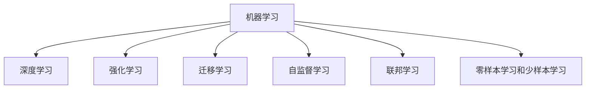

                 

# AI 2.0 时代的机器学习

## 1. 背景介绍

在 AI 2.0 时代，机器学习（ML）已经成为驱动科技进步和社会发展的核心引擎。随着算力的指数级提升和大数据技术的突破，机器学习正从传统的统计学习范式向深度学习、强化学习等新兴技术范式演进。本文将深入探讨 AI 2.0 时代的机器学习，分析其核心概念、关键技术，及其在实际应用中的最新进展和未来趋势。

## 2. 核心概念与联系

### 2.1 核心概念概述

为更好地理解 AI 2.0 时代的机器学习，本节将介绍几个密切相关的核心概念：

- **机器学习（Machine Learning, ML）**：通过数据驱动的算法，从数据中提取规律和模式，并应用于预测和决策的技术。
- **深度学习（Deep Learning, DL）**：一种特殊的机器学习技术，基于多层神经网络，能够自动从数据中提取多层抽象特征，广泛应用于图像识别、语音识别、自然语言处理等领域。
- **强化学习（Reinforcement Learning, RL）**：通过智能体（agent）在环境中与环境互动，通过奖励信号优化策略，从而实现决策和学习的过程。
- **迁移学习（Transfer Learning）**：利用预训练模型在不同任务间的知识迁移，减少新任务的训练时间，提高模型泛化能力。
- **自监督学习（Self-Supervised Learning）**：利用数据自身的特性进行学习，如掩码语言模型（Masked Language Model, MLM）、自回归模型（Autoregressive Model）等，无需大量标注数据。
- **联邦学习（Federated Learning）**：在分布式环境中，多个数据拥有者在不共享原始数据的前提下，协作训练模型，提升模型性能。
- **零样本学习和少样本学习（Zero-shot & Few-shot Learning）**：利用少量或零样本数据，让模型对未知任务进行推理和预测。

这些核心概念之间的逻辑关系可以通过以下 Mermaid 流程图来展示：



这个流程图展示了大规模机器学习的核心概念及其之间的关系：

1. 机器学习是大规模机器学习的起点。
2. 深度学习、强化学习、迁移学习等是其核心技术分支。
3. 自监督学习、联邦学习等新兴技术拓宽了机器学习的应用边界。
4. 零样本学习和少样本学习进一步提升了机器学习在实际应用中的灵活性。

## 3. 核心算法原理 & 具体操作步骤

### 3.1 算法原理概述

AI 2.0 时代的机器学习算法原理主要包括：

- **监督学习（Supervised Learning）**：通过有标签数据训练模型，使其能够从数据中学习到输入与输出之间的映射关系，应用于分类、回归等任务。
- **无监督学习（Unsupervised Learning）**：通过未标注数据训练模型，发现数据的内在结构和规律，应用于聚类、降维等任务。
- **半监督学习（Semi-Supervised Learning）**：利用少量标注数据和大量未标注数据，提升模型性能，应用于图像标注、语音识别等任务。
- **强化学习**：通过智能体与环境的互动，学习到最优策略，应用于游戏、机器人控制等任务。
- **自监督学习**：利用数据自身的特性进行学习，如掩码语言模型（MLM）、自回归模型（AR）等，无需大量标注数据。
- **迁移学习**：利用预训练模型在不同任务间的知识迁移，减少新任务的训练时间，提高模型泛化能力。

### 3.2 算法步骤详解

AI 2.0 时代的机器学习算法步骤主要包括：

1. **数据预处理**：收集、清洗、标注数据，准备模型训练。
2. **模型选择与设计**：根据任务需求选择合适的算法和模型结构。
3. **模型训练**：在训练集上训练模型，调整参数，优化性能。
4. **模型评估与验证**：在验证集上评估模型性能，进行超参数调优。
5. **模型部署与应用**：将训练好的模型部署到实际应用场景中，进行预测和决策。
6. **模型监控与更新**：监控模型在实际应用中的表现，定期更新模型，保持模型性能。

### 3.3 算法优缺点

AI 2.0 时代的机器学习算法具有以下优点：

1. **广泛应用**：深度学习、强化学习等技术广泛应用于图像识别、语音识别、自然语言处理等领域，取得了显著的成果。
2. **高效性能**：神经网络等技术在处理大规模数据和高复杂任务方面表现出卓越的性能。
3. **数据驱动**：通过大数据的驱动，模型能够自动学习到复杂的规律和模式，提升预测和决策的准确性。
4. **跨领域应用**：迁移学习等技术使得模型能够跨领域应用，提升了模型泛化能力。

同时，这些算法也存在以下局限性：

1. **数据依赖**：深度学习等算法对标注数据依赖较大，标注成本较高。
2. **模型复杂**：深度学习等算法模型较为复杂，训练和部署成本较高。
3. **可解释性不足**：黑盒模型难以解释其内部决策过程，缺乏可解释性。
4. **对抗攻击脆弱**：模型容易受到对抗样本的攻击，影响模型鲁棒性。
5. **资源消耗大**：深度学习等算法需要大量的计算资源，尤其是GPU等高性能设备。

## 4. 数学模型和公式 & 详细讲解 & 举例说明

### 4.1 数学模型构建

本节将使用数学语言对 AI 2.0 时代的机器学习算法进行更加严格的刻画。

记数据集为 $D=\{(x_i, y_i)\}_{i=1}^N$，其中 $x_i$ 为输入，$y_i$ 为输出。假设模型为 $f: \mathcal{X} \rightarrow \mathcal{Y}$，其中 $\mathcal{X}$ 为输入空间，$\mathcal{Y}$ 为输出空间。模型的损失函数为 $L(f, D) = \frac{1}{N} \sum_{i=1}^N \ell(f(x_i), y_i)$，其中 $\ell$ 为损失函数，如均方误差、交叉熵等。

### 4.2 公式推导过程

以监督学习为例，模型的优化目标是最小化经验风险：

$$
\min_{\theta} L(f_\theta, D)
$$

其中 $f_\theta(x) = f(x; \theta)$ 为模型参数 $\theta$ 的函数。模型的梯度为：

$$
\nabla_\theta L(f_\theta, D) = \frac{1}{N} \sum_{i=1}^N \nabla_\theta \ell(f(x_i), y_i)
$$

在实际应用中，通常使用随机梯度下降（SGD）等优化算法来近似求解上述最优化问题。

### 4.3 案例分析与讲解

以图像分类任务为例，假设输入为图像像素值，输出为类别标签。可以使用卷积神经网络（CNN）作为模型，使用交叉熵损失函数。

假设模型参数为 $\theta$，模型在输入 $x_i$ 上的输出为 $f_\theta(x_i)$，则交叉熵损失函数为：

$$
\ell(f_\theta(x_i), y_i) = -y_i \log f_\theta(x_i) - (1-y_i) \log (1-f_\theta(x_i))
$$

在训练过程中，使用随机梯度下降算法更新模型参数：

$$
\theta \leftarrow \theta - \eta \nabla_\theta L(f_\theta, D)
$$

其中 $\eta$ 为学习率。

## 5. 项目实践：代码实例和详细解释说明

### 5.1 开发环境搭建

在进行机器学习项目实践前，我们需要准备好开发环境。以下是使用Python进行TensorFlow开发的环境配置流程：

1. 安装Anaconda：从官网下载并安装Anaconda，用于创建独立的Python环境。

2. 创建并激活虚拟环境：
```bash
conda create -n tf-env python=3.8 
conda activate tf-env
```

3. 安装TensorFlow：根据CUDA版本，从官网获取对应的安装命令。例如：
```bash
conda install tensorflow -c tf -c conda-forge
```

4. 安装各类工具包：
```bash
pip install numpy pandas scikit-learn matplotlib tqdm jupyter notebook ipython
```

完成上述步骤后，即可在`tf-env`环境中开始机器学习项目实践。

### 5.2 源代码详细实现

下面我以图像分类任务为例，给出使用TensorFlow进行卷积神经网络训练的PyTorch代码实现。

首先，定义图像分类任务的数据处理函数：

```python
import tensorflow as tf
from tensorflow.keras.datasets import cifar10
from tensorflow.keras.preprocessing.image import ImageDataGenerator

def data_generator(batch_size):
    (train_images, train_labels), (test_images, test_labels) = cifar10.load_data()
    train_images = train_images / 255.0
    test_images = test_images / 255.0
    train_generator = ImageDataGenerator(
        rescale=1.0/255.0,
        shear_range=0.2,
        zoom_range=0.2,
        horizontal_flip=True)
    test_generator = ImageDataGenerator(rescale=1.0/255.0)
    train_dataset = train_generator.flow(train_images, train_labels, batch_size=batch_size)
    test_dataset = test_generator.flow(test_images, test_labels, batch_size=batch_size)
    return train_dataset, test_dataset
```

然后，定义卷积神经网络模型：

```python
from tensorflow.keras import layers, models

def create_model():
    model = models.Sequential([
        layers.Conv2D(32, (3, 3), activation='relu', input_shape=(32, 32, 3)),
        layers.MaxPooling2D((2, 2)),
        layers.Conv2D(64, (3, 3), activation='relu'),
        layers.MaxPooling2D((2, 2)),
        layers.Conv2D(64, (3, 3), activation='relu'),
        layers.Flatten(),
        layers.Dense(64, activation='relu'),
        layers.Dense(10, activation='softmax')])
    return model
```

接着，定义模型训练函数：

```python
def train_model(model, train_dataset, test_dataset, epochs):
    model.compile(optimizer='adam', loss='categorical_crossentropy', metrics=['accuracy'])
    history = model.fit(train_dataset, epochs=epochs, validation_data=test_dataset)
    return history
```

最后，启动训练流程并在测试集上评估：

```python
epochs = 10
batch_size = 32

train_dataset, test_dataset = data_generator(batch_size)
model = create_model()
history = train_model(model, train_dataset, test_dataset, epochs)

print('Training accuracy: {:.2f}%'.format(history.history['accuracy'][-1]*100))
print('Validation accuracy: {:.2f}%'.format(history.history['val_accuracy'][-1]*100))
```

以上就是使用TensorFlow进行卷积神经网络训练的完整代码实现。可以看到，TensorFlow的强大封装使得模型训练变得简洁高效。

### 5.3 代码解读与分析

让我们再详细解读一下关键代码的实现细节：

**data_generator函数**：
- 加载CIFAR-10数据集，并进行预处理。
- 使用ImageDataGenerator进行数据增强，生成随机扰动的图像和标签。
- 返回包含批次化数据的生成器对象，方便模型训练。

**create_model函数**：
- 定义一个包含卷积层、池化层、全连接层的卷积神经网络模型。
- 使用Sequential API将各层组合起来，并返回模型实例。

**train_model函数**：
- 定义模型的优化器、损失函数和评估指标。
- 在训练集上使用fit函数训练模型，返回训练过程中的历史记录。
- 在测试集上评估模型性能，输出训练和验证的精度。

**训练流程**：
- 定义总的epoch数和batch size，开始循环迭代
- 每个epoch内，先在训练集上训练，输出训练和验证的精度
- 所有epoch结束后，评估模型在测试集上的性能
- 输出最终的训练精度和验证精度

可以看到，TensorFlow提供了强大的API，可以轻松构建、训练和评估模型。开发者可以将更多精力放在模型设计和数据预处理等高层逻辑上，而不必过多关注底层的实现细节。

当然，工业级的系统实现还需考虑更多因素，如模型的保存和部署、超参数的自动搜索、更灵活的任务适配层等。但核心的训练流程基本与此类似。

## 6. 实际应用场景

### 6.1 智能推荐系统

机器学习在智能推荐系统中的应用非常广泛。传统的推荐系统主要基于用户历史行为数据进行推荐，难以捕捉用户的长期兴趣和潜在的兴趣变化。而基于机器学习的推荐系统，通过分析用户的多维度数据，如浏览记录、评分记录、社交网络等，能够更全面地了解用户兴趣，提供个性化的推荐内容。

在技术实现上，可以收集用户的多维度数据，使用协同过滤、深度学习等技术进行推荐。机器学习推荐系统能够动态学习用户兴趣的变化，并在用户行为出现变化时快速调整推荐策略，从而提升推荐效果。

### 6.2 医疗诊断系统

医疗诊断系统是机器学习在实际应用中的重要场景之一。传统医疗诊断主要依赖医生的经验和专业知识，难以应对复杂的病情变化。而基于机器学习的医疗诊断系统，通过分析海量的医疗数据，如病历、影像等，能够辅助医生进行诊断，提高诊断的准确性和效率。

在技术实现上，可以使用深度学习等技术对医疗影像进行特征提取和分类，使用自然语言处理技术对病历进行文本挖掘和分析。机器学习诊断系统能够从数据中自动学习疾病诊断的规律和模式，辅助医生进行诊断和治疗决策。

### 6.3 金融风险管理

金融风险管理是机器学习在金融领域的重要应用。传统金融风险管理主要依赖人工分析和定期的风险评估，难以实时应对市场变化和风险。而基于机器学习的金融风险管理系统，通过分析金融市场的数据，如股票价格、市场情绪等，能够实时预测市场趋势和风险，提供实时的风险预警和应对策略。

在技术实现上，可以使用时间序列分析、深度学习等技术对金融数据进行预测和分析。机器学习金融风险管理系统能够实时监控金融市场，并根据市场变化动态调整风险预警和应对策略，从而提升金融风险管理的效率和效果。

### 6.4 未来应用展望

随着机器学习技术的不断发展，未来将涌现更多的新应用场景，推动各行各业的数字化转型。

在智慧城市治理中，机器学习可以应用于城市事件监测、交通管理、公共安全等领域，提高城市管理的自动化和智能化水平，构建更安全、高效的未来城市。

在智慧制造领域，机器学习可以应用于生产调度、设备维护、质量控制等环节，提升制造业的自动化和智能化水平，构建更高效、灵活的生产环境。

在智慧农业领域，机器学习可以应用于土壤分析、作物生长监测、病虫害预测等环节，提升农业生产的智能化水平，提高农业生产的效率和质量。

此外，在智能交通、智能家居、智能物流等领域，机器学习也将带来全新的变化和发展，为人类社会创造更多的价值。

## 7. 工具和资源推荐

### 7.1 学习资源推荐

为了帮助开发者系统掌握机器学习的基本概念和前沿技术，这里推荐一些优质的学习资源：

1. 《机器学习》（周志华著）：机器学习领域的经典教材，系统介绍了机器学习的基本原理和算法。
2. 《深度学习》（Ian Goodfellow、Yoshua Bengio、Aaron Courville著）：深度学习领域的权威教材，深入介绍了深度学习的原理和应用。
3. 《强化学习：原理与实践》（David Silver著）：强化学习领域的经典教材，系统介绍了强化学习的基本原理和算法。
4. Coursera《Machine Learning》课程：斯坦福大学开设的机器学习课程，由Andrew Ng教授主讲，适合入门学习。
5. Udacity《Deep Learning Nanodegree》课程：Udacity开设的深度学习课程，提供系统的课程内容和实战项目。
6. GitHub Machine Learning：GitHub上的机器学习开源项目，提供丰富的代码和资源，方便开发者学习和实践。

通过对这些资源的学习实践，相信你一定能够快速掌握机器学习的基本原理和前沿技术，并用于解决实际的机器学习问题。

### 7.2 开发工具推荐

高效的开发离不开优秀的工具支持。以下是几款用于机器学习开发的常用工具：

1. TensorFlow：由Google主导开发的深度学习框架，支持分布式训练和部署，提供丰富的API和工具。
2. PyTorch：由Facebook开发的深度学习框架，支持动态图和静态图，提供灵活的API和工具。
3. Scikit-learn：Python的机器学习库，提供丰富的算法和工具，适合数据预处理和模型评估。
4. Jupyter Notebook：Python的交互式开发环境，支持多种编程语言和工具，适合数据可视化和实时调试。
5. VS Code：微软开发的开发工具，支持多种编程语言和扩展，提供丰富的开发工具和插件。

合理利用这些工具，可以显著提升机器学习项目的开发效率，加快创新迭代的步伐。

### 7.3 相关论文推荐

机器学习的研究源于学界的持续探索。以下是几篇奠基性的相关论文，推荐阅读：

1. Deep Blue Book（周志华著）：机器学习领域的经典教材，系统介绍了机器学习的基本原理和算法。
2. Neural Networks and Deep Learning（Ian Goodfellow、Yoshua Bengio、Aaron Courville著）：深度学习领域的权威教材，深入介绍了深度学习的原理和应用。
3. Reinforcement Learning: An Introduction（Richard S. Sutton、Andrew G. Barto著）：强化学习领域的经典教材，系统介绍了强化学习的基本原理和算法。
4. "TensorFlow: A System for Large-Scale Machine Learning"（Jeff Dean、Greg Corrado、Andrew Monga等著）：TensorFlow论文，介绍了TensorFlow的架构和设计思想。
5. "PyTorch: Accelerating Deep Learning Research with JAX"（Eduard Hahn、Andrés Liu、Anselm Levskaya等著）：PyTorch论文，介绍了PyTorch的架构和设计思想。
6. "Scikit-learn: Machine Learning in Python"（Gael Varoquaux、Fabian Pedregosa、Aric Hadi Fux等著）：Scikit-learn论文，介绍了Scikit-learn的架构和设计思想。

这些论文代表了机器学习领域的发展脉络。通过学习这些前沿成果，可以帮助研究者把握学科前进方向，激发更多的创新灵感。

## 8. 总结：未来发展趋势与挑战

### 8.1 总结

本文对AI 2.0时代的机器学习进行了全面系统的介绍。首先阐述了机器学习的基本概念和核心技术，然后详细讲解了深度学习、强化学习等新兴技术，最后展望了机器学习在实际应用中的最新进展和未来趋势。

通过本文的系统梳理，可以看到，机器学习在大规模应用中展现出巨大的潜力，成为推动科技进步和社会发展的核心动力。未来，伴随技术的不断演进，机器学习将在更多领域取得突破，进一步提升人类生产和生活质量。

### 8.2 未来发展趋势

展望未来，机器学习将呈现以下几个发展趋势：

1. **自动化和智能化**：机器学习将更加自动化和智能化，能够自动处理更多复杂的任务，如自然语言处理、图像识别等。
2. **多模态融合**：机器学习将更加注重多模态融合，将语音、图像、文本等多种信息融合处理，提升系统性能。
3. **实时性提升**：机器学习将更加注重实时性，能够在实时环境中进行预测和决策，提升系统的响应速度和效率。
4. **可解释性和透明性**：机器学习将更加注重可解释性和透明性，能够解释模型的决策过程，增强用户信任。
5. **跨领域应用**：机器学习将更加注重跨领域应用，能够在大规模数据中提取知识，应用于更多领域，如医疗、金融、智能制造等。

这些趋势凸显了机器学习技术的广阔前景。这些方向的探索发展，必将进一步提升机器学习系统的性能和应用范围，为人类社会带来更多价值。

### 8.3 面临的挑战

尽管机器学习技术取得了显著进展，但在迈向更加智能化、普适化应用的过程中，仍面临诸多挑战：

1. **数据依赖**：深度学习等算法对标注数据依赖较大，标注成本较高。
2. **模型复杂**：深度学习等算法模型较为复杂，训练和部署成本较高。
3. **可解释性不足**：黑盒模型难以解释其内部决策过程，缺乏可解释性。
4. **对抗攻击脆弱**：模型容易受到对抗样本的攻击，影响模型鲁棒性。
5. **资源消耗大**：深度学习等算法需要大量的计算资源，尤其是GPU等高性能设备。
6. **伦理和安全**：机器学习在应用过程中可能涉及隐私、安全和伦理问题，需要加强管理和监管。

正视机器学习面临的这些挑战，积极应对并寻求突破，将是大规模机器学习技术走向成熟的必由之路。相信随着学界和产业界的共同努力，这些挑战终将一一被克服，机器学习必将在构建人机协同的智能时代中扮演越来越重要的角色。

### 8.4 研究展望

面向未来，机器学习的研究需要在以下几个方面寻求新的突破：

1. **跨模态学习**：将语音、图像、文本等多种信息融合处理，提升系统性能。
2. **自监督学习**：利用无标注数据进行学习，减少对标注数据的依赖。
3. **弱监督学习**：利用弱标注数据进行学习，提高模型的鲁棒性和泛化能力。
4. **联邦学习**：在分布式环境中，多个数据拥有者协作训练模型，提升模型性能。
5. **对抗攻击防御**：研究机器学习模型的抗攻击防御技术，提高模型鲁棒性。
6. **可解释性增强**：开发可解释性强的机器学习模型，增强用户信任。
7. **伦理和安全保障**：研究机器学习在应用过程中的伦理和安全问题，加强管理和监管。

这些研究方向代表了机器学习技术的发展方向。只有在数据、算法、工程、伦理等方面进行全面优化，才能真正实现机器学习技术在实际应用中的广泛应用。总之，机器学习需要不断创新和优化，方能引领未来科技的发展。

## 9. 附录：常见问题与解答

**Q1：什么是机器学习？**

A: 机器学习是人工智能（AI）的一个分支，通过数据驱动的算法，从数据中学习规律和模式，并应用于预测和决策。

**Q2：深度学习和强化学习有什么区别？**

A: 深度学习是一种特殊的机器学习技术，通过多层神经网络，能够自动从数据中提取多层抽象特征，广泛应用于图像识别、语音识别、自然语言处理等领域。而强化学习则是通过智能体与环境的互动，学习到最优策略，应用于游戏、机器人控制等任务。

**Q3：什么是迁移学习？**

A: 迁移学习利用预训练模型在不同任务间的知识迁移，减少新任务的训练时间，提高模型泛化能力。

**Q4：什么是自监督学习？**

A: 自监督学习利用数据自身的特性进行学习，如掩码语言模型（MLM）、自回归模型（AR）等，无需大量标注数据。

**Q5：机器学习在实际应用中面临哪些挑战？**

A: 机器学习在实际应用中面临数据依赖、模型复杂、可解释性不足、对抗攻击脆弱、资源消耗大、伦理和安全等问题。

正视这些挑战，积极应对并寻求突破，将是大规模机器学习技术走向成熟的必由之路。相信随着学界和产业界的共同努力，这些挑战终将一一被克服，机器学习必将在构建人机协同的智能时代中扮演越来越重要的角色。

