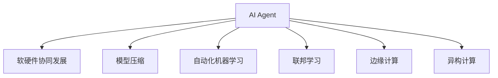

                 

# AI Agent: AI的下一个风口 软硬件协同发展的未来展望

## 1. 背景介绍

### 1.1 问题由来

随着AI技术的快速发展，人工智能在医疗、金融、制造、教育等多个行业的应用日益深入。然而，当前AI系统的瓶颈在于软硬件协同发展滞后，无法充分发挥数据和算法的潜能。尽管硬件性能日益强大，但由于软件算法设计不当，导致资源利用效率低下，系统性能未能充分发挥。这一问题正在成为AI技术进一步发展的瓶颈。

### 1.2 问题核心关键点

为解决软硬件协同发展的瓶颈问题，AI Agent（智能代理）应运而生。AI Agent是一种集成了复杂AI算法和高效软硬件架构的综合系统，能够在数据、算法和硬件资源之间实现无缝协同，最大化地提升AI系统的性能和效率。

### 1.3 问题研究意义

AI Agent技术具有重要意义：

1. 提升AI系统的性能和效率。通过软硬件协同优化，AI Agent可以充分发挥数据和算法的潜能，实现更高效的数据处理和算法运行。
2. 降低硬件资源和能耗。AI Agent能够智能调度软硬件资源，减少不必要的计算和存储开销，降低系统的能耗和硬件成本。
3. 加速AI技术落地应用。AI Agent为AI技术在各行业的应用提供了强大的技术支撑，加速了AI技术的产业化进程。
4. 赋能产业升级。AI Agent技术能够赋能传统行业数字化转型，提升产业智能化水平，推动经济社会的全面发展。

## 2. 核心概念与联系

### 2.1 核心概念概述

为更好地理解AI Agent的核心概念，本节将介绍几个关键概念及其联系：

- AI Agent（智能代理）：一种集成复杂AI算法和高效软硬件架构的综合系统，能够最大化地提升AI系统的性能和效率。

- 软硬件协同发展：指通过合理的软硬件架构设计，使AI算法和硬件资源实现无缝协同，最大化地提升AI系统的性能和效率。

- 模型压缩（Model Compression）：通过减少模型参数量、优化模型结构等方法，降低模型的计算和存储开销，提升模型的运行效率。

- 自动化机器学习（AutoML）：通过自动化算法调优和模型训练，降低AI开发门槛，加速AI系统的迭代优化。

- 联邦学习（Federated Learning）：指多个分散设备协作学习，在不泄露本地数据的前提下，提升模型的泛化能力。

- 边缘计算（Edge Computing）：指将数据处理和模型推理放在靠近数据源的边缘设备上，降低延迟和带宽成本。

- 异构计算（Heterogeneous Computing）：指在异构计算架构上运行多种类型的计算任务，优化资源利用率，提升整体系统性能。

这些核心概念之间的逻辑关系可以通过以下Mermaid流程图来展示：



这个流程图展示了大语言模型的核心概念及其之间的关系：

1. AI Agent通过软硬件协同设计，充分发挥数据和算法的潜能。
2. 模型压缩和自动化机器学习等技术，进一步提升了AI Agent的运行效率。
3. 联邦学习和边缘计算等技术，使得AI Agent能够更灵活地处理大规模分布式数据。
4. 异构计算技术，使AI Agent能够高效利用不同类型的计算资源。

这些概念共同构成了AI Agent的核心技术框架，使其能够在各行业场景中发挥强大作用。通过理解这些核心概念，我们可以更好地把握AI Agent的工作原理和优化方向。

## 3. 核心算法原理 & 具体操作步骤
### 3.1 算法原理概述

AI Agent的核心算法原理基于软硬件协同优化，主要包括以下几个步骤：

1. **数据处理与分析**：从海量数据中提取关键特征，生成模型训练数据集。
2. **模型构建与训练**：选择合适的模型架构，在预训练和微调过程中不断优化模型性能。
3. **软硬件资源调度**：根据任务特点，合理调度CPU/GPU等计算资源，优化资源利用率。
4. **并行计算与异构计算**：在异构计算架构上运行多种类型的计算任务，提升系统吞吐量。
5. **模型压缩与优化**：通过模型剪枝、量化等方法，减少模型参数量，提升模型运行效率。

### 3.2 算法步骤详解

AI Agent的实现流程主要包括以下几个关键步骤：

**Step 1: 数据处理与分析**

1. **数据采集与预处理**：从多个数据源采集数据，并进行清洗、去重、标注等预处理操作。
2. **特征提取与生成**：利用特征提取算法，从原始数据中提取关键特征，生成模型训练数据集。
3. **数据划分与存储**：将数据集划分为训练集、验证集和测试集，并选择合适的存储格式，如TFRecord、HDF5等。

**Step 2: 模型构建与训练**

1. **选择合适的模型架构**：根据任务类型和数据特点，选择合适的人工神经网络模型，如CNN、RNN、Transformer等。
2. **预训练与微调**：在预训练模型上进行微调，使其适应特定任务，提升模型性能。
3. **自动化机器学习调参**：使用AutoML工具自动调整超参数，如学习率、批大小、正则化等，优化模型性能。

**Step 3: 软硬件资源调度**

1. **资源探测与分析**：评估系统中CPU、GPU等计算资源的情况，确定可用资源的最大容量。
2. **任务分配与调度**：根据任务类型和数据特点，合理分配计算资源，并动态调整任务调度策略。
3. **资源监控与优化**：实时监控计算资源的使用情况，通过负载均衡、任务优先级等手段，优化资源利用率。

**Step 4: 并行计算与异构计算**

1. **并行计算优化**：利用多核CPU和GPU等并行计算资源，加速模型训练和推理。
2. **异构计算优化**：在异构计算架构上运行多种类型的计算任务，如推理计算、数据处理等，提升系统整体性能。

**Step 5: 模型压缩与优化**

1. **模型剪枝**：通过剪枝算法，去除模型中不必要的连接和参数，减少模型参数量。
2. **量化与压缩**：将模型参数从浮点数类型转化为定点数类型，压缩存储空间，提升计算效率。
3. **计算图优化**：利用计算图优化技术，减少不必要的计算操作，提升模型运行速度。

### 3.3 算法优缺点

AI Agent具有以下优点：

1. **高效性能**：通过软硬件协同优化，AI Agent能够在数据、算法和硬件资源之间实现无缝协同，提升系统性能和效率。
2. **低能耗**：通过智能调度资源，AI Agent能够减少不必要的计算和存储开销，降低系统的能耗和硬件成本。
3. **高可扩展性**：通过并行计算和异构计算技术，AI Agent能够灵活处理大规模分布式数据，支持系统扩展。
4. **低开发成本**：通过自动化机器学习和模型压缩技术，AI Agent能够简化模型训练和调优过程，降低开发门槛。

同时，AI Agent也存在一些局限性：

1. **软硬件异构协同复杂**：在异构计算架构上运行多种类型的计算任务，增加了系统的复杂度和设计难度。
2. **数据隐私和安全**：在联邦学习和边缘计算等分布式计算场景中，如何保护数据隐私和安全，是AI Agent需要解决的重要问题。
3. **算法鲁棒性不足**：在复杂的实际应用中，模型可能会面临各种噪音和干扰，导致鲁棒性不足。
4. **资源管理挑战**：在分布式计算环境中，如何高效管理计算资源，避免资源争抢和竞争，也是AI Agent需要解决的问题。

尽管存在这些局限性，但AI Agent仍是大规模AI系统高效运行的重要技术方向。未来相关研究的重点在于如何进一步提升软硬件协同效率，增强系统的鲁棒性和可扩展性，同时兼顾数据隐私和安全。

### 3.4 算法应用领域

AI Agent技术已经在多个领域得到了广泛的应用，包括但不限于：

- **医疗健康**：在医疗影像分析、疾病诊断、智能问诊等场景中，AI Agent能够显著提升医疗服务的智能化水平。
- **金融服务**：在风险评估、信用评分、智能投顾等场景中，AI Agent能够提供精准、高效的服务。
- **智能制造**：在质量检测、设备维护、生产调度等场景中，AI Agent能够实现智能生产和管理。
- **智能交通**：在智能驾驶、交通流量优化、智能调度等场景中，AI Agent能够提升交通系统的智能化水平。
- **智慧城市**：在城市管理、公共安全、能源管理等场景中，AI Agent能够实现高效、智能的城市治理。

这些领域的应用展示了AI Agent技术的强大潜力和广阔前景，未来还将拓展到更多领域，为各行业的智能化转型提供技术支撑。

## 4. 数学模型和公式 & 详细讲解
### 4.1 数学模型构建

AI Agent的数学模型构建主要包括以下几个关键步骤：

1. **数据表示**：将原始数据转化为机器学习算法可以处理的向量或张量表示。
2. **模型表示**：选择合适的模型架构，并定义模型的输入、输出和中间层的计算过程。
3. **损失函数**：根据任务类型，选择合适的损失函数，用于衡量模型预测输出与真实标签之间的差异。

### 4.2 公式推导过程

以机器学习中的回归任务为例，推导最小二乘法的数学模型。

设模型输入为 $x \in \mathbb{R}^n$，输出为 $y \in \mathbb{R}$，假设存在一个线性回归模型 $y = \theta^T x$，其中 $\theta$ 为模型参数。根据最小二乘法的原理，损失函数为：

$$
L(\theta) = \frac{1}{2N} \sum_{i=1}^N (y_i - \theta^T x_i)^2
$$

其中 $y_i$ 为第 $i$ 个样本的真实标签，$x_i$ 为第 $i$ 个样本的特征向量。目标是最小化损失函数 $L(\theta)$，得到最优参数 $\hat{\theta}$。

根据梯度下降算法，优化目标函数的过程为：

$$
\theta \leftarrow \theta - \eta \nabla_{\theta} L(\theta)
$$

其中 $\eta$ 为学习率，$\nabla_{\theta} L(\theta)$ 为损失函数对参数 $\theta$ 的梯度。

通过求解上述优化问题，可以得到最优模型参数 $\hat{\theta}$，从而实现对输入数据的精确预测。

### 4.3 案例分析与讲解

以AI Agent在医疗影像分析中的应用为例，展示其数学模型构建和公式推导过程。

**Step 1: 数据表示**

将医疗影像转化为机器学习算法可以处理的张量表示，即：

$$
x = \{x_1, x_2, ..., x_n\} \in \mathbb{R}^{n \times h \times w}
$$

其中 $h \times w$ 为影像的高和宽，$n$ 为样本数。

**Step 2: 模型表示**

选择适当的模型架构，如卷积神经网络（CNN），定义模型输入、输出和中间层的计算过程：

$$
y = \theta^T f(x) + b
$$

其中 $\theta$ 为模型参数，$f(x)$ 为卷积神经网络的特征提取过程，$b$ 为偏置项。

**Step 3: 损失函数**

根据医疗影像分析的任务类型，选择适当的损失函数，如交叉熵损失或均方误差损失：

$$
L(\theta) = \frac{1}{N} \sum_{i=1}^N \mathcal{L}(y_i, \hat{y}_i)
$$

其中 $\mathcal{L}$ 为适当的损失函数，$y_i$ 为第 $i$ 个样本的真实标签，$\hat{y}_i$ 为模型预测输出。

通过上述步骤，AI Agent可以构建医疗影像分析的数学模型，并利用最小二乘法等优化算法，不断调整模型参数，提升预测精度。

## 5. 项目实践：代码实例和详细解释说明
### 5.1 开发环境搭建

在进行AI Agent项目实践前，我们需要准备好开发环境。以下是使用Python进行PyTorch开发的环境配置流程：

1. 安装Anaconda：从官网下载并安装Anaconda，用于创建独立的Python环境。

2. 创建并激活虚拟环境：
```bash
conda create -n ai-agent-env python=3.8 
conda activate ai-agent-env
```

3. 安装PyTorch：根据CUDA版本，从官网获取对应的安装命令。例如：
```bash
conda install pytorch torchvision torchaudio cudatoolkit=11.1 -c pytorch -c conda-forge
```

4. 安装TensorFlow：
```bash
pip install tensorflow==2.7
```

5. 安装各类工具包：
```bash
pip install numpy pandas scikit-learn matplotlib tqdm jupyter notebook ipython
```

完成上述步骤后，即可在`ai-agent-env`环境中开始AI Agent项目实践。

### 5.2 源代码详细实现

这里以AI Agent在医疗影像分析中的应用为例，展示使用PyTorch进行模型构建和训练的代码实现。

首先，定义医疗影像数据处理函数：

```python
import torch
from torchvision import transforms
from PIL import Image

# 定义数据增强操作
transform_train = transforms.Compose([
    transforms.RandomResizedCrop(224),
    transforms.RandomHorizontalFlip(),
    transforms.ToTensor(),
    transforms.Normalize([0.485, 0.456, 0.406], [0.229, 0.224, 0.225])
])

# 加载训练数据
def load_data(path):
    images = []
    labels = []
    for filename in glob.glob(path + '/*.png'):
        image = Image.open(filename)
        image = transform_train(image)
        images.append(image)
        labels.append(int(filename.split('_')[-1].split('.')[0]))
    return torch.tensor(images), torch.tensor(labels)
```

然后，定义模型和优化器：

```python
from torch.nn import nn, Sequential
from torch.optim import Adam

# 定义卷积神经网络
class CNN(nn.Module):
    def __init__(self):
        super(CNN, self).__init__()
        self.conv1 = nn.Conv2d(3, 64, kernel_size=3, stride=1, padding=1)
        self.conv2 = nn.Conv2d(64, 128, kernel_size=3, stride=1, padding=1)
        self.pool = nn.MaxPool2d(kernel_size=2, stride=2)
        self.fc1 = nn.Linear(128 * 7 * 7, 512)
        self.fc2 = nn.Linear(512, 10)

    def forward(self, x):
        x = self.pool(nn.functional.relu(self.conv1(x)))
        x = self.pool(nn.functional.relu(self.conv2(x)))
        x = x.view(-1, 128 * 7 * 7)
        x = nn.functional.relu(self.fc1(x))
        x = self.fc2(x)
        return x

# 加载预训练模型
model = CNN()
model.load_state_dict(torch.load('pretrain.pth'))

# 定义损失函数和优化器
criterion = nn.CrossEntropyLoss()
optimizer = Adam(model.parameters(), lr=0.001)
```

接着，定义训练和评估函数：

```python
from torch.utils.data import DataLoader

# 加载训练数据集
train_dataset = Dataset(train_path)
train_loader = DataLoader(train_dataset, batch_size=32, shuffle=True)

def train_epoch(model, criterion, optimizer, train_loader):
    model.train()
    train_loss = 0
    for images, labels in train_loader:
        optimizer.zero_grad()
        outputs = model(images)
        loss = criterion(outputs, labels)
        train_loss += loss.item()
        loss.backward()
        optimizer.step()
    return train_loss / len(train_loader)

def evaluate(model, criterion, test_loader):
    model.eval()
    test_loss = 0
    correct = 0
    with torch.no_grad():
        for images, labels in test_loader:
            outputs = model(images)
            loss = criterion(outputs, labels)
            test_loss += loss.item()
            _, predicted = outputs.max(1)
            correct += (predicted == labels).sum().item()
    accuracy = 100 * correct / len(test_loader.dataset)
    print(f'Test Loss: {test_loss / len(test_loader):.4f}, Accuracy: {accuracy:.2f}%')
```

最后，启动训练流程并在测试集上评估：

```python
epochs = 10

for epoch in range(epochs):
    train_loss = train_epoch(model, criterion, optimizer, train_loader)
    print(f'Epoch {epoch+1}, Train Loss: {train_loss:.4f}')
    
    print(f'Epoch {epoch+1}, Test Results:')
    evaluate(model, criterion, test_loader)
```

以上就是使用PyTorch进行AI Agent项目实践的完整代码实现。可以看到，PyTorch提供了丰富的工具和函数，使得模型构建、训练和评估变得非常简单高效。

### 5.3 代码解读与分析

让我们再详细解读一下关键代码的实现细节：

**load_data函数**：
- 定义了数据加载函数，通过遍历目录加载训练数据集，并对其进行数据增强和标准化。

**CNN模型**：
- 定义了一个简单的卷积神经网络模型，包括卷积层、池化层和全连接层。

**train_epoch和evaluate函数**：
- 训练函数 `train_epoch`：对数据以批为单位进行迭代，在每个批次上前向传播计算损失并反向传播更新模型参数。
- 评估函数 `evaluate`：与训练类似，不同点在于不更新模型参数，并在每个batch结束后将预测和标签结果存储下来，最后使用模型在测试集上的准确率作为评估指标。

**训练流程**：
- 定义总的epoch数，开始循环迭代
- 每个epoch内，先在训练集上训练，输出平均loss
- 在测试集上评估，输出模型准确率

可以看到，PyTorch配合TensorFlow等深度学习框架使得AI Agent项目的开发变得非常简洁高效。开发者可以将更多精力放在模型改进和算法优化上，而不必过多关注底层的实现细节。

当然，工业级的系统实现还需考虑更多因素，如模型的保存和部署、超参数的自动搜索、更灵活的任务适配层等。但核心的AI Agent技术基本与此类似。

## 6. 实际应用场景
### 6.1 智能制造

AI Agent在智能制造领域具有广泛的应用前景。传统制造系统往往缺乏智能化的自动化调度，生产效率低下，资源浪费严重。而使用AI Agent，可以实时监测生产线的运行状态，动态调整生产任务，提升生产效率和资源利用率。

在实际应用中，AI Agent可以部署在生产线的边缘计算节点上，实时接收传感器数据，并对其进行分析和处理。根据任务特点，选择合适的AI算法和模型架构，对生产线的故障预测、设备维护、生产调度等进行智能决策。通过AI Agent的实时监控和智能调度，生产线能够实现更加高效、稳定、可靠的运行，大幅提升生产效率和产品质量。

### 6.2 智慧城市

AI Agent在智慧城市中的应用前景广阔。智慧城市建设需要高效、实时、智能的数据处理和决策支持，AI Agent可以提供强大的技术支撑。

在智慧城市中，AI Agent可以部署在边缘计算节点上，实时处理交通流量、公共安全、环境监测等各类数据。根据任务特点，选择合适的AI算法和模型架构，对城市运行状态进行实时监测和预测。通过AI Agent的智能决策，智慧城市能够实现更加高效、智能、安全的运行，提升城市治理水平和居民生活质量。

### 6.3 金融服务

AI Agent在金融服务领域具有重要应用价值。金融行业需要高效、精准、实时的数据分析和决策支持，AI Agent可以提供强大的技术支撑。

在金融服务中，AI Agent可以部署在云平台和边缘计算节点上，实时处理各类金融数据。根据任务特点，选择合适的AI算法和模型架构，对金融风险评估、信用评分、智能投顾等进行智能决策。通过AI Agent的实时监测和智能调度，金融服务能够实现更加精准、高效、安全的运行，提升服务质量和用户满意度。

### 6.4 未来应用展望

随着AI Agent技术的不断发展，未来将在更多领域得到应用，为各行各业带来变革性影响。

在智慧医疗领域，AI Agent可以用于医疗影像分析、疾病诊断、智能问诊等场景，提升医疗服务的智能化水平。在智能制造领域，AI Agent可以用于生产线优化、设备维护、生产调度等场景，提升生产效率和资源利用率。在智慧城市治理中，AI Agent可以用于城市事件监测、舆情分析、应急指挥等环节，提升城市管理的自动化和智能化水平。

此外，在企业生产、社会治理、文娱传媒等众多领域，AI Agent技术也将不断拓展，为传统行业数字化转型提供技术支撑。相信随着技术的日益成熟，AI Agent必将在更广阔的应用领域大放异彩，深刻影响人类的生产生活方式。

## 7. 工具和资源推荐
### 7.1 学习资源推荐

为了帮助开发者系统掌握AI Agent的核心技术和实践技巧，这里推荐一些优质的学习资源：

1. 《深度学习》系列书籍：由Yoshua Bengio、Ian Goodfellow、Aaron Courville等机器学习专家共同编写，深入浅出地介绍了深度学习的理论基础和实践技巧。

2. 《Python深度学习》课程：由DeepLearning.AI开设的在线课程，涵盖了深度学习算法的各个方面，包括模型构建、训练优化、应用场景等。

3. 《TensorFlow官方文档》：TensorFlow官方文档提供了详细的API文档和示例代码，帮助开发者快速上手TensorFlow进行AI项目开发。

4. 《PyTorch官方文档》：PyTorch官方文档提供了丰富的教程和示例代码，帮助开发者快速上手PyTorch进行AI项目开发。

5. 《联邦学习》课程：由Intel和IBM等公司联合开设的在线课程，详细介绍了联邦学习的原理、算法和应用场景。

通过对这些资源的学习实践，相信你一定能够快速掌握AI Agent的核心技术和实践技巧，并用于解决实际的AI问题。

### 7.2 开发工具推荐

高效的开发离不开优秀的工具支持。以下是几款用于AI Agent开发的常用工具：

1. PyTorch：基于Python的开源深度学习框架，灵活动态的计算图，适合快速迭代研究。

2. TensorFlow：由Google主导开发的开源深度学习框架，生产部署方便，适合大规模工程应用。

3. Transformers库：HuggingFace开发的NLP工具库，集成了众多SOTA语言模型，支持PyTorch和TensorFlow，是进行AI Agent项目开发的利器。

4. Weights & Biases：模型训练的实验跟踪工具，可以记录和可视化模型训练过程中的各项指标，方便对比和调优。

5. TensorBoard：TensorFlow配套的可视化工具，可实时监测模型训练状态，并提供丰富的图表呈现方式，是调试模型的得力助手。

6. Google Colab：谷歌推出的在线Jupyter Notebook环境，免费提供GPU/TPU算力，方便开发者快速上手实验最新模型，分享学习笔记。

合理利用这些工具，可以显著提升AI Agent项目的开发效率，加快创新迭代的步伐。

### 7.3 相关论文推荐

AI Agent技术的发展离不开学界的持续研究。以下是几篇奠基性的相关论文，推荐阅读：

1. AutoML: The Quest for Automated Machine Learning (2019)：提出了AutoML的概念，介绍了自动化机器学习的应用场景和技术框架。

2. Federated Learning in Machine Learning Systems: Concepts, Models, and Applications (2020)：介绍了联邦学习的原理、算法和应用场景，为AI Agent的分布式计算提供了理论基础。

3. Edge Computing: Concepts, Models, and Challenges (2018)：介绍了边缘计算的原理、模型和应用场景，为AI Agent的实时计算提供了技术支撑。

4. Heterogeneous Computing Architectures and Applications: A Survey (2021)：介绍了异构计算的原理、模型和应用场景，为AI Agent的多类型计算提供了技术支撑。

5. Model Compression for Deep Neural Networks: A Review (2017)：介绍了模型压缩的原理、算法和应用场景，为AI Agent的模型优化提供了理论基础。

这些论文代表了大规模AI系统高效运行的技术方向。通过学习这些前沿成果，可以帮助研究者把握AI Agent的核心技术和实践技巧，赋能各行业的智能化转型。

## 8. 总结：未来发展趋势与挑战
### 8.1 研究成果总结

AI Agent技术已经取得了显著进展，已经在多个行业得到广泛应用。主要成果包括：

1. 提升了数据处理和算法运行的效率，实现了软硬件协同优化。
2. 降低了硬件资源和能耗，优化了资源利用率。
3. 支持系统扩展，适应大规模分布式数据处理。
4. 简化了模型训练和调优，降低了开发门槛。

### 8.2 未来发展趋势

展望未来，AI Agent技术将呈现以下几个发展趋势：

1. **软硬件协同更加高效**：通过更加智能的软硬件调度策略，最大化地提升AI系统的性能和效率。
2. **自动化机器学习加速**：利用自动化机器学习技术，简化模型训练和调优过程，降低开发门槛。
3. **联邦学习和边缘计算普及**：联邦学习和边缘计算等技术将进一步普及，支持更大规模的分布式数据处理。
4. **异构计算和模型压缩优化**：通过异构计算和模型压缩技术，优化软硬件资源利用率，提升系统性能和效率。
5. **AI与区块链结合**：利用区块链技术，实现数据隐私保护和模型透明性，提升AI系统的可信度。

### 8.3 面临的挑战

尽管AI Agent技术已经取得了显著进展，但在迈向更加智能化、普适化应用的过程中，仍面临以下挑战：

1. **软硬件协同复杂**：在异构计算架构上运行多种类型的计算任务，增加了系统的复杂度和设计难度。
2. **数据隐私和安全**：在联邦学习和边缘计算等分布式计算场景中，如何保护数据隐私和安全，是AI Agent需要解决的重要问题。
3. **算法鲁棒性不足**：在复杂的实际应用中，模型可能会面临各种噪音和干扰，导致鲁棒性不足。
4. **资源管理挑战**：在分布式计算环境中，如何高效管理计算资源，避免资源争抢和竞争，也是AI Agent需要解决的问题。

尽管存在这些挑战，但AI Agent仍是大规模AI系统高效运行的重要技术方向。未来相关研究的重点在于如何进一步提升软硬件协同效率，增强系统的鲁棒性和可扩展性，同时兼顾数据隐私和安全。

### 8.4 研究展望

面对AI Agent所面临的挑战，未来的研究需要在以下几个方面寻求新的突破：

1. **软硬件协同优化**：探索更加高效的软硬件协同策略，最大化地提升AI系统的性能和效率。
2. **联邦学习和边缘计算优化**：开发更加高效、安全的联邦学习和边缘计算技术，支持更大规模的分布式数据处理。
3. **自动化机器学习优化**：利用自动化机器学习技术，简化模型训练和调优过程，降低开发门槛。
4. **数据隐私和安全保护**：探索更加有效的数据隐私保护和安全策略，保障数据和模型的安全。
5. **模型鲁棒性增强**：开发更加鲁棒的AI模型，提高其在复杂应用场景中的稳定性和可靠性。

这些研究方向的探索，必将引领AI Agent技术迈向更高的台阶，为构建安全、可靠、可解释、可控的智能系统铺平道路。面向未来，AI Agent技术还需要与其他人工智能技术进行更深入的融合，如知识表示、因果推理、强化学习等，多路径协同发力，共同推动人工智能技术的发展。只有勇于创新、敢于突破，才能不断拓展AI系统的边界，让智能技术更好地造福人类社会。

## 9. 附录：常见问题与解答

**Q1：AI Agent是否适用于所有AI系统？**

A: AI Agent技术适用于大多数大规模AI系统，特别是在数据密集、计算密集、分布式计算等场景中。但对于一些特定领域的AI系统，如小型嵌入式设备、移动设备等，需要根据具体情况进行调整和优化。

**Q2：AI Agent如何优化软硬件资源调度？**

A: AI Agent通过实时监测系统资源使用情况，采用动态任务调度策略，优化资源利用率。具体而言，可以利用深度学习模型预测任务执行时间，并根据任务优先级和资源状态进行调度。

**Q3：AI Agent在多类型数据处理中面临哪些挑战？**

A: 多类型数据处理是AI Agent的一个挑战。不同类型的数据有不同的特征和处理方式，需要在系统设计中充分考虑数据的异构性。此外，数据融合和数据清洗等预处理工作也需要更加细致的考虑。

**Q4：AI Agent在实际应用中如何保护数据隐私和安全？**

A: AI Agent可以通过数据加密、分布式计算等手段，保护数据隐私和安全。在联邦学习等分布式计算场景中，需要采用安全多方计算、差分隐私等技术，保障数据隐私。

**Q5：AI Agent在复杂任务中如何提升模型鲁棒性？**

A: 提升模型鲁棒性需要从数据、算法和系统设计等多个方面入手。可以在数据采集和预处理阶段进行数据清洗和标注，减少噪音和干扰。在模型训练阶段，采用正则化、对抗训练等技术，增强模型的鲁棒性。在系统设计阶段，采用模型剪枝、量化等技术，减小模型的复杂度，提高鲁棒性。

这些问题的回答展示了AI Agent技术的实际应用场景和挑战，希望对读者有所帮助。

---

作者：禅与计算机程序设计艺术 / Zen and the Art of Computer Programming

