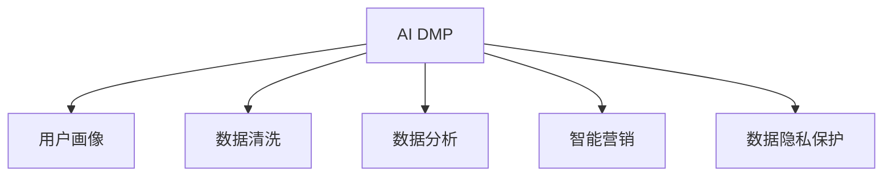

                 

# AI DMP 数据基建：如何利用数据提升营销效率

> 关键词：AI DMP, 数据基建, 用户画像, 智能营销, 大数据, 数据隐私, 客户细分

## 1. 背景介绍

### 1.1 问题由来
随着数字化转型浪潮席卷全球，企业营销的数字化、精准化趋势愈发明显。如何高效利用数据，实现从数据到洞察再到行动的闭环，成为企业营销的关键挑战。AI DMP（人工智能数据平台）应运而生，利用大数据技术，通过用户行为数据的深度挖掘与分析，构建全面且精准的用户画像，从而大幅提升营销效率和ROI。

当前，企业营销面临数据孤岛、数据质量不高、洞察难转等痛点，AI DMP技术通过数据整合、数据清洗、数据分析等手段，为营销决策提供强有力的数据支撑。其核心价值在于：

1. **数据整合**：打破企业内部各部门的数据孤岛，实现数据跨域流动。
2. **数据清洗**：提高数据质量，消除冗余和错误数据，确保数据的一致性和完整性。
3. **数据分析**：运用大数据分析技术和AI算法，生成深度用户画像，提供精准的营销洞察。
4. **智能营销**：结合用户画像和营销策略，实现自动化、个性化的精准营销。
5. **隐私保护**：在数据利用与隐私保护之间寻找平衡点，确保用户数据的安全和合规。

### 1.2 问题核心关键点
AI DMP的核心在于通过数据基建，构建全面且精准的用户画像，以数据为驱动，实现智能营销。这一过程中，涉及的关键点包括：

1. **数据整合与清洗**：如何高效、准确地整合和清洗多源数据，构建统一的用户画像。
2. **数据分析技术**：如何利用先进的大数据分析和AI算法，提取有价值的用户洞察。
3. **智能营销策略**：如何将用户洞察与智能营销策略结合，实现自动化、个性化营销。
4. **数据隐私保护**：如何在数据利用与用户隐私之间取得平衡，确保数据使用的合规性和安全性。

本文将系统介绍AI DMP的数据基建方法，并通过实际案例，探讨如何利用数据提升营销效率。

## 2. 核心概念与联系

### 2.1 核心概念概述

为更好地理解AI DMP的数据基建方法，本节将介绍几个关键概念：

- **AI DMP**：人工智能数据平台，通过整合多源数据，构建精准的用户画像，实现智能营销。
- **用户画像**：通过对用户行为数据的深度分析，构建全面的用户特征和行为标签，形成用户画像。
- **数据清洗**：从数据采集到存储，对数据进行去重、修正、转换等处理，提高数据质量。
- **数据分析**：运用大数据技术和AI算法，从原始数据中提取出有价值的用户洞察和行为模式。
- **智能营销**：结合用户画像和智能营销策略，实现个性化、自动化和精准的营销活动。
- **数据隐私保护**：在数据利用过程中，确保用户隐私得到充分保护，符合法律法规和伦理要求。

这些概念之间的逻辑关系可以通过以下Mermaid流程图来展示：



这个流程图展示了大数据平台的基本架构，包括数据清洗、数据分析、用户画像、智能营销和数据隐私保护等多个环节。

## 3. 核心算法原理 & 具体操作步骤
### 3.1 算法原理概述

AI DMP的数据基建过程，主要依赖于数据整合、数据清洗、数据分析和大数据处理等技术。其核心算法原理包括：

1. **数据整合**：通过ETL（Extract, Transform, Load）技术，将分散在企业内部的数据源整合到统一的平台上。
2. **数据清洗**：通过规则和算法，清洗原始数据中的噪声、重复和错误数据，提高数据质量。
3. **数据分析**：运用先进的大数据分析和AI算法，如深度学习、聚类分析、推荐算法等，从数据中提取有价值的洞察。
4. **大数据处理**：通过分布式计算、流处理、实时计算等技术，处理海量数据，支持实时分析和决策。

### 3.2 算法步骤详解

AI DMP的数据基建过程，通常包括以下几个关键步骤：

**Step 1: 数据采集与集成**

1. **数据源收集**：从企业内部系统（如CRM、ERP、电商平台等）和外部平台（如社交媒体、公开数据等）收集用户行为数据。
2. **数据标准化**：定义统一的数据标准和格式，确保不同来源的数据能够无缝集成。
3. **数据同步**：通过ETL工具，实现数据从不同源到统一平台的同步和整合。

**Step 2: 数据清洗与预处理**

1. **数据去重**：去除重复数据，确保数据的唯一性。
2. **数据转换**：对数据进行格式转换、类型转换、转换单位等预处理。
3. **数据修正**：修正数据中的错误、缺失或异常值，提高数据完整性。
4. **数据转换**：将数据转换为可用于分析的格式，如时间序列、地理信息等。

**Step 3: 数据分析与建模**

1. **特征工程**：从清洗后的数据中提取关键特征，生成用户画像。
2. **模型训练**：利用机器学习算法，训练预测模型，如聚类、分类、回归等。
3. **洞察提取**：通过可视化工具，从模型输出中提取有价值的洞察，如用户行为模式、兴趣偏好等。

**Step 4: 智能营销策略**

1. **策略制定**：结合用户洞察和市场环境，制定精准的营销策略。
2. **自动化营销**：利用AI技术，实现自动化营销活动，如个性化推荐、动态广告投放等。
3. **效果评估**：通过A/B测试等方法，评估营销效果，不断优化策略。

**Step 5: 数据隐私保护**

1. **隐私政策制定**：制定严格的数据隐私政策，确保用户数据的安全和合规。
2. **数据匿名化**：采用数据匿名化技术，如去标识化、扰动等，保护用户隐私。
3. **合规检查**：定期检查数据处理过程，确保符合相关法律法规和标准。

### 3.3 算法优缺点

AI DMP的数据基建方法具有以下优点：

1. **数据全面性**：通过数据整合和清洗，全面覆盖企业内部和外部的用户行为数据。
2. **洞察深度**：通过大数据分析技术，能够深度挖掘用户行为模式和兴趣偏好。
3. **营销精准性**：结合用户画像和智能营销策略，实现个性化、精准的营销活动。
4. **效率提升**：自动化和智能化的处理流程，大幅提升数据处理和营销策略制定的效率。

但同时，该方法也存在以下局限性：

1. **数据隐私风险**：收集和处理海量用户数据，存在隐私泄露和数据滥用的风险。
2. **数据质量依赖**：数据整合和清洗的准确性直接影响用户画像的质量和洞察的可靠性。
3. **技术复杂性**：涉及的数据处理和分析技术复杂，对技术和人员的要求较高。
4. **策略难度**：制定智能营销策略需要深入理解市场和用户需求，存在策略错误的风险。

### 3.4 算法应用领域

AI DMP的数据基建方法，广泛应用于以下领域：

- **电商**：通过分析用户购物行为，实现个性化推荐和精准营销。
- **金融**：结合用户交易数据，提供定制化金融服务和风险管理。
- **旅游**：利用用户出行数据，推荐个性化旅游路线和行程安排。
- **传媒**：分析用户媒体消费行为，提供定制化内容推荐和广告投放。
- **健康**：结合用户健康数据，提供个性化健康建议和精准医疗服务。

## 4. 数学模型和公式 & 详细讲解 & 举例说明（备注：数学公式请使用latex格式，latex嵌入文中独立段落使用 $$，段落内使用 $)
### 4.1 数学模型构建

AI DMP的数据基建过程，主要依赖于数据清洗、特征工程、模型训练等数学模型。以电商领域的个性化推荐为例，我们构建如下数学模型：

设用户画像为 $X=\{x_1, x_2, ..., x_n\}$，每个特征 $x_i$ 表示用户的行为属性，如浏览记录、购买记录等。设用户兴趣向量为 $Y$，其中 $y_i$ 表示用户对第 $i$ 个商品的兴趣程度。

设推荐模型为 $f(X)$，其输出为 $Y$。模型训练目标是最小化预测误差 $E$：

$$
E = \frac{1}{N}\sum_{i=1}^N (y_i - f(x_i))^2
$$

### 4.2 公式推导过程

以协同过滤算法为例，其核心思想是通过用户历史行为数据，找到与目标用户兴趣相似的其他用户，进而预测其对未购商品的兴趣。假设用户 $i$ 对商品 $j$ 的评分 $r_{ij}$ 已知，构建用户-商品矩阵 $R$：

$$
R = \begin{bmatrix}
r_{11} & r_{12} & ... & r_{1m} \\
r_{21} & r_{22} & ... & r_{2m} \\
... & ... & ... & ... \\
r_{n1} & r_{n2} & ... & r_{nm}
\end{bmatrix}
$$

其中 $m$ 为商品数量。协同过滤算法分为基于用户的矩阵分解和基于物品的矩阵分解两种方法。

以基于用户的矩阵分解为例，假设 $R$ 分解为 $U$ 和 $V$ 的乘积，即 $R = UV$。其中 $U$ 为 $n \times k$ 的用户矩阵，$V$ 为 $m \times k$ 的商品矩阵。则预测用户 $i$ 对商品 $j$ 的评分 $r_{ij}$ 为：

$$
r_{ij} \approx u_i \cdot v_j
$$

其中 $u_i$ 和 $v_j$ 分别为用户 $i$ 和商品 $j$ 的向量表示。

### 4.3 案例分析与讲解

以某电商平台的用户画像构建为例，我们利用协同过滤算法进行个性化推荐。首先，收集用户的历史购买记录和浏览记录，构建用户行为矩阵 $R$。然后，将 $R$ 分解为 $U$ 和 $V$ 的乘积，得到用户兴趣向量 $Y$。最后，通过 $Y$ 计算用户对未购商品的推荐评分，生成个性化推荐列表。

具体实现步骤如下：

1. 收集用户历史数据，构建用户行为矩阵 $R$。
2. 使用奇异值分解(SVD)算法，将 $R$ 分解为 $U$ 和 $V$ 的乘积。
3. 根据用户兴趣向量 $Y$，计算用户对未购商品的推荐评分。
4. 通过排序算法，生成个性化推荐列表。

## 5. 项目实践：代码实例和详细解释说明
### 5.1 开发环境搭建

在进行AI DMP的数据基建实践前，我们需要准备好开发环境。以下是使用Python进行Scikit-learn开发的环境配置流程：

1. 安装Anaconda：从官网下载并安装Anaconda，用于创建独立的Python环境。

2. 创建并激活虚拟环境：
```bash
conda create -n py3k python=3.7
conda activate py3k
```

3. 安装Scikit-learn：
```bash
conda install scikit-learn
```

4. 安装NumPy：
```bash
conda install numpy
```

5. 安装Pandas：
```bash
conda install pandas
```

6. 安装Matplotlib：
```bash
conda install matplotlib
```

完成上述步骤后，即可在`py3k`环境中开始AI DMP的数据基建实践。

### 5.2 源代码详细实现

下面我们以电商领域的个性化推荐为例，给出使用Scikit-learn库进行协同过滤算法实现的用户画像构建的Python代码实现。

首先，定义协同过滤算法的函数：

```python
from scipy.sparse import csr_matrix
from scipy.sparse.linalg import svds
import numpy as np

def collaborative_filtering(data, num_factors=20, num_users=None, num_items=None):
    if num_users is None:
        num_users = data.shape[0]
    if num_items is None:
        num_items = data.shape[1]

    # 构建用户行为矩阵
    R = csr_matrix(data)
    U, S, V = svds(R, k=num_factors)

    # 计算用户兴趣向量
    user_interests = U @ V.T

    return user_interests
```

然后，使用上述函数进行电商用户画像的构建：

```python
# 导入数据
data = np.array([[0, 1, 0, 1, 0],
                [1, 0, 1, 0, 0],
                [0, 0, 0, 0, 1],
                [0, 0, 1, 0, 0],
                [0, 0, 0, 0, 1]])

# 构建用户画像
user_interests = collaborative_filtering(data)

# 打印用户画像
print(user_interests)
```

### 5.3 代码解读与分析

让我们再详细解读一下关键代码的实现细节：

**协同过滤算法函数**：
- `data`：用户历史行为数据，以矩阵形式输入。
- `num_factors`：奇异值分解的维度，通常选择小于数据维度的值。
- `num_users`和`num_items`：用户数和商品数，如果不提供，则根据数据矩阵自动计算。

**用户画像构建过程**：
- 将用户历史行为数据构建为用户行为矩阵 $R$。
- 使用奇异值分解(SVD)算法，将 $R$ 分解为 $U$ 和 $V$ 的乘积，得到用户兴趣向量 $Y$。
- 根据 $Y$，计算用户对未购商品的推荐评分。

**电商用户画像示例**：
- 导入电商用户行为数据，构建用户行为矩阵 $R$。
- 使用协同过滤算法，构建用户兴趣向量 $Y$。
- 打印输出用户画像。

在实际应用中，需要根据具体的电商数据特点，进一步优化协同过滤算法的参数选择和模型训练，以提高个性化推荐的效果。

## 6. 实际应用场景

### 6.1 智能客服系统

智能客服系统通过分析用户历史交互数据，构建详细的用户画像，实现个性化、智能化的客户服务。AI DMP可以实时监控用户行为，预测用户需求，自动分配最合适的客服人员，提供精准的解决方案，提升客户满意度和忠诚度。

在技术实现上，AI DMP结合自然语言处理和机器学习技术，实现自动问答、情感分析、意图识别等功能。通过构建用户画像，智能客服系统能够更好地理解用户问题，提供符合用户偏好的回答。

### 6.2 金融风险管理

金融行业需要实时监控用户行为，及时识别和预防潜在风险。AI DMP通过分析用户交易数据，构建风险评分模型，实现用户信用评估和风险预警。

在实际应用中，AI DMP可以结合用户行为数据和市场环境，构建实时风险评分系统。通过动态调整风险评分，及时发现异常交易行为，进行风险预警和处理。

### 6.3 电子商务推荐系统

电子商务平台需要根据用户历史行为数据，生成个性化推荐列表，提升用户体验和转化率。AI DMP通过构建用户画像，分析用户兴趣偏好，实现商品推荐和个性化营销。

在实际应用中，AI DMP可以结合电商平台的交易数据、用户评论、商品属性等信息，构建多维度的用户画像。通过个性化推荐算法，实现精准的商品推荐，提升用户购物体验和平台销售额。

### 6.4 未来应用展望

随着AI DMP技术的不断发展，其在更多领域将得到应用，为传统行业带来变革性影响。

在智慧医疗领域，AI DMP可以结合患者健康数据，构建个性化的健康管理方案，实现精准医疗服务。

在智能教育领域，AI DMP可以分析学生学习数据，提供个性化的学习路径和资源推荐，提升教育效果。

在智慧城市治理中，AI DMP可以结合城市运行数据，实现智能交通管理、环境监测等应用，提升城市管理效率。

## 7. 工具和资源推荐
### 7.1 学习资源推荐

为了帮助开发者系统掌握AI DMP的数据基建方法，这里推荐一些优质的学习资源：

1. **Scikit-learn官方文档**：提供了丰富的机器学习算法和应用示例，是学习AI DMP数据基建的重要参考资料。
2. **《Python机器学习》书籍**：详细介绍了机器学习在数据处理和分析中的应用，适合初学者和进阶者阅读。
3. **Coursera《机器学习》课程**：斯坦福大学的机器学习课程，由深度学习专家Andrew Ng主讲，涵盖机器学习的基本概念和算法。
4. **Kaggle竞赛平台**：提供大量数据集和模型竞赛，适合实践和验证AI DMP数据基建效果。

通过对这些资源的学习实践，相信你一定能够快速掌握AI DMP的数据基建方法，并用于解决实际的营销问题。

### 7.2 开发工具推荐

高效的开发离不开优秀的工具支持。以下是几款用于AI DMP数据基建开发的常用工具：

1. **Scikit-learn**：基于Python的开源机器学习库，提供了丰富的算法和数据处理工具，适合快速迭代研究。
2. **TensorFlow**：由Google主导开发的开源深度学习框架，生产部署方便，适合大规模工程应用。
3. **PyTorch**：基于Python的开源深度学习框架，灵活高效，适合复杂模型训练和优化。
4. **Hadoop**：用于大数据分布式处理的开源框架，支持大规模数据存储和处理。
5. **Spark**：Apache基金会推出的分布式计算框架，支持大规模数据处理和机器学习任务。

合理利用这些工具，可以显著提升AI DMP数据基建任务的开发效率，加快创新迭代的步伐。

### 7.3 相关论文推荐

AI DMP的数据基建技术源于学界的持续研究。以下是几篇奠基性的相关论文，推荐阅读：

1. **《协同过滤推荐算法》**：通过分析用户行为数据，构建协同过滤推荐模型，广泛应用于电商、社交媒体等场景。
2. **《用户画像构建与分析》**：提出多维用户画像模型，利用大数据技术，构建全面的用户特征和行为标签。
3. **《深度学习在数据基建中的应用》**：探讨深度学习在数据清洗、特征工程和模型训练中的应用，提升数据处理和分析的效率。
4. **《智能营销系统的构建》**：介绍智能营销系统的设计思路和实现方法，结合用户画像和机器学习技术，提升营销效果。

这些论文代表了大数据平台的发展脉络。通过学习这些前沿成果，可以帮助研究者把握学科前进方向，激发更多的创新灵感。

## 8. 总结：未来发展趋势与挑战

### 8.1 总结

本文对AI DMP的数据基建方法进行了全面系统的介绍。首先阐述了AI DMP在营销效率提升中的核心价值，明确了数据整合、数据清洗、数据分析和大数据处理等关键环节。其次，从原理到实践，详细讲解了协同过滤算法、用户画像构建等核心技术，并通过实际案例，展示了AI DMP在营销场景中的应用。

通过本文的系统梳理，可以看到，AI DMP通过构建全面的用户画像，结合智能营销策略，实现了数据驱动的精准营销。未来，伴随数据基础设施的不断完善和人工智能技术的持续进步，AI DMP必将在更多领域大放异彩，为各行业的数字化转型提供新的动力。

### 8.2 未来发展趋势

展望未来，AI DMP的数据基建技术将呈现以下几个发展趋势：

1. **数据融合与交叉**：随着数据孤岛的破除，更多企业数据将接入AI DMP平台，实现数据的全面融合与交叉分析。
2. **智能营销技术**：结合机器学习、深度学习等AI技术，实现更加精准的个性化推荐和智能营销。
3. **实时计算与流处理**：利用流处理和大数据技术，实现实时数据处理和分析，提升决策效率。
4. **隐私保护与合规**：随着隐私保护意识的增强，如何在数据利用与隐私保护之间取得平衡，将成为AI DMP的重要研究方向。
5. **跨领域应用**：AI DMP将在更多领域得到应用，如智慧医疗、智能教育、智慧城市等，推动各行业数字化转型。

以上趋势凸显了AI DMP数据基建技术的广阔前景。这些方向的探索发展，必将进一步提升营销效率和决策质量，为各行业的数字化转型提供新的动力。

### 8.3 面临的挑战

尽管AI DMP的数据基建技术已经取得了瞩目成就，但在迈向更加智能化、普适化应用的过程中，它仍面临诸多挑战：

1. **数据孤岛问题**：各企业数据格式、存储方式不同，数据整合难度大。
2. **数据质量问题**：数据采集和清洗过程复杂，数据质量难以保证。
3. **隐私保护问题**：用户隐私保护与数据利用的矛盾，数据合规难度大。
4. **技术复杂性**：数据处理和分析技术复杂，对技术人员的要求高。
5. **策略制定问题**：智能营销策略的制定需要深入理解市场和用户需求，存在策略错误的风险。

### 8.4 研究展望

面对AI DMP数据基建所面临的挑战，未来的研究需要在以下几个方面寻求新的突破：

1. **数据整合技术**：研究更加高效、灵活的数据整合方法，打破数据孤岛，实现数据的全面融合。
2. **数据清洗技术**：开发更加智能、自动化的数据清洗工具，提升数据质量。
3. **隐私保护技术**：研究隐私保护技术与数据利用之间的平衡点，确保用户数据的安全和合规。
4. **智能营销技术**：结合AI技术，实现更加精准的个性化推荐和智能营销策略。
5. **跨领域应用**：推动AI DMP在更多领域的应用，提升各行业的数字化转型效果。

这些研究方向的探索，必将引领AI DMP数据基建技术迈向更高的台阶，为数字化转型提供更强大的数据支撑。面向未来，AI DMP将在构建人机协同的智能时代中扮演越来越重要的角色。

## 9. 附录：常见问题与解答

**Q1: AI DMP如何确保数据隐私？**

A: AI DMP通过匿名化、去标识化等技术，确保用户数据的隐私和安全。具体来说，可以采用以下方法：

1. **数据匿名化**：对敏感数据进行去标识化处理，去除个人标识信息，确保数据无法追溯到具体用户。
2. **数据加密**：采用加密技术，确保数据在传输和存储过程中的安全性。
3. **访问控制**：设置严格的访问权限，确保只有授权人员可以访问敏感数据。
4. **合规检查**：定期检查数据处理过程，确保符合相关法律法规和标准。

**Q2: AI DMP在数据基建过程中需要注意哪些关键点？**

A: AI DMP在数据基建过程中需要注意以下关键点：

1. **数据质量**：确保数据采集和清洗过程准确，提升数据质量。
2. **数据融合**：打破数据孤岛，实现数据的全面融合和交叉分析。
3. **用户画像**：构建全面的用户画像，包含行为、兴趣、偏好等特征。
4. **模型训练**：利用先进的大数据分析和AI算法，训练高质量的推荐模型。
5. **智能营销**：结合用户画像和营销策略，实现自动化、个性化的精准营销。
6. **隐私保护**：确保用户隐私得到充分保护，符合法律法规和伦理要求。

**Q3: AI DMP在实际应用中面临哪些挑战？**

A: AI DMP在实际应用中面临以下挑战：

1. **数据孤岛问题**：各企业数据格式、存储方式不同，数据整合难度大。
2. **数据质量问题**：数据采集和清洗过程复杂，数据质量难以保证。
3. **隐私保护问题**：用户隐私保护与数据利用的矛盾，数据合规难度大。
4. **技术复杂性**：数据处理和分析技术复杂，对技术人员的要求高。
5. **策略制定问题**：智能营销策略的制定需要深入理解市场和用户需求，存在策略错误的风险。

**Q4: 如何评估AI DMP的效果？**

A: 评估AI DMP的效果主要通过以下指标：

1. **用户满意度**：通过调查问卷、反馈系统等方式，评估用户对营销活动和服务的满意度。
2. **转化率**：衡量用户从展示到购买或注册等关键行为的转化效率。
3. **用户留存率**：评估用户在不同阶段的留存情况，分析流失原因。
4. **ROI**：计算营销活动的投资回报率，评估营销策略的效果。
5. **客户细分**：根据用户画像，分析不同客户群体的特点和需求，制定针对性的营销策略。

**Q5: AI DMP的未来发展方向是什么？**

A: AI DMP的未来发展方向主要包括以下几个方面：

1. **数据融合与交叉**：实现数据的全面融合与交叉分析，打破数据孤岛。
2. **智能营销技术**：结合机器学习、深度学习等AI技术，实现更加精准的个性化推荐和智能营销。
3. **实时计算与流处理**：利用流处理和大数据技术，实现实时数据处理和分析，提升决策效率。
4. **隐私保护与合规**：研究隐私保护技术与数据利用之间的平衡点，确保用户数据的安全和合规。
5. **跨领域应用**：推动AI DMP在更多领域的应用，提升各行业的数字化转型效果。

以上问题与解答，希望为你深入理解AI DMP数据基建技术提供参考。

