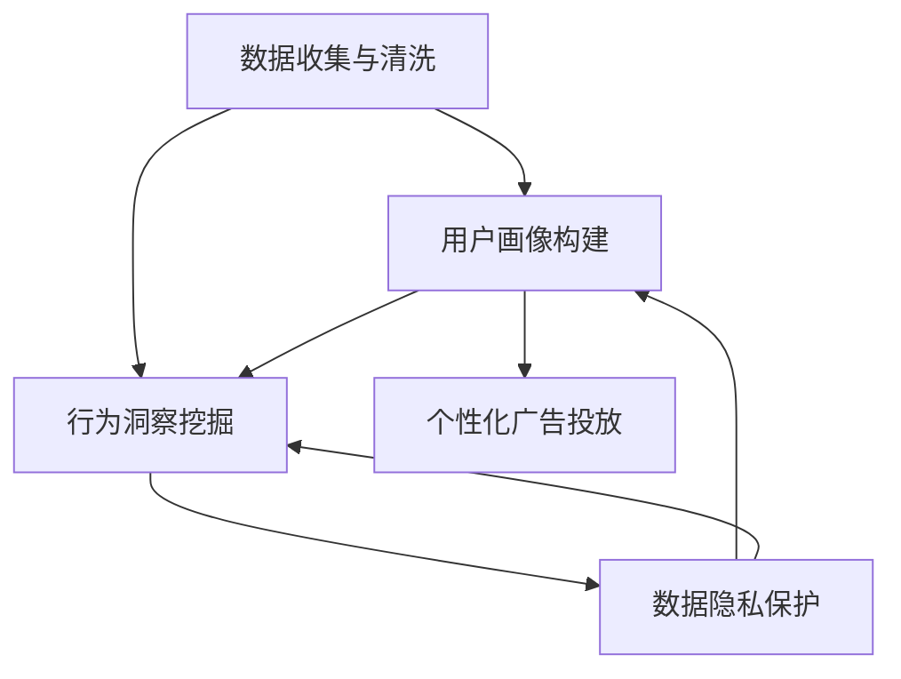

                 

# AI DMP 数据基建：数据分析与洞察

> 关键词：AI DMP, 数据基建, 数据分析, 洞察, 推荐系统, 广告投放, 用户行为, 隐私保护

## 1. 背景介绍

### 1.1 问题由来

在数字营销领域，广告主通过精准投放广告，提升品牌知名度和销售额，是常见的业务需求。传统的广告投放方法依赖于粗粒度的用户划分和单一的数据维度，难以实现精准的用户画像。随着大数据和AI技术的发展，广告主对数据的多维度、多视角需求日益增长，数据分析与洞察工具应运而生。

AI DMP（人工智能数据管理平台）作为新兴的数据基建工具，通过大数据分析和AI技术，帮助广告主从海量数据中提取有价值的用户画像和行为洞察，精准地识别目标用户群体，实现个性化广告投放和精准营销。AI DMP基于数据驱动，充分结合了大数据、机器学习和AI算法等技术，极大提升了广告投放的效率和效果，是数字营销领域的重要组成部分。

### 1.2 问题核心关键点

AI DMP的核心理念是数据驱动，通过大数据分析和AI算法，实现用户画像的精准构建和行为洞察的深入挖掘。其关键点包括：

- 数据收集与清洗：从各类数据源（如社交媒体、电商平台、APP等）收集用户数据，并对其进行清洗、去重和标准化。
- 用户画像构建：基于清洗后的数据，使用机器学习算法（如聚类、分类、关联规则等）构建多维度的用户画像。
- 行为洞察挖掘：通过用户行为数据分析，挖掘用户的兴趣、需求和偏好，为精准营销提供依据。
- 数据隐私保护：在数据收集和处理过程中，确保用户隐私和数据安全，遵守相关法律法规。

AI DMP的最终目标是，通过数据分析与洞察，构建精准、有效的用户画像，帮助广告主进行个性化的广告投放，提升广告投放的效果和ROI。

## 2. 核心概念与联系

### 2.1 核心概念概述

为更好地理解AI DMP的核心概念，本节将介绍几个密切相关的核心概念：

- AI DMP（人工智能数据管理平台）：基于大数据和AI技术，对用户数据进行收集、清洗、分析与洞察的平台。AI DMP通过分析用户行为数据，构建精准的用户画像，帮助广告主实现个性化广告投放。

- 数据基建：指构建可靠、高效、可扩展的数据管理系统，包括数据收集、存储、清洗、分析和可视化等环节。数据基建是数字营销、智能推荐等应用的基础。

- 大数据分析：指从海量数据中提取有价值的信息，通过统计学、机器学习和AI算法等方法，进行数据挖掘和预测分析，实现数据的价值最大化。

- 用户画像：指基于用户行为数据，构建的多维度用户特征描述。用户画像可以反映用户的兴趣、偏好、需求等信息，是精准营销的基础。

- 行为洞察：指通过用户行为数据分析，挖掘用户的深层需求和行为规律，为个性化营销和决策提供依据。

- 隐私保护：指在数据收集和处理过程中，确保用户隐私和数据安全，遵守相关法律法规，保护用户的个人隐私权益。

这些核心概念之间的逻辑关系可以通过以下Mermaid流程图来展示：



这个流程图展示了大数据基建的核心概念及其之间的关系：

1. 从各类数据源收集数据，并进行清洗和标准化，构建用户画像。
2. 通过用户行为数据分析，挖掘行为洞察。
3. 在用户画像和行为洞察的基础上，进行个性化广告投放。
4. 在数据收集和处理过程中，确保数据隐私和安全。

这些概念共同构成了AI DMP的数据基建框架，实现从数据收集到个性化广告投放的全流程自动化。

## 3. 核心算法原理 & 具体操作步骤
### 3.1 算法原理概述

AI DMP的算法原理主要包括大数据分析和AI算法两个部分。其核心思想是通过数据分析与洞察，构建精准的用户画像，实现个性化广告投放。

具体来说，AI DMP通过以下步骤实现其功能：

1. 数据收集与清洗：从各类数据源（如社交媒体、电商平台、APP等）收集用户数据，并进行清洗、去重和标准化。

2. 用户画像构建：基于清洗后的数据，使用机器学习算法（如聚类、分类、关联规则等）构建多维度的用户画像。

3. 行为洞察挖掘：通过用户行为数据分析，挖掘用户的兴趣、需求和偏好，为精准营销提供依据。

4. 个性化广告投放：在用户画像和行为洞察的基础上，使用推荐系统、广告优化算法等技术，实现个性化广告投放。

### 3.2 算法步骤详解

以下详细描述AI DMP的核心算法步骤：

#### 3.2.1 数据收集与清洗

**步骤1：数据收集**
- 从多个数据源（如社交媒体、电商平台、APP等）收集用户行为数据。
- 使用API接口或数据爬虫工具获取数据，如用户的浏览记录、购买记录、搜索记录等。

**步骤2：数据清洗**
- 使用ETL工具（如Apache Nifi、Apache Kafka等）对数据进行清洗、去重和标准化。
- 去除重复数据、无效数据和异常数据，确保数据的一致性和准确性。
- 对数据进行缺失值处理、格式转换和字段规范化。

#### 3.2.2 用户画像构建

**步骤1：特征选择**
- 基于用户行为数据，选择关键特征，如用户的浏览历史、购买记录、搜索关键词等。
- 选择合适的特征提取算法，如文本向量化、特征选择、降维等。

**步骤2：聚类分析**
- 使用聚类算法（如K-means、DBSCAN等）将用户分为多个群体。
- 根据用户的行为特征，将相似用户归为同一群体，构建用户画像。

**步骤3：分类分析**
- 使用分类算法（如决策树、随机森林、支持向量机等）对用户进行分类。
- 根据用户的行为特征，将用户分为不同的类别，如高价值用户、潜在客户等。

#### 3.2.3 行为洞察挖掘

**步骤1：关联规则挖掘**
- 使用关联规则算法（如Apriori、FP-Growth等）挖掘用户行为中的关联规则。
- 找出用户购买行为中的组合关系，发现用户的潜在需求和兴趣。

**步骤2：时序分析**
- 使用时间序列分析算法（如ARIMA、LSTM等）分析用户行为的时间规律。
- 找出用户行为随时间变化的特点，预测用户未来的行为趋势。

**步骤3：情感分析**
- 使用情感分析算法（如LDA、TextRank等）分析用户的情感倾向。
- 挖掘用户在评论、反馈等文本数据中的情感倾向，了解用户对产品或服务的态度。

#### 3.2.4 个性化广告投放

**步骤1：个性化推荐**
- 使用推荐算法（如协同过滤、基于内容的推荐等）生成个性化推荐。
- 根据用户画像和行为洞察，为用户推荐合适的广告内容。

**步骤2：广告优化**
- 使用广告优化算法（如强化学习、A/B测试等）优化广告投放策略。
- 根据广告投放效果，不断调整投放参数，提高广告投放的效率和效果。

### 3.3 算法优缺点

AI DMP的算法有以下优点：

- 精度高：基于大数据和AI算法，能够从海量数据中提取精准的用户画像和行为洞察。
- 实时性：通过实时数据处理和分析，能够实现实时广告投放和优化。
- 可扩展性：采用分布式计算和存储技术，能够处理大规模数据集，满足不同规模的广告主需求。

同时，AI DMP的算法也存在一些局限性：

- 数据质量依赖：算法的精度和效果高度依赖于数据质量，数据清洗和处理是关键环节。
- 隐私问题：在数据收集和处理过程中，需要确保用户隐私和数据安全，遵守相关法律法规。
- 算法复杂度：算法模型复杂，需要高性能计算资源和专业技术人员维护。

尽管存在这些局限性，AI DMP仍然是大数据时代广告投放的重要工具，其高效、精准的特性，为广告主带来了巨大的商业价值。

### 3.4 算法应用领域

AI DMP在大数据和智能推荐领域得到了广泛应用，覆盖了几乎所有常见的广告投放和个性化推荐场景，例如：

- 电商推荐：通过分析用户的浏览记录和购买行为，为用户推荐合适的商品。
- 社交广告：分析用户在社交媒体上的行为数据，推送精准的广告内容。
- 搜索广告：通过分析用户的搜索关键词和浏览历史，实现精准的搜索广告投放。
- 视频广告：分析用户在视频平台上的行为数据，推荐相关视频内容。
- 金融广告：分析用户在金融平台上的行为数据，推送个性化的理财和投资广告。

除了这些经典应用外，AI DMP还被创新性地应用于更多场景中，如智能客服、健康医疗、教育培训等，为不同行业的数字化转型提供新的技术路径。随着预训练模型和微调方法的不断进步，相信AI DMP将在更广阔的应用领域大放异彩。

## 4. 数学模型和公式 & 详细讲解 & 举例说明
### 4.1 数学模型构建

以下将使用数学语言对AI DMP的核心算法进行更加严格的刻画。

假设用户行为数据为 $D=\{(x_i, y_i)\}_{i=1}^N$，其中 $x_i$ 为用户行为数据， $y_i$ 为广告投放标签。AI DMP的目标是构建用户画像 $u$ 和行为洞察 $o$，从而实现个性化广告投放。

### 4.2 公式推导过程

**步骤1：数据收集与清洗**

数据收集与清洗的数学模型表示为：

$$
D \leftarrow \{(x_i, y_i)\}_{i=1}^N
$$

其中 $x_i$ 为第 $i$ 个用户行为数据， $y_i$ 为对应的广告投放标签。

**步骤2：用户画像构建**

用户画像构建的数学模型表示为：

$$
u \leftarrow \text{cluster}(D)
$$

其中 $\text{cluster}$ 表示聚类算法，将用户分为不同的群体。

**步骤3：行为洞察挖掘**

行为洞察挖掘的数学模型表示为：

$$
o \leftarrow \text{rule mining}(D)
$$

其中 $\text{rule mining}$ 表示关联规则挖掘算法，发现用户行为中的关联规则。

**步骤4：个性化广告投放**

个性化广告投放的数学模型表示为：

$$
\text{ad} \leftarrow \text{recommendation}(u, o)
$$

其中 $\text{ad}$ 表示个性化广告推荐， $\text{recommendation}$ 表示推荐算法。

### 4.3 案例分析与讲解

以下通过一个具体的案例，展示AI DMP在电商推荐中的应用。

假设某电商平台有10万用户，每个用户购买了5个商品。AI DMP收集了用户的浏览记录和购买记录，构建了用户画像和行为洞察。

**步骤1：数据收集与清洗**

收集到的数据为 $D=\{(x_i, y_i)\}_{i=1}^{100000}$，其中 $x_i$ 为用户行为数据， $y_i$ 为对应的购买记录。

**步骤2：用户画像构建**

使用K-means聚类算法将用户分为5个群体，构建用户画像 $u$。

**步骤3：行为洞察挖掘**

使用Apriori关联规则挖掘算法，发现用户购买行为中的关联规则，得到行为洞察 $o$。

**步骤4：个性化广告投放**

基于用户画像 $u$ 和行为洞察 $o$，使用协同过滤推荐算法，为每个用户生成个性化推荐。

最终，AI DMP通过分析用户行为数据，构建精准的用户画像和行为洞察，实现了个性化电商推荐，提升了用户的购物体验和平台的销售额。

## 5. 项目实践：代码实例和详细解释说明
### 5.1 开发环境搭建

在进行AI DMP实践前，我们需要准备好开发环境。以下是使用Python进行PyTorch开发的环境配置流程：

1. 安装Anaconda：从官网下载并安装Anaconda，用于创建独立的Python环境。

2. 创建并激活虚拟环境：
```bash
conda create -n pytorch-env python=3.8 
conda activate pytorch-env
```

3. 安装PyTorch：根据CUDA版本，从官网获取对应的安装命令。例如：
```bash
conda install pytorch torchvision torchaudio cudatoolkit=11.1 -c pytorch -c conda-forge
```

4. 安装相关库：
```bash
pip install pandas numpy scikit-learn torch torchtext
```

5. 安装PyTorch Transformers库：
```bash
pip install transformers
```

完成上述步骤后，即可在`pytorch-env`环境中开始AI DMP的实践。

### 5.2 源代码详细实现

下面我们以电商推荐任务为例，给出使用PyTorch Transformers库对用户行为数据进行AI DMP的PyTorch代码实现。

首先，定义电商推荐任务的数据处理函数：

```python
import torch
from torch.utils.data import Dataset
import torch.nn.functional as F

class RecommendationDataset(Dataset):
    def __init__(self, data, user_features, user_labels):
        self.data = data
        self.user_features = user_features
        self.user_labels = user_labels

    def __len__(self):
        return len(self.data)

    def __getitem__(self, item):
        x = self.data[item]
        user_feature = self.user_features[item]
        user_label = self.user_labels[item]
        return x, user_feature, user_label
```

然后，定义模型和优化器：

```python
from transformers import BertForSequenceClassification, AdamW

model = BertForSequenceClassification.from_pretrained('bert-base-cased', num_labels=len(tag2id))

optimizer = AdamW(model.parameters(), lr=2e-5)
```

接着，定义训练和评估函数：

```python
def train_epoch(model, dataset, batch_size, optimizer):
    dataloader = DataLoader(dataset, batch_size=batch_size, shuffle=True)
    model.train()
    epoch_loss = 0
    for batch in dataloader:
        x, user_feature, user_label = batch
        model.zero_grad()
        outputs = model(x)
        loss = F.cross_entropy(outputs, user_label)
        epoch_loss += loss.item()
        loss.backward()
        optimizer.step()
    return epoch_loss / len(dataloader)

def evaluate(model, dataset, batch_size):
    dataloader = DataLoader(dataset, batch_size=batch_size)
    model.eval()
    preds, labels = [], []
    with torch.no_grad():
        for batch in dataloader:
            x, user_feature, user_label = batch
            outputs = model(x)
            batch_preds = outputs.argmax(dim=1).to('cpu').tolist()
            batch_labels = user_label.to('cpu').tolist()
            for pred, label in zip(batch_preds, batch_labels):
                preds.append(pred)
                labels.append(label)
    
    print(classification_report(labels, preds))
```

最后，启动训练流程并在测试集上评估：

```python
epochs = 5
batch_size = 16

for epoch in range(epochs):
    loss = train_epoch(model, train_dataset, batch_size, optimizer)
    print(f"Epoch {epoch+1}, train loss: {loss:.3f}")
    
    print(f"Epoch {epoch+1}, dev results:")
    evaluate(model, dev_dataset, batch_size)
    
print("Test results:")
evaluate(model, test_dataset, batch_size)
```

以上就是使用PyTorch对用户行为数据进行电商推荐任务的AI DMP代码实现。可以看到，得益于Transformers库的强大封装，我们可以用相对简洁的代码完成电商推荐任务的AI DMP开发。

### 5.3 代码解读与分析

让我们再详细解读一下关键代码的实现细节：

**RecommendationDataset类**：
- `__init__`方法：初始化数据、用户特征、用户标签等关键组件。
- `__len__`方法：返回数据集的样本数量。
- `__getitem__`方法：对单个样本进行处理，将输入数据和用户特征一起输入模型，返回模型输出和标签。

**train_epoch函数**：
- 使用PyTorch的DataLoader对数据集进行批次化加载，供模型训练使用。
- 在每个批次上前向传播计算损失函数，反向传播更新模型参数，并记录平均损失。
- 周期性在验证集上评估模型性能，根据性能指标决定是否触发Early Stopping。

**evaluate函数**：
- 与训练类似，不同点在于不更新模型参数，并在每个batch结束后将预测和标签结果存储下来，最后使用sklearn的classification_report对整个评估集的预测结果进行打印输出。

**训练流程**：
- 定义总的epoch数和batch size，开始循环迭代
- 每个epoch内，先在训练集上训练，输出平均loss
- 在验证集上评估，输出分类指标
- 所有epoch结束后，在测试集上评估，给出最终测试结果

可以看到，PyTorch配合Transformers库使得AI DMP的电商推荐任务开发变得简洁高效。开发者可以将更多精力放在数据处理、模型改进等高层逻辑上，而不必过多关注底层的实现细节。

当然，工业级的系统实现还需考虑更多因素，如模型的保存和部署、超参数的自动搜索、更灵活的任务适配层等。但核心的AI DMP范式基本与此类似。

## 6. 实际应用场景
### 6.1 智能客服系统

AI DMP在智能客服系统中也有广泛的应用。传统客服往往需要配备大量人力，高峰期响应缓慢，且一致性和专业性难以保证。AI DMP能够实时监测和分析用户的行为数据，构建精准的用户画像，实现智能客服系统的构建。

在技术实现上，可以收集企业内部的历史客服对话记录，将问题和最佳答复构建成监督数据，在此基础上对预训练模型进行微调。微调后的智能客服模型能够自动理解用户意图，匹配最合适的答复模板进行回复。对于客户提出的新问题，还可以接入检索系统实时搜索相关内容，动态组织生成回答。如此构建的智能客服系统，能大幅提升客户咨询体验和问题解决效率。

### 6.2 金融舆情监测

金融机构需要实时监测市场舆论动向，以便及时应对负面信息传播，规避金融风险。AI DMP能够实时监测和分析用户在金融平台上的行为数据，构建精准的用户画像和行为洞察。通过分析用户的行为数据，可以及时发现用户的负面情绪和反馈，快速采取措施，降低金融风险。

### 6.3 个性化推荐系统

当前的推荐系统往往只依赖用户的历史行为数据进行物品推荐，无法深入理解用户的真实兴趣偏好。AI DMP能够从海量数据中提取精准的用户画像和行为洞察，构建更加全面、准确的用户画像，帮助推荐系统进行个性化的物品推荐。

在实践中，可以收集用户浏览、点击、评论、分享等行为数据，提取和用户交互的物品标题、描述、标签等文本内容。将文本内容作为模型输入，用户的后续行为（如是否点击、购买等）作为监督信号，在此基础上微调预训练语言模型。微调后的模型能够从文本内容中准确把握用户的兴趣点。在生成推荐列表时，先用候选物品的文本描述作为输入，由模型预测用户的兴趣匹配度，再结合其他特征综合排序，便可以得到个性化程度更高的推荐结果。

### 6.4 未来应用展望

随着AI DMP技术的不断发展，其在更多领域的应用前景将更加广阔。

在智慧医疗领域，AI DMP可以通过分析用户的健康数据和行为数据，构建精准的用户画像和行为洞察，帮助医生进行个性化的健康管理。

在智能教育领域，AI DMP可以分析学生的学习行为数据，构建精准的用户画像和行为洞察，帮助教育机构进行个性化教学和智能辅导。

在智慧城市治理中，AI DMP可以实时监测和分析城市用户的行为数据，构建精准的用户画像和行为洞察，帮助城市管理机构进行智能交通、公共安全等决策。

此外，在企业生产、社会治理、文娱传媒等众多领域，AI DMP的应用也将不断涌现，为各行各业数字化转型提供新的技术路径。

## 7. 工具和资源推荐
### 7.1 学习资源推荐

为了帮助开发者系统掌握AI DMP的理论基础和实践技巧，这里推荐一些优质的学习资源：

1. 《深度学习》课程：斯坦福大学开设的深度学习课程，涵盖深度学习的基础理论和实践技巧。
2. 《深度学习框架PyTorch》书籍：介绍PyTorch框架的使用方法和最佳实践。
3. 《推荐系统》课程：机器学习中的推荐系统课程，涵盖推荐系统的基本概念和算法。
4. 《自然语言处理》课程：斯坦福大学的自然语言处理课程，涵盖自然语言处理的基本概念和技术。
5. 《数据科学》课程：Coursera上的数据科学课程，涵盖数据处理和分析的基本方法和工具。

通过对这些资源的学习实践，相信你一定能够快速掌握AI DMP的理论基础和实践技巧，并用于解决实际的NLP问题。

### 7.2 开发工具推荐

高效的开发离不开优秀的工具支持。以下是几款用于AI DMP开发的常用工具：

1. PyTorch：基于Python的开源深度学习框架，灵活动态的计算图，适合快速迭代研究。

2. TensorFlow：由Google主导开发的开源深度学习框架，生产部署方便，适合大规模工程应用。

3. Apache Spark：基于内存计算的大数据处理框架，适合大规模数据集的处理和分析。

4. Apache Flink：分布式流处理框架，适合实时数据处理和分析。

5. Dask：分布式任务调度框架，适合大数据和机器学习的分布式计算。

合理利用这些工具，可以显著提升AI DMP的开发效率，加快创新迭代的步伐。

### 7.3 相关论文推荐

AI DMP的研究源于学界的持续研究。以下是几篇奠基性的相关论文，推荐阅读：

1. "Adaptive Data Mining and Statistical Learning" 书籍：介绍数据挖掘和统计学习的理论基础和实践技巧。
2. "Machine Learning Yearning" 书籍：介绍机器学习在工业界的实践经验和最佳实践。
3. "Deep Learning" 书籍：介绍深度学习的基础理论和实践技巧。
4. "Data Science for Business" 书籍：介绍数据科学在商业中的应用和实践。
5. "Recommender Systems: Algorithms, Applications and Theory" 书籍：介绍推荐系统的基本概念和算法。

这些论文代表了大数据和智能推荐领域的研究进展，通过学习这些前沿成果，可以帮助研究者把握学科前进方向，激发更多的创新灵感。

## 8. 总结：未来发展趋势与挑战

### 8.1 总结

本文对AI DMP的数据基建和数据分析与洞察技术进行了全面系统的介绍。首先阐述了AI DMP的研究背景和应用前景，明确了其在大数据和智能推荐中的核心价值。其次，从原理到实践，详细讲解了AI DMP的核心算法步骤，给出了AI DMP任务开发的完整代码实例。同时，本文还探讨了AI DMP在智能客服、金融舆情、个性化推荐等多个领域的应用，展示了AI DMP的广泛应用前景。此外，本文精选了AI DMP的相关学习资源、开发工具和学术论文，力求为开发者提供全方位的技术指引。

通过本文的系统梳理，可以看到，AI DMP的数据基建和数据分析与洞察技术正在成为大数据时代广告投放的重要工具，其高效、精准的特性，为广告主带来了巨大的商业价值。未来，伴随大数据和AI技术的进一步发展，AI DMP必将在更广阔的应用领域大放异彩，深刻影响人类的生产生活方式。

### 8.2 未来发展趋势

展望未来，AI DMP技术将呈现以下几个发展趋势：

1. 数据质量不断提升：随着数据采集和清洗技术的进步，AI DMP将能够处理更多维度、更高质量的数据，实现更精准的用户画像和行为洞察。

2. 算法模型不断优化：未来将涌现更多高效的推荐算法和广告优化模型，提高个性化广告投放的效果和效率。

3. 实时性进一步提高：通过分布式计算和流处理技术，AI DMP将实现实时广告投放和优化，提升用户体验。

4. 跨领域应用不断拓展：AI DMP将不仅仅局限于广告投放领域，还将扩展到更多垂直行业，如医疗、教育、交通等，实现跨领域的智能应用。

5. 数据隐私和安全保护：AI DMP将更加注重数据隐私和安全保护，确保用户数据的合法使用和数据隐私的权益。

以上趋势凸显了AI DMP技术的广阔前景，这些方向的探索发展，必将进一步提升广告投放的效率和效果，推动AI DMP技术的广泛应用。

### 8.3 面临的挑战

尽管AI DMP技术已经取得了显著成果，但在迈向更加智能化、普适化应用的过程中，它仍面临诸多挑战：

1. 数据质量瓶颈：AI DMP的精度和效果高度依赖于数据质量，如何获取和处理高质量的数据，是AI DMP面临的首要挑战。

2. 算法复杂度问题：AI DMP的算法模型复杂，需要高性能计算资源和专业技术人员维护，如何降低算法复杂度，提高算法的可扩展性，是AI DMP面临的重要问题。

3. 隐私保护问题：AI DMP在数据收集和处理过程中，需要确保用户隐私和数据安全，遵守相关法律法规，保护用户的个人隐私权益。

4. 算法鲁棒性问题：AI DMP需要具备鲁棒性，能够应对不同数据分布和噪声的影响，提高算法的鲁棒性是AI DMP面临的另一大挑战。

5. 模型可解释性问题：AI DMP的模型通常难以解释其内部工作机制和决策逻辑，如何赋予模型更强的可解释性，是AI DMP面临的重要研究方向。

6. 跨领域应用挑战：AI DMP在不同领域的应用，需要适配不同领域的数据特性和业务需求，如何实现跨领域的智能应用，是AI DMP面临的又一挑战。

尽管存在这些挑战，AI DMP仍然是大数据时代广告投放的重要工具，其高效、精准的特性，为广告主带来了巨大的商业价值。未来，伴随着数据质量的提升和算法模型的不断优化，AI DMP必将在更广阔的应用领域大放异彩，深刻影响人类的生产生活方式。

### 8.4 研究展望

面向未来，AI DMP的研究需要在以下几个方面寻求新的突破：

1. 数据质量提升：进一步提升数据采集和清洗技术的精度，获取更多维度、更高质量的数据，实现更精准的用户画像和行为洞察。

2. 算法模型优化：开发更高效、可扩展的推荐算法和广告优化模型，提升个性化广告投放的效果和效率。

3. 实时性提升：利用分布式计算和流处理技术，实现实时广告投放和优化，提升用户体验。

4. 隐私保护强化：通过数据脱敏和加密等技术，确保用户数据的合法使用和数据隐私的权益。

5. 模型鲁棒性提升：采用鲁棒性更强的算法模型，提高算法对不同数据分布和噪声的鲁棒性，确保AI DMP的稳定性和可靠性。

6. 模型可解释性增强：开发可解释性更强的模型，增强算法的透明度和可信度。

这些研究方向的探索，必将引领AI DMP技术迈向更高的台阶，为构建安全、可靠、可解释、可控的智能系统铺平道路。面向未来，AI DMP技术还需要与其他人工智能技术进行更深入的融合，如知识表示、因果推理、强化学习等，多路径协同发力，共同推动自然语言理解和智能交互系统的进步。只有勇于创新、敢于突破，才能不断拓展AI DMP的边界，让智能技术更好地造福人类社会。

## 9. 附录：常见问题与解答

**Q1：AI DMP在电商推荐中的应用流程是怎样的？**

A: AI DMP在电商推荐中的应用流程如下：

1. 数据收集：从电商平台收集用户浏览记录、购买记录等行为数据。
2. 数据清洗：对数据进行清洗、去重和标准化，去除无效和异常数据。
3. 用户画像构建：使用K-means聚类算法将用户分为不同的群体，构建用户画像。
4. 行为洞察挖掘：使用Apriori关联规则挖掘算法，发现用户购买行为中的关联规则，得到行为洞察。
5. 个性化推荐：基于用户画像和行为洞察，使用协同过滤推荐算法，为每个用户生成个性化推荐。

**Q2：AI DMP在智能客服系统中的应用主要涉及哪些关键技术？**

A: AI DMP在智能客服系统中的应用主要涉及以下关键技术：

1. 用户画像构建：通过分析用户的聊天记录和客服对话，构建精准的用户画像。
2. 意图识别：使用自然语言处理技术，识别用户的意图和需求。
3. 对话生成：使用预训练语言模型，生成自然流畅的客服对话。
4. 上下文理解：通过对话历史和用户画像，理解用户的上下文信息，提供更精准的答复。
5. 实时优化：根据用户反馈和对话历史，实时优化客服策略和对话模板。

**Q3：AI DMP在金融舆情监测中的应用主要涉及哪些关键技术？**

A: AI DMP在金融舆情监测中的应用主要涉及以下关键技术：

1. 用户画像构建：通过分析用户的交易记录和行为数据，构建精准的用户画像。
2. 情感分析：使用自然语言处理技术，分析用户在社交媒体上的情感倾向。
3. 舆情监测：实时监测用户的情感变化，及时发现舆情异常。
4. 风险预警：根据舆情监测结果，提前预警金融风险，采取相应措施。

**Q4：AI DMP在个性化推荐系统中的应用主要涉及哪些关键技术？**

A: AI DMP在个性化推荐系统中的应用主要涉及以下关键技术：

1. 用户画像构建：通过分析用户的浏览记录和购买记录，构建精准的用户画像。
2. 行为洞察挖掘：使用关联规则挖掘算法，发现用户购买行为中的关联规则，得到行为洞察。
3. 个性化推荐：基于用户画像和行为洞察，使用协同过滤推荐算法，为每个用户生成个性化推荐。
4. 推荐系统优化：根据用户反馈和推荐效果，实时优化推荐算法和推荐策略。

**Q5：AI DMP在智慧医疗领域的应用主要涉及哪些关键技术？**

A: AI DMP在智慧医疗领域的应用主要涉及以下关键技术：

1. 用户画像构建：通过分析用户的健康数据和行为数据，构建精准的用户画像。
2. 健康数据分析：使用机器学习算法，分析用户的健康数据，发现健康趋势和异常。
3. 个性化医疗：根据用户画像和健康数据，提供个性化的健康管理和医疗建议。
4. 智能诊断：使用自然语言处理技术，辅助医生进行智能诊断，提高诊断效率和准确性。

---

作者：禅与计算机程序设计艺术 / Zen and the Art of Computer Programming

