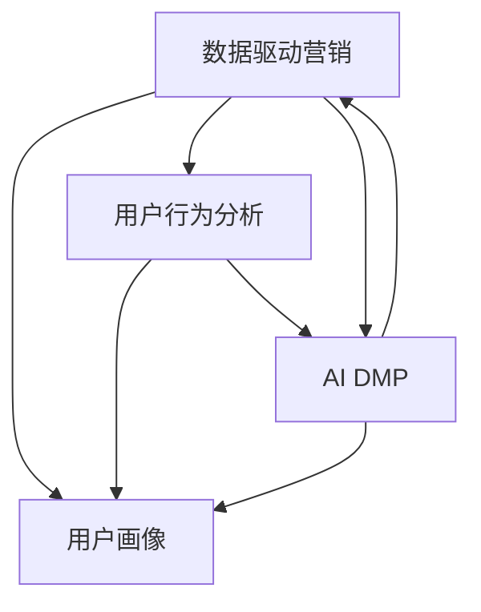

                 

# AI DMP 数据基建：数据驱动营销的成功案例

> 关键词：数据驱动营销，用户画像，用户行为分析，AI DMP，数据治理

## 1. 背景介绍

### 1.1 问题由来
随着数字营销的兴起，企业愈发依赖于数据来驱动营销决策，以实现高效的用户触达、转化和维系。然而，传统的数据分析方法往往局限于结构化数据的处理和分析，难以全面把握用户的多维行为特征和潜在需求。随着数据量的急剧增长和复杂度的提升，数据驱动的营销亟需更为先进、全面的数据基础设施。

### 1.2 问题核心关键点
在数字营销中，构建完整、准确的用户画像，是实现个性化营销的基石。然而，构建高质量用户画像需要整合多种数据源，包括用户在线行为数据、社交媒体互动数据、消费交易数据等。传统的数据整合方法，如ETL流程，需要大量的人工干预和调试，难以实现高效、灵活的数据集成。

AI驱动的数据平台（AI DMP）通过机器学习和数据治理技术，能够自动化地从海量数据中提取、整合和分析用户行为信息，生成高质量的用户画像，为精准营销提供强有力的支持。

### 1.3 问题研究意义
AI DMP作为数据驱动营销的关键基础设施，能够显著提升营销活动的效果和效率。具体而言，AI DMP的构建和使用，具有以下几个重要意义：

1. **全面数据整合**：AI DMP能够自动化地从多个数据源中整合用户数据，避免了传统ETL流程的繁琐和耗时，提升数据集成效率。
2. **智能数据治理**：AI DMP通过数据清洗、去重、脱敏等技术，确保数据的质量和安全，减少数据噪音和隐私风险。
3. **精准用户画像**：AI DMP能够生成多维度的用户画像，捕捉用户行为、兴趣、偏好等复杂特征，支持个性化的推荐和定向营销。
4. **动态营销优化**：AI DMP能够实时分析用户行为数据，动态调整营销策略和投放渠道，实现更加精准的营销效果。
5. **全栈数据管理**：AI DMP提供端到端的数据治理和运营支持，从数据采集到分析再到可视化，全面提升数据驱动营销的能力。

## 2. 核心概念与联系

### 2.1 核心概念概述

为更好地理解AI DMP的工作原理和优化方向，本节将介绍几个密切相关的核心概念：

- **数据驱动营销**：基于数据的营销决策过程，通过分析用户行为和市场反馈，实现精准的营销投放和优化。
- **用户画像**：通过收集和分析用户的多维数据，构建用户的行为、兴趣、偏好等综合信息，用于指导个性化营销策略。
- **AI DMP**：基于AI技术的用户数据平台，通过自动化数据整合、智能治理和动态分析，生成高质量的用户画像。
- **用户行为分析**：通过分析用户在网站、应用等平台上的行为数据，挖掘用户的潜在需求和兴趣点。
- **数据治理**：数据的质量管理过程，包括数据清洗、去重、脱敏、权限控制等，确保数据的安全和可用性。
- **数据仓库**：集中存储和管理企业业务数据的平台，支持数据的存储、查询和分析。

这些核心概念之间的逻辑关系可以通过以下Mermaid流程图来展示：



这个流程图展示了大数据营销和用户画像的构建过程，以及AI DMP在其中扮演的重要角色。

## 3. 核心算法原理 & 具体操作步骤
### 3.1 算法原理概述

AI DMP的构建，本质上是将用户行为数据进行智能化处理和分析，生成精准的用户画像。其核心思想是：将用户的多维数据进行整合、清洗和标准化，通过机器学习模型提取出用户的关键行为特征和兴趣偏好，最终生成高质量的用户画像。

形式化地，设用户行为数据集为 $D=\{(x_i,y_i)\}_{i=1}^N, x_i \in \mathcal{X}, y_i \in \mathcal{Y}$，其中 $\mathcal{X}$ 为数据空间，$\mathcal{Y}$ 为标签空间。AI DMP的目标是通过机器学习算法，学习从数据 $D$ 中抽取特征 $f(x)$，并利用特征 $f(x)$ 预测用户标签 $y$，即构建映射函数 $h(f(x))=y$。

具体而言，AI DMP包括以下几个关键步骤：

1. **数据整合与预处理**：从多个数据源收集用户数据，进行清洗、去重、脱敏等预处理操作，确保数据质量和安全。
2. **特征提取与转换**：通过特征工程技术，从原始数据中提取和转换出有意义的特征，供后续建模使用。
3. **模型训练与优化**：基于提取出的特征，使用机器学习算法（如决策树、随机森林、深度学习等）进行模型训练和优化，学习用户行为特征与兴趣偏好之间的映射关系。
4. **用户画像生成**：基于训练好的模型，对新数据进行预测，生成用户的多维画像。

### 3.2 算法步骤详解

AI DMP的构建包括以下几个关键步骤：

**Step 1: 数据整合与预处理**
- 收集来自网站、应用、社交媒体、CRM系统等渠道的用户行为数据。
- 使用ETL工具进行数据清洗、去重、格式化等预处理操作。
- 对敏感数据进行脱敏处理，确保用户隐私保护。

**Step 2: 特征提取与转换**
- 使用特征工程技术，提取用户的行为特征（如点击、浏览、购买等）、兴趣特征（如浏览历史、收藏列表等）和属性特征（如地理位置、年龄、性别等）。
- 对特征进行编码、归一化、分箱等处理，使其符合建模要求。

**Step 3: 模型训练与优化**
- 选择合适的机器学习算法，如决策树、随机森林、深度学习等，进行模型训练。
- 设置合适的超参数，如学习率、树深、神经网络层数等，优化模型效果。
- 引入正则化技术，防止模型过拟合。

**Step 4: 用户画像生成**
- 使用训练好的模型对新数据进行预测，生成用户的多维画像。
- 将用户画像存储到数据仓库中，供后续营销决策使用。

### 3.3 算法优缺点

AI DMP作为数据驱动营销的关键基础设施，具有以下优点：
1. 自动化数据整合：通过自动化数据集成，提高数据采集和处理的效率，降低人工成本。
2. 智能数据治理：通过自动化数据清洗、去重、脱敏等操作，确保数据的质量和安全。
3. 精准用户画像：通过机器学习模型，从多维数据中抽取用户特征，生成高质量的用户画像。
4. 实时营销优化：能够实时分析用户行为数据，动态调整营销策略和投放渠道，提升营销效果。
5. 全栈数据管理：提供端到端的数据治理和运营支持，从数据采集到分析再到可视化，全面提升数据驱动营销的能力。

同时，AI DMP也存在一些局限性：
1. 数据孤岛问题：不同数据源的数据格式和标准不一，整合难度较大。
2. 数据噪音问题：用户行为数据可能包含噪音，影响模型的训练效果。
3. 隐私保护问题：数据整合和分析过程中，可能涉及用户隐私泄露的风险。
4. 模型复杂度问题：高维数据的处理和建模复杂度较高，需要较强的技术实力。
5. 高昂的计算成本：大规模数据集的处理和建模需要高性能的计算资源，成本较高。

尽管存在这些局限性，但AI DMP仍然是数据驱动营销的重要基础设施，具有不可替代的价值。

### 3.4 算法应用领域

AI DMP在数字营销中有着广泛的应用场景，涵盖多个关键领域：

- **广告投放优化**：通过用户画像，实现广告的精准投放，提高广告点击率和转化率。
- **客户细分与定位**：对用户进行细分，识别出潜在的高价值客户，进行定向营销。
- **个性化推荐**：基于用户画像，生成个性化的产品推荐和内容推荐，提升用户体验。
- **市场洞察分析**：分析用户行为数据，挖掘市场趋势和用户需求，支持市场决策。
- **客户生命周期管理**：跟踪用户的行为轨迹，评估客户生命周期各阶段的表现，指导客户关系管理。
- **社交媒体互动**：分析社交媒体上的用户互动数据，优化社交媒体营销策略。

以上应用场景展示了AI DMP在数字营销中的巨大潜力，为营销决策提供了强有力的数据支持。

## 4. 数学模型和公式 & 详细讲解  
### 4.1 数学模型构建

为了更好地理解AI DMP的工作原理，我们通过一个简单的用户行为预测模型来具体展示其数学模型构建过程。

设用户行为数据集为 $D=\{(x_i,y_i)\}_{i=1}^N, x_i \in \mathcal{X}, y_i \in \mathcal{Y}$。假设模型 $h$ 将用户行为特征 $x$ 映射为标签 $y$，即 $h(x)=y$。设 $x$ 的特征表示为 $\mathbf{x}=[x_1,x_2,...,x_n]^T$，$y$ 的标签表示为 $y\in\{0,1\}$。

**假设模型为线性分类器**：$h(x)=\mathbf{w}\cdot\mathbf{x}+b$，其中 $\mathbf{w}$ 为权重向量，$b$ 为偏置项。

**交叉熵损失函数**：$L(h(x),y)=-[y\log h(x)+(1-y)\log (1-h(x))]$。

**模型训练目标**：最小化经验风险 $\mathcal{L}(\mathbf{w},b)=\frac{1}{N}\sum_{i=1}^N L(h(x_i),y_i)$。

### 4.2 公式推导过程

假设我们已知训练集 $D=\{(x_i,y_i)\}_{i=1}^N$，其中 $x_i$ 为样本特征向量，$y_i$ 为样本标签。

**目标函数**：
$$
\mathcal{L}(\mathbf{w},b)=\frac{1}{N}\sum_{i=1}^N L(h(x_i),y_i)=\frac{1}{N}\sum_{i=1}^N [-y_i\log h(x_i)-(1-y_i)\log (1-h(x_i))]
$$

**梯度计算**：
$$
\frac{\partial \mathcal{L}}{\partial \mathbf{w}}=\frac{1}{N}\sum_{i=1}^N (-y_i\frac{\partial h(x_i)}{\partial \mathbf{w}}-(1-y_i)\frac{\partial h(x_i)}{\partial \mathbf{w}})
$$

**梯度更新**：
$$
\mathbf{w} \leftarrow \mathbf{w} - \eta \nabla_{\mathbf{w}}\mathcal{L}(\mathbf{w},b)
$$

其中，$\eta$ 为学习率。

### 4.3 案例分析与讲解

以用户点击行为预测为例，假设用户点击与否的行为数据集 $D$ 已准备就绪。我们可以使用线性分类器来预测用户是否点击某广告。

**特征提取**：
- 广告点击次数 $x_1$，广告曝光次数 $x_2$，用户年龄 $x_3$，用户性别 $x_4$，广告投放时间 $x_5$。

**模型构建**：
- 使用线性分类器 $h(x)=\mathbf{w}\cdot\mathbf{x}+b$。

**训练过程**：
1. 对训练集数据进行特征编码和标准化。
2. 使用梯度下降算法最小化交叉熵损失函数，更新权重 $\mathbf{w}$ 和偏置 $b$。
3. 在验证集上评估模型性能，选择最优模型参数。

**预测过程**：
1. 对新用户的行为数据进行特征编码和标准化。
2. 使用训练好的模型 $h(x)=\mathbf{w}\cdot\mathbf{x}+b$ 进行预测。
3. 根据预测结果，进行广告投放优化和客户细分。

以上案例展示了AI DMP在用户行为预测中的应用，通过线性分类器模型，可以有效地预测用户的行为，实现精准的广告投放和客户细分。

## 5. 项目实践：代码实例和详细解释说明
### 5.1 开发环境搭建

在进行AI DMP项目实践前，我们需要准备好开发环境。以下是使用Python进行PyTorch开发的环境配置流程：

1. 安装Anaconda：从官网下载并安装Anaconda，用于创建独立的Python环境。

2. 创建并激活虚拟环境：
```bash
conda create -n pytorch-env python=3.8 
conda activate pytorch-env
```

3. 安装PyTorch：根据CUDA版本，从官网获取对应的安装命令。例如：
```bash
conda install pytorch torchvision torchaudio cudatoolkit=11.1 -c pytorch -c conda-forge
```

4. 安装必要的第三方库：
```bash
pip install pandas numpy scikit-learn joblib tqdm sklearn feature-engine lightgbm
```

完成上述步骤后，即可在`pytorch-env`环境中开始项目实践。

### 5.2 源代码详细实现

下面我们以用户行为预测为例，给出使用PyTorch对线性分类器进行训练的PyTorch代码实现。

首先，定义数据预处理函数：

```python
import pandas as pd
from sklearn.preprocessing import StandardScaler
from sklearn.model_selection import train_test_split

def preprocess_data(data):
    # 将数据按点击与否标签进行拆分
    train_data, test_data = train_test_split(data, test_size=0.2, random_state=42)
    # 特征编码
    features = ['click_count', 'exposure_count', 'age', 'gender', 'time_of_day']
    target = 'click'
    X_train = train_data[features]
    y_train = train_data[target]
    X_test = test_data[features]
    y_test = test_data[target]
    # 标准化处理
    scaler = StandardScaler()
    X_train = scaler.fit_transform(X_train)
    X_test = scaler.transform(X_test)
    return X_train, y_train, X_test, y_test
```

然后，定义模型和训练函数：

```python
import torch
import torch.nn as nn
from torch.utils.data import DataLoader
from sklearn.model_selection import train_test_split

class LinearClassifier(nn.Module):
    def __init__(self, input_dim, output_dim):
        super(LinearClassifier, self).__init__()
        self.linear = nn.Linear(input_dim, output_dim)
        self.sigmoid = nn.Sigmoid()

    def forward(self, x):
        return self.sigmoid(self.linear(x))

def train_model(X_train, y_train, X_test, y_test, epochs=10, batch_size=32, learning_rate=0.01):
    model = LinearClassifier(input_dim=X_train.shape[1], output_dim=1)
    criterion = nn.BCELoss()
    optimizer = torch.optim.Adam(model.parameters(), lr=learning_rate)
    for epoch in range(epochs):
        model.train()
        for batch_idx, (inputs, targets) in enumerate(DataLoader(X_train, y_train, batch_size=batch_size)):
            optimizer.zero_grad()
            outputs = model(inputs)
            loss = criterion(outputs, targets)
            loss.backward()
            optimizer.step()
        print(f'Epoch {epoch+1}, loss: {loss:.4f}')
    print(f'Test accuracy: {torch.mean((model(X_test) >= 0.5).float())}')
```

接着，启动训练流程并在测试集上评估：

```python
# 加载数据集
data = pd.read_csv('click_data.csv')
X_train, y_train, X_test, y_test = preprocess_data(data)

# 训练模型
train_model(X_train, y_train, X_test, y_test)

# 在测试集上评估模型性能
print(f'Test accuracy: {torch.mean((model(X_test) >= 0.5).float())}')
```

以上就是使用PyTorch对线性分类器进行用户行为预测的完整代码实现。可以看到，通过简单的数据预处理和模型训练，我们就能实现对用户点击行为的有效预测。

### 5.3 代码解读与分析

让我们再详细解读一下关键代码的实现细节：

**preprocess_data函数**：
- 定义了数据预处理的关键步骤，包括数据拆分、特征编码和标准化处理。
- 使用了Pandas库进行数据读取和处理，Scikit-learn库进行特征编码和标准化操作。
- 实现了特征和标签的分离，并通过随机拆分划分训练集和测试集。

**LinearClassifier类**：
- 定义了线性分类器的模型结构，包括输入层、线性层和输出层。
- 使用PyTorch的`nn.Linear`和`nn.Sigmoid`实现线性分类器的前向传播。

**train_model函数**：
- 定义了训练模型的关键流程，包括模型初始化、损失函数、优化器、数据加载器等。
- 通过循环迭代，在前向传播和反向传播中更新模型参数，最小化损失函数。
- 使用均方误差损失函数和Adam优化器，实现模型的训练过程。
- 在每个epoch后打印损失函数值，并在测试集上评估模型性能。

**训练流程**：
- 加载数据集，预处理数据。
- 定义模型、损失函数、优化器等训练组件。
- 循环迭代训练，打印损失函数值。
- 在测试集上评估模型性能，打印测试准确率。

可以看到，PyTorch提供了丰富的工具和库，使得机器学习模型的实现变得简洁高效。开发者可以通过少量代码，快速迭代和优化模型，加速数据驱动营销的开发进程。

## 6. 实际应用场景
### 6.1 智能推荐系统

AI DMP在智能推荐系统中有着广泛的应用。通过分析用户的浏览历史、购买记录和行为数据，AI DMP能够生成高质量的用户画像，为个性化推荐提供有力支持。

以电商平台的商品推荐为例，AI DMP可以实时分析用户的行为数据，提取用户的兴趣特征和偏好，动态调整推荐算法，生成个性化的商品推荐列表。用户在使用推荐系统时，能够获得更加符合自身需求和偏好的商品推荐，从而提高购买转化率和满意度。

### 6.2 社交媒体营销

在社交媒体营销中，AI DMP通过分析用户在社交平台上的互动数据，生成精准的用户画像，指导广告投放和内容生成。

以Facebook广告为例，AI DMP能够分析用户的历史点赞、评论、分享等互动数据，提取用户的兴趣标签和行为特征，生成针对性的广告内容。广告主可以根据用户画像，精准投放广告，提高广告的点击率和转化率，优化广告投放策略。

### 6.3 个性化营销活动

AI DMP能够生成高质量的用户画像，支持企业开展个性化的营销活动。通过多渠道的数据整合和分析，AI DMP能够捕捉用户的全生命周期行为，制定个性化营销策略。

例如，某电信运营商推出新套餐，可以通过AI DMP分析用户的行为数据，识别出潜在的高价值客户，设计针对性的营销活动，实现精准营销。用户在使用套餐时，能够获得个性化的服务体验，提升用户满意度和忠诚度。

### 6.4 未来应用展望

展望未来，AI DMP在数据驱动营销中的应用将更加广泛和深入。随着AI技术的发展和数据的积累，AI DMP将提供更加精准、动态和全面的用户画像，支持企业进行更加个性化和高效的营销活动。

在智能推荐、社交媒体营销、个性化营销等领域，AI DMP将进一步提升营销效果，实现智能化的客户关系管理。AI DMP的实时分析和动态优化能力，将使企业在激烈的市场竞争中获得更大的优势。

## 7. 工具和资源推荐
### 7.1 学习资源推荐

为了帮助开发者系统掌握AI DMP的理论基础和实践技巧，这里推荐一些优质的学习资源：

1. **《数据科学导论》**：吴恩达著，介绍了数据科学的基础知识和方法，涵盖了数据收集、清洗、分析等关键环节。

2. **《Python机器学习》**：Sebastian Raschka著，详细讲解了Python在机器学习中的应用，包括数据处理、模型训练、模型评估等。

3. **《深度学习入门：基于Python的理论与实现》**：斋藤康毅著，介绍了深度学习的基本原理和应用，适合初学者入门。

4. **Kaggle**：数据科学和机器学习的竞赛平台，提供大量的数据集和案例，供开发者学习和实践。

5. **Coursera**：在线课程平台，提供多门与数据科学和机器学习相关的课程，涵盖理论和实践。

通过对这些资源的学习实践，相信你一定能够快速掌握AI DMP的精髓，并用于解决实际的营销问题。

### 7.2 开发工具推荐

高效的开发离不开优秀的工具支持。以下是几款用于AI DMP开发的常用工具：

1. **PyTorch**：基于Python的开源深度学习框架，灵活动态的计算图，适合快速迭代研究。

2. **TensorFlow**：由Google主导开发的开源深度学习框架，生产部署方便，适合大规模工程应用。

3. **Pandas**：Python数据处理库，提供了丰富的数据操作和分析工具，适合数据预处理和清洗。

4. **Scikit-learn**：Python机器学习库，提供了大量的算法和工具，支持特征工程和模型训练。

5. **Jupyter Notebook**：交互式笔记本环境，支持Python、R等多种语言，适合快速原型设计和数据可视化。

6. **TQDM**：进度条工具，支持多线程和多进程，适合数据处理的可视化展示。

合理利用这些工具，可以显著提升AI DMP的开发效率，加快创新迭代的步伐。

### 7.3 相关论文推荐

AI DMP技术的发展源于学界的持续研究。以下是几篇奠基性的相关论文，推荐阅读：

1. **《基于统计学习理论的数据挖掘与预测》**：Liu Hongsheng等著，介绍了数据挖掘的基本原理和应用，适合入门读者。

2. **《深度学习》**：Ian Goodfellow等著，介绍了深度学习的基本原理和应用，涵盖了神经网络、优化算法等内容。

3. **《机器学习：算法与应用》**：Tom Mitchell著，介绍了机器学习的基本原理和应用，适合进阶读者。

4. **《人工智能：一种现代方法》**：Stuart Russell和Peter Norvig著，介绍了人工智能的基本原理和应用，适合深入学习。

这些论文代表了大数据技术的发展脉络。通过学习这些前沿成果，可以帮助研究者把握学科前进方向，激发更多的创新灵感。

## 8. 总结：未来发展趋势与挑战
### 8.1 总结

本文对AI DMP的数据基建进行了全面系统的介绍。首先阐述了数据驱动营销的背景和意义，明确了AI DMP在其中的重要地位。其次，从原理到实践，详细讲解了AI DMP的核心算法和操作步骤，给出了完整的代码实现。同时，本文还探讨了AI DMP在多个实际应用场景中的应用，展示了其广阔的发展前景。

通过本文的系统梳理，可以看到，AI DMP作为数据驱动营销的关键基础设施，能够显著提升营销活动的效果和效率。AI DMP的构建和使用，涉及到数据整合、预处理、特征工程、模型训练和结果展示等多个环节，需要多学科的协同合作。未来，随着AI技术的发展和数据量的积累，AI DMP将提供更加精准、动态和全面的用户画像，支持企业进行更加个性化和高效的营销活动。

### 8.2 未来发展趋势

展望未来，AI DMP在数据驱动营销中的应用将更加广泛和深入。随着AI技术的发展和数据的积累，AI DMP将提供更加精准、动态和全面的用户画像，支持企业进行更加个性化和高效的营销活动。

1. **全栈数据驱动**：未来的AI DMP将实现端到端的数据治理和运营支持，从数据采集到分析再到可视化，全面提升数据驱动营销的能力。

2. **实时数据处理**：AI DMP将实现实时数据处理和分析，快速响应用户的行为变化，动态调整营销策略。

3. **多模态数据融合**：AI DMP将整合来自不同模态的数据，如文本、图像、视频等，全面捕捉用户的全方位信息。

4. **跨平台协同**：AI DMP将实现跨平台的数据协同，整合来自不同渠道的用户数据，实现全渠道营销。

5. **自适应算法**：AI DMP将引入自适应算法，根据用户的反馈实时优化推荐和投放策略，提升用户体验和营销效果。

6. **强化学习应用**：AI DMP将引入强化学习算法，根据用户的反馈动态调整投放策略，实现更加智能化的营销活动。

以上趋势展示了AI DMP在数字营销中的巨大潜力，为营销决策提供了强有力的数据支持。

### 8.3 面临的挑战

尽管AI DMP技术在数据驱动营销中具有重要意义，但在实现过程中仍面临诸多挑战：

1. **数据孤岛问题**：不同数据源的数据格式和标准不一，整合难度较大。
2. **数据噪音问题**：用户行为数据可能包含噪音，影响模型的训练效果。
3. **隐私保护问题**：数据整合和分析过程中，可能涉及用户隐私泄露的风险。
4. **计算资源问题**：大规模数据集的处理和建模需要高性能的计算资源，成本较高。
5. **模型复杂度问题**：高维数据的处理和建模复杂度较高，需要较强的技术实力。

尽管存在这些挑战，但AI DMP仍然是数据驱动营销的重要基础设施，具有不可替代的价值。

### 8.4 研究展望

面对AI DMP所面临的挑战，未来的研究需要在以下几个方面寻求新的突破：

1. **数据标准与互操作性**：推动数据标准的统一，促进数据源的互操作性，减少数据整合的难度。
2. **数据清洗与去噪技术**：开发高效的数据清洗和去噪技术，提升数据的质量和可用性。
3. **隐私保护与数据安全**：引入隐私保护技术，确保数据的安全和用户隐私。
4. **跨平台数据集成**：开发跨平台的数据集成技术，实现不同渠道数据的无缝对接。
5. **高效计算与模型压缩**：引入高效计算和模型压缩技术，降低数据处理和建模的资源消耗。
6. **自适应算法与强化学习**：引入自适应算法和强化学习技术，实现更加智能化的营销活动。

这些研究方向的探索，必将引领AI DMP技术迈向更高的台阶，为数据驱动营销带来更大的价值。面向未来，AI DMP需要与其他AI技术进行更深入的融合，如知识表示、因果推理、强化学习等，多路径协同发力，共同推动数据驱动营销的进步。只有勇于创新、敢于突破，才能不断拓展数据驱动营销的边界，让智能技术更好地造福人类社会。

## 9. 附录：常见问题与解答

**Q1：AI DMP是否适用于所有营销场景？**

A: AI DMP在大多数营销场景中都能取得良好的效果，特别是对于需要精准用户画像的场景。但对于一些特定场景，如线下活动、物理产品等，AI DMP的适用性有限。此时需要结合实际情况，选择合适的方法进行数据驱动营销。

**Q2：如何选择适合的机器学习算法？**

A: 选择适合的机器学习算法需要考虑数据类型、模型目标和计算资源等因素。常见算法包括线性回归、决策树、随机森林、深度学习等。对于数据量较大、计算资源充足的任务，深度学习算法（如神经网络）通常表现更好。对于数据量较小、计算资源有限的任务，传统算法（如决策树、随机森林）更适用。

**Q3：如何处理数据孤岛问题？**

A: 数据孤岛问题是数据驱动营销中的常见问题。解决方案包括：
1. 推动数据标准的统一，确保不同数据源的数据格式和标准一致。
2. 引入数据联邦技术，将数据分布在多个数据源上，实现数据的分布式处理。
3. 开发中间件系统，统一管理和调度不同数据源的数据。

**Q4：如何保护用户隐私？**

A: 保护用户隐私是数据驱动营销中的重要任务。解决方案包括：
1. 对敏感数据进行脱敏处理，确保用户隐私保护。
2. 引入差分隐私技术，对数据进行扰动处理，减少隐私泄露风险。
3. 严格控制数据访问权限，确保数据仅用于授权任务。

**Q5：如何优化模型性能？**

A: 优化模型性能需要从多个方面入手，包括数据预处理、特征工程、算法选择和模型调参等。具体方法包括：
1. 优化数据预处理流程，减少数据噪音和冗余。
2. 选择合适的特征工程技术，提取有意义的特征。
3. 选择适合的机器学习算法，根据任务特点进行调参优化。
4. 引入正则化技术，防止模型过拟合。

这些方法可以帮助优化AI DMP的性能，提高数据驱动营销的效果。

通过本文的系统梳理，可以看到，AI DMP作为数据驱动营销的关键基础设施，能够显著提升营销活动的效果和效率。AI DMP的构建和使用，涉及到数据整合、预处理、特征工程、模型训练和结果展示等多个环节，需要多学科的协同合作。未来，随着AI技术的发展和数据量的积累，AI DMP将提供更加精准、动态和全面的用户画像，支持企业进行更加个性化和高效的营销活动。

---

作者：禅与计算机程序设计艺术 / Zen and the Art of Computer Programming

