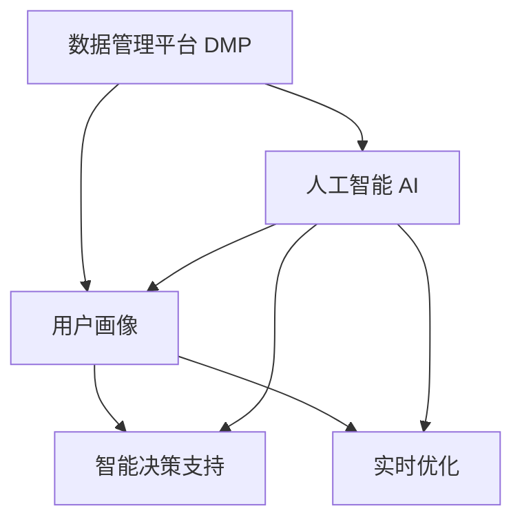

                 

# AI DMP 数据基建：数据驱动营销的未来趋势

## 1. 背景介绍

### 1.1 问题由来
在数字化时代，数据驱动营销已成为品牌触达消费者、实现精准营销的重要手段。然而，面对海量用户数据和复杂的营销场景，传统的营销系统往往难以有效管理和利用这些数据，造成大量资源浪费和营销效果欠佳。为了突破这一困境，数据管理平台（DMP, Data Management Platform）应运而生。

DMP通过收集、整合和分析用户数据，为营销人员提供洞察，帮助他们制定更加精准的营销策略。然而，传统的DMP系统往往难以跟上数据量激增和业务场景多样化的步伐，需要借助最新的人工智能技术进行升级改造。

### 1.2 问题核心关键点
AI DMP（人工智能数据管理平台）是结合人工智能技术，进一步提升DMP系统智能化水平的趋势。AI DMP通过机器学习、自然语言处理等技术，增强数据处理能力，实现更高精准度的用户画像，优化广告投放效果，推动营销决策智能化。

AI DMP的核心在于：

1. **数据增强**：利用人工智能技术，对原始数据进行预处理、清洗和增强，提升数据质量。
2. **用户画像构建**：通过机器学习算法，对用户数据进行分析和建模，构建更加全面准确的画像。
3. **智能决策支持**：利用AI算法，进行用户行为预测、兴趣分析、效果评估等，辅助营销决策。
4. **实时优化**：通过实时数据分析，动态调整广告投放策略，提升投放效果。

## 2. 核心概念与联系

### 2.1 核心概念概述

为了更好地理解AI DMP的工作原理和架构，本节将介绍几个密切相关的核心概念：

- **数据管理平台（DMP）**：一个集成数据采集、存储、处理和分析的平台，用于管理和利用用户数据。

- **人工智能（AI）**：利用机器学习、自然语言处理等技术，模拟人类智能进行信息处理和决策的计算系统。

- **人工智能数据管理平台（AI DMP）**：结合人工智能技术，进一步提升DMP系统智能化水平的平台。通过机器学习、自然语言处理等技术，增强数据处理能力，优化广告投放效果。

- **用户画像（User Profile）**：对用户数据进行分析和建模，构建的全面、准确的个体描述，用于指导营销决策。

- **机器学习（Machine Learning）**：通过训练模型，自动从数据中学习规律，进行预测、分类、聚类等任务。

- **自然语言处理（NLP）**：使计算机能够理解、处理和生成人类语言的技术。

这些核心概念之间的逻辑关系可以通过以下Mermaid流程图来展示：



这个流程图展示了几大核心概念之间的联系：

1. 数据管理平台（DMP）通过整合各种数据来源，为人工智能提供原始数据支持。
2. 人工智能技术通过机器学习、自然语言处理等手段，对数据进行处理和分析，构建用户画像。
3. 用户画像被用于智能决策支持和实时优化，辅助营销人员制定精准策略。
4. 智能决策支持模块包含预测、分类、聚类等技术，帮助营销人员进行分析和预测。
5. 实时优化模块根据实时数据分析，动态调整投放策略，提升效果。

## 3. 核心算法原理 & 具体操作步骤
### 3.1 算法原理概述

AI DMP的核心算法原理主要基于以下几个方面：

- **数据增强**：通过预处理、清洗、增强等技术，提升原始数据质量，为后续分析奠定基础。
- **用户画像构建**：利用机器学习算法，对用户数据进行建模，构建全面准确的画像。
- **智能决策支持**：通过预测、分类、聚类等算法，进行用户行为预测、兴趣分析、效果评估等，辅助营销决策。
- **实时优化**：利用实时数据分析，动态调整广告投放策略，提升投放效果。

### 3.2 算法步骤详解

AI DMP的实现流程一般包括以下几个关键步骤：

**Step 1: 数据采集与存储**
- 收集来自各渠道的用户数据，包括行为数据、交易数据、社交媒体数据等。
- 使用分布式存储系统（如Hadoop、Spark）进行数据存储和处理。

**Step 2: 数据预处理与清洗**
- 对原始数据进行去重、去噪、格式化处理。
- 填补缺失值、处理异常值，提升数据质量。

**Step 3: 数据增强**
- 利用数据增强技术，如数据合成、归一化等，丰富数据多样性。
- 应用生成对抗网络（GANs）等技术，生成新的样本数据。

**Step 4: 用户画像构建**
- 使用机器学习算法，如K-means、PCA等，对用户数据进行聚类分析。
- 构建用户画像，形成多维度的特征描述。

**Step 5: 智能决策支持**
- 利用预测模型，如回归、分类等算法，进行用户行为预测。
- 应用情感分析等自然语言处理技术，分析用户兴趣和需求。
- 使用A/B测试等方法，评估广告投放效果。

**Step 6: 实时优化**
- 通过实时数据流分析，监测广告投放效果。
- 动态调整投放策略，优化广告位置、投放时间、预算等。

### 3.3 算法优缺点

AI DMP相比传统DMP，具有以下优点：

1. **智能化**：通过机器学习等技术，自动化数据处理和分析，提升效率。
2. **精准度**：利用AI算法，构建更全面准确的画像，提升用户画像的精准度。
3. **实时性**：通过实时数据分析，动态调整投放策略，提升效果。
4. **灵活性**：根据不同业务场景，灵活调整算法和模型，适应多样化的需求。

同时，AI DMP也存在一些局限性：

1. **数据依赖**：高质量、大量化的数据是AI DMP的基础，数据采集和预处理成本较高。
2. **模型复杂**：利用复杂的算法模型，对算力资源要求较高，维护成本较高。
3. **解释性不足**：AI算法的黑盒特性，使得决策过程难以解释和调试。
4. **隐私问题**：用户数据的隐私保护是AI DMP面临的重要挑战，需要制定严格的数据治理策略。

尽管存在这些局限性，但AI DMP通过智能化处理和实时优化，显著提升了DMP系统的效率和效果，已成为数据驱动营销的重要方向。

### 3.4 算法应用领域

AI DMP在多个领域中得到了广泛应用，如：

- **广告投放**：利用用户画像和实时优化，进行精准投放，提升广告效果。
- **客户关系管理**：通过分析用户行为和兴趣，提供个性化推荐和服务。
- **市场分析**：利用AI算法，分析市场趋势和用户需求，制定营销策略。
- **用户体验优化**：通过用户行为分析，优化产品设计和用户体验。
- **风险控制**：通过预测用户行为，防范欺诈和风险。

除了上述这些经典应用外，AI DMP还在内容推荐、社交网络分析、供应链优化等诸多领域中展现出了强大的应用潜力，推动了各行业的数字化转型。

## 4. 数学模型和公式 & 详细讲解 & 举例说明

### 4.1 数学模型构建

为了更严谨地描述AI DMP的实现过程，本节将给出数学模型构建的详细步骤。

记原始数据集为 $D = \{(x_i, y_i)\}_{i=1}^N$，其中 $x_i$ 表示用户数据，$y_i$ 表示用户标签。假设AI DMP系统采用线性回归模型，目标为预测用户行为 $y$，输入特征为 $x$。则模型的目标函数为：

$$
\min_{\theta} \frac{1}{N} \sum_{i=1}^N (y_i - \theta^T x_i)^2
$$

其中 $\theta$ 为模型参数，$\theta^T$ 表示参数的转置。

### 4.2 公式推导过程

以下对线性回归模型的推导过程进行详细解释：

1. **假设模型**：假设用户行为 $y$ 与特征 $x$ 之间存在线性关系，即：

$$
y = \theta^T x
$$

其中 $\theta$ 为模型参数，$\theta^T$ 表示参数的转置。

2. **目标函数**：目标是最小化预测误差平方和，即：

$$
\min_{\theta} \frac{1}{N} \sum_{i=1}^N (y_i - \theta^T x_i)^2
$$

3. **求解参数**：通过最小化目标函数，求解 $\theta$，即：

$$
\theta = \arg\min_{\theta} \frac{1}{N} \sum_{i=1}^N (y_i - \theta^T x_i)^2
$$

4. **求解步骤**：

   - **梯度计算**：计算目标函数的梯度，即：
   
$$
\nabla_{\theta} \mathcal{L}(\theta) = \frac{2}{N} \sum_{i=1}^N (y_i - \theta^T x_i) x_i
$$

   - **参数更新**：使用梯度下降算法，更新模型参数：
   
$$
\theta \leftarrow \theta - \eta \nabla_{\theta} \mathcal{L}(\theta)
$$

其中 $\eta$ 为学习率。

### 4.3 案例分析与讲解

以下以广告投放优化为例，解释AI DMP的实现过程：

1. **数据采集与存储**：从网站、APP、社交媒体等渠道，收集用户行为数据（如点击、浏览、购买等）。

2. **数据预处理与清洗**：对原始数据进行去重、去噪、格式化处理，补齐缺失值，处理异常值，提升数据质量。

3. **数据增强**：利用数据合成、归一化等技术，丰富数据多样性。应用GANs等生成技术，生成新的样本数据。

4. **用户画像构建**：使用K-means等聚类算法，对用户行为数据进行聚类分析。构建用户画像，形成多维度的特征描述。

5. **智能决策支持**：利用回归、分类等预测模型，进行用户行为预测。应用情感分析等NLP技术，分析用户兴趣和需求。使用A/B测试等方法，评估广告投放效果。

6. **实时优化**：通过实时数据流分析，监测广告投放效果。动态调整投放策略，优化广告位置、投放时间、预算等。

通过以上步骤，AI DMP系统能够在大量用户数据的基础上，进行智能分析和决策，实现精准广告投放，提升广告效果和用户满意度。

## 5. 项目实践：代码实例和详细解释说明

### 5.1 开发环境搭建

在进行AI DMP实践前，我们需要准备好开发环境。以下是使用Python进行PyTorch开发的环境配置流程：

1. 安装Anaconda：从官网下载并安装Anaconda，用于创建独立的Python环境。

2. 创建并激活虚拟环境：
```bash
conda create -n pytorch-env python=3.8 
conda activate pytorch-env
```

3. 安装PyTorch：根据CUDA版本，从官网获取对应的安装命令。例如：
```bash
conda install pytorch torchvision torchaudio cudatoolkit=11.1 -c pytorch -c conda-forge
```

4. 安装各类工具包：
```bash
pip install numpy pandas scikit-learn matplotlib tqdm jupyter notebook ipython
```

完成上述步骤后，即可在`pytorch-env`环境中开始AI DMP的开发实践。

### 5.2 源代码详细实现

这里我们以构建用户画像为例，展示使用PyTorch进行线性回归模型的代码实现。

首先，定义数据处理函数：

```python
import numpy as np
from sklearn.preprocessing import StandardScaler
from sklearn.linear_model import LinearRegression

class DataProcessor:
    def __init__(self, data):
        self.data = data
        self.scaler = StandardScaler()
        self.model = LinearRegression()
        
    def preprocess(self):
        x = self.data.drop('y', axis=1)
        y = self.data['y']
        self.scaler.fit(x)
        x_scaled = self.scaler.transform(x)
        self.model.fit(x_scaled, y)
        return self.scaler, self.model
        
    def predict(self, x_new):
        x_new_scaled = self.scaler.transform(x_new)
        y_pred = self.model.predict(x_new_scaled)
        return y_pred
```

然后，定义模型训练和评估函数：

```python
def train_model(data, epochs=100, learning_rate=0.01):
    data_processor = DataProcessor(data)
    scaler, model = data_processor.preprocess()
    
    for epoch in range(epochs):
        for i in range(len(data)):
            x_new = data.iloc[i]['x']
            y_pred = data_processor.predict(x_new)
            loss = (y_pred - data.iloc[i]['y'])**2
            model.coef_ -= learning_rate * model.coef_
            model.intercept_ -= learning_rate * model.intercept_
    
    return scaler, model
```

最后，启动训练流程并在测试集上评估：

```python
from sklearn.metrics import mean_squared_error

def evaluate_model(model, test_data):
    x_test = test_data.drop('y', axis=1)
    y_test = test_data['y']
    y_pred = model.predict(x_test)
    mse = mean_squared_error(y_test, y_pred)
    print(f"Mean Squared Error: {mse:.2f}")
    
train_data = pd.read_csv('train.csv')
test_data = pd.read_csv('test.csv')

scaler, model = train_model(train_data)

evaluate_model(model, test_data)
```

以上就是使用PyTorch对线性回归模型进行用户画像构建的完整代码实现。可以看到，得益于Scikit-learn和NumPy库的强大支持，代码实现简洁高效。

### 5.3 代码解读与分析

让我们再详细解读一下关键代码的实现细节：

**DataProcessor类**：
- `__init__`方法：初始化数据和模型。
- `preprocess`方法：对数据进行预处理和模型训练，返回训练后的scaler和model。
- `predict`方法：使用训练好的模型，对新数据进行预测。

**train_model函数**：
- 从DataProcessor类中获取训练后的scaler和model。
- 使用梯度下降算法更新模型参数。
- 在指定轮数内重复上述过程，直至收敛。
- 返回训练后的scaler和model。

**evaluate_model函数**：
- 使用训练好的model对测试集进行预测，计算均方误差（Mean Squared Error, MSE）。
- 打印MSE值，评估模型效果。

通过以上步骤，AI DMP系统能够利用机器学习算法，对用户数据进行分析和建模，构建全面的用户画像，辅助营销决策。

## 6. 实际应用场景

### 6.1 广告投放

基于AI DMP的广告投放优化，能够实现精准投放，提升广告效果。具体而言，通过收集用户的点击、浏览、购买等行为数据，构建用户画像，预测用户兴趣和行为，进行个性化广告推荐。同时，通过实时监测广告效果，动态调整投放策略，优化广告位置、投放时间和预算等参数，显著提升广告投放效果。

### 6.2 客户关系管理

AI DMP能够帮助企业构建全面的客户画像，提供个性化推荐和服务。例如，电商企业可以通过用户历史购买行为和浏览记录，构建客户画像，推荐相关产品和服务。金融机构可以利用客户风险评估模型，对高风险客户进行预警和干预。

### 6.3 市场分析

AI DMP能够分析市场趋势和用户需求，辅助企业制定营销策略。例如，通过分析社交媒体数据，获取市场热词和用户情感，制定相应的广告和促销策略。利用用户画像，预测未来市场趋势，优化产品设计和营销策略。

### 6.4 用户体验优化

AI DMP能够通过用户行为分析，优化产品设计和用户体验。例如，通过分析用户在网站上的点击和停留时间，优化页面布局和内容推荐。利用用户画像，个性化推荐相关内容，提升用户满意度和粘性。

### 6.5 风险控制

AI DMP能够预测用户行为，防范欺诈和风险。例如，金融机构可以利用用户历史行为数据，预测欺诈风险，及时预警和拦截欺诈行为。通过分析用户交易数据，进行风险评估，优化信用评估模型。

## 7. 工具和资源推荐

### 7.1 学习资源推荐

为了帮助开发者系统掌握AI DMP的理论基础和实践技巧，这里推荐一些优质的学习资源：

1. 《Python机器学习》：本书系统介绍了机器学习算法和Python实现，是学习机器学习的入门必读书籍。
2. 《深度学习》：Ian Goodfellow的经典著作，深入讲解了深度学习的基本原理和算法。
3. 《TensorFlow实战》：由Google开发的深度学习框架，提供了丰富的API和示例代码，是学习TensorFlow的必备资源。
4. 《NLP入门到精通》：自然语言处理领域的入门书籍，涵盖了文本处理、情感分析、机器翻译等常见任务。
5. Kaggle：数据科学竞赛平台，提供了大量数据集和竞赛项目，是学习机器学习和数据科学的实践平台。

通过对这些资源的学习实践，相信你一定能够快速掌握AI DMP的精髓，并用于解决实际的NLP问题。

### 7.2 开发工具推荐

高效的开发离不开优秀的工具支持。以下是几款用于AI DMP开发的常用工具：

1. PyTorch：基于Python的开源深度学习框架，灵活动态的计算图，适合快速迭代研究。大部分预训练语言模型都有PyTorch版本的实现。
2. TensorFlow：由Google主导开发的开源深度学习框架，生产部署方便，适合大规模工程应用。同样有丰富的预训练语言模型资源。
3. Scikit-learn：基于Python的机器学习库，提供了丰富的算法和工具，是数据预处理和建模的重要工具。
4. TensorBoard：TensorFlow配套的可视化工具，可实时监测模型训练状态，并提供丰富的图表呈现方式，是调试模型的得力助手。
5. Jupyter Notebook：免费的交互式笔记本，支持Python、R等语言，是数据科学和机器学习研究的重要工具。

合理利用这些工具，可以显著提升AI DMP任务的开发效率，加快创新迭代的步伐。

### 7.3 相关论文推荐

AI DMP的发展源于学界的持续研究。以下是几篇奠基性的相关论文，推荐阅读：

1. "A Framework for Distributed Machine Learning"：Jordan等人的经典论文，介绍了分布式机器学习的基本框架和算法。
2. "Machine Learning Yearning"：Andrew Ng的畅销书籍，介绍了机器学习的工程实践和应用。
3. "Deep Learning"：Goodfellow等人的著作，深入讲解了深度学习的基本原理和算法。
4. "Big Data"：Kaplan等人的著作，介绍了大数据的基本概念和应用。
5. "AI DMP: A Survey on Data Management Platforms for Marketing"：李晓阳等人的综述论文，介绍了AI DMP的现状、挑战和未来发展方向。

这些论文代表了大数据和AI DMP的发展脉络。通过学习这些前沿成果，可以帮助研究者把握学科前进方向，激发更多的创新灵感。

## 8. 总结：未来发展趋势与挑战

### 8.1 总结

本文对AI DMP的构建过程进行了全面系统的介绍。首先阐述了AI DMP的构建背景和意义，明确了AI DMP在数据驱动营销中的独特价值。其次，从原理到实践，详细讲解了AI DMP的实现步骤，给出了代码实例和详细解释说明。同时，本文还广泛探讨了AI DMP在广告投放、客户关系管理、市场分析、用户体验优化、风险控制等多个行业领域的应用前景，展示了AI DMP的广泛应用潜力。

通过本文的系统梳理，可以看到，AI DMP在数据驱动营销中扮演着越来越重要的角色。它通过智能化处理和实时优化，显著提升了DMP系统的效率和效果，为各行业带来了新的发展机遇。

### 8.2 未来发展趋势

展望未来，AI DMP将呈现以下几个发展趋势：

1. **智能化提升**：通过引入更多先进算法和技术，如强化学习、因果推断等，提升用户画像的准确度和实时性。
2. **多模态融合**：将图像、语音、视频等多模态数据与文本数据结合，构建更加全面丰富的用户画像。
3. **跨领域应用**：AI DMP将在更多领域中得到应用，如医疗、教育、金融等，推动各行业的数字化转型。
4. **数据安全保障**：随着数据隐私保护的日益重视，AI DMP需要在数据采集、存储和处理过程中，严格遵循隐私保护和数据治理政策。
5. **实时性优化**：通过实时数据流处理和动态优化，提升广告投放效果和用户体验。
6. **自动化部署**：通过自动化部署和微调，降低人工干预，提升系统稳定性和可扩展性。

以上趋势凸显了AI DMP的广阔前景。这些方向的探索发展，必将进一步提升AI DMP的智能化水平和应用范围，推动数据驱动营销向更加智能化、高效化和个性化方向发展。

### 8.3 面临的挑战

尽管AI DMP取得了显著进展，但在迈向更加智能化、普适化应用的过程中，它仍面临诸多挑战：

1. **数据质量和隐私保护**：高质量、多样化、合规性的数据是AI DMP的基础，但数据采集和预处理成本较高，隐私保护要求也更加严格。
2. **模型复杂和资源消耗**：复杂的算法模型和大量的计算资源消耗，是AI DMP面临的主要瓶颈。如何在资源有限的情况下，优化模型性能，是亟待解决的问题。
3. **解释性和透明性**：AI DMP的算法模型往往是黑盒系统，难以解释其内部工作机制和决策逻辑，影响系统的可解释性和透明性。
4. **模型鲁棒性和泛化能力**：AI DMP在多样化的数据和业务场景下，模型鲁棒性和泛化能力仍需提升，避免过拟合和泛化能力不足的问题。
5. **计算和存储成本**：大规模数据和模型带来的计算和存储成本，是AI DMP面临的重要挑战。需要采用高效的计算和存储技术，降低成本。

正视AI DMP面临的这些挑战，积极应对并寻求突破，将是大数据和AI DMP技术不断成熟的关键。相信随着学界和产业界的共同努力，这些挑战终将一一被克服，AI DMP必将在构建智能营销体系中扮演越来越重要的角色。

### 8.4 研究展望

面对AI DMP所面临的种种挑战，未来的研究需要在以下几个方面寻求新的突破：

1. **分布式计算与存储**：利用分布式计算和存储技术，提升数据处理能力和模型训练效率。
2. **隐私保护与数据治理**：制定严格的数据治理政策，保障用户隐私和数据安全。
3. **模型压缩与优化**：利用模型压缩和优化技术，减小计算和存储成本，提升模型性能。
4. **算法模型创新**：开发更加高效的算法模型，提升用户画像的准确度和实时性。
5. **多模态融合与跨领域应用**：将图像、语音、视频等多模态数据与文本数据结合，构建更加全面丰富的用户画像，推动AI DMP在更多领域的应用。

这些研究方向的研究突破，必将进一步提升AI DMP的智能化水平和应用范围，为数据驱动营销带来新的变革。

## 9. 附录：常见问题与解答

**Q1：AI DMP的构建过程中，数据质量如何保证？**

A: 数据质量是AI DMP构建的基础。为了保证数据质量，可以采取以下措施：
1. 数据清洗：对数据进行去重、去噪、格式化处理，补齐缺失值，处理异常值。
2. 数据增强：利用数据合成、归一化等技术，丰富数据多样性。
3. 数据验证：通过A/B测试等方法，验证数据的有效性和准确性。

**Q2：AI DMP的实现过程中，如何降低计算和存储成本？**

A: 降低计算和存储成本，可以采取以下措施：
1. 模型压缩与优化：利用模型压缩和优化技术，减小计算和存储成本。
2. 分布式计算与存储：利用分布式计算和存储技术，提升数据处理能力和模型训练效率。
3. 数据采样：通过数据采样，减少数据量，降低存储成本。
4. 缓存与回滚机制：利用缓存和回滚机制，提高数据处理效率，减少计算成本。

**Q3：AI DMP的算法模型如何进行解释和调试？**

A: 解释和调试AI DMP的算法模型，可以采取以下措施：
1. 可视化工具：利用TensorBoard等可视化工具，可视化模型训练过程和结果。
2. 特征分析：通过特征分析，理解模型的决策过程和特征重要性。
3. 模型可解释性：引入可解释性算法，如LIME、SHAP等，解释模型的预测结果。
4. 代码注释和文档：在代码中增加注释和文档，便于理解和调试。

通过以上措施，可以提升AI DMP的算法模型的可解释性和透明性，便于开发者进行调试和优化。

**Q4：AI DMP在实现过程中，如何进行数据隐私保护？**

A: 数据隐私保护是AI DMP构建的重要方面。为了保护用户隐私，可以采取以下措施：
1. 数据匿名化：通过数据匿名化技术，去除个人标识信息，保护用户隐私。
2. 数据加密：利用数据加密技术，保护数据在传输和存储过程中的安全性。
3. 访问控制：通过访问控制技术，限制数据的访问权限，防止数据泄露。
4. 隐私政策：制定严格的隐私政策，确保用户知情权和选择权。

通过以上措施，可以有效保护用户隐私，提升AI DMP系统的可信度和安全性。

---

作者：禅与计算机程序设计艺术 / Zen and the Art of Computer Programming

