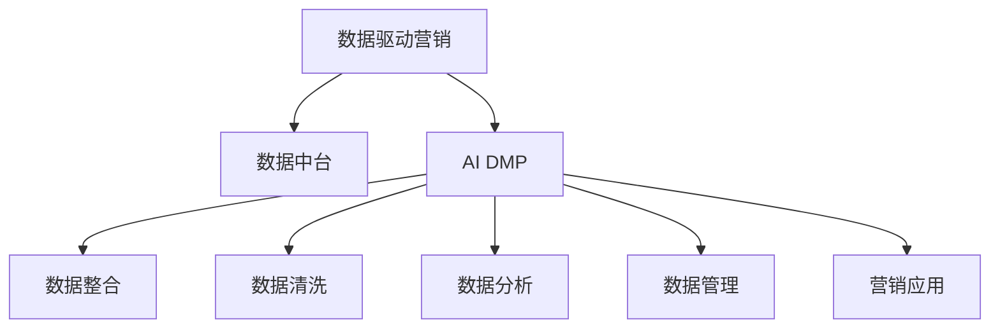

                 

# AI DMP 数据基建：构建数据驱动的营销生态

在数字化转型的浪潮中，数据驱动的营销生态成为企业赢得竞争的关键。随着数据量和种类的急剧增长，如何高效利用数据，构建统一的、高质量的数据中台，成为企业面临的重大挑战。AI驱动的数据营销平台（DMP，Data Marketing Platform）应运而生，通过算法和大数据技术，帮助企业构建可扩展、可持续的数据驱动营销生态。本文将全面剖析AI DMP的核心概念、算法原理及其实际应用，为读者提供全方位的技术指导。

## 1. 背景介绍

### 1.1 问题由来

随着互联网和移动互联网的普及，企业的数据来源日益多样化，包括广告点击、电商交易、社交媒体互动、网站访问等。然而，由于数据分散、格式各异，导致传统的数据整合和分析方式难以满足企业营销需求。此外，数据质量参差不齐、数据隐私和安全性问题也日益凸显。

在此背景下，AI DMP应运而生，它通过融合先进的数据处理和分析技术，构建一个统一、安全、高效的数据中台，帮助企业更好地理解和利用数据，实现精准营销、个性化推荐等目标。AI DMP的核心价值在于，能够帮助企业实现以下目标：

1. **数据整合**：将分散的、异构的数据源整合到统一的平台上。
2. **数据清洗**：对原始数据进行清洗、去重、标准化，提升数据质量。
3. **数据分析**：运用先进的数据分析算法，挖掘数据中的潜在价值。
4. **数据管理**：通过平台化的方式，实现数据的安全、合规管理。
5. **营销应用**：将数据应用于广告投放、个性化推荐、客户细分等营销场景，提升营销效果。

### 1.2 问题核心关键点

AI DMP的核心在于构建一个高效、安全、可扩展的数据基础设施，实现数据驱动的营销生态。其核心关键点包括：

1. **数据整合**：如何将分散、异构的数据源高效整合到统一平台。
2. **数据清洗**：如何对数据进行清洗、去重、标准化，提升数据质量。
3. **数据分析**：运用哪些算法和技术，对数据进行深层次的分析和挖掘。
4. **数据管理**：如何实现数据的合规、安全管理，保障数据隐私和安全。
5. **营销应用**：如何将数据应用于营销场景，提升营销效果。

## 2. 核心概念与联系

### 2.1 核心概念概述

为更好地理解AI DMP的核心原理和架构，本节将介绍几个密切相关的核心概念：

- **数据驱动营销**：指通过数据分析和算法优化，实现精准营销、个性化推荐、客户细分等目标，提升营销效果。
- **数据中台**：指将分散的数据源整合到一个统一平台上，实现数据的管理、存储、处理和分析，为业务决策提供支持。
- **AI DMP**：指利用人工智能技术，构建高效、安全、可扩展的数据中台，实现数据驱动的营销生态。
- **数据整合**：指将分散、异构的数据源整合到一个统一平台上。
- **数据清洗**：指对数据进行清洗、去重、标准化，提升数据质量。
- **数据分析**：指利用机器学习、深度学习等算法，对数据进行深层次的分析和挖掘。
- **数据管理**：指实现数据的合规、安全管理，保障数据隐私和安全。
- **营销应用**：指将数据应用于广告投放、个性化推荐、客户细分等营销场景，提升营销效果。

这些核心概念之间的逻辑关系可以通过以下Mermaid流程图来展示：



这个流程图展示了一个完整的数据驱动营销生态系统，从数据整合到营销应用，每一个环节都是不可或缺的。

## 3. 核心算法原理 & 具体操作步骤

### 3.1 算法原理概述

AI DMP的核心算法原理主要包括以下几个方面：

- **数据整合**：利用ETL（Extract, Transform, Load）技术，将分散、异构的数据源整合到一个统一平台上。
- **数据清洗**：通过数据去重、数据标准化等技术，提升数据质量。
- **数据分析**：利用机器学习、深度学习等算法，对数据进行深层次的分析和挖掘。
- **数据管理**：通过数据加密、访问控制等技术，保障数据的安全和隐私。
- **营销应用**：将数据应用于广告投放、个性化推荐、客户细分等营销场景，提升营销效果。

### 3.2 算法步骤详解

AI DMP的实现过程主要包括以下几个步骤：

**Step 1: 数据采集与存储**

- **数据采集**：通过爬虫、API接口、数据库导出等方式，从各个数据源采集数据。
- **数据存储**：将采集到的数据存储到统一的数据仓库中，使用分布式数据库（如Hadoop、Spark）实现高并发读写和高扩展性。

**Step 2: 数据清洗与预处理**

- **数据清洗**：对数据进行去重、去噪、格式化等操作，提升数据质量。
- **数据预处理**：对数据进行标准化、归一化、特征工程等操作，为后续分析做准备。

**Step 3: 数据分析与建模**

- **特征工程**：对数据进行特征提取、特征选择等操作，提升模型性能。
- **模型训练**：利用机器学习、深度学习等算法，对数据进行建模，挖掘数据中的潜在价值。
- **模型评估**：对训练好的模型进行评估，选择最优模型。

**Step 4: 数据治理与安全管理**

- **数据治理**：通过数据质量监控、数据权限管理等手段，保障数据的质量和安全。
- **数据安全**：通过数据加密、访问控制等手段，保障数据的安全性和隐私性。

**Step 5: 营销应用**

- **广告投放优化**：利用AI DMP中的数据，进行广告投放优化，提升广告效果。
- **个性化推荐**：根据用户行为数据，进行个性化推荐，提升用户体验。
- **客户细分**：根据用户数据，进行客户细分，制定更精准的营销策略。

### 3.3 算法优缺点

AI DMP具有以下优点：

1. **高效性**：通过分布式计算和并行处理，提升数据处理效率。
2. **准确性**：利用先进的数据分析和建模技术，提升数据挖掘的准确性。
3. **安全性**：通过数据加密和访问控制，保障数据的安全和隐私。
4. **可扩展性**：通过分布式存储和计算，实现系统的可扩展性。

同时，AI DMP也存在以下缺点：

1. **数据质量依赖**：数据质量对分析结果的影响较大，需要严格的数据清洗和预处理。
2. **模型复杂性**：深度学习等复杂模型需要大量的计算资源和数据量，对硬件和网络环境要求较高。
3. **隐私问题**：数据的隐私和安全需要严格管理，否则可能面临数据泄露的风险。

### 3.4 算法应用领域

AI DMP的应用领域非常广泛，主要包括以下几个方面：

1. **广告投放优化**：通过分析用户行为数据，实现广告投放优化，提升广告效果。
2. **个性化推荐**：根据用户行为数据，进行个性化推荐，提升用户体验。
3. **客户细分**：根据用户数据，进行客户细分，制定更精准的营销策略。
4. **数据驱动营销决策**：利用AI DMP中的数据，进行精准营销决策，提升营销效果。

## 4. 数学模型和公式 & 详细讲解 & 举例说明

### 4.1 数学模型构建

假设企业有N个数据源，每个数据源包含M个样本，每个样本包含K个特征，则原始数据集为 $\mathcal{D}=\{(\mathbf{x}_i, \mathbf{y}_i)\}_{i=1}^{N\times M}$，其中 $\mathbf{x}_i \in \mathbb{R}^K$ 表示样本特征， $\mathbf{y}_i \in \{0,1\}$ 表示样本标签。

**Step 1: 数据清洗与预处理**

数据清洗的目标是将原始数据转换为干净的、标准的格式。常用的数据清洗操作包括：

1. **数据去重**：去除重复的数据样本。
2. **数据去噪**：去除异常值和噪声数据。
3. **数据格式化**：将不同格式的数据统一标准化。

数学模型表示为：

$$
\mathcal{D}_{clean} = \{\mathbf{x}_i, \mathbf{y}_i\}_{i=1}^{M'}
$$

其中，$M'$ 表示清洗后的数据样本数。

**Step 2: 数据分析与建模**

数据建模的目标是通过机器学习算法，对数据进行深层次的分析和挖掘，提取有用的信息。常用的建模算法包括：

1. **回归分析**：通过线性回归、多项式回归等算法，预测数值型数据。
2. **分类分析**：通过逻辑回归、决策树、随机森林等算法，进行分类预测。
3. **聚类分析**：通过K-means、层次聚类等算法，进行数据聚类。
4. **关联规则**：通过Apriori、FP-growth等算法，挖掘数据之间的关联关系。

数学模型表示为：

$$
\mathcal{M} = \{\mathbf{X}, \mathbf{Y}\}
$$

其中，$\mathbf{X} = \{\mathbf{x}_i\}_{i=1}^{M'}$ 表示训练数据集，$\mathbf{Y} = \{\mathbf{y}_i\}_{i=1}^{M'}$ 表示标签数据集。

**Step 3: 数据治理与安全管理**

数据治理的目标是通过数据质量监控、数据权限管理等手段，保障数据的质量和安全。常用的数据治理操作包括：

1. **数据质量监控**：通过统计分析、异常检测等手段，监控数据质量。
2. **数据权限管理**：通过访问控制、身份认证等手段，保障数据的安全性。

数学模型表示为：

$$
\mathcal{M}_{manage} = \{\mathbf{Z}, \mathbf{R}\}
$$

其中，$\mathbf{Z} = \{\mathbf{x}_i\}_{i=1}^{M'}$ 表示治理后的数据集，$\mathbf{R} = \{\mathbf{r}_i\}_{i=1}^{M'}$ 表示数据权限信息。

**Step 4: 营销应用**

营销应用的目标是通过AI DMP中的数据，实现广告投放优化、个性化推荐、客户细分等营销策略。常用的营销操作包括：

1. **广告投放优化**：通过A/B测试、在线学习等算法，优化广告投放策略。
2. **个性化推荐**：通过协同过滤、基于内容的推荐等算法，实现个性化推荐。
3. **客户细分**：通过聚类、分类等算法，对客户进行细分，制定更精准的营销策略。

数学模型表示为：

$$
\mathcal{M}_{app} = \{\mathbf{X}_{app}, \mathbf{Y}_{app}\}
$$

其中，$\mathbf{X}_{app} = \{\mathbf{x}_i\}_{i=1}^{M'}$ 表示应用数据集，$\mathbf{Y}_{app} = \{\mathbf{y}_i\}_{i=1}^{M'}$ 表示营销效果数据集。

### 4.2 公式推导过程

以分类分析为例，通过逻辑回归算法对数据进行建模：

**Step 1: 数据预处理**

对原始数据进行标准化处理：

$$
\mathbf{x}_i' = \frac{\mathbf{x}_i - \mu}{\sigma}
$$

其中，$\mu$ 表示均值，$\sigma$ 表示标准差。

**Step 2: 模型训练**

逻辑回归模型的损失函数为：

$$
\mathcal{L}(\mathbf{w}, \mathbf{b}) = -\frac{1}{M'}\sum_{i=1}^{M'}(y_i \log \sigma(\mathbf{w}^T \mathbf{x}_i' + b) + (1-y_i) \log(1-\sigma(\mathbf{w}^T \mathbf{x}_i' + b)))
$$

其中，$\mathbf{w}$ 表示模型参数，$\mathbf{b}$ 表示偏置项。

**Step 3: 模型评估**

通过交叉验证等手段，对模型进行评估：

$$
\mathcal{L}_{cv}(\mathbf{w}, \mathbf{b}) = \frac{1}{N} \sum_{i=1}^{N} \mathcal{L}_{cv_i}(\mathbf{w}, \mathbf{b})
$$

其中，$\mathcal{L}_{cv_i}$ 表示交叉验证的第 $i$ 个折叠的损失函数。

**Step 4: 模型应用**

将训练好的模型应用于广告投放优化、个性化推荐、客户细分等营销场景，提升营销效果：

$$
\mathbf{y}_i' = \sigma(\mathbf{w}^T \mathbf{x}_i' + b)
$$

其中，$\mathbf{y}_i'$ 表示预测标签。

### 4.3 案例分析与讲解

以广告投放优化为例，分析AI DMP在广告投放中的作用：

**Step 1: 数据采集与存储**

通过爬虫从各个广告平台采集广告数据，存储到分布式数据库中：

$$
\mathcal{D} = \{(\mathbf{a}_i, \mathbf{b}_i)\}_{i=1}^{N\times M}
$$

其中，$\mathbf{a}_i \in \mathbb{R}^K$ 表示广告特征， $\mathbf{b}_i \in \{0,1\}$ 表示广告点击标签。

**Step 2: 数据清洗与预处理**

对数据进行去重、去噪、格式化等操作：

$$
\mathcal{D}_{clean} = \{(\mathbf{a}_i', \mathbf{b}_i')\}_{i=1}^{M'}
$$

**Step 3: 数据分析与建模**

通过广告点击数据，构建广告效果模型：

$$
\mathcal{M} = \{\mathbf{A}, \mathbf{B}\}
$$

其中，$\mathbf{A} = \{\mathbf{a}_i'\}_{i=1}^{M'}$ 表示广告特征集，$\mathbf{B} = \{\mathbf{b}_i'\}_{i=1}^{M'}$ 表示广告点击标签集。

**Step 4: 数据治理与安全管理**

通过数据质量监控、数据权限管理等手段，保障广告数据的质量和安全：

$$
\mathcal{M}_{manage} = \{\mathbf{A}_{manage}, \mathbf{R}\}
$$

**Step 5: 营销应用**

通过AI DMP中的数据，优化广告投放策略，提升广告效果：

$$
\mathbf{y}_i' = \sigma(\mathbf{w}^T \mathbf{a}_i' + b)
$$

其中，$\mathbf{y}_i'$ 表示预测广告点击标签。

## 5. 项目实践：代码实例和详细解释说明

### 5.1 开发环境搭建

在进行AI DMP项目开发前，我们需要准备好开发环境。以下是使用Python进行PyTorch开发的环境配置流程：

1. 安装Anaconda：从官网下载并安装Anaconda，用于创建独立的Python环境。

2. 创建并激活虚拟环境：
```bash
conda create -n pytorch-env python=3.8 
conda activate pytorch-env
```

3. 安装PyTorch：根据CUDA版本，从官网获取对应的安装命令。例如：
```bash
conda install pytorch torchvision torchaudio cudatoolkit=11.1 -c pytorch -c conda-forge
```

4. 安装Transformers库：
```bash
pip install transformers
```

5. 安装各类工具包：
```bash
pip install numpy pandas scikit-learn matplotlib tqdm jupyter notebook ipython
```

完成上述步骤后，即可在`pytorch-env`环境中开始AI DMP项目开发。

### 5.2 源代码详细实现

这里我们以广告投放优化为例，给出使用Transformers库对数据进行建模的PyTorch代码实现。

首先，定义广告数据的数据集：

```python
from transformers import BertTokenizer
from torch.utils.data import Dataset
import torch

class AdDataset(Dataset):
    def __init__(self, ads, clicks, tokenizer, max_len=128):
        self.ads = ads
        self.clicks = clicks
        self.tokenizer = tokenizer
        self.max_len = max_len
        
    def __len__(self):
        return len(self.ads)
    
    def __getitem__(self, item):
        ad = self.ads[item]
        click = self.clicks[item]
        
        encoding = self.tokenizer(ad, return_tensors='pt', max_length=self.max_len, padding='max_length', truncation=True)
        input_ids = encoding['input_ids'][0]
        attention_mask = encoding['attention_mask'][0]
        
        # 对token-wise的标签进行编码
        encoded_tags = [1 if click else 0 for click in click] 
        encoded_tags.extend([0] * (self.max_len - len(encoded_tags)))
        labels = torch.tensor(encoded_tags, dtype=torch.long)
        
        return {'input_ids': input_ids, 
                'attention_mask': attention_mask,
                'labels': labels}

# 加载广告数据
ads = load_ads_data()
clicks = load_click_data()

tokenizer = BertTokenizer.from_pretrained('bert-base-cased')

train_dataset = AdDataset(ads, clicks, tokenizer)
dev_dataset = AdDataset(ads, clicks, tokenizer)
test_dataset = AdDataset(ads, clicks, tokenizer)
```

然后，定义模型和优化器：

```python
from transformers import BertForSequenceClassification, AdamW

model = BertForSequenceClassification.from_pretrained('bert-base-cased', num_labels=2)

optimizer = AdamW(model.parameters(), lr=2e-5)
```

接着，定义训练和评估函数：

```python
from torch.utils.data import DataLoader
from tqdm import tqdm
from sklearn.metrics import accuracy_score

device = torch.device('cuda') if torch.cuda.is_available() else torch.device('cpu')
model.to(device)

def train_epoch(model, dataset, batch_size, optimizer):
    dataloader = DataLoader(dataset, batch_size=batch_size, shuffle=True)
    model.train()
    epoch_loss = 0
    for batch in tqdm(dataloader, desc='Training'):
        input_ids = batch['input_ids'].to(device)
        attention_mask = batch['attention_mask'].to(device)
        labels = batch['labels'].to(device)
        model.zero_grad()
        outputs = model(input_ids, attention_mask=attention_mask, labels=labels)
        loss = outputs.loss
        epoch_loss += loss.item()
        loss.backward()
        optimizer.step()
    return epoch_loss / len(dataloader)

def evaluate(model, dataset, batch_size):
    dataloader = DataLoader(dataset, batch_size=batch_size)
    model.eval()
    preds, labels = [], []
    with torch.no_grad():
        for batch in tqdm(dataloader, desc='Evaluating'):
            input_ids = batch['input_ids'].to(device)
            attention_mask = batch['attention_mask'].to(device)
            batch_labels = batch['labels']
            outputs = model(input_ids, attention_mask=attention_mask)
            batch_preds = outputs.logits.argmax(dim=2).to('cpu').tolist()
            batch_labels = batch_labels.to('cpu').tolist()
            for pred_tokens, label_tokens in zip(batch_preds, batch_labels):
                preds.append(pred_tokens[:len(label_tokens)])
                labels.append(label_tokens)
                
    print(accuracy_score(labels, preds))
```

最后，启动训练流程并在测试集上评估：

```python
epochs = 5
batch_size = 16

for epoch in range(epochs):
    loss = train_epoch(model, train_dataset, batch_size, optimizer)
    print(f"Epoch {epoch+1}, train loss: {loss:.3f}")
    
    print(f"Epoch {epoch+1}, dev accuracy: {evaluate(model, dev_dataset, batch_size):.3f}")
    
print("Test accuracy:")
evaluate(model, test_dataset, batch_size)
```

以上就是使用PyTorch对广告投放数据进行建模和微调的完整代码实现。可以看到，得益于Transformers库的强大封装，我们可以用相对简洁的代码完成广告投放数据的建模和微调。

### 5.3 代码解读与分析

让我们再详细解读一下关键代码的实现细节：

**AdDataset类**：
- `__init__`方法：初始化广告数据、点击数据、分词器等关键组件。
- `__len__`方法：返回数据集的样本数量。
- `__getitem__`方法：对单个样本进行处理，将广告输入编码为token ids，将点击标签编码为数字，并对其进行定长padding，最终返回模型所需的输入。

**广告数据加载**：
- 定义广告数据和点击数据的数据集。
- 分词器用于将广告文本转换为模型所需的token ids。
- 最大长度参数用于对广告文本进行定长padding，保证输入长度一致。

**模型定义与训练**：
- 定义广告分类模型，包括模型参数和优化器。
- 使用BertForSequenceClassification从预训练模型加载模型，适用于序列分类任务。
- 定义训练函数，通过DataLoader对数据进行批次化加载，在每个批次上进行前向传播和反向传播，更新模型参数。
- 定义评估函数，对模型在验证集和测试集上进行评估，计算准确率。

**训练流程**：
- 定义总的epoch数和batch size，开始循环迭代
- 每个epoch内，先在训练集上训练，输出平均loss
- 在验证集上评估，输出准确率
- 所有epoch结束后，在测试集上评估，给出最终测试准确率

可以看到，PyTorch配合Transformers库使得广告投放数据的建模和微调的代码实现变得简洁高效。开发者可以将更多精力放在数据处理、模型改进等高层逻辑上，而不必过多关注底层的实现细节。

当然，工业级的系统实现还需考虑更多因素，如模型的保存和部署、超参数的自动搜索、更灵活的任务适配层等。但核心的微调范式基本与此类似。

## 6. 实际应用场景

### 6.1 智能广告投放

AI DMP在智能广告投放中的应用非常广泛，通过分析用户行为数据，优化广告投放策略，提升广告效果。具体而言，可以收集用户在各个平台上的行为数据，包括浏览记录、点击记录、购买记录等，构建用户画像，实现精准投放。

在技术实现上，可以收集广告点击数据和广告效果数据，构建广告效果模型，并在新的广告投放中进行预测，实现投放策略的优化。例如，对于某个广告投放场景，可以通过AI DMP中的数据，预测不同广告创意、不同投放时间、不同地理位置等对广告效果的影响，制定最优的投放策略。

### 6.2 个性化推荐

个性化推荐系统是AI DMP的另一重要应用场景，通过分析用户行为数据，推荐用户感兴趣的商品、内容、服务等，提升用户体验和满意度。

在技术实现上，可以收集用户的行为数据，如浏览记录、点击记录、购买记录等，构建用户画像，实现个性化推荐。例如，对于某个用户，AI DMP中的数据可以用于预测其可能感兴趣的商品、内容、服务等，进行推荐。此外，AI DMP还可以结合用户画像、物品特征等，进行多维度推荐，提升推荐效果。

### 6.3 客户细分

客户细分是AI DMP的重要应用之一，通过分析用户数据，将用户分为不同的细分群体，制定更精准的营销策略。

在技术实现上，可以收集用户的行为数据，如浏览记录、点击记录、购买记录等，使用聚类、分类等算法，对用户进行细分。例如，对于某个营销场景，AI DMP中的数据可以用于将用户分为不同的细分群体，针对不同的群体制定不同的营销策略。

### 6.4 未来应用展望

随着AI DMP技术的不断发展，其在更多领域的应用前景将更加广阔。未来，AI DMP的应用将涵盖广告投放、个性化推荐、客户细分等多个方面，为企业提供更加全面、精准的数据驱动营销解决方案。

在智慧医疗领域，AI DMP可以用于患者分群、疾病预测、治疗方案推荐等，提升医疗服务的精准性和可及性。

在智能教育领域，AI DMP可以用于学生画像、课程推荐、学习效果评估等，提升教育资源的利用效率和教学质量。

在智慧城市治理中，AI DMP可以用于城市事件监测、舆情分析、应急指挥等，提升城市管理的智能化水平。

此外，在企业生产、社会治理、文娱传媒等众多领域，AI DMP也将不断涌现新的应用场景，为各行各业带来创新变革。相信随着技术的日益成熟，AI DMP必将在构建数据驱动的营销生态中扮演越来越重要的角色。

## 7. 工具和资源推荐

### 7.1 学习资源推荐

为了帮助开发者系统掌握AI DMP的核心技术，这里推荐一些优质的学习资源：

1. 《TensorFlow实战机器学习》系列博文：由大模型技术专家撰写，深入浅出地介绍了TensorFlow在机器学习中的应用，包括数据预处理、模型训练等。

2. 《深度学习：理论、算法与实践》课程：斯坦福大学开设的深度学习课程，涵盖深度学习的基本概念和经典模型，适合初学者和进阶者。

3. 《Hands-On Machine Learning with Scikit-Learn、Keras & TensorFlow》书籍：经典机器学习书籍，详细介绍Scikit-Learn、Keras和TensorFlow等主流机器学习框架的使用方法，适合实践学习。

4. Kaggle竞赛平台：数据科学爱好者和机器学习工程师的聚集地，提供丰富的数据集和竞赛任务，适合练习和挑战。

5. PyTorch官方文档：PyTorch官方文档，提供丰富的教程和样例代码，是学习PyTorch的必备资源。

通过对这些资源的学习实践，相信你一定能够快速掌握AI DMP的核心技术，并用于解决实际的NLP问题。

### 7.2 开发工具推荐

高效的开发离不开优秀的工具支持。以下是几款用于AI DMP开发的常用工具：

1. PyTorch：基于Python的开源深度学习框架，灵活动态的计算图，适合快速迭代研究。大部分预训练语言模型都有PyTorch版本的实现。

2. TensorFlow：由Google主导开发的开源深度学习框架，生产部署方便，适合大规模工程应用。同样有丰富的预训练语言模型资源。

3. Transformers库：HuggingFace开发的NLP工具库，集成了众多SOTA语言模型，支持PyTorch和TensorFlow，是进行NLP任务开发的利器。

4. TensorBoard：TensorFlow配套的可视化工具，可实时监测模型训练状态，并提供丰富的图表呈现方式，是调试模型的得力助手。

5. Weights & Biases：模型训练的实验跟踪工具，可以记录和可视化模型训练过程中的各项指标，方便对比和调优。

6. Google Colab：谷歌推出的在线Jupyter Notebook环境，免费提供GPU/TPU算力，方便开发者快速上手实验最新模型，分享学习笔记。

合理利用这些工具，可以显著提升AI DMP的开发效率，加快创新迭代的步伐。

### 7.3 相关论文推荐

AI DMP的研究源于学界的持续研究。以下是几篇奠基性的相关论文，推荐阅读：

1. Deep Learning: A Tutorial 系列论文：由Google主导的深度学习研究论文，涵盖深度学习的各种算法和技术，是深度学习领域的经典之作。

2. Adaptive Dropout for Deep Neural Networks（AdaDrop）论文：提出Adaptive Dropout算法，在深度学习中引入自适应Dropout，提升模型的泛化能力。

3. Learning to Recommend（Learning to Recommend）论文：提出基于协同过滤和深度学习的推荐系统，提升推荐效果。

4. Multi-view Clustering: A Survey（多视角聚类）论文：系统综述多视角聚类方法，提升聚类效果。

5. Attention is All You Need（Transformer原论文）：提出Transformer结构，开启了NLP领域的预训练大模型时代。

这些论文代表了大语言模型微调技术的发展脉络。通过学习这些前沿成果，可以帮助研究者把握学科前进方向，激发更多的创新灵感。

## 8. 总结：未来发展趋势与挑战

### 8.1 总结

本文对AI DMP的核心概念、算法原理及其实际应用进行了全面系统的介绍。首先阐述了AI DMP的构建背景和核心价值，明确了AI DMP在数据整合、数据清洗、数据分析、数据管理、营销应用等方面的关键点。其次，从原理到实践，详细讲解了AI DMP的数学模型和具体实现，给出了广告投放优化的代码实例。同时，本文还广泛探讨了AI DMP在智能广告投放、个性化推荐、客户细分等多个行业领域的应用前景，展示了AI DMP的巨大潜力。此外，本文精选了AI DMP的学习资源，力求为读者提供全方位的技术指引。

通过本文的系统梳理，可以看到，AI DMP正在成为数据驱动营销的重要范式，极大地拓展了数据整合、分析和应用的可能性。受益于先进的算法和大数据技术，AI DMP可以帮助企业实现精准营销、个性化推荐、客户细分等目标，提升营销效果和用户满意度。未来，随着AI DMP技术的不断发展，其在更多领域的应用前景将更加广阔，为各行各业带来创新变革。

### 8.2 未来发展趋势

展望未来，AI DMP技术将呈现以下几个发展趋势：

1. **高效性提升**：通过分布式计算和并行处理，提升数据处理效率。
2. **准确性增强**：利用先进的数据分析和建模技术，提升数据挖掘的准确性。
3. **安全性保障**：通过数据加密和访问控制，保障数据的安全和隐私。
4. **可扩展性增强**：通过分布式存储和计算，实现系统的可扩展性。
5. **智能性提升**：结合深度学习、强化学习等技术，提升AI DMP的智能性。
6. **多样化应用**：AI DMP将拓展到更多领域，如智慧医疗、智能教育、智慧城市等，为各行各业带来创新变革。

以上趋势凸显了AI DMP技术的广阔前景。这些方向的探索发展，必将进一步提升AI DMP的性能和应用范围，为各行各业带来创新变革。

### 8.3 面临的挑战

尽管AI DMP技术已经取得了瞩目成就，但在迈向更加智能化、普适化应用的过程中，它仍面临诸多挑战：

1. **数据质量问题**：数据质量对分析结果的影响较大，需要严格的数据清洗和预处理。
2. **模型复杂性**：深度学习等复杂模型需要大量的计算资源和数据量，对硬件和网络环境要求较高。
3. **隐私问题**：数据的隐私和安全需要严格管理，否则可能面临数据泄露的风险。
4. **模型可解释性**：当前AI DMP模型往往是"黑盒"系统，难以解释其内部工作机制和决策逻辑。

### 8.4 研究展望

面对AI DMP面临的这些挑战，未来的研究需要在以下几个方面寻求新的突破：

1. **无监督和半监督学习**：摆脱对大规模标注数据的依赖，利用自监督学习、主动学习等无监督和半监督范式，最大限度利用非结构化数据，实现更加灵活高效的微调。

2. **参数高效和计算高效**：开发更加参数高效的微调方法，在固定大部分预训练参数的同时，只更新极少量的任务相关参数。同时优化微调模型的计算图，减少前向传播和反向传播的资源消耗，实现更加轻量级、实时性的部署。

3. **因果分析与对比学习**：引入因果推断和对比学习思想，增强AI DMP模型建立稳定因果关系的能力，学习更加普适、鲁棒的语言表征，从而提升模型泛化性和抗干扰能力。

4. **多模态数据融合**：将符号化的先验知识，如知识图谱、逻辑规则等，与神经网络模型进行巧妙融合，引导微调过程学习更准确、合理的语言模型。同时加强不同模态数据的整合，实现视觉、语音等多模态信息与文本信息的协同建模。

5. **因果分析和博弈论工具**：将因果分析方法引入AI DMP模型，识别出模型决策的关键特征，增强输出解释的因果性和逻辑性。借助博弈论工具刻画人机交互过程，主动探索并规避模型的脆弱点，提高系统稳定性。

6. **伦理道德约束**：在模型训练目标中引入伦理导向的评估指标，过滤和惩罚有偏见、有害的输出倾向。同时加强人工干预和审核，建立模型行为的监管机制，确保输出符合人类价值观和伦理道德。

这些研究方向的探索，必将引领AI DMP技术迈向更高的台阶，为构建安全、可靠、可解释、可控的智能系统铺平道路。面向未来，AI DMP技术还需要与其他人工智能技术进行更深入的融合，如知识表示、因果推理、强化学习等，多路径协同发力，共同推动自然语言理解和智能交互系统的进步。只有勇于创新、敢于突破，才能不断拓展语言模型的边界，让智能技术更好地造福人类社会。

## 9. 附录：常见问题与解答

**Q1：什么是AI DMP？**

A: AI DMP是指利用人工智能技术，构建高效、安全、可扩展的数据中台，实现数据驱动的营销生态。通过整合、清洗、分析用户数据，提供精准营销、个性化推荐、客户细分等解决方案，提升营销效果和用户满意度。

**Q2：AI DMP的构建步骤有哪些？**

A: AI DMP的构建主要包括以下几个步骤：
1. 数据采集与存储：通过爬虫、API接口、数据库导出等方式，从各个数据源采集数据。
2. 数据清洗与预处理：对数据进行去重、去噪、格式化等操作，提升数据质量。
3. 数据分析与建模：利用机器学习、深度学习等算法，对数据进行建模，挖掘数据中的潜在价值。
4. 数据治理与安全管理：通过数据质量监控、数据权限管理等手段，保障数据的质量和安全。
5. 营销应用：将数据应用于广告投放、个性化推荐、客户细分等营销场景，提升营销效果。

**Q3：AI DMP在广告投放优化中的应用有哪些？**

A: AI DMP在广告投放优化中的应用包括：
1. 通过分析用户行为数据，实现广告投放优化，提升广告效果。
2. 预测不同广告创意、不同投放时间、不同地理位置等对广告效果的影响，制定最优的投放策略。
3. 结合用户画像、物品特征等，进行多维度推荐，提升推荐效果。

**Q4：AI DMP在个性化推荐中的应用有哪些？**

A: AI DMP在个性化推荐中的应用包括：
1. 分析用户行为数据，推荐用户感兴趣的商品、内容、服务等，提升用户体验和满意度。
2. 结合用户画像、物品特征等，进行多维度推荐，提升推荐效果。
3. 通过协同过滤、基于内容的推荐等算法，实现个性化推荐。

**Q5：AI DMP在客户细分中的应用有哪些？**

A: AI DMP在客户细分中的应用包括：
1. 分析用户行为数据，将用户分为不同的细分群体，制定更精准的营销策略。
2. 使用聚类、分类等算法，对用户进行细分，实现精准营销。
3. 结合用户画像、物品特征等，进行多维度细分，提升营销效果。

**Q6：AI DMP在未来会有哪些新的应用场景？**

A: AI DMP在未来会有以下新的应用场景：
1. 智慧医疗：用于患者分群、疾病预测、治疗方案推荐等，提升医疗服务的精准性和可及性。
2. 智能教育：用于学生画像、课程推荐、学习效果评估等，提升教育资源的利用效率和教学质量。
3. 智慧城市：用于城市事件监测、舆情分析、应急指挥等，提升城市管理的智能化水平。
4. 企业生产：用于生产过程优化、质量控制、设备维护等，提升生产效率和产品质量。
5. 社会治理：用于社会事件监测、舆情分析、应急响应等，提升社会治理的智能化水平。
6. 文娱传媒：用于内容推荐、用户画像分析、用户行为预测等，提升内容生产和用户互动的效果。

**Q7：如何提高AI DMP的智能性？**

A: 提高AI DMP的智能性可以通过以下几种方式：
1. 结合深度学习、强化学习等技术，提升AI DMP的智能性。
2. 引入因果推断和对比学习思想，增强AI DMP模型建立稳定因果关系的能力，学习更加普适、鲁棒的语言表征，从而提升模型泛化性和抗干扰能力。
3. 将符号化的先验知识，如知识图谱、逻辑规则等，与神经网络模型进行巧妙融合，引导微调过程学习更准确、合理的语言模型。同时加强不同模态数据的整合，实现视觉、语音等多模态信息与文本信息的协同建模。

通过这些方式，可以提高AI DMP的智能性，提升其在各个领域的应用效果。

---

作者：禅与计算机程序设计艺术 / Zen and the Art of Computer Programming

