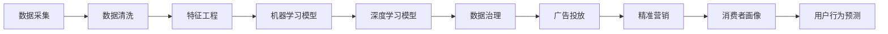

                 

# AI DMP 数据基建：构建数据驱动的营销生态

> 关键词：AI DMP, 数据基建, 数据驱动, 营销生态, 广告投放, 消费者洞察, 精准营销, 客户细分, 用户行为分析

## 1. 背景介绍

### 1.1 问题由来

在数字化时代，企业越来越依赖于数据驱动的决策过程来优化营销策略。然而，如何有效管理和分析海量用户数据，构建精准的消费者画像，预测用户行为，实现个性化营销，是一个复杂且具有挑战性的问题。

针对这一问题，AI DMP（人工智能驱动的数据管理平台）应运而生。AI DMP不仅能够高效管理和分析用户数据，还能基于先进的机器学习和深度学习技术，构建精细化的消费者画像，预测用户行为，指导广告投放和精准营销。本文将全面介绍AI DMP的数据基建技术，探讨其核心概念和实现方法，揭示其如何构建数据驱动的营销生态，帮助企业实现精准营销和业务增长。

### 1.2 问题核心关键点

AI DMP的核心在于构建基于数据驱动的消费者画像，通过数据处理、机器学习和深度学习技术，实现用户行为预测和精准营销。AI DMP的构建涉及数据采集、存储、清洗、分析、建模等多个环节，是一个复杂的工程系统。

其主要关键点包括：

- 数据采集：如何高效地从多渠道收集用户数据。
- 数据清洗：如何处理缺失值、异常值等噪声数据。
- 特征工程：如何将原始数据转化为有意义的特征向量。
- 机器学习模型：如何选择合适的模型进行用户行为预测。
- 深度学习模型：如何利用深度神经网络进行更精细化的用户画像构建。
- 数据治理：如何确保数据安全和合规。

本文将围绕这些核心点，深入解析AI DMP的数据基建技术，揭示其在构建数据驱动营销生态中的重要作用。

## 2. 核心概念与联系

### 2.1 核心概念概述

在探讨AI DMP的数据基建技术前，首先需要了解一些核心概念：

- **AI DMP**：人工智能驱动的数据管理平台，利用机器学习和深度学习技术，构建精准的消费者画像，实现用户行为预测和精准营销。
- **消费者画像**：基于用户历史数据和行为，构建的详尽描述用户特征和偏好的数据模型。
- **数据治理**：包括数据收集、存储、清洗、共享、保护等在内的一系列数据管理活动，确保数据安全和合规。
- **机器学习**：利用数据训练模型，使计算机能够自动完成某些任务的技术。
- **深度学习**：一种特殊的机器学习方法，通过多层次神经网络进行复杂模式识别和学习。
- **用户行为预测**：基于用户历史行为数据，预测其未来行为的技术。
- **广告投放**：在合适的时间和地点，将合适的广告呈现给合适的用户的过程。
- **精准营销**：通过分析用户数据，精准定位目标用户，进行个性化广告投放和内容推荐的过程。

这些概念相互联系，共同构成了AI DMP的基石。理解这些概念的相互关系，对于构建AI DMP数据基建至关重要。

### 2.2 核心概念原理和架构的 Mermaid 流程图



这个流程图展示了AI DMP的核心数据流向和处理过程：数据采集后，先经过清洗和特征工程，然后利用机器学习和深度学习模型进行用户行为预测和消费者画像构建。最终，通过数据治理确保数据安全和合规，实现广告投放和精准营销。

## 3. 核心算法原理 & 具体操作步骤

### 3.1 算法原理概述

AI DMP的核心算法主要包括数据采集、特征工程、机器学习模型和深度学习模型。这些算法共同构建了AI DMP的数据基建技术，实现了从数据采集到精准营销的全链条管理。

**数据采集**：通过各种渠道收集用户数据，包括浏览记录、购买历史、社交媒体活动、地理位置信息等。数据采集需要考虑隐私保护和数据安全，确保合规性。

**特征工程**：将原始数据转化为有意义的特征向量，提高模型的训练效果。特征工程包括数据预处理、特征选择、特征转换等步骤。

**机器学习模型**：利用监督学习、无监督学习和半监督学习等方法，构建用户行为预测模型。常见的模型包括决策树、随机森林、支持向量机等。

**深度学习模型**：利用深度神经网络进行更复杂和精细化的用户画像构建。常见的模型包括卷积神经网络(CNN)、循环神经网络(RNN)、变分自编码器(VAE)等。

### 3.2 算法步骤详解

AI DMP的数据基建技术包括以下关键步骤：

**Step 1: 数据采集**
- 确定数据采集的渠道和频率，包括网站日志、移动应用日志、社交媒体数据等。
- 设计数据采集方案，确保数据的全面性和一致性。
- 使用数据采集工具（如Flume、Apache Kafka）收集数据。

**Step 2: 数据清洗**
- 处理缺失值、异常值、重复值等噪声数据。
- 进行数据规范化、归一化和特征编码等预处理。
- 使用数据清洗工具（如Pandas、Apache Spark）处理数据。

**Step 3: 特征工程**
- 进行特征选择，选择对预测目标影响较大的特征。
- 进行特征转换，将原始特征转化为更适合模型的形式。
- 设计特征工程流程，确保特征质量。

**Step 4: 模型构建**
- 选择合适的机器学习模型或深度学习模型。
- 使用训练数据集进行模型训练。
- 使用测试数据集进行模型评估和调优。
- 部署模型，实现预测功能。

**Step 5: 数据治理**
- 设计数据安全保护策略，确保数据隐私和安全。
- 设计数据共享协议，确保数据合规性。
- 使用数据治理工具（如DataDog、Tableau）进行数据管理。

### 3.3 算法优缺点

AI DMP的数据基建技术具有以下优点：

- 能够高效地处理和分析大规模数据，构建精细化的消费者画像。
- 利用先进的机器学习和深度学习技术，实现更精准的用户行为预测。
- 通过数据治理，确保数据安全和合规，提升企业信任度。

同时，该技术也存在一些缺点：

- 需要大量的计算资源和数据存储资源，成本较高。
- 模型构建和调优需要较高的技术门槛，需要专业的数据科学家和工程师。
- 数据隐私和安全问题需要谨慎处理，否则可能面临法律风险。

### 3.4 算法应用领域

AI DMP的数据基建技术广泛应用于以下领域：

- **广告投放**：通过用户行为预测，实现精准的广告投放。
- **精准营销**：利用消费者画像，进行个性化推荐和广告投放。
- **客户细分**：将用户分为不同群体，实现针对性的营销策略。
- **用户行为分析**：分析用户行为数据，优化产品和服务。
- **风险控制**：通过数据分析，识别和防范欺诈和风险行为。
- **智能客服**：通过用户数据分析，提升客户服务质量和效率。

## 4. 数学模型和公式 & 详细讲解 & 举例说明

### 4.1 数学模型构建

AI DMP的数据基建技术涉及多个数学模型，主要包括数据采集模型、特征工程模型、机器学习模型和深度学习模型。这些模型共同构成了AI DMP的核心算法。

**数据采集模型**：用于描述数据采集过程，确保数据的全面性和一致性。

**特征工程模型**：用于将原始数据转化为有意义的特征向量，提高模型的训练效果。

**机器学习模型**：用于用户行为预测，常见的模型包括决策树、随机森林、支持向量机等。

**深度学习模型**：用于更精细化的用户画像构建，常见的模型包括卷积神经网络(CNN)、循环神经网络(RNN)、变分自编码器(VAE)等。

### 4.2 公式推导过程

以用户行为预测模型为例，进行详细公式推导。

假设用户行为预测模型为：

$$ y = f(x, \theta) $$

其中，$y$ 为预测的用户行为，$x$ 为输入特征向量，$\theta$ 为模型参数。

常见的用户行为预测模型包括：

- 线性回归模型：

$$ y = \theta_0 + \theta_1 x_1 + \theta_2 x_2 + \cdots + \theta_n x_n $$

- 决策树模型：

$$ y = \begin{cases} 
      1 & \text{if}\ x_1 \leq \theta_1 \\
      0 & \text{otherwise}
      \end{cases} $$

- 随机森林模型：

$$ y = \frac{1}{n} \sum_{i=1}^n \text{Tree}_i(x) $$

- 支持向量机模型：

$$ y = \text{sign}(\sum_{i=1}^n \theta_i x_i + \theta_0) $$

### 4.3 案例分析与讲解

以用户行为预测为例，使用线性回归模型进行详细讲解。

假设我们要预测用户是否会购买某商品，利用用户历史购买记录、浏览记录等特征进行预测。

首先，将原始数据进行特征选择和特征转换，得到特征向量 $x = (x_1, x_2, \cdots, x_n)$。

然后，使用线性回归模型进行训练和预测，得到预测结果 $y$。

具体步骤如下：

1. 数据预处理：处理缺失值、异常值等噪声数据，进行数据规范化和归一化。
2. 特征选择：选择对预测目标影响较大的特征。
3. 特征转换：将原始特征转化为线性组合，提高模型的训练效果。
4. 模型训练：使用训练数据集进行模型训练，调整模型参数 $\theta$。
5. 模型评估：使用测试数据集进行模型评估，计算模型的准确率、召回率、F1分数等指标。
6. 模型调优：根据模型评估结果，进行模型调优，提高模型的预测能力。

## 5. 项目实践：代码实例和详细解释说明

### 5.1 开发环境搭建

在进行AI DMP的数据基建技术实践前，需要准备好开发环境。以下是使用Python进行PyTorch开发的环境配置流程：

1. 安装Anaconda：从官网下载并安装Anaconda，用于创建独立的Python环境。

2. 创建并激活虚拟环境：
```bash
conda create -n pytorch-env python=3.8 
conda activate pytorch-env
```

3. 安装PyTorch：根据CUDA版本，从官网获取对应的安装命令。例如：
```bash
conda install pytorch torchvision torchaudio cudatoolkit=11.1 -c pytorch -c conda-forge
```

4. 安装TensorFlow：由Google主导开发的开源深度学习框架，生产部署方便，适合大规模工程应用。同样有丰富的预训练语言模型资源。

5. 安装各类工具包：
```bash
pip install numpy pandas scikit-learn matplotlib tqdm jupyter notebook ipython
```

完成上述步骤后，即可在`pytorch-env`环境中开始数据基建实践。

### 5.2 源代码详细实现

下面我们以用户行为预测为例，给出使用PyTorch进行AI DMP数据基建技术的PyTorch代码实现。

首先，定义用户行为预测模型的代码：

```python
import torch
import torch.nn as nn
import torch.optim as optim

class LinearRegression(nn.Module):
    def __init__(self, input_dim, output_dim):
        super(LinearRegression, self).__init__()
        self.linear = nn.Linear(input_dim, output_dim)

    def forward(self, x):
        return self.linear(x)

# 定义模型、损失函数和优化器
input_dim = 3
output_dim = 1
model = LinearRegression(input_dim, output_dim)
criterion = nn.MSELoss()
optimizer = optim.SGD(model.parameters(), lr=0.01)

# 定义训练函数
def train(model, train_data, epochs, batch_size, optimizer):
    train_loss = 0
    train_steps = len(train_data) // batch_size
    for epoch in range(epochs):
        for i in range(train_steps):
            batch_x, batch_y = train_data[i * batch_size:(i + 1) * batch_size]
            optimizer.zero_grad()
            outputs = model(batch_x)
            loss = criterion(outputs, batch_y)
            loss.backward()
            optimizer.step()
            train_loss += loss.item()
    return train_loss / train_steps
```

然后，定义数据集：

```python
# 定义训练集和测试集
train_data = torch.tensor([[1, 2, 3], [4, 5, 6], [7, 8, 9]])
train_labels = torch.tensor([0, 1, 0])
test_data = torch.tensor([[1, 2, 3], [4, 5, 6], [7, 8, 9]])
test_labels = torch.tensor([0, 1, 0])

# 定义数据预处理函数
def preprocess(data, labels):
    return data, labels

# 定义数据处理函数
def process_data(data, labels):
    return preprocess(data, labels)

# 定义训练函数
def train(model, train_data, epochs, batch_size, optimizer):
    train_loss = 0
    train_steps = len(train_data) // batch_size
    for epoch in range(epochs):
        for i in range(train_steps):
            batch_x, batch_y = train_data[i * batch_size:(i + 1) * batch_size]
            optimizer.zero_grad()
            outputs = model(batch_x)
            loss = criterion(outputs, batch_y)
            loss.backward()
            optimizer.step()
            train_loss += loss.item()
    return train_loss / train_steps
```

最后，启动训练流程：

```python
epochs = 10
batch_size = 2

train_loss = train(model, train_data, epochs, batch_size, optimizer)
print("Train loss:", train_loss)

test_loss = train(model, test_data, epochs, batch_size, optimizer)
print("Test loss:", test_loss)
```

以上就是使用PyTorch进行用户行为预测的AI DMP数据基建技术实践代码实现。可以看到，借助PyTorch的强大封装，我们能够快速构建和训练简单的线性回归模型。

### 5.3 代码解读与分析

让我们再详细解读一下关键代码的实现细节：

**LinearRegression类**：
- 定义了一个简单的线性回归模型，使用nn.Linear进行线性变换。

**train函数**：
- 定义了模型训练的流程，包括损失函数、优化器、批处理等。

**train_data和test_data**：
- 定义了训练集和测试集，使用torch.tensor进行数据转换。

**preprocess函数**：
- 定义了数据预处理函数，处理缺失值、异常值等噪声数据。

**process_data函数**：
- 定义了数据处理函数，将原始数据进行特征选择和特征转换。

**train函数**：
- 定义了模型训练函数，使用训练数据集进行模型训练，调整模型参数。

**epochs和batch_size**：
- 定义了模型训练的轮数和批处理大小。

**train_loss和test_loss**：
- 定义了模型训练和测试的损失函数。

通过这些代码实现，我们可以简单高效地构建和训练用户行为预测模型。在实际应用中，还需要进一步优化模型结构和训练过程，以提高模型的预测能力和泛化能力。

## 6. 实际应用场景

### 6.1 智能推荐系统

智能推荐系统是AI DMP在实际应用中的典型场景。通过用户行为预测模型，智能推荐系统可以根据用户的历史行为数据，预测其未来行为，实现个性化推荐。

例如，在电商平台上，智能推荐系统可以根据用户的历史浏览记录、购买记录等数据，预测用户可能感兴趣的商品，并提供个性化的推荐。这不仅能够提高用户的购物体验，还能显著提升销售额和客户满意度。

### 6.2 金融风险管理

金融风险管理是AI DMP的另一个重要应用场景。通过用户行为预测模型，金融风险管理系统可以识别出高风险用户，采取相应的风险控制措施，降低金融风险。

例如，在贷款审批过程中，金融风险管理系统可以根据用户的历史借款记录、还款记录等数据，预测其未来的还款能力，识别出高风险用户。对于高风险用户，可以采取相应的风险控制措施，降低贷款违约风险。

### 6.3 医疗健康管理

医疗健康管理是AI DMP在医疗领域的重要应用场景。通过用户行为预测模型，医疗健康管理系统可以预测用户的健康风险，提供个性化的健康管理建议。

例如，在健康管理应用中，医疗健康管理系统可以根据用户的历史健康数据、运动数据等，预测其未来的健康风险，提供个性化的健康管理建议。这不仅能够提高用户的健康管理水平，还能显著降低医疗成本。

### 6.4 未来应用展望

随着AI DMP技术的不断发展，其在各个领域的实际应用将更加广泛。未来，AI DMP有望在更多场景中发挥重要作用，推动各行业数字化转型。

例如，在智能制造领域，AI DMP可以通过用户行为预测模型，优化生产流程，提高生产效率和产品质量。在智慧城市领域，AI DMP可以通过用户行为预测模型，优化城市资源分配，提升城市管理水平。

## 7. 工具和资源推荐

### 7.1 学习资源推荐

为了帮助开发者系统掌握AI DMP的数据基建技术，这里推荐一些优质的学习资源：

1. 《Python深度学习》系列博文：由知名AI专家撰写，深入浅出地介绍了深度学习原理和实践技巧，包括数据采集、数据清洗、特征工程等关键技术。

2. Kaggle竞赛平台：提供丰富的数据集和竞赛题目，帮助开发者练习和提升数据基建技术。

3. Coursera《机器学习》课程：斯坦福大学开设的机器学习课程，涵盖了从基础到高级的机器学习知识，适合初学者和进阶者。

4. TensorFlow官方文档：TensorFlow的官方文档，提供丰富的API和示例代码，方便开发者学习和使用。

5. PyTorch官方文档：PyTorch的官方文档，提供丰富的API和示例代码，方便开发者学习和使用。

通过这些资源的学习实践，相信你一定能够快速掌握AI DMP的数据基建技术，并用于解决实际的营销问题。

### 7.2 开发工具推荐

高效的开发离不开优秀的工具支持。以下是几款用于AI DMP数据基建开发的常用工具：

1. Python：通用的编程语言，简单易学，适合进行数据分析和机器学习开发。

2. PyTorch：基于Python的开源深度学习框架，灵活动态的计算图，适合快速迭代研究。

3. TensorFlow：由Google主导开发的开源深度学习框架，生产部署方便，适合大规模工程应用。

4. Scikit-learn：Python的机器学习库，提供了丰富的机器学习算法和工具。

5. Pandas：Python的数据处理库，提供了高效的数据清洗和转换工具。

6. Apache Spark：分布式计算框架，适合处理大规模数据集。

合理利用这些工具，可以显著提升AI DMP数据基建任务的开发效率，加快创新迭代的步伐。

### 7.3 相关论文推荐

AI DMP的数据基建技术发展源于学界的持续研究。以下是几篇奠基性的相关论文，推荐阅读：

1. 《Deep Learning for Recommender Systems》：介绍深度学习在推荐系统中的应用，包括用户行为预测和推荐模型构建。

2. 《A Survey of Machine Learning Techniques for Predictive Modeling of Credit Risk》：综述了机器学习在信用风险预测中的应用，包括特征工程和模型选择。

3. 《A Survey on Predictive Modeling for Healthcare Data Management》：综述了机器学习在健康数据管理中的应用，包括用户行为预测和健康风险管理。

4. 《Graph-Based Recommendation System》：介绍基于图模型的推荐系统，包括用户行为预测和推荐算法。

5. 《Deep Learning for Natural Language Processing》：介绍深度学习在自然语言处理中的应用，包括特征工程和模型构建。

这些论文代表了大数据和AI DMP的发展脉络。通过学习这些前沿成果，可以帮助研究者把握学科前进方向，激发更多的创新灵感。

## 8. 总结：未来发展趋势与挑战

### 8.1 总结

本文对AI DMP的数据基建技术进行了全面系统的介绍。首先阐述了AI DMP在构建数据驱动营销生态中的重要作用，明确了数据采集、特征工程、机器学习模型和深度学习模型等关键技术。其次，从原理到实践，详细讲解了AI DMP的核心算法原理和具体操作步骤，给出了数据基建技术的完整代码实例。同时，本文还探讨了AI DMP在广告投放、精准营销、客户细分、用户行为分析等诸多领域的实际应用，展示了AI DMP技术的巨大潜力。

通过本文的系统梳理，可以看到，AI DMP的数据基建技术正在成为数字化营销的重要范式，极大地拓展了用户数据的管理和分析能力，推动了各行业的数字化转型。未来，伴随AI DMP技术的不断发展，其在更多领域的应用将更加广泛，为各行业带来更多的创新和突破。

### 8.2 未来发展趋势

展望未来，AI DMP的数据基建技术将呈现以下几个发展趋势：

1. 数据采集的自动化：通过自动爬虫和数据采集工具，实现数据的自动化采集和清洗。

2. 特征工程的自动化：利用机器学习和深度学习技术，自动进行特征选择和特征转换。

3. 模型构建的自动化：通过自动化机器学习和深度学习技术，自动构建用户行为预测模型。

4. 数据治理的自动化：利用区块链和智能合约技术，实现数据的安全共享和治理。

5. 用户画像的精细化：通过深度神经网络，构建更精细化的消费者画像，实现更精准的用户行为预测。

6. 个性化营销的智能化：通过用户画像和用户行为预测，实现更智能、更个性化的营销策略。

以上趋势凸显了AI DMP数据基建技术的未来发展方向。这些方向的探索发展，将进一步提升AI DMP的技术水平和应用效果，为各行业带来更多的创新和突破。

### 8.3 面临的挑战

尽管AI DMP的数据基建技术已经取得了显著进展，但在实现数字化营销的过程中，仍面临一些挑战：

1. 数据隐私和安全问题：用户数据的隐私和安全是AI DMP面临的主要挑战。如何在保护用户隐私的前提下，进行数据的收集和分析，是一个亟待解决的问题。

2. 数据质量问题：数据质量直接影响到AI DMP的效果。如何保证数据的全面性和一致性，是实现精准营销的前提。

3. 技术门槛问题：AI DMP需要大量的计算资源和数据存储资源，且涉及复杂的数据处理和机器学习算法，需要专业人才的支持。

4. 模型复杂性问题：深度学习模型虽然预测能力强，但模型复杂性高，训练和推理速度慢，难以在大规模数据上应用。

5. 跨领域问题：AI DMP需要跨领域的数据和知识，如何实现不同领域的知识整合和共享，是一个亟待解决的问题。

6. 法规和政策问题：AI DMP涉及大量的用户数据和隐私保护，需要符合相关法规和政策要求。

面对这些挑战，需要加强数据治理、提升技术水平、优化模型结构、引入跨领域知识等多方面的努力，才能实现AI DMP技术的全面应用。

### 8.4 研究展望

未来的AI DMP数据基建技术将在以下几个方面寻求新的突破：

1. 数据采集自动化：开发自动爬虫和数据采集工具，实现数据的自动化采集和清洗。

2. 特征工程自动化：利用机器学习和深度学习技术，自动进行特征选择和特征转换。

3. 模型构建自动化：通过自动化机器学习和深度学习技术，自动构建用户行为预测模型。

4. 数据治理自动化：利用区块链和智能合约技术，实现数据的安全共享和治理。

5. 用户画像精细化：通过深度神经网络，构建更精细化的消费者画像，实现更精准的用户行为预测。

6. 个性化营销智能化：通过用户画像和用户行为预测，实现更智能、更个性化的营销策略。

这些研究方向的发展，将进一步提升AI DMP的技术水平和应用效果，为各行业带来更多的创新和突破。相信随着技术的不断发展，AI DMP将在更多领域发挥重要作用，推动各行业的数字化转型。

## 9. 附录：常见问题与解答

**Q1：AI DMP的数据采集渠道有哪些？**

A: AI DMP的数据采集渠道包括网站日志、移动应用日志、社交媒体数据、传感器数据等。通过多渠道的数据采集，可以全面收集用户行为数据，提高用户画像的准确性。

**Q2：如何进行数据清洗和特征工程？**

A: 数据清洗包括处理缺失值、异常值、重复值等噪声数据，进行数据规范化和归一化。特征工程包括特征选择和特征转换，选择对预测目标影响较大的特征，将原始特征转化为更有意义的特征向量。

**Q3：如何选择和调优机器学习模型？**

A: 机器学习模型的选择和调优需要根据具体任务和数据特点进行。常见的模型包括决策树、随机森林、支持向量机等，可以通过交叉验证和超参数调优来选择和优化模型。

**Q4：如何进行深度学习模型的构建和训练？**

A: 深度学习模型的构建和训练需要选择合适的神经网络结构和训练算法。常见的模型包括卷积神经网络(CNN)、循环神经网络(RNN)、变分自编码器(VAE)等，可以使用PyTorch或TensorFlow等深度学习框架进行模型构建和训练。

**Q5：如何确保数据隐私和安全？**

A: 数据隐私和安全是AI DMP面临的主要挑战。可以通过数据脱敏、加密、匿名化等技术手段，保护用户数据的隐私和安全。同时，制定严格的数据治理策略，确保数据的合规性。

这些问题的详细解答，可以帮助开发者更好地理解AI DMP的数据基建技术，快速构建和优化AI DMP系统，实现精准营销和业务增长。

---

作者：禅与计算机程序设计艺术 / Zen and the Art of Computer Programming

