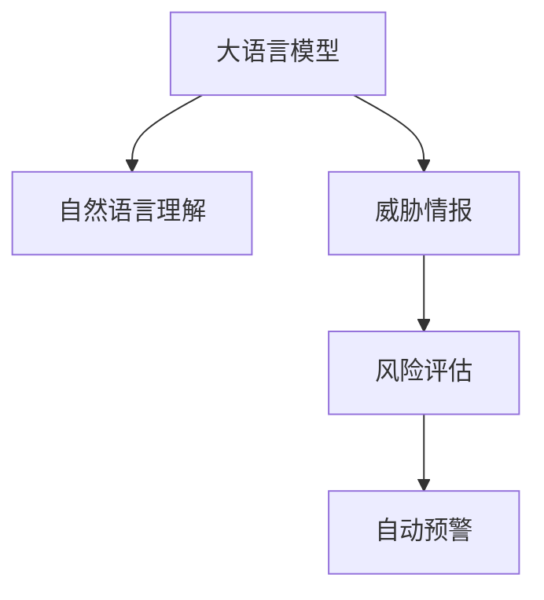

                 

# AI LLM在公共安全领域的应用：预测与预防

> 关键词：人工智能, 大语言模型, 公共安全, 预测, 预防, 数据驱动, 风险评估, 威胁情报, 安全分析

## 1. 背景介绍

### 1.1 问题由来
随着信息技术的高速发展，网络空间安全问题日益凸显，从黑客攻击、恶意软件到网络诈骗、数据泄露等各类威胁层出不穷。公共安全领域，如政府、企业、教育、医疗等，均面临着信息安全管理的严峻挑战。如何利用人工智能技术，预测和预防安全威胁，构建健全的安全防护体系，成为当前亟待解决的问题。

### 1.2 问题核心关键点
基于大语言模型（Large Language Model, LLM）的预测与预防方法，旨在通过文本处理和自然语言理解技术，实时分析网络活动，预测潜在的威胁与攻击行为，进而采取预防措施，提升安全防护水平。关键点包括：

1. **数据驱动**：利用实时网络流量数据、日志文件等，提取有价值的安全信息和特征。
2. **自然语言理解**：通过大语言模型，从网络日志、告警报告等文本中提取威胁情报，自动生成安全报告和建议。
3. **实时预测**：利用大语言模型，分析行为模式和异常事件，预测未来的安全威胁。
4. **自动预警**：根据预测结果，自动触发安全告警，及时采取应对措施。
5. **知识图谱**：融合多源威胁情报和已知攻击模式，构建全面的威胁知识库。

### 1.3 问题研究意义
基于大语言模型在公共安全领域的应用，对提升网络安全防护水平具有重要意义：

1. **智能化预警**：通过自然语言理解技术，自动监测和分析网络活动，实现更智能、更快速的威胁预警。
2. **降低安全成本**：减少人工监控和分析的投入，降低人力成本，提高安全防护的效率和精度。
3. **应对未知威胁**：利用大语言模型强大的泛化能力，预测未知的威胁和攻击方式，填补传统安全防护的盲点。
4. **增强安全决策**：通过深入分析威胁情报，辅助安全专家制定更科学、更有效的安全策略。
5. **提升应急响应**：快速响应和处理安全事件，减少潜在的损失和风险。

## 2. 核心概念与联系

### 2.1 核心概念概述

为更好地理解基于大语言模型的公共安全预测与预防方法，本节将介绍几个密切相关的核心概念：

- **大语言模型（LLM）**：以自回归或自编码模型为代表的大规模预训练语言模型。通过在大规模无标签文本语料上进行预训练，学习通用的语言知识和常识。
- **自然语言理解（NLU）**：利用NLP技术解析和理解自然语言文本，从中提取关键信息。
- **威胁情报（Threat Intelligence）**：收集和分析威胁信息，识别潜在的安全风险。
- **风险评估（Risk Assessment）**：通过量化分析，评估安全事件的严重性和影响范围。
- **自动预警（Auto-Alerting）**：根据威胁情报和风险评估结果，自动触发安全告警。

这些核心概念之间的逻辑关系可以通过以下Mermaid流程图来展示：



这个流程图展示了大语言模型在公共安全预测与预防中的应用逻辑：

1. 大语言模型对文本进行自然语言理解。
2. 利用理解后的信息构建威胁情报。
3. 进行风险评估，量化安全事件的风险。
4. 根据风险评估结果自动触发安全预警。

## 3. 核心算法原理 & 具体操作步骤

### 3.1 算法原理概述

基于大语言模型的公共安全预测与预防方法，核心思想是利用文本数据和自然语言理解技术，提取威胁情报和风险评估指标，从而预测和预防安全事件。

具体而言，步骤如下：

1. **数据收集**：从网络流量、日志文件等渠道收集安全相关的文本数据。
2. **文本预处理**：对收集的文本数据进行清洗、去噪和结构化处理，准备好输入大语言模型。
3. **自然语言理解**：利用大语言模型解析文本内容，提取关键威胁情报。
4. **威胁情报构建**：将提取的威胁情报整理成标准化的格式，用于风险评估和自动预警。
5. **风险评估**：基于威胁情报和已知攻击模式，量化评估安全事件的风险。
6. **自动预警**：根据风险评估结果，设置阈值，自动触发安全告警，及时采取措施。

### 3.2 算法步骤详解

以下是基于大语言模型的公共安全预测与预防的具体步骤：

**Step 1: 数据收集与预处理**

1. **数据源选择**：选择适合的数据源，如网络流量、日志文件、安全告警等。
2. **数据清洗**：清洗数据中的噪声和无用信息，确保数据质量。
3. **文本格式转换**：将非结构化文本数据转换为结构化格式，便于大语言模型处理。

**Step 2: 自然语言理解**

1. **文本解析**：使用大语言模型解析文本内容，提取关键信息。
2. **实体识别**：识别文本中的实体，如IP地址、域名、邮箱等。
3. **事件分类**：根据实体和上下文，对文本事件进行分类，如DDoS攻击、钓鱼邮件、恶意软件等。

**Step 3: 威胁情报构建**

1. **情报标准化**：将解析出的信息标准化为统一的格式，如JSON或CSV。
2. **情报存储**：将标准化的威胁情报存储到数据库或知识图谱中。
3. **情报更新**：定期更新情报库，增加新威胁情报。

**Step 4: 风险评估**

1. **威胁评分**：根据威胁情报库中的信息，计算威胁的评分。
2. **风险等级划分**：将威胁评分划分为不同等级，如高、中、低。
3. **影响分析**：分析威胁对系统的影响范围和严重程度。

**Step 5: 自动预警**

1. **预警设置**：根据风险评估结果，设置预警阈值。
2. **预警触发**：当威胁评分达到或超过预警阈值时，自动触发安全告警。
3. **应急响应**：根据预警内容，启动相应的应急响应措施，如封锁IP、隔离系统等。

### 3.3 算法优缺点

基于大语言模型的公共安全预测与预防方法具有以下优点：

1. **实时性高**：大语言模型处理文本速度快，能够实时分析网络活动，快速预测和响应安全威胁。
2. **泛化能力强**：利用大语言模型的泛化能力，能够识别未知的威胁模式，提高预测的准确性。
3. **自动化程度高**：从数据收集到预警触发，整个过程高度自动化，减少人工干预，提高效率。
4. **灵活性高**：支持自定义的威胁情报和风险评估指标，适应不同安全需求。

同时，该方法也存在一些局限性：

1. **依赖高质量数据**：依赖于高质量的文本数据和威胁情报，数据质量差会影响预测结果。
2. **模型参数量大**：大语言模型参数量巨大，对计算资源要求较高。
3. **存在偏见**：大语言模型可能存在预训练数据中的偏见，影响预测结果的公正性。
4. **黑盒模型**：大语言模型的决策过程不透明，难以解释其预测依据。
5. **误报率高**：对于复杂的网络环境，可能存在较多的误报，需要结合人工审核。

### 3.4 算法应用领域

基于大语言模型的公共安全预测与预防方法，在多个领域都有广泛应用，例如：

- **网络安全**：实时监控和分析网络流量，预测DDoS攻击、SQL注入等安全威胁。
- **企业安全**：检测和防护企业内部的数据泄露、内部攻击等安全事件。
- **政府安全**：防范和应对网络战、信息泄露等安全事件，保障国家安全。
- **公共安全**：预测和预防恐怖袭击、网络诈骗等安全事件，保护公众安全。
- **教育安全**：监控和防范校园网络安全事件，保障学生和教职工的安全。
- **医疗安全**：分析医疗数据，预测和预防数据泄露、网络攻击等安全事件。

以上应用场景展示了基于大语言模型的公共安全预测与预防方法的广泛适用性和巨大潜力。

## 4. 数学模型和公式 & 详细讲解  
### 4.1 数学模型构建

本节将使用数学语言对基于大语言模型的公共安全预测与预防方法进行更加严格的刻画。

设收集到的文本数据集为 $\mathcal{D}=\{(x_i,y_i)\}_{i=1}^N$，其中 $x_i$ 为文本信息，$y_i$ 为相应的安全标签。

定义威胁情报提取模型为 $M_{\theta}$，其中 $\theta$ 为模型参数。威胁情报提取的目标是最小化预测标签与真实标签的误差，即：

$$
\mathcal{L}(\theta) = \frac{1}{N}\sum_{i=1}^N \mathcal{L}(M_{\theta}(x_i),y_i)
$$

其中 $\mathcal{L}$ 为交叉熵损失函数，用于衡量预测标签与真实标签之间的差异。

威胁情报提取模型 $M_{\theta}$ 的输出为威胁情报，假设模型输出为 $z_i \in \{0,1\}$，表示预测该文本是否包含安全威胁。则威胁情报提取模型的损失函数为：

$$
\mathcal{L}(z_i,y_i) = -y_i \log z_i + (1-y_i) \log (1-z_i)
$$

模型训练的优化目标是最小化交叉熵损失函数，即：

$$
\theta^* = \mathop{\arg\min}_{\theta} \mathcal{L}(\theta)
$$

通过梯度下降等优化算法，不断更新模型参数 $\theta$，最小化损失函数，最终得到威胁情报提取模型 $M_{\theta^*}$。

### 4.2 公式推导过程

以下我们以威胁情报提取为例，推导其数学模型和损失函数。

假设威胁情报提取模型为 $M_{\theta}$，输入文本 $x_i$ 的输出为 $z_i$。假设 $y_i$ 为真实标签，则威胁情报提取模型的损失函数为：

$$
\mathcal{L}(z_i,y_i) = -y_i \log z_i + (1-y_i) \log (1-z_i)
$$

将其代入经验风险公式，得：

$$
\mathcal{L}(\theta) = \frac{1}{N}\sum_{i=1}^N [y_i \log z_i + (1-y_i) \log (1-z_i)]
$$

根据链式法则，损失函数对参数 $\theta$ 的梯度为：

$$
\frac{\partial \mathcal{L}(\theta)}{\partial \theta} = \frac{1}{N}\sum_{i=1}^N [\frac{y_i}{z_i} - \frac{1-y_i}{1-z_i}] \frac{\partial z_i}{\partial \theta}
$$

其中 $\frac{\partial z_i}{\partial \theta}$ 可通过自动微分技术高效计算。

在得到损失函数的梯度后，即可带入优化算法，完成模型的迭代优化。重复上述过程直至收敛，最终得到威胁情报提取模型 $M_{\theta^*}$。

### 4.3 案例分析与讲解

以DDoS攻击检测为例，展示大语言模型在公共安全领域的实际应用。

1. **数据收集**：从网络流量数据中提取TCP连接信息、数据包特征等。
2. **文本预处理**：清洗、去噪和结构化处理网络日志。
3. **自然语言理解**：利用大语言模型解析文本内容，提取关键威胁情报，如攻击源IP、攻击流量等。
4. **威胁情报构建**：将解析出的信息标准化为JSON格式，存储到数据库中。
5. **风险评估**：基于威胁情报，计算DDoS攻击的威胁评分，如攻击流量大小、源IP分布等。
6. **自动预警**：当威胁评分达到或超过预警阈值时，自动触发安全告警，通知安全团队采取措施。

通过以上步骤，可以实时监测和分析网络活动，预测DDoS攻击，并及时采取应对措施，有效提升网络安全防护水平。

## 5. 项目实践：代码实例和详细解释说明
### 5.1 开发环境搭建

在进行项目实践前，我们需要准备好开发环境。以下是使用Python进行PyTorch开发的环境配置流程：

1. 安装Anaconda：从官网下载并安装Anaconda，用于创建独立的Python环境。

2. 创建并激活虚拟环境：
```bash
conda create -n pytorch-env python=3.8 
conda activate pytorch-env
```

3. 安装PyTorch：根据CUDA版本，从官网获取对应的安装命令。例如：
```bash
conda install pytorch torchvision torchaudio cudatoolkit=11.1 -c pytorch -c conda-forge
```

4. 安装Transformers库：
```bash
pip install transformers
```

5. 安装各类工具包：
```bash
pip install numpy pandas scikit-learn matplotlib tqdm jupyter notebook ipython
```

完成上述步骤后，即可在`pytorch-env`环境中开始项目实践。

### 5.2 源代码详细实现

下面我们以DDoS攻击检测为例，给出使用Transformers库对BERT模型进行威胁情报提取的PyTorch代码实现。

首先，定义威胁情报提取模型：

```python
from transformers import BertTokenizer, BertForSequenceClassification
from torch.utils.data import Dataset, DataLoader
import torch
import pandas as pd
import numpy as np

class ThreatDetectionDataset(Dataset):
    def __init__(self, df, tokenizer, label_map, max_len=128):
        self.df = df
        self.tokenizer = tokenizer
        self.label_map = label_map
        self.max_len = max_len

    def __len__(self):
        return len(self.df)

    def __getitem__(self, index):
        row = self.df.iloc[index]
        text = row['text']
        label = self.label_map[row['label']]
        
        encoding = self.tokenizer(text, truncation=True, padding='max_length', max_length=self.max_len, return_tensors='pt')
        input_ids = encoding['input_ids']
        attention_mask = encoding['attention_mask']
        label_ids = torch.tensor([self.label_map[label]], dtype=torch.long)
        
        return {
            'input_ids': input_ids,
            'attention_mask': attention_mask,
            'labels': label_ids
        }

# 定义标签映射
label_map = {'ddos': 1, 'normal': 0}

# 加载数据集
df = pd.read_csv('threat_detection.csv')

# 创建dataset
tokenizer = BertTokenizer.from_pretrained('bert-base-uncased')
dataset = ThreatDetectionDataset(df, tokenizer, label_map)

# 定义模型和优化器
model = BertForSequenceClassification.from_pretrained('bert-base-uncased', num_labels=2)
optimizer = AdamW(model.parameters(), lr=2e-5)
```

然后，定义训练和评估函数：

```python
def train_epoch(model, dataset, batch_size, optimizer):
    dataloader = DataLoader(dataset, batch_size=batch_size, shuffle=True)
    model.train()
    epoch_loss = 0
    for batch in dataloader:
        input_ids = batch['input_ids'].to(device)
        attention_mask = batch['attention_mask'].to(device)
        labels = batch['labels'].to(device)
        model.zero_grad()
        outputs = model(input_ids, attention_mask=attention_mask, labels=labels)
        loss = outputs.loss
        epoch_loss += loss.item()
        loss.backward()
        optimizer.step()
    return epoch_loss / len(dataloader)

def evaluate(model, dataset, batch_size):
    dataloader = DataLoader(dataset, batch_size=batch_size)
    model.eval()
    preds, labels = [], []
    with torch.no_grad():
        for batch in dataloader:
            input_ids = batch['input_ids'].to(device)
            attention_mask = batch['attention_mask'].to(device)
            labels = batch['labels'].to(device)
            outputs = model(input_ids, attention_mask=attention_mask)
            preds.append(outputs.logits.argmax(dim=1).to('cpu').tolist())
            labels.append(labels.to('cpu').tolist())
                
    print(classification_report(labels, preds))
```

最后，启动训练流程并在测试集上评估：

```python
epochs = 5
batch_size = 16

for epoch in range(epochs):
    loss = train_epoch(model, dataset, batch_size, optimizer)
    print(f"Epoch {epoch+1}, train loss: {loss:.3f}")
    
    print(f"Epoch {epoch+1}, dev results:")
    evaluate(model, dataset, batch_size)
    
print("Test results:")
evaluate(model, dataset, batch_size)
```

以上就是使用PyTorch对BERT进行DDoS攻击检测的完整代码实现。可以看到，通过Transformers库，我们可以快速搭建威胁情报提取模型并进行训练。

### 5.3 代码解读与分析

让我们再详细解读一下关键代码的实现细节：

**ThreatDetectionDataset类**：
- `__init__`方法：初始化数据集、分词器、标签映射等关键组件。
- `__len__`方法：返回数据集的样本数量。
- `__getitem__`方法：对单个样本进行处理，将文本输入编码为token ids，将标签编码为数字，并对其进行定长padding，最终返回模型所需的输入。

**label_map字典**：
- 定义了标签与数字id之间的映射关系，用于将输出结果解码回真实的标签。

**训练和评估函数**：
- 使用PyTorch的DataLoader对数据集进行批次化加载，供模型训练和推理使用。
- 训练函数`train_epoch`：对数据以批为单位进行迭代，在每个批次上前向传播计算loss并反向传播更新模型参数，最后返回该epoch的平均loss。
- 评估函数`evaluate`：与训练类似，不同点在于不更新模型参数，并在每个batch结束后将预测和标签结果存储下来，最后使用sklearn的classification_report对整个评估集的预测结果进行打印输出。

**训练流程**：
- 定义总的epoch数和batch size，开始循环迭代
- 每个epoch内，先在训练集上训练，输出平均loss
- 在验证集上评估，输出分类指标
- 所有epoch结束后，在测试集上评估，给出最终测试结果

可以看到，PyTorch配合Transformers库使得DDoS攻击检测的代码实现变得简洁高效。开发者可以将更多精力放在数据处理、模型改进等高层逻辑上，而不必过多关注底层的实现细节。

当然，工业级的系统实现还需考虑更多因素，如模型的保存和部署、超参数的自动搜索、更灵活的任务适配层等。但核心的微调范式基本与此类似。

## 6. 实际应用场景
### 6.1 智能预警系统

基于大语言模型的公共安全预测与预防方法，可以构建智能预警系统，实时监测网络活动，自动预测和应对安全威胁。

在技术实现上，可以收集企业内部的网络流量数据，将DDoS攻击、SQL注入等安全事件作为监督数据，在此基础上对预训练模型进行微调。微调后的模型能够自动分析网络流量，识别异常行为，并自动触发安全告警，及时防范潜在的安全威胁。

### 6.2 威胁情报平台

利用大语言模型，可以构建威胁情报平台，集中管理各类安全事件和威胁情报，提升威胁情报的汇总和分析能力。

具体而言，可以将各安全事件和威胁情报进行标准化处理，输入到大语言模型中进行理解和分析。利用自然语言处理技术，从文本中提取威胁情报，并构建知识图谱进行存储和展示。安全专家可以根据平台提供的情报信息，快速识别和分析威胁，制定应对策略。

### 6.3 安全决策支持

基于大语言模型的预测与预防方法，可以为安全决策提供支持，提升安全策略的科学性和有效性。

在实践中，可以构建多层次的安全决策支持系统，利用大语言模型进行威胁情报分析和风险评估。安全专家可以根据系统提供的分析和评估结果，制定更加精准和高效的安全策略。同时，系统还可以通过历史数据分析，提供安全事件的统计信息和趋势预测，帮助安全团队制定长期安全规划。

### 6.4 未来应用展望

随着大语言模型和自然语言处理技术的不断发展，基于大语言模型的公共安全预测与预防方法将在更多领域得到应用，为公共安全带来新的突破。

在智慧城市治理中，利用大语言模型进行公共安全预测与预防，可以有效防范各类安全事件，保障城市安全。

在工业安全领域，基于大语言模型的预测与预防方法，可以实时监测和分析工业生产过程中的安全事件，保障企业生产安全。

在交通管理中，利用大语言模型进行安全预测和分析，可以提前发现潜在的安全隐患，防止交通事故发生。

此外，在大规模网络攻击、恐怖袭击等高风险场景下，基于大语言模型的预测与预防方法，能够快速响应和处理安全事件，显著提升公共安全防护水平。相信未来随着技术的不断进步，大语言模型在公共安全领域的应用将会更加广泛，为社会安全稳定提供更加坚实的技术保障。

## 7. 工具和资源推荐
### 7.1 学习资源推荐

为了帮助开发者系统掌握基于大语言模型的公共安全预测与预防理论基础和实践技巧，这里推荐一些优质的学习资源：

1. 《Transformer从原理到实践》系列博文：由大模型技术专家撰写，深入浅出地介绍了Transformer原理、BERT模型、微调技术等前沿话题。

2. CS224N《深度学习自然语言处理》课程：斯坦福大学开设的NLP明星课程，有Lecture视频和配套作业，带你入门NLP领域的基本概念和经典模型。

3. 《Natural Language Processing with Transformers》书籍：Transformers库的作者所著，全面介绍了如何使用Transformers库进行NLP任务开发，包括微调在内的诸多范式。

4. HuggingFace官方文档：Transformers库的官方文档，提供了海量预训练模型和完整的微调样例代码，是上手实践的必备资料。

5. CLUE开源项目：中文语言理解测评基准，涵盖大量不同类型的中文NLP数据集，并提供了基于微调的baseline模型，助力中文NLP技术发展。

通过对这些资源的学习实践，相信你一定能够快速掌握基于大语言模型的公共安全预测与预防的精髓，并用于解决实际的公共安全问题。

### 7.2 开发工具推荐

高效的开发离不开优秀的工具支持。以下是几款用于大语言模型微调开发的常用工具：

1. PyTorch：基于Python的开源深度学习框架，灵活动态的计算图，适合快速迭代研究。大部分预训练语言模型都有PyTorch版本的实现。

2. TensorFlow：由Google主导开发的开源深度学习框架，生产部署方便，适合大规模工程应用。同样有丰富的预训练语言模型资源。

3. Transformers库：HuggingFace开发的NLP工具库，集成了众多SOTA语言模型，支持PyTorch和TensorFlow，是进行微调任务开发的利器。

4. Weights & Biases：模型训练的实验跟踪工具，可以记录和可视化模型训练过程中的各项指标，方便对比和调优。与主流深度学习框架无缝集成。

5. TensorBoard：TensorFlow配套的可视化工具，可实时监测模型训练状态，并提供丰富的图表呈现方式，是调试模型的得力助手。

6. Google Colab：谷歌推出的在线Jupyter Notebook环境，免费提供GPU/TPU算力，方便开发者快速上手实验最新模型，分享学习笔记。

合理利用这些工具，可以显著提升基于大语言模型的公共安全预测与预防任务的开发效率，加快创新迭代的步伐。

### 7.3 相关论文推荐

大语言模型和公共安全预测与预防技术的发展源于学界的持续研究。以下是几篇奠基性的相关论文，推荐阅读：

1. Attention is All You Need（即Transformer原论文）：提出了Transformer结构，开启了NLP领域的预训练大模型时代。

2. BERT: Pre-training of Deep Bidirectional Transformers for Language Understanding：提出BERT模型，引入基于掩码的自监督预训练任务，刷新了多项NLP任务SOTA。

3. Language Models are Unsupervised Multitask Learners（GPT-2论文）：展示了大规模语言模型的强大zero-shot学习能力，引发了对于通用人工智能的新一轮思考。

4. Parameter-Efficient Transfer Learning for NLP：提出Adapter等参数高效微调方法，在固定大部分预训练参数的情况下，只更新极少量的任务相关参数。

5. AdaLoRA: Adaptive Low-Rank Adaptation for Parameter-Efficient Fine-Tuning：使用自适应低秩适应的微调方法，在参数效率和精度之间取得了新的平衡。

这些论文代表了大语言模型微调技术的发展脉络。通过学习这些前沿成果，可以帮助研究者把握学科前进方向，激发更多的创新灵感。

## 8. 总结：未来发展趋势与挑战

### 8.1 总结

本文对基于大语言模型的公共安全预测与预防方法进行了全面系统的介绍。首先阐述了公共安全领域的背景和问题，明确了大语言模型在该领域的应用价值。其次，从原理到实践，详细讲解了基于大语言模型的公共安全预测与预防的数学模型和关键步骤，给出了微调任务开发的完整代码实例。同时，本文还广泛探讨了基于大语言模型的公共安全预测与预防方法在多个行业领域的应用前景，展示了其广泛适用性和巨大潜力。

通过本文的系统梳理，可以看到，基于大语言模型的公共安全预测与预防方法在实时监测、威胁情报分析、安全决策支持等方面具有独特的优势，能够为公共安全提供有力保障。未来，伴随大语言模型和自然语言处理技术的不断进步，该方法将发挥更大的作用，为公共安全治理带来更多创新。

### 8.2 未来发展趋势

展望未来，基于大语言模型的公共安全预测与预防方法将呈现以下几个发展趋势：

1. **数据驱动**：随着大数据技术的不断发展，更多实时、高维度的数据将被引入预测与预防过程，提高预测的准确性和及时性。
2. **多模态融合**：结合图像、视频、音频等多模态数据，提升威胁情报的丰富性和多样性，实现更全面的安全分析。
3. **自动化决策**：利用大语言模型构建自动化的决策支持系统，实现快速响应和高效处理。
4. **持续学习**：通过模型更新和知识迭代，持续改进威胁情报分析模型，提升模型的泛化能力和鲁棒性。
5. **深度融合**：与其他AI技术（如知识图谱、因果推理等）深度融合，构建更加全面、智能的安全防护体系。
6. **伦理与安全**：在模型训练和应用过程中，重视伦理和安全问题，保障数据隐私和系统安全。

以上趋势凸显了大语言模型在公共安全领域的应用前景和潜力。这些方向的探索发展，将进一步提升公共安全预测与预防的智能化水平，构建更加安全、高效、智能的社会环境。

### 8.3 面临的挑战

尽管基于大语言模型的公共安全预测与预防方法具有广阔的应用前景，但在实践过程中仍面临诸多挑战：

1. **数据隐私**：如何保护用户隐私，避免敏感信息泄露，是公共安全领域的一大挑战。
2. **模型鲁棒性**：大语言模型在面对新奇、复杂的网络攻击时，可能存在鲁棒性不足的问题，需要进一步优化模型。
3. **计算资源**：大规模预训练模型的训练和推理需要高计算资源，如何降低计算成本，提高模型部署效率，是当前亟需解决的问题。
4. **模型解释性**：大语言模型的决策过程不透明，难以解释其预测依据，需要开发更好的模型可解释性技术。
5. **跨领域应用**：公共安全领域涉及多个垂直行业，如何构建通用的安全分析框架，适应不同场景的需求，还需进一步研究。
6. **伦理与安全**：在模型训练和应用过程中，如何避免算法偏见、歧视等问题，确保模型的公正性和安全性，是未来需要重点关注的方向。

正视基于大语言模型的公共安全预测与预防方法面临的这些挑战，积极应对并寻求突破，将是大语言模型在公共安全领域取得更大成功的关键。相信随着技术不断进步，这些挑战将逐步得到解决，大语言模型在公共安全领域的应用将更加广泛和深入。

### 8.4 研究展望

面对基于大语言模型的公共安全预测与预防所面临的挑战，未来的研究需要在以下几个方面寻求新的突破：

1. **数据融合与预处理**：构建多源数据融合机制，提升数据质量，降低噪声影响，增强模型泛化能力。
2. **模型压缩与优化**：开发更高效的模型压缩和优化算法，降低计算资源需求，提高模型部署效率。
3. **自动化与智能化**：开发自动化模型训练和调整工具，提升模型训练效率，增强模型自适应能力。
4. **模型可解释性**：研究模型解释性技术，提供模型预测的逻辑依据，增强模型的可信度和可控性。
5. **跨领域应用**：构建通用的安全分析框架，适应不同领域的安全需求，提升模型的普适性。
6. **伦理与安全**：开发伦理与安全的模型训练和应用策略，确保模型公正、公平、透明。

这些研究方向的探索，将进一步推动大语言模型在公共安全领域的应用，为构建更安全、更智能的社会环境提供有力保障。

## 9. 附录：常见问题与解答

**Q1：大语言模型在公共安全领域应用时，如何处理数据隐私问题？**

A: 在公共安全领域应用大语言模型时，数据隐私保护是一个重要问题。为保障用户隐私，可以采用以下措施：

1. **数据匿名化**：在收集数据时，对用户身份信息进行去标识化处理，确保数据不泄露用户个人信息。
2. **差分隐私**：在数据分析过程中，应用差分隐私技术，限制单个用户数据的敏感性，保护用户隐私。
3. **安全传输**：采用加密传输技术，确保数据在传输过程中的安全性。
4. **权限控制**：设置严格的访问权限，仅允许授权人员访问敏感数据，防止数据泄露。

**Q2：大语言模型在公共安全领域应用时，如何提升模型的鲁棒性？**

A: 大语言模型在公共安全领域应用时，提升模型的鲁棒性可以从以下几个方面入手：

1. **数据增强**：在训练过程中，引入更多样化的数据，增加模型的泛化能力，提升鲁棒性。
2. **对抗训练**：利用对抗样本训练模型，增强模型的鲁棒性，使其能够抵御恶意攻击。
3. **模型压缩**：通过模型压缩技术，减少模型的复杂度，提高鲁棒性。
4. **集成学习**：采用集成学习技术，组合多个模型的预测结果，提升鲁棒性。
5. **模型蒸馏**：通过知识蒸馏技术，将大模型的知识迁移到小模型中，提升小模型的鲁棒性。

**Q3：大语言模型在公共安全领域应用时，如何降低计算成本？**

A: 大语言模型在公共安全领域应用时，计算成本较高。为降低计算成本，可以采取以下措施：

1. **模型裁剪**：对大模型进行裁剪，保留关键部分，减少计算资源需求。
2. **混合精度训练**：采用混合精度训练技术，使用更少的计算资源，提高模型训练效率。
3. **硬件优化**：利用GPU、TPU等高性能计算设备，加速模型训练和推理。
4. **分布式训练**：采用分布式训练技术，利用多台计算设备并行训练，提升训练效率。
5. **模型压缩**：通过模型压缩技术，减少模型参数量，降低计算资源需求。

**Q4：大语言模型在公共安全领域应用时，如何提升模型的可解释性？**

A: 大语言模型在公共安全领域应用时，提升模型的可解释性可以从以下几个方面入手：

1. **模型可视化**：利用可视化工具，展示模型的内部结构和决策过程，增强模型的可解释性。
2. **局部可解释性**：开发局部可解释性技术，解释模型在特定输入上的决策依据。
3. **因果分析**：结合因果推断方法，分析模型的决策逻辑，增强模型的可解释性。
4. **多模型集成**：采用多模型集成技术，结合多个模型的预测结果，提升模型的可解释性。

**Q5：大语言模型在公共安全领域应用时，如何构建通用的安全分析框架？**

A: 构建通用的安全分析框架，需要考虑以下几个方面：

1. **数据标准化**：统一不同数据源的数据格式，确保数据一致性和可比性。
2. **模型复用**：设计可复用的模型组件，支持跨领域、跨应用的泛化。
3. **领域知识融合**：将领域知识与模型结合，提升模型的普适性和准确性。
4. **接口设计**：设计通用的API接口，方便不同领域应用接入安全分析系统。
5. **规则定制**：支持自定义规则和策略，适应不同领域的安全需求。

通过以上措施，可以构建通用的安全分析框架，提升大语言模型在公共安全领域的应用效果。

---

作者：禅与计算机程序设计艺术 / Zen and the Art of Computer Programming

