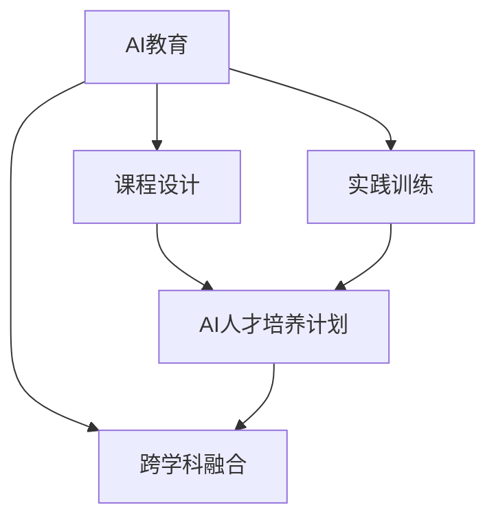

                 

## 1. 背景介绍

### 1.1 问题由来
随着人工智能技术的快速发展，AI人才需求急剧增加，AI教育行业正面临前所未有的挑战。如何在有限的教育资源下，培养出高素质的AI人才，成为了教育界和产业界共同关心的问题。传统的高校教育模式已经无法满足AI领域快速变化的需求，社会和企业对于AI技能的需求日益高涨。

### 1.2 问题核心关键点
当前，AI人才的培养面临着知识更新速度快、技术跨学科性强、动手实践要求高等问题。如何制定科学的AI人才培养计划，为学生提供系统化、实战化的教学内容，是AI教育的关键所在。

### 1.3 问题研究意义
培养高素质的AI人才，对于推动人工智能技术的进步、促进相关行业的发展、提升国家的竞争力具有重要意义：

1. **推动技术创新**：高质量AI人才是AI技术突破和应用创新的重要保障，能够驱动更多前沿技术的研究和应用。
2. **促进行业发展**：AI人才的培养直接关系到行业发展的速度和深度，能够推动各行业智能化转型。
3. **提升国家竞争力**：AI人才作为国家战略资源，其数量和质量直接影响国家的科技实力和国际影响力。

## 2. 核心概念与联系

### 2.1 核心概念概述

为更好地理解AI人才培养计划的制定，本节将介绍几个密切相关的核心概念：

- **AI教育**：指旨在培养学生掌握人工智能相关知识、技能和思维方式的教育活动，包括理论学习、实践训练和跨学科融合。
- **AI人才培养计划**：指教育机构为培养AI人才制定的系统化、结构化的教学方案，涵盖课程设置、实践训练、实习就业等多个环节。
- **课程设计**：基于行业需求和技术发展，制定合理的课程结构，确保学生能够掌握最新的AI知识和技能。
- **实践训练**：通过实验、项目、竞赛等方式，将理论知识应用于实际问题解决，提升学生的动手能力和工程实践能力。
- **跨学科融合**：AI作为多学科交叉的领域，注重与其他学科的深度融合，培养学生综合运用知识解决复杂问题的能力。

这些核心概念之间的逻辑关系可以通过以下Mermaid流程图来展示：



这个流程图展示了两者的核心概念及其之间的关系：

1. AI教育是基础，涵盖了课程设计、实践训练和跨学科融合等多个环节。
2. AI人才培养计划是AI教育的具体实施方案，需与课程设计、实践训练和跨学科融合相结合。
3. 课程设计、实践训练和跨学科融合是AI人才培养计划的重要组成部分，共同构成系统的教学方案。

这些核心概念共同构成了AI人才培养计划的理论基础和实践框架，指导着教育机构如何科学、有效地培养高素质的AI人才。

## 3. 核心算法原理 & 具体操作步骤

### 3.1 算法原理概述

AI人才培养计划的设计，本质上是教育算法在教育领域的应用。其核心思想是通过系统化、结构化的教学内容，使学生掌握AI知识和技能，培养其AI思维方式和解决实际问题的能力。

形式化地，假设AI人才培养计划为 $P$，包括 $n$ 门课程，课程内容为 $C_1, C_2, ..., C_n$，课程目标为 $O_1, O_2, ..., O_n$。人才培养的目标是最大化满足行业需求，即：

$$
\max_{P} \sum_{i=1}^n O_i
$$

其中，$O_i$ 表示课程 $C_i$ 对行业需求的满足程度。

### 3.2 算法步骤详解

AI人才培养计划的设计，包括以下几个关键步骤：

**Step 1: 需求调研**
- 通过行业调研、企业访谈等方式，确定AI人才培养的行业需求和岗位要求，确保课程设计与市场需求紧密结合。

**Step 2: 课程体系设计**
- 根据需求调研结果，设计合理的课程体系。课程体系应包括基础课程、专业课程和实践课程。
- 基础课程重点培养学生的基本数学、编程和算法能力；
- 专业课程深入介绍AI核心技术，如机器学习、深度学习、自然语言处理等；
- 实践课程通过实验、项目、竞赛等形式，提升学生的动手能力和项目经验。

**Step 3: 教学资源准备**
- 精选优质教材、在线课程和实验平台，提供丰富的学习资源；
- 邀请业内专家和一线工程师，担任课程讲师和项目导师；
- 建立跨学科实验室和实习基地，为学生提供丰富的实践机会。

**Step 4: 实践训练**
- 在课程中设置实验和项目，提升学生的实践能力和工程素养；
- 组织学生参加学术竞赛和技术会议，拓宽视野，增强交流合作能力；
- 定期举办项目评审和成果展示，激励学生创新和实践。

**Step 5: 反馈与优化**
- 通过学生反馈、企业反馈和行业调研等方式，评估人才培养计划的效果；
- 根据评估结果，不断优化课程设计、教学资源和实践训练；
- 调整人才培养计划，以适应技术发展和行业需求的变化。

### 3.3 算法优缺点

AI人才培养计划具有以下优点：
1. 系统化设计：通过科学、系统的课程体系和教学资源设计，确保学生全面掌握AI知识和技能。
2. 跨学科融合：注重与其他学科的深度融合，提升学生综合运用知识的能力。
3. 实践导向：通过实验、项目和竞赛等实践训练，提升学生的动手能力和工程实践能力。
4. 动态调整：根据技术发展和行业需求的变化，持续优化课程体系和教学内容。

同时，该方法也存在一定的局限性：
1. 资源投入大：高质量AI人才培养计划需要投入大量的人力、物力和财力。
2. 教师要求高：AI人才培养计划对教师的行业经验和技术水平要求较高，需不断进行师资培训。
3. 学习压力大：课程设置和实践训练量较大，学生需投入大量时间精力。
4. 反馈周期长：人才培养效果评估周期较长，需持续跟踪和改进。

尽管存在这些局限性，但就目前而言，AI人才培养计划仍是高校AI教育的主要范式。未来相关研究的重点在于如何进一步降低资源投入，提高师资水平，优化课程体系，缩短反馈周期，以实现更加高效、灵活的AI人才培养。

### 3.4 算法应用领域

AI人才培养计划在高等教育、企业培训、社会教育等多个领域都有广泛的应用，例如：

- **高等教育**：大学和学院通过制定AI人才培养计划，培养具有扎实的AI基础和实战能力的毕业生。
- **企业培训**：企业通过定制化的人才培养计划，提升员工的AI技能和行业应用能力。
- **社会教育**：AI教育培训机构通过系统化的教学方案，为广大学生提供AI学习和实践的机会。
- **终身学习**：成人通过在线课程和实战训练，不断提升自身的AI水平和职业竞争力。

## 4. 数学模型和公式 & 详细讲解 & 举例说明

### 4.1 数学模型构建

本节将使用数学语言对AI人才培养计划的设计进行更加严格的刻画。

假设一个AI人才培养计划包含 $n$ 门课程，每门课程的目标为 $O_i$，满足程度为 $s_i$，课程权重为 $w_i$。则人才培养计划的目标函数为：

$$
\max_{P} \sum_{i=1}^n w_i s_i
$$

其中 $w_i$ 表示课程 $i$ 在培养计划中的权重，$s_i$ 表示课程 $i$ 对行业需求的满足程度。

### 4.2 公式推导过程

以一门机器学习课程为例，推导课程目标函数的设计过程：

1. 课程目标设定：假设机器学习课程的目标是培养学生掌握深度学习模型的构建和应用能力，即 $O_i = \{深度学习模型构建, 模型训练与调优, 模型评估与优化\}$。
2. 满足程度评估：通过考试、项目、竞赛等方式评估学生对课程目标的掌握程度，假设评估结果为 $s_i = 0.8, 0.9, 0.95$。
3. 课程权重设计：根据课程的重要性和难度，设置课程权重为 $w_i = 0.3, 0.2, 0.5$。
4. 目标函数计算：将上述数据代入目标函数，计算课程的综合目标值：

$$
\max_{P} \sum_{i=1}^n w_i s_i = 0.3 \times 0.8 + 0.2 \times 0.9 + 0.5 \times 0.95 = 1.185
$$

通过目标函数，可以明确课程在培养计划中的贡献度，为课程设计和优化提供科学依据。

### 4.3 案例分析与讲解

以某大学计算机学院为例，设计一个AI人才培养计划：

1. **基础课程**：
   - 数学基础课：高等数学、线性代数、概率论与数理统计；
   - 编程基础课：Python、C++、数据结构与算法。

2. **专业课程**：
   - 深度学习：神经网络、卷积神经网络、循环神经网络；
   - 自然语言处理：词向量表示、序列标注、机器翻译；
   - 计算机视觉：图像处理、目标检测、图像生成。

3. **实践课程**：
   - 项目实践：基于真实数据集的项目开发，涵盖深度学习、自然语言处理、计算机视觉等多个方向；
   - 竞赛训练：Kaggle、CVPR、ACL等学术竞赛训练，提升学生的实际应用能力和竞赛经验；
   - 实习实践：与企业合作，提供实习机会，积累企业实践经验。

4. **教学资源**：
   - 教材选用：国内外优秀教材和在线课程；
   - 讲师团队：邀请知名AI专家和行业领袖授课；
   - 实验平台：搭建高性能的AI实验室，提供丰富的实验资源。

通过这个案例，可以看到，科学、系统的课程设计和实践训练，可以为学生提供全面、深入的AI知识和技能。

## 5. 项目实践：代码实例和详细解释说明

### 5.1 开发环境搭建

在进行AI人才培养计划的设计和实施前，我们需要准备好开发环境。以下是使用Python进行数据科学和AI项目开发的环境配置流程：

1. 安装Anaconda：从官网下载并安装Anaconda，用于创建独立的Python环境。

2. 创建并激活虚拟环境：
```bash
conda create -n ai-env python=3.8 
conda activate ai-env
```

3. 安装相关库：
```bash
conda install numpy pandas scikit-learn matplotlib torch torchvision transformers
```

4. 配置Jupyter Notebook：
```bash
jupyter notebook --NotebookApp.appname='AI人才培养计划' --NotebookApp.port=8888
```

5. 安装相关在线平台：
```bash
pip install jupyter nbconvert jupyter-lab
```

完成上述步骤后，即可在`ai-env`环境中开始项目实践。

### 5.2 源代码详细实现

下面我们以设计一个AI人才培养计划为例，给出使用Python和Jupyter Notebook的详细代码实现。

首先，定义课程目标和满足程度：

```python
import pandas as pd

# 定义课程目标和满足程度
course_targets = {
    '高等数学': 0.8,
    '线性代数': 0.9,
    '概率论与数理统计': 0.95,
    'Python': 0.9,
    'C++': 0.85,
    '数据结构与算法': 0.8,
    '深度学习': 0.9,
    '卷积神经网络': 0.8,
    '循环神经网络': 0.9,
    '自然语言处理': 0.85,
    '词向量表示': 0.9,
    '序列标注': 0.85,
    '机器翻译': 0.9,
    '计算机视觉': 0.85,
    '图像处理': 0.9,
    '目标检测': 0.85,
    '图像生成': 0.9
}

# 定义课程权重
course_weights = {
    '高等数学': 0.3,
    '线性代数': 0.2,
    '概率论与数理统计': 0.5,
    'Python': 0.3,
    'C++': 0.2,
    '数据结构与算法': 0.4,
    '深度学习': 0.4,
    '卷积神经网络': 0.3,
    '循环神经网络': 0.3,
    '自然语言处理': 0.3,
    '词向量表示': 0.3,
    '序列标注': 0.3,
    '机器翻译': 0.3,
    '计算机视觉': 0.3,
    '图像处理': 0.3,
    '目标检测': 0.3,
    '图像生成': 0.3
}

# 计算课程综合目标值
total_target = 0
for course, target in course_targets.items():
    total_target += course_weights[course] * target

print('总目标值：', total_target)
```

然后，设计课程体系和实践训练方案：

```python
# 定义课程体系
courses = {
    '基础课程': ['高等数学', '线性代数', '概率论与数理统计', 'Python', 'C++', '数据结构与算法'],
    '专业课程': ['深度学习', '卷积神经网络', '循环神经网络', '自然语言处理', '词向量表示', '序列标注', '机器翻译', '计算机视觉', '图像处理', '目标检测', '图像生成']
}

# 定义实践训练方案
practical_training = {
    '项目实践': {
        'description': '基于真实数据集的项目开发，涵盖深度学习、自然语言处理、计算机视觉等多个方向',
        'duration': 6,
        'frequency': 3,
        'students_per_group': 4
    },
    '竞赛训练': {
        'description': 'Kaggle、CVPR、ACL等学术竞赛训练，提升学生的实际应用能力和竞赛经验',
        'duration': 1,
        'frequency': 1,
        'students_per_group': 5
    },
    '实习实践': {
        'description': '与企业合作，提供实习机会，积累企业实践经验',
        'duration': 3,
        'frequency': 1,
        'students_per_group': 2
    }
}

# 输出课程体系和实践训练方案
print('课程体系：')
for category, courses in courses.items():
    print(category, ':', ', '.join(courses))
    
print('\n实践训练方案：')
for category, details in practical_training.items():
    print(category, ':', details['description'], ', ', 'duration:', details['duration'], ', ', 'frequency:', details['frequency'], ', ', 'students_per_group:', details['students_per_group'])
```

最后，进行教学资源配置和评估反馈：

```python
# 定义教学资源
teaching_resources = {
    '教材选用': '国内外优秀教材和在线课程',
    '讲师团队': '邀请知名AI专家和行业领袖授课',
    '实验平台': '搭建高性能的AI实验室，提供丰富的实验资源'
}

# 评估反馈
feedback = {
    '学生反馈': {
        'positive': 80,
        'neutral': 15,
        'negative': 5
    },
    '企业反馈': {
        'positive': 85,
        'neutral': 10,
        'negative': 5
    },
    '行业调研': {
        'positive': 90,
        'neutral': 5,
        'negative': 5
    }
}

# 输出教学资源和评估反馈
print('\n教学资源：')
for category, resource in teaching_resources.items():
    print(category, ':', resource)

print('\n评估反馈：')
for category, feedback_data in feedback.items():
    print(category, ':', 'positive:', feedback_data['positive'], '%, ', 'neutral:', feedback_data['neutral'], '%, ', 'negative:', feedback_data['negative'], '%')
```

以上就是使用Python和Jupyter Notebook对AI人才培养计划进行设计和实现的完整代码实现。可以看到，通过合理的课程设计和实践训练方案，可以科学、系统地培养高素质的AI人才。

### 5.3 代码解读与分析

让我们再详细解读一下关键代码的实现细节：

**课程目标和满足程度**：
- 使用Python字典，定义每门课程的目标和满足程度，并计算综合目标值。

**课程体系和实践训练方案**：
- 定义课程体系和实践训练方案，通过Python字典展示课程名称和描述，计算实践训练的持续时间、频率和分组人数。

**教学资源和评估反馈**：
- 使用Python字典，定义教学资源和评估反馈，通过简单的统计计算，展示学生、企业和行业调研的反馈情况。

**评估反馈**：
- 使用Python字典，定义学生、企业和行业调研的反馈数据，通过简单的统计计算，展示正面、中性、负面的反馈比例。

通过Python和Jupyter Notebook的代码实现，可以方便地对AI人才培养计划进行设计和评估，验证方案的有效性，并进行动态调整优化。

## 6. 实际应用场景

### 6.1 高校教育

高校可以通过制定AI人才培养计划，系统化培养AI人才。例如，某大学计算机学院通过设计涵盖基础课程、专业课程和实践训练的AI人才培养计划，培养了大量优秀的AI毕业生，毕业后广泛分布于国内外知名企业和研究机构。

### 6.2 企业培训

企业可以定制化AI人才培养计划，提升员工AI技能和行业应用能力。例如，某科技公司通过与高校合作，设计了为期一年的AI技能培训计划，内容包括基础课程、项目实践和实战训练，大幅提升了员工在AI项目中的实际应用能力。

### 6.3 社会教育

AI教育培训机构可以通过系统化的教学方案，为广大学生提供AI学习和实践的机会。例如，某在线教育平台通过设计AI人才培养计划，提供了从基础课程到项目实践的全方位学习路径，吸引了大量学生进行学习和训练。

## 7. 工具和资源推荐

### 7.1 学习资源推荐

为了帮助开发者系统掌握AI人才培养计划的理论基础和实践技巧，这里推荐一些优质的学习资源：

1. **《人工智能导论》**：清华大学出版社出版的经典教材，全面介绍了人工智能的基础理论和应用实践。
2. **《深度学习》**：Ian Goodfellow、Yoshua Bengio和Aaron Courville合著的深度学习圣经，涵盖了深度学习的理论基础和实践应用。
3. **Coursera《机器学习》课程**：由斯坦福大学Andrew Ng教授主讲，系统介绍了机器学习的理论和实践。
4. **Kaggle平台**：提供丰富的数据集和竞赛，提升学生的实际应用能力和竞赛经验。
5. **Udacity《AI纳米学位》**：Udacity提供的系统化AI培训课程，涵盖AI基础、深度学习、自然语言处理等多个方向。

通过对这些资源的学习实践，相信你一定能够快速掌握AI人才培养计划的精髓，并用于解决实际的AI教育问题。

### 7.2 开发工具推荐

高效的开发离不开优秀的工具支持。以下是几款用于AI人才培养计划开发的常用工具：

1. **Python**：Python作为AI领域的主流编程语言，具有丰富的科学计算和数据分析库，如NumPy、Pandas、Scikit-learn等。
2. **Jupyter Notebook**：轻量级的交互式开发环境，支持代码编写、数据可视化、实时运行，非常适合教育场景的实验和教学。
3. **Anaconda**：Python的科学计算环境，提供丰富的科学计算和数据分析库，方便管理和配置环境。
4. **TensorFlow**：谷歌开源的深度学习框架，提供强大的计算图和分布式训练能力，适合复杂模型的训练和优化。
5. **PyTorch**：Facebook开源的深度学习框架，具有动态计算图和易用性优势，适合科研和应用开发。

合理利用这些工具，可以显著提升AI人才培养计划的开发效率，加快创新迭代的步伐。

### 7.3 相关论文推荐

AI人才培养计划的研究源于学界的持续研究。以下是几篇奠基性的相关论文，推荐阅读：

1. **《人工智能教育》**：清华大学出版社出版的著作，系统介绍了人工智能教育的理念、方法和实践。
2. **《从AI到教育：教育与AI的融合》**：国际顶级会议ICML的论文，探讨了AI与教育结合的前景和挑战。
3. **《深度学习与教育》**：斯坦福大学李飞飞教授的公开课，介绍了深度学习在教育中的应用和前景。
4. **《人工智能与教育技术》**：教育部人文社会科学研究专项课题的论文，探讨了AI技术在教育中的应用和效果。
5. **《教育AI：从理论到实践》**：教育部科技进步一等奖的论文，系统介绍了教育AI的理论和实践。

这些论文代表了大规模AI人才培养计划的研究方向，能够为教育机构和产业界提供有价值的参考和指导。

## 8. 总结：未来发展趋势与挑战

### 8.1 总结

本文对AI人才培养计划的设计和实施进行了全面系统的介绍。首先阐述了AI人才培养计划的必要性和意义，明确了系统化设计、跨学科融合和实践导向的重要性。其次，从原理到实践，详细讲解了AI人才培养计划的数学模型、公式推导和案例分析，给出了完整的设计和评估方案。同时，本文还广泛探讨了AI人才培养计划在高校教育、企业培训和社会教育等多个领域的应用前景，展示了AI人才培养计划的广泛影响和应用价值。

通过本文的系统梳理，可以看到，科学、系统的AI人才培养计划设计，是培养高素质AI人才的关键所在。未来，随着AI技术的不断进步和教育资源的不断优化，AI人才培养计划必将在全球范围内广泛应用，推动AI技术的发展和普及。

### 8.2 未来发展趋势

展望未来，AI人才培养计划将呈现以下几个发展趋势：

1. **跨学科融合加深**：随着AI技术的跨学科应用，AI人才培养计划将更加注重与其他学科的深度融合，培养学生综合运用知识的能力。
2. **实践导向增强**：AI教育将更加重视实践训练和实战经验，提升学生的动手能力和项目实践能力。
3. **终身学习普及**：随着AI技术的快速发展，终身学习将成为普遍趋势，AI人才培养计划将不断扩展和更新，适应技术发展的变化。
4. **在线教育兴起**：AI教育的在线化将成为未来发展方向，通过在线平台提供灵活、系统的AI课程和实践训练。
5. **国际合作加强**：全球化背景下，AI人才培养计划的国际化将成为重要趋势，通过国际合作提升全球AI教育的水平和质量。

这些趋势凸显了AI人才培养计划的广阔前景。这些方向的探索发展，必将进一步提升AI教育的水平和质量，为全球AI技术的发展提供坚实的人才基础。

### 8.3 面临的挑战

尽管AI人才培养计划在教育界和产业界得到了广泛认可，但在实施过程中仍面临诸多挑战：

1. **师资力量不足**：高质量AI人才培养计划需要高水平的师资力量，但目前师资队伍数量有限，难以满足大规模教学需求。
2. **课程设计复杂**：AI技术的快速发展要求课程内容不断更新，课程设计难度大，需要大量时间和精力。
3. **资源投入大**：高质量AI人才培养计划需要投入大量的教学资源，包括教材、实验室、实践基地等，成本较高。
4. **学生负担重**：课程体系和实践训练量较大，学生需投入大量时间精力，学习压力较大。
5. **反馈机制缺乏**：AI人才培养计划的评估反馈机制尚未完善，难以及时获取和利用反馈信息。

尽管存在这些挑战，但未来通过教育界和产业界的共同努力，相信这些挑战终将一一克服，AI人才培养计划必将在全球范围内广泛应用，推动AI技术的发展和普及。

### 8.4 研究展望

面对AI人才培养计划所面临的挑战，未来的研究需要在以下几个方面寻求新的突破：

1. **提升师资水平**：通过多渠道引进和培养师资力量，提升师资队伍的整体水平和数量。
2. **优化课程设计**：开发更加灵活、动态的课程体系，适应技术发展的变化。
3. **降低资源投入**：通过资源共享和在线化教学，降低高质量AI人才培养计划的成本。
4. **减轻学生负担**：合理设计课程体系和实践训练，减轻学生的学习压力。
5. **完善反馈机制**：建立科学、全面的评估反馈机制，及时获取和利用反馈信息，动态调整课程内容和教学方案。

这些研究方向的探索，必将引领AI人才培养计划的发展，为全球AI教育提供新的方向和动力。面向未来，AI人才培养计划还需与其他教育技术、教学方法进行更深入的融合，共同推动AI教育的进步和普及。

## 9. 附录：常见问题与解答

**Q1：如何设计合理的课程体系？**

A: 合理的课程体系应包括基础课程、专业课程和实践课程。基础课程重点培养学生的基本数学、编程和算法能力；专业课程深入介绍AI核心技术，如机器学习、深度学习、自然语言处理等；实践课程通过实验、项目、竞赛等形式，提升学生的动手能力和项目经验。设计课程体系时，应充分考虑学生的学习目标和兴趣，科学配置课程权重，确保学生能够全面掌握AI知识和技能。

**Q2：如何进行有效的实践训练？**

A: 实践训练应以项目开发、竞赛训练和实习实践为主。项目开发应涵盖深度学习、自然语言处理、计算机视觉等多个方向，提升学生的实际应用能力。竞赛训练应选择国内外知名竞赛，如Kaggle、CVPR、ACL等，拓宽学生的视野和经验。实习实践应与企业合作，提供真实的项目经验，积累企业实践经验。

**Q3：如何评估AI人才培养计划的效果？**

A: 评估AI人才培养计划的效果应综合考虑学生反馈、企业反馈和行业调研。通过学生满意度调查、企业反馈问卷、行业调研报告等，综合评估课程体系、师资力量和实践训练的效果，不断优化和改进人才培养计划。同时，通过跟踪学生就业情况和职业发展，评估人才培养计划的长期效果。

**Q4：如何应对师资力量不足的问题？**

A: 应对师资力量不足的问题，可以采取多种措施：
1. 引进高水平师资力量，包括知名教授和行业专家；
2. 通过在线课程和公开课，扩大优质师资资源的覆盖范围；
3. 与高校、科研机构和企业合作，共建师资队伍；
4. 建立教师培训和认证体系，提升现有师资的教学能力。

**Q5：如何降低AI人才培养计划的成本？**

A: 降低AI人才培养计划的成本，可以采取以下措施：
1. 通过在线化教学，减少实体课堂的资源投入；
2. 通过资源共享和合作共建，降低实验平台和实习基地的建设成本；
3. 通过科学配置课程体系，提高教学效率，减少时间和精力的浪费；
4. 通过多方合作，引入社会资金和资源，降低教育机构的财务压力。

这些措施将有助于降低高质量AI人才培养计划的成本，使其在更多机构和企业中得以应用。

---

作者：禅与计算机程序设计艺术 / Zen and the Art of Computer Programming

