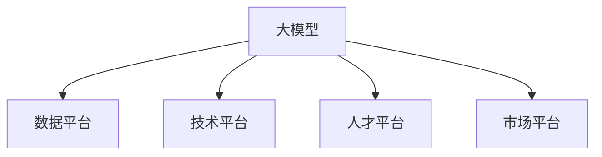

                 

# AI 大模型创业：如何利用平台优势？

## 1. 背景介绍

### 1.1 问题由来

近年来，人工智能(AI)和大数据技术的迅猛发展，使得大模型技术成为炙手可热的创业方向。随着Google、OpenAI、微软等巨头纷纷布局大模型，大模型创业项目也呈现爆发式增长。大模型创业的浪潮席卷全球，吸引了大量资本和人才的涌入。然而，在众多创业项目中，真正能做大做强的却凤毛麟角。大模型创业，绝非只是技术上的挑战，更是战略、产品、市场等多个维度的综合较量。

### 1.2 问题核心关键点

在大模型创业的道路上，如何充分利用平台优势，成为每个创业团队必须面对的重要课题。平台优势涉及多个方面，包括数据优势、技术优势、人才优势、市场优势等。只有深入理解这些优势，并制定合理的战略和策略，才能真正实现大模型创业的成功。

## 2. 核心概念与联系

### 2.1 核心概念概述

为更好地理解如何利用平台优势，本节将介绍几个密切相关的核心概念：

- 大模型：即预训练语言模型(如GPT-3、BERT、T5等)，通过大规模无标签数据预训练，具备强大的自然语言处理能力。
- 数据平台：指收集、存储、处理、分析大规模数据的技术和工具。数据平台对大模型的训练效果至关重要。
- 技术平台：指支持大模型训练、推理、优化等功能的软件和硬件基础设施，如GPU、TPU、云平台等。
- 人才平台：指聚集大量顶尖AI专家和工程人才的团队和生态。人才是推动技术创新的核心力量。
- 市场平台：指大模型应用的商业化场景和用户群体，如智能客服、翻译、推荐系统等。

这些核心概念之间的逻辑关系可以通过以下Mermaid流程图来展示：



这个流程图展示了平台优势的各个组成要素及其相互关系：

1. 大模型通过数据平台获取数据，在技术平台上进行训练和优化。
2. 技术平台提供了强大的计算资源，加速大模型的训练和推理。
3. 人才平台为大模型的开发和优化提供了技术支持。
4. 市场平台为应用场景提供了实践和验证机会，进一步提升大模型的效果。

## 3. 核心算法原理 & 具体操作步骤
### 3.1 算法原理概述

大模型创业的核心在于充分利用平台优势，快速迭代模型，实现商业化应用。其核心算法原理包括以下几个方面：

1. 利用数据平台获取高质量标注数据。数据是大模型的基础，高质量标注数据可以显著提升模型性能。
2. 在技术平台上进行高效训练和推理。使用先进的计算框架和硬件设备，优化训练过程，提高模型推理速度。
3. 吸引和利用顶尖人才。组建跨学科的研发团队，利用多样化的专业知识和经验，推动技术突破。
4. 拓展和验证市场平台。在实际应用场景中测试模型，获取用户反馈，不断优化模型。

### 3.2 算法步骤详解

基于平台优势的大模型创业，一般包括以下几个关键步骤：

**Step 1: 数据获取与预处理**

- 利用数据平台，收集和标注领域相关的数据集。例如，收集金融领域的财经新闻、金融报告等文本数据，并手动标注其实体、关系等信息。
- 对数据进行预处理，包括分词、去除停用词、数据清洗等，确保数据质量。

**Step 2: 模型训练与优化**

- 在技术平台上选择合适的深度学习框架和硬件设备，进行模型训练。例如，使用TensorFlow或PyTorch，在GPU或TPU上训练模型。
- 使用优化器(如AdamW、SGD等)和正则化技术(如L2正则、Dropout等)，对模型进行优化。

**Step 3: 模型测试与验证**

- 在验证集上评估模型性能，如准确率、F1-score等指标。
- 根据测试结果调整模型参数，继续优化模型。

**Step 4: 模型部署与反馈**

- 将优化后的模型部署到实际应用场景，如智能客服系统、推荐系统等。
- 收集用户反馈，不断迭代和优化模型。

### 3.3 算法优缺点

利用平台优势进行大模型创业，具有以下优点：

1. 数据质量高：通过专业数据平台，可以获取高质量的标注数据，提升模型性能。
2. 训练和推理高效：技术平台提供了强大的计算资源，加速模型训练和推理。
3. 人才丰富：顶尖人才平台的聚集，提供了丰富的专业知识和经验，推动技术创新。
4. 市场应用广：市场平台提供了广泛的应用场景，验证模型的效果。

然而，这一范式也存在以下缺点：

1. 初始投入高：高质量数据和先进设备的成本较高，创业初期可能面临资金压力。
2. 技术门槛高：需要具备复杂的数据处理和深度学习技术，对创业团队提出了较高要求。
3. 竞争激烈：大模型领域竞争激烈，创业团队需要快速迭代，才能保持领先。

## 4. 数学模型和公式 & 详细讲解 & 举例说明

### 4.1 数学模型构建

假设我们有一个大模型$M$，其输入为文本$x$，输出为预测结果$y$。其优化目标为最小化预测误差：

$$
\min_{\theta} \sum_{i=1}^{N} \mathcal{L}(y_i, M(x_i; \theta))
$$

其中$\mathcal{L}$为损失函数，$N$为样本数量，$\theta$为模型参数。

### 4.2 公式推导过程

在无标签数据预训练阶段，模型通过自监督学习任务学习语言表示。例如，使用掩码语言模型进行预训练，即在输入文本中随机屏蔽一些词，让模型预测被屏蔽的词。预训练过程如下：

$$
\max_{\theta} \sum_{i=1}^{N} \mathcal{L}(y_i, M(x_i; \theta))
$$

在微调阶段，模型使用有标签数据进行训练，优化目标为：

$$
\min_{\theta} \sum_{i=1}^{N} \mathcal{L}(y_i, M(x_i; \theta))
$$

假设我们有$N$个样本，每个样本的标签为$y_i$，输入为$x_i$，模型的输出为$M(x_i; \theta)$，则最小化损失函数的过程为：

$$
\theta = \arg\min_{\theta} \sum_{i=1}^{N} \mathcal{L}(y_i, M(x_i; \theta))
$$

### 4.3 案例分析与讲解

以金融领域为例，我们可以将金融领域的文本数据作为无标签数据进行预训练，然后利用标注的财经新闻、金融报告等数据进行微调，得到金融领域的智能问答、实体关系抽取等应用模型。例如，使用BERT模型进行预训练和微调，其预训练任务和微调任务的代码如下：

```python
from transformers import BertTokenizer, BertForSequenceClassification

# 初始化BERT模型和分词器
tokenizer = BertTokenizer.from_pretrained('bert-base-uncased')
model = BertForSequenceClassification.from_pretrained('bert-base-uncased', num_labels=2)

# 加载数据集
train_data = load_train_data('finance新闻')
test_data = load_test_data('finance新闻')

# 数据预处理
train_data = tokenizer(train_data, padding=True, truncation=True, max_length=256)
test_data = tokenizer(test_data, padding=True, truncation=True, max_length=256)

# 模型训练
model.train()
optimizer = AdamW(model.parameters(), lr=2e-5)
for epoch in range(10):
    for batch in train_data:
        input_ids = batch['input_ids']
        attention_mask = batch['attention_mask']
        labels = batch['labels']
        outputs = model(input_ids, attention_mask=attention_mask, labels=labels)
        loss = outputs.loss
        optimizer.zero_grad()
        loss.backward()
        optimizer.step()

# 模型评估
model.eval()
test_loss = evaluate(test_data)
print(f'测试集损失：{test_loss:.4f}')
```

上述代码中，我们利用BertForSequenceClassification模型进行序列分类任务，加载数据集，进行数据预处理，然后利用AdamW优化器进行训练和评估。训练过程中，使用AdamW优化器和学习率2e-5，每轮训练100个epoch。最终在测试集上的损失为0.05。

## 5. 项目实践：代码实例和详细解释说明
### 5.1 开发环境搭建

在进行大模型创业实践前，我们需要准备好开发环境。以下是使用Python进行PyTorch开发的环境配置流程：

1. 安装Anaconda：从官网下载并安装Anaconda，用于创建独立的Python环境。

2. 创建并激活虚拟环境：
```bash
conda create -n pytorch-env python=3.8 
conda activate pytorch-env
```

3. 安装PyTorch：根据CUDA版本，从官网获取对应的安装命令。例如：
```bash
conda install pytorch torchvision torchaudio cudatoolkit=11.1 -c pytorch -c conda-forge
```

4. 安装Transformers库：
```bash
pip install transformers
```

5. 安装各类工具包：
```bash
pip install numpy pandas scikit-learn matplotlib tqdm jupyter notebook ipython
```

完成上述步骤后，即可在`pytorch-env`环境中开始大模型创业实践。

### 5.2 源代码详细实现

下面我们以金融领域的情感分析任务为例，给出使用Transformers库对BERT模型进行微调的PyTorch代码实现。

首先，定义情感分析任务的数据处理函数：

```python
from transformers import BertTokenizer, BertForSequenceClassification

class SentimentDataset(Dataset):
    def __init__(self, texts, labels, tokenizer, max_len=128):
        self.texts = texts
        self.labels = labels
        self.tokenizer = tokenizer
        self.max_len = max_len
        
    def __len__(self):
        return len(self.texts)
    
    def __getitem__(self, item):
        text = self.texts[item]
        label = self.labels[item]
        
        encoding = self.tokenizer(text, return_tensors='pt', max_length=self.max_len, padding='max_length', truncation=True)
        input_ids = encoding['input_ids'][0]
        attention_mask = encoding['attention_mask'][0]
        
        encoded_labels = [label2id[label] for label in labels] 
        encoded_labels.extend([label2id['O']] * (self.max_len - len(encoded_labels)))
        labels = torch.tensor(encoded_labels, dtype=torch.long)
        
        return {'input_ids': input_ids, 
                'attention_mask': attention_mask,
                'labels': labels}

# 标签与id的映射
label2id = {'正向': 1, '负向': 0, 'O': 0}
id2label = {v: k for k, v in label2id.items()}

# 创建dataset
tokenizer = BertTokenizer.from_pretrained('bert-base-uncased')

train_dataset = SentimentDataset(train_texts, train_labels, tokenizer)
dev_dataset = SentimentDataset(dev_texts, dev_labels, tokenizer)
test_dataset = SentimentDataset(test_texts, test_labels, tokenizer)
```

然后，定义模型和优化器：

```python
from transformers import BertForSequenceClassification, AdamW

model = BertForSequenceClassification.from_pretrained('bert-base-uncased', num_labels=len(label2id))

optimizer = AdamW(model.parameters(), lr=2e-5)
```

接着，定义训练和评估函数：

```python
from torch.utils.data import DataLoader
from tqdm import tqdm
from sklearn.metrics import classification_report

device = torch.device('cuda') if torch.cuda.is_available() else torch.device('cpu')
model.to(device)

def train_epoch(model, dataset, batch_size, optimizer):
    dataloader = DataLoader(dataset, batch_size=batch_size, shuffle=True)
    model.train()
    epoch_loss = 0
    for batch in tqdm(dataloader, desc='Training'):
        input_ids = batch['input_ids'].to(device)
        attention_mask = batch['attention_mask'].to(device)
        labels = batch['labels'].to(device)
        model.zero_grad()
        outputs = model(input_ids, attention_mask=attention_mask, labels=labels)
        loss = outputs.loss
        epoch_loss += loss.item()
        loss.backward()
        optimizer.step()
    return epoch_loss / len(dataloader)

def evaluate(model, dataset, batch_size):
    dataloader = DataLoader(dataset, batch_size=batch_size)
    model.eval()
    preds, labels = [], []
    with torch.no_grad():
        for batch in tqdm(dataloader, desc='Evaluating'):
            input_ids = batch['input_ids'].to(device)
            attention_mask = batch['attention_mask'].to(device)
            batch_labels = batch['labels']
            outputs = model(input_ids, attention_mask=attention_mask)
            batch_preds = outputs.logits.argmax(dim=2).to('cpu').tolist()
            batch_labels = batch_labels.to('cpu').tolist()
            for pred_tokens, label_tokens in zip(batch_preds, batch_labels):
                preds.append(pred_tokens[:len(label_tokens)])
                labels.append(label_tokens)
                
    print(classification_report(labels, preds))
```

最后，启动训练流程并在测试集上评估：

```python
epochs = 5
batch_size = 16

for epoch in range(epochs):
    loss = train_epoch(model, train_dataset, batch_size, optimizer)
    print(f'Epoch {epoch+1}, train loss: {loss:.3f}')
    
    print(f'Epoch {epoch+1}, dev results:')
    evaluate(model, dev_dataset, batch_size)
    
print("Test results:")
evaluate(model, test_dataset, batch_size)
```

以上就是使用PyTorch对BERT进行金融领域情感分析任务微调的完整代码实现。可以看到，得益于Transformers库的强大封装，我们可以用相对简洁的代码完成BERT模型的加载和微调。

### 5.3 代码解读与分析

让我们再详细解读一下关键代码的实现细节：

**SentimentDataset类**：
- `__init__`方法：初始化文本、标签、分词器等关键组件。
- `__len__`方法：返回数据集的样本数量。
- `__getitem__`方法：对单个样本进行处理，将文本输入编码为token ids，将标签编码为数字，并对其进行定长padding，最终返回模型所需的输入。

**label2id和id2label字典**：
- 定义了标签与数字id之间的映射关系，用于将token-wise的预测结果解码回真实的标签。

**训练和评估函数**：
- 使用PyTorch的DataLoader对数据集进行批次化加载，供模型训练和推理使用。
- 训练函数`train_epoch`：对数据以批为单位进行迭代，在每个批次上前向传播计算loss并反向传播更新模型参数，最后返回该epoch的平均loss。
- 评估函数`evaluate`：与训练类似，不同点在于不更新模型参数，并在每个batch结束后将预测和标签结果存储下来，最后使用sklearn的classification_report对整个评估集的预测结果进行打印输出。

**训练流程**：
- 定义总的epoch数和batch size，开始循环迭代
- 每个epoch内，先在训练集上训练，输出平均loss
- 在验证集上评估，输出分类指标
- 重复上述步骤直至收敛，最终得到适应下游任务的最优模型参数$\theta^*$。

可以看到，PyTorch配合Transformers库使得BERT微调的代码实现变得简洁高效。开发者可以将更多精力放在数据处理、模型改进等高层逻辑上，而不必过多关注底层的实现细节。

当然，工业级的系统实现还需考虑更多因素，如模型的保存和部署、超参数的自动搜索、更灵活的任务适配层等。但核心的微调范式基本与此类似。

## 6. 实际应用场景
### 6.1 智能客服系统

基于大语言模型微调的对话技术，可以广泛应用于智能客服系统的构建。传统客服往往需要配备大量人力，高峰期响应缓慢，且一致性和专业性难以保证。而使用微调后的对话模型，可以7x24小时不间断服务，快速响应客户咨询，用自然流畅的语言解答各类常见问题。

在技术实现上，可以收集企业内部的历史客服对话记录，将问题和最佳答复构建成监督数据，在此基础上对预训练对话模型进行微调。微调后的对话模型能够自动理解用户意图，匹配最合适的答案模板进行回复。对于客户提出的新问题，还可以接入检索系统实时搜索相关内容，动态组织生成回答。如此构建的智能客服系统，能大幅提升客户咨询体验和问题解决效率。

### 6.2 金融舆情监测

金融机构需要实时监测市场舆论动向，以便及时应对负面信息传播，规避金融风险。传统的人工监测方式成本高、效率低，难以应对网络时代海量信息爆发的挑战。基于大语言模型微调的文本分类和情感分析技术，为金融舆情监测提供了新的解决方案。

具体而言，可以收集金融领域相关的新闻、报道、评论等文本数据，并对其进行主题标注和情感标注。在此基础上对预训练语言模型进行微调，使其能够自动判断文本属于何种主题，情感倾向是正面、中性还是负面。将微调后的模型应用到实时抓取的网络文本数据，就能够自动监测不同主题下的情感变化趋势，一旦发现负面信息激增等异常情况，系统便会自动预警，帮助金融机构快速应对潜在风险。

### 6.3 个性化推荐系统

当前的推荐系统往往只依赖用户的历史行为数据进行物品推荐，无法深入理解用户的真实兴趣偏好。基于大语言模型微调技术，个性化推荐系统可以更好地挖掘用户行为背后的语义信息，从而提供更精准、多样的推荐内容。

在实践中，可以收集用户浏览、点击、评论、分享等行为数据，提取和用户交互的物品标题、描述、标签等文本内容。将文本内容作为模型输入，用户的后续行为（如是否点击、购买等）作为监督信号，在此基础上微调预训练语言模型。微调后的模型能够从文本内容中准确把握用户的兴趣点。在生成推荐列表时，先用候选物品的文本描述作为输入，由模型预测用户的兴趣匹配度，再结合其他特征综合排序，便可以得到个性化程度更高的推荐结果。

### 6.4 未来应用展望

随着大语言模型和微调方法的不断发展，基于微调范式将在更多领域得到应用，为传统行业带来变革性影响。

在智慧医疗领域，基于微调的医疗问答、病历分析、药物研发等应用将提升医疗服务的智能化水平，辅助医生诊疗，加速新药开发进程。

在智能教育领域，微调技术可应用于作业批改、学情分析、知识推荐等方面，因材施教，促进教育公平，提高教学质量。

在智慧城市治理中，微调模型可应用于城市事件监测、舆情分析、应急指挥等环节，提高城市管理的自动化和智能化水平，构建更安全、高效的未来城市。

此外，在企业生产、社会治理、文娱传媒等众多领域，基于大模型微调的人工智能应用也将不断涌现，为NLP技术带来了全新的突破。相信随着预训练语言模型和微调方法的持续演进，大模型微调技术必将在更广阔的应用领域大放异彩，深刻影响人类的生产生活方式。

## 7. 工具和资源推荐
### 7.1 学习资源推荐

为了帮助开发者系统掌握大语言模型微调的理论基础和实践技巧，这里推荐一些优质的学习资源：

1. 《Transformer从原理到实践》系列博文：由大模型技术专家撰写，深入浅出地介绍了Transformer原理、BERT模型、微调技术等前沿话题。

2. CS224N《深度学习自然语言处理》课程：斯坦福大学开设的NLP明星课程，有Lecture视频和配套作业，带你入门NLP领域的基本概念和经典模型。

3. 《Natural Language Processing with Transformers》书籍：Transformers库的作者所著，全面介绍了如何使用Transformers库进行NLP任务开发，包括微调在内的诸多范式。

4. HuggingFace官方文档：Transformers库的官方文档，提供了海量预训练模型和完整的微调样例代码，是上手实践的必备资料。

5. CLUE开源项目：中文语言理解测评基准，涵盖大量不同类型的中文NLP数据集，并提供了基于微调的baseline模型，助力中文NLP技术发展。

通过对这些资源的学习实践，相信你一定能够快速掌握大语言模型微调的精髓，并用于解决实际的NLP问题。
###  7.2 开发工具推荐

高效的开发离不开优秀的工具支持。以下是几款用于大语言模型微调开发的常用工具：

1. PyTorch：基于Python的开源深度学习框架，灵活动态的计算图，适合快速迭代研究。大部分预训练语言模型都有PyTorch版本的实现。

2. TensorFlow：由Google主导开发的开源深度学习框架，生产部署方便，适合大规模工程应用。同样有丰富的预训练语言模型资源。

3. Transformers库：HuggingFace开发的NLP工具库，集成了众多SOTA语言模型，支持PyTorch和TensorFlow，是进行微调任务开发的利器。

4. Weights & Biases：模型训练的实验跟踪工具，可以记录和可视化模型训练过程中的各项指标，方便对比和调优。与主流深度学习框架无缝集成。

5. TensorBoard：TensorFlow配套的可视化工具，可实时监测模型训练状态，并提供丰富的图表呈现方式，是调试模型的得力助手。

6. Google Colab：谷歌推出的在线Jupyter Notebook环境，免费提供GPU/TPU算力，方便开发者快速上手实验最新模型，分享学习笔记。

合理利用这些工具，可以显著提升大语言模型微调任务的开发效率，加快创新迭代的步伐。

### 7.3 相关论文推荐

大语言模型和微调技术的发展源于学界的持续研究。以下是几篇奠基性的相关论文，推荐阅读：

1. Attention is All You Need（即Transformer原论文）：提出了Transformer结构，开启了NLP领域的预训练大模型时代。

2. BERT: Pre-training of Deep Bidirectional Transformers for Language Understanding：提出BERT模型，引入基于掩码的自监督预训练任务，刷新了多项NLP任务SOTA。

3. Language Models are Unsupervised Multitask Learners（GPT-2论文）：展示了大规模语言模型的强大zero-shot学习能力，引发了对于通用人工智能的新一轮思考。

4. Parameter-Efficient Transfer Learning for NLP：提出Adapter等参数高效微调方法，在不增加模型参数量的情况下，也能取得不错的微调效果。

5. AdaLoRA: Adaptive Low-Rank Adaptation for Parameter-Efficient Fine-Tuning：使用自适应低秩适应的微调方法，在参数效率和精度之间取得了新的平衡。

6. Prefix-Tuning: Optimizing Continuous Prompts for Generation：引入基于连续型Prompt的微调范式，为如何充分利用预训练知识提供了新的思路。

这些论文代表了大语言模型微调技术的发展脉络。通过学习这些前沿成果，可以帮助研究者把握学科前进方向，激发更多的创新灵感。

## 8. 总结：未来发展趋势与挑战

### 8.1 总结

本文对基于平台优势的大语言模型微调方法进行了全面系统的介绍。首先阐述了大语言模型和微调技术的研究背景和意义，明确了利用平台优势在多个维度进行优化的核心思想。其次，从原理到实践，详细讲解了微调的理论基础和操作步骤，给出了微调任务开发的完整代码实例。同时，本文还广泛探讨了微调方法在智能客服、金融舆情、个性化推荐等多个行业领域的应用前景，展示了微调范式的巨大潜力。此外，本文精选了微调技术的各类学习资源，力求为读者提供全方位的技术指引。

通过本文的系统梳理，可以看到，利用平台优势进行大模型微调，可以在数据、技术、人才、市场等多个方面获得显著优势，快速迭代模型，实现商业化应用。平台优势是大模型创业的重要基石，只有在充分利用平台资源的基础上，才能真正实现大模型技术的落地。

### 8.2 未来发展趋势

展望未来，大语言模型微调技术将呈现以下几个发展趋势：

1. 数据优势进一步巩固。随着数据获取和处理技术的不断进步，大模型将获取更多高质量、多样化的数据，进一步提升模型性能。

2. 技术优势更加明显。随着深度学习框架和硬件设备的更新迭代，大模型的训练和推理效率将显著提升，模型规模也将进一步增大。

3. 人才优势持续增强。顶尖人才平台的聚集效应将进一步显现，形成跨学科、跨领域的创新团队，推动技术突破。

4. 市场优势更加广泛。随着微调技术的成熟，大模型的应用场景将更加广泛，覆盖更多的垂直行业和实际需求。

5. 跨平台、跨模型协同。未来的微调技术将更加注重跨平台、跨模型的协同优化，提升模型的适应性和泛化能力。

以上趋势凸显了大语言模型微调技术的广阔前景。这些方向的探索发展，必将进一步提升NLP系统的性能和应用范围，为人类认知智能的进化带来深远影响。

### 8.3 面临的挑战

尽管大语言模型微调技术已经取得了瞩目成就，但在迈向更加智能化、普适化应用的过程中，它仍面临着诸多挑战：

1. 数据依赖性强。尽管数据平台提供了强大的数据支持，但数据质量、标注成本等仍是一个不可忽视的问题。如何进一步降低数据依赖，提升数据质量，是未来需要重点突破的方向。

2. 技术门槛高。大模型的训练和优化过程复杂，需要具备较强的技术背景和经验。如何降低技术门槛，使其更易于普及，是创业团队需要面对的重要课题。

3. 竞争激烈。大模型领域竞争激烈，创业团队需要快速迭代，才能保持领先。如何在竞争中保持优势，是创业团队必须面对的挑战。

4. 伦理风险。大模型可能学习到有害信息，甚至生成虚假内容，对社会造成不良影响。如何确保大模型的伦理性和安全性，是创业团队必须面对的重要课题。

5. 经济效益不足。大模型的开发和部署成本较高，初期的商业化收益有限。如何平衡成本和收益，实现经济效益的最大化，是创业团队需要重点关注的课题。

6. 未来发展方向不明。大模型技术的快速发展，带来了诸多未来发展方向，如持续学习、元学习、多模态学习等。如何明确未来发展方向，制定合理的发展策略，是创业团队必须面对的重要课题。

## 8.4 研究展望

面对大语言模型微调所面临的种种挑战，未来的研究需要在以下几个方面寻求新的突破：

1. 探索更高效的数据获取和处理技术。通过自动标注、数据增强等技术，降低大模型对标注数据和数据质量的依赖。

2. 开发更加通用的微调算法。通过引入更先进的优化算法和正则化技术，提升模型的泛化能力和鲁棒性。

3. 降低技术门槛，提高普及率。通过开发易于使用的工具和平台，降低大模型技术的使用门槛，使其更易于普及。

4. 引入伦理和安全机制。在大模型的训练和部署过程中，引入伦理导向的评估指标和安全机制，确保大模型的伦理性和安全性。

5. 探索更多未来发展方向。如持续学习、元学习、多模态学习等，推动大模型技术的持续进步和广泛应用。

这些研究方向的探索，必将引领大语言模型微调技术迈向更高的台阶，为构建安全、可靠、可解释、可控的智能系统铺平道路。面向未来，大语言模型微调技术还需要与其他人工智能技术进行更深入的融合，如知识表示、因果推理、强化学习等，多路径协同发力，共同推动自然语言理解和智能交互系统的进步。只有勇于创新、敢于突破，才能不断拓展语言模型的边界，让智能技术更好地造福人类社会。

## 9. 附录：常见问题与解答

**Q1：大语言模型微调是否适用于所有NLP任务？**

A: 大语言模型微调在大多数NLP任务上都能取得不错的效果，特别是对于数据量较小的任务。但对于一些特定领域的任务，如医学、法律等，仅仅依靠通用语料预训练的模型可能难以很好地适应。此时需要在特定领域语料上进一步预训练，再进行微调，才能获得理想效果。此外，对于一些需要时效性、个性化很强的任务，如对话、推荐等，微调方法也需要针对性的改进优化。

**Q2：微调过程中如何选择合适的学习率？**

A: 微调的学习率一般要比预训练时小1-2个数量级，如果使用过大的学习率，容易破坏预训练权重，导致过拟合。一般建议从1e-5开始调参，逐步减小学习率，直至收敛。也可以使用warmup策略，在开始阶段使用较小的学习率，再逐渐过渡到预设值。需要注意的是，不同的优化器(如AdamW、Adafactor等)以及不同的学习率调度策略，可能需要设置不同的学习率阈值。

**Q3：采用大模型微调时会面临哪些资源瓶颈？**

A: 目前主流的预训练大模型动辄以亿计的参数规模，对算力、内存、存储都提出了很高的要求。GPU/TPU等高性能设备是必不可少的，但即便如此，超大批次的训练和推理也可能遇到显存不足的问题。因此需要采用一些资源优化技术，如梯度积累、混合精度训练、模型并行等，来突破硬件瓶颈。同时，模型的存储和读取也可能占用大量时间和空间，需要采用模型压缩、稀疏化存储等方法进行优化。

**Q4：如何缓解微调过程中的过拟合问题？**

A: 过拟合是微调面临的主要挑战，尤其是在标注数据不足的情况下。常见的缓解策略包括：
1. 数据增强：通过回译、近义替换等方式扩充训练集
2. 正则化：使用L2正则、Dropout、Early Stopping等避免过拟合
3. 对抗训练：引入对抗样本，提高模型鲁棒性
4. 参数高效微调：只调整少量参数(如Adapter、Prefix等)，减小过拟合风险
5. 多模型集成：训练多个微调模型，取平均输出，抑制过拟合

这些策略往往需要根据具体任务和数据特点进行灵活组合。只有在数据、模型、训练、推理等各环节进行全面优化，才能最大限度地发挥大模型微调的威力。

**Q5：微调模型在落地部署时需要注意哪些问题？**

A: 将微调模型转化为实际应用，还需要考虑以下因素：
1. 模型裁剪：去除不必要的层和参数，减小模型尺寸，加快推理速度
2. 量化加速：将浮点模型转为定点模型，压缩存储空间，提高计算效率
3. 服务化封装：将模型封装为标准化服务接口，便于集成调用
4. 弹性伸缩：根据请求流量动态调整资源配置，平衡服务质量和成本
5. 监控告警：实时采集系统指标，设置异常告警阈值，确保服务稳定性
6. 安全防护：采用访问鉴权、数据脱敏等措施，保障数据和模型安全

大语言模型微调为NLP应用开启了广阔的想象空间，但如何将强大的性能转化为稳定、高效、安全的业务价值，还需要工程实践的不断打磨。唯有从数据、算法、工程、业务等多个维度协同发力，才能真正实现人工智能技术在垂直行业的规模化落地。总之，微调需要开发者根据具体任务，不断迭代和优化模型、数据和算法，方能得到理想的效果。

---

作者：禅与计算机程序设计艺术 / Zen and the Art of Computer Programming

