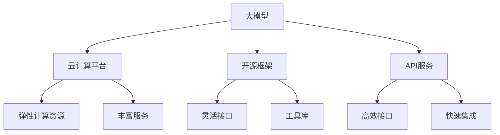

                 

## 1. 背景介绍

### 1.1 问题由来

随着人工智能(AI)技术的飞速发展，大模型（Large Models）在各行各业的应用越来越广泛。无论是语音识别、图像处理，还是自然语言处理（NLP）、医疗诊断等领域，大模型都展现了其卓越的性能和潜力。然而，大模型的开发和部署往往需要大量的计算资源和数据，普通创业公司难以承担。如何利用现有平台优势，快速构建自己的大模型应用，成为许多创业者的关注焦点。

### 1.2 问题核心关键点

利用平台优势构建大模型应用的关键在于选择合适的平台，并充分利用其提供的工具和资源。目前市场上主流的平台包括云平台、开源框架和API服务等。这些平台不仅提供了强大的计算能力和丰富的工具库，还具备了易于使用的开发接口和丰富的社区支持。

在实践中，创业者需要考虑以下几个核心关键点：

- 计算资源的获取方式：是自建数据中心，还是利用云平台提供的计算资源。
- 模型选择和优化策略：如何选择合适的模型架构，并对其进行高效优化。
- 数据管理和隐私保护：如何管理和保护数据，确保数据的隐私和安全。
- 模型部署和维护：如何高效地部署模型，并进行持续的维护和优化。
- 商业模式和盈利方式：如何设计合理的商业模式，实现可持续发展。

### 1.3 问题研究意义

利用平台优势构建大模型应用，对于降低创业门槛、加速技术落地、推动行业创新具有重要意义：

1. **降低成本**：利用云计算平台提供的按需计费模式，降低创业初期的计算资源投入。
2. **提升效率**：借助现有平台提供的工具和资源，加速模型开发和迭代进程。
3. **扩大应用范围**：利用开源社区和API服务，快速构建应用场景，扩展市场覆盖。
4. **推动创新**：利用平台的资源和能力，尝试更多前沿技术和应用。
5. **实现盈利**：通过平台优势，设计合理的商业模式，实现盈利。

## 2. 核心概念与联系

### 2.1 核心概念概述

- **大模型（Large Models）**：指具有数百万或亿级参数的深度神经网络模型，能够在特定任务上表现出卓越的性能。
- **云计算平台（Cloud Platforms）**：如AWS、Google Cloud、阿里云等，提供弹性计算资源和丰富的服务，支持大规模AI模型的训练和部署。
- **开源框架（Open Source Frameworks）**：如TensorFlow、PyTorch等，提供灵活的开发接口和丰富的工具库，支持模型的快速开发和优化。
- **API服务（API Services）**：如Google Vision、AWS SageMaker等，提供高效的服务接口，支持模型快速集成和部署。

这些核心概念之间相互关联，共同构成了大模型创业的技术基础。通过理解这些概念及其联系，可以更好地把握大模型创业的技术方向和应用场景。

### 2.2 核心概念原理和架构的 Mermaid 流程图



这个流程图展示了大模型、云计算平台、开源框架和API服务之间的关系及其功能：

1. 大模型作为核心技术，依赖云计算平台提供的计算资源和丰富服务进行训练和推理。
2. 开源框架提供了灵活的开发接口和丰富的工具库，支持模型的快速开发和优化。
3. API服务提供了高效的服务接口，支持模型快速集成和部署。

## 3. 核心算法原理 & 具体操作步骤

### 3.1 算法原理概述

利用平台优势构建大模型应用，主要依赖于以下几个核心算法原理：

- **云计算平台提供的弹性计算资源**：通过按需计费模式，获取计算资源，支持大规模模型的训练和推理。
- **开源框架提供的灵活接口和工具库**：提供高效的开发和优化手段，支持模型的快速迭代和性能提升。
- **API服务提供的高效接口和快速集成**：支持模型快速部署和应用集成，提高系统可扩展性和灵活性。

### 3.2 算法步骤详解

构建大模型应用的基本步骤包括：

1. **选择合适的平台**：根据自身需求和技术背景，选择合适的云计算平台、开源框架和API服务。
2. **获取计算资源**：利用云计算平台提供的弹性计算资源，构建高效的模型训练和推理环境。
3. **选择和优化模型**：根据应用需求，选择合适的模型架构，并利用开源框架进行高效的模型开发和优化。
4. **管理数据和隐私**：确保数据的隐私和安全，并利用平台提供的数据管理工具进行高效的数据处理和存储。
5. **部署和维护模型**：利用API服务提供的高效接口，快速部署模型，并进行持续的维护和优化。
6. **设计商业模式**：根据平台资源和市场应用，设计合理的商业模式，实现可持续发展。

### 3.3 算法优缺点

利用平台优势构建大模型应用，具有以下优点：

- **降低成本**：按需计费模式降低了计算资源的投入。
- **提升效率**：丰富的工具和资源支持加速模型开发和优化。
- **易于扩展**：高效的API接口支持快速集成和部署。
- **灵活性高**：开放的技术生态支持多种模型和算法选择。

同时，也存在一些缺点：

- **依赖平台**：依赖平台提供的资源和工具，难以完全自主控制。
- **性能瓶颈**：云平台提供的计算资源可能有性能瓶颈，影响模型性能。
- **数据隐私**：在数据管理和隐私保护方面可能存在风险。
- **商业限制**：平台可能对商业应用有所限制。

### 3.4 算法应用领域

大模型应用领域广泛，利用平台优势可以快速构建应用，包括但不限于以下几个领域：

- **自然语言处理（NLP）**：如文本分类、情感分析、机器翻译等。
- **计算机视觉（CV）**：如图像识别、目标检测、图像生成等。
- **语音识别（ASR）**：如语音转文本、语音合成等。
- **医疗诊断**：如医学影像分析、病理诊断等。
- **金融分析**：如股票预测、信用评分等。
- **推荐系统**：如商品推荐、新闻推荐等。

## 4. 数学模型和公式 & 详细讲解 & 举例说明

### 4.1 数学模型构建

构建大模型的数学模型主要包括以下几个部分：

- **输入层**：将原始数据（如图像、文本）转换为模型可处理的向量表示。
- **隐含层**：通过多层神经网络进行特征提取和抽象。
- **输出层**：根据具体任务，输出模型预测结果。

### 4.2 公式推导过程

以图像分类任务为例，其数学模型可以表示为：

$$
y = \text{softmax}(W^T z + b)
$$

其中，$z$为输入层向量表示，$W$为权重矩阵，$b$为偏置向量，$y$为输出向量。

### 4.3 案例分析与讲解

以BERT模型为例，其数学模型可以表示为：

$$
H = \text{Transformer}(X)
$$

其中，$X$为输入序列，$H$为模型输出表示。BERT模型的Transformer层包括多头自注意力机制和前馈神经网络，能够对输入序列进行高效的特征提取和表示。

## 5. 项目实践：代码实例和详细解释说明

### 5.1 开发环境搭建

构建大模型应用，首先需要搭建开发环境。以下是使用Python进行TensorFlow开发的环境配置流程：

1. 安装Anaconda：从官网下载并安装Anaconda，用于创建独立的Python环境。

2. 创建并激活虚拟环境：
```bash
conda create -n tf-env python=3.8 
conda activate tf-env
```

3. 安装TensorFlow：根据CUDA版本，从官网获取对应的安装命令。例如：
```bash
conda install tensorflow=2.6 tf-nightly -c tf -c conda-forge
```

4. 安装TensorBoard：
```bash
pip install tensorboard
```

5. 安装NumPy、Pandas、Matplotlib等常用工具包：
```bash
pip install numpy pandas matplotlib scikit-learn tqdm jupyter notebook ipython
```

完成上述步骤后，即可在`tf-env`环境中开始模型开发。

### 5.2 源代码详细实现

下面我们以图像分类任务为例，给出使用TensorFlow进行模型开发的PyTorch代码实现。

首先，定义模型结构：

```python
import tensorflow as tf
from tensorflow.keras import layers

class ImageClassifier(tf.keras.Model):
    def __init__(self):
        super(ImageClassifier, self).__init__()
        self.conv1 = layers.Conv2D(32, 3, activation='relu')
        self.maxpool = layers.MaxPooling2D()
        self.flatten = layers.Flatten()
        self.fc1 = layers.Dense(128, activation='relu')
        self.fc2 = layers.Dense(10, activation='softmax')

    def call(self, inputs):
        x = self.conv1(inputs)
        x = self.maxpool(x)
        x = self.flatten(x)
        x = self.fc1(x)
        return self.fc2(x)
```

然后，定义损失函数和优化器：

```python
from tensorflow.keras import losses, optimizers

model = ImageClassifier()
criterion = losses.SparseCategoricalCrossentropy(from_logits=True)
optimizer = optimizers.Adam(learning_rate=0.001)
```

接着，定义训练和评估函数：

```python
@tf.function
def train_epoch(model, train_dataset, optimizer):
    model.train()
    for batch, (images, labels) in tfds.tfds_as_dataframe(train_dataset).batch(32):
        with tf.GradientTape() as tape:
            logits = model(images)
            loss = criterion(labels, logits)
        grads = tape.gradient(loss, model.trainable_variables)
        optimizer.apply_gradients(zip(grads, model.trainable_variables))
        if tf.math.equal(batch, 0) % 10 == 0:
            print(f"Epoch {epoch+1}, loss: {loss.numpy()}")

@tf.function
def evaluate(model, test_dataset):
    model.eval()
    correct = 0
    total = 0
    for batch, (images, labels) in tfds.tfds_as_dataframe(test_dataset).batch(32):
        logits = model(images)
        predicted_labels = tf.argmax(logits, axis=-1)
        correct += tf.reduce_sum(tf.cast(tf.equal(predicted_labels, labels), tf.int32))
        total += labels.shape[0]
    accuracy = correct / total
    print(f"Accuracy: {accuracy.numpy()}")
```

最后，启动训练流程并在测试集上评估：

```python
epochs = 10
steps_per_epoch = 5000

for epoch in range(epochs):
    train_epoch(model, train_dataset, optimizer)
    evaluate(model, test_dataset)
```

以上就是使用TensorFlow对图像分类模型进行开发的完整代码实现。可以看到，得益于TensorFlow的强大封装，我们可以用相对简洁的代码完成模型的开发和训练。

### 5.3 代码解读与分析

让我们再详细解读一下关键代码的实现细节：

**ImageClassifier类**：
- `__init__`方法：初始化模型结构，包括卷积层、池化层、全连接层等。
- `call`方法：定义模型前向传播的过程，逐层处理输入数据。

**loss和optimizer定义**：
- 选择合适的损失函数（SparseCategoricalCrossentropy）和优化器（Adam），配置学习率等参数。

**train_epoch和evaluate函数**：
- `train_epoch`函数：对模型进行批量训练，每次前向传播计算损失，反向传播更新参数。
- `evaluate`函数：对模型进行批量评估，计算预测准确率并输出。

**训练流程**：
- 定义总的epoch数和批大小，开始循环迭代
- 每个epoch内，在训练集上训练，并在验证集上评估
- 重复上述步骤直至达到预设的迭代轮数或准确率提升

可以看到，TensorFlow的TFDS数据集和tf.function等特性，使得模型开发和训练过程变得高效简洁。通过学习这些特性，可以显著提升大模型的开发效率。

当然，实际应用中还需要进一步优化和调试模型，以确保其在特定场景下达到最优性能。

## 6. 实际应用场景

### 6.1 智能客服系统

基于大模型应用的智能客服系统可以显著提升客户服务质量。传统客服往往依赖人力，高峰期响应缓慢，且服务质量难以保证。而利用大模型进行自然语言处理，可以7x24小时不间断服务，快速响应客户咨询，用自然流畅的语言解答各类常见问题。

在技术实现上，可以收集企业内部的历史客服对话记录，将问题和最佳答复构建成监督数据，在此基础上对预训练语言模型进行微调。微调后的语言模型能够自动理解用户意图，匹配最合适的答案模板进行回复。对于客户提出的新问题，还可以接入检索系统实时搜索相关内容，动态组织生成回答。

### 6.2 金融舆情监测

金融机构需要实时监测市场舆论动向，以便及时应对负面信息传播，规避金融风险。传统的人工监测方式成本高、效率低，难以应对网络时代海量信息爆发的挑战。基于大模型应用的文本分类和情感分析技术，为金融舆情监测提供了新的解决方案。

具体而言，可以收集金融领域相关的新闻、报道、评论等文本数据，并对其进行主题标注和情感标注。在此基础上对预训练语言模型进行微调，使其能够自动判断文本属于何种主题，情感倾向是正面、中性还是负面。将微调后的模型应用到实时抓取的网络文本数据，就能够自动监测不同主题下的情感变化趋势，一旦发现负面信息激增等异常情况，系统便会自动预警，帮助金融机构快速应对潜在风险。

### 6.3 个性化推荐系统

当前的推荐系统往往只依赖用户的历史行为数据进行物品推荐，无法深入理解用户的真实兴趣偏好。基于大模型应用，个性化推荐系统可以更好地挖掘用户行为背后的语义信息，从而提供更精准、多样的推荐内容。

在实践中，可以收集用户浏览、点击、评论、分享等行为数据，提取和用户交互的物品标题、描述、标签等文本内容。将文本内容作为模型输入，用户的后续行为（如是否点击、购买等）作为监督信号，在此基础上微调预训练语言模型。微调后的模型能够从文本内容中准确把握用户的兴趣点。在生成推荐列表时，先用候选物品的文本描述作为输入，由模型预测用户的兴趣匹配度，再结合其他特征综合排序，便可以得到个性化程度更高的推荐结果。

### 6.4 未来应用展望

随着大模型和微调方法的不断发展，基于大模型应用的方法将在更多领域得到应用，为传统行业带来变革性影响。

在智慧医疗领域，基于大模型应用的医疗问答、病历分析、药物研发等应用将提升医疗服务的智能化水平，辅助医生诊疗，加速新药开发进程。

在智能教育领域，微调技术可应用于作业批改、学情分析、知识推荐等方面，因材施教，促进教育公平，提高教学质量。

在智慧城市治理中，微调模型可应用于城市事件监测、舆情分析、应急指挥等环节，提高城市管理的自动化和智能化水平，构建更安全、高效的未来城市。

此外，在企业生产、社会治理、文娱传媒等众多领域，基于大模型应用的人工智能应用也将不断涌现，为经济社会发展注入新的动力。相信随着技术的日益成熟，大模型应用必将在更广阔的应用领域大放异彩，深刻影响人类的生产生活方式。

## 7. 工具和资源推荐

### 7.1 学习资源推荐

为了帮助开发者系统掌握大模型应用的理论基础和实践技巧，这里推荐一些优质的学习资源：

1. 《深度学习入门》系列博文：由大模型技术专家撰写，深入浅出地介绍了深度学习的基本概念和经典模型。

2. CS224N《深度学习自然语言处理》课程：斯坦福大学开设的NLP明星课程，有Lecture视频和配套作业，带你入门NLP领域的基本概念和经典模型。

3. 《自然语言处理综述》书籍：全面介绍了NLP的基本概念、技术和应用，适合快速入门。

4. HuggingFace官方文档：提供海量预训练模型和完整的微调样例代码，是上手实践的必备资料。

5. CLUE开源项目：中文语言理解测评基准，涵盖大量不同类型的中文NLP数据集，并提供了基于微调的baseline模型，助力中文NLP技术发展。

通过对这些资源的学习实践，相信你一定能够快速掌握大模型应用的精髓，并用于解决实际的NLP问题。

### 7.2 开发工具推荐

高效的开发离不开优秀的工具支持。以下是几款用于大模型应用开发的常用工具：

1. TensorFlow：基于Python的开源深度学习框架，灵活动态的计算图，适合快速迭代研究。大部分预训练语言模型都有TensorFlow版本的实现。

2. PyTorch：基于Python的开源深度学习框架，灵活的动态图，适合研究原生态模型。

3. Keras：高层次的深度学习API，提供简单便捷的接口，适合快速构建模型。

4. Weights & Biases：模型训练的实验跟踪工具，可以记录和可视化模型训练过程中的各项指标，方便对比和调优。与主流深度学习框架无缝集成。

5. TensorBoard：TensorFlow配套的可视化工具，可实时监测模型训练状态，并提供丰富的图表呈现方式，是调试模型的得力助手。

6. Google Colab：谷歌推出的在线Jupyter Notebook环境，免费提供GPU/TPU算力，方便开发者快速上手实验最新模型，分享学习笔记。

合理利用这些工具，可以显著提升大模型应用的开发效率，加快创新迭代的步伐。

### 7.3 相关论文推荐

大模型应用的发展源于学界的持续研究。以下是几篇奠基性的相关论文，推荐阅读：

1. Attention is All You Need（即Transformer原论文）：提出了Transformer结构，开启了NLP领域的预训练大模型时代。

2. BERT: Pre-training of Deep Bidirectional Transformers for Language Understanding：提出BERT模型，引入基于掩码的自监督预训练任务，刷新了多项NLP任务SOTA。

3. Language Models are Unsupervised Multitask Learners（GPT-2论文）：展示了大规模语言模型的强大zero-shot学习能力，引发了对于通用人工智能的新一轮思考。

4. Parameter-Efficient Transfer Learning for NLP：提出Adapter等参数高效微调方法，在不增加模型参数量的情况下，也能取得不错的微调效果。

5. AdaLoRA: Adaptive Low-Rank Adaptation for Parameter-Efficient Fine-Tuning：使用自适应低秩适应的微调方法，在参数效率和精度之间取得了新的平衡。

6. PocketBERT: Mobile-Powered Transfer Learning for Resource-Constrained NLP Tasks：提出轻量级BERT模型，支持移动设备上的模型部署。

这些论文代表了大模型应用的发展脉络。通过学习这些前沿成果，可以帮助研究者把握学科前进方向，激发更多的创新灵感。

## 8. 总结：未来发展趋势与挑战

### 8.1 总结

本文对利用平台优势构建大模型应用的方法进行了全面系统的介绍。首先阐述了基于平台优势构建大模型应用的背景和意义，明确了利用云计算平台、开源框架和API服务进行大模型应用开发的优势。其次，从原理到实践，详细讲解了平台优势下的大模型开发流程，给出了完整的代码实例。同时，本文还广泛探讨了大模型应用在智能客服、金融舆情、个性化推荐等多个领域的应用前景，展示了平台优势下的大模型应用潜力。此外，本文精选了相关学习资源，力求为读者提供全方位的技术指引。

通过本文的系统梳理，可以看到，利用平台优势构建大模型应用的方法正在成为NLP领域的重要范式，极大地拓展了预训练语言模型的应用边界，催生了更多的落地场景。受益于云计算平台、开源框架和API服务提供的强大资源，大模型应用将具备更高的可扩展性、灵活性和高效性，推动NLP技术的产业化进程。未来，伴随大模型和微调方法的持续演进，基于平台优势的大模型应用必将展现出更大的应用前景和潜力。

### 8.2 未来发展趋势

展望未来，大模型应用将呈现以下几个发展趋势：

1. **计算资源普及化**：随着云计算技术的发展，计算资源的获取将更加便捷和经济，推动大模型应用的普及和深化。

2. **模型架构多样化**：未来的模型将更加多样化和定制化，满足不同应用场景的需求。

3. **应用场景多样化**：大模型应用将覆盖更多领域，如医疗、教育、金融、制造等，为各行业带来智能化转型。

4. **融合多模态数据**：未来的应用将更加注重多模态数据的融合，如文本、图像、语音、视频等，提升系统的感知能力和推理能力。

5. **实时性和效率提升**：通过优化模型架构和算法，提升模型推理速度和效率，支持实时应用。

6. **安全性和隐私保护**：随着模型应用的广泛，数据隐私和安全问题将更加突出，需要设计更完善的安全机制和隐私保护策略。

### 8.3 面临的挑战

尽管大模型应用前景广阔，但在迈向更加智能化、普适化应用的过程中，它仍面临着诸多挑战：

1. **数据获取困难**：特别是小数据集上的大模型应用，需要大量标注数据，难以获取。

2. **计算资源限制**：尽管云计算平台提供了强大的计算资源，但在特定场景下，仍可能存在计算资源不足的问题。

3. **模型复杂度高**：大模型参数量庞大，模型训练和推理需要较高的计算资源，存在一定的资源消耗。

4. **模型可解释性不足**：大模型作为"黑盒"系统，难以解释其内部工作机制和决策逻辑，在特定应用场景下可能不适用。

5. **数据隐私问题**：在数据管理和隐私保护方面可能存在风险，需要设计合理的隐私保护策略。

6. **商业模式不明确**：大模型应用的商业模式尚未完全成熟，需要探索和设计合理的盈利模式。

### 8.4 研究展望

面对大模型应用所面临的种种挑战，未来的研究需要在以下几个方面寻求新的突破：

1. **数据增强和少样本学习**：通过数据增强和少样本学习技术，降低对标注数据的依赖，提高模型泛化能力。

2. **参数高效微调和模型压缩**：开发更加参数高效和轻量级的微调方法，支持高效模型部署。

3. **多模态融合和跨领域迁移**：探索多模态数据融合和跨领域迁移的方法，提升系统的感知和推理能力。

4. **模型可解释性和透明性**：研究模型可解释性技术，增强系统的透明性和可控性。

5. **隐私保护和安全机制**：设计更完善的隐私保护和安全机制，保障数据隐私和安全。

6. **商业模型创新**：探索多样化的商业模型，确保可持续发展。

这些研究方向的探索，必将引领大模型应用技术迈向更高的台阶，为构建安全、可靠、可解释、可控的智能系统铺平道路。面向未来，大模型应用需要与其他人工智能技术进行更深入的融合，如知识表示、因果推理、强化学习等，多路径协同发力，共同推动自然语言理解和智能交互系统的进步。只有勇于创新、敢于突破，才能不断拓展语言模型的边界，让智能技术更好地造福人类社会。

## 9. 附录：常见问题与解答

**Q1：大模型应用是否可以完全自主构建？**

A: 大模型应用可以自主构建，但需要在计算资源、数据获取、模型选择等方面具备一定的技术和资金实力。利用平台优势可以显著降低构建成本和复杂度，加速模型开发和应用部署。

**Q2：如何选择合适的平台？**

A: 选择合适的平台需要考虑以下几个因素：计算资源、工具库丰富度、API接口易用性、社区支持等。建议根据自身需求和技术背景进行选择，如AWS、Google Cloud、阿里云等主流云平台，以及TensorFlow、PyTorch、Keras等主流开源框架。

**Q3：大模型应用如何处理数据隐私问题？**

A: 数据隐私是大模型应用的重要问题，需要设计合理的隐私保护策略。如数据匿名化、差分隐私、联邦学习等技术，确保数据隐私和安全。

**Q4：大模型应用如何优化推理速度？**

A: 推理速度优化可以从多个方面入手，如模型压缩、剪枝、量化、模型并行等技术。合理选择模型架构和优化算法，可以有效提升模型推理速度。

**Q5：大模型应用如何设计商业模型？**

A: 设计商业模型需要考虑多个因素，如市场需求、成本控制、收入模式等。建议从应用场景和市场前景出发，设计合理的商业模式，确保可持续发展。

通过回答这些问题，希望能进一步澄清大模型应用的构建思路和关键点，为读者提供更全面的指导和参考。

---

作者：禅与计算机程序设计艺术 / Zen and the Art of Computer Programming

