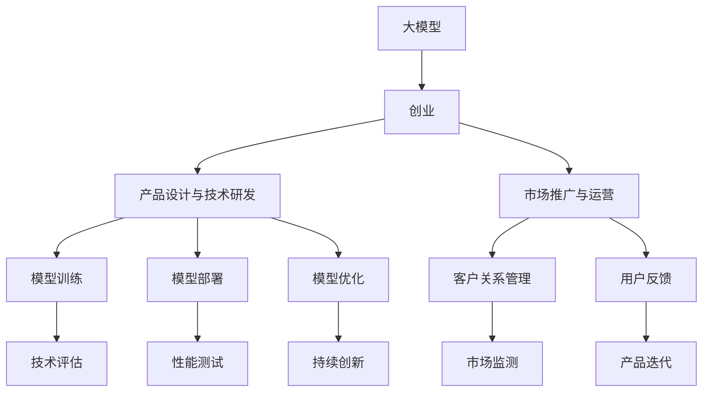

                 

# AI 大模型创业：如何利用未来优势？

> 关键词：大模型,创业,未来优势,AI,自然语言处理,NLP

## 1. 背景介绍

### 1.1 问题由来
当前，人工智能(AI)技术在各行各业的应用已初见成效，大模型成为了推动AI发展的关键引擎。然而，尽管大模型在技术研发和市场应用上取得了显著进步，但其商业化过程仍面临诸多挑战，如技术壁垒、市场接受度、监管政策等。本文将围绕大模型创业的核心要素展开，探讨如何利用未来优势，成功开创AI大模型领域的创业之路。

### 1.2 问题核心关键点
大模型创业涉及技术、市场、运营、政策等多方面要素。成功创业的关键在于以下几方面：
- **技术领先**：掌握核心技术，保持持续创新。
- **市场适应**：精准定位目标市场，满足用户需求。
- **运营高效**：具备高效的模型训练、部署和运维能力。
- **政策合规**：理解并遵守AI领域的法律法规，保障数据和模型安全。

这些核心关键点构成了大模型创业的全貌，本文将系统梳理这些要素，并提出具体的实施策略。

## 2. 核心概念与联系

### 2.1 核心概念概述

为深入理解大模型创业的各个要素，本节将介绍几个密切相关的核心概念：

- **大模型(Large Model)**：指具有数十亿至数百亿参数的深度学习模型，如GPT-4、BERT等，具备强大的泛化能力和处理复杂任务的能力。
- **创业(Creation)**：指创建并运营初创企业的全过程，涵盖产品设计、技术研发、市场推广等各个环节。
- **未来优势(Future Advantage)**：指利用最新技术、市场趋势、政策环境等未来因素，打造竞争优势的过程。

这些概念之间的联系可以通过以下Mermaid流程图来展示：



这个流程图展示了大模型创业的关键环节及其相互关系：

1. 大模型作为核心资源，与创业过程紧密结合。
2. 产品设计与技术研发阶段需重点关注模型训练与优化，确保模型具备高性能与高泛化能力。
3. 市场推广与运营阶段则需关注模型部署与用户反馈，保障产品顺利落地。
4. 技术评估、性能测试、持续创新等环节，进一步提升模型性能与市场竞争力。

## 3. 核心算法原理 & 具体操作步骤
### 3.1 算法原理概述

大模型创业的核心在于充分利用大模型的未来优势，推动产品创新和市场竞争力的提升。这一过程主要涉及以下几个关键算法原理：

- **预训练与微调(Pre-training & Fine-tuning)**：通过在大规模数据上预训练模型，再在其上微调以适配特定任务。
- **迁移学习(Transfer Learning)**：利用预训练模型的知识，通过微调在特定领域或任务上获得更好效果。
- **对抗训练(Adversarial Training)**：通过引入对抗样本，提高模型鲁棒性和泛化能力。
- **数据增强(Data Augmentation)**：通过对数据进行变换，增加模型训练样本的多样性，提升模型泛化能力。

这些算法原理共同构成了大模型创业的技术基础，使得模型能够在各类应用场景中表现优异。

### 3.2 算法步骤详解

大模型创业的具体操作步骤如下：

**Step 1: 准备数据集**
- 收集并标注与目标任务相关的大规模数据集。
- 进行数据预处理，包括去噪、归一化、分词等。

**Step 2: 构建模型框架**
- 选择合适的深度学习框架，如TensorFlow、PyTorch等。
- 搭建大模型架构，包括模型结构、参数设置等。

**Step 3: 预训练与微调**
- 在大规模数据集上对模型进行预训练。
- 根据目标任务，设计任务适配层，并进行微调。
- 调整超参数，如学习率、批大小、迭代次数等。

**Step 4: 模型评估与优化**
- 在验证集上评估模型性能，调整参数优化模型。
- 使用对抗训练、数据增强等技术提升模型鲁棒性。
- 进行持续迭代，提升模型效果。

**Step 5: 部署与监控**
- 将训练好的模型部署到生产环境。
- 设置监控系统，实时跟踪模型性能和用户反馈。
- 定期更新模型，保持最新状态。

**Step 6: 商业化与运营**
- 开发友好的用户界面，简化模型使用流程。
- 开展市场营销，提升品牌知名度。
- 建立客户服务团队，解决用户问题。

通过以上步骤，大模型创业项目能够从技术研发到商业运营的全过程顺利进行。

### 3.3 算法优缺点

大模型创业具有以下优点：
- **技术领先**：通过大模型预训练与微调，实现技术创新，超越竞争对手。
- **泛化能力强**：大模型在多领域、多任务上表现优异，适合大规模应用。
- **市场接受度**：大模型在处理复杂任务上的优越性，吸引大量用户。

然而，大模型创业也面临一些挑战：
- **数据成本高**：大规模标注数据获取成本较高。
- **资源需求大**：模型训练和部署需要大量计算资源。
- **隐私与安全问题**：模型训练涉及大量用户数据，需确保隐私安全。
- **模型解释性不足**：大模型如同"黑盒"，难以解释内部决策过程。

尽管存在这些挑战，但大模型创业仍具有广阔的市场前景，技术创新与产品创新相结合，能够为创业者带来丰厚的回报。

### 3.4 算法应用领域

大模型创业已在多个领域取得成功应用，具体包括：

- **自然语言处理(NLP)**：如智能客服、机器翻译、文本生成等。大模型在处理自然语言任务上表现出色。
- **图像识别**：如图像分类、目标检测、图像生成等。大模型在图像处理上具备强大的能力。
- **推荐系统**：如个性化推荐、广告推荐等。大模型能够根据用户行为数据推荐产品。
- **医疗健康**：如疾病诊断、健康管理等。大模型能够辅助医生进行精准诊断和治疗。
- **金融科技**：如风险评估、金融预测等。大模型能够帮助金融机构提高决策效率和准确性。

## 4. 数学模型和公式 & 详细讲解  
### 4.1 数学模型构建

本节将使用数学语言对大模型创业的核心算法进行更加严格的刻画。

记大模型为 $M_{\theta}$，其中 $\theta$ 为模型参数。假设目标任务为 $T$，训练集为 $D=\{(x_i,y_i)\}_{i=1}^N$，其中 $x_i$ 为输入，$y_i$ 为标签。模型在输入 $x$ 上的预测为 $\hat{y}=M_{\theta}(x)$。

定义损失函数 $\ell(y, \hat{y})$ 用于衡量模型预测与真实标签之间的差异。常见的损失函数包括交叉熵损失、均方误差损失等。

大模型的预训练与微调过程如下：
1. 在大规模无标签数据上对模型进行预训练，最小化预训练损失 $\mathcal{L}_{pre}$。
2. 在目标任务 $T$ 的标注数据集 $D_T$ 上，对模型进行微调，最小化微调损失 $\mathcal{L}_{fine}$。

数学上，预训练过程可以表示为：

$$
\mathcal{L}_{pre} = \frac{1}{N}\sum_{i=1}^N \ell(y_i, M_{\theta}(x_i))
$$

微调过程可以表示为：

$$
\mathcal{L}_{fine} = \frac{1}{N}\sum_{i=1}^N \ell(y_i, M_{\theta}(x_i))
$$

其中 $\theta$ 为模型参数，$\ell$ 为损失函数，$N$ 为样本数量。

### 4.2 公式推导过程

以下以二分类任务为例，推导交叉熵损失函数及其梯度的计算公式。

假设模型 $M_{\theta}$ 在输入 $x$ 上的输出为 $\hat{y}=M_{\theta}(x) \in [0,1]$，表示样本属于正类的概率。真实标签 $y \in \{0,1\}$。则二分类交叉熵损失函数定义为：

$$
\ell(M_{\theta}(x),y) = -[y\log \hat{y} + (1-y)\log (1-\hat{y})]
$$

将其代入经验风险公式，得：

$$
\mathcal{L}_{fine} = -\frac{1}{N}\sum_{i=1}^N [y_i\log M_{\theta}(x_i)+(1-y_i)\log(1-M_{\theta}(x_i))]
$$

根据链式法则，损失函数对参数 $\theta_k$ 的梯度为：

$$
\frac{\partial \mathcal{L}_{fine}(\theta)}{\partial \theta_k} = -\frac{1}{N}\sum_{i=1}^N (\frac{y_i}{M_{\theta}(x_i)}-\frac{1-y_i}{1-M_{\theta}(x_i)}) \frac{\partial M_{\theta}(x_i)}{\partial \theta_k}
$$

其中 $\frac{\partial M_{\theta}(x_i)}{\partial \theta_k}$ 可进一步递归展开，利用自动微分技术完成计算。

### 4.3 案例分析与讲解

以图像分类任务为例，通过使用大模型创业的步骤，分析模型构建与优化的过程。

1. **准备数据集**：收集并标注大规模图像数据集，如ImageNet。
2. **构建模型框架**：使用PyTorch搭建ResNet或VGG等深度神经网络。
3. **预训练与微调**：在大规模图像数据上对模型进行预训练，然后使用CIFAR-10等小规模数据集进行微调。
4. **模型评估与优化**：在验证集上评估模型性能，通过对抗训练、数据增强等技术提升模型鲁棒性。
5. **部署与监控**：将训练好的模型部署到服务器，设置监控系统实时跟踪性能和用户反馈。

以上步骤展示了如何使用大模型进行图像分类任务的创业实践。

## 5. 项目实践：代码实例和详细解释说明
### 5.1 开发环境搭建

在进行大模型创业实践前，我们需要准备好开发环境。以下是使用Python进行PyTorch开发的环境配置流程：

1. 安装Anaconda：从官网下载并安装Anaconda，用于创建独立的Python环境。

2. 创建并激活虚拟环境：
```bash
conda create -n pytorch-env python=3.8 
conda activate pytorch-env
```

3. 安装PyTorch：根据CUDA版本，从官网获取对应的安装命令。例如：
```bash
conda install pytorch torchvision torchaudio cudatoolkit=11.1 -c pytorch -c conda-forge
```

4. 安装TensorFlow：如果采用TensorFlow进行开发，请确保其版本与大模型框架兼容。

5. 安装各类工具包：
```bash
pip install numpy pandas scikit-learn matplotlib tqdm jupyter notebook ipython
```

完成上述步骤后，即可在`pytorch-env`环境中开始创业实践。

### 5.2 源代码详细实现

这里我们以自然语言处理(NLP)任务为例，给出使用Transformers库进行大模型创业的PyTorch代码实现。

首先，定义NLP任务的数据处理函数：

```python
from transformers import BertTokenizer
from torch.utils.data import Dataset
import torch

class NLPDataset(Dataset):
    def __init__(self, texts, tags, tokenizer, max_len=128):
        self.texts = texts
        self.tags = tags
        self.tokenizer = tokenizer
        self.max_len = max_len
        
    def __len__(self):
        return len(self.texts)
    
    def __getitem__(self, item):
        text = self.texts[item]
        tags = self.tags[item]
        
        encoding = self.tokenizer(text, return_tensors='pt', max_length=self.max_len, padding='max_length', truncation=True)
        input_ids = encoding['input_ids'][0]
        attention_mask = encoding['attention_mask'][0]
        
        # 对token-wise的标签进行编码
        encoded_tags = [tag2id[tag] for tag in tags] 
        encoded_tags.extend([tag2id['O']] * (self.max_len - len(encoded_tags)))
        labels = torch.tensor(encoded_tags, dtype=torch.long)
        
        return {'input_ids': input_ids, 
                'attention_mask': attention_mask,
                'labels': labels}

# 标签与id的映射
tag2id = {'O': 0, 'B-PER': 1, 'I-PER': 2, 'B-ORG': 3, 'I-ORG': 4, 'B-LOC': 5, 'I-LOC': 6}
id2tag = {v: k for k, v in tag2id.items()}

# 创建dataset
tokenizer = BertTokenizer.from_pretrained('bert-base-cased')

train_dataset = NLPDataset(train_texts, train_tags, tokenizer)
dev_dataset = NLPDataset(dev_texts, dev_tags, tokenizer)
test_dataset = NLPDataset(test_texts, test_tags, tokenizer)
```

然后，定义模型和优化器：

```python
from transformers import BertForTokenClassification, AdamW

model = BertForTokenClassification.from_pretrained('bert-base-cased', num_labels=len(tag2id))

optimizer = AdamW(model.parameters(), lr=2e-5)
```

接着，定义训练和评估函数：

```python
from torch.utils.data import DataLoader
from tqdm import tqdm
from sklearn.metrics import classification_report

device = torch.device('cuda') if torch.cuda.is_available() else torch.device('cpu')
model.to(device)

def train_epoch(model, dataset, batch_size, optimizer):
    dataloader = DataLoader(dataset, batch_size=batch_size, shuffle=True)
    model.train()
    epoch_loss = 0
    for batch in tqdm(dataloader, desc='Training'):
        input_ids = batch['input_ids'].to(device)
        attention_mask = batch['attention_mask'].to(device)
        labels = batch['labels'].to(device)
        model.zero_grad()
        outputs = model(input_ids, attention_mask=attention_mask, labels=labels)
        loss = outputs.loss
        epoch_loss += loss.item()
        loss.backward()
        optimizer.step()
    return epoch_loss / len(dataloader)

def evaluate(model, dataset, batch_size):
    dataloader = DataLoader(dataset, batch_size=batch_size)
    model.eval()
    preds, labels = [], []
    with torch.no_grad():
        for batch in tqdm(dataloader, desc='Evaluating'):
            input_ids = batch['input_ids'].to(device)
            attention_mask = batch['attention_mask'].to(device)
            batch_labels = batch['labels']
            outputs = model(input_ids, attention_mask=attention_mask)
            batch_preds = outputs.logits.argmax(dim=2).to('cpu').tolist()
            batch_labels = batch_labels.to('cpu').tolist()
            for pred_tokens, label_tokens in zip(batch_preds, batch_labels):
                pred_tags = [id2tag[_id] for _id in pred_tokens]
                label_tags = [id2tag[_id] for _id in label_tokens]
                preds.append(pred_tags[:len(label_tags)])
                labels.append(label_tags)

    print(classification_report(labels, preds))
```

最后，启动训练流程并在测试集上评估：

```python
epochs = 5
batch_size = 16

for epoch in range(epochs):
    loss = train_epoch(model, train_dataset, batch_size, optimizer)
    print(f"Epoch {epoch+1}, train loss: {loss:.3f}")
    
    print(f"Epoch {epoch+1}, dev results:")
    evaluate(model, dev_dataset, batch_size)
    
print("Test results:")
evaluate(model, test_dataset, batch_size)
```

以上就是使用PyTorch对BERT进行NLP任务创业实践的完整代码实现。可以看到，通过使用Transformers库，可以快速构建和微调大模型，适用于各种NLP任务。

### 5.3 代码解读与分析

让我们再详细解读一下关键代码的实现细节：

**NLPDataset类**：
- `__init__`方法：初始化文本、标签、分词器等关键组件。
- `__len__`方法：返回数据集的样本数量。
- `__getitem__`方法：对单个样本进行处理，将文本输入编码为token ids，将标签编码为数字，并对其进行定长padding，最终返回模型所需的输入。

**tag2id和id2tag字典**：
- 定义了标签与数字id之间的映射关系，用于将token-wise的预测结果解码回真实的标签。

**训练和评估函数**：
- 使用PyTorch的DataLoader对数据集进行批次化加载，供模型训练和推理使用。
- 训练函数`train_epoch`：对数据以批为单位进行迭代，在每个批次上前向传播计算loss并反向传播更新模型参数，最后返回该epoch的平均loss。
- 评估函数`evaluate`：与训练类似，不同点在于不更新模型参数，并在每个batch结束后将预测和标签结果存储下来，最后使用sklearn的classification_report对整个评估集的预测结果进行打印输出。

**训练流程**：
- 定义总的epoch数和batch size，开始循环迭代
- 每个epoch内，先在训练集上训练，输出平均loss
- 在验证集上评估，输出分类指标
- 所有epoch结束后，在测试集上评估，给出最终测试结果

可以看到，PyTorch配合Transformers库使得BERT创业实践的代码实现变得简洁高效。开发者可以将更多精力放在数据处理、模型改进等高层逻辑上，而不必过多关注底层的实现细节。

当然，工业级的系统实现还需考虑更多因素，如模型的保存和部署、超参数的自动搜索、更灵活的任务适配层等。但核心的创业范式基本与此类似。

## 6. 实际应用场景
### 6.1 智能客服系统

基于大模型创业的对话技术，可以广泛应用于智能客服系统的构建。传统客服往往需要配备大量人力，高峰期响应缓慢，且一致性和专业性难以保证。而使用创业后的对话模型，可以7x24小时不间断服务，快速响应客户咨询，用自然流畅的语言解答各类常见问题。

在技术实现上，可以收集企业内部的历史客服对话记录，将问题和最佳答复构建成监督数据，在此基础上对预训练对话模型进行微调。微调后的对话模型能够自动理解用户意图，匹配最合适的答案模板进行回复。对于客户提出的新问题，还可以接入检索系统实时搜索相关内容，动态组织生成回答。如此构建的智能客服系统，能大幅提升客户咨询体验和问题解决效率。

### 6.2 金融舆情监测

金融机构需要实时监测市场舆论动向，以便及时应对负面信息传播，规避金融风险。传统的人工监测方式成本高、效率低，难以应对网络时代海量信息爆发的挑战。基于大模型创业的文本分类和情感分析技术，为金融舆情监测提供了新的解决方案。

具体而言，可以收集金融领域相关的新闻、报道、评论等文本数据，并对其进行主题标注和情感标注。在此基础上对预训练语言模型进行微调，使其能够自动判断文本属于何种主题，情感倾向是正面、中性还是负面。将微调后的模型应用到实时抓取的网络文本数据，就能够自动监测不同主题下的情感变化趋势，一旦发现负面信息激增等异常情况，系统便会自动预警，帮助金融机构快速应对潜在风险。

### 6.3 个性化推荐系统

当前的推荐系统往往只依赖用户的历史行为数据进行物品推荐，无法深入理解用户的真实兴趣偏好。基于大模型创业的个性化推荐系统可以更好地挖掘用户行为背后的语义信息，从而提供更精准、多样的推荐内容。

在实践中，可以收集用户浏览、点击、评论、分享等行为数据，提取和用户交互的物品标题、描述、标签等文本内容。将文本内容作为模型输入，用户的后续行为（如是否点击、购买等）作为监督信号，在此基础上微调预训练语言模型。微调后的模型能够从文本内容中准确把握用户的兴趣点。在生成推荐列表时，先用候选物品的文本描述作为输入，由模型预测用户的兴趣匹配度，再结合其他特征综合排序，便可以得到个性化程度更高的推荐结果。

### 6.4 未来应用展望

随着大模型创业技术的不断发展，基于大模型创业范式将在更多领域得到应用，为传统行业带来变革性影响。

在智慧医疗领域，基于大模型创业的医疗问答、病历分析、药物研发等应用将提升医疗服务的智能化水平，辅助医生诊疗，加速新药开发进程。

在智能教育领域，创业技术可应用于作业批改、学情分析、知识推荐等方面，因材施教，促进教育公平，提高教学质量。

在智慧城市治理中，创业模型可应用于城市事件监测、舆情分析、应急指挥等环节，提高城市管理的自动化和智能化水平，构建更安全、高效的未来城市。

此外，在企业生产、社会治理、文娱传媒等众多领域，基于大模型创业的人工智能应用也将不断涌现，为经济社会发展注入新的动力。相信随着技术的日益成熟，大模型创业必将在构建人机协同的智能时代中扮演越来越重要的角色。

## 7. 工具和资源推荐
### 7.1 学习资源推荐

为了帮助开发者系统掌握大模型创业的理论基础和实践技巧，这里推荐一些优质的学习资源：

1. 《Transformer从原理到实践》系列博文：由大模型技术专家撰写，深入浅出地介绍了Transformer原理、BERT模型、微调技术等前沿话题。

2. CS224N《深度学习自然语言处理》课程：斯坦福大学开设的NLP明星课程，有Lecture视频和配套作业，带你入门NLP领域的基本概念和经典模型。

3. 《Natural Language Processing with Transformers》书籍：Transformers库的作者所著，全面介绍了如何使用Transformers库进行NLP任务开发，包括创业在内的诸多范式。

4. HuggingFace官方文档：Transformers库的官方文档，提供了海量预训练模型和完整的创业样例代码，是上手实践的必备资料。

5. CLUE开源项目：中文语言理解测评基准，涵盖大量不同类型的中文NLP数据集，并提供了基于创业的baseline模型，助力中文NLP技术发展。

通过对这些资源的学习实践，相信你一定能够快速掌握大模型创业的精髓，并用于解决实际的NLP问题。
###  7.2 开发工具推荐

高效的开发离不开优秀的工具支持。以下是几款用于大模型创业开发的常用工具：

1. PyTorch：基于Python的开源深度学习框架，灵活动态的计算图，适合快速迭代研究。大部分预训练语言模型都有PyTorch版本的实现。

2. TensorFlow：由Google主导开发的开源深度学习框架，生产部署方便，适合大规模工程应用。同样有丰富的预训练语言模型资源。

3. Transformers库：HuggingFace开发的NLP工具库，集成了众多SOTA语言模型，支持PyTorch和TensorFlow，是进行创业任务开发的利器。

4. Weights & Biases：模型训练的实验跟踪工具，可以记录和可视化模型训练过程中的各项指标，方便对比和调优。与主流深度学习框架无缝集成。

5. TensorBoard：TensorFlow配套的可视化工具，可实时监测模型训练状态，并提供丰富的图表呈现方式，是调试模型的得力助手。

6. Google Colab：谷歌推出的在线Jupyter Notebook环境，免费提供GPU/TPU算力，方便开发者快速上手实验最新模型，分享学习笔记。

合理利用这些工具，可以显著提升大模型创业的开发效率，加快创新迭代的步伐。

### 7.3 相关论文推荐

大模型创业技术的发展源于学界的持续研究。以下是几篇奠基性的相关论文，推荐阅读：

1. Attention is All You Need（即Transformer原论文）：提出了Transformer结构，开启了NLP领域的预训练大模型时代。

2. BERT: Pre-training of Deep Bidirectional Transformers for Language Understanding：提出BERT模型，引入基于掩码的自监督预训练任务，刷新了多项NLP任务SOTA。

3. Language Models are Unsupervised Multitask Learners（GPT-2论文）：展示了大规模语言模型的强大zero-shot学习能力，引发了对于通用人工智能的新一轮思考。

4. Parameter-Efficient Transfer Learning for NLP：提出Adapter等参数高效微调方法，在不增加模型参数量的情况下，也能取得不错的创业效果。

5. Prefix-Tuning: Optimizing Continuous Prompts for Generation：引入基于连续型Prompt的创业范式，为如何充分利用预训练知识提供了新的思路。

6. AdaLoRA: Adaptive Low-Rank Adaptation for Parameter-Efficient Fine-Tuning：使用自适应低秩适应的创业方法，在参数效率和精度之间取得了新的平衡。

这些论文代表了大模型创业技术的发展脉络。通过学习这些前沿成果，可以帮助研究者把握学科前进方向，激发更多的创新灵感。

## 8. 总结：未来发展趋势与挑战
### 8.1 总结

本文对基于大模型的创业过程进行了全面系统的介绍。首先阐述了大模型创业的核心要素，明确了创业在技术研发、市场推广、运营维护等方面的关键点。其次，从原理到实践，详细讲解了大模型的预训练与微调过程，以及具体的创业操作步骤。

通过本文的系统梳理，可以看到，基于大模型的创业之路虽然充满挑战，但凭借技术优势、市场潜力，仍具有广阔的发展空间。未来，伴随大模型技术的持续创新和市场应用的不断拓展，相信大模型创业必将成为人工智能领域的重要趋势，引领新的产业变革。

### 8.2 未来发展趋势

展望未来，大模型创业技术将呈现以下几个发展趋势：

1. **技术持续创新**：随着深度学习算法的发展，大模型创业将在模型架构、训练方法、优化策略等方面不断突破，进一步提升模型性能和效率。
2. **多模态融合**：大模型创业将从单一的文本处理扩展到图像、语音、视频等多模态数据，实现跨模态的智能交互和理解。
3. **可解释性增强**：创业过程中将更加注重模型的可解释性，开发更多基于因果推断、知识图谱的解释工具，增强模型的透明度和可信度。
4. **联邦学习**：为了保护用户隐私和数据安全，创业过程将引入联邦学习技术，通过分布式训练机制，提升模型泛化能力。
5. **自动化优化**：通过自动化超参数调优、模型压缩等技术，优化创业模型的训练和部署流程，提高效率和资源利用率。
6. **跨领域迁移**：创业模型将具备更强的跨领域迁移能力，能够适应不同行业和领域的应用场景。

这些趋势展示了大模型创业的广阔前景和无限可能，必将推动人工智能技术在各行各业的深入应用。

### 8.3 面临的挑战

尽管大模型创业技术前景光明，但在实现过程中仍面临一些挑战：

1. **数据质量与获取**：高质量标注数据难以获取，尤其是在数据量较小或分布不均的任务上。
2. **资源需求**：大规模模型的训练和部署需要高性能计算资源，成本较高。
3. **模型鲁棒性**：创业模型在处理多样性和对抗性样本时，泛化能力可能不足。
4. **隐私与安全**：模型训练和部署过程中涉及大量用户数据，需确保隐私和数据安全。
5. **市场接受度**：用户对新科技的接受和理解需要时间，需投入更多市场营销和用户教育工作。

尽管存在这些挑战，但通过技术创新和商业模式优化，相信大模型创业能克服这些难题，实现商业成功。

### 8.4 研究展望

面对大模型创业的诸多挑战，未来的研究需要在以下几个方面寻求新的突破：

1. **无监督与半监督学习**：探索更多无监督和半监督学习技术，降低对标注数据的依赖。
2. **自适应学习**：开发自适应学习算法，提升模型在不同场景下的泛化能力。
3. **分布式训练**：研究高效的分布式训练算法，加速模型训练过程，降低成本。
4. **跨模态融合**：研究多模态数据的融合与协同建模技术，提升模型的理解能力和表现。
5. **隐私保护**：开发隐私保护技术，确保数据隐私和安全。
6. **模型解释**：开发可解释性工具，增强模型的透明性和可信度。

这些研究方向将为大模型创业提供强有力的技术支撑，推动其向更深、更广的领域拓展。

## 9. 附录：常见问题与解答

**Q1：如何选择合适的创业数据集？**

A: 选择数据集时，需考虑以下几个因素：
1. **数据量**：数据量越大，越有助于模型泛化。
2. **数据质量**：标注准确、多样化的数据集能提供更好的训练信号。
3. **领域相关性**：数据集应与目标应用场景密切相关，反映真实需求。
4. **数据分布**：数据分布应尽可能覆盖实际应用中的各种情况。

通过合理选择和处理数据集，可以构建高质量的创业模型，提升性能和泛化能力。

**Q2：如何优化创业模型的训练过程？**

A: 优化训练过程可以提升模型的性能和训练效率，具体方法包括：
1. **超参数调优**：通过网格搜索、贝叶斯优化等方法，找到最优的超参数组合。
2. **学习率调整**：使用学习率衰减、warmup策略等方法，平稳模型训练过程。
3. **正则化**：应用L2正则、Dropout等技术，防止模型过拟合。
4. **数据增强**：通过对数据进行变换，增加训练集多样性，提升模型泛化能力。
5. **对抗训练**：引入对抗样本，提高模型鲁棒性。

通过综合应用这些技术，可以有效提升创业模型的训练效果。

**Q3：如何评估创业模型的性能？**

A: 评估创业模型的性能，可以通过以下几个指标：
1. **准确率(Accuracy)**：模型预测的正确率，适用于分类任务。
2. **精确率(Precision)与召回率(Recall)**：适用于不平衡数据集的分类任务。
3. **F1 Score**：精确率和召回率的调和平均，综合衡量模型的分类性能。
4. **均方误差(MSE)与平均绝对误差(MAE)**：适用于回归任务，衡量模型预测的准确性。
5. **ROC曲线与AUC值**：适用于二分类任务，衡量模型的分类能力。

通过使用这些评估指标，可以全面了解创业模型的性能表现。

**Q4：如何优化创业模型的部署过程？**

A: 优化部署过程，可以提升模型在生产环境中的表现和用户体验，具体方法包括：
1. **模型压缩**：通过剪枝、量化等技术，减小模型体积，提升推理速度。
2. **分布式部署**：利用分布式计算资源，提升模型推理效率。
3. **缓存机制**：设置缓存机制，减少重复计算，提升系统响应速度。
4. **负载均衡**：合理分配计算资源，避免资源浪费。

通过优化部署过程，可以提升模型的实时性和可靠性，满足实际应用需求。

**Q5：如何保障创业模型的隐私与安全？**

A: 保障模型隐私与安全，需要采取以下措施：
1. **数据加密**：对数据进行加密处理，防止数据泄露。
2. **访问控制**：设置严格的访问权限，限制数据访问范围。
3. **模型水印**：在模型中嵌入水印，追踪模型使用情况，防止模型被滥用。
4. **差分隐私**：采用差分隐私技术，保护用户隐私。
5. **安全审计**：定期进行安全审计，发现并修复潜在漏洞。

通过这些措施，可以确保创业模型的隐私与安全，保障用户利益。

---

作者：禅与计算机程序设计艺术 / Zen and the Art of Computer Programming

