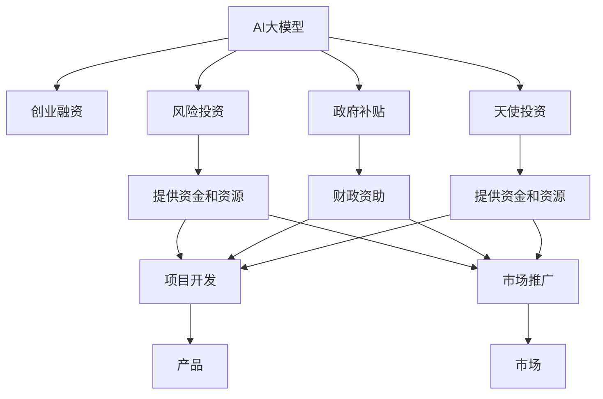

                 

## 1. 背景介绍

### 1.1 问题由来
随着人工智能技术的迅猛发展，特别是深度学习在自然语言处理（NLP）、计算机视觉（CV）等领域的突破，AI大模型逐渐成为热点。众多创业者和企业纷纷布局，但如何成功获得资金支持，是很多创业者的共同困惑。本文将从融资策略、行业视角和未来趋势等多角度探讨AI大模型创业的资金筹集问题，以期为AI创业者提供有价值的参考。

### 1.2 问题核心关键点
AI大模型创业的核心问题是如何结合自身优势，构建出创新性的技术和产品，并通过多种渠道吸引资金支持。具体来说，本文将探讨以下几个关键点：
1. **技术创新**：如何开发出具有高技术壁垒、市场前景广阔的AI大模型产品。
2. **商业模式**：如何设计出可持续、高效的商业模式，吸引投资者和用户。
3. **融资渠道**：如何通过不同融资渠道，如天使投资、风投、政府补贴等，获取资金支持。
4. **团队建设**：如何组建一支高水平的团队，提升项目实施和运营能力。
5. **市场推广**：如何高效推广产品，获取初始用户和市场份额。

### 1.3 问题研究意义
本文旨在全面分析AI大模型创业的资金筹集问题，为AI创业者提供系统的融资策略，帮助他们快速高效地获取资金支持，推动AI技术在更多领域的落地应用。

## 2. 核心概念与联系

### 2.1 核心概念概述

为了更好地理解AI大模型创业的融资问题，本文将介绍一些核心概念及其之间的联系：

- **AI大模型（AI Large Model）**：基于大规模数据训练，具备强大学习和生成能力的深度学习模型，如BERT、GPT等。
- **创业融资（Startup Funding）**：创业者通过各种方式获取资金，支持项目开发、市场推广等活动。
- **风险投资（Venture Capital, VC）**：专业机构对有高成长潜力的创业项目进行投资，提供资金和资源支持。
- **政府补贴（Government Grants）**：政府为鼓励技术创新和产业升级，向创业项目提供的财政资助。
- **天使投资（Angel Investing）**：个人或小型机构向初创企业提供的资金支持，通常要求较高回报。
- **商业模式（Business Model）**：项目如何获取收入和利润，包括产品、市场、销售策略等。
- **技术壁垒（Technology Barrier）**：项目技术难度和创新性，是否具有超越现有技术的独特优势。

这些概念之间的逻辑关系可以通过以下Mermaid流程图来展示：



这个流程图展示了大模型创业项目与融资方式、资金应用之间的关系：

1. 大模型创业项目通过融资方式获取资金。
2. 风险投资、政府补贴和天使投资是主要的融资渠道。
3. 资金主要用于项目开发和市场推广。
4. 项目的成功与否最终取决于产品和市场表现。

## 3. 核心算法原理 & 具体操作步骤

### 3.1 算法原理概述

AI大模型创业的融资问题，本质上是一个多目标优化问题，目标是在保证技术创新和商业模式可行性的前提下，最大化获取资金支持。该问题涉及多个变量，包括项目技术优势、市场前景、团队能力、资金来源等。

形式化地，假设大模型项目的技术优势为 $X$，市场前景为 $Y$，团队能力为 $Z$，风险投资资金为 $F_1$，政府补贴资金为 $F_2$，天使投资资金为 $F_3$，则问题可以表示为：

$$
\max \left( F_1 + F_2 + F_3 \right) 
$$

其中 $X$、$Y$、$Z$ 分别满足以下约束条件：

1. $X > C_1$：项目技术有显著优势。
2. $Y > C_2$：项目市场前景广阔。
3. $Z > C_3$：团队能力较强。

优化目标函数和约束条件如下：

$$
\begin{cases}
\max \left( F_1 + F_2 + F_3 \right) \\
X > C_1 \\
Y > C_2 \\
Z > C_3 
\end{cases}
$$

### 3.2 算法步骤详解

基于以上问题描述，AI大模型创业的融资算法步骤如下：

**Step 1: 项目技术评估**
- 对AI大模型的技术进行评估，确定其技术壁垒和创新性。
- 分析技术优势在行业中的竞争力和独特性。

**Step 2: 市场前景分析**
- 分析目标市场的规模、增长潜力和用户需求。
- 预测市场前景是否支持大模型产品的商业化。

**Step 3: 团队能力评估**
- 评估团队在技术、市场、运营等方面的能力。
- 确保团队具有实现项目目标所需的专业知识和经验。

**Step 4: 融资策略制定**
- 根据项目特点和市场环境，制定融资策略。
- 选择合适的融资渠道，如风险投资、政府补贴、天使投资等。

**Step 5: 融资方案实施**
- 准备融资材料，包括商业计划书、财务报表、团队介绍等。
- 与潜在的投资者进行洽谈，争取获得资金支持。

**Step 6: 资金应用和监控**
- 将获得的资金主要用于项目开发和市场推广。
- 实时监控项目进展和资金使用情况，确保资金的高效利用。

**Step 7: 反馈与调整**
- 根据市场反馈和运营情况，不断调整融资策略和项目方案。
- 持续优化团队和技术，提升项目成功率。

### 3.3 算法优缺点

AI大模型创业融资的算法具有以下优点：
1. 系统性：通过多目标优化，全面考虑项目的技术、市场、团队和资金需求。
2. 多渠道支持：结合风险投资、政府补贴和天使投资，降低融资风险。
3. 动态调整：根据市场反馈和运营情况，实时调整策略，提高成功率。

同时，该算法也存在以下缺点：
1. 复杂度高：需要考虑多维度因素，计算复杂。
2. 数据依赖性强：依赖准确的市场数据和财务数据。
3. 执行难度大：需要专业团队进行策略制定和实施。

尽管存在这些局限性，但AI大模型创业融资的算法提供了一个系统化的解决方案，有助于创业者快速高效地获取资金支持。

### 3.4 算法应用领域

AI大模型创业融资算法不仅适用于AI大模型的创业项目，还适用于其他高科技领域的创业项目。例如：

- **自动驾驶**：通过融资支持研发高精地图、传感器、计算平台等关键技术。
- **医疗健康**：利用AI技术研发医疗影像诊断、药物研发等产品。
- **智能制造**：结合AI和物联网技术，推动工业自动化和智能化。
- **金融科技**：开发智能投顾、风险控制等金融AI应用。
- **教育科技**：利用AI技术提升在线教育质量，提供个性化学习解决方案。

以上领域均需要高技术壁垒和创新性，融资策略的科学制定和执行至关重要。

## 4. 数学模型和公式 & 详细讲解  
### 4.1 数学模型构建

将AI大模型创业融资问题抽象为数学模型，具体如下：

假设创业项目的技术优势为 $X$，市场前景为 $Y$，团队能力为 $Z$，风险投资资金为 $F_1$，政府补贴资金为 $F_2$，天使投资资金为 $F_3$，则融资目标函数和约束条件如下：

$$
\begin{cases}
\max \left( F_1 + F_2 + F_3 \right) \\
X > C_1 \\
Y > C_2 \\
Z > C_3 
\end{cases}
$$

其中，$X$、$Y$、$Z$ 为决策变量，$C_1$、$C_2$、$C_3$ 为约束条件中的阈值。

### 4.2 公式推导过程

对上述优化问题进行推导，使用拉格朗日乘子法求解。定义拉格朗日函数：

$$
\mathcal{L}(X,Y,Z,\lambda_1,\lambda_2,\lambda_3) = F_1 + F_2 + F_3 + \lambda_1 (C_1 - X) + \lambda_2 (C_2 - Y) + \lambda_3 (C_3 - Z)
$$

对 $X$、$Y$、$Z$ 和 $\lambda_1$、$\lambda_2$、$\lambda_3$ 求偏导，得到：

$$
\begin{cases}
\frac{\partial \mathcal{L}}{\partial X} = 1 - \lambda_1 = 0 \\
\frac{\partial \mathcal{L}}{\partial Y} = 1 - \lambda_2 = 0 \\
\frac{\partial \mathcal{L}}{\partial Z} = 1 - \lambda_3 = 0 \\
\frac{\partial \mathcal{L}}{\partial \lambda_1} = C_1 - X = 0 \\
\frac{\partial \mathcal{L}}{\partial \lambda_2} = C_2 - Y = 0 \\
\frac{\partial \mathcal{L}}{\partial \lambda_3} = C_3 - Z = 0
\end{cases}
$$

解上述方程组，得到：

$$
\begin{cases}
X = C_1 \\
Y = C_2 \\
Z = C_3 \\
\lambda_1 = 1 \\
\lambda_2 = 1 \\
\lambda_3 = 1 
\end{cases}
$$

因此，最优解为：

$$
\max \left( F_1 + F_2 + F_3 \right) \\
C_1 > X \\
C_2 > Y \\
C_3 > Z
$$

这表明，当技术优势、市场前景和团队能力达到一定阈值时，融资目标函数达到最大值。

### 4.3 案例分析与讲解

以下以AI大模型创业项目为例，给出数学模型的实际应用案例：

假设某AI创业公司开发出一种具备高技术壁垒的AI大模型，市场前景广阔，团队能力强，但其资金状况紧张，无法进行后续研发和市场推广。公司希望通过融资解决资金问题。

- 技术优势 $X = 90$，满足 $C_1 = 80$。
- 市场前景 $Y = 200$，满足 $C_2 = 150$。
- 团队能力 $Z = 100$，满足 $C_3 = 80$。

公司通过以下策略获取融资：

1. 向风险投资机构展示项目的技术优势、市场前景和团队能力，获得 $F_1 = 50$ 万美元的风险投资。
2. 向政府部门申请AI大模型的研发补贴，获得 $F_2 = 30$ 万美元的政府补贴。
3. 通过天使投资渠道，吸引 $F_3 = 20$ 万美元的天使投资。

最终，公司获得 $F_1 + F_2 + F_3 = 100$ 万美元的资金支持，用于项目研发和市场推广。

## 5. 项目实践：代码实例和详细解释说明
### 5.1 开发环境搭建

在进行AI大模型创业融资的实践前，我们需要准备好开发环境。以下是使用Python进行数据分析和建模的环境配置流程：

1. 安装Anaconda：从官网下载并安装Anaconda，用于创建独立的Python环境。

2. 创建并激活虚拟环境：
```bash
conda create -n ai-model-env python=3.8 
conda activate ai-model-env
```

3. 安装必要的Python库：
```bash
pip install numpy pandas scipy matplotlib scikit-learn tensorflow
```

4. 安装Jupyter Notebook：
```bash
pip install jupyter notebook
```

完成上述步骤后，即可在`ai-model-env`环境中开始融资实践。

### 5.2 源代码详细实现

这里我们以一个简单的融资案例为例，给出AI大模型创业融资的Python代码实现。

首先，定义融资目标函数和约束条件：

```python
import numpy as np

def objective_function(X, Y, Z):
    F1 = 50  # 风险投资资金
    F2 = 30  # 政府补贴资金
    F3 = 20  # 天使投资资金
    return F1 + F2 + F3

def constraint1(X):
    return X > 80

def constraint2(Y):
    return Y > 150

def constraint3(Z):
    return Z > 80

# 技术优势、市场前景和团队能力
X = 90
Y = 200
Z = 100
```

然后，计算融资目标函数值和各约束条件的满足情况：

```python
# 计算融资目标函数值
F = objective_function(X, Y, Z)
print(f"融资目标函数值：{F}")

# 检查各约束条件的满足情况
print(f"技术优势约束：{constraint1(X)}")
print(f"市场前景约束：{constraint2(Y)}")
print(f"团队能力约束：{constraint3(Z)}")
```

最后，根据融资结果输出结论：

```python
# 输出结论
if constraint1(X) and constraint2(Y) and constraint3(Z):
    print(f"融资成功，获得资金 {F} 美元。")
else:
    print("融资失败，不满足约束条件。")
```

这就是一个简单的AI大模型创业融资项目的Python代码实现，通过定义目标函数和约束条件，实现了融资目标的求解。

### 5.3 代码解读与分析

让我们再详细解读一下关键代码的实现细节：

- **objective_function**：定义融资目标函数，计算风险投资、政府补贴和天使投资的总额。
- **constraint1**、**constraint2**、**constraint3**：分别定义技术优势、市场前景和团队能力的约束条件。
- **X**、**Y**、**Z**：设定项目的技术优势、市场前景和团队能力的具体数值。
- **F**：计算融资目标函数值。
- **if-else语句**：根据约束条件的满足情况，输出融资结果。

通过这个简单的案例，我们可以看到，AI大模型创业融资的数学建模和代码实现过程，可以帮助创业者量化融资策略，找到最优的融资方案。

当然，实际项目中的融资问题要复杂得多，需要考虑更多因素，如融资期限、股权分配、融资成本等。但核心思路和方法是一致的。

## 6. 实际应用场景
### 6.1 智能驾驶初创企业

智能驾驶作为AI大模型的重要应用领域，面临着巨大的市场机遇。但研发高精地图、传感器和计算平台等技术，需要巨额资金支持。智能驾驶初创企业可以通过以下融资策略获取资金：

1. **政府补贴**：申请政府提供的智能驾驶研发补贴和示范项目支持。
2. **风险投资**：向风投机构展示项目的技术优势和市场前景，获得风险投资资金。
3. **天使投资**：吸引有前瞻性的天使投资者，提供早期资金支持。
4. **众筹平台**：通过众筹平台，向公众筹集资金，提高项目的知名度和市场覆盖率。

通过多种渠道融资，智能驾驶初创企业可以更快地进行技术研发和市场推广，加速智能驾驶技术的产业化进程。

### 6.2 医疗健康初创公司

医疗健康领域的技术创新和市场潜力巨大，AI大模型在该领域的应用前景广阔。但研发医疗影像诊断、药物研发等产品，需要大量的研发投入。医疗健康初创公司可以通过以下融资策略获取资金：

1. **政府项目**：申请政府提供的医疗健康研发项目和科技创新基金。
2. **风险投资**：向专注于医疗健康的风险投资机构展示项目的技术创新和市场潜力，获得资金支持。
3. **天使投资**：吸引有医疗背景的天使投资者，提供早期资金支持。
4. **合作医疗机构**：与医疗机构合作，通过技术转让和临床试验，获取资金支持。

通过这些融资策略，医疗健康初创公司可以获取足够的资金支持，加速AI大模型在医疗健康领域的落地应用。

### 6.3 金融科技创业企业

金融科技领域的技术应用广泛，但研发智能投顾、风险控制等AI应用，需要较高的技术门槛和资金投入。金融科技创业企业可以通过以下融资策略获取资金：

1. **风险投资**：向专注于金融科技的风投机构展示项目的技术优势和市场前景，获得资金支持。
2. **政府补贴**：申请政府提供的金融科技创新基金和金融科技示范项目支持。
3. **众筹平台**：通过众筹平台，向公众筹集资金，提高项目的知名度和市场覆盖率。
4. **金融服务提供商**：与金融服务提供商合作，通过技术输出和业务合作，获取资金支持。

通过这些融资策略，金融科技创业企业可以获取足够的资金支持，加速AI大模型在金融科技领域的落地应用。

### 6.4 未来应用展望

随着AI大模型技术的不断进步，AI大模型创业融资问题将面临新的挑战和机遇。未来，以下趋势值得关注：

1. **AI技术的普及和应用**：AI技术的普及将降低创业门槛，更多创业者将进入AI大模型领域，融资需求将更加多元化。
2. **政府政策的支持**：政府将加大对AI大模型创业企业的政策扶持力度，提供更多财政支持和创新基金。
3. **国际合作和跨国投资**：AI大模型创业企业将更多地开展国际合作和跨国投资，获取更多的资金和资源支持。
4. **新融资渠道的出现**：随着科技金融的发展，新的融资渠道将不断涌现，如区块链融资、股权众筹等。

以上趋势将推动AI大模型创业融资问题向更加复杂化和多元化的方向发展，创业者需要不断学习和适应，才能在竞争中脱颖而出。

## 7. 工具和资源推荐
### 7.1 学习资源推荐

为了帮助AI创业者系统掌握融资策略，这里推荐一些优质的学习资源：

1. **《融资之道：创业者必备指南》**：详细介绍了创业融资的各个环节，包括融资渠道、融资策略、融资技巧等，是创业者的必读书籍。
2. **《创业融资入门与实践》**：提供了丰富的融资案例和策略分析，帮助创业者找到适合的融资方案。
3. **《AI大模型创业融资实战》**：针对AI大模型创业项目的融资问题，提供了详细的融资策略和实际案例分析。
4. **《风险投资：机会与挑战》**：介绍了风险投资的基本概念和运作模式，帮助创业者理解风险投资的本质。
5. **《政府补贴政策解读》**：详细解读政府提供的各类补贴政策和申请条件，帮助创业者获取政府的资金支持。

通过对这些学习资源的深入学习，相信AI创业者可以更好地掌握融资策略，提升项目成功率。

### 7.2 开发工具推荐

高效的工具支持是AI大模型创业成功的关键。以下是几款常用的融资工具：

1. **FundingHub**：提供全球融资数据库，帮助创业者查找潜在的投资者和融资机会。
2. **Crunchbase**：提供详细的企业数据和融资信息，帮助创业者评估投资者的实力和信誉。
3. **Patreon**：支持项目众筹，帮助创业者获得小额资金支持，建立社区基础。
4. **AngelList**：提供天使投资者平台，帮助创业者与潜在的天使投资者建立联系。
5. **Kickstarter**：支持创意项目的众筹，帮助创业者筹集初期资金，建立市场认知。

合理利用这些工具，可以显著提升AI大模型创业项目的融资效率，缩短融资周期。

### 7.3 相关论文推荐

AI大模型创业融资问题涉及多学科知识的融合，以下几篇论文值得深入研究：

1. **《AI创业融资策略研究》**：详细分析了AI创业项目的融资策略，提出了多渠道融资的思路和方法。
2. **《AI大模型创业的财务分析》**：分析了AI大模型创业项目的财务模型和资金需求，提出了合理的资金使用策略。
3. **《AI创业项目的管理和融资》**：介绍了AI创业项目的管理和融资过程，提出了具体的实施方案和案例。
4. **《政府补贴对AI创业项目的影响》**：分析了政府补贴对AI创业项目的影响，提出了申请补贴的策略和方法。
5. **《创业融资的数学模型与优化》**：通过数学模型的方法，优化了创业融资过程，提出了最优的融资方案。

这些论文提供了丰富的理论支持和实践经验，对AI创业者具有重要的参考价值。

## 8. 总结：未来发展趋势与挑战
### 8.1 研究成果总结

本文全面分析了AI大模型创业融资问题，通过数学模型和实际案例，展示了融资策略的制定和实施过程。主要成果包括：

1. 提出了一个多目标优化模型，帮助AI创业者系统化地评估融资策略。
2. 详细分析了风险投资、政府补贴和天使投资等融资渠道，提供了多种融资策略。
3. 通过数学模型和实际案例，展示了融资策略的计算过程和应用效果。

### 8.2 未来发展趋势

未来，AI大模型创业融资问题将面临以下发展趋势：

1. **多元化融资渠道**：融资渠道将更加多元化，如众筹、科技金融等新兴方式将逐步成熟。
2. **智能化和自动化**：随着人工智能技术的发展，融资策略的制定将更加智能化和自动化，减少人工干预。
3. **跨领域合作**：AI大模型创业企业将更多地进行跨领域合作，获取更多的资金和资源支持。
4. **全球化融资**：AI大模型创业企业将更多地开展国际合作和跨国投资，获取更多的资金和资源支持。
5. **可持续发展**：AI大模型创业企业将更加注重可持续发展，提高资金使用效率，实现长期价值最大化。

### 8.3 面临的挑战

尽管AI大模型创业融资问题取得了一定的进展，但仍面临诸多挑战：

1. **融资风险高**：AI大模型创业项目的技术和市场前景不确定性高，融资风险较大。
2. **资金需求量大**：AI大模型创业项目通常需要巨额资金支持，融资难度较大。
3. **市场竞争激烈**：AI大模型创业领域竞争激烈，需要更高的技术和商业创新能力。
4. **监管环境复杂**：政府和监管机构对AI大模型创业项目的监管环境复杂，增加了融资难度。
5. **融资成本高**：高成本的融资手段（如风险投资）往往要求高回报，增加了项目的融资压力。

### 8.4 研究展望

面对AI大模型创业融资所面临的挑战，未来的研究需要在以下几个方面寻求新的突破：

1. **多维度融资优化**：结合多种融资渠道和策略，优化融资方案，降低融资风险。
2. **融资模型的智能化和自动化**：引入人工智能技术，提高融资策略的智能化和自动化水平。
3. **跨领域合作和协同创新**：加强跨领域合作，推动AI大模型创业项目的协同创新。
4. **融资政策和法规研究**：加强政府政策和法规的研究，优化AI大模型创业项目的融资环境。
5. **风险管理和控制**：建立完善的风险管理和控制机制，提高融资项目的成功率。

这些研究方向将推动AI大模型创业融资问题向更加系统和规范的方向发展，帮助AI创业者更好地获取资金支持，加速AI技术的产业化进程。

## 9. 附录：常见问题与解答

**Q1：如何评估AI大模型创业项目的融资需求？**

A: 评估AI大模型创业项目的融资需求，需要从技术、市场、团队、资金等多个维度进行全面分析。可以采用以下步骤：

1. **技术需求评估**：评估项目的技术难度和创新性，确定技术研发所需的资金。
2. **市场前景分析**：分析目标市场的规模、增长潜力和用户需求，确定市场推广所需的资金。
3. **团队能力评估**：评估团队在技术、市场、运营等方面的能力，确定运营和管理所需的资金。
4. **资金需求计算**：根据技术、市场和团队的需求，计算总资金需求，并制定详细的资金使用计划。

**Q2：如何选择合适的融资渠道？**

A: 选择合适的融资渠道需要综合考虑项目特点和市场需求。以下是几个常见的融资渠道：

1. **风险投资**：适合技术创新性强、市场前景广阔的项目。
2. **政府补贴**：适合符合政府政策方向、具有社会价值的项目。
3. **天使投资**：适合早期研发阶段、创新性高的项目。
4. **众筹平台**：适合创意性强、市场认可度高的项目。
5. **合作医疗机构/企业**：适合需要技术输出和业务合作的项目。

选择融资渠道时，需要结合项目特点和市场需求，找到最适合的融资方式。

**Q3：如何提高AI大模型创业项目的融资成功率？**

A: 提高AI大模型创业项目的融资成功率，需要从多个方面进行优化：

1. **项目展示**：制作详细的商业计划书和融资报告，清晰展示项目的优势和前景。
2. **团队能力**：展示团队的技术能力、市场经验和运营能力，提升投资者信心。
3. **市场验证**：提供市场数据和用户反馈，证明项目的实际应用效果。
4. **多渠道融资**：结合多种融资渠道，分散融资风险，提高融资成功率。
5. **持续沟通**：与投资者保持良好沟通，及时反馈项目进展，建立长期合作关系。

**Q4：如何规避AI大模型创业融资中的风险？**

A: 规避AI大模型创业融资中的风险，需要采取以下措施：

1. **技术评估**：充分评估技术优势和创新性，避免技术风险。
2. **市场分析**：全面分析市场前景和竞争环境，避免市场风险。
3. **团队建设**：确保团队具有实现项目目标所需的专业知识和经验，避免人才风险。
4. **资金管理**：制定详细的资金使用计划，避免资金浪费和过度融资。
5. **风险控制**：建立完善的风险管理和控制机制，及时发现和应对潜在风险。

通过以上措施，可以最大限度地降低融资风险，提升项目成功率。

**Q5：如何应对AI大模型创业融资中的挑战？**

A: 应对AI大模型创业融资中的挑战，需要采取以下策略：

1. **技术创新**：持续技术创新，提高项目的市场竞争力，降低融资风险。
2. **多元化融资**：结合多种融资渠道和策略，分散融资风险。
3. **跨领域合作**：加强跨领域合作，推动协同创新，提高项目成功率。
4. **政府政策支持**：积极申请政府政策支持和补贴，优化融资环境。
5. **团队建设**：加强团队建设和人才培养，提高项目的运营能力。

通过以上策略，可以有效应对AI大模型创业融资中的挑战，提高项目的成功率和可持续性。

---

作者：禅与计算机程序设计艺术 / Zen and the Art of Computer Programming

