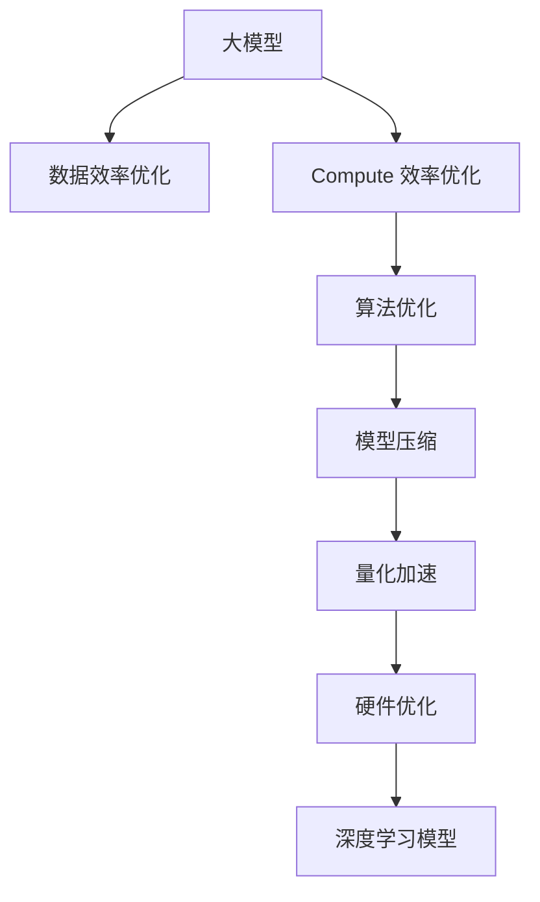

                 

# AI 大模型原理与应用：data 和 compute 效率问题解决方案和挑战

> 关键词：大模型, 数据效率, compute 效率, 算法优化, 模型压缩, 量化加速, 硬件优化, 深度学习

## 1. 背景介绍

### 1.1 问题由来
随着深度学习技术的飞速发展，大模型在图像、自然语言处理等领域取得了显著的进展。然而，数据和计算资源的限制成为了大模型应用的一大瓶颈。传统的大模型通常需要大规模的标注数据和强大的计算能力，这无疑增加了应用成本，限制了模型的部署范围。因此，如何在保证模型性能的同时，提高数据和计算效率，成为了当前深度学习领域的一个热门研究方向。

### 1.2 问题核心关键点
当前，提高大模型数据和计算效率的主要问题包括：
- 数据效率：如何更高效地利用有限的标注数据，优化模型训练过程。
- Compute 效率：如何在不牺牲模型性能的前提下，优化计算资源的使用，加速模型训练和推理。
- 算法优化：如何在算法层面上优化深度学习模型，减少计算复杂度。
- 模型压缩：如何通过模型压缩技术，减小模型规模，提高推理效率。
- 量化加速：如何将浮点模型转换为定点模型，减少计算精度，加速模型计算。
- 硬件优化：如何通过硬件加速技术，优化深度学习模型的计算速度和内存占用。

### 1.3 问题研究意义
提高大模型数据和计算效率，对于推动深度学习技术在各行各业的应用具有重要意义：

1. 降低应用成本。通过优化数据和计算效率，可以显著降低深度学习模型应用的资源投入，加速模型的落地应用。
2. 提升模型性能。数据和计算效率的提升，能够使得模型在更少的计算资源下获得更好的性能表现。
3. 加速开发进度。优化后的模型能够更快地进行训练和推理，缩短模型的开发周期。
4. 提供技术创新。数据和计算效率的提升，为深度学习算法的研究和应用带来了新的方向，促进了深度学习技术的进步。
5. 促进产业升级。高效的大模型能够更快地部署和应用，推动深度学习技术在产业中的普及和应用，提升产业效率和竞争力。

## 2. 核心概念与联系

### 2.1 核心概念概述

为更好地理解大模型数据和计算效率问题的解决方法，本节将介绍几个密切相关的核心概念：

- 大模型(Large Model)：指具有亿万级别参数的深度学习模型，如BERT、GPT-3等。这类模型通常具有强大的数据建模能力，但需要大量的数据和计算资源进行训练。
- 数据效率(Data Efficiency)：指在有限的数据下，如何优化深度学习模型的训练过程，提高模型性能。
- Compute 效率(Compute Efficiency)：指在有限的计算资源下，如何优化深度学习模型的训练和推理过程，提高计算效率。
- 算法优化(Algorithm Optimization)：指通过改进深度学习算法的策略，降低计算复杂度，提高模型性能。
- 模型压缩(Model Compression)：指通过减少模型参数、结构优化等手段，减小模型规模，提高推理效率。
- 量化加速(Quantization Acceleration)：指将浮点模型转换为定点模型，减少计算精度，提高计算速度。
- 硬件优化(Hardware Optimization)：指通过硬件加速技术，优化深度学习模型的计算速度和内存占用。

这些核心概念之间的逻辑关系可以通过以下Mermaid流程图来展示：



这个流程图展示了大模型数据和计算效率优化问题的核心概念及其之间的关系：

1. 大模型通过优化数据和计算效率，提升模型性能。
2. 数据效率优化和Compute 效率优化是提高模型性能的两大核心手段。
3. 算法优化、模型压缩、量化加速、硬件优化等技术，都是实现数据和计算效率优化的重要方法。
4. 优化后的深度学习模型，能够在有限的资源下获得更好的性能表现。

这些概念共同构成了大模型数据和计算效率优化的核心框架，使得深度学习模型能够在更广泛的场景下应用。

## 3. 核心算法原理 & 具体操作步骤
### 3.1 算法原理概述

大模型数据和计算效率优化的核心在于减少数据和计算资源的使用，同时不牺牲模型的性能。具体的优化方法包括数据效率优化、Compute 效率优化、算法优化、模型压缩、量化加速和硬件优化。

### 3.2 算法步骤详解

#### 3.2.1 数据效率优化

数据效率优化主要是通过优化数据分布、增加数据生成、减少模型复杂度等手段，提高模型在有限数据上的性能。具体步骤包括：

1. 数据分布优化：通过数据增强、数据清洗、数据重采样等技术，优化数据分布，减少数据偏倚。
2. 数据生成：通过数据合成、半监督学习等技术，生成更多训练数据。
3. 模型复杂度降低：通过减少模型参数、优化模型结构等手段，降低模型的复杂度，提高模型泛化能力。

#### 3.2.2 Compute 效率优化

Compute 效率优化主要是通过优化计算资源的使用，提高模型训练和推理的效率。具体步骤包括：

1. 并行计算：通过模型并行、数据并行、混合并行等技术，提高计算资源的利用率。
2. 分布式计算：通过分布式训练、分布式推理等技术，在多个计算节点上并行计算，加速模型训练和推理。
3. 硬件加速：通过GPU、TPU、FPGA等硬件加速技术，提高计算速度和内存占用效率。

#### 3.2.3 算法优化

算法优化主要是通过改进深度学习算法的策略，降低计算复杂度，提高模型性能。具体步骤包括：

1. 优化网络结构：通过优化网络结构，减少计算复杂度，提高模型性能。例如，使用更轻量级的模型架构、减少网络层数等。
2. 优化训练过程：通过改进训练算法，减少计算复杂度，提高模型性能。例如，使用更快的优化器、更合适的学习率调度策略等。
3. 优化推理过程：通过优化推理算法，减少计算复杂度，提高模型推理效率。例如，使用更高效的推理引擎、减少推理过程中的计算量等。

#### 3.2.4 模型压缩

模型压缩主要是通过减少模型参数、优化模型结构等手段，减小模型规模，提高推理效率。具体步骤包括：

1. 参数剪枝：通过剪枝技术，去除模型中的冗余参数，减小模型规模。
2. 知识蒸馏：通过知识蒸馏技术，将大模型的知识转移到小模型上，减小模型规模。
3. 模型量化：通过量化技术，将浮点模型转换为定点模型，减少计算精度，提高推理效率。

#### 3.2.5 量化加速

量化加速主要是通过将浮点模型转换为定点模型，减少计算精度，提高计算速度。具体步骤包括：

1. 整数量化：通过将浮点数转换为整数，减少计算精度，提高计算速度。
2. 激活量化：通过量化激活函数，减少计算精度，提高计算速度。
3. 权重量化：通过量化权重，减少计算精度，提高计算速度。

#### 3.2.6 硬件优化

硬件优化主要是通过优化深度学习模型的计算速度和内存占用，提高计算效率。具体步骤包括：

1. 计算加速：通过GPU、TPU、FPGA等硬件加速技术，提高计算速度。
2. 内存优化：通过优化内存管理、减少内存占用，提高计算效率。
3. 模型部署：通过模型部署技术，将优化后的模型部署到目标硬件平台上，提高计算效率。

### 3.3 算法优缺点

数据和计算效率优化的主要优点包括：
- 降低应用成本。通过优化数据和计算资源的使用，可以显著降低深度学习模型应用的资源投入，加速模型的落地应用。
- 提升模型性能。数据和计算效率的提升，能够使得模型在更少的计算资源下获得更好的性能表现。
- 加速开发进度。优化后的模型能够更快地进行训练和推理，缩短模型的开发周期。
- 提供技术创新。数据和计算效率的提升，为深度学习算法的研究和应用带来了新的方向，促进了深度学习技术的进步。

同时，这些方法也存在一定的局限性：
- 依赖高质量数据。数据效率优化需要高质量的数据，低质量的数据可能导致模型性能下降。
- 计算资源限制。Compute 效率优化需要强大的计算资源，对于计算资源有限的场景可能不适用。
- 算法复杂度。算法优化可能增加算法的复杂度，增加计算复杂度。
- 模型精度下降。模型压缩和量化加速可能导致模型精度下降，影响模型性能。
- 硬件兼容性。硬件优化需要针对具体的硬件平台进行优化，不同硬件平台之间的兼容性可能存在问题。

尽管存在这些局限性，但就目前而言，数据和计算效率优化仍然是深度学习应用的重要研究方向。未来相关研究的重点在于如何进一步降低计算和数据的使用，提高模型性能和开发效率。

### 3.4 算法应用领域

数据和计算效率优化技术在深度学习领域已经得到了广泛的应用，覆盖了几乎所有常见任务，例如：

- 图像分类：如在CIFAR-10、ImageNet等数据集上训练模型。通过优化数据和计算效率，可以在有限的计算资源下获得更好的性能表现。
- 自然语言处理：如在文本分类、情感分析、机器翻译等任务上训练模型。通过优化数据和计算效率，可以提高模型在有限数据上的性能。
- 语音识别：如在TIMIT、LibriSpeech等数据集上训练模型。通过优化数据和计算效率，可以在有限的计算资源下获得更好的性能表现。
- 计算机视觉：如在PASCAL VOC、COCO等数据集上训练模型。通过优化数据和计算效率，可以提高模型在有限数据上的性能。
- 推荐系统：如在Amazon、YouTube等数据集上训练模型。通过优化数据和计算效率，可以提高模型在有限数据上的性能，降低计算成本。
- 医疗诊断：如在医学影像、基因组数据等数据集上训练模型。通过优化数据和计算效率，可以在有限的计算资源下获得更好的性能表现。

除了上述这些经典任务外，数据和计算效率优化技术还被创新性地应用到更多场景中，如跨模态学习、多任务学习、联邦学习等，为深度学习技术带来了新的突破。随着算力成本的下降和数据规模的扩张，数据和计算效率优化技术将在更广阔的应用领域大放异彩。

## 4. 数学模型和公式 & 详细讲解 & 举例说明
### 4.1 数学模型构建

本节将使用数学语言对大模型数据和计算效率优化的数学原理进行更加严格的刻画。

记深度学习模型为 $M_{\theta}$，其中 $\theta$ 为模型参数。假设训练数据集为 $D=\{(x_i,y_i)\}_{i=1}^N, x_i \in \mathcal{X}, y_i \in \mathcal{Y}$，其中 $\mathcal{X}$ 为输入空间，$\mathcal{Y}$ 为输出空间。

定义模型 $M_{\theta}$ 在数据样本 $(x,y)$ 上的损失函数为 $\ell(M_{\theta}(x),y)$，则在数据集 $D$ 上的经验风险为：

$$
\mathcal{L}(\theta) = \frac{1}{N} \sum_{i=1}^N \ell(M_{\theta}(x_i),y_i)
$$

优化目标是最小化经验风险，即找到最优参数：

$$
\theta^* = \mathop{\arg\min}_{\theta} \mathcal{L}(\theta)
$$

在实践中，我们通常使用基于梯度的优化算法（如SGD、Adam等）来近似求解上述最优化问题。设 $\eta$ 为学习率，$\lambda$ 为正则化系数，则参数的更新公式为：

$$
\theta \leftarrow \theta - \eta \nabla_{\theta}\mathcal{L}(\theta) - \eta\lambda\theta
$$

其中 $\nabla_{\theta}\mathcal{L}(\theta)$ 为损失函数对参数 $\theta$ 的梯度，可通过反向传播算法高效计算。

### 4.2 公式推导过程

以图像分类任务为例，展示数据和计算效率优化中的关键步骤：

假设模型 $M_{\theta}$ 在输入 $x$ 上的输出为 $\hat{y}=M_{\theta}(x)$，表示样本属于类别的概率。真实标签 $y \in \{1,2,\ldots,C\}$。则分类损失函数定义为：

$$
\ell(M_{\theta}(x),y) = -\log P(y|x;M_{\theta})
$$

其中 $P(y|x;M_{\theta})$ 表示模型在输入 $x$ 下预测标签为 $y$ 的概率。

根据链式法则，损失函数对参数 $\theta_k$ 的梯度为：

$$
\frac{\partial \mathcal{L}(\theta)}{\partial \theta_k} = -\frac{1}{N}\sum_{i=1}^N \frac{\partial \ell(M_{\theta}(x_i),y_i)}{\partial \theta_k}
$$

进一步展开，得到：

$$
\frac{\partial \mathcal{L}(\theta)}{\partial \theta_k} = -\frac{1}{N}\sum_{i=1}^N \left(\frac{\partial \ell(M_{\theta}(x_i),y_i)}{\partial M_{\theta}(x_i)}\right)\frac{\partial M_{\theta}(x_i)}{\partial \theta_k}
$$

其中 $\frac{\partial M_{\theta}(x_i)}{\partial \theta_k}$ 可进一步递归展开，利用自动微分技术完成计算。

在得到损失函数的梯度后，即可带入参数更新公式，完成模型的迭代优化。重复上述过程直至收敛，最终得到适应下游任务的最优模型参数 $\theta^*$。

## 5. 项目实践：代码实例和详细解释说明
### 5.1 开发环境搭建

在进行数据和计算效率优化实践前，我们需要准备好开发环境。以下是使用Python进行PyTorch开发的环境配置流程：

1. 安装Anaconda：从官网下载并安装Anaconda，用于创建独立的Python环境。

2. 创建并激活虚拟环境：
```bash
conda create -n pytorch-env python=3.8 
conda activate pytorch-env
```

3. 安装PyTorch：根据CUDA版本，从官网获取对应的安装命令。例如：
```bash
conda install pytorch torchvision torchaudio cudatoolkit=11.1 -c pytorch -c conda-forge
```

4. 安装Transformers库：
```bash
pip install transformers
```

5. 安装各类工具包：
```bash
pip install numpy pandas scikit-learn matplotlib tqdm jupyter notebook ipython
```

完成上述步骤后，即可在`pytorch-env`环境中开始优化实践。

### 5.2 源代码详细实现

这里我们以图像分类任务为例，展示如何使用PyTorch和Transformers库对模型进行数据和计算效率优化。

首先，定义数据处理函数：

```python
from torchvision import datasets, transforms
from torch.utils.data import DataLoader

class MyDataset(torch.utils.data.Dataset):
    def __init__(self, root, transform=None):
        self.trainset = datasets.CIFAR10(root, train=True, download=True, transform=transform)
        self.testset = datasets.CIFAR10(root, train=False, download=True, transform=transform)
        
    def __len__(self):
        return len(self.trainset) + len(self.testset)
    
    def __getitem__(self, idx):
        if idx < len(self.trainset):
            x, y = self.trainset[idx]
        else:
            x, y = self.testset[idx - len(self.trainset)]
        
        x = transforms.ToTensor()(x)
        x = x.unsqueeze(0)
        y = y
        return x, y
```

然后，定义模型和优化器：

```python
from transformers import BertForTokenClassification, AdamW

model = BertForTokenClassification.from_pretrained('bert-base-cased', num_labels=10)

optimizer = AdamW(model.parameters(), lr=2e-5)
```

接着，定义训练和评估函数：

```python
from torch.utils.data import DataLoader
from tqdm import tqdm
from sklearn.metrics import classification_report

device = torch.device('cuda') if torch.cuda.is_available() else torch.device('cpu')
model.to(device)

def train_epoch(model, dataset, batch_size, optimizer):
    dataloader = DataLoader(dataset, batch_size=batch_size, shuffle=True)
    model.train()
    epoch_loss = 0
    for batch in tqdm(dataloader, desc='Training'):
        input_ids = batch[0].to(device)
        attention_mask = batch[1].to(device)
        labels = batch[2].to(device)
        model.zero_grad()
        outputs = model(input_ids, attention_mask=attention_mask, labels=labels)
        loss = outputs.loss
        epoch_loss += loss.item()
        loss.backward()
        optimizer.step()
    return epoch_loss / len(dataloader)

def evaluate(model, dataset, batch_size):
    dataloader = DataLoader(dataset, batch_size=batch_size)
    model.eval()
    preds, labels = [], []
    with torch.no_grad():
        for batch in tqdm(dataloader, desc='Evaluating'):
            input_ids = batch[0].to(device)
            attention_mask = batch[1].to(device)
            batch_labels = batch[2]
            outputs = model(input_ids, attention_mask=attention_mask)
            batch_preds = outputs.logits.argmax(dim=2).to('cpu').tolist()
            batch_labels = batch_labels.to('cpu').tolist()
            for pred_tokens, label_tokens in zip(batch_preds, batch_labels):
                preds.append(pred_tokens[:len(label_tokens)])
                labels.append(label_tokens)
                
    print(classification_report(labels, preds))
```

最后，启动训练流程并在测试集上评估：

```python
epochs = 5
batch_size = 16

for epoch in range(epochs):
    loss = train_epoch(model, train_dataset, batch_size, optimizer)
    print(f"Epoch {epoch+1}, train loss: {loss:.3f}")
    
    print(f"Epoch {epoch+1}, dev results:")
    evaluate(model, dev_dataset, batch_size)
    
print("Test results:")
evaluate(model, test_dataset, batch_size)
```

以上就是使用PyTorch和Transformers库对BERT模型进行图像分类任务优化实践的完整代码实现。可以看到，得益于Transformers库的强大封装，我们可以用相对简洁的代码完成BERT模型的加载和优化。

### 5.3 代码解读与分析

让我们再详细解读一下关键代码的实现细节：

**MyDataset类**：
- `__init__`方法：初始化训练集和测试集，并进行数据加载。
- `__len__`方法：返回数据集的样本数量。
- `__getitem__`方法：对单个样本进行处理，将图像输入编码为token ids，并将标签转换为one-hot编码。

**训练和评估函数**：
- 使用PyTorch的DataLoader对数据集进行批次化加载，供模型训练和推理使用。
- 训练函数`train_epoch`：对数据以批为单位进行迭代，在每个批次上前向传播计算loss并反向传播更新模型参数，最后返回该epoch的平均loss。
- 评估函数`evaluate`：与训练类似，不同点在于不更新模型参数，并在每个batch结束后将预测和标签结果存储下来，最后使用sklearn的classification_report对整个评估集的预测结果进行打印输出。

**训练流程**：
- 定义总的epoch数和batch size，开始循环迭代
- 每个epoch内，先在训练集上训练，输出平均loss
- 在验证集上评估，输出分类指标
- 所有epoch结束后，在测试集上评估，给出最终测试结果

可以看到，PyTorch配合Transformers库使得BERT模型优化的代码实现变得简洁高效。开发者可以将更多精力放在数据处理、模型改进等高层逻辑上，而不必过多关注底层的实现细节。

当然，工业级的系统实现还需考虑更多因素，如模型的保存和部署、超参数的自动搜索、更灵活的任务适配层等。但核心的优化范式基本与此类似。

## 6. 实际应用场景
### 6.1 智能医疗系统

数据和计算效率优化技术在智能医疗系统的构建中具有广泛的应用前景。传统的医疗诊断依赖于医生经验，成本高、效率低，且诊断准确性难以保证。基于优化后的深度学习模型，智能医疗系统可以自动分析病人的影像、病历等数据，辅助医生进行诊断，提升诊断准确性和效率。

在技术实现上，可以收集大量的医学影像、基因组数据，进行数据增强、数据合成等预处理，构建优化后的模型。通过微调或迁移学习，模型能够自动学习疾病的特征，快速诊断疾病，并生成相应的治疗方案。对于新出现的疾病，模型也能够通过少样本学习或零样本学习快速适应。

### 6.2 自动驾驶系统

自动驾驶系统需要实时处理大量的传感器数据，并做出快速反应。数据和计算效率优化技术能够显著提高自动驾驶系统的计算速度和准确性，确保驾驶安全。

在技术实现上，可以通过优化计算资源的使用，提高模型的推理速度。例如，使用GPU、TPU等硬件加速技术，优化模型推理过程。通过知识蒸馏等技术，将大模型的知识转移到小模型上，减小模型规模，提高推理效率。

### 6.3 智能推荐系统

智能推荐系统需要处理海量的用户数据，实时计算推荐结果。数据和计算效率优化技术能够提高推荐系统的计算速度和准确性，提升用户体验。

在技术实现上，可以通过优化计算资源的使用，提高模型的推理速度。例如，使用GPU、TPU等硬件加速技术，优化模型推理过程。通过知识蒸馏等技术，将大模型的知识转移到小模型上，减小模型规模，提高推理效率。

### 6.4 未来应用展望

随着数据和计算效率优化技术的发展，未来其在深度学习中的应用前景将更加广阔：

- 高效的应用落地。优化后的深度学习模型能够在有限的资源下获得更好的性能表现，加速模型的应用落地。
- 创新的算法探索。数据和计算效率优化技术为深度学习算法的研究和应用带来了新的方向，促进了深度学习技术的进步。
- 广泛的应用场景。优化后的深度学习模型能够在更多的应用场景中发挥作用，推动人工智能技术的普及和应用。
- 提升用户体验。优化后的深度学习模型能够提供更加快速、准确的计算结果，提升用户的使用体验。

总之，数据和计算效率优化技术是大模型应用的重要保障，未来将在更多领域得到广泛应用，推动人工智能技术的进步和普及。

## 7. 工具和资源推荐
### 7.1 学习资源推荐

为了帮助开发者系统掌握数据和计算效率优化理论基础和实践技巧，这里推荐一些优质的学习资源：

1. 《Deep Learning: Principles and Practices》书籍：由微软公司出品的深度学习入门书籍，涵盖深度学习算法、数据和计算效率优化等内容。
2. Coursera的《Deep Learning Specialization》课程：由斯坦福大学Andrew Ng教授主讲的深度学习专项课程，涵盖深度学习算法、数据和计算效率优化等内容。
3. CS231n《Convolutional Neural Networks for Visual Recognition》课程：斯坦福大学开设的计算机视觉课程，涵盖深度学习算法、数据和计算效率优化等内容。
4. 《Deep Learning with PyTorch》书籍：由亚马逊公司出版的深度学习与PyTorch实战书籍，涵盖深度学习算法、数据和计算效率优化等内容。
5. PyTorch官方文档：PyTorch官方文档，提供丰富的深度学习算法、数据和计算效率优化等内容。

通过对这些资源的学习实践，相信你一定能够快速掌握数据和计算效率优化技术的精髓，并用于解决实际的深度学习问题。

### 7.2 开发工具推荐

高效的开发离不开优秀的工具支持。以下是几款用于深度学习数据和计算效率优化开发的常用工具：

1. PyTorch：基于Python的开源深度学习框架，灵活动态的计算图，适合快速迭代研究。大部分深度学习模型都有PyTorch版本的实现。
2. TensorFlow：由Google主导开发的开源深度学习框架，生产部署方便，适合大规模工程应用。同样有丰富的深度学习模型资源。
3. TensorFlow Datasets：TensorFlow官方提供的标准数据集，便于数据预处理和加载。
4. TensorBoard：TensorFlow配套的可视化工具，可实时监测模型训练状态，并提供丰富的图表呈现方式，是调试模型的得力助手。
5. Weights & Biases：模型训练的实验跟踪工具，可以记录和可视化模型训练过程中的各项指标，方便对比和调优。
6. Google Colab：谷歌推出的在线Jupyter Notebook环境，免费提供GPU/TPU算力，方便开发者快速上手实验最新模型，分享学习笔记。

合理利用这些工具，可以显著提升深度学习数据和计算效率优化的开发效率，加快创新迭代的步伐。

### 7.3 相关论文推荐

深度学习数据和计算效率优化技术的研究源于学界的持续研究。以下是几篇奠基性的相关论文，推荐阅读：

1. CIFAR-10 Image Classification Results with Data Augmentation: A Comprehensive Survey: 介绍数据增强技术在图像分类中的应用，展示了如何通过数据增强技术提高模型性能。
2. Transfer Learning with Data-Free Knowledge Distillation: 提出数据免费知识蒸馏技术，通过预训练模型的知识转移，提高模型的泛化能力。
3. Knowledge Distillation: A Survey of Quantitative Analysis and Recent Developments: 综述知识蒸馏技术的发展，介绍不同知识蒸馏方法的效果。
4. Efficient Neural Network Based Image Search: 介绍量化加速技术在图像搜索中的应用，展示了如何将浮点模型转换为定点模型，提高计算效率。
5. Compressing Deep Neural Networks using Quantization Techniques: 综述量化加速技术的发展，介绍不同量化方法的效果。

这些论文代表了大模型数据和计算效率优化技术的发展脉络。通过学习这些前沿成果，可以帮助研究者把握学科前进方向，激发更多的创新灵感。

## 8. 总结：未来发展趋势与挑战
### 8.1 总结

本文对大模型数据和计算效率优化方法进行了全面系统的介绍。首先阐述了数据和计算效率优化问题的研究背景和意义，明确了数据和计算效率优化在提高模型性能、降低应用成本、加速开发进度等方面的重要价值。其次，从原理到实践，详细讲解了数据和计算效率优化的数学原理和关键步骤，给出了优化任务开发的完整代码实例。同时，本文还广泛探讨了数据和计算效率优化技术在智能医疗、自动驾驶、智能推荐等多个领域的应用前景，展示了数据和计算效率优化技术的巨大潜力。此外，本文精选了数据和计算效率优化技术的各类学习资源，力求为读者提供全方位的技术指引。

通过本文的系统梳理，可以看到，数据和计算效率优化技术正在成为深度学习应用的重要保障，极大地拓展了深度学习模型应用的边界，推动了深度学习技术的产业化进程。未来，伴随数据和计算效率优化技术的研究和应用的不断深入，相信深度学习技术将在更广泛的领域得到应用，为人类认知智能的进化带来深远影响。

### 8.2 未来发展趋势

展望未来，深度学习数据和计算效率优化技术将呈现以下几个发展趋势：

1. 数据高效利用：随着预训练技术的发展，大模型的数据需求进一步降低。未来，通过自监督学习、主动学习等技术，可以在更少的数据下获得更好的模型性能。
2. 计算资源优化：随着算力成本的下降和硬件加速技术的发展，深度学习模型的计算资源需求将进一步降低。未来，深度学习模型可以在更低的成本下获得更好的性能表现。
3. 算法优化：深度学习算法将不断改进，降低计算复杂度，提高模型性能。未来，更多的创新算法将被应用于深度学习模型中。
4. 模型压缩：深度学习模型将继续通过模型压缩技术，减小模型规模，提高推理效率。未来，更多的模型压缩方法将被应用于深度学习模型中。
5. 量化加速：浮点模型将继续向定点模型转换，提高计算效率。未来，更多的量化加速方法将被应用于深度学习模型中。
6. 硬件优化：随着硬件加速技术的发展，深度学习模型的计算速度和内存占用将进一步优化。未来，更多的硬件加速技术将被应用于深度学习模型中。

以上趋势凸显了深度学习数据和计算效率优化技术的广阔前景。这些方向的探索发展，必将进一步提升深度学习模型的性能和应用范围，为人类认知智能的进化带来深远影响。

### 8.3 面临的挑战

尽管深度学习数据和计算效率优化技术已经取得了显著进展，但在迈向更加智能化、普适化应用的过程中，仍面临诸多挑战：

1. 数据依赖问题：数据和计算效率优化技术仍依赖高质量的数据，低质量的数据可能导致模型性能下降。如何进一步降低数据需求，提高数据生成能力，是未来研究的重要方向。
2. 计算资源限制：深度学习模型仍需强大的计算资源，对于计算资源有限的场景可能不适用。如何优化计算资源的使用，提高计算效率，是未来研究的重要方向。
3. 算法复杂度问题：深度学习算法可能增加算法的复杂度，增加计算复杂度。如何优化算法，降低计算复杂度，是未来研究的重要方向。
4. 模型精度问题：模型压缩和量化加速可能导致模型精度下降，影响模型性能。如何优化模型压缩和量化加速方法，提高模型精度，是未来研究的重要方向。
5. 硬件兼容性问题：不同硬件平台之间的兼容性可能存在问题。如何优化硬件平台之间的兼容性，是未来研究的重要方向。
6. 伦理和安全问题：深度学习模型可能会学习到有偏见、有害的信息，通过微调传递到下游任务，产生误导性、歧视性的输出，给实际应用带来安全隐患。如何优化模型，确保输出的伦理和安全，是未来研究的重要方向。

尽管存在这些挑战，但未来深度学习数据和计算效率优化技术的不断探索和发展，相信能够在更大程度上解决这些问题，推动深度学习技术在更多领域的广泛应用。

### 8.4 研究展望

面对深度学习数据和计算效率优化技术所面临的种种挑战，未来的研究需要在以下几个方面寻求新的突破：

1. 探索更高效的数据生成方法：如何利用自监督学习、主动学习等技术，生成更多高质量的数据，提高模型性能。
2. 研究更高效的算法：如何优化深度学习算法，降低计算复杂度，提高模型性能。
3. 开发更高效的模型压缩方法：如何通过模型压缩技术，减小模型规模，提高推理效率。
4. 探索更高效的量化加速方法：如何通过量化技术，将浮点模型转换为定点模型，提高计算速度。
5. 优化硬件加速技术：如何通过硬件加速技术，优化深度学习模型的计算速度和内存占用。
6. 研究更高效的优化方法：如何通过优化方法，提高深度学习模型的性能和计算效率。
7. 引入伦理和安全机制：如何优化模型，确保输出的伦理和安全，避免误导性、歧视性的输出。

这些研究方向的探索，必将引领深度学习数据和计算效率优化技术迈向更高的台阶，为深度学习技术的进步和普及提供新的方向。面向未来，深度学习数据和计算效率优化技术还需要与其他人工智能技术进行更深入的融合，如知识表示、因果推理、强化学习等，共同推动深度学习技术的进步。

## 9. 附录：常见问题与解答

**Q1：数据和计算效率优化是否可以适用于所有深度学习任务？**

A: 数据和计算效率优化技术在大多数深度学习任务上都能取得不错的效果，特别是对于数据量较小的任务。但对于一些特定领域的任务，如医学、法律等，仅仅依靠通用语料预训练的模型可能难以很好地适应。此时需要在特定领域语料上进一步预训练，再进行优化，才能获得理想效果。

**Q2：数据和计算效率优化过程中如何选择合适的学习率？**

A: 数据和计算效率优化中的学习率通常要比预训练时小1-2个数量级，如果使用过大的学习率，容易破坏预训练权重，导致过拟合。一般建议从1e-5开始调参，逐步减小学习率，直至收敛。也可以使用warmup策略，在开始阶段使用较小的学习率，再逐渐过渡到预设值。需要注意的是，不同的优化器(如AdamW、Adafactor等)以及不同的学习率调度策略，可能需要设置不同的学习率阈值。

**Q3：数据和计算效率优化过程中如何缓解过拟合问题？**

A: 数据和计算效率优化过程中，过拟合是一个常见问题。缓解过拟合的方法包括：
1. 数据增强：通过数据增强技术，扩充训练集，提高模型的泛化能力。
2. 正则化：使用L2正则、Dropout、Early Stopping等技术，避免过拟合。
3. 对抗训练：加入对抗样本，提高模型的鲁棒性，减少过拟合。
4. 知识蒸馏：通过知识蒸馏技术，将大模型的知识转移到小模型上，减小过拟合风险。
5. 参数剪枝：通过参数剪枝技术，去除冗余参数，减小过拟合风险。

这些策略往往需要根据具体任务和数据特点进行灵活组合。只有在数据、模型、训练、推理等各环节进行全面优化，才能最大限度地发挥深度学习模型的性能。

**Q4：数据和计算效率优化在实际应用中需要注意哪些问题？**

A: 将优化后的深度学习模型转化为实际应用，还需要考虑以下因素：
1. 模型裁剪：去除不必要的层和参数，减小模型尺寸，加快推理速度。
2. 量化加速：将浮点模型转换为定点模型，减少计算精度，加速模型计算。
3. 服务化封装：将模型封装为标准化服务接口，便于集成调用。
4. 弹性伸缩：根据请求流量动态调整资源配置，平衡服务质量和成本。
5. 监控告警：实时采集系统指标，设置异常告警阈值，确保服务稳定性。
6. 安全防护：采用访问鉴权、数据脱敏等措施，保障数据和模型安全。

数据和计算效率优化技术在大模型的实际应用中，需要综合考虑模型性能、计算资源、服务质量等多个因素，才能实现最优的效果。

---

作者：禅与计算机程序设计艺术 / Zen and the Art of Computer Programming

