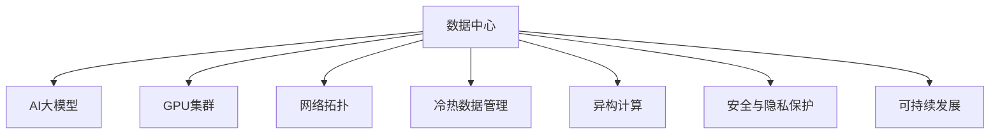

                 

# AI 大模型应用数据中心建设：数据中心产业发展

> 关键词：AI大模型、数据中心、深度学习、GPU集群、网络拓扑、冷热数据、异构计算、安全与隐私、可持续发展

## 1. 背景介绍

### 1.1 问题由来
随着人工智能(AI)技术特别是深度学习(DL)技术的发展，数据中心成为支撑AI应用的重要基础设施。AI大模型的训练与推理，需要强大的计算资源和高效的存储系统，数据中心在这方面扮演着关键角色。同时，AI模型的数据需求巨大，数据中心也成为重要的数据存储和处理平台。数据中心的发展水平，直接影响AI应用的广泛性和深度。

### 1.2 问题核心关键点
本文聚焦于AI大模型应用背景下，数据中心的建设与运营。具体研究内容包括：
1. 数据中心在AI大模型应用中的关键作用。
2. 数据中心的高效运维策略，包括冷热数据管理、网络拓扑优化、异构计算、安全与隐私保护等。
3. 数据中心可持续发展的技术路径和政策建议。

### 1.3 问题研究意义
数据中心建设与运营的优化，对于提升AI大模型的训练与推理效率，保障AI应用的可靠性和安全性，促进AI技术的广泛应用，具有重要意义。

- 提升AI模型性能。数据中心的优化布局和高效运维，可以显著提升AI模型的训练速度和推理准确性。
- 降低AI应用成本。通过优化数据中心资源利用率，降低能耗和运维成本，使得AI应用更经济、更普及。
- 保障数据安全与隐私。数据中心采用先进的安全与隐私保护技术，确保AI模型训练和推理过程中的数据安全。
- 促进可持续发展。数据中心建设需要充分考虑能源消耗、环境影响等因素，追求绿色低碳发展。

## 2. 核心概念与联系

### 2.1 核心概念概述

为更好地理解AI大模型应用数据中心建设，本节将介绍几个密切相关的核心概念：

- **数据中心(Data Center, DC)**：提供计算、存储、网络等资源的设施，支持大规模数据的存储和处理，是AI模型训练与推理的重要基础。
- **AI大模型(AI Large Model)**：通过预训练-微调等技术，构建的具有复杂语言模型结构的模型，如GPT、BERT等，具备强大的语言理解和生成能力。
- **GPU集群**：由多个高性能图形处理单元(GPU)构成的计算集群，用于加速深度学习模型的训练和推理。
- **网络拓扑**：数据中心内网络设备（如交换机、路由器等）之间的连接关系，影响数据传输效率和稳定性。
- **冷热数据管理**：根据数据访问频率和重要性，对数据进行分层管理，优化存储和访问策略，提高数据中心资源利用率。
- **异构计算**：利用不同类型计算资源（如CPU、GPU、FPGA等）协同计算，提升数据中心的计算能力。
- **安全与隐私保护**：采用加密、去标识化、访问控制等技术手段，保障数据中心内数据的安全与隐私。
- **可持续发展**：通过绿色能源、高效能耗管理、循环利用等措施，实现数据中心的绿色低碳发展。

这些核心概念之间的逻辑关系可以通过以下Mermaid流程图来展示：



这个流程图展示了大语言模型应用数据中心的核心概念及其之间的关系：

1. 数据中心通过GPU集群、网络拓扑等技术，为AI大模型的训练与推理提供强大的计算与网络支持。
2. 通过冷热数据管理、异构计算等策略，优化数据中心资源利用，提升模型训练与推理效率。
3. 安全与隐私保护技术保障模型训练与推理过程中的数据安全，避免数据泄露和滥用。
4. 可持续发展策略确保数据中心绿色低碳运行，符合环保和能效要求。

## 3. 核心算法原理 & 具体操作步骤

### 3.1 算法原理概述

AI大模型应用数据中心建设的核心在于：通过优化数据中心的计算、存储、网络等基础设施，保障AI大模型的高效训练与推理。其基本原理可以总结如下：

1. **高效计算集群建设**：通过构建GPU集群、异构计算集群，提供高性能计算资源，支持大规模深度学习模型的训练与推理。
2. **网络拓扑优化**：通过合理设计网络拓扑结构，优化数据传输路径，提高网络带宽和稳定性。
3. **冷热数据管理**：通过分层存储、分布式存储等技术，提高数据访问效率，降低存储成本。
4. **安全与隐私保护**：通过加密、去标识化、访问控制等技术，保障数据在数据中心内的安全与隐私。
5. **绿色低碳发展**：通过高效能耗管理、可再生能源利用等措施，降低数据中心的能源消耗，实现可持续发展。

### 3.2 算法步骤详解

AI大模型应用数据中心建设的具体步骤如下：

**Step 1: 数据中心规划与设计**
- 确定数据中心的位置、规模和能源需求，选址应考虑自然环境、电力供应、通信条件等因素。
- 设计数据中心的网络拓扑结构，包括接入层、汇聚层、核心层等层次划分。
- 选择合适的存储系统，如SSD、HDD等，以及相应的存储协议。

**Step 2: 计算集群建设**
- 采购或定制高性能GPU集群，构建计算集群，确保集群能够满足AI模型训练和推理的需求。
- 部署异构计算资源，如FPGA、ASIC等，提升数据中心的计算能力。

**Step 3: 网络拓扑优化**
- 选择合适的网络设备，如交换机、路由器等，设计合理的网络拓扑结构。
- 使用负载均衡、网络切片等技术，优化数据传输路径，提高网络带宽和稳定性。

**Step 4: 冷热数据管理**
- 对数据进行分层存储，将高频访问的热数据存储在高速存储设备中，低频访问的冷数据存储在低速设备中。
- 采用分布式存储技术，如Hadoop、Ceph等，提高数据存储和访问效率。

**Step 5: 安全与隐私保护**
- 部署网络安全设备，如防火墙、入侵检测系统等，保障数据中心网络安全。
- 采用数据加密、去标识化、访问控制等技术，保护数据中心内数据的安全与隐私。

**Step 6: 可持续发展策略**
- 采用高效能耗管理技术，如动态功耗调节、高效制冷系统等，降低数据中心能源消耗。
- 利用可再生能源，如太阳能、风能等，降低数据中心的碳足迹。
- 实施循环利用策略，如设备再制造、资源回收等，实现绿色低碳发展。

**Step 7: 运维与优化**
- 建立数据中心的运维管理系统，监控设备运行状态和数据中心环境。
- 根据实际运行情况，定期优化数据中心的网络、存储、计算资源配置。

### 3.3 算法优缺点

AI大模型应用数据中心建设的优点包括：

1. 提升AI模型性能。通过高效的计算集群和网络拓扑设计，可以显著提升AI模型的训练速度和推理效率。
2. 降低AI应用成本。优化数据中心资源利用，减少能耗和运维成本，使得AI应用更经济。
3. 保障数据安全与隐私。采用先进的安全与隐私保护技术，确保数据在数据中心内的安全与隐私。
4. 促进可持续发展。通过绿色能源、高效能耗管理等措施，实现数据中心的绿色低碳发展。

然而，该方法也存在一些局限性：

1. 初始投资成本高。建设高性能的计算集群、存储系统等基础设施，需要较高的初期投资。
2. 技术复杂度高。数据中心建设与运营涉及网络、存储、计算等多个领域，技术难度较大。
3. 管理与维护复杂。数据中心运维需要精细化的管理与维护，涉及设备运维、能耗管理等多个方面。
4. 能耗问题未完全解决。尽管采用了一些绿色低碳技术，数据中心的能源消耗仍然较大。

尽管存在这些局限性，但就目前而言，AI大模型应用数据中心建设仍是实现AI应用的重要手段。未来相关研究的重点在于如何进一步降低初始投资成本，提高运维效率，同时兼顾数据安全和可持续发展。

### 3.4 算法应用领域

AI大模型应用数据中心建设的应用领域非常广泛，涵盖多个行业和应用场景：

1. **科学研究与学术研究**：数据中心提供高性能计算资源，支持大规模科学计算和数据分析。
2. **工业与制造**：数据中心支持工业物联网（IIoT）设备的数据处理和模型训练，提升工业生产效率和智能化水平。
3. **金融与保险**：数据中心支持金融大数据分析、智能投顾、风险管理等应用，提升金融服务水平。
4. **医疗与健康**：数据中心支持医疗图像分析、基因组学研究、个性化健康管理等应用，提升医疗服务质量。
5. **智慧城市**：数据中心支持城市智能监控、交通管理、公共安全等应用，提升城市治理水平。
6. **教育与培训**：数据中心支持在线教育平台的数据处理和模型训练，提升教育服务质量。
7. **媒体与娱乐**：数据中心支持视频内容处理、推荐系统、智能广告等应用，提升用户体验。
8. **环境保护**：数据中心支持环境监测、灾害预警等应用，提升环境管理水平。

## 4. 数学模型和公式 & 详细讲解 & 举例说明

### 4.1 数学模型构建

在大模型应用数据中心建设中，数学模型主要应用于能耗管理和能源优化。以下将构建一个简化的能源优化模型，并给出相关的数学公式。

假设数据中心拥有 $N$ 个服务器，每个服务器的能耗为 $P_i$，能源价格为 $p$，数据中心的总能耗为 $E$，总成本为 $C$。则数据中心的总成本模型为：

$$
C = E \times p = \sum_{i=1}^N P_i + C_{\text{固定成本}}
$$

其中 $C_{\text{固定成本}}$ 为数据中心的固定成本，包括设备购买、维护等费用。

### 4.2 公式推导过程

为了最小化数据中心总成本，我们需要对能耗进行优化。采用动态功率调节策略，根据服务器的利用率 $u_i$，调整服务器的能耗 $P_i$。假设服务器的利用率为 $u_i = \frac{T_i}{T_{\text{max}}}$，其中 $T_i$ 为服务器当前负载时间，$T_{\text{max}}$ 为服务器最大工作时间。则动态功率调节的能耗模型为：

$$
P_i = P_i^{\text{最小}} + (P_i^{\text{最大}} - P_i^{\text{最小}}) \times u_i
$$

其中 $P_i^{\text{最小}}$ 和 $P_i^{\text{最大}}$ 分别为服务器最小能耗和最大能耗。

将动态功率调节模型代入总成本模型，得：

$$
C = \sum_{i=1}^N (P_i^{\text{最小}} + (P_i^{\text{最大}} - P_i^{\text{最小}}) \times u_i) + C_{\text{固定成本}}
$$

### 4.3 案例分析与讲解

假设数据中心拥有4个服务器，能耗模型为：

- 最小能耗 $P_i^{\text{最小}} = 100$ 瓦
- 最大能耗 $P_i^{\text{最大}} = 200$ 瓦
- 固定成本 $C_{\text{固定成本}} = 10000$ 元/年
- 假设服务器的最大工作时间为 $T_{\text{max}} = 24$ 小时/天，当前负载时间为 $T_i = 8$ 小时/天

采用动态功率调节策略，得：

- 服务器1的利用率 $u_1 = \frac{T_i}{T_{\text{max}}} = 0.33$
- 服务器1的能耗 $P_1 = 100 + (200 - 100) \times 0.33 = 133$ 瓦
- 服务器2的利用率 $u_2 = 1$
- 服务器2的能耗 $P_2 = 200$ 瓦
- 服务器3的利用率 $u_3 = 0$
- 服务器3的能耗 $P_3 = 100$ 瓦
- 服务器4的利用率 $u_4 = 0$
- 服务器4的能耗 $P_4 = 100$ 瓦

总能耗为 $E = 133 + 200 + 100 + 100 = 533$ 瓦

总成本为 $C = 533 \times p + 10000$

当服务器的利用率 $u_i$ 变化时，总成本 $C$ 也随之变化。通过优化利用率 $u_i$，可以使得总成本 $C$ 最小化，达到节能减排的效果。

## 5. 项目实践：代码实例和详细解释说明

### 5.1 开发环境搭建

在进行AI大模型应用数据中心建设的项目实践前，我们需要准备好开发环境。以下是使用Python进行数据中心能耗优化项目的开发环境配置流程：

1. 安装Anaconda：从官网下载并安装Anaconda，用于创建独立的Python环境。

2. 创建并激活虚拟环境：
```bash
conda create -n datacenter-env python=3.8 
conda activate datacenter-env
```

3. 安装相关库：
```bash
conda install numpy pandas matplotlib scikit-learn jupyter notebook
```

完成上述步骤后，即可在`datacenter-env`环境中开始项目实践。

### 5.2 源代码详细实现

下面以数据中心能源优化为例，给出使用Python进行能源优化计算的代码实现。

首先，定义能源优化模型：

```python
from sympy import symbols, Rational, pi, solve

# 定义符号变量
P_min = symbols('P_min')
P_max = symbols('P_max')
T_max = symbols('T_max')
T_i = symbols('T_i')
N = symbols('N')
u_i = symbols('u_i')
C_fixed = symbols('C_fixed')
p = symbols('p')

# 定义能源优化模型
E = sum([(P_min + (P_max - P_min) * u_i) for i in range(N)])
C = E * p + C_fixed

# 求解最小成本对应的利用率
u_optimal = solve(C.diff(u_i), u_i)[0]
```

然后，计算能耗优化模型：

```python
# 定义能耗模型
def compute_power(P_min, P_max, T_max, T_i, N):
    u_i = T_i / T_max
    return P_min + (P_max - P_min) * u_i

# 计算总能耗
def compute_total_power(P_min, P_max, T_max, T_i, N):
    return sum(compute_power(P_min, P_max, T_max, T_i, N) for i in range(N))

# 计算总成本
def compute_total_cost(P_min, P_max, T_max, T_i, N, C_fixed, p):
    total_power = compute_total_power(P_min, P_max, T_max, T_i, N)
    return total_power * p + C_fixed

# 计算最小成本对应的利用率
def compute_optimal_utilization(P_min, P_max, T_max, T_i, N, C_fixed, p):
    total_cost = compute_total_cost(P_min, P_max, T_max, T_i, N, C_fixed, p)
    u_optimal = solve(total_cost.diff(u_i), u_i)[0]
    return u_optimal
```

最后，进行数据中心能耗优化的代码实践：

```python
# 定义数据中心参数
P_min = 100  # 最小能耗
P_max = 200  # 最大能耗
T_max = 24  # 最大工作时间
T_i = 8     # 当前负载时间
N = 4       # 服务器数量
C_fixed = 10000  # 固定成本
p = 1  # 能源价格

# 计算最优利用率
u_optimal = compute_optimal_utilization(P_min, P_max, T_max, T_i, N, C_fixed, p)

# 计算最优能耗和总成本
P_optimal = compute_power(P_min, P_max, T_max, T_i, N)
C_optimal = compute_total_cost(P_min, P_max, T_max, T_i, N, C_fixed, p)

print(f"最优利用率: {u_optimal}")
print(f"最优能耗: {P_optimal} 瓦")
print(f"总成本: {C_optimal} 元/年")
```

以上就是使用Python对数据中心能耗优化进行代码实现的完整过程。通过简单的模型构建和求解，可以得出最优的能耗利用率和总成本。

### 5.3 代码解读与分析

让我们再详细解读一下关键代码的实现细节：

**能源优化模型定义**：
- 定义了符号变量 $P_{\text{min}}, P_{\text{max}}, T_{\text{max}}, T_{\text{i}}, N, C_{\text{fixed}}, p$，分别代表最小能耗、最大能耗、最大工作时间、当前负载时间、服务器数量、固定成本和能源价格。
- 定义了能源优化模型 $E$ 和总成本模型 $C$。

**能耗计算函数**：
- `compute_power`函数计算单个服务器的能耗 $P_i$，采用动态功率调节策略。
- `compute_total_power`函数计算所有服务器的总能耗 $E$。

**总成本计算函数**：
- `compute_total_cost`函数计算总成本 $C$，包括固定成本和动态功率调节的能耗成本。

**最优利用率计算函数**：
- `compute_optimal_utilization`函数求解最优利用率 $u_{\text{optimal}}$，使得总成本 $C$ 最小化。

**数据中心能耗优化实践**：
- 定义数据中心参数，包括最小能耗、最大能耗、最大工作时间、当前负载时间、服务器数量、固定成本和能源价格。
- 调用计算函数，得出最优利用率 $u_{\text{optimal}}$、最优能耗 $P_{\text{optimal}}$ 和总成本 $C_{\text{optimal}}$。

可以看到，通过简单的数学模型构建和代码实现，可以很好地进行数据中心的能耗优化。开发者可以根据具体需求，灵活调整参数，以获得最优的能耗利用率。

## 6. 实际应用场景

### 6.1 智能制造与工业物联网

在智能制造和工业物联网领域，数据中心提供高性能计算资源，支持工业设备的数据处理和模型训练，提升工业生产效率和智能化水平。例如，通过数据中心训练的机器视觉模型，可以实现智能质量检测、故障预测等应用。数据中心优化布局和能耗管理，可以大幅提升模型训练和推理效率，缩短生产周期。

### 6.2 智慧城市与智能交通

在智慧城市和智能交通领域，数据中心支持城市智能监控、交通管理等应用，提升城市治理水平。例如，通过数据中心训练的交通预测模型，可以实现智能交通信号控制，优化交通流量，减少交通拥堵。数据中心优化网络拓扑和能耗管理，可以保证模型的实时性和稳定性。

### 6.3 医疗健康与生命科学

在医疗健康与生命科学领域，数据中心支持医疗图像分析、基因组学研究等应用，提升医疗服务质量。例如，通过数据中心训练的医学影像分析模型，可以实现疾病早期筛查、个性化治疗方案等应用。数据中心优化冷热数据管理，可以保证敏感数据的存储安全和快速访问。

### 6.4 金融与保险

在金融与保险领域，数据中心支持金融大数据分析、智能投顾等应用，提升金融服务水平。例如，通过数据中心训练的金融市场分析模型，可以实现股票价格预测、风险评估等应用。数据中心优化异构计算和能耗管理，可以提升模型计算速度和稳定性。

### 6.5 科研与学术研究

在科研与学术研究领域，数据中心提供高性能计算资源，支持大规模科学计算和数据分析。例如，通过数据中心训练的气候模拟模型，可以实现气候变化预测、环境治理等应用。数据中心优化冷热数据管理和能耗管理，可以提升模型计算效率和稳定性。

### 6.6 文化与娱乐

在文化与娱乐领域，数据中心支持视频内容处理、推荐系统等应用，提升用户体验。例如，通过数据中心训练的视频内容生成模型，可以实现个性化视频推荐、虚拟现实等应用。数据中心优化异构计算和能耗管理，可以提升模型计算速度和稳定性。

## 7. 工具和资源推荐

### 7.1 学习资源推荐

为了帮助开发者系统掌握AI大模型应用数据中心建设的理论基础和实践技巧，这里推荐一些优质的学习资源：

1. 《深度学习入门》书籍：从基础概念到实际应用，全面介绍深度学习技术及其在数据中心的应用。
2. 《数据中心管理与运维》课程：介绍数据中心规划、设计、运维等关键技术，助力数据中心高效运行。
3. 《云计算与大数据》课程：涵盖云计算、大数据、人工智能等前沿技术，助力AI应用落地。
4. 《数据中心能效管理》课程：详细介绍数据中心能耗管理技术，优化数据中心能源利用。
5. 《人工智能与安全》课程：介绍AI技术的伦理、安全、隐私保护等关键问题，提升AI应用安全性。
6. 《智能制造与工业物联网》课程：介绍智能制造与IIoT技术及其在数据中心的应用。

通过这些资源的学习实践，相信你一定能够快速掌握AI大模型应用数据中心建设的精髓，并用于解决实际的AI问题。

### 7.2 开发工具推荐

高效的开发离不开优秀的工具支持。以下是几款用于AI大模型应用数据中心开发的常用工具：

1. Python：数据中心开发的首选语言，广泛应用在深度学习、大数据等领域。
2. PyTorch：基于Python的深度学习框架，灵活的计算图，支持GPU加速，适合AI模型训练与推理。
3. TensorFlow：由Google主导的深度学习框架，支持分布式计算和异构计算，适合大规模数据处理。
4. Docker：容器化技术，方便数据中心应用部署和运维管理。
5. Kubernetes：容器编排工具，支持大规模数据中心资源管理。
6. Ansible：自动化运维工具，支持数据中心环境快速部署和管理。

合理利用这些工具，可以显著提升AI大模型应用数据中心建设的开发效率，加快创新迭代的步伐。

### 7.3 相关论文推荐

AI大模型应用数据中心建设的研究涉及多个领域，以下是几篇奠基性的相关论文，推荐阅读：

1. "Data Center Management: Principles and Challenges"：全面介绍数据中心管理与运维的关键技术和挑战。
2. "Energy-Efficient Data Center Network Design: A Survey"：详细探讨数据中心网络设计中的能耗管理技术。
3. "Artificial Intelligence: Advances and Applications"：介绍AI技术的最新进展和实际应用。
4. "Artificial Intelligence for Smart Manufacturing"：探讨AI技术在智能制造中的应用和挑战。
5. "AI in Smart Cities"：讨论AI技术在智慧城市中的应用和前景。
6. "AI in Healthcare"：探讨AI技术在医疗健康中的应用和挑战。
7. "AI in Finance"：探讨AI技术在金融领域的应用和挑战。

这些论文代表了大模型应用数据中心建设的研究进展，通过学习这些前沿成果，可以帮助研究者把握学科前进方向，激发更多的创新灵感。

## 8. 总结：未来发展趋势与挑战

### 8.1 总结

本文对AI大模型应用数据中心建设进行了全面系统的介绍。首先阐述了数据中心在AI大模型应用中的关键作用，明确了数据中心高效运维策略的优化方向。其次，从原理到实践，详细讲解了数据中心的高效运维策略，包括冷热数据管理、网络拓扑优化、异构计算、安全与隐私保护等。最后，本文还探讨了数据中心的可持续发展策略，提出了相关技术路径和政策建议。

通过本文的系统梳理，可以看到，AI大模型应用数据中心建设是实现AI应用的重要手段，具有广泛的应用前景。数据中心的优化布局和高效运维，可以显著提升AI模型的训练速度和推理效率，降低能耗和运维成本，保障数据安全与隐私，实现绿色低碳发展。

### 8.2 未来发展趋势

展望未来，AI大模型应用数据中心建设将呈现以下几个发展趋势：

1. **高性能计算集群**：随着算力需求日益增加，数据中心将继续提升GPU集群和异构计算能力，支持更大规模、更复杂的AI模型训练与推理。
2. **绿色低碳发展**：通过绿色能源、高效能耗管理等措施，数据中心的能源消耗将进一步降低，推动绿色低碳发展。
3. **边缘计算**：将数据处理任务下沉到边缘设备，提升数据传输效率，优化数据中心负载。
4. **智能运维管理**：采用AI技术进行数据中心运维管理，提高资源利用率和故障处理效率。
5. **数据安全与隐私保护**：采用更先进的安全与隐私保护技术，确保数据在数据中心内的安全与隐私。
6. **异构计算与融合计算**：结合CPU、GPU、FPGA等异构计算资源，提升数据中心的计算能力和灵活性。
7. **AI应用普及化**：AI大模型应用数据中心的优化布局和高效运维，将进一步推动AI技术在各个垂直行业的普及应用。

### 8.3 面临的挑战

尽管AI大模型应用数据中心建设取得了显著进展，但在迈向更加智能化、普适化应用的过程中，仍面临诸多挑战：

1. **初期投资成本高**：建设高性能的计算集群、存储系统等基础设施，需要较高的初期投资。
2. **技术复杂度高**：数据中心建设与运营涉及网络、存储、计算等多个领域，技术难度较大。
3. **能耗问题未完全解决**：尽管采用了一些绿色低碳技术，数据中心的能源消耗仍然较大。
4. **数据安全与隐私保护**：数据中心需要采取更先进的安全与隐私保护技术，确保数据在数据中心内的安全与隐私。
5. **资源利用率问题**：数据中心需要优化资源利用率，避免资源浪费和过度配置。
6. **跨领域协同难度**：AI大模型应用数据中心的优化布局和高效运维，需要跨领域协同，涉及多个技术环节。

### 8.4 研究展望

面对AI大模型应用数据中心建设所面临的挑战，未来的研究需要在以下几个方面寻求新的突破：

1. **绿色能源与高效能耗管理**：采用更高效的可再生能源和能耗管理技术，降低数据中心的能源消耗，实现绿色低碳发展。
2. **智能运维管理**：采用AI技术进行数据中心运维管理，提高资源利用率和故障处理效率。
3. **数据安全与隐私保护**：采用更先进的安全与隐私保护技术，确保数据在数据中心内的安全与隐私。
4. **跨领域协同技术**：发展跨领域协同技术，优化数据中心布局和资源配置。
5. **边缘计算与融合计算**：结合边缘计算和融合计算技术，提升数据中心计算能力和灵活性。
6. **AI应用普及化**：推动AI技术在各个垂直行业的普及应用，提升AI应用的广泛性和深度。

这些研究方向的探索，必将引领AI大模型应用数据中心建设迈向更高的台阶，为AI技术的广泛应用提供坚实的基础。面向未来，数据中心建设需要从技术、政策、管理等多个维度协同发力，共同推动AI技术的创新和应用。

## 9. 附录：常见问题与解答

**Q1：数据中心在AI大模型应用中的关键作用是什么？**

A: 数据中心是AI大模型应用的核心基础设施，提供计算、存储、网络等资源，支持AI模型的训练与推理。数据中心的优化布局和高效运维，可以显著提升AI模型的训练速度和推理效率，降低能耗和运维成本，保障数据安全与隐私，实现绿色低碳发展。

**Q2：数据中心高效运维的关键策略有哪些？**

A: 数据中心高效运维的关键策略包括：
1. 冷热数据管理：根据数据访问频率和重要性，对数据进行分层管理，优化存储和访问策略，提高数据中心资源利用率。
2. 网络拓扑优化：通过合理设计网络拓扑结构，优化数据传输路径，提高网络带宽和稳定性。
3. 异构计算：利用不同类型计算资源（如CPU、GPU、FPGA等）协同计算，提升数据中心的计算能力。
4. 安全与隐私保护：采用加密、去标识化、访问控制等技术，保障数据在数据中心内的安全与隐私。
5. 绿色低碳发展：通过绿色能源、高效能耗管理等措施，降低数据中心的能源消耗，实现可持续发展。

**Q3：数据中心的能源优化模型如何构建？**

A: 数据中心的能源优化模型可以采用动态功率调节策略，根据服务器的利用率 $u_i$，调整服务器的能耗 $P_i$。假设服务器的利用率为 $u_i = \frac{T_i}{T_{\text{max}}}$，其中 $T_i$ 为服务器当前负载时间，$T_{\text{max}}$ 为服务器最大工作时间。则动态功率调节的能耗模型为：

$$
P_i = P_i^{\text{最小}} + (P_i^{\text{最大}} - P_i^{\text{最小}}) \times u_i
$$

将动态功率调节模型代入总成本模型，得：

$$
C = \sum_{i=1}^N (P_i^{\text{最小}} + (P_i^{\text{最大}} - P_i^{\text{最小}}) \times u_i) + C_{\text{固定成本}}
$$

**Q4：数据中心的能耗管理与优化有哪些具体措施？**

A: 数据中心的能耗管理与优化具体措施包括：
1. 动态功率调节：根据服务器的利用率，调整服务器的能耗。
2. 绿色能源利用：采用太阳能、风能等可再生能源，降低数据中心的能源消耗。
3. 高效能耗管理：采用高效制冷系统、动态功耗调节等技术，降低数据中心的能耗。
4. 数据中心冷热数据管理：通过分层存储、分布式存储等技术，提高数据访问效率，降低存储成本。
5. 智能运维管理：采用AI技术进行数据中心运维管理，提高资源利用率和故障处理效率。

**Q5：数据中心的安全与隐私保护技术有哪些？**

A: 数据中心的安全与隐私保护技术包括：
1. 数据加密：对数据进行加密处理，确保数据在传输和存储过程中的安全性。
2. 去标识化：采用匿名化技术，去除数据中的个人标识信息，保护用户隐私。
3. 访问控制：通过身份验证、权限管理等手段，限制数据的访问范围，保障数据安全。
4. 入侵检测：部署网络安全设备，如防火墙、入侵检测系统等，保障数据中心网络安全。
5. 安全审计：定期进行安全审计，发现并修复潜在的安全漏洞，提升数据中心安全防护能力。

---

作者：禅与计算机程序设计艺术 / Zen and the Art of Computer Programming

