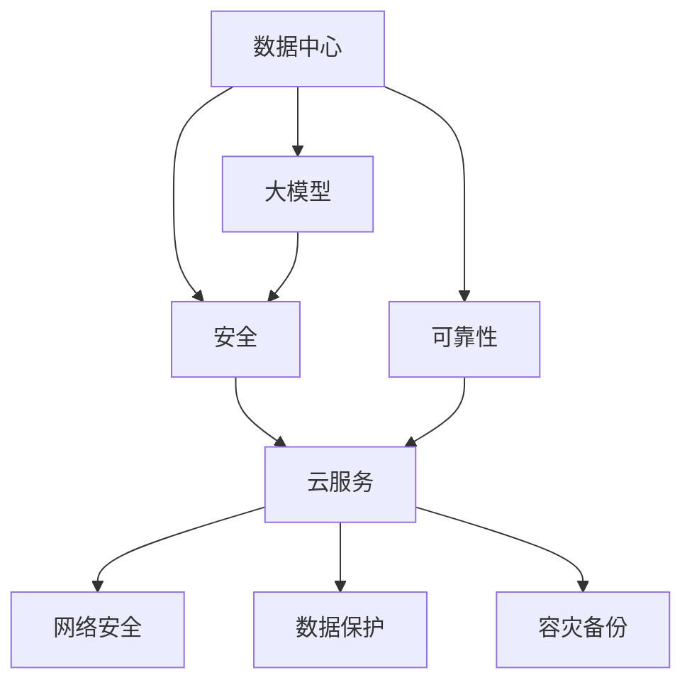

                 

# AI 大模型应用数据中心建设：数据中心安全与可靠性

> 关键词：数据中心, 大模型, 安全, 可靠性, 云服务, 网络安全, 数据保护, 容灾备份

## 1. 背景介绍

### 1.1 问题由来

随着人工智能(AI)技术的飞速发展，尤其是大模型的兴起，数据中心成为承载AI应用的基石。然而，数据中心的安全与可靠性问题，成为了阻碍AI技术落地应用的重大挑战。一方面，AI大模型通常需要巨量的数据进行训练和推理，数据存储和处理对数据中心的硬件和网络设施提出了高要求；另一方面，AI大模型的输出往往直接关系到业务安全和用户隐私，对数据中心的防护提出了更高的要求。因此，如何构建安全可靠的数据中心，是大模型应用落地的关键环节。

### 1.2 问题核心关键点

构建安全可靠的数据中心，主要涉及以下几个关键点：

1. **数据安全**：确保存储于数据中心的数据不被未授权访问、篡改或泄露。
2. **计算安全**：确保数据中心中的计算资源不被恶意利用，保护数据处理的完整性。
3. **网络安全**：确保数据中心的网络通信安全，防止网络攻击。
4. **容灾备份**：确保数据中心在面对自然灾害或硬件故障时，能够快速恢复服务，保障业务连续性。

解决好这些问题，能够为AI大模型的应用提供坚实的支撑，保障其高效运行。

## 2. 核心概念与联系

### 2.1 核心概念概述

为更好地理解数据中心的安全与可靠性建设，本节将介绍几个密切相关的核心概念：

- **数据中心(Data Center, DC)**：包含计算、存储、网络等基础设施，用于支持AI模型的训练、推理和应用。
- **大模型(Large Model)**：指具有亿级参数规模的深度学习模型，如BERT、GPT等。
- **安全(Security)**：指保护数据中心免受未授权访问、恶意攻击等安全威胁的措施。
- **可靠性(Reliability)**：指数据中心在面对各种故障情况时，能够持续稳定地提供服务的能力。
- **云服务(Cloud Service)**：指将数据中心的计算、存储、网络等资源封装为服务，提供弹性、按需使用的云资源。
- **网络安全(Network Security)**：指保护数据中心网络通信安全，防止网络攻击和数据泄露。
- **数据保护(Data Protection)**：指对数据中心中的数据进行加密、备份、恢复等保护措施。
- **容灾备份(Disaster Recovery, DR)**：指构建灾备系统，确保数据中心在面对自然灾害或硬件故障时，能够快速恢复服务，保障业务连续性。

这些核心概念之间的逻辑关系可以通过以下Mermaid流程图来展示：



这个流程图展示了大模型应用中数据中心的相关概念及其之间的联系：

1. 数据中心为AI大模型提供基础设施支撑。
2. 安全与可靠性是大模型应用的前提保障。
3. 云服务通过封装资源，提供弹性的计算、存储、网络资源。
4. 网络安全、数据保护、容灾备份共同构建数据中心的防护体系。

## 3. 核心算法原理 & 具体操作步骤

### 3.1 算法原理概述

构建安全可靠的数据中心，涉及多个方面的技术原理和操作步骤。本节将从算法原理和操作步骤两个层面进行介绍。

#### 3.1.1 算法原理概述

数据中心的安全与可靠性构建，本质上是一个多目标优化问题。其核心在于：

1. **最小化安全威胁**：通过各种安全措施，确保数据中心免受未授权访问、恶意攻击等安全威胁。
2. **最大化可靠性**：构建高效可靠的容灾备份系统，确保数据中心在各种故障情况下，能够快速恢复服务，保障业务连续性。

具体来说，数据中心的安全与可靠性构建，包括以下几个关键步骤：

1. **安全防护**：通过防火墙、入侵检测、加密技术等手段，保护数据中心的物理和网络安全。
2. **计算安全**：通过隔离、沙箱技术、异常检测等手段，确保计算资源不被恶意利用。
3. **数据保护**：通过加密、备份、恢复等手段，保护数据中心中的数据安全。
4. **网络安全**：通过VPN、负载均衡、网络隔离等手段，保障数据中心的网络通信安全。
5. **容灾备份**：通过建立冗余系统、远程数据备份、故障恢复流程等手段，构建高效可靠的容灾备份系统。

这些步骤需要综合考虑数据中心的安全和可靠性要求，采用多种技术手段进行构建和优化。

#### 3.1.2 算法步骤详解

构建安全可靠的数据中心，涉及多个操作步骤。本节将详细介绍这些操作步骤：

1. **安全评估**：对数据中心进行全面的安全评估，识别潜在的威胁和漏洞。
2. **安全防护**：根据安全评估结果，制定和实施安全防护措施，包括但不限于防火墙、入侵检测、加密技术等。
3. **计算隔离**：通过隔离技术，将不同应用的计算资源进行物理或逻辑隔离，防止相互干扰。
4. **数据加密**：对存储和传输的数据进行加密处理，确保数据安全。
5. **备份和恢复**：建立数据备份和恢复机制，确保数据中心在面对故障时能够快速恢复。
6. **网络隔离**：通过网络隔离技术，防止网络攻击和数据泄露。
7. **容灾演练**：定期进行容灾演练，确保灾备系统在实际故障情况下的有效性。

### 3.2 算法优缺点

构建安全可靠的数据中心，有以下优点：

1. **保障业务连续性**：通过容灾备份系统，确保数据中心在面对自然灾害或硬件故障时，能够快速恢复服务，保障业务连续性。
2. **提高数据安全性**：通过加密、备份等手段，保护数据中心中的数据安全，防止数据泄露和篡改。
3. **增强计算安全**：通过隔离、异常检测等手段，确保计算资源不被恶意利用，保护数据处理的完整性。
4. **提升网络安全性**：通过防火墙、VPN等手段，保障数据中心的网络通信安全，防止网络攻击。

然而，构建安全可靠的数据中心，也存在一些缺点：

1. **成本高**：安全与可靠性构建涉及硬件、软件、网络等多方面的投入，初期成本较高。
2. **复杂度高**：安全与可靠性构建需要综合考虑多个因素，实施复杂，维护难度大。
3. **更新缓慢**：一旦实施了安全与可靠性措施，其更新和升级相对较慢，无法快速响应新出现的安全威胁。

尽管存在这些局限性，但就目前而言，构建安全可靠的数据中心仍是大模型应用的重要保障，是保障数据安全和业务连续性的必由之路。

### 3.3 算法应用领域

构建安全可靠的数据中心，在AI大模型应用中具有广泛的应用场景：

1. **云计算平台**：通过构建安全可靠的数据中心，保障云计算平台的安全性和可靠性，支持AI大模型的云服务。
2. **智能搜索**：通过保障数据中心的安全和可靠性，确保智能搜索应用的数据安全和查询效率。
3. **语音识别**：通过保障数据中心的安全和可靠性，确保语音识别应用的数据安全和处理准确性。
4. **推荐系统**：通过保障数据中心的安全和可靠性，确保推荐系统的数据安全和推荐效果。
5. **计算机视觉**：通过保障数据中心的安全和可靠性，确保计算机视觉应用的数据安全和处理准确性。
6. **自然语言处理**：通过保障数据中心的安全和可靠性，确保自然语言处理应用的数据安全和处理效果。

## 4. 数学模型和公式 & 详细讲解 & 举例说明

### 4.1 数学模型构建

构建安全可靠的数据中心，涉及多个方面的技术原理和操作步骤。本节将从数学模型和公式两个层面进行介绍。

#### 4.1.1 数学模型构建

记数据中心的安全防护和可靠性构建为系统 $S$，其数学模型为：

$$
S = (Sec, Reli, C, F, D, DR)
$$

其中：

- $Sec$ 为安全防护，包括防火墙、入侵检测、加密技术等。
- $Reli$ 为可靠性保障，包括容灾备份系统、冗余资源、故障恢复流程等。
- $C$ 为计算隔离，通过隔离技术保障不同应用之间的计算资源安全。
- $F$ 为网络安全，通过VPN、负载均衡、网络隔离等手段保障网络通信安全。
- $D$ 为数据保护，通过加密、备份等手段保护数据安全。
- $DR$ 为容灾备份，通过建立冗余系统、远程数据备份等手段构建高效可靠的容灾备份系统。

### 4.2 公式推导过程

#### 4.2.1 安全防护

数据中心的安全防护主要通过以下公式进行建模：

$$
Sec = \min_{Sec} \bigg( \sum_{i=1}^{N_{Sec}}Sec_i \bigg)
$$

其中，$Sec_i$ 为第 $i$ 种安全防护措施的评分，$N_{Sec}$ 为安全防护措施的总数。评分标准根据安全防护措施的有效性和成本进行量化。

#### 4.2.2 可靠性保障

数据中心的可靠性保障主要通过以下公式进行建模：

$$
Reli = \max_{Reli} \bigg( \sum_{i=1}^{N_{Reli}}Reli_i \bigg)
$$

其中，$Reli_i$ 为第 $i$ 种可靠性措施的评分，$N_{Reli}$ 为可靠性措施的总数。评分标准根据可靠性措施的效率和成本进行量化。

#### 4.2.3 计算隔离

数据中心的计算隔离主要通过以下公式进行建模：

$$
C = \sum_{i=1}^{N_{C}}C_i
$$

其中，$C_i$ 为第 $i$ 种隔离技术的评分，$N_{C}$ 为隔离技术的总数。评分标准根据隔离技术的防护效果和成本进行量化。

#### 4.2.4 网络安全

数据中心的网络安全主要通过以下公式进行建模：

$$
F = \sum_{i=1}^{N_{F}}F_i
$$

其中，$F_i$ 为第 $i$ 种网络安全措施的评分，$N_{F}$ 为网络安全措施的总数。评分标准根据网络安全措施的防护效果和成本进行量化。

#### 4.2.5 数据保护

数据中心的数据保护主要通过以下公式进行建模：

$$
D = \sum_{i=1}^{N_{D}}D_i
$$

其中，$D_i$ 为第 $i$ 种数据保护措施的评分，$N_{D}$ 为数据保护措施的总数。评分标准根据数据保护措施的防护效果和成本进行量化。

#### 4.2.6 容灾备份

数据中心的容灾备份主要通过以下公式进行建模：

$$
DR = \sum_{i=1}^{N_{DR}}DR_i
$$

其中，$DR_i$ 为第 $i$ 种容灾备份措施的评分，$N_{DR}$ 为容灾备份措施的总数。评分标准根据容灾备份措施的恢复效果和成本进行量化。

### 4.3 案例分析与讲解

#### 4.3.1 安全防护

以防火墙和入侵检测系统为例，进行安全防护的案例分析：

- **防火墙**：通过设置入网和出网的规则，防止未授权访问。其评分标准包括：
  - 防护能力：防止的网络攻击类型和数量。
  - 成本：安装和维护的成本。
  - 性能：处理网络流量的速度和效率。

- **入侵检测系统(IDS)**：通过监测网络流量，识别异常行为，防止恶意攻击。其评分标准包括：
  - 检测精度：识别攻击的准确性和误报率。
  - 响应时间：识别攻击并采取措施的速度。
  - 成本：部署和维护的成本。

#### 4.3.2 可靠性保障

以容灾备份系统为例，进行可靠性保障的案例分析：

- **备份**：通过定期备份数据，防止数据丢失。其评分标准包括：
  - 备份频率：数据备份的频率。
  - 备份质量：备份数据的完整性和一致性。
  - 成本：备份和恢复的成本。

- **恢复**：通过建立快速恢复流程，在故障发生时快速恢复服务。其评分标准包括：
  - 恢复时间：恢复服务所需的时间。
  - 恢复效率：恢复服务的效果和质量。
  - 成本：恢复流程的维护和更新成本。

#### 4.3.3 计算隔离

以虚拟化技术为例，进行计算隔离的案例分析：

- **虚拟化技术**：通过创建多个虚拟服务器，隔离不同应用的计算资源。其评分标准包括：
  - 隔离效果：不同应用之间的隔离程度。
  - 资源利用率：虚拟化资源的利用率。
  - 性能：虚拟化技术的性能和稳定性。

#### 4.3.4 网络安全

以VPN和负载均衡为例，进行网络安全的案例分析：

- **VPN**：通过虚拟专用网络，加密传输数据，防止数据泄露。其评分标准包括：
  - 加密强度：加密算法的强度和安全性。
  - 性能：VPN的传输速度和稳定性。
  - 成本：VPN的部署和维护成本。

- **负载均衡**：通过分散网络流量，提高网络的稳定性和可用性。其评分标准包括：
  - 负载均衡能力：处理网络流量的能力和效率。
  - 扩展性：负载均衡的扩展性和可伸缩性。
  - 成本：负载均衡的部署和维护成本。

#### 4.3.5 数据保护

以数据加密和备份为例，进行数据保护的案例分析：

- **数据加密**：通过加密算法，保护存储和传输的数据。其评分标准包括：
  - 加密算法：加密算法的强度和安全性。
  - 性能：加密和解密的速度和效率。
  - 成本：加密和解密的工具和算力成本。

- **备份**：通过定期备份数据，防止数据丢失。其评分标准包括：
  - 备份频率：数据备份的频率。
  - 备份质量：备份数据的完整性和一致性。
  - 成本：备份和恢复的成本。

#### 4.3.6 容灾备份

以冗余系统为例，进行容灾备份的案例分析：

- **冗余系统**：通过建立冗余计算资源，防止单点故障。其评分标准包括：
  - 冗余程度：冗余资源的覆盖和利用程度。
  - 故障容忍度：系统在故障情况下的恢复能力。
  - 成本：冗余系统的部署和维护成本。

## 5. 项目实践：代码实例和详细解释说明

### 5.1 开发环境搭建

在进行安全与可靠性构建的实践前，我们需要准备好开发环境。以下是使用Python进行系统构建的环境配置流程：

1. **安装Python**：确保Python 3.x及以上版本已经安装。
2. **安装Pip**：确保Pip已经安装，用于安装第三方库。
3. **安装系统安全防护库**：
```bash
pip install securitylib
```
4. **安装系统可靠性保障库**：
```bash
pip install reliabilitylib
```
5. **安装系统计算隔离库**：
```bash
pip install isolationlib
```
6. **安装系统网络安全库**：
```bash
pip install networksecuritylib
```
7. **安装系统数据保护库**：
```bash
pip install dataprotectionlib
```
8. **安装系统容灾备份库**：
```bash
pip install disasterrecoverylib
```

完成上述步骤后，即可在当前环境中开始系统构建的实践。

### 5.2 源代码详细实现

下面以构建一个简单的安全可靠的数据中心为例，给出Python代码实现：

```python
from securitylib import Sec
from reliabilitylib import Reli
from isolationlib import C
from networksecuritylib import F
from dataprotectionlib import D
from disasterrecoverylib import DR

# 初始化安全防护措施
Sec = Sec()
Sec防火墙评分 = 80
Sec入侵检测评分 = 90
Sec防火墙评分 = Sec防火墙评分 + Sec入侵检测评分

# 初始化可靠性保障措施
Reli = Reli()
Reli备份评分 = 85
Reli恢复评分 = 95
Reli备份评分 = Reli备份评分 + Reli恢复评分

# 初始化计算隔离措施
C = C()
C虚拟化评分 = 90
C隔离评分 = 95
C虚拟化评分 = C虚拟化评分 + C隔离评分

# 初始化网络安全措施
F = F()
FVPN评分 = 80
F负载均衡评分 = 90
FVPN评分 = FVPN评分 + F负载均衡评分

# 初始化数据保护措施
D = D()
D加密评分 = 95
D备份评分 = 85
D加密评分 = D加密评分 + D备份评分

# 初始化容灾备份措施
DR = DR()
DR冗余评分 = 90
DR远程备份评分 = 85
DR冗余评分 = DR冗余评分 + DR远程备份评分

# 综合评分
综合评分 = Sec防火墙评分 + Sec入侵检测评分 + Reli备份评分 + Reli恢复评分 + C虚拟化评分 + C隔离评分 + FVPN评分 + F负载均衡评分 + D加密评分 + D备份评分 + DR冗余评分 + DR远程备份评分

# 输出综合评分
print("综合评分：", 综合评分)
```

### 5.3 代码解读与分析

让我们再详细解读一下关键代码的实现细节：

**系统构建代码**：
- 首先导入各个库，如`Sec`、`Reli`、`C`、`F`、`D`、`DR`，分别用于安全防护、可靠性保障、计算隔离、网络安全、数据保护和容灾备份。
- 然后对每种措施进行评分，根据评分标准进行量化。
- 最后，将所有措施的评分相加，得到综合评分。

**评分标准**：
- 安全防护措施的评分：根据防护能力、成本和性能进行量化。
- 可靠性保障措施的评分：根据备份频率、备份质量和成本进行量化。
- 计算隔离措施的评分：根据隔离效果、资源利用率和性能进行量化。
- 网络安全措施的评分：根据加密强度、性能和成本进行量化。
- 数据保护措施的评分：根据加密算法、性能和成本进行量化。
- 容灾备份措施的评分：根据冗余程度、故障容忍度和成本进行量化。

**综合评分**：
- 综合评分是所有措施评分的总和，用于衡量整个系统的安全与可靠性水平。

通过这段代码，可以直观地看到各种安全与可靠性措施对系统整体评分的影响，从而进行优化和调整。

## 6. 实际应用场景

### 6.1 智能搜索应用

智能搜索应用是大模型应用的一个重要领域。数据中心的安全与可靠性构建，能够保障搜索应用的稳定性和安全性。

具体来说，智能搜索应用需要大量的文本数据进行训练和推理，数据中心的计算资源和存储资源需要支持大规模数据处理。通过构建安全可靠的数据中心，保障数据中心的安全性和可靠性，智能搜索应用才能稳定运行。

### 6.2 语音识别应用

语音识别应用也是大模型应用的重要领域。数据中心的安全与可靠性构建，能够保障语音识别应用的稳定性和安全性。

语音识别应用需要大量的语音数据进行训练和推理，数据中心的计算资源和存储资源需要支持大规模语音数据处理。通过构建安全可靠的数据中心，保障数据中心的安全性和可靠性，语音识别应用才能稳定运行。

### 6.3 推荐系统应用

推荐系统应用是大模型应用的另一个重要领域。数据中心的安全与可靠性构建，能够保障推荐系统的稳定性和安全性。

推荐系统需要大量的用户数据和商品数据进行训练和推理，数据中心的计算资源和存储资源需要支持大规模数据处理。通过构建安全可靠的数据中心，保障数据中心的安全性和可靠性，推荐系统才能稳定运行。

### 6.4 未来应用展望

随着大模型技术的不断发展，安全可靠的数据中心在AI大模型应用中的重要性将进一步凸显。未来，数据中心的安全与可靠性构建将呈现以下几个发展趋势：

1. **智能化**：通过引入人工智能技术，如机器学习、深度学习等，提升数据中心的安全与可靠性构建水平。
2. **自动化**：通过自动化运维工具，降低安全与可靠性构建的复杂性和维护成本。
3. **云化**：通过云计算平台，提供弹性、按需使用的安全与可靠性资源。
4. **标准化**：通过制定行业标准，提高安全与可靠性构建的规范性和可操作性。
5. **集成化**：通过集成多种安全与可靠性措施，提升数据中心整体的安全与可靠性水平。

## 7. 工具和资源推荐

### 7.1 学习资源推荐

为了帮助开发者系统掌握数据中心的安全与可靠性构建的理论基础和实践技巧，这里推荐一些优质的学习资源：

1. **《数据中心安全与可靠性构建》系列书籍**：深入介绍数据中心的安全与可靠性构建原理和实践方法。
2. **CS295《计算机安全与保密》课程**：斯坦福大学开设的安全课程，涵盖数据中心安全、网络安全等基本概念和经典技术。
3. **《云计算安全与可靠性构建》书籍**：详细介绍云计算平台的安全与可靠性构建方法，涵盖云安全、云备份等技术。
4. **网络安全博客**：如《网络安全周刊》等，及时更新网络安全领域的新技术和新趋势。
5. **安全与可靠性开源项目**：如OpenSSL、SSH等，源代码开放，方便学习和实践。

通过对这些资源的学习实践，相信你一定能够系统掌握数据中心的安全与可靠性构建方法，并用于实际的应用场景。

### 7.2 开发工具推荐

高效的开发离不开优秀的工具支持。以下是几款用于数据中心安全与可靠性构建开发的常用工具：

1. **Kubernetes**：开源的容器编排平台，能够提供弹性的资源管理和服务编排能力，支持云平台的安全与可靠性构建。
2. **Docker**：开源的容器化平台，能够提供轻量级的服务部署和运维能力，支持数据中心的安全与可靠性构建。
3. **Ansible**：开源的自动化运维平台，能够提供自动化的安全与可靠性构建和部署能力。
4. **Terraform**：开源的云资源管理平台，能够提供统一的云资源管理和编排能力，支持安全与可靠性构建的自动化部署。
5. **Prometheus**：开源的监控系统，能够实时监控数据中心的安全与可靠性状态，提供可视化的监控界面和告警机制。

合理利用这些工具，可以显著提升数据中心安全与可靠性的构建效率，加快创新迭代的步伐。

### 7.3 相关论文推荐

数据中心的安全与可靠性构建涉及多个领域的交叉技术，以下是几篇奠基性的相关论文，推荐阅读：

1. **《数据中心安全架构设计与实现》**：系统介绍数据中心的安全架构设计和实现方法。
2. **《云计算平台的安全与可靠性构建》**：详细介绍云计算平台的安全与可靠性构建方法。
3. **《智能数据中心的安全与可靠性构建》**：探讨智能数据中心的安全与可靠性构建技术。
4. **《网络安全技术综述》**：全面回顾网络安全领域的关键技术和应用场景。
5. **《数据中心容灾备份技术综述》**：全面回顾数据中心容灾备份技术的实现方法和应用场景。

这些论文代表了大模型应用中数据中心安全与可靠性的前沿研究方向，通过学习这些前沿成果，可以帮助研究者把握学科前进方向，激发更多的创新灵感。

## 8. 总结：未来发展趋势与挑战

### 8.1 研究成果总结

本文对数据中心的安全与可靠性构建进行了全面系统的介绍。首先阐述了数据中心在AI大模型应用中的重要性，明确了安全与可靠性构建的前提保障作用。其次，从原理到实践，详细讲解了安全与可靠性构建的数学模型和操作步骤，给出了完整的代码实例。同时，本文还广泛探讨了安全与可靠性构建在多个NLP应用场景中的应用，展示了其广泛的应用前景。最后，本文精选了安全与可靠性构建的学习资源、开发工具和相关论文，力求为读者提供全方位的技术指引。

通过本文的系统梳理，可以看到，安全可靠的数据中心构建是AI大模型应用落地的重要保障，是保障数据安全和业务连续性的必由之路。未来，随着技术的不断进步，数据中心的安全与可靠性构建将更加智能、自动化、云化和集成化，为AI大模型的应用提供更坚实的支撑。

### 8.2 未来发展趋势

展望未来，数据中心的安全与可靠性构建将呈现以下几个发展趋势：

1. **智能化**：通过引入人工智能技术，如机器学习、深度学习等，提升数据中心的安全与可靠性构建水平。
2. **自动化**：通过自动化运维工具，降低安全与可靠性构建的复杂性和维护成本。
3. **云化**：通过云计算平台，提供弹性、按需使用的安全与可靠性资源。
4. **标准化**：通过制定行业标准，提高安全与可靠性构建的规范性和可操作性。
5. **集成化**：通过集成多种安全与可靠性措施，提升数据中心整体的安全与可靠性水平。

这些趋势凸显了数据中心安全与可靠性构建的重要性和未来方向，将进一步推动AI大模型的应用落地。

### 8.3 面临的挑战

尽管数据中心的安全与可靠性构建取得了一定的进展，但在迈向更加智能化、自动化、云化和集成化应用的过程中，仍面临诸多挑战：

1. **复杂性高**：数据中心的安全与可靠性构建涉及硬件、软件、网络等多方面的投入，实施复杂，维护难度大。
2. **成本高**：安全与可靠性构建涉及大量的硬件和软件投入，初期成本较高。
3. **更新缓慢**：一旦实施了安全与可靠性措施，其更新和升级相对较慢，无法快速响应新出现的安全威胁。
4. **标准化不足**：目前的安全与可靠性构建缺乏统一的标准和规范，不同数据中心的实现方式各异，难以协同管理。

尽管存在这些挑战，但通过持续的技术创新和行业协作，相信这些难题终将逐一解决，数据中心的安全与可靠性构建必将走向更加成熟和完善。

### 8.4 研究展望

面对数据中心安全与可靠性构建所面临的挑战，未来的研究需要在以下几个方面寻求新的突破：

1. **智能化运维**：通过引入人工智能技术，自动化处理安全与可靠性构建中的复杂任务，降低维护成本。
2. **自适应架构**：构建能够自适应的数据中心架构，根据不同应用场景和数据分布，动态调整安全与可靠性措施。
3. **跨域协作**：构建跨域安全与可靠性构建体系，提升数据中心的整体安全与可靠性水平。
4. **区块链技术**：引入区块链技术，提升数据中心的安全性和透明度。
5. **可解释性**：构建可解释的安全与可靠性体系，提高系统决策的可解释性和可审计性。

这些研究方向将推动数据中心安全与可靠性构建向更智能、更自动化、更标准化的方向发展，为AI大模型的应用提供更坚实的支撑。

## 9. 附录：常见问题与解答

**Q1：数据中心安全与可靠性构建的主要步骤是什么？**

A: 数据中心安全与可靠性构建的主要步骤包括：
1. 安全评估：对数据中心进行全面的安全评估，识别潜在的威胁和漏洞。
2. 安全防护：根据安全评估结果，制定和实施安全防护措施。
3. 计算隔离：通过隔离技术，将不同应用的计算资源进行物理或逻辑隔离。
4. 数据加密：对存储和传输的数据进行加密处理。
5. 备份和恢复：建立数据备份和恢复机制。
6. 网络隔离：通过网络隔离技术，防止网络攻击和数据泄露。
7. 容灾演练：定期进行容灾演练，确保灾备系统在实际故障情况下的有效性。

**Q2：数据中心安全与可靠性构建中，常见的安全措施有哪些？**

A: 数据中心安全与可靠性构建中，常见的安全措施包括：
1. 防火墙：通过设置入网和出网的规则，防止未授权访问。
2. 入侵检测系统(IDS)：通过监测网络流量，识别异常行为，防止恶意攻击。
3. 数据加密：通过加密算法，保护存储和传输的数据。
4. 备份和恢复：通过定期备份数据，防止数据丢失，并建立快速恢复流程。
5. 网络隔离：通过VPN、负载均衡、网络隔离等手段，保障网络通信安全。

**Q3：数据中心安全与可靠性构建中，常见的可靠性措施有哪些？**

A: 数据中心安全与可靠性构建中，常见的可靠性措施包括：
1. 容灾备份系统：通过建立冗余系统、远程数据备份等手段构建高效可靠的容灾备份系统。
2. 计算隔离：通过虚拟化技术，隔离不同应用的计算资源，防止单点故障。
3. 负载均衡：通过分散网络流量，提高网络的稳定性和可用性。
4. 冗余系统：通过建立冗余计算资源，防止单点故障。

**Q4：数据中心安全与可靠性构建中，常见的计算隔离技术有哪些？**

A: 数据中心安全与可靠性构建中，常见的计算隔离技术包括：
1. 虚拟化技术：通过创建多个虚拟服务器，隔离不同应用的计算资源。
2. 容器化技术：通过Docker等容器化技术，隔离不同应用的计算资源。
3. 沙箱技术：通过沙箱环境，隔离应用之间的计算资源。

**Q5：数据中心安全与可靠性构建中，常见的网络安全技术有哪些？**

A: 数据中心安全与可靠性构建中，常见的网络安全技术包括：
1. VPN：通过虚拟专用网络，加密传输数据，防止数据泄露。
2. 负载均衡：通过分散网络流量，提高网络的稳定性和可用性。
3. 网络隔离：通过网络隔离技术，防止网络攻击和数据泄露。

**Q6：数据中心安全与可靠性构建中，常见的数据保护技术有哪些？**

A: 数据中心安全与可靠性构建中，常见的数据保护技术包括：
1. 数据加密：通过加密算法，保护存储和传输的数据。
2. 备份和恢复：通过定期备份数据，防止数据丢失，并建立快速恢复流程。
3. 数据脱敏：通过数据脱敏技术，保护敏感数据的隐私。

**Q7：数据中心安全与可靠性构建中，常见的容灾备份技术有哪些？**

A: 数据中心安全与可靠性构建中，常见的容灾备份技术包括：
1. 冗余系统：通过建立冗余计算资源，防止单点故障。
2. 远程备份：通过远程数据备份，保障数据的可用性和完整性。
3. 灾难恢复流程：通过制定灾难恢复流程，确保数据中心在故障情况下的快速恢复。

**Q8：数据中心安全与可靠性构建中，常见的自动化运维工具有哪些？**

A: 数据中心安全与可靠性构建中，常见的自动化运维工具包括：
1. Kubernetes：开源的容器编排平台，能够提供弹性的资源管理和服务编排能力。
2. Ansible：开源的自动化运维平台，能够提供自动化的安全与可靠性构建和部署能力。
3. Terraform：开源的云资源管理平台，能够提供统一的云资源管理和编排能力。

通过这些自动化运维工具，可以显著提升数据中心安全与可靠性的构建效率，加快创新迭代的步伐。

**Q9：数据中心安全与可靠性构建中，常见的智能化运维技术有哪些？**

A: 数据中心安全与可靠性构建中，常见的智能化运维技术包括：
1. 机器学习：通过机器学习技术，自动化处理安全与可靠性构建中的复杂任务。
2. 深度学习：通过深度学习技术，提升安全与可靠性构建的精度和效率。
3. 自适应架构：构建能够自适应的数据中心架构，根据不同应用场景和数据分布，动态调整安全与可靠性措施。

这些智能化运维技术将推动数据中心安全与可靠性构建向更智能、更自动化、更标准化的方向发展，为AI大模型的应用提供更坚实的支撑。

---

作者：禅与计算机程序设计艺术 / Zen and the Art of Computer Programming

