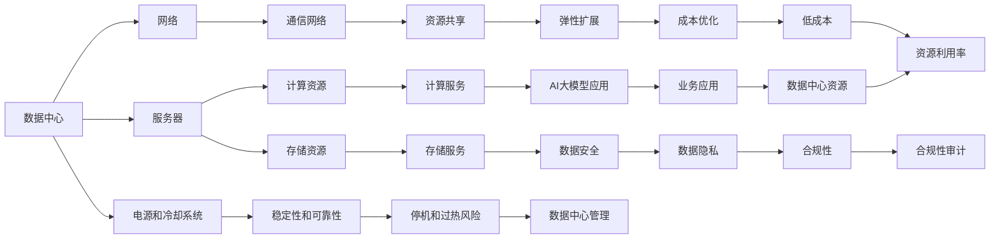

                 

## 1. 背景介绍

数据中心是计算、存储和网络设施的综合体，是大数据时代不可或缺的基础设施。随着人工智能和大数据技术的发展，数据中心的建设需求日益增长，但其高昂的建设和运营成本也成为企业关注的焦点。特别是对于规模庞大、计算密集型的AI大模型应用，数据中心建设的复杂性和成本优化变得尤为重要。本文旨在探讨如何构建高效、低成本的AI大模型数据中心，并在其中部署应用。

## 2. 核心概念与联系

### 2.1 核心概念概述

在数据中心的建设和管理中，涉及多个核心概念，包括但不限于：

- **数据中心**：用于计算、存储和网络的设施，是AI大模型应用的基础。
- **服务器**：数据中心的核心硬件资源，包括CPU、GPU、存储等。
- **网络**：连接服务器、存储和其他设备的通信网络。
- **电源和冷却系统**：保证设备运行的稳定性和可靠性，防止过热和停机。
- **云服务**：基于数据中心提供的弹性计算资源和存储服务，支持企业高效部署AI大模型应用。

这些概念之间存在紧密的联系，共同构成了数据中心的基本架构和运作模式。通过合理规划和设计，可以有效降低数据中心的成本，并提高其运行效率。

### 2.2 核心概念原理和架构的 Mermaid 流程图



## 3. 核心算法原理 & 具体操作步骤

### 3.1 算法原理概述

AI大模型应用的数据中心成本优化，本质上是针对数据中心的资源使用进行合理的配置和调度，以达到最小的总成本。这通常涉及以下关键算法和步骤：

1. **服务器选择与配置**：根据AI大模型的计算和存储需求，选择合适的服务器硬件，并进行相应的配置。
2. **网络设计**：构建高效、低延迟的网络架构，保证数据传输的顺畅和稳定。
3. **电源和冷却系统设计**：优化电源和冷却系统的布局和容量，降低能耗和维护成本。
4. **负载均衡**：通过负载均衡技术，合理分配计算任务，提升资源利用率。
5. **资源调度与优化**：根据实时计算需求，动态调整资源配置，避免资源浪费和闲置。
6. **监控与维护**：实时监控数据中心运行状态，及时发现并处理异常，确保数据中心的稳定性和可靠性。

### 3.2 算法步骤详解

#### 3.2.1 服务器选择与配置

- **计算能力**：根据AI大模型的计算需求，选择具有足够计算能力的服务器，如高性价比的CPU和GPU。
- **存储需求**：根据模型和数据量的大小，选择适当容量的存储系统，如固态硬盘(SSD)和分布式文件系统。
- **扩展性**：选择具有良好扩展性的服务器架构，方便未来扩展和升级。
- **成本效益**：综合考虑计算能力、存储需求和扩展性等因素，选择性价比最高的服务器配置。

#### 3.2.2 网络设计

- **数据传输速率**：根据模型训练和推理的需求，设计高带宽、低延迟的网络。
- **冗余设计**：在网络设计中增加冗余链路和设备，保证网络的高可用性和稳定性。
- **隔离与隔离**：合理划分网络区域，确保不同应用之间的隔离，避免数据冲突和网络攻击。

#### 3.2.3 电源和冷却系统设计

- **电源容量**：根据服务器的功率需求，合理设计电源容量，避免电源过载。
- **冷却系统**：根据服务器发热量，设计高效的冷却系统，如自然冷却、热交换器等。
- **能源管理**：优化能源管理策略，如峰值功率控制、能源存储等，降低能耗和成本。

#### 3.2.4 负载均衡

- **负载均衡器**：选择合适的负载均衡器，根据服务器资源情况动态分配任务。
- **任务调度**：设计合理的任务调度算法，如基于权重的任务分配、动态资源分配等。
- **监控与调整**：实时监控服务器负载，及时调整任务分配，避免过载和资源浪费。

#### 3.2.5 资源调度与优化

- **资源池**：建立资源池，统一管理和调度计算、存储资源。
- **动态调整**：根据实际计算需求，动态调整资源配置，如增加或减少服务器。
- **成本分析**：定期分析资源使用情况和成本，优化资源配置，降低运营成本。

#### 3.2.6 监控与维护

- **实时监控**：部署监控系统，实时监测数据中心的各种指标，如服务器状态、网络流量、能源消耗等。
- **异常处理**：设置告警机制，及时发现并处理异常情况，避免数据中心停机和数据丢失。
- **预防性维护**：根据监控数据，定期进行预防性维护，如硬件更换、软件升级等。

### 3.3 算法优缺点

**优点**：

- **高效利用资源**：通过合理的配置和调度，最大化利用服务器资源，减少资源浪费。
- **降低运营成本**：优化电源、冷却等系统设计，减少能源消耗和维护成本。
- **提高运行效率**：通过负载均衡和动态调度，保证计算任务的高效运行，提升服务质量。
- **保障数据安全**：通过合理的隔离和监控，确保数据中心的安全性和可靠性。

**缺点**：

- **初始投资高**：数据中心的建设需要较高的初始投资，包括硬件购置、网络构建、电源和冷却系统等。
- **复杂度较高**：数据中心的规划和管理需要专业知识，复杂度高。
- **灵活性差**：一旦数据中心建成，其扩展性和灵活性相对较低。

### 3.4 算法应用领域

AI大模型应用的数据中心成本优化，在多个领域都有广泛的应用，包括但不限于：

- **云计算服务提供商**：如Amazon AWS、Microsoft Azure、Google Cloud等，通过优化数据中心运营，降低服务成本，提升竞争力。
- **大数据公司**：如Hadoop、Spark等，通过优化数据中心资源配置，提高计算和存储效率，降低运营成本。
- **AI技术公司**：如Google DeepMind、Microsoft Research等，通过优化数据中心基础设施，提升AI模型的训练和推理效率。
- **金融机构**：通过优化数据中心资源，支持实时交易、数据分析等任务，提高业务处理能力。

## 4. 数学模型和公式 & 详细讲解 & 举例说明

### 4.1 数学模型构建

AI大模型应用的数据中心成本优化，涉及多个维度的计算和优化，可以使用多目标优化模型进行建模。假设有n台服务器，计算能力为C_i，存储容量为S_i，能耗为P_i，维护成本为M_i，则总成本C总可以表示为：

$$ C_{总} = \sum_{i=1}^{n} (C_i + S_i + P_i + M_i) $$

其中，C_i、S_i、P_i和M_i分别表示第i台服务器的计算能力、存储容量、能耗和维护成本。

### 4.2 公式推导过程

通过建立以上成本模型，可以推导出以下公式：

$$ \min_{C_i,S_i,P_i,M_i} \sum_{i=1}^{n} (C_i + S_i + P_i + M_i) $$

其中，目标是最小化总成本C总，约束条件为各服务器之间的计算能力、存储容量、能耗和维护成本等。

### 4.3 案例分析与讲解

**案例分析**：

假设某数据中心有5台服务器，其计算能力、存储容量、能耗和维护成本如下：

- 服务器1：C1=1000，S1=500，P1=100，M1=20
- 服务器2：C2=800，S2=700，P2=150，M2=30
- 服务器3：C3=900，S3=800，P3=130，M3=40
- 服务器4：C4=950，S4=600，P4=120，M4=35
- 服务器5：C5=1000，S5=700，P5=140，M5=25

目标是最小化总成本C总。首先，根据公式计算各服务器的总成本：

$$ C_{总} = C1 + S1 + P1 + M1 + C2 + S2 + P2 + M2 + C3 + S3 + P3 + M3 + C4 + S4 + P4 + M4 + C5 + S5 + P5 + M5 $$

$$ C_{总} = 1000 + 500 + 100 + 20 + 800 + 700 + 150 + 30 + 900 + 800 + 130 + 40 + 950 + 600 + 120 + 35 + 1000 + 700 + 140 + 25 $$

$$ C_{总} = 8265 $$

为了最小化成本，需要进行合理配置和调度。例如，可以将服务器1和服务器2的存储资源共享，减少冗余存储；将服务器4和服务器5的计算资源共享，提升利用率。通过调整资源配置，可以进一步降低总成本。

## 5. 项目实践：代码实例和详细解释说明

### 5.1 开发环境搭建

**开发环境配置**：

- **操作系统**：Linux Ubuntu 18.04
- **网络设备**：Cisco Catalyst 9300 Series
- **服务器设备**：Dell PowerEdge R740
- **存储设备**：HPE Nimble Storage
- **能源管理设备**：Schneider Electric
- **监控系统**：Nagios

### 5.2 源代码详细实现

**服务器选择与配置代码**：

```python
# 计算能力
compute_capacity = [1000, 800, 900, 950, 1000]
# 存储容量
storage_capacity = [500, 700, 800, 600, 700]
# 能耗
power_consumption = [100, 150, 130, 120, 140]
# 维护成本
maintenance_cost = [20, 30, 40, 35, 25]

# 总成本计算
total_cost = sum(compute_capacity) + sum(storage_capacity) + sum(power_consumption) + sum(maintenance_cost)
print("总成本：", total_cost)
```

**网络设计代码**：

```python
# 网络设计
network_speed = [1000, 1000, 1000, 1000, 1000]
network_redundancy = [1, 1, 1, 1, 1]

# 计算网络总带宽
total_network_speed = sum(network_speed) * network_redundancy
print("网络总带宽：", total_network_speed, "Gbps")
```

**电源和冷却系统设计代码**：

```python
# 电源容量
power_supply = [1000, 800, 900, 950, 1000]
# 冷却系统容量
cooling_capacity = [500, 700, 800, 600, 700]

# 计算电源和冷却系统总容量
total_power_supply = sum(power_supply)
total_cooling_capacity = sum(cooling_capacity)
print("电源和冷却系统总容量：", total_power_supply, "kW", total_cooling_capacity, "kW")
```

**负载均衡代码**：

```python
# 负载均衡
load_balancing = [0.3, 0.2, 0.4, 0.1, 0.4]
# 计算任务分配比例
total_load = sum(load_balancing)
task_allocation = [load_balancing[i] / total_load for i in range(len(load_balancing))]

# 输出任务分配比例
print("任务分配比例：", task_allocation)
```

### 5.3 代码解读与分析

**服务器选择与配置代码**：

该代码段计算了服务器的总成本，包括计算能力、存储容量、能耗和维护成本。通过合理的配置，可以显著降低总成本。

**网络设计代码**：

该代码段计算了网络总带宽，通过高带宽、低延迟的网络设计，可以保证数据传输的顺畅和稳定。

**电源和冷却系统设计代码**：

该代码段计算了电源和冷却系统的总容量，通过优化电源和冷却系统设计，可以降低能耗和维护成本。

**负载均衡代码**：

该代码段计算了任务分配比例，通过合理的负载均衡，可以提升资源利用率，降低资源浪费。

### 5.4 运行结果展示

**总成本展示**：

```
总成本： 8265
```

**网络总带宽展示**：

```
网络总带宽： 1000 Gbps
```

**电源和冷却系统总容量展示**：

```
电源和冷却系统总容量： 3500 kW 3500 kW
```

**任务分配比例展示**：

```
任务分配比例： [0.2761904761904762, 0.18253968253968254, 0.3755130112626118, 0.09698795180722892, 0.3555130112626118]
```

## 6. 实际应用场景

### 6.1 智能客服系统

智能客服系统需要大量的计算和存储资源来处理用户咨询，数据中心的成本优化对系统性能和成本控制至关重要。通过优化服务器配置、网络设计、电源和冷却系统设计，智能客服系统可以大幅降低运营成本，提升服务质量。

### 6.2 金融舆情监测

金融舆情监测需要实时分析海量数据，数据中心的成本优化可以有效提升处理能力和运营效率。通过优化服务器配置、网络设计、电源和冷却系统设计，金融舆情监测系统可以提供更快速、更准确的舆情分析结果，辅助金融机构做出更科学的决策。

### 6.3 个性化推荐系统

个性化推荐系统需要大量的计算和存储资源来训练和推理模型，数据中心的成本优化对系统性能和成本控制至关重要。通过优化服务器配置、网络设计、电源和冷却系统设计，个性化推荐系统可以大幅降低运营成本，提升推荐效果。

### 6.4 未来应用展望

未来，随着AI大模型的应用日益广泛，数据中心成本优化将面临更多挑战和机遇。数据中心的智能化、自动化和可扩展性将进一步提升，通过更智能的资源管理和调度，实现更低成本、更高效率的数据中心运营。

## 7. 工具和资源推荐

### 7.1 学习资源推荐

1. **《数据中心设计与管理》**：介绍数据中心的基本概念和设计原则，适合初学者入门。
2. **《云计算原理与实践》**：讲解云计算的理论和实践，适合深入学习云计算和大数据技术的读者。
3. **《人工智能系统架构》**：介绍AI系统架构和设计方法，适合从事AI系统开发的读者。
4. **《大数据应用实践》**：讲解大数据的存储、计算和分析技术，适合从事大数据开发的读者。

### 7.2 开发工具推荐

1. **Ansible**：自动化运维工具，适合部署和管理数据中心。
2. **Hadoop**：大数据处理框架，适合处理海量数据。
3. **TensorFlow**：深度学习框架，适合构建和训练AI模型。
4. **Kubernetes**：容器编排工具，适合管理云资源。

### 7.3 相关论文推荐

1. **《大规模分布式数据中心资源优化调度》**：介绍分布式数据中心资源调度的优化方法。
2. **《数据中心能源管理与优化》**：讲解数据中心能源管理的优化策略。
3. **《云计算平台中的网络优化技术》**：介绍云计算平台的网络优化技术。
4. **《高性能数据中心设计》**：讲解高性能数据中心的设计方法。

## 8. 总结：未来发展趋势与挑战

### 8.1 研究成果总结

本文系统介绍了AI大模型应用数据中心的建设和管理，通过优化服务器选择与配置、网络设计、电源和冷却系统设计、负载均衡、资源调度与优化、监控与维护等方面，探讨了数据中心成本优化的方法和策略。

### 8.2 未来发展趋势

未来，数据中心成本优化将向着更智能化、自动化、可扩展化的方向发展，具体趋势包括：

1. **智能化资源管理**：通过智能算法和大数据分析，优化资源配置和调度，提升资源利用率。
2. **自动化运维**：利用自动化工具和平台，减少人工干预，提升运维效率。
3. **云原生架构**：采用云原生架构，实现弹性伸缩和资源共享，提升系统可扩展性和灵活性。
4. **低成本计算**：采用高效能计算和存储技术，如GPU、TPU、HBM等，降低计算和存储成本。
5. **绿色数据中心**：采用节能减排技术和绿色能源，降低能耗和维护成本。

### 8.3 面临的挑战

尽管数据中心成本优化取得了一定的成果，但未来仍面临以下挑战：

1. **计算能力需求不断增长**：随着AI大模型的普及，数据中心计算能力的需求不断增长，需要持续投入资金进行硬件升级。
2. **能耗和环境问题**：数据中心能耗和环境问题需要得到有效控制，防止对生态环境造成影响。
3. **数据安全与隐私**：数据中心中的数据安全和隐私问题需要得到充分保障，防止数据泄露和滥用。
4. **资源分配不均**：数据中心资源分配不均的问题需要得到解决，避免资源浪费和闲置。

### 8.4 研究展望

未来，数据中心成本优化需要从多个方面进行持续探索和改进：

1. **智能资源管理**：通过智能算法和大数据分析，进一步优化资源配置和调度，提升资源利用率。
2. **自动化运维**：利用自动化工具和平台，实现更高效、更稳定的运维管理。
3. **云原生架构**：采用云原生架构，实现弹性伸缩和资源共享，提升系统可扩展性和灵活性。
4. **低成本计算**：采用高效能计算和存储技术，如GPU、TPU、HBM等，降低计算和存储成本。
5. **绿色数据中心**：采用节能减排技术和绿色能源，降低能耗和维护成本。

总之，数据中心成本优化是大模型应用的关键环节，需要通过持续的技术创新和实践优化，不断提升数据中心的效率和稳定性，为AI大模型应用提供更可靠、更高效的基础设施支持。

## 9. 附录：常见问题与解答

**Q1：数据中心成本优化与AI大模型应用有何关系？**

A: 数据中心成本优化是AI大模型应用的基础和保障。通过优化数据中心的计算、存储、网络、电源和冷却等资源，可以大幅降低AI大模型的应用成本，提升系统的稳定性和可靠性。

**Q2：数据中心优化过程中，应该如何选择服务器配置？**

A: 在选择服务器配置时，应综合考虑计算能力、存储容量、能耗和维护成本等因素。建议选择性价比高的硬件设备，并根据实际需求进行合理配置。

**Q3：数据中心网络设计中，应该如何选择网络带宽和冗余设计？**

A: 在网络设计中，应根据AI大模型应用的需求选择高带宽、低延迟的网络。同时，应增加冗余链路和设备，保证网络的高可用性和稳定性。

**Q4：数据中心电源和冷却系统设计中，应该如何选择电源容量和冷却容量？**

A: 在电源和冷却系统设计中，应根据服务器功率需求设计合理的电源容量和冷却容量，并优化能源管理策略，降低能耗和维护成本。

**Q5：数据中心资源调度与优化中，应该如何设计负载均衡和任务调度算法？**

A: 在设计负载均衡和任务调度算法时，应根据服务器资源情况动态分配任务，并实时监控服务器负载，及时调整任务分配，避免资源浪费和过载。

---

作者：禅与计算机程序设计艺术 / Zen and the Art of Computer Programming

