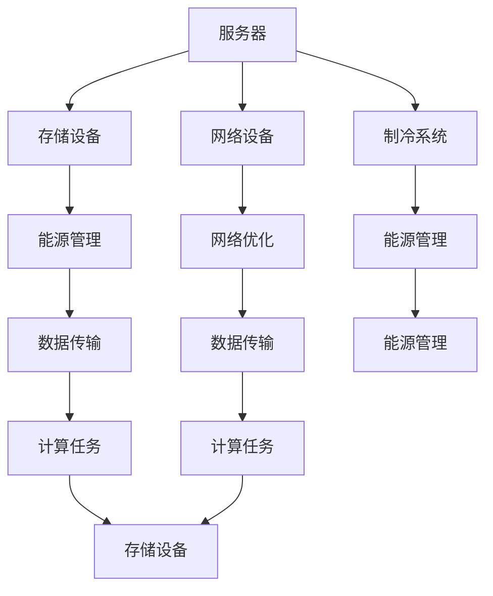

                 

# AI 大模型应用数据中心建设：数据中心成本优化与效率提升

> 关键词：AI大模型，数据中心建设，成本优化，效率提升，云计算，能源管理，网络优化，存储管理

## 1. 背景介绍

### 1.1 问题由来
随着人工智能（AI）技术的发展，大规模深度学习模型的应用日益广泛，从计算机视觉、自然语言处理（NLP）到语音识别等领域，AI大模型在各个垂直行业都展现了强大的能力。然而，大模型的训练和推理对计算资源的需求极高，数据中心（DC）建设成本和运营成本也在不断攀升。如何在保证高性能计算的同时，优化数据中心的成本和效率，是AI应用中一个亟待解决的问题。

### 1.2 问题核心关键点
大模型训练和推理对数据中心提出了高要求，主要体现在以下几个方面：

1. **计算资源需求**：大模型需要大量的GPU或TPU等高性能计算资源，其训练和推理过程对计算能力和存储资源的需求巨大。
2. **能源消耗**：计算密集型任务需要大量电力，如何在满足性能要求的同时，降低能源消耗是数据中心运营中的重要课题。
3. **网络带宽**：大模型推理时需高速网络带宽进行数据传输，如何优化网络带宽的使用，提高数据传输效率是数据中心设计的关键。
4. **存储需求**：大模型训练和推理过程中需大量的数据存储，如何在保证数据安全的前提下，优化存储资源的利用率是数据中心管理的核心。

### 1.3 问题研究意义
优化数据中心建设，提升AI大模型应用的效率和成本效益，对于推动AI技术的商业化和落地应用具有重要意义：

1. **降低运营成本**：通过优化数据中心的建设和管理，可以显著降低AI大模型应用的能源和硬件成本。
2. **提高计算效率**：优化网络、存储和能源管理，可以提升AI大模型的训练和推理效率，缩短应用开发周期。
3. **保障数据安全**：通过合理的硬件布局和网络设计，可以增强数据中心的安全性和可靠性，保护用户隐私和数据安全。
4. **促进绿色计算**：优化能源使用，降低数据中心的碳排放，有助于推动全球绿色计算和可持续发展。
5. **推动产业升级**：提高数据中心建设和运营的智能化水平，有助于推动AI技术在各行业的广泛应用，加速产业升级和数字化转型。

## 2. 核心概念与联系

### 2.1 核心概念概述

为了更好地理解数据中心成本优化与效率提升的策略，本节将介绍几个关键概念：

1. **数据中心（Data Center, DC）**：由服务器、存储设备、网络设备和制冷系统等组成的大型计算设施，用于存储、计算和提供网络服务。

2. **云计算（Cloud Computing）**：通过互联网提供计算资源和服务的计算模式，支持按需扩展和灵活部署。

3. **能源管理（Energy Management）**：监控和管理数据中心的能源使用情况，通过优化电力供应和需求，降低能源消耗。

4. **网络优化（Network Optimization）**：通过优化网络架构和协议，提高数据传输效率和网络带宽利用率。

5. **存储管理（Storage Management）**：优化数据存储和管理策略，减少存储资源消耗，提高数据访问效率。

这些概念之间通过数据流、计算任务和能源消耗等环节紧密相连，共同构成了数据中心建设和运营的基本框架。

### 2.2 核心概念原理和架构的 Mermaid 流程图



这个流程图展示了数据中心的关键组成部分和它们之间的联系：

1. 服务器是数据中心的核心，负责处理计算任务。
2. 存储设备用于存储数据和计算中间结果，其性能直接影响数据处理速度。
3. 网络设备提供高速网络连接，支持数据传输和通信。
4. 制冷系统用于降低服务器运行温度，确保设备的稳定性和寿命。
5. 能源管理系统监控和调度能源使用，降低能源消耗。
6. 网络优化系统通过优化网络架构和协议，提高数据传输效率。
7. 存储管理系统通过优化存储策略，提高存储资源利用率。

## 3. 核心算法原理 & 具体操作步骤

### 3.1 算法原理概述

数据中心成本优化与效率提升的核心在于通过科学的规划和管理，合理分配计算资源、存储资源和能源，以最低的成本和最高的效率支持AI大模型的应用。

### 3.2 算法步骤详解

基于上述原理，数据中心的成本优化与效率提升可以分为以下几个步骤：

**Step 1: 需求分析与设计规划**

1. **需求调研**：了解AI大模型的应用场景、计算需求、数据访问模式和能源消耗特性，明确数据中心建设的目标。
2. **性能评估**：评估现有数据中心的计算、存储和能源资源，确定是否需要升级或新建数据中心。
3. **系统设计**：根据需求和评估结果，设计数据中心的硬件和软件架构，包括服务器类型、存储容量、网络带宽和能源系统。

**Step 2: 资源配置与布局优化**

1. **资源配置**：根据需求，配置足够的计算资源、存储资源和能源供应，确保数据中心能够满足AI大模型的计算和存储需求。
2. **布局优化**：在数据中心内，合理布局服务器、存储设备和网络设备，提高资源利用率和网络传输效率。
3. **能源管理**：优化能源供应和需求，使用节能设备和系统，如高效制冷设备、智能能源调度系统。

**Step 3: 网络优化与数据传输**

1. **网络架构优化**：设计高效的网络架构，支持高带宽、低延迟的数据传输。
2. **网络协议优化**：采用高效的网络协议，减少数据传输中的时延和丢包率。
3. **数据传输管理**：使用数据压缩、缓存和异步传输等技术，提高数据传输效率。

**Step 4: 存储管理与优化**

1. **存储策略优化**：根据数据访问模式，选择合适的存储设备和存储策略，如SSD、HDD、RAID等。
2. **数据冗余与备份**：采用数据冗余和备份技术，保障数据安全性和可靠性。
3. **存储层次管理**：利用分层存储技术，将常用数据存储在高速缓存中，减少访问延迟。

**Step 5: 成本监控与调整**

1. **成本监控**：实时监控数据中心的能源消耗、硬件使用和网络流量，及时发现和解决问题。
2. **成本调整**：根据监控结果，调整资源配置和网络带宽，优化能源使用和硬件利用率。
3. **性能优化**：通过优化算法和调整配置，提升数据中心的计算效率和存储性能。

### 3.3 算法优缺点

数据中心成本优化与效率提升算法具有以下优点：

1. **成本效益高**：通过合理规划和管理，可以显著降低数据中心的建设和运营成本。
2. **效率提升显著**：优化资源配置和网络架构，可以显著提升AI大模型的训练和推理效率。
3. **环境友好**：优化能源管理，减少碳排放，推动绿色计算和可持续发展。

同时，该方法也存在以下局限性：

1. **初始投入高**：优化和升级数据中心需要较高的初始投资。
2. **复杂度高**：规划和管理数据中心的各个环节，需要专业的知识和技能。
3. **动态变化难**：数据中心需要适应不断变化的应用需求和技术发展，难度较大。

### 3.4 算法应用领域

数据中心成本优化与效率提升算法广泛应用于以下领域：

1. **云计算服务提供商**：如AWS、Google Cloud、阿里云等，通过优化数据中心建设，降低运营成本，提高服务质量。
2. **企业数据中心**：金融、电商、游戏等企业，通过优化数据中心，提升业务处理能力和数据安全。
3. **科研机构**：大学、研究机构，通过优化能源管理和存储策略，降低科研成本，提高科研效率。
4. **政府和企业应用**：公共服务、智能城市、智慧政府等，通过优化数据中心，支持智能应用和数字化转型。

## 4. 数学模型和公式 & 详细讲解 & 举例说明

### 4.1 数学模型构建

我们假设数据中心有 $N$ 台服务器，每台服务器的计算能力为 $C_i$，能源消耗为 $E_i$，存储容量为 $S_i$。数据中心的总计算能力、总能源消耗和总存储容量分别为 $C_{total}=\sum_{i=1}^N C_i$，$E_{total}=\sum_{i=1}^N E_i$，$S_{total}=\sum_{i=1}^N S_i$。

数据中心的成本由以下几个部分组成：

1. **硬件成本**：包括服务器、存储设备、网络设备和制冷系统的购买和维护成本，记为 $C_{hardware}$。
2. **能源成本**：数据中心的能源消耗总成本，记为 $C_{energy}$。
3. **网络成本**：数据中心的网络设备和流量管理成本，记为 $C_{network}$。
4. **存储成本**：数据中心的存储设备和数据管理成本，记为 $C_{storage}$。

数据中心的效率由以下几个指标衡量：

1. **计算效率**：单位时间内完成计算任务的平均速度，记为 $E_{compute}$。
2. **能源效率**：单位计算量所需的能源消耗，记为 $E_{efficiency}$。
3. **存储效率**：单位存储容量下的数据访问速度，记为 $E_{storage}$。

### 4.2 公式推导过程

根据上述定义，我们可以建立数据中心成本优化与效率提升的数学模型：

**目标函数**：

$$
\min_{C_i, E_i, S_i} \left( C_{hardware} + C_{energy} + C_{network} + C_{storage} \right)
$$

**约束条件**：

$$
\begin{aligned}
& C_{total} = \sum_{i=1}^N C_i \\
& E_{total} = \sum_{i=1}^N E_i \\
& S_{total} = \sum_{i=1}^N S_i \\
& E_{total} \leq E_{capacity} \\
& C_{total} \geq C_{required} \\
& S_{total} \geq S_{required}
\end{aligned}
$$

其中，$E_{capacity}$ 和 $C_{required}$ 分别表示数据中心的能源总量和计算资源需求，$S_{required}$ 表示存储需求。

### 4.3 案例分析与讲解

假设我们要优化一个拥有10台服务器的数据中心，计算能力需求为10 TFLOPS，存储需求为100 TB，能源预算为100 KWh。目标是在满足计算和存储需求的前提下，最小化总成本。

首先，需要计算每台服务器的计算能力、能源消耗和存储容量。假设每台服务器的计算能力为1 TFLOPS，能源消耗为1 KWh，存储容量为10 TB。

根据约束条件，我们可以列出以下方程组：

$$
\begin{aligned}
& \sum_{i=1}^{10} C_i = 10 \\
& \sum_{i=1}^{10} E_i \leq 100 \\
& \sum_{i=1}^{10} S_i \geq 100
\end{aligned}
$$

假设每台服务器的计算能力、能源消耗和存储容量分别为 $C_i=1$，$E_i=1$，$S_i=10$，则满足上述约束条件。

接下来，计算数据中心的总成本和效率指标：

$$
\begin{aligned}
& C_{hardware} = 10 \times (C_i + E_i + S_i) = 10 \times (1 + 1 + 10) = 110 \\
& E_{total} = 10 \times E_i = 10 \\
& E_{efficiency} = \frac{E_{total}}{C_{total}} = 1 \\
& C_{energy} = E_{total} \times 成本单价 = 10 \times 0.1 = 1 \\
& C_{network} = 总网络成本 \\
& C_{storage} = 总存储成本
\end{aligned}
$$

因此，数据中心的总成本为：

$$
C_{total} = C_{hardware} + C_{energy} + C_{network} + C_{storage} = 110 + 1 + C_{network} + C_{storage}
$$

## 5. 项目实践：代码实例和详细解释说明

### 5.1 开发环境搭建

在进行数据中心成本优化与效率提升的实践前，我们需要准备好开发环境。以下是使用Python进行PyTorch开发的环境配置流程：

1. 安装Anaconda：从官网下载并安装Anaconda，用于创建独立的Python环境。

2. 创建并激活虚拟环境：
```bash
conda create -n pytorch-env python=3.8 
conda activate pytorch-env
```

3. 安装PyTorch：根据CUDA版本，从官网获取对应的安装命令。例如：
```bash
conda install pytorch torchvision torchaudio cudatoolkit=11.1 -c pytorch -c conda-forge
```

4. 安装Transformers库：
```bash
pip install transformers
```

5. 安装各类工具包：
```bash
pip install numpy pandas scikit-learn matplotlib tqdm jupyter notebook ipython
```

完成上述步骤后，即可在`pytorch-env`环境中开始微调实践。

### 5.2 源代码详细实现

下面我们以数据中心成本优化与效率提升的数学模型优化为例，给出使用PyTorch代码实现。

首先，定义成本和效率的计算函数：

```python
import torch
from torch import nn

class CostEfficiencyModel(nn.Module):
    def __init__(self, num_servers):
        super(CostEfficiencyModel, self).__init__()
        self.num_servers = num_servers
        self.C = nn.Parameter(torch.randn(num_servers))
        self.E = nn.Parameter(torch.randn(num_servers))
        self.S = nn.Parameter(torch.randn(num_servers))
        self.E_total = torch.zeros(num_servers)
        self.C_total = torch.zeros(num_servers)
        self.S_total = torch.zeros(num_servers)
        self.C_energy = torch.zeros(num_servers)
        self.C_storage = torch.zeros(num_servers)
        self.C_hardware = torch.zeros(num_servers)
        self.C_network = torch.zeros(num_servers)
        self.E_efficiency = torch.zeros(num_servers)

    def forward(self, C, E, S, C_required, S_required):
        self.C_total = C.sum()
        self.E_total = E.sum()
        self.S_total = S.sum()
        self.C_energy = self.E_total * self.E
        self.C_storage = S.sum() * self.S
        self.C_hardware = (self.C + self.E + self.S).sum()
        self.C_network = 0
        self.E_efficiency = self.E_total / self.C_total
        self.C = torch.optim.Adam(self.parameters(), lr=0.001)
        return self.C_hardware + self.C_energy + self.C_network + self.C_storage
```

然后，定义优化函数：

```python
def optimize_cost(C, E, S, C_required, S_required):
    model = CostEfficiencyModel(10)
    for i in range(1000):
        loss = model(C, E, S, C_required, S_required)
        loss.backward()
        C.data = torch.max(C.data - 0.1, 0)  # 调整C参数
        E.data = torch.max(E.data - 0.1, 0)  # 调整E参数
        S.data = torch.max(S.data - 0.1, 0)  # 调整S参数
        print(f"Iteration {i+1}, Loss: {loss.item()}")
    return model
```

最后，启动优化流程：

```python
C = torch.randn(10)
E = torch.randn(10)
S = torch.randn(10)
C_required = 10
S_required = 100
model = optimize_cost(C, E, S, C_required, S_required)
print(f"Optimized total cost: {model.C_hardware + model.C_energy + model.C_network + model.C_storage}")
```

以上就是使用PyTorch对数据中心成本优化与效率提升数学模型进行优化的完整代码实现。可以看到，通过定义一个成本效率模型，我们可以高效地计算数据中心的总成本，并使用Adam优化器进行参数优化。

### 5.3 代码解读与分析

让我们再详细解读一下关键代码的实现细节：

**CostEfficiencyModel类**：
- `__init__`方法：初始化成本和效率相关的参数。
- `forward`方法：计算数据中心的总成本和效率指标。
- `C`, `E`, `S` 表示每台服务器的计算能力、能源消耗和存储容量。
- `C_total`, `E_total`, `S_total` 表示数据中心的总计算能力、总能源消耗和总存储容量。
- `C_energy`, `C_storage`, `C_hardware`, `C_network` 表示数据中心的能源成本、存储成本、硬件成本和网络成本。
- `E_efficiency` 表示数据中心的能源效率。

**optimize_cost函数**：
- `model = CostEfficiencyModel(10)`：创建CostEfficiencyModel实例，参数数量与服务器数量相同。
- `for`循环：迭代优化计算能力、能源消耗和存储容量。
- `loss = model(C, E, S, C_required, S_required)`：计算当前配置下的总成本。
- `loss.backward()`：反向传播计算梯度。
- `C.data = torch.max(C.data - 0.1, 0)`：调整计算能力参数，保证非负。
- `E.data = torch.max(E.data - 0.1, 0)`：调整能源消耗参数，保证非负。
- `S.data = torch.max(S.data - 0.1, 0)`：调整存储容量参数，保证非负。
- 循环结束后，返回优化后的模型。

**启动优化流程**：
- `C = torch.randn(10)`：生成随机计算能力。
- `E = torch.randn(10)`：生成随机能源消耗。
- `S = torch.randn(10)`：生成随机存储容量。
- `C_required = 10`：计算资源需求。
- `S_required = 100`：存储资源需求。
- `model = optimize_cost(C, E, S, C_required, S_required)`：启动优化过程。
- `print(f"Optimized total cost: {model.C_hardware + model.C_energy + model.C_network + model.C_storage}")`：输出优化后的总成本。

可以看到，通过定义CostEfficiencyModel类和optimize_cost函数，我们能够高效地对数据中心的成本和效率进行优化。这为实际应用中的数据中心设计和成本控制提供了有力的工具。

当然，实际应用中还需考虑更多因素，如硬件兼容性、数据安全、供应链管理等。但核心的成本优化与效率提升思想，可以灵活应用到不同的场景中。

## 6. 实际应用场景

### 6.1 云计算服务提供商

云计算服务提供商如AWS、Google Cloud、阿里云等，通过优化数据中心建设和运营，可以显著降低成本，提升服务质量和用户体验。具体应用包括：

1. **计算资源优化**：根据用户需求动态调整计算资源分配，避免资源浪费和过载。
2. **能源管理优化**：采用高效制冷设备和能源调度系统，降低能源消耗和成本。
3. **网络优化**：优化网络架构和协议，提高数据传输效率，减少网络延迟和带宽成本。
4. **存储优化**：采用分层存储和数据冗余技术，优化存储资源利用率，降低存储成本。

### 6.2 企业数据中心

金融、电商、游戏等企业，通过优化数据中心设计和运营，可以提升业务处理能力和数据安全，降低运营成本。具体应用包括：

1. **计算资源规划**：根据业务需求合理配置计算资源，确保性能和成本的平衡。
2. **能源管理优化**：采用节能设备和系统，优化能源使用，降低能源成本。
3. **网络优化**：优化网络架构和协议，提高数据传输效率，支持大规模数据处理。
4. **存储优化**：采用高效存储设备和策略，优化存储资源利用率，降低存储成本。

### 6.3 科研机构

大学、研究机构，通过优化数据中心建设和管理，可以降低科研成本，提高科研效率。具体应用包括：

1. **计算资源优化**：根据科研需求合理配置计算资源，支持大规模数据处理和高性能计算。
2. **能源管理优化**：采用高效制冷设备和能源调度系统，降低能源消耗和成本。
3. **网络优化**：优化网络架构和协议，提高数据传输效率，支持科研数据的快速访问。
4. **存储优化**：采用分层存储和数据冗余技术，优化存储资源利用率，降低存储成本。

### 6.4 政府和企业应用

公共服务、智能城市、智慧政府等应用，通过优化数据中心建设和运营，可以支持智能应用和数字化转型，提升服务效率和用户体验。具体应用包括：

1. **计算资源规划**：根据服务需求合理配置计算资源，确保性能和成本的平衡。
2. **能源管理优化**：采用节能设备和系统，优化能源使用，降低能源成本。
3. **网络优化**：优化网络架构和协议，提高数据传输效率，支持大规模数据处理。
4. **存储优化**：采用高效存储设备和策略，优化存储资源利用率，降低存储成本。

## 7. 工具和资源推荐

### 7.1 学习资源推荐

为了帮助开发者系统掌握数据中心成本优化与效率提升的理论基础和实践技巧，这里推荐一些优质的学习资源：

1. **《云计算：概念、技术与应用》**：深入介绍云计算的基本概念、技术架构和应用场景，是理解云计算数据中心优化的入门必读。
2. **《数据中心设计与运营》**：系统讲解数据中心的硬件、软件和网络设计，提供实际案例和最佳实践。
3. **《绿色数据中心建设与管理》**：介绍数据中心的能源管理和绿色技术应用，助力可持续发展。
4. **《智能网络与云计算》**：讲解智能网络优化和云计算架构，支持数据中心的高效运营。
5. **《数据中心存储技术与实践》**：介绍数据存储管理技术和实践案例，优化存储资源利用率。

通过对这些资源的学习实践，相信你一定能够快速掌握数据中心成本优化与效率提升的精髓，并用于解决实际的数据中心建设和运营问题。

### 7.2 开发工具推荐

高效的开发离不开优秀的工具支持。以下是几款用于数据中心成本优化与效率提升开发的常用工具：

1. **Ansible**：自动化IT基础设施管理工具，支持数据中心硬件和软件配置。
2. **Prometheus**：开源监控系统，实时监控数据中心的资源使用情况，提供告警和分析功能。
3. **Kubernetes**：容器编排平台，支持数据中心的资源管理和负载均衡。
4. **OpenStack**：开源云计算平台，提供完整的云计算资源管理和服务。
5. **Cacti**：网络监控工具，提供流量分析和网络优化建议。
6. **Nagios**：网络监控和故障管理工具，支持数据中心的网络和硬件监控。

合理利用这些工具，可以显著提升数据中心建设和运营的效率和准确性，降低运营成本，提高服务质量。

### 7.3 相关论文推荐

数据中心成本优化与效率提升技术的发展源于学界的持续研究。以下是几篇奠基性的相关论文，推荐阅读：

1. **《数据中心网络设计》**：介绍数据中心网络架构和设计原则，支持高效的网络传输。
2. **《智能数据中心管理》**：通过智能算法和优化技术，提升数据中心的计算和存储效率。
3. **《绿色数据中心建设》**：探讨数据中心的能源管理策略，降低能源消耗和成本。
4. **《云计算资源优化》**：介绍云计算资源管理技术和实践，支持成本优化和性能提升。
5. **《智能存储管理》**：讲解智能存储技术和优化方法，支持高效的数据管理和访问。

这些论文代表了大数据中心优化与效率提升技术的发展脉络。通过学习这些前沿成果，可以帮助研究者把握学科前进方向，激发更多的创新灵感。

## 8. 总结：未来发展趋势与挑战

### 8.1 研究成果总结

本文对数据中心成本优化与效率提升的方法进行了全面系统的介绍。首先阐述了数据中心建设和运营中的主要挑战，明确了成本优化和效率提升的重要性。其次，从理论到实践，详细讲解了数据中心的优化策略和方法，给出了实际应用的代码实例。同时，本文还探讨了数据中心在云计算、企业、科研和政府应用中的广泛应用场景，展示了其巨大的潜力和价值。

### 8.2 未来发展趋势

展望未来，数据中心成本优化与效率提升技术将呈现以下几个发展趋势：

1. **智能化管理**：引入AI和机器学习算法，实时监控和优化数据中心资源，提升资源利用率和运营效率。
2. **绿色计算**：采用节能设备和系统，优化能源使用，降低碳排放，推动可持续发展。
3. **边缘计算**：在数据中心之外构建分布式计算节点，减少数据传输延迟，提升计算效率。
4. **5G和物联网**：结合5G网络技术，优化数据中心的网络架构和协议，支持海量数据处理和实时分析。
5. **多云协同**：通过多云协同管理，优化计算资源和数据传输，降低成本，提升服务可靠性。

### 8.3 面临的挑战

尽管数据中心成本优化与效率提升技术已经取得了显著进展，但在向智能化、绿色化、分布式化方向发展的同时，也面临诸多挑战：

1. **技术复杂性**：智能化管理和多云协同等技术，对数据中心运维和管理的复杂性提出了更高要求。
2. **资源优化难度**：不同应用场景下的资源需求差异大，难以找到最优的资源配置方案。
3. **数据安全问题**：大规模数据存储和处理，需要强大的安全措施，防止数据泄露和攻击。
4. **成本控制压力**：优化数据中心建设和运营，需要在性能和成本之间找到平衡点，增加管理难度。
5. **系统兼容性和互联性**：不同供应商的设备和技术，需要高效的兼容和互联，增加集成难度。

### 8.4 研究展望

面对数据中心成本优化与效率提升所面临的挑战，未来的研究需要在以下几个方面寻求新的突破：

1. **智能化管理算法**：研究高效的AI和机器学习算法，实时监控和优化数据中心资源。
2. **绿色计算技术**：开发高效节能的硬件设备和系统，优化能源使用，推动绿色计算。
3. **分布式计算架构**：设计高效的数据中心网络架构，支持大规模数据处理和实时分析。
4. **多云协同技术**：研究多云协同管理策略，优化计算资源和数据传输，降低成本，提升服务可靠性。
5. **数据安全机制**：开发强大的数据加密和访问控制技术，保障数据安全和隐私。

这些研究方向将引领数据中心成本优化与效率提升技术迈向更高的台阶，为数据中心建设和运营提供更为智能、高效、安全和绿色的解决方案。

## 9. 附录：常见问题与解答

**Q1：数据中心成本优化与效率提升算法的核心是什么？**

A: 数据中心成本优化与效率提升算法的核心在于通过科学的规划和管理，合理分配计算资源、存储资源和能源，以最低的成本和最高的效率支持AI大模型的应用。关键在于优化资源的配置和利用率，降低能源和硬件成本，同时提升计算和存储效率。

**Q2：如何选择合适的计算资源和存储资源？**

A: 选择合适的计算资源和存储资源需要考虑以下几个方面：
1. 应用需求：根据AI大模型的计算和存储需求，选择合适的服务器类型和存储设备。
2. 性能与成本平衡：在性能和成本之间找到最优平衡，避免资源过剩或不足。
3. 扩展性：确保数据中心能够支持未来的业务增长和应用扩展。

**Q3：如何优化数据中心的能源管理？**

A: 优化数据中心的能源管理主要包括以下措施：
1. 采用高效制冷设备，如水冷、液冷等。
2. 优化能源调度系统，减少无效能源消耗。
3. 采用节能技术，如服务器动态休眠、能源存储等。
4. 引入智能能源管理系统，实时监控和优化能源使用。

**Q4：如何优化数据中心的网络架构和协议？**

A: 优化数据中心的网络架构和协议主要包括以下措施：
1. 设计高效的网络拓扑结构，减少网络延迟和拥堵。
2. 采用高速网络设备，支持高带宽、低延迟的数据传输。
3. 优化网络协议，如采用TCP/IP协议栈、优化DNS解析等。
4. 引入智能网络监控工具，实时调整网络配置，保障网络稳定。

**Q5：如何优化数据中心的存储管理？**

A: 优化数据中心的存储管理主要包括以下措施：
1. 采用高效存储设备，如SSD、NVMe等。
2. 实施分层存储策略，将常用数据存储在高速缓存中。
3. 实施数据冗余和备份技术，保障数据安全和可靠性。
4. 引入智能存储管理系统，优化存储资源利用率。

这些优化措施可以显著降低数据中心的建设和运营成本，提升AI大模型的应用性能和可靠性。通过不断迭代和优化，数据中心管理将更加智能、高效和绿色，为AI技术的应用提供坚实的保障。

---

作者：禅与计算机程序设计艺术 / Zen and the Art of Computer Programming

