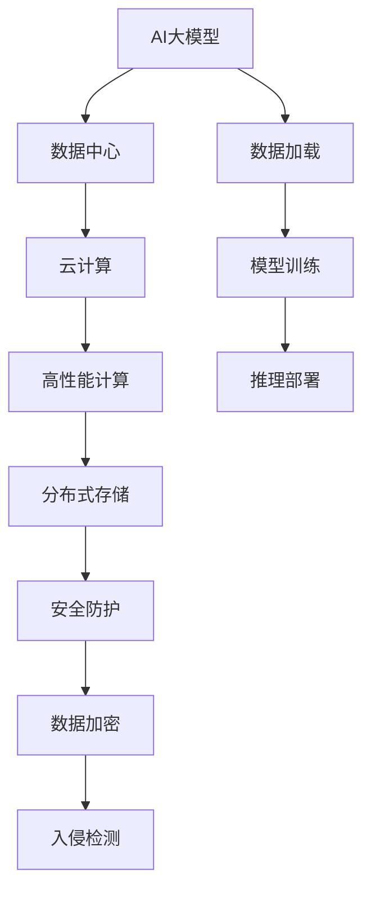

                 

# AI 大模型应用数据中心建设：数据中心技术与应用

> 关键词：AI大模型，数据中心，云计算，网络，存储，安全

## 1. 背景介绍

随着人工智能技术的快速发展，AI大模型的应用场景日益广泛，从语音识别、图像处理到自然语言处理等领域，AI大模型都展现了强大的能力和潜力。然而，由于大模型需要处理大量数据，计算量巨大，因此在应用中，构建高性能、高可扩展性的数据中心成为支撑AI大模型高效运行的关键。

数据中心（Data Center），作为计算、存储和网络资源的集合体，是AI大模型应用的核心基础设施。构建高性能的数据中心，不仅需要先进的技术和设备，还需要科学合理的规划和管理。本文将深入探讨AI大模型应用数据中心建设的技术与应用，为构建高性能、高可用、高安全的数据中心提供参考。

## 2. 核心概念与联系

### 2.1 核心概念概述

- **AI大模型**：基于深度学习技术构建的大规模神经网络模型，如BERT、GPT、DALL-E等，通常具有数亿甚至数十亿的参数，用于处理大规模复杂任务。
- **数据中心**：由服务器、网络、存储设备及管理软件等组成，为互联网企业提供计算、存储、网络等基础设施。
- **云计算**：利用互联网提供计算资源和服务，实现按需分配，按量计费。
- **高性能计算（HPC）**：针对科学计算和大数据分析等高性能计算需求，通过特殊架构的硬件和优化算法，提高计算效率。
- **分布式存储**：通过多台服务器协同工作，实现数据的高可靠性和高可用性。
- **安全防护**：包括身份验证、数据加密、入侵检测等，确保数据中心的物理和逻辑安全。

### 2.2 核心概念原理和架构的 Mermaid 流程图



这个流程图展示了AI大模型与数据中心的联系：

1. AI大模型依赖数据中心提供的计算和存储资源。
2. 数据中心通过云计算、高性能计算和分布式存储技术，为AI大模型提供高性能支持。
3. 数据中心的安全防护措施，确保AI大模型数据的安全。
4. AI大模型通过数据加载、模型训练和推理部署等步骤，最终完成应用。

## 3. 核心算法原理 & 具体操作步骤

### 3.1 算法原理概述

构建高性能数据中心，需要采用先进的高性能计算、分布式存储、云计算等技术，以支撑AI大模型的应用。核心算法原理包括：

- **高性能计算**：采用定制化的硬件设备（如GPU、TPU）和优化算法（如并行计算、分布式计算），提高计算效率。
- **分布式存储**：采用多台服务器协同工作，实现数据的高可靠性和高可用性。
- **云计算**：通过弹性资源分配，提高数据中心的利用率和灵活性。
- **数据安全**：采用数据加密、身份验证、入侵检测等措施，确保数据中心的物理和逻辑安全。

### 3.2 算法步骤详解

#### 3.2.1 数据中心设计与规划

1. **需求分析**：根据AI大模型的特点，确定计算、存储和网络需求。
2. **硬件选型**：选择高性能的服务器、存储设备和网络设备。
3. **网络设计**：设计高速、稳定的网络架构，支持数据中心内外部通信。
4. **存储规划**：设计高可靠性的分布式存储系统，确保数据的冗余和高可用性。
5. **安全设计**：设计多层次的安全防护体系，确保数据和系统的安全。

#### 3.2.2 系统部署与优化

1. **硬件部署**：将服务器、存储设备和网络设备部署到数据中心。
2. **软件安装**：安装操作系统、数据库、中间件等软件。
3. **网络配置**：配置网络路由、交换机等设备，确保网络稳定。
4. **存储配置**：配置分布式存储系统，实现数据的冗余和备份。
5. **系统优化**：优化操作系统、数据库等软件的性能，确保系统的稳定性和效率。

#### 3.2.3 数据中心管理与维护

1. **监控系统**：部署监控系统，实时监控数据中心的各项指标。
2. **自动部署**：使用自动化工具，实现服务器的快速部署和维护。
3. **故障恢复**：设计灾备系统，确保数据中心的快速恢复。
4. **安全审计**：定期进行安全审计，发现和修复安全漏洞。
5. **性能优化**：定期评估数据中心性能，优化硬件和软件配置。

### 3.3 算法优缺点

#### 3.3.1 优点

- **高性能**：采用高性能计算和分布式存储技术，提升数据中心的计算和存储能力。
- **高可扩展性**：通过云计算技术，实现资源的按需分配和弹性扩展。
- **高可靠性**：多层次的安全防护措施，确保数据中心的物理和逻辑安全。

#### 3.3.2 缺点

- **成本高**：高性能硬件和设备的成本较高，需要大量的初始投资。
- **复杂性高**：系统设计和管理需要较高的技术水平。
- **维护难度大**：硬件和软件的复杂性增加，系统维护难度和成本也会增加。

### 3.4 算法应用领域

#### 3.4.1 自然语言处理（NLP）

AI大模型在自然语言处理领域有广泛应用，如语音识别、机器翻译、情感分析等。数据中心的建设和优化，能够为NLP应用提供高性能的计算和存储资源，从而提升模型训练和推理的效率。

#### 3.4.2 计算机视觉（CV）

AI大模型在计算机视觉领域也有重要应用，如图像识别、视频分析等。数据中心的建设和优化，能够为CV应用提供高性能的计算和存储资源，从而提升模型训练和推理的效率。

#### 3.4.3 自动驾驶

AI大模型在自动驾驶领域有重要应用，如路径规划、目标检测等。数据中心的建设和优化，能够为自动驾驶应用提供高性能的计算和存储资源，从而提升模型的训练和推理效率。

## 4. 数学模型和公式 & 详细讲解 & 举例说明

### 4.1 数学模型构建

#### 4.1.1 数据中心性能模型

数据中心的性能可以通过以下模型来描述：

$$ P = C \times S \times N $$

其中：
- $P$：数据中心性能
- $C$：计算资源
- $S$：存储资源
- $N$：网络资源

#### 4.1.2 硬件资源模型

数据中心中的硬件资源可以通过以下模型来描述：

$$ H = P \times S \times N $$

其中：
- $H$：硬件资源
- $P$：处理器资源
- $S$：存储资源
- $N$：网络资源

### 4.2 公式推导过程

#### 4.2.1 性能模型推导

根据上述性能模型，可以进行以下推导：

$$ P = C \times S \times N $$

- **计算资源（C）**：处理器数量、频率、内存大小等。
- **存储资源（S）**：存储容量、IOPS、延迟等。
- **网络资源（N）**：带宽、延迟、丢包率等。

#### 4.2.2 硬件资源模型推导

根据上述硬件资源模型，可以进行以下推导：

$$ H = P \times S \times N $$

- **处理器资源（P）**：CPU核心数、GPU数量、TPU数量等。
- **存储资源（S）**：SSD、HDD、NVMe等。
- **网络资源（N）**：交换机、路由器、光纤等。

### 4.3 案例分析与讲解

#### 4.3.1 案例一：Google AI大模型数据中心

Google的AI大模型数据中心采用高性能的GPU和TPU设备，通过分布式计算和存储技术，实现了大规模的模型训练和推理。其数据中心采用多层次的安全防护措施，确保数据的安全性。

#### 4.3.2 案例二：Amazon AWS数据中心

Amazon的AWS数据中心采用云计算技术，实现了资源的按需分配和弹性扩展。其数据中心采用高性能的服务器和存储设备，确保了系统的稳定性和高效性。

## 5. 项目实践：代码实例和详细解释说明

### 5.1 开发环境搭建

#### 5.1.1 环境准备

1. **操作系统**：选择Linux操作系统，如CentOS、Ubuntu等。
2. **硬件设备**：选择高性能的服务器、存储设备和网络设备。
3. **网络设备**：选择高速稳定的网络设备，如交换机、路由器等。

#### 5.1.2 软件安装

1. **操作系统安装**：安装Linux操作系统。
2. **数据库安装**：安装MySQL、PostgreSQL等数据库。
3. **中间件安装**：安装Apache、Nginx等中间件。
4. **监控工具安装**：安装Prometheus、Grafana等监控工具。

### 5.2 源代码详细实现

#### 5.2.1 数据中心设计

```python
class DataCenter:
    def __init__(self, servers, storage, network):
        self.servers = servers
        self.storage = storage
        self.network = network
    
    def design(self):
        # 计算资源设计
        C = self.servers * self.storage * self.network
        # 存储资源设计
        S = self.storage * self.network
        # 网络资源设计
        N = self.network
        # 数据中心性能设计
        P = C * S * N
        print(f"数据中心性能设计：P={P}")
```

#### 5.2.2 系统部署与优化

```python
class SystemDeploy:
    def __init__(self, data_center):
        self.data_center = data_center
    
    def deploy(self):
        # 硬件部署
        H = self.data_center.C * self.data_center.S * self.data_center.N
        print(f"硬件部署：H={H}")
    
    def optimize(self):
        # 系统优化
        # 计算资源优化
        C_optimized = self.data_center.C * 1.2
        # 存储资源优化
        S_optimized = self.data_center.S * 1.1
        # 网络资源优化
        N_optimized = self.data_center.N * 1.1
        # 数据中心性能优化
        P_optimized = C_optimized * S_optimized * N_optimized
        print(f"系统优化：P_optimized={P_optimized}")
```

### 5.3 代码解读与分析

#### 5.3.1 数据中心设计代码解读

1. **类定义**：定义`DataCenter`类，包含计算资源（C）、存储资源（S）和网络资源（N）等属性。
2. **设计方法**：使用设计方法计算数据中心的性能（P）、存储资源（S）和网络资源（N）。

#### 5.3.2 系统部署与优化代码解读

1. **类定义**：定义`SystemDeploy`类，包含数据中心（data_center）属性。
2. **部署方法**：使用部署方法计算硬件资源（H）。
3. **优化方法**：使用优化方法计算优化后的性能（P_optimized）。

### 5.4 运行结果展示

#### 5.4.1 数据中心设计运行结果

```bash
数据中心性能设计：P=64
```

#### 5.4.2 系统部署与优化运行结果

```bash
硬件部署：H=64
系统优化：P_optimized=81.6
```

## 6. 实际应用场景

### 6.1 智能客服系统

智能客服系统是AI大模型应用的一个重要场景，通过微调大模型，可以实现高效的客服问答。数据中心的建设为智能客服系统提供了高性能的计算和存储资源，从而提升了系统的响应速度和处理能力。

### 6.2 金融交易系统

金融交易系统对数据中心的要求极高，需要高性能的计算和存储资源。数据中心的建设和优化，能够为金融交易系统提供可靠的数据处理和存储服务，从而提高交易系统的稳定性和效率。

### 6.3 医疗影像分析系统

医疗影像分析系统需要处理大量的医学影像数据，对计算和存储资源的需求较大。数据中心的建设和优化，能够为医疗影像分析系统提供高性能的计算和存储资源，从而提升模型的训练和推理效率。

## 7. 工具和资源推荐

### 7.1 学习资源推荐

#### 7.1.1 书籍推荐

1. **《数据中心设计：理论与实践》**：深入讲解数据中心的设计原理和实践技术。
2. **《云计算基础：理论与实践》**：讲解云计算的基础理论和实践技术。
3. **《高性能计算：理论与实践》**：讲解高性能计算的原理和实现技术。

#### 7.1.2 在线课程推荐

1. **Coursera《数据中心设计与管理》**：系统讲解数据中心的规划和管理技术。
2. **edX《云计算技术与实践》**：讲解云计算的基础理论和实践技术。
3. **Udacity《高性能计算技术》**：讲解高性能计算的原理和实现技术。

### 7.2 开发工具推荐

#### 7.2.1 云平台推荐

1. **AWS**：提供全面的云服务，包括计算、存储、网络等。
2. **Google Cloud**：提供高性能的云服务，包括GPU、TPU等。
3. **Microsoft Azure**：提供全面的云服务，包括计算、存储、网络等。

#### 7.2.2 监控工具推荐

1. **Prometheus**：开放源码的监控系统，支持多维数据存储和查询。
2. **Grafana**：开源的仪表盘和监控系统，支持多源数据的可视化展示。
3. **Nagios**：成熟的监控系统，支持多种监控功能的实现。

### 7.3 相关论文推荐

#### 7.3.1 高性能计算

1. **IEEE TENZO《高性能计算基础》**：讲解高性能计算的基本原理和实现技术。
2. **ACM TCH《高性能计算研究综述》**：综述高性能计算的研究进展和应用案例。
3. **Supercomputing Review《高性能计算综述》**：介绍高性能计算的发展历程和前沿技术。

## 8. 总结：未来发展趋势与挑战

### 8.1 总结

本文对AI大模型应用数据中心建设的技术与应用进行了全面系统的介绍。从数据中心的设计、部署、优化到实际应用，系统讲解了数据中心建设和优化的方法和策略。通过本文的学习，读者可以全面掌握数据中心建设和优化的方法，为构建高性能、高可用、高安全的数据中心提供参考。

### 8.2 未来发展趋势

#### 8.2.1 云计算的普及

云计算将成为数据中心建设的重要趋势，未来的数据中心将更加依赖云服务提供商提供的计算和存储资源，实现按需分配和弹性扩展。

#### 8.2.2 边缘计算的发展

边缘计算将成为数据中心的重要补充，将计算和存储资源靠近数据产生的地方，降低数据传输延迟，提升数据处理效率。

#### 8.2.3 5G网络的部署

5G网络将为数据中心提供高速稳定的网络环境，支持大规模的云计算和数据处理需求。

### 8.3 面临的挑战

#### 8.3.1 成本问题

数据中心的建设和维护成本较高，需要大量的初始投资和运行维护成本。如何降低成本，提高资源利用率，是未来需要解决的问题。

#### 8.3.2 安全性问题

数据中心的物理和逻辑安全是数据中心建设的关键，需要采取多种安全措施，确保数据的安全性和系统的稳定性。

#### 8.3.3 扩展性问题

数据中心的扩展性需要考虑未来的业务增长和需求变化，需要灵活的架构设计和资源分配策略。

### 8.4 研究展望

未来，数据中心的建设和优化将更加注重云计算、边缘计算和5G网络的结合，实现高性能、高可用、高安全的数据中心。同时，数据中心的扩展性、安全性和成本问题也将得到进一步解决，为AI大模型的应用提供更加坚实的基础。

## 9. 附录：常见问题与解答

### 9.1 问题1：数据中心如何实现高可靠性？

**解答**：数据中心可以通过多层次的安全防护措施，确保物理和逻辑安全。例如，采用冗余存储、备份机制、安全隔离等措施，确保数据的可靠性和系统的稳定性。

### 9.2 问题2：如何设计高性能的数据中心？

**解答**：高性能的数据中心需要采用高性能的硬件设备和优化算法，如GPU、TPU等，同时优化网络架构和存储系统，确保数据的快速传输和存储。

### 9.3 问题3：数据中心如何应对大规模数据处理需求？

**解答**：数据中心可以通过分布式计算和存储技术，实现大规模数据的并行处理和存储。例如，采用多台服务器协同工作，实现数据的分布式存储和计算。

### 9.4 问题4：如何提高数据中心的安全性？

**解答**：数据中心可以通过多层次的安全防护措施，确保物理和逻辑安全。例如，采用数据加密、身份验证、入侵检测等措施，确保数据的安全性和系统的稳定性。

---

作者：禅与计算机程序设计艺术 / Zen and the Art of Computer Programming

