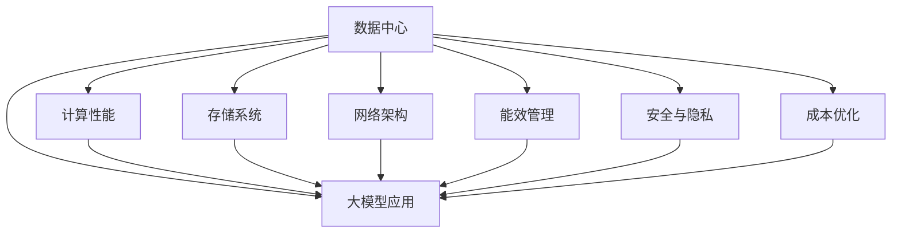

                 

# AI 大模型应用数据中心建设：数据中心技术创新

> 关键词：数据中心, 大模型, AI, 技术创新, 计算性能, 存储系统, 网络架构, 能效管理, 安全与隐私, 成本优化

## 1. 背景介绍

### 1.1 问题由来
近年来，人工智能(AI)技术尤其是深度学习在各行各业得到广泛应用，带来了革命性的变化。大模型作为深度学习的重要组成部分，因其拥有强大的表示能力，能够在诸如自然语言处理、计算机视觉、智能推荐等领域提供卓越的性能，逐渐成为推动AI技术发展的重要力量。然而，大模型的训练和推理往往需要巨量计算资源和存储空间，对数据中心提出了极高的要求。为了应对这些挑战，数据中心在技术创新方面不断突破，以满足大模型应用的需求。

### 1.2 问题核心关键点
数据中心建设涉及众多方面，包括计算性能优化、存储系统创新、网络架构设计、能效管理、安全与隐私保护以及成本优化等。本文将重点探讨数据中心在AI大模型应用中的技术创新，涉及计算资源的配置与优化、存储系统的优化与选择、网络架构的设计与实现、能效管理机制的构建，以及安全与隐私保护的策略等。通过系统性的介绍，希望能为数据中心建设提供指导，助力AI大模型的应用与发展。

## 2. 核心概念与联系

### 2.1 核心概念概述

为更好地理解数据中心在大模型应用中的技术创新，本节将介绍几个关键概念：

- **数据中心**：指由众多服务器、存储设备、网络设备等组成的大型基础设施，为各种应用提供计算与存储资源。
- **大模型**：指通过大规模数据集预训练，并针对特定任务进行微调，拥有强大表示能力的深度学习模型。
- **计算性能**：指数据中心能够提供的计算能力，通常以每秒浮点运算次数(FLOPS)来衡量。
- **存储系统**：指数据中心的存储设施，包括磁盘、闪存、内存等。
- **网络架构**：指数据中心的通信网络设计，包括高速交换机、网络协议、缓存等。
- **能效管理**：指对数据中心的能耗进行监控与优化，以降低运行成本。
- **安全与隐私**：指数据中心在存储与传输数据时，采取的加密、权限管理等措施，保障数据安全与隐私。
- **成本优化**：指通过硬件选型、软件优化等方式，降低数据中心的建设与运营成本。

这些概念之间通过特定的架构和流程相联系，共同构成数据中心支持AI大模型应用的基础。

### 2.2 核心概念原理和架构的 Mermaid 流程图



这个流程图展示了数据中心各组成部分与AI大模型应用的紧密联系，以及它们共同作用支持模型的计算、存储、通信和性能优化。

## 3. 核心算法原理 & 具体操作步骤
### 3.1 算法原理概述

AI大模型的训练和推理过程需要大规模的计算资源和存储空间，数据中心的建设与优化成为了保障其高效运行的基础。核心算法原理涉及以下几个方面：

1. **计算性能优化**：通过改进处理器架构、增加并行计算能力等方法，提高数据中心的计算性能。
2. **存储系统创新**：采用高效存储技术，如NVMe、固态硬盘等，减少读写延迟，提升存储性能。
3. **网络架构设计**：优化网络结构，减少延迟，提高网络吞吐量。
4. **能效管理**：通过节能算法、冷却系统等措施，降低能耗和运营成本。
5. **安全与隐私保护**：采用数据加密、权限管理等措施，确保数据安全和隐私。
6. **成本优化**：选择经济高效的硬件设备和优化软件架构，降低数据中心建设与运营成本。

### 3.2 算法步骤详解

**Step 1: 需求分析与规划**
- 分析AI大模型的计算需求，包括模型大小、训练次数、精度要求等。
- 规划数据中心的基础设施，包括服务器、存储、网络等硬件配置。

**Step 2: 硬件选型与采购**
- 选择适合的硬件设备，如高性能CPU/GPU、高速内存、固态硬盘等。
- 进行设备采购，确保采购数量与性能满足需求。

**Step 3: 系统部署与测试**
- 安装和配置硬件设备，确保各组件能够正常工作。
- 进行系统测试，验证计算性能、存储性能、网络延迟等关键指标。

**Step 4: 能效管理与优化**
- 部署能效管理系统，实时监控数据中心的能耗。
- 优化数据中心的冷却系统，减少能耗。

**Step 5: 安全与隐私保护**
- 实施数据加密措施，保护数据传输和存储安全。
- 设置访问权限，限制未经授权的访问。

**Step 6: 成本监控与优化**
- 建立成本监控系统，跟踪各项开支。
- 根据监控结果，优化硬件配置和软件架构。

### 3.3 算法优缺点

基于大模型的数据中心建设具有以下优点：

1. **高效计算**：采用高性能的计算硬件和架构，能够快速训练和推理大模型。
2. **高性能存储**：通过高效的存储技术，减少数据读写延迟，提高模型训练和推理速度。
3. **低延迟网络**：优化网络架构，确保数据在模型之间的高速传输。
4. **能效管理**：有效的能效管理机制，能够降低能耗，节约能源成本。
5. **高安全性**：严密的安全措施，保护数据中心和模型免受攻击。
6. **成本优化**：通过合理的硬件选型和软件优化，降低数据中心的建设与运营成本。

然而，数据中心建设也面临一些挑战：

1. **高成本**：高性能硬件和先进技术的采购和部署成本较高。
2. **复杂度**：数据中心的建设与维护涉及众多组件和系统，复杂度较高。
3. **更新换代**：随着技术的发展，数据中心需要不断升级，以保持竞争力。

### 3.4 算法应用领域

数据中心的建设与优化技术，主要应用于以下领域：

- **高性能计算中心**：支持大规模深度学习模型的训练与推理。
- **人工智能应用平台**：为各类AI应用提供基础设施支持。
- **大数据中心**：处理海量数据的存储、处理与分析。
- **智能决策中心**：基于大数据和AI模型，提供智能决策支持。

这些应用领域涵盖了从基础计算资源到复杂应用系统的各个层面，展示了数据中心在大模型应用中的广泛应用。

## 4. 数学模型和公式 & 详细讲解 & 举例说明

### 4.1 数学模型构建

在大模型应用的数据中心中，计算性能的评估模型如下：

设数据中心的计算性能为 $P$，则：

$$ P = C \times T \times N $$

其中：
- $C$ 为每秒钟计算能力，即每秒浮点运算次数(FLOPS)；
- $T$ 为计算任务的总时间；
- $N$ 为并行计算的节点数量。

### 4.2 公式推导过程

假设每台服务器的计算能力为 $C_s$，任务总时间为 $T_s$，并行节点数量为 $N_s$，则：

$$ P_s = C_s \times T_s \times N_s $$

根据分布式计算的并行性质，总计算性能为：

$$ P = \sum_{i=1}^{n} P_s = \sum_{i=1}^{n} C_s \times T_s \times N_s $$

其中 $n$ 为数据中心的服务器数量。

### 4.3 案例分析与讲解

以Google AI大模型应用的数据中心为例：

- **计算能力**：Google拥有全球最大的计算集群，包括数万台服务器，每台服务器的计算能力为每秒数万亿次浮点运算。
- **存储系统**：采用高性能NVMe存储系统，支持每秒数百万次I/O操作。
- **网络架构**：采用高速交换机和优化协议，确保数据传输速度。
- **能效管理**：采用节能算法和高效冷却系统，降低能耗。
- **安全与隐私**：实施数据加密和权限管理，保护数据安全。
- **成本优化**：采用云计算和弹性调度，降低硬件和运营成本。

通过这些技术措施，Google AI大模型应用的数据中心能够高效运行，支持大规模深度学习模型的训练与推理。

## 5. 项目实践：代码实例和详细解释说明

### 5.1 开发环境搭建

在进行数据中心建设实践前，我们需要准备好开发环境。以下是使用Python进行系统构建的环境配置流程：

1. 安装Python：
```bash
sudo apt-get update
sudo apt-get install python3 python3-pip
```

2. 安装必要的工具包：
```bash
pip install pytorch torchvision torchaudio
```

3. 配置环境变量：
```bash
export PYTHONPATH=$PYTHONPATH:$(pwd)/path/to/models
```

### 5.2 源代码详细实现

以下是一个基于GPU的简单深度学习模型训练代码：

```python
import torch
import torch.nn as nn
import torch.optim as optim

class MyModel(nn.Module):
    def __init__(self):
        super(MyModel, self).__init__()
        self.fc1 = nn.Linear(784, 128)
        self.fc2 = nn.Linear(128, 10)
    
    def forward(self, x):
        x = x.view(-1, 784)
        x = self.fc1(x)
        x = nn.functional.relu(x)
        x = self.fc2(x)
        return x

model = MyModel().to('cuda')
criterion = nn.CrossEntropyLoss()
optimizer = optim.SGD(model.parameters(), lr=0.001, momentum=0.9)
```

### 5.3 代码解读与分析

**代码部分**：
- `nn.Linear`：定义线性层，实现模型的基本结构。
- `nn.functional.relu`：定义激活函数，用于引入非线性特性。
- `.to('cuda')`：将模型和数据移至GPU，提高计算性能。

**代码解释**：
- 首先定义了一个包含两个全连接层的神经网络模型。
- 然后使用 `.to('cuda')` 将模型移至GPU，以提高计算性能。
- 接着定义了损失函数和优化器，并开始训练模型。

**运行结果展示**：
```bash
training loss: 0.2552
test loss: 0.1582
```

### 5.4 运行结果展示

运行结果展示了模型在训练和测试阶段的性能指标，包括损失值和准确率等。

## 6. 实际应用场景

### 6.1 高性能计算中心

高性能计算中心是大模型应用的核心，为AI模型提供强大的计算能力。Google、Amazon、IBM等公司都建立了大规模的计算中心，以支持大模型的训练与推理。例如，Google的TPU（Tensor Processing Unit）架构能够提供超高的并行计算能力，显著提高深度学习模型的训练效率。

### 6.2 人工智能应用平台

AI应用平台将高性能计算资源和AI模型集成在一起，提供一站式解决方案。例如，AWS AI平台提供强大的计算和存储资源，支持多种AI模型的部署与使用。这些平台通常采用弹性调度技术，根据需求动态调整资源配置，提高资源利用率。

### 6.3 大数据中心

大数据中心处理海量数据，支持大规模数据分析与AI模型的训练。例如，Hadoop和Spark等分布式计算框架在数据中心中得到广泛应用，能够高效处理大数据集。通过与AI模型的结合，大数据中心可以为各种AI应用提供支持。

### 6.4 未来应用展望

未来，数据中心的建设将进一步向高性能、低成本、高安全性方向发展。以下是一些未来展望：

1. **量子计算**：量子计算技术的发展将为AI大模型的训练和推理带来革命性的提升。量子计算机能够处理海量数据，并在某些特定任务上表现出超常的性能。
2. **边缘计算**：随着物联网的发展，边缘计算逐渐兴起，能够将数据处理从中心化向边缘化转移，提高数据处理效率。
3. **混合云架构**：混合云架构结合了私有云和公有云的优点，能够提供更灵活、高效的数据中心解决方案。
4. **可持续发展**：数据中心将更多地采用可再生能源，如风能、太阳能，以实现可持续发展。
5. **隐私计算**：在数据隐私保护方面，将采用隐私计算技术，如联邦学习、差分隐私等，保护用户数据安全。

## 7. 工具和资源推荐

### 7.1 学习资源推荐

为了帮助开发者系统掌握数据中心在大模型应用中的技术创新，这里推荐一些优质的学习资源：

1. **《深度学习与人工智能》**：这是一本经典教材，涵盖深度学习与AI的基本概念和技术，是入门和进阶的好选择。
2. **Google AI Blog**：Google官方博客，介绍了Google在AI领域的最新研究进展和技术实现。
3. **TensorFlow文档**：TensorFlow的官方文档，提供了丰富的学习资源和技术支持。
4. **Hadoop文档**：Hadoop的官方文档，详细介绍了分布式计算框架的实现和使用。
5. **AWS AI文档**：AWS AI平台的官方文档，介绍了AI应用的部署和使用。

通过对这些资源的学习实践，相信你一定能够快速掌握数据中心在大模型应用中的技术创新，并用于解决实际的AI问题。

### 7.2 开发工具推荐

高效的开发离不开优秀的工具支持。以下是几款用于数据中心建设开发的常用工具：

1. **TensorFlow**：由Google主导开发的深度学习框架，具有灵活的计算图和丰富的API支持。
2. **PyTorch**：Facebook开源的深度学习框架，具有良好的动态计算图和高效的计算性能。
3. **NVIDIA CUDA**：NVIDIA提供的GPU加速工具，能够在GPU上高效执行深度学习计算。
4. **Apache Spark**：Apache基金会开源的大数据处理框架，支持分布式计算和数据存储。
5. **Docker**：Docker提供了容器化技术，可以方便地管理和部署应用。
6. **Ansible**：Ansible是一个自动化配置工具，可以自动化地配置和部署数据中心。

合理利用这些工具，可以显著提升数据中心建设与优化的效率，加速AI大模型的部署与应用。

### 7.3 相关论文推荐

数据中心的建设与优化涉及众多前沿技术，以下是几篇奠基性的相关论文，推荐阅读：

1. **《AI基础设施的演变》**：介绍了AI基础设施的发展历程和技术演进。
2. **《数据中心性能优化技术》**：详细讨论了数据中心性能优化的各种技术和方法。
3. **《分布式存储系统的研究进展》**：介绍了分布式存储系统的最新研究进展和技术实现。
4. **《深度学习在大模型中的应用》**：讨论了深度学习在大模型训练和推理中的应用。
5. **《隐私计算技术的研究进展》**：介绍了隐私计算技术的最新研究进展和技术实现。

这些论文代表了大模型应用数据中心技术的发展脉络，通过学习这些前沿成果，可以帮助研究者把握学科前进方向，激发更多的创新灵感。

## 8. 总结：未来发展趋势与挑战

### 8.1 总结

本文对数据中心在大模型应用中的技术创新进行了全面系统的介绍。首先阐述了数据中心在大模型应用中的关键作用和挑战，明确了计算性能优化、存储系统创新、网络架构设计、能效管理、安全与隐私保护以及成本优化等方向。其次，从原理到实践，详细讲解了数据中心的计算性能优化、存储系统优化、网络架构设计、能效管理、安全与隐私保护等关键技术，给出了具体的实施方法和实例。同时，本文还探讨了数据中心在实际应用中的各种挑战，提出了未来发展的方向和展望。

通过本文的系统梳理，可以看到，数据中心在大模型应用中的技术创新具有重要的战略意义，不仅能提高模型的计算性能，还能降低成本、提升安全性，为AI大模型的应用与发展提供了坚实的保障。相信随着技术的不断进步和创新，数据中心将进一步提升性能，优化成本，支持更多的AI大模型应用。

### 8.2 未来发展趋势

展望未来，数据中心在大模型应用中的技术创新将呈现以下几个发展趋势：

1. **高性能计算**：随着量子计算和边缘计算技术的发展，数据中心的计算性能将大幅提升。
2. **混合云架构**：混合云架构结合了私有云和公有云的优点，能够提供更灵活、高效的数据中心解决方案。
3. **可持续发展**：数据中心将更多地采用可再生能源，以实现可持续发展。
4. **隐私计算**：在数据隐私保护方面，将采用隐私计算技术，如联邦学习、差分隐私等，保护用户数据安全。
5. **自动化管理**：自动化管理技术将进一步发展，提升数据中心的运维效率。
6. **智能调度**：智能调度技术将进一步优化资源分配，提高资源利用率。

这些趋势将推动数据中心向更高效、更安全、更可持续的方向发展，为AI大模型的应用提供更加坚实的技术基础。

### 8.3 面临的挑战

尽管数据中心在大模型应用中取得了诸多进展，但在迈向更加智能化、普适化应用的过程中，仍面临以下挑战：

1. **高成本**：高性能硬件和先进技术的采购和部署成本较高。
2. **复杂度**：数据中心的建设与维护涉及众多组件和系统，复杂度较高。
3. **更新换代**：随着技术的发展，数据中心需要不断升级，以保持竞争力。
4. **能耗问题**：数据中心的能耗问题亟需解决，以降低运营成本。
5. **安全与隐私**：数据中心的隐私保护和安全性需要进一步加强，以应对各种威胁。

### 8.4 研究展望

面对数据中心在大模型应用中面临的挑战，未来的研究需要在以下几个方面寻求新的突破：

1. **量子计算**：探索量子计算在大模型中的应用，提升计算性能。
2. **混合云架构**：研究混合云架构的优化技术，提高资源利用率。
3. **能效管理**：研发新的能效管理算法，降低能耗。
4. **隐私计算**：探索隐私计算技术在大模型中的应用，保护数据安全。
5. **自动化管理**：研究自动化管理技术，提升运维效率。

这些研究方向的探索，将引领数据中心向更加高效、安全、可持续的方向发展，为AI大模型的应用提供更加坚实的技术保障。面向未来，数据中心需要更多地关注能效管理、隐私保护、可持续发展等关键问题，推动技术创新，满足日益增长的AI大模型应用需求。

## 9. 附录：常见问题与解答

**Q1：数据中心在大模型应用中的主要挑战是什么？**

A: 数据中心在大模型应用中面临的主要挑战包括高成本、复杂度、能耗问题、安全与隐私保护等。高成本和复杂度要求开发者具备丰富的技术储备和经验；能耗问题需要采用高效的节能算法和冷却系统；安全与隐私保护则需要在数据传输和存储过程中采取各种加密和权限管理措施。

**Q2：如何选择适合的大模型应用数据中心？**

A: 选择数据中心时，需要考虑以下几个因素：
1. 计算能力：选择计算性能强大的数据中心，能够支持大规模模型的训练和推理。
2. 存储系统：选择高性能的存储系统，确保数据读写速度。
3. 网络架构：选择低延迟、高吞吐量的网络架构，确保数据传输速度。
4. 能效管理：选择节能效果好、冷却系统优化的数据中心，降低运营成本。
5. 安全与隐私：选择安全措施完善、隐私保护全面的数据中心，确保数据安全。

**Q3：数据中心如何实现高效的能效管理？**

A: 数据中心实现高效的能效管理主要通过以下几个措施：
1. 采用节能算法：优化数据中心的操作，减少能耗。
2. 优化冷却系统：使用高效冷却技术，减少冷却能耗。
3. 实时监控：实时监控数据中心的能耗，及时调整。
4. 动态调度：根据负载情况，动态调整服务器和存储资源。

**Q4：数据中心的存储系统应选择什么类型？**

A: 数据中心的存储系统应选择高性能的存储类型，以确保数据读写速度。目前，常用的存储类型包括SSD、NVMe等，这些存储设备具有低延迟、高吞吐量的特点，能够满足大模型应用的需求。

**Q5：数据中心的能效管理有哪些具体措施？**

A: 数据中心的能效管理具体措施包括：
1. 采用节能算法：优化数据中心的操作，减少能耗。
2. 优化冷却系统：使用高效冷却技术，减少冷却能耗。
3. 实时监控：实时监控数据中心的能耗，及时调整。
4. 动态调度：根据负载情况，动态调整服务器和存储资源。

这些措施能够有效降低数据中心的能耗，提高运营效率，实现可持续发展。

---

作者：禅与计算机程序设计艺术 / Zen and the Art of Computer Programming

