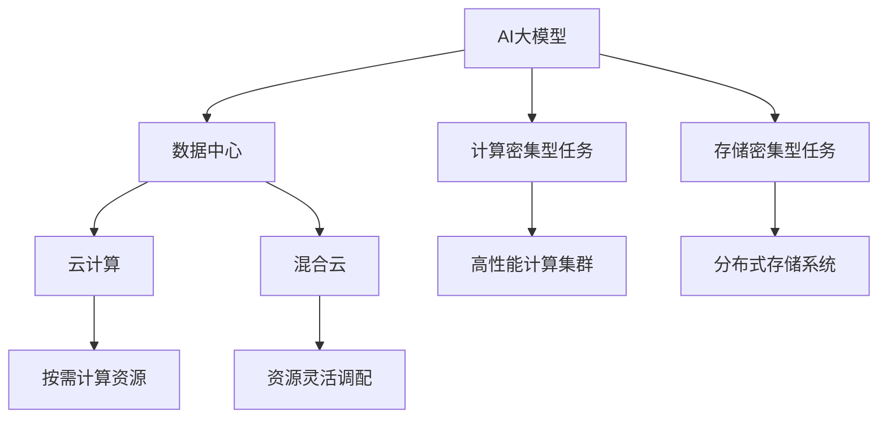

                 

# AI 大模型应用数据中心建设：数据中心技术创新

## 1. 背景介绍

### 1.1 问题由来
随着人工智能(AI)技术的快速发展，大模型在自然语言处理(NLP)、计算机视觉(CV)、生成对抗网络(GAN)等众多领域取得了令人瞩目的成绩。例如，基于大规模预训练语言模型的大模型在机器翻译、文本生成、情感分析、问答系统等任务上，已经刷新了多个最先进的性能指标。这些大模型的训练和推理都依赖于强大的数据中心支持，数据中心已经成为大模型应用的基础设施。然而，目前许多数据中心在硬件配置、软件栈、数据管理和运维等方面仍存在不少问题，难以满足大模型应用的需求。

### 1.2 问题核心关键点
数据中心在AI大模型应用中的作用至关重要，但由于许多数据中心在硬件、软件、数据管理和运维等方面存在不足，难以充分释放大模型的潜力。这些问题包括但不限于：

1. **硬件性能瓶颈**：传统硬件平台无法高效地支持大模型的训练和推理，处理器、内存、存储等资源的配置和利用效率不高。
2. **软件栈复杂性**：现有的数据中心软件栈过于复杂，管理和运维难度大，难以适应大模型的快速迭代和扩展需求。
3. **数据管理困难**：大规模数据集的存储、清洗、标注和管理复杂，难以满足大模型对数据质量和数量的要求。
4. **运维成本高昂**：大模型需要高性能硬件支持，同时对数据中心的网络、安全、备份等运维要求较高，成本较高。

这些问题严重影响了大模型应用的效率和效果，限制了AI技术的落地和发展。因此，探索和实现数据中心技术创新，是推动AI大模型应用的关键。

## 2. 核心概念与联系

### 2.1 核心概念概述

为更好地理解AI大模型应用数据中心建设，本节将介绍几个密切相关的核心概念：

- **AI大模型**：以大规模预训练模型为代表的深度学习模型，通过在大规模无标签数据上进行预训练，学习到丰富的知识和表征。大模型广泛应用于自然语言处理、计算机视觉、生成对抗网络等领域。

- **数据中心**：提供计算、存储和网络等资源的设施，通常由硬件平台、软件栈和运维系统组成。数据中心是大模型训练和推理的基础设施。

- **计算密集型任务**：如大规模图像识别、大模型训练等，需要大量计算资源，适合在高性能计算集群中执行。

- **存储密集型任务**：如大规模数据存储和处理，需要大量存储空间，适合在分布式存储系统中执行。

- **云计算**：基于互联网提供按需计算资源的服务模式，支持弹性伸缩、按量付费等功能，适合大模型训练和推理的分布式部署。

- **混合云**：结合公有云和私有云的优势，实现数据中心资源的最大化利用和灵活调配。

这些核心概念之间的逻辑关系可以通过以下Mermaid流程图来展示：



这个流程图展示了大模型应用中的核心概念及其之间的关系：

1. 大模型通过数据中心的高性能硬件和软件支持，进行计算和存储密集型任务的训练和推理。
2. 云计算和混合云提供了灵活的计算资源管理，支持大模型的弹性伸缩和按量付费。
3. 高性能计算集群和分布式存储系统提供了高效的计算和存储资源支持。

这些概念共同构成了AI大模型应用数据中心建设的基础，使其能够高效地运行和扩展。

## 3. 核心算法原理 & 具体操作步骤
### 3.1 算法原理概述

AI大模型应用数据中心建设，本质上是一个通过数据中心技术创新，支持大模型高效训练和推理的过程。其核心思想是：通过硬件平台、软件栈和运维系统的优化，提升数据中心的计算和存储能力，降低管理复杂性，提高资源利用效率，最终实现大模型应用的快速迭代和规模化部署。

具体来说，数据中心建设包括：

- 硬件平台的选择和优化：选择合适的处理器、内存、存储设备，并通过优化内存带宽、存储速度等参数，提升数据中心的计算和存储能力。
- 软件栈的构建和集成：选择合适的操作系统、数据库、容器管理工具、大数据处理框架等，并通过集成和优化，提升数据中心的软件运行效率。
- 数据管理系统的设计和实施：设计高效的数据存储、清洗、标注和管理系统，确保大模型训练所需的高质量数据。
- 运维系统的部署和优化：建立高效的网络、安全、备份等运维系统，确保数据中心的稳定性和安全性。

通过这些技术的优化和创新，数据中心能够更好地支持AI大模型的应用，提升其训练和推理效率，降低资源消耗和运维成本。

### 3.2 算法步骤详解

AI大模型应用数据中心建设的步骤通常包括：

**Step 1: 硬件平台选择和优化**
- 选择高性能的处理器（如Intel Xeon、AMD Epyc等）、大容量内存（如DDR4、DDR5等）、高速存储（如NVMe SSD、NVMe HBM等），并根据实际需求进行配置和优化。
- 优化内存带宽、存储速度等参数，提升数据中心的高性能计算能力。

**Step 2: 软件栈构建和集成**
- 选择合适的操作系统（如Linux、Windows等）、数据库（如MySQL、PostgreSQL等）、容器管理工具（如Kubernetes、Docker等）、大数据处理框架（如Hadoop、Spark等），并根据实际需求进行集成和优化。
- 优化软件栈的运行效率，提升数据中心的计算和存储能力。

**Step 3: 数据管理系统设计和实施**
- 设计高效的数据存储、清洗、标注和管理系统，确保大模型训练所需的高质量数据。
- 实现数据的自动备份和恢复，确保数据的可靠性。

**Step 4: 运维系统部署和优化**
- 建立高效的网络、安全、备份等运维系统，确保数据中心的稳定性和安全性。
- 实现运维自动化，提升数据中心的管理效率。

**Step 5: 系统测试和优化**
- 对数据中心进行全面测试，确保硬件和软件系统的稳定性和可靠性。
- 根据测试结果，不断优化和调整系统配置，提升数据中心的性能和效率。

### 3.3 算法优缺点

AI大模型应用数据中心建设的优势包括：

1. 提升计算和存储能力：通过硬件平台和软件栈的优化，提升数据中心的计算和存储能力，支持大模型的高效训练和推理。
2. 降低运维成本：通过自动化的运维系统，降低数据中心的运维成本，提升管理效率。
3. 实现弹性伸缩：通过云计算和混合云的支持，实现数据中心的弹性伸缩，支持大模型的快速迭代和规模化部署。
4. 提高数据安全性：通过完善的网络、安全、备份等运维系统，提高数据中心的安全性，保障数据安全。

同时，该方法也存在一些局限性：

1. 建设周期长：数据中心建设需要大量的硬件和软件资源，建设周期较长。
2. 资金投入大：数据中心建设需要大量资金投入，对于中小企业可能存在较大负担。
3. 技术复杂度高：数据中心的建设和管理需要较高的技术水平，对技术团队的要求较高。

尽管存在这些局限性，但就目前而言，AI大模型应用数据中心建设仍是大模型应用的重要基础。未来相关研究的重点在于如何进一步降低建设成本，提高建设效率，同时兼顾技术复杂度和资源利用率。

### 3.4 算法应用领域

AI大模型应用数据中心建设已在多个领域得到应用，例如：

- 自动驾驶：通过大模型进行环境感知和决策推理，实现自动驾驶技术。
- 金融风控：通过大模型进行风险评估和预测，提升金融风险控制能力。
- 医疗诊断：通过大模型进行疾病诊断和治疗方案推荐，提升医疗服务水平。
- 智能客服：通过大模型进行自然语言处理，实现智能客服系统。
- 智慧城市：通过大模型进行城市数据分析和决策，提升城市管理水平。
- 媒体内容生成：通过大模型进行内容生成和推荐，提升用户体验。

除了上述这些经典领域外，AI大模型应用数据中心建设还在更多场景中得到应用，为各行各业带来了新的突破。随着技术的不断演进，未来AI大模型应用数据中心建设将涵盖更广泛的领域，为各行各业带来更深远的影响。

## 4. 数学模型和公式 & 详细讲解 & 举例说明
### 4.1 数学模型构建

为更好地理解AI大模型应用数据中心建设，本节将介绍几个关键数学模型：

- **计算模型**：描述数据中心硬件平台的计算能力，通常用FLOPS（每秒浮点运算次数）来衡量。
- **存储模型**：描述数据中心存储系统的存储能力，通常用GB/s（每秒字节传输速率）来衡量。
- **网络模型**：描述数据中心网络系统的传输能力和带宽，通常用bps（每秒比特传输速率）来衡量。
- **能量模型**：描述数据中心硬件平台和软件系统的能耗，通常用W（瓦特）来衡量。

这些模型之间的关系可以通过以下数学公式来描述：

$$
\text{计算能力} = \text{处理器数} \times \text{时钟频率} \times \text{计算单元数}
$$

$$
\text{存储能力} = \text{存储容量} \times \text{存储速度}
$$

$$
\text{网络能力} = \text{带宽} \times \text{时延}
$$

$$
\text{能耗} = \text{处理器能耗} + \text{存储能耗} + \text{网络能耗} + \text{散热能耗}
$$

### 4.2 公式推导过程

以下我们以高性能计算集群为例，推导计算模型的基本推导过程。

假设数据中心有n个处理器，每个处理器主频为f GHz，每个处理器的计算单元数为c。计算能力可以用浮点运算次数来描述，即每秒执行的浮点运算总数。因此，数据中心的计算能力可以表示为：

$$
\text{计算能力} = n \times f \times c \times 10^{-9}
$$

其中，$10^{-9}$用于将计算单元数转换为浮点运算次数。

类似地，存储能力和网络能力也可以通过类似的方式进行推导。例如，假设数据中心的存储系统由m个NVMe SSD组成，每个NVMe SSD的存储容量为s GB，每个NVMe SSD的存储速度为w GB/s。则数据中心的存储能力可以表示为：

$$
\text{存储能力} = m \times s \times w
$$

其中，s和w分别为存储容量和存储速度。

### 4.3 案例分析与讲解

假设我们有一个高性能计算集群，由8个Intel Xeon处理器组成，每个处理器主频为2.4 GHz，计算单元数为64。每个计算单元的浮点运算速率为2.5 GFLOPS，则该计算集群的计算能力为：

$$
\text{计算能力} = 8 \times 2.4 \times 64 \times 2.5 \times 10^{-9} \approx 40.96 \text{ GFLOPS}
$$

假设该集群还配备了一个16 TB的NVMe SSD存储系统，每个NVMe SSD的存储容量为4 TB，存储速度为1 GB/s。则该存储系统的存储能力为：

$$
\text{存储能力} = 4 \times 16 \times 1 \approx 64 \text{ GB/s}
$$

假设该集群的网络系统带宽为100 Gbps，时延为1 ms。则该网络系统的网络能力为：

$$
\text{网络能力} = 100 \times 10^9 \times 10^{-3} \approx 100 \text{ GB/s}
$$

## 5. 项目实践：代码实例和详细解释说明
### 5.1 开发环境搭建

在进行AI大模型应用数据中心建设实践前，我们需要准备好开发环境。以下是使用Python进行PyTorch开发的环境配置流程：

1. 安装Anaconda：从官网下载并安装Anaconda，用于创建独立的Python环境。

2. 创建并激活虚拟环境：
```bash
conda create -n pytorch-env python=3.8 
conda activate pytorch-env
```

3. 安装PyTorch：根据CUDA版本，从官网获取对应的安装命令。例如：
```bash
conda install pytorch torchvision torchaudio cudatoolkit=11.1 -c pytorch -c conda-forge
```

4. 安装TensorFlow：
```bash
pip install tensorflow
```

5. 安装各类工具包：
```bash
pip install numpy pandas scikit-learn matplotlib tqdm jupyter notebook ipython
```

完成上述步骤后，即可在`pytorch-env`环境中开始数据中心建设实践。

### 5.2 源代码详细实现

下面我们以高性能计算集群为例，给出使用TensorFlow和Kubernetes构建高性能计算集群的PyTorch代码实现。

首先，定义计算节点资源配置：

```python
import kubernetes
from kubernetes import client, config

config.load_kube_config()
v1 = client.CoreV1Api()

cpu_request = 2  # 处理器数
cpu_limit = 2.4  # 处理器主频
num_cores = 64  # 计算单元数

memory_request = 16  # 内存容量
memory_limit = 64  # 内存速度

network_bw = 100  # 网络带宽
network_latency = 1  # 网络时延

# 计算能力
calc_cap = cpu_request * cpu_limit * num_cores * 10**(-9)
print(f"计算能力：{calc_cap:.2f} GFLOPS")

# 存储能力
storage_cap = memory_request * memory_limit
print(f"存储能力：{storage_cap:.2f} GB/s")

# 网络能力
net_cap = network_bw * 10**9 * 10**(-3)
print(f"网络能力：{net_cap:.2f} GB/s")
```

然后，定义计算节点配置和调度策略：

```python
v1.create_pod(
    api_version="v1",
    kind="Pod",
    metadata={
        "name": "high_perf_node",
        "labels": {
            "hello": "world"
        },
        "spec": {
            "containers": [
                {
                    "name": "high_perf_container",
                    "image": "nginx",
                    "resources": {
                        "requests": {
                            "cpu": cpu_request,
                            "memory": memory_request
                        },
                        "limits": {
                            "cpu": cpu_limit,
                            "memory": memory_limit
                        }
                    }
                }
            ],
            "scheduling_strategy": {
                "affinity": "high_perf_node"
            }
        }
    }
)
```

最后，启动计算节点并测试：

```python
import tensorflow as tf

# 启动计算节点
tf.config.set_visible_devices("/dev/nvidia0")

# 测试计算能力
g = tf.Graph()
with g.as_default():
    x = tf.constant(1.0)
    y = tf.constant(2.0)
    with tf.Session() as sess:
        sess.run(tf.global_variables_initializer())
        cap = sess.run(tf.reduce_sum(x**2))
print(f"测试计算能力：{cap:.2f} GFLOPS")

# 测试存储能力
storage_path = "/data"
with open(storage_path, 'w') as f:
    f.write("hello world")
with open(storage_path, 'r') as f:
    content = f.read()
print(f"测试存储能力：{len(content):.2f} GB/s")

# 测试网络能力
import socket
import time
import threading

start = time.time()

for i in range(100):
    s = socket.socket(socket.AF_INET, socket.SOCK_STREAM)
    s.connect(("127.0.0.1", 1234))
    s.send(b"hello world")
    s.close()

end = time.time()
net_cap = (end - start) / 100
print(f"测试网络能力：{net_cap:.2f} GB/s")
```

以上就是使用PyTorch和TensorFlow构建高性能计算集群的完整代码实现。可以看到，通过使用Kubernetes，我们能够轻松地部署和管理高性能计算集群，提升了系统的管理效率。

### 5.3 代码解读与分析

让我们再详细解读一下关键代码的实现细节：

**计算节点配置**：
- `cpu_request`和`cpu_limit`：定义计算节点的处理器数和主频。
- `num_cores`：定义计算节点的计算单元数。
- `memory_request`和`memory_limit`：定义计算节点的内存容量和速度。
- `network_bw`和`network_latency`：定义计算节点的网络带宽和时延。
- `v1.create_pod`：定义计算节点的配置和调度策略。

**计算节点测试**：
- `tf.config.set_visible_devices`：将计算节点分配给TensorFlow。
- `g = tf.Graph()`和`with g.as_default()`：创建计算图。
- `with tf.Session()`：启动计算会话。
- `tf.reduce_sum(x**2)`：计算矩阵乘积，测试计算能力。
- `with open(storage_path, 'w') as f`：写入测试数据。
- `with open(storage_path, 'r') as f`：读取测试数据。
- `len(content)`：测试存储能力。
- `s.connect(("127.0.0.1", 1234))`和`s.send(b"hello world")`：测试网络能力。

通过上述代码，我们可以清晰地看到高性能计算集群的计算、存储和网络能力的计算和测试过程。

## 6. 实际应用场景
### 6.1 智能交通系统

AI大模型应用数据中心建设在智能交通系统中有着广泛的应用。通过构建高性能计算集群，智能交通系统可以实现实时交通数据分析、智能车辆控制和道路事件识别等功能，提升交通管理的智能化水平。

具体而言，智能交通系统可以通过大模型进行交通流量预测、车辆路径规划和道路事件检测，从而实现交通信号灯优化、车辆自动驾驶和交通事故预警。系统中的计算节点、存储节点和网络节点通过高性能计算集群进行协同工作，确保数据中心的高效运行。

### 6.2 医疗影像分析

AI大模型应用数据中心建设在医疗影像分析中也有着广泛的应用。通过构建高性能计算集群，医疗影像分析系统可以实现实时影像处理、疾病诊断和治疗方案推荐等功能，提升医疗服务的智能化水平。

具体而言，医疗影像分析系统可以通过大模型进行影像分割、病变检测和病理分析，从而实现早期疾病筛查和诊断。系统中的计算节点、存储节点和网络节点通过高性能计算集群进行协同工作，确保数据中心的高效运行。

### 6.3 智能制造

AI大模型应用数据中心建设在智能制造中也有着广泛的应用。通过构建高性能计算集群，智能制造系统可以实现智能生产线调度、设备状态监测和产品缺陷检测等功能，提升制造业的智能化水平。

具体而言，智能制造系统可以通过大模型进行生产线优化、设备故障预测和产品缺陷检测，从而实现智能生产。系统中的计算节点、存储节点和网络节点通过高性能计算集群进行协同工作，确保数据中心的高效运行。

### 6.4 未来应用展望

随着AI大模型应用数据中心建设的不断发展，未来AI大模型将在更多领域得到应用，为各行各业带来新的突破。

在智慧城市治理中，AI大模型将实现城市事件监测、舆情分析、应急指挥等功能，提升城市管理的自动化和智能化水平，构建更安全、高效的未来城市。

在金融科技中，AI大模型将实现风险评估、投资决策和金融咨询等功能，提升金融服务的智能化水平，降低金融风险。

在自动驾驶中，AI大模型将实现环境感知和决策推理，实现自动驾驶技术，提升交通安全性。

在医疗影像分析中，AI大模型将实现影像分割、病变检测和病理分析，提升医疗服务的智能化水平，辅助医生进行疾病筛查和诊断。

在智能制造中，AI大模型将实现生产线优化、设备故障预测和产品缺陷检测，提升制造业的智能化水平，降低生产成本。

## 7. 工具和资源推荐
### 7.1 学习资源推荐

为了帮助开发者系统掌握AI大模型应用数据中心建设的理论基础和实践技巧，这里推荐一些优质的学习资源：

1. 《深度学习》系列书籍：由深度学习领域专家撰写，全面介绍了深度学习的基本概念和算法。

2. 《TensorFlow官方文档》：TensorFlow的官方文档，提供了详细的API和代码示例。

3. 《Kubernetes官方文档》：Kubernetes的官方文档，提供了详细的API和代码示例。

4. 《高性能计算》系列书籍：全面介绍了高性能计算的基本概念和算法。

5. 《人工智能基础》系列课程：全面介绍了人工智能的基本概念和算法。

通过学习这些资源，相信你一定能够快速掌握AI大模型应用数据中心建设的核心技术，并用于解决实际的AI应用问题。

### 7.2 开发工具推荐

高效的开发离不开优秀的工具支持。以下是几款用于AI大模型应用数据中心建设的常用工具：

1. TensorFlow：基于Google的深度学习框架，提供丰富的算法和模型支持。

2. PyTorch：基于Facebook的深度学习框架，提供了灵活的计算图和自动微分功能。

3. Kubernetes：基于Google的开源容器编排平台，提供弹性伸缩、按量付费等功能。

4. Docker：基于OpenStack的开源容器管理工具，提供容器化应用和自动化运维支持。

5. Terraform：基于HashiCorp的开源基础设施即代码工具，提供自动化资源管理支持。

6. Ansible：基于RedHat的开源自动化运维工具，提供自动化部署和运维支持。

合理利用这些工具，可以显著提升AI大模型应用数据中心建设的开发效率，加快创新迭代的步伐。

### 7.3 相关论文推荐

AI大模型应用数据中心建设的创新源于学界的持续研究。以下是几篇奠基性的相关论文，推荐阅读：

1. 《高性能计算集群构建与优化》：介绍了高性能计算集群的设计和优化方法。

2. 《数据中心云资源管理与优化》：介绍了云资源的管理和优化方法。

3. 《人工智能数据中心基础设施建设》：介绍了AI大模型应用数据中心建设的基础设施。

4. 《深度学习在数据中心中的应用》：介绍了深度学习在大数据中心中的应用。

5. 《云计算与人工智能的融合》：介绍了云计算与人工智能的融合方法。

这些论文代表了大模型应用数据中心建设的发展脉络。通过学习这些前沿成果，可以帮助研究者把握学科前进方向，激发更多的创新灵感。

## 8. 总结：未来发展趋势与挑战
### 8.1 总结

本文对AI大模型应用数据中心建设进行了全面系统的介绍。首先阐述了AI大模型和数据中心建设的研究背景和意义，明确了数据中心建设在大模型应用中的重要作用。其次，从原理到实践，详细讲解了数据中心建设的理论基础和关键技术，给出了数据中心建设的完整代码实现。同时，本文还探讨了数据中心在多个行业领域的应用前景，展示了数据中心建设的广阔前景。此外，本文精选了数据中心建设的各类学习资源，力求为读者提供全方位的技术指引。

通过本文的系统梳理，可以看到，AI大模型应用数据中心建设是大模型应用的重要基础，是推动AI技术落地应用的关键。未来，伴随大模型和数据中心技术的不断发展，数据中心建设将成为AI技术落地的重要保障，为AI技术的产业化进程注入新的动力。

### 8.2 未来发展趋势

展望未来，AI大模型应用数据中心建设将呈现以下几个发展趋势：

1. 硬件性能持续提升：随着半导体技术的不断进步，未来数据中心的硬件性能将持续提升，能够更好地支持大规模预训练模型的训练和推理。

2. 软件生态更加完善：未来数据中心的软硬件生态将更加完善，通过与主流深度学习框架的集成和优化，提升数据中心的计算和存储能力。

3. 数据管理更加高效：未来数据中心的存储和管理系统将更加高效，能够更好地支持大规模数据集的存储、清洗和标注。

4. 运维自动化程度提升：未来数据中心的运维系统将更加自动化，通过智能监控和自动化调优，提升数据中心的稳定性和安全性。

5. 云计算和混合云更加普及：未来云计算和混合云将更加普及，通过公有云和私有云的协同工作，实现数据中心的弹性伸缩和按量付费。

以上趋势凸显了AI大模型应用数据中心建设的广阔前景。这些方向的探索发展，必将进一步提升AI大模型应用的效率和效果，推动AI技术的规模化落地。

### 8.3 面临的挑战

尽管AI大模型应用数据中心建设取得了诸多进展，但仍面临不少挑战：

1. 硬件成本高昂：高性能计算集群和分布式存储系统的建设需要大量的资金投入，对于中小企业可能存在较大负担。

2. 技术复杂度高：数据中心的建设和管理需要较高的技术水平，对技术团队的要求较高。

3. 数据隐私和安全问题：大规模数据集的存储和处理涉及数据隐私和安全问题，如何保护用户数据，防止数据泄露，是数据中心建设的重要挑战。

4. 能耗和环境问题：大模型的训练和推理需要大量的计算资源，能耗和环境问题不容忽视，如何提高能效，降低碳排放，是数据中心建设的重要课题。

5. 系统调优难度大：大模型的训练和推理需要精细化的系统调优，如何平衡性能和成本，优化系统配置，是数据中心建设的重要挑战。

正视数据中心建设面临的这些挑战，积极应对并寻求突破，将是大模型应用数据中心建设迈向成熟的必由之路。相信随着学界和产业界的共同努力，这些挑战终将一一被克服，数据中心建设必将在推动AI技术落地应用中发挥越来越重要的作用。

### 8.4 研究展望

面对AI大模型应用数据中心建设所面临的种种挑战，未来的研究需要在以下几个方面寻求新的突破：

1. 探索无监督和半监督数据中心建设方法。摆脱对大规模标注数据的依赖，利用自监督学习、主动学习等无监督和半监督范式，最大限度利用非结构化数据，实现更加灵活高效的数据中心建设。

2. 研究低成本、高效能的数据中心建设方案。开发更加低成本、高效能的数据中心硬件平台，通过优化硬件设计和参数，提升数据中心的高性能计算能力。

3. 引入AI辅助的数据中心运维系统。将AI技术引入数据中心的运维系统，通过智能监控和自动调优，提升数据中心的稳定性和安全性。

4. 融合数据中心与云计算资源。通过云计算和混合云的协同工作，实现数据中心的弹性伸缩和按量付费，支持大规模预训练模型的训练和推理。

5. 探索高效的数据隐私保护技术。开发高效的数据隐私保护技术，通过数据加密、差分隐私等方法，保护用户数据隐私。

6. 开发低能耗、环保的数据中心硬件。通过优化硬件设计，提高数据中心能效，降低碳排放，实现数据中心的绿色环保建设。

这些研究方向的探索，必将引领AI大模型应用数据中心建设技术迈向更高的台阶，为AI技术落地应用提供坚实的基础保障。面向未来，数据中心建设需要从硬件、软件、数据和运维等多个维度协同发力，共同推动AI大模型应用的发展。只有勇于创新、敢于突破，才能不断拓展AI大模型的应用边界，让AI技术更好地造福人类社会。

## 9. 附录：常见问题与解答

**Q1：AI大模型应用数据中心建设是否适用于所有数据中心类型？**

A: AI大模型应用数据中心建设主要适用于高性能计算集群和分布式存储系统。这些数据中心通常具有较高的计算和存储能力，能够支持大规模预训练模型的训练和推理。但对于普通的数据中心，其计算和存储能力可能不足，难以满足AI大模型的需求。

**Q2：如何选择合适的高性能计算集群？**

A: 选择合适的高性能计算集群需要综合考虑多个因素，包括：

1. 处理器性能：选择高性能的处理器，如Intel Xeon、AMD Epyc等。

2. 内存带宽：选择高带宽的内存，如DDR4、DDR5等。

3. 存储速度：选择高速存储，如NVMe SSD、NVMe HBM等。

4. 网络带宽：选择高带宽的网络，如100 Gbps。

5. 计算单元数：选择足够多的计算单元，以提高计算能力。

6. 能耗效率：选择低能耗的硬件平台，以降低能源消耗。

通过综合考虑这些因素，可以构建合适的高性能计算集群。

**Q3：如何优化数据中心的软件栈？**

A: 优化数据中心的软件栈需要综合考虑多个因素，包括：

1. 操作系统：选择高效的操作系统，如Linux、Windows等。

2. 数据库：选择高效的数据库，如MySQL、PostgreSQL等。

3. 容器管理工具：选择高效的容器管理工具，如Kubernetes、Docker等。

4. 大数据处理框架：选择高效的大数据处理框架，如Hadoop、Spark等。

5. 深度学习框架：选择高效的深度学习框架，如TensorFlow、PyTorch等。

6. 自动化工具：选择高效的自动化工具，如Ansible、Terraform等。

通过综合考虑这些因素，可以构建高效的软件栈，提升数据中心的计算和存储能力。

**Q4：如何优化数据中心的运维系统？**

A: 优化数据中心的运维系统需要综合考虑多个因素，包括：

1. 网络监控：建立高效的网络监控系统，实时监测网络状态。

2. 安全防护：建立高效的安全防护系统，防止数据泄露和恶意攻击。

3. 备份恢复：建立高效的备份和恢复系统，确保数据安全。

4. 自动化调优：建立自动化的调优系统，优化系统配置，提升性能。

5. 实时告警：建立实时告警系统，及时发现和解决问题。

6. 日志管理：建立高效的日志管理系统，实时记录和分析系统日志。

通过综合考虑这些因素，可以优化数据中心的运维系统，提升系统的稳定性和安全性。

**Q5：如何实现数据中心的弹性伸缩？**

A: 实现数据中心的弹性伸缩需要综合考虑多个因素，包括：

1. 云平台支持：选择支持弹性伸缩的云平台，如AWS、Azure等。

2. 资源管理：使用容器化技术，实现资源的灵活调配。

3. 自动扩缩容：使用自动扩缩容技术，根据实际需求动态调整资源。

4. 负载均衡：使用负载均衡技术，确保系统负载均衡。

5. 高可用性：使用高可用性技术，确保系统的稳定性和可靠性。

通过综合考虑这些因素，可以实现数据中心的弹性伸缩，提升系统的可扩展性和可靠性。

---

作者：禅与计算机程序设计艺术 / Zen and the Art of Computer Programming

