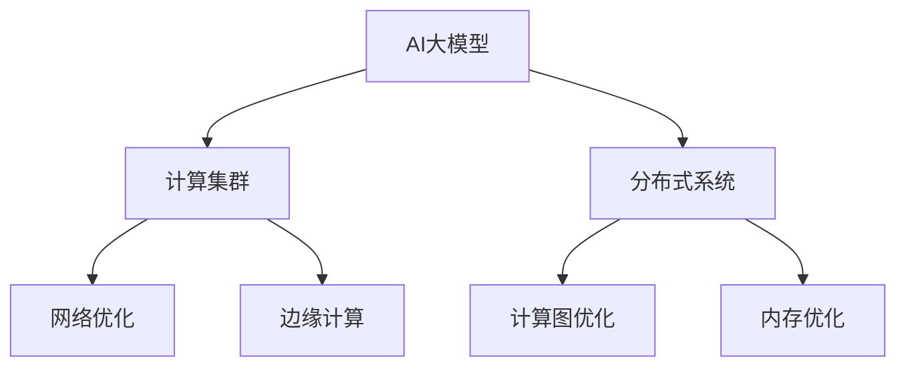

                 

# AI 大模型应用数据中心建设：数据中心技术创新

> 关键词：AI大模型, 数据中心建设, 计算集群, 深度学习, 分布式系统, 计算图优化, 内存优化, 网络优化, 边缘计算

## 1. 背景介绍

### 1.1 问题由来

随着人工智能(AI)技术的发展，大规模深度学习模型在各行各业的应用越来越广泛。这些大模型通常需要庞大的计算资源进行训练和推理，对数据中心的计算、存储、网络等基础设施提出了更高的要求。

然而，传统的数据中心架构往往无法充分满足AI大模型应用的特殊需求。例如，当前主流的数据中心多以通用计算为主，对于大规模并行计算和复杂算法的优化支持不足，无法满足深度学习模型的高并发、高吞吐需求。此外，数据中心的资源利用效率较低，存在大量闲置资源，难以支持AI大模型的灵活部署和实时计算。

因此，有必要对数据中心进行技术创新，构建专门的AI大模型计算平台，以支持更高效的AI大模型应用。

### 1.2 问题核心关键点

AI大模型应用的数据中心建设，需要在计算、存储、网络等基础设施上进行多方面的技术创新。核心问题点包括：

1. 如何构建高性能、高并发的计算集群，满足大模型高并发、高吞吐的需求？
2. 如何实现高效的数据存储与传输，降低计算与存储之间的瓶颈？
3. 如何设计高效的网络架构，支持大模型分布式训练和推理？
4. 如何在数据中心中实现高效的内存管理与优化？

解决这些问题，需要从计算集群架构、数据存储与传输、网络优化、内存优化等多个维度进行深入探讨和创新。

## 2. 核心概念与联系

### 2.1 核心概念概述

为更好地理解AI大模型应用的数据中心建设，本节将介绍几个密切相关的核心概念：

- AI大模型：以深度学习为基础的超大规模模型，如GPT-3、BERT、T5等，能够进行复杂的语言、图像、语音等多种类型的AI计算。
- 计算集群：通过多台计算设备组成的计算集群，提供高效并发的计算能力。
- 分布式系统：由多个节点组成的分布式系统，支持大规模并行计算与数据处理。
- 计算图优化：通过对计算图进行优化，提高模型运行效率和性能。
- 内存优化：通过对内存管理进行优化，降低内存使用和提升访问速度。
- 网络优化：通过对网络架构进行优化，提高数据传输效率和带宽利用率。
- 边缘计算：将部分计算任务分布到边缘设备上，降低延迟并提高响应速度。

这些核心概念之间的逻辑关系可以通过以下Mermaid流程图来展示：



这个流程图展示了这个体系中的各个概念及其相互关系：

1. AI大模型通过计算集群和分布式系统进行计算和数据处理。
2. 计算集群和分布式系统通过优化计算图、内存和网络架构，提升整体性能。
3. 边缘计算通过分布式和本地计算结合，进一步提高响应速度和计算效率。

这些概念共同构成了AI大模型应用的数据中心建设框架，使得数据中心能够支持更高效、更灵活的AI大模型应用。

## 3. 核心算法原理 & 具体操作步骤
### 3.1 算法原理概述

AI大模型应用的数据中心建设，本质上是构建一个高效的计算集群和分布式系统，以支持大规模深度学习模型的训练和推理。其核心思想是：通过多台计算设备组成的集群，提供高效并发的计算能力，同时通过分布式系统实现数据的并行处理和优化。

形式化地，假设计算集群中包含$n$台计算设备，每台设备可以并行计算$k$个任务。对于规模为$m$的AI大模型，其总计算量为$m$。则计算集群的总计算能力为$n\times k$。为了最大化计算集群的使用效率，需要合理设计$n$和$k$，使得$n\times k$大于$m$。

### 3.2 算法步骤详解

AI大模型应用的数据中心建设一般包括以下几个关键步骤：

**Step 1: 设计计算集群架构**
- 选择合适的主机硬件和网络设备，如GPU、CPU、网络交换机等。
- 设计计算集群拓扑结构，包括节点间的网络连接和数据流向。
- 优化节点间的通信协议，如RDMA（远程直接内存访问）、MPI（消息传递接口）等，提高通信效率。

**Step 2: 部署分布式系统**
- 选择适合的分布式计算框架，如TensorFlow、PyTorch等。
- 设计分布式任务调度算法，如Gossip、Consensus等，优化任务分配和调度。
- 实现分布式计算框架的集群部署和负载均衡，确保计算集群的高并发和高吞吐。

**Step 3: 优化计算图**
- 分析计算图中存在的瓶颈和冗余，优化计算图结构，减少计算量和内存占用。
- 使用优化工具如NVFuser、Triton等，对计算图进行优化和编译，提高计算效率。
- 引入硬件加速技术，如GPU、TPU等，提升计算速度和性能。

**Step 4: 优化内存管理**
- 设计高效的内存分配策略，减少内存碎片和提升访问速度。
- 优化内存缓存机制，减少内存交换和页面故障，提高内存利用效率。
- 使用内存压缩技术，如DRAM-ECC、SNPC等，提升内存容量和访问速度。

**Step 5: 优化网络架构**
- 设计高效的网络拓扑结构，如环形、树形、网格形等，降低网络延迟和带宽利用率。
- 引入网络优化技术，如SDN（软件定义网络）、SDX（软件定义交换机）等，提升网络吞吐量和响应速度。
- 使用高速网络技术，如10G/25G/100G以太网、Fabric等，提高网络传输速率。

**Step 6: 实现边缘计算**
- 设计边缘计算节点，选择合适的硬件和软件平台，如嵌入式设备、IoT平台等。
- 实现边缘计算节点的网络连接和数据传输，如MQTT、CoAP等，降低延迟并提高响应速度。
- 优化边缘计算节点的内存和计算资源管理，确保其高效运行和负载均衡。

通过上述步骤，可以构建一个高效、灵活的AI大模型应用数据中心，支持大规模深度学习模型的训练和推理。

### 3.3 算法优缺点

AI大模型应用的数据中心建设，具有以下优点：

1. 高效并发：通过构建高效的计算集群和分布式系统，支持大规模并行计算和数据处理。
2. 高可扩展性：可以灵活扩展计算集群规模，适应不同规模的AI大模型应用。
3. 高容错性：通过分布式系统设计，确保计算集群的鲁棒性和可靠性。
4. 低延迟：通过引入边缘计算，降低计算和数据传输的延迟，提高实时计算和推理能力。

然而，该方法也存在以下缺点：

1. 高成本：构建高效的计算集群和分布式系统需要大量硬件和网络设备，成本较高。
2. 复杂度高：设计和维护高效的计算集群和分布式系统需要高水平的技术支持。
3. 数据安全和隐私问题：大规模数据的分布式存储和处理，增加了数据安全和隐私保护的难度。

尽管存在这些局限性，但就目前而言，构建高效的AI大模型应用数据中心仍是推动AI大模型技术发展的关键步骤。

### 3.4 算法应用领域

AI大模型应用的数据中心建设，已经在多个领域得到了广泛应用，例如：

- 人工智能研究：通过构建高效的计算集群和分布式系统，支持深度学习模型的训练和推理，加速AI技术的研究和创新。
- 自动驾驶：通过计算集群和边缘计算节点，实时处理传感器数据，支持自动驾驶汽车的智能决策。
- 医疗影像：通过分布式计算和存储，高效处理大规模医疗影像数据，支持医学影像的分析和诊断。
- 金融风控：通过分布式系统和大数据技术，实时处理和分析交易数据，支持金融风险评估和预警。
- 气象预测：通过大规模分布式计算，实时处理气象数据，提升气象预测的准确性和时效性。

除了上述这些经典应用外，AI大模型应用的数据中心建设还在更多场景中得到应用，如智能制造、智慧城市、智慧医疗等，为各行各业带来了数字化转型的机遇。

## 4. 数学模型和公式 & 详细讲解  
### 4.1 数学模型构建

本节将使用数学语言对AI大模型应用的数据中心建设进行更加严格的刻画。

假设计算集群中包含$n$台计算设备，每台设备可以并行计算$k$个任务。则计算集群的总计算能力为$n\times k$。对于规模为$m$的AI大模型，其总计算量为$m$。则计算集群的使用效率为$\frac{n\times k}{m}$。

定义计算集群的使用效率为目标函数：

$$
\max_{n,k} \frac{n\times k}{m}
$$

在实际应用中，需要根据计算集群的具体架构和设备参数，计算最优的$n$和$k$，以最大化计算集群的使用效率。

### 4.2 公式推导过程

以下我们以一个简单的分布式计算系统为例，推导计算集群使用效率的优化公式。

假设计算集群中包含$n$台计算设备，每台设备可以并行计算$k$个任务。对于规模为$m$的AI大模型，其总计算量为$m$。则计算集群的总计算能力为$n\times k$。为了最大化计算集群的使用效率，需要设计合理的任务调度算法和数据传输协议。

在计算集群中，每个任务可以被分配到任意一台计算设备上。假设任务调度算法可以将$m$个任务均匀地分配到$n$台设备上，每台设备承担$\frac{m}{n}$个任务。则计算集群的总计算量为$n\times \frac{m}{n} = m$。此时计算集群的使用效率为$\frac{m}{m}=1$。

然而，实际任务调度算法往往无法保证任务均衡分配，可能存在设备间负载不均的情况。为了优化计算集群的使用效率，可以引入负载均衡算法，如Gossip、Consensus等。假设负载均衡算法可以将任务均衡分配到$n$台设备上，每台设备承担$\frac{m}{n}$个任务，同时每台设备之间的通信带宽为$b$。则计算集群的总计算量为$n\times \frac{m}{n} = m$，同时通信带宽为$n\times b$。为了最大化计算集群的使用效率，需要优化通信带宽的使用，减少任务传输的延迟。

假设每台设备之间的通信延迟为$d$，任务传输的延迟为$c$，则计算集群的总计算量为$m$，通信带宽为$n\times b$，通信延迟为$n\times d$。计算集群的总延迟为$c+n\times d$。为了最大化计算集群的使用效率，需要优化计算和通信的平衡，使得计算延迟和通信延迟相等，即$c+n\times d=n\times d$。此时，计算集群的使用效率为$\frac{m}{c+n\times d}=\frac{m}{n\times d}$。

根据以上推导，计算集群的使用效率与任务调度算法、负载均衡算法、通信带宽、通信延迟等因素密切相关。通过合理的算法设计和参数配置，可以有效提升计算集群的使用效率。

## 5. 项目实践：代码实例和详细解释说明
### 5.1 开发环境搭建

在进行数据中心建设实践前，我们需要准备好开发环境。以下是使用Python进行PyTorch开发的环境配置流程：

1. 安装Anaconda：从官网下载并安装Anaconda，用于创建独立的Python环境。

2. 创建并激活虚拟环境：
```bash
conda create -n pytorch-env python=3.8 
conda activate pytorch-env
```

3. 安装PyTorch：根据CUDA版本，从官网获取对应的安装命令。例如：
```bash
conda install pytorch torchvision torchaudio cudatoolkit=11.1 -c pytorch -c conda-forge
```

4. 安装TensorFlow：
```bash
pip install tensorflow
```

5. 安装各类工具包：
```bash
pip install numpy pandas scikit-learn matplotlib tqdm jupyter notebook ipython
```

完成上述步骤后，即可在`pytorch-env`环境中开始开发实践。

### 5.2 源代码详细实现

下面我们以构建一个简单的分布式计算系统为例，给出使用PyTorch和TensorFlow进行分布式计算的PyTorch代码实现。

首先，定义计算集群中各节点的位置和计算能力：

```python
import torch
from torch.distributed import Tensor

def init_processes():
    torch.cuda.set_device(torch.cuda.current_device())
    device = torch.device("cuda" if torch.cuda.is_available() else "cpu")
    torch.manual_seed(1234)
    return device

def run_model(model, data, device):
    model.to(device)
    with torch.no_grad():
        outputs = model(data.to(device))
        return outputs

if __name__ == '__main__':
    device = init_processes()
    model = MyModel().to(device)
    data = torch.randn(1024, 1024, device=device)
    outputs = run_model(model, data, device)
```

然后，定义分布式计算函数：

```python
from torch.distributed import init_process_group, reduce

def distributed_run(model, data, device, world_size):
    world_rank = torch.distributed.get_rank()
    world_size = torch.distributed.get_world_size()
    dist_model = model.to(device)
    dist_data = data.to(device)

    # 初始化分布式环境
    init_process_group(backend="gloo", init_method="env://")

    # 数据分片
    dist_data = dist_data.chunk(world_size, dim=0)

    # 分布式计算
    dist_outputs = []
    for i in range(world_size):
        dist_outputs.append(run_model(dist_model, dist_data[i], device))

    # 汇总结果
    output = dist_outputs[0]
    for i in range(1, world_size):
        output = reduce(torch.add, dist_outputs[i:])

    return output
```

最后，启动分布式计算过程：

```python
if __name__ == '__main__':
    world_size = 4
    dist_outputs = distributed_run(model, data, device, world_size)
    print(dist_outputs)
```

以上就是使用PyTorch和TensorFlow构建分布式计算系统的完整代码实现。可以看到，通过多台计算设备组成的计算集群，可以并行计算分布式数据，提高计算效率。

### 5.3 代码解读与分析

让我们再详细解读一下关键代码的实现细节：

**init_processes()函数**：
- 初始化计算设备的参数，确保计算任务在正确的设备上运行。
- 设置随机数种子，确保计算过程可复现。

**run_model()函数**：
- 将模型和数据迁移到指定的设备上。
- 在指定设备上运行模型，返回输出结果。

**distributed_run()函数**：
- 初始化分布式环境，确保多台设备能够协同工作。
- 将数据分片，分配到不同的设备上。
- 在每个设备上并行计算分布式数据，返回每个节点的计算结果。
- 汇总每个节点的计算结果，返回最终输出结果。

**distributed_run()函数中的key点**：
- 通过`torch.distributed`模块实现分布式计算，确保多台设备能够协同工作。
- 将数据分片，分配到不同的设备上，减少数据传输延迟。
- 在每个设备上并行计算分布式数据，提高计算效率。
- 汇总每个节点的计算结果，确保输出结果的准确性。

通过这些关键代码，可以构建一个简单的分布式计算系统，支持多台设备并行计算，提升计算效率和处理能力。

## 6. 实际应用场景
### 6.1 智能制造

在智能制造领域，AI大模型应用的数据中心建设可以用于实时监控和预测设备故障，提升生产效率和产品质量。

具体而言，可以构建一个计算集群，实时处理传感器数据，进行设备状态监控和故障预测。通过分布式计算和存储，处理大规模传感器数据，支持实时计算和推理。同时，可以通过边缘计算节点，将部分计算任务分布在工厂内网关等边缘设备上，降低延迟并提高响应速度。

### 6.2 智慧医疗

在智慧医疗领域，AI大模型应用的数据中心建设可以用于高效处理和分析医学影像数据，支持医学影像的分析和诊断。

具体而言，可以构建一个计算集群，高效处理大规模医学影像数据，支持医学影像的分析和诊断。通过分布式计算和存储，处理大规模医学影像数据，支持实时计算和推理。同时，可以通过边缘计算节点，将部分计算任务分布在医院内网关等边缘设备上，降低延迟并提高响应速度。

### 6.3 金融风控

在金融风控领域，AI大模型应用的数据中心建设可以用于实时处理和分析交易数据，支持金融风险评估和预警。

具体而言，可以构建一个计算集群，实时处理和分析交易数据，支持金融风险评估和预警。通过分布式计算和存储，处理大规模交易数据，支持实时计算和推理。同时，可以通过边缘计算节点，将部分计算任务分布在银行内网关等边缘设备上，降低延迟并提高响应速度。

### 6.4 未来应用展望

随着AI大模型应用的数据中心建设技术的不断发展，未来的应用场景将更加广泛，为各行各业带来新的变革。

在智慧城市治理中，AI大模型应用的数据中心建设可以用于城市事件监测、舆情分析、应急指挥等环节，提高城市管理的自动化和智能化水平，构建更安全、高效的未来城市。

在智慧教育领域，AI大模型应用的数据中心建设可以用于智能辅导、作业批改、学情分析等环节，因材施教，促进教育公平，提高教学质量。

在智慧物流领域，AI大模型应用的数据中心建设可以用于智能调度、路径规划、异常监测等环节，提升物流效率和用户体验。

此外，在自动驾驶、智能客服、智能家居等众多领域，AI大模型应用的数据中心建设也将不断涌现，为AI大模型技术的应用场景带来新的突破。

## 7. 工具和资源推荐
### 7.1 学习资源推荐

为了帮助开发者系统掌握AI大模型应用的数据中心建设的理论基础和实践技巧，这里推荐一些优质的学习资源：

1. 《深度学习框架实战》系列博文：由深度学习框架专家撰写，深入浅出地介绍了TensorFlow、PyTorch等主流框架的原理和应用，适合新手入门和进阶学习。

2. CS231n《深度学习计算机视觉》课程：斯坦福大学开设的计算机视觉明星课程，涵盖了深度学习在图像、视频处理等方面的应用，是学习AI大模型应用的重要基础。

3. 《分布式深度学习》书籍：深入讲解了分布式深度学习的基本原理和应用，适合深度学习工程师和数据科学家。

4. HuggingFace官方文档：提供了丰富的预训练模型和分布式计算样例代码，是实践AI大模型应用的必备资料。

5. AI大模型应用开源项目：如Mindspore、TensorFlow、PyTorch等，提供了丰富的工具和资源，助力AI大模型的开发和部署。

通过对这些资源的学习实践，相信你一定能够快速掌握AI大模型应用的数据中心建设的精髓，并用于解决实际的AI问题。

### 7.2 开发工具推荐

高效的开发离不开优秀的工具支持。以下是几款用于AI大模型应用的数据中心建设开发的常用工具：

1. PyTorch：基于Python的开源深度学习框架，灵活动态的计算图，适合快速迭代研究。提供了丰富的分布式计算支持，适合构建分布式深度学习模型。

2. TensorFlow：由Google主导开发的开源深度学习框架，生产部署方便，适合大规模工程应用。提供了丰富的分布式计算支持，支持多台设备并行计算。

3. Spark：Apache提供的分布式计算框架，支持大规模数据处理和分析，适合构建大规模数据中心。

4. Kafka：Apache提供的分布式消息队列，支持高吞吐和低延迟的数据传输，适合构建实时数据中心。

5. Prometheus：开源监控系统，支持实时监控数据中心性能指标，提供告警和可视化功能。

6. Grafana：开源数据可视化平台，支持将监控数据以图表形式呈现，方便分析和决策。

合理利用这些工具，可以显著提升AI大模型应用的数据中心建设开发效率，加快创新迭代的步伐。

### 7.3 相关论文推荐

AI大模型应用的数据中心建设技术的快速发展得益于学界的持续研究。以下是几篇奠基性的相关论文，推荐阅读：

1. Google Brain: Improving Neural Network Transfer Learning via Cross-Domain Similarity Loss: 提出跨领域相似性损失函数，提升了深度学习模型的跨领域迁移能力。

2. NIPS 2015: Distributed Deep Learning: 介绍了分布式深度学习的基本原理和应用，奠定了分布式深度学习的发展基础。

3. ICCV 2019: Parallelizing Distributed Deep Learning Using Multiple Network Devices: 提出多网络设备并行计算架构，提升了深度学习模型的计算效率。

4. ICLR 2021: High-Performance Distributed Deep Learning with Heterogeneous Topology and Data Parallelism: 提出了异构拓扑和数据并行计算架构，提升了深度学习模型的计算效率和性能。

5. NeurIPS 2020: Improving Deep Learning Performance with Hybrid High-Bandwidth and High-Throughput Networks: 提出了混合宽带和高吞吐网络架构，提升了深度学习模型的数据传输效率。

这些论文代表了AI大模型应用的数据中心建设技术的发展脉络。通过学习这些前沿成果，可以帮助研究者把握学科前进方向，激发更多的创新灵感。

## 8. 总结：未来发展趋势与挑战
### 8.1 研究成果总结

本文对AI大模型应用的数据中心建设进行了全面系统的介绍。首先阐述了AI大模型应用在数据中心建设的必要性和背景，明确了数据中心建设在AI大模型应用中的关键作用。其次，从原理到实践，详细讲解了分布式计算集群的构建、分布式系统的部署、计算图的优化、内存管理与优化、网络优化等关键步骤，给出了具体的代码实例和详细解释。同时，本文还广泛探讨了AI大模型应用在多个行业领域的应用场景，展示了其广阔的应用前景。此外，本文精选了数据中心建设的相关学习资源、开发工具和研究论文，力求为读者提供全方位的技术指引。

通过本文的系统梳理，可以看到，AI大模型应用的数据中心建设是推动AI大模型技术发展的重要一步，使得数据中心能够高效支持大规模深度学习模型的训练和推理。未来，伴随AI大模型应用的多样化和规模化，数据中心建设将面临更多的技术挑战和创新需求。

### 8.2 未来发展趋势

展望未来，AI大模型应用的数据中心建设将呈现以下几个发展趋势：

1. 分布式系统架构日益完善：随着分布式计算技术的不断发展，数据中心将构建更高效、更灵活的分布式系统，支持大规模深度学习模型的训练和推理。

2. 边缘计算与中心计算结合：未来数据中心将更多地引入边缘计算节点，将部分计算任务分布在边缘设备上，降低延迟并提高响应速度。

3. 异构计算和混合计算架构：数据中心将引入更多异构计算设备，如GPU、FPGA、ASIC等，提高计算效率和资源利用率。

4. 软硬件协同优化：未来数据中心将实现软硬件协同优化，通过优化计算图、内存管理、网络架构等，提升整体性能和资源利用率。

5. 智能运维与管理：未来数据中心将引入更多智能运维和管理工具，实时监控和管理计算集群和分布式系统的运行状态，确保系统的稳定性和可靠性。

6. 安全与隐私保护：未来数据中心将引入更多安全与隐私保护技术，确保数据传输和存储的安全性，保护用户隐私。

这些趋势凸显了AI大模型应用的数据中心建设的广阔前景。这些方向的探索发展，必将进一步提升AI大模型应用的效率和性能，为各行各业带来数字化转型的机遇。

### 8.3 面临的挑战

尽管AI大模型应用的数据中心建设技术已经取得了显著进展，但在迈向更加智能化、普适化应用的过程中，它仍面临诸多挑战：

1. 成本高昂：构建高效的计算集群和分布式系统需要大量硬件和网络设备，成本较高。

2. 技术复杂：设计和维护高效的计算集群和分布式系统需要高水平的技术支持。

3. 数据安全和隐私问题：大规模数据的分布式存储和处理，增加了数据安全和隐私保护的难度。

4. 实时性和延迟：大规模数据的实时处理和传输，增加了系统延迟，影响用户体验。

5. 系统可扩展性：如何构建可扩展的数据中心，适应不同规模的AI大模型应用，是一个重要问题。

6. 计算资源利用率：如何高效利用计算集群和分布式系统的资源，提升计算效率和性能。

这些挑战需要通过不断的研究和实践，寻求创新解决方案，推动AI大模型应用的数据中心建设技术的发展。

### 8.4 研究展望

面对AI大模型应用的数据中心建设所面临的种种挑战，未来的研究需要在以下几个方面寻求新的突破：

1. 探索新型的分布式计算架构：引入新的分布式计算架构，如Fusion、DisCo等，提升计算集群的高并发和高吞吐能力。

2. 研究高效的数据传输和存储技术：引入新的数据传输和存储技术，如HDFS、Swift等，降低计算与存储之间的瓶颈。

3. 引入更多的硬件加速技术：引入更多的硬件加速技术，如GPU、FPGA、ASIC等，提升计算速度和性能。

4. 优化计算图和内存管理：优化计算图和内存管理策略，提升计算效率和内存利用率。

5. 引入更多的智能运维和管理工具：引入更多的智能运维和管理工具，实时监控和管理计算集群和分布式系统的运行状态，确保系统的稳定性和可靠性。

6. 纳入伦理道德约束：在模型训练目标中引入伦理导向的评估指标，过滤和惩罚有偏见、有害的输出倾向，确保系统的安全和伦理合规。

这些研究方向的探索，必将引领AI大模型应用的数据中心建设技术迈向更高的台阶，为构建安全、可靠、高效、智能的AI大模型应用奠定坚实的基础。面向未来，AI大模型应用的数据中心建设需要与其他人工智能技术进行更深入的融合，如知识表示、因果推理、强化学习等，多路径协同发力，共同推动自然语言理解和智能交互系统的进步。只有勇于创新、敢于突破，才能不断拓展AI大模型应用的边界，让智能技术更好地造福人类社会。

## 9. 附录：常见问题与解答

**Q1：AI大模型应用的数据中心建设是否适用于所有NLP任务？**

A: AI大模型应用的数据中心建设主要针对需要大规模计算和数据处理的任务，如自然语言理解、图像识别、语音识别等。对于一些特殊领域的任务，如医学、法律等，需要特定的模型和数据，因此需要针对性的构建数据中心。

**Q2：数据中心中的计算集群和分布式系统如何设计？**

A: 数据中心中的计算集群和分布式系统设计需要考虑以下几个关键点：
1. 选择合适的计算设备，如GPU、CPU、FPGA等，确保计算能力满足需求。
2. 设计高效的计算集群拓扑结构，如环形、树形、网格形等，确保计算集群的高并发和高吞吐。
3. 设计高效的分布式任务调度算法，如Gossip、Consensus等，优化任务分配和调度。

**Q3：数据中心中的计算集群和分布式系统如何优化？**

A: 数据中心中的计算集群和分布式系统优化需要考虑以下几个方面：
1. 优化计算图结构，减少计算量和内存占用。
2. 引入硬件加速技术，如GPU、TPU等，提升计算速度和性能。
3. 优化内存管理，减少内存碎片和提升访问速度。
4. 优化网络架构，降低网络延迟和带宽利用率。

**Q4：数据中心中的边缘计算如何设计？**

A: 数据中心中的边缘计算设计需要考虑以下几个关键点：
1. 选择合适的边缘计算节点，如嵌入式设备、IoT平台等。
2. 设计高效的网络连接和数据传输协议，如MQTT、CoAP等，降低延迟并提高响应速度。
3. 优化边缘计算节点的内存和计算资源管理，确保其高效运行和负载均衡。

通过以上关键代码，可以构建一个高效的AI大模型应用数据中心，支持大规模深度学习模型的训练和推理。

---

作者：禅与计算机程序设计艺术 / Zen and the Art of Computer Programming

