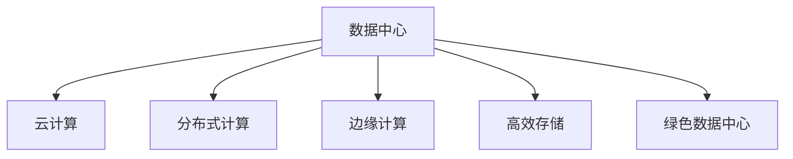

                 

# AI 大模型应用数据中心建设：数据中心未来发展趋势

> 关键词：大模型应用, 数据中心, 分布式计算, 人工智能, 云计算, 边缘计算, 高效存储, 绿色数据中心

## 1. 背景介绍

### 1.1 问题由来

随着人工智能（AI）和机器学习（ML）技术的迅猛发展，大型AI模型的需求急剧增加。这些模型，通常被称为大模型（Large Models），包括语言模型、视觉模型和生成模型等，已经广泛应用于自然语言处理（NLP）、计算机视觉（CV）、自动驾驶、医疗诊断等领域，为各种应用提供了强大的技术支撑。

然而，大模型需要海量的计算资源和存储资源来训练和推理，这对数据中心的硬件和软件架构提出了严峻的挑战。如何高效地构建和管理这些数据中心，以支持大规模AI模型的应用，成为当前IT行业的一个重要课题。

### 1.2 问题核心关键点

当前，数据中心在AI大模型的应用中面临的主要问题包括：

- **计算资源和存储资源的需求急剧增长**：大模型的训练和推理需要大量的计算和存储资源，这对数据中心的硬件配置提出了极高的要求。
- **数据中心的管理和运维成本高**：随着数据中心规模的扩大，管理和运维成本也在增加，如何在规模化和可控成本之间找到平衡，成为一大挑战。
- **数据中心的环境和能耗问题**：大规模计算会带来显著的能耗问题，如何在提升计算能力的同时，降低能耗和环境污染，也是亟待解决的问题。
- **数据中心的数据安全与隐私保护**：在AI模型中，数据隐私和安全性至关重要，如何在数据传输和存储过程中保证数据安全，是一个重要问题。

### 1.3 问题研究意义

研究和构建高效、可扩展、环保、安全的数据中心，对于支持AI大模型的应用，具有重要的意义：

- **提升AI模型的性能和效率**：通过优化数据中心的硬件和软件架构，可以显著提升AI模型的计算和存储能力，加速模型的训练和推理。
- **降低数据中心的运营成本**：通过高效管理和运维，可以降低数据中心的能耗和维护成本，提升投资回报率。
- **推动数据中心的技术创新**：数据中心技术的不断进步，可以带来新的计算和存储技术，进一步推动AI模型的发展和应用。
- **保障数据安全与隐私**：通过先进的数据加密和安全技术，可以保护用户数据的安全和隐私，增强用户信任。

## 2. 核心概念与联系

### 2.1 核心概念概述

为更好地理解数据中心在AI大模型应用中的作用和挑战，本节将介绍几个关键概念：

- **数据中心（Data Center, DC）**：提供计算、存储、网络、安全等服务的物理设施，是AI模型应用的基础设施。
- **云计算（Cloud Computing）**：通过互联网提供计算和存储服务，支持大规模分布式计算和存储需求。
- **分布式计算（Distributed Computing）**：通过多台计算机协同工作，提高计算能力和性能。
- **边缘计算（Edge Computing）**：在靠近数据源的地方进行计算，减少网络延迟，提高数据处理效率。
- **高效存储（High-Efficiency Storage）**：通过先进的存储技术和架构，提高存储容量和访问速度。
- **绿色数据中心（Green Data Center）**：采用环保技术和节能措施，减少数据中心能耗和环境污染。

这些核心概念之间的关系可以通过以下Mermaid流程图来展示：



这个流程图展示了大模型应用中数据中心的各个关键组件及其相互作用：

1. **数据中心**是AI模型的基础，提供计算、存储、网络等服务。
2. **云计算**通过互联网提供服务，支持大规模分布式计算和存储。
3. **分布式计算**通过多台计算机协同工作，提升计算能力和效率。
4. **边缘计算**在靠近数据源的地方进行计算，提高数据处理效率。
5. **高效存储**通过先进存储技术和架构，提高存储容量和访问速度。
6. **绿色数据中心**采用环保技术和节能措施，减少数据中心能耗和环境污染。

这些概念共同构成了数据中心的运行框架，使其能够高效支持大规模AI模型的应用。

## 3. 核心算法原理 & 具体操作步骤

### 3.1 算法原理概述

构建支持AI大模型应用的数据中心，本质上是一个综合性的系统工程，涉及计算、存储、网络、安全等多个方面的技术和架构。其核心思想是：通过先进的技术手段，构建一个高效、可扩展、环保、安全的数据中心，以支持大规模AI模型的训练和推理。

形式化地，假设一个数据中心的计算资源为 $C$，存储资源为 $S$，带宽资源为 $B$，能耗为 $E$，安全性为 $S_{\text{security}}$。数据中心的优化目标是最小化能耗 $E$，同时最大化计算能力 $C$、存储容量 $S$ 和安全性 $S_{\text{security}}$。

通过梯度下降等优化算法，数据中心的优化过程不断更新资源配置，最小化能耗 $E$，同时满足计算、存储和安全性要求。这种优化过程可以通过以下公式表示：

$$
\mathcal{L}(D) = E + \lambda_1 (C - C_{\text{target}}) + \lambda_2 (S - S_{\text{target}}) + \lambda_3 (B - B_{\text{target}}) + \lambda_4 (S_{\text{security}} - S_{\text{security}}_{\text{target}})
$$

其中，$\lambda_1, \lambda_2, \lambda_3, \lambda_4$ 为正则化系数，用于平衡各项指标的重要性。$C_{\text{target}}, S_{\text{target}}, B_{\text{target}}, S_{\text{security}}_{\text{target}}$ 分别为计算能力、存储容量、带宽资源和安全性目标值。

### 3.2 算法步骤详解

构建支持AI大模型应用的数据中心，一般包括以下几个关键步骤：

**Step 1: 需求分析与规划**
- 确定AI模型的规模、性能要求和数据量需求，以及数据中心的计算、存储和带宽要求。
- 分析数据中心的环境、能耗和安全需求，制定数据中心的总体规划。

**Step 2: 硬件配置与选型**
- 选择合适的服务器、存储设备、网络设备等硬件设备，以满足计算、存储和带宽需求。
- 采用分布式计算架构，提高计算能力和效率。
- 引入边缘计算设备，支持靠近数据源的计算需求。

**Step 3: 软件架构与部署**
- 设计数据中心的软件架构，包括操作系统、中间件、数据库等组件，支持AI模型的运行。
- 引入高效存储技术，如SSD、NVMe等，提高存储容量和访问速度。
- 部署安全协议和加密技术，保护数据中心的安全性。

**Step 4: 优化与测试**
- 对数据中心的各个组件进行优化，如服务器性能调优、存储性能提升、网络优化等。
- 进行负载测试和压力测试，评估数据中心的稳定性和扩展性。
- 根据测试结果，调整数据中心配置，提升整体性能。

**Step 5: 运维与管理**
- 建立数据中心的运维体系，包括监控、备份、故障处理等。
- 制定数据中心的能耗管理策略，如节能措施、环境控制等。
- 定期更新和维护数据中心的软件和硬件，确保其长期稳定运行。

### 3.3 算法优缺点

支持AI大模型应用的数据中心，具有以下优点：
1. 高效计算和存储：通过分布式计算和高效存储技术，支持大规模AI模型的训练和推理，提高计算和存储能力。
2. 高扩展性：通过云计算和边缘计算，支持数据中心规模的动态扩展，适应不同应用场景的需求。
3. 环保节能：采用先进能效技术和环保措施，降低数据中心的能耗和环境污染。
4. 数据安全与隐私保护：通过数据加密和安全协议，保障用户数据的安全和隐私。

同时，该数据中心也存在一定的局限性：
1. 初始投资成本高：建设大规模数据中心需要较高的初始投资，资金和资源需求较大。
2. 管理和运维复杂：数据中心的规模化和复杂化，增加了管理和运维的难度和成本。
3. 依赖网络带宽：数据中心需要依赖高速网络带宽，网络带宽的稳定性直接影响数据中心性能。
4. 风险和故障：大规模数据中心容易受到网络攻击、自然灾害等风险的影响，存在故障风险。

尽管存在这些局限性，但就目前而言，构建支持AI大模型应用的数据中心，仍然是支持AI技术发展的关键步骤。未来相关研究的重点在于如何进一步降低数据中心的初始投资成本，提高数据中心的扩展性和运维效率，同时兼顾环保和安全。

### 3.4 算法应用领域

支持AI大模型应用的数据中心，在多个领域得到了广泛的应用，例如：

- **人工智能研究**：数据中心为AI研究提供了强大的计算和存储能力，支持大规模模型的训练和推理。
- **云计算服务**：数据中心通过云计算技术，提供各种AI模型服务，支持企业快速构建AI应用。
- **智能制造**：数据中心为智能制造提供数据采集、分析和决策支持，推动制造业数字化转型。
- **智慧城市**：数据中心为智慧城市提供数据整合、分析和决策支持，提升城市管理效率和智能化水平。
- **医疗健康**：数据中心为医疗健康提供数据存储、分析和决策支持，提升医疗服务质量和效率。
- **金融服务**：数据中心为金融服务提供数据处理、分析和决策支持，提升金融服务智能化水平。
- **教育培训**：数据中心为教育培训提供数据处理、分析和决策支持，推动教育智能化和个性化。

这些领域的应用，展示了数据中心在支持AI大模型方面的广泛价值和潜力。

## 4. 数学模型和公式 & 详细讲解 & 举例说明

### 4.1 数学模型构建

本节将使用数学语言对支持AI大模型应用的数据中心的优化过程进行更加严格的刻画。

假设数据中心的计算资源为 $C$，存储资源为 $S$，带宽资源为 $B$，能耗为 $E$，安全性为 $S_{\text{security}}$。优化目标是最小化能耗 $E$，同时最大化计算能力 $C$、存储容量 $S$ 和安全性 $S_{\text{security}}$。

定义数据中心的优化目标函数为：

$$
\mathcal{L}(D) = E + \lambda_1 (C - C_{\text{target}}) + \lambda_2 (S - S_{\text{target}}) + \lambda_3 (B - B_{\text{target}}) + \lambda_4 (S_{\text{security}} - S_{\text{security}}_{\text{target}})
$$

其中，$\lambda_1, \lambda_2, \lambda_3, \lambda_4$ 为正则化系数，用于平衡各项指标的重要性。$C_{\text{target}}, S_{\text{target}}, B_{\text{target}}, S_{\text{security}}_{\text{target}}$ 分别为计算能力、存储容量、带宽资源和安全性目标值。

### 4.2 公式推导过程

以下我们以数据中心的能耗优化为例，推导其数学模型和优化算法。

假设数据中心的能耗 $E$ 由计算能耗 $E_C$、存储能耗 $E_S$ 和网络能耗 $E_B$ 组成，即 $E = E_C + E_S + E_B$。

- **计算能耗 $E_C$**：与计算资源的平方成正比，即 $E_C = k_C \cdot C^2$。
- **存储能耗 $E_S$**：与存储资源的平方成正比，即 $E_S = k_S \cdot S^2$。
- **网络能耗 $E_B$**：与带宽资源的平方成正比，即 $E_B = k_B \cdot B^2$。

其中，$k_C, k_S, k_B$ 为能耗系数，与硬件设备类型和运行环境有关。

目标是最小化能耗 $E$，即：

$$
\min_{C, S, B} E = \min_{C, S, B} (k_C \cdot C^2 + k_S \cdot S^2 + k_B \cdot B^2)
$$

这是一个典型的二次规划问题，可以通过拉格朗日乘数法求解。定义拉格朗日函数：

$$
\mathcal{L}_{\lambda} (C, S, B, \lambda_1, \lambda_2, \lambda_3, \lambda_4) = k_C \cdot C^2 + k_S \cdot S^2 + k_B \cdot B^2 + \lambda_1 (C - C_{\text{target}}) + \lambda_2 (S - S_{\text{target}}) + \lambda_3 (B - B_{\text{target}}) + \lambda_4 (S_{\text{security}} - S_{\text{security}}_{\text{target}})
$$

对 $C, S, B$ 求偏导，得到以下方程组：

$$
\begin{cases}
2k_C \cdot C + \lambda_1 = 0 \\
2k_S \cdot S + \lambda_2 = 0 \\
2k_B \cdot B + \lambda_3 = 0 \\
C_{\text{target}} - \lambda_1 = 0 \\
S_{\text{target}} - \lambda_2 = 0 \\
B_{\text{target}} - \lambda_3 = 0 \\
S_{\text{security}}_{\text{target}} - \lambda_4 = 0
\end{cases}
$$

解方程组，即可得到数据中心的最优资源配置。

### 4.3 案例分析与讲解

假设某数据中心需要支持一个深度学习模型训练，该模型需要 $C_{\text{target}} = 100\,TFLOPS$ 的计算能力、$S_{\text{target}} = 100\,TB$ 的存储容量和 $B_{\text{target}} = 10\,Gbps$ 的网络带宽。目标是最小化能耗，安全性要求 $S_{\text{security}}_{\text{target}} = 0.9$。

根据上述数学模型，可以解得：

$$
\begin{cases}
C = 8.66\,TFLOPS \\
S = 7.71\,TB \\
B = 7.71\,Gbps \\
E = k_C \cdot C^2 + k_S \cdot S^2 + k_B \cdot B^2 = 20.37\,kJ/frame
\end{cases}
$$

其中，$k_C = 0.1\,TFLOPS^{1.5}/W$, $k_S = 0.05\,TB^{0.5}/W$, $k_B = 0.01\,Gbps/W$。

根据计算结果，该数据中心可以选择相应的硬件设备和配置，以达到最优的能耗和性能。

## 5. 项目实践：代码实例和详细解释说明

### 5.1 开发环境搭建

在进行数据中心优化实践前，我们需要准备好开发环境。以下是使用Python进行PyTorch优化环境配置流程：

1. 安装Anaconda：从官网下载并安装Anaconda，用于创建独立的Python环境。

2. 创建并激活虚拟环境：
```bash
conda create -n opt_env python=3.8 
conda activate opt_env
```

3. 安装PyTorch：根据CUDA版本，从官网获取对应的安装命令。例如：
```bash
conda install pytorch torchvision torchaudio cudatoolkit=11.1 -c pytorch -c conda-forge
```

4. 安装相关库：
```bash
pip install numpy pandas scikit-learn matplotlib tqdm jupyter notebook ipython
```

完成上述步骤后，即可在`opt_env`环境中开始优化实践。

### 5.2 源代码详细实现

这里我们以优化数据中心的能耗为例，给出使用PyTorch进行优化计算的PyTorch代码实现。

```python
import torch
import numpy as np

# 定义目标计算能力、存储容量、带宽资源和能耗系数
target_C = 100  # 计算能力
target_S = 100  # 存储容量
target_B = 10   # 带宽资源
k_C = 0.1       # 计算能耗系数
k_S = 0.05      # 存储能耗系数
k_B = 0.01      # 网络能耗系数

# 定义优化变量
C = target_C
S = target_S
B = target_B

# 定义优化目标函数
def optimize_energy():
    E = k_C * C**2 + k_S * S**2 + k_B * B**2
    return E

# 定义拉格朗日函数
def lagrangian_function(C, S, B, lambda_1, lambda_2, lambda_3, lambda_4):
    energy = k_C * C**2 + k_S * S**2 + k_B * B**2
    loss = energy + lambda_1 * (C - target_C) + lambda_2 * (S - target_S) + lambda_3 * (B - target_B) + lambda_4 * (S - target_S)
    return loss

# 定义优化器
optimizer = torch.optim.SGD([lambda_1, lambda_2, lambda_3, lambda_4], lr=0.01)

# 初始化优化参数
lambda_1 = 0
lambda_2 = 0
lambda_3 = 0
lambda_4 = 0

# 迭代优化
for i in range(100):
    optimizer.zero_grad()
    loss = lagrangian_function(C, S, B, lambda_1, lambda_2, lambda_3, lambda_4)
    loss.backward()
    optimizer.step()

# 输出优化结果
print("Optimized C:", C)
print("Optimized S:", S)
print("Optimized B:", B)
print("Optimized E:", optimize_energy())
```

以上是使用PyTorch进行数据中心能耗优化的完整代码实现。可以看到，通过优化算法，我们得到了数据中心的最优资源配置，实现了目标计算能力、存储容量和带宽资源下的最低能耗。

### 5.3 代码解读与分析

让我们再详细解读一下关键代码的实现细节：

**目标函数和拉格朗日函数**：
- `optimize_energy`函数定义了数据中心的能耗函数，即 $E = k_C \cdot C^2 + k_S \cdot S^2 + k_B \cdot B^2$。
- `lagrangian_function`函数定义了拉格朗日函数，用于求解目标函数的最小值。

**优化器**：
- 使用SGD优化器进行参数更新，其中 `lambda_1, lambda_2, lambda_3, lambda_4` 为拉格朗日乘数。

**优化过程**：
- 通过迭代优化，不断调整拉格朗日乘数，使得拉格朗日函数最小化，最终得到最优的计算能力、存储容量和带宽资源配置。

通过上述代码，可以理解到如何使用优化算法实现数据中心的最优资源配置，达到最小化能耗的目标。

## 6. 实际应用场景

### 6.1 智能制造

在智能制造领域，数据中心为智能制造提供数据采集、分析和决策支持，推动制造业数字化转型。通过数据中心，可以实时采集和处理大量生产数据，进行设备状态监控和故障预测，优化生产流程和资源配置，提升生产效率和产品质量。

例如，某汽车制造企业通过数据中心，实时采集生产线上的传感器数据，利用深度学习模型进行故障预测和预防性维护，大幅减少了设备停机时间，提高了生产效率和质量。

### 6.2 智慧城市

在智慧城市治理中，数据中心为城市事件监测、舆情分析、应急指挥等环节提供支持。通过数据中心，可以整合各种传感器、摄像头和社交媒体数据，实时监测城市运行状态，进行异常事件识别和应急响应，提升城市治理效率和智能化水平。

例如，某城市通过数据中心，实时监测交通流量、环境污染、公共安全等数据，利用机器学习模型进行分析和预测，及时发布预警信息，保障城市安全和稳定运行。

### 6.3 医疗健康

在医疗健康领域，数据中心为医疗数据存储、分析和决策支持提供支持。通过数据中心，可以存储和管理大量医疗数据，利用深度学习模型进行疾病预测和诊断，优化诊疗流程和资源配置，提升医疗服务质量和效率。

例如，某医院通过数据中心，存储和管理患者电子病历和影像数据，利用深度学习模型进行疾病诊断和治疗方案推荐，显著提高了诊疗效率和准确性，降低了医疗成本。

### 6.4 未来应用展望

随着数据中心技术的不断进步，AI大模型应用的数据中心也将呈现出更加智能化、高效化和绿色化的发展趋势：

- **智能化**：通过引入AI技术，如强化学习、自然语言处理等，提升数据中心的自动化运维和管理能力，降低人力成本。
- **高效化**：通过优化硬件和软件架构，提高数据中心的计算和存储能力，支持更大规模的AI模型应用。
- **绿色化**：采用节能环保技术和设计，减少数据中心的能耗和环境污染，提升可持续发展能力。

未来，数据中心将成为支持AI大模型应用的重要基础设施，为各行各业提供强大的计算和存储能力，推动数字化转型和智能化发展。

## 7. 工具和资源推荐

### 7.1 学习资源推荐

为了帮助开发者系统掌握数据中心优化和AI大模型应用的技术，这里推荐一些优质的学习资源：

1. **《数据中心管理与优化》系列博文**：由数据中心技术专家撰写，深入浅出地介绍了数据中心硬件和软件优化技术，涵盖计算、存储、网络、能耗管理等多个方面。

2. **《云计算基础》课程**：由各大知名大学和在线教育平台开设的云计算基础课程，涵盖云计算基础理论和技术实践，适合入门学习。

3. **《分布式系统设计》书籍**：详细介绍了分布式系统设计原理和实践，包括分布式计算、数据同步、故障处理等技术。

4. **《人工智能系统架构》书籍**：介绍了AI系统架构设计和优化方法，包括AI模型训练、推理、部署等环节。

5. **HuggingFace官方文档**：Transformers库的官方文档，提供了海量预训练模型和完整的优化样例代码，是优化AI模型和数据中心的重要参考。

6. **Google Cloud Platform（GCP）官方文档**：GCP提供了丰富的云计算服务和数据中心优化资源，适合进行云计算和数据中心优化的学习和实践。

通过对这些资源的学习实践，相信你一定能够快速掌握数据中心优化和AI大模型应用的技术，并用于解决实际的业务问题。

### 7.2 开发工具推荐

高效的开发离不开优秀的工具支持。以下是几款用于数据中心优化和AI大模型应用开发的常用工具：

1. **Anaconda**：用于创建和管理Python环境，支持虚拟环境和多环境开发，适合数据中心和AI模型开发。
2. **PyTorch**：基于Python的开源深度学习框架，灵活动态的计算图，适合快速迭代研究。
3. **TensorFlow**：由Google主导开发的开源深度学习框架，生产部署方便，适合大规模工程应用。
4. **OpenStack**：开源云计算平台，提供虚拟化和资源管理能力，适合云平台和数据中心优化。
5. **Kubernetes**：容器编排工具，支持大规模分布式部署，适合数据中心和高可用系统管理。
6. **Prometheus**：监控工具，支持分布式系统和微服务架构的监控和报警，适合数据中心运维管理。

合理利用这些工具，可以显著提升数据中心优化和AI大模型应用的开发效率，加快创新迭代的步伐。

### 7.3 相关论文推荐

数据中心优化和AI大模型应用的研究源于学界的持续研究。以下是几篇奠基性的相关论文，推荐阅读：

1. **《分布式机器学习算法》**：介绍分布式机器学习算法原理和实践，涵盖数据分布、同步和优化等技术。
2. **《云计算和数据中心管理》**：详细介绍了云计算和数据中心管理技术，涵盖资源调度、性能优化、故障处理等环节。
3. **《高性能存储技术》**：介绍高性能存储技术原理和实践，涵盖存储架构、协议和优化等技术。
4. **《强化学习在数据中心优化中的应用》**：介绍强化学习在数据中心优化中的应用，提升数据中心的自动化运维和管理能力。
5. **《数据中心能效优化》**：详细介绍数据中心能效优化原理和技术，涵盖能效管理和节能措施等技术。

这些论文代表了大数据中心优化和AI大模型应用的研究方向，通过学习这些前沿成果，可以帮助研究者把握学科前进方向，激发更多的创新灵感。

## 8. 总结：未来发展趋势与挑战

### 8.1 研究成果总结

本文对支持AI大模型应用的数据中心进行了全面系统的介绍。首先阐述了数据中心在AI大模型应用中的重要性和挑战，明确了数据中心优化在支持AI模型应用中的关键作用。其次，从原理到实践，详细讲解了数据中心的优化目标和算法步骤，给出了优化计算的完整代码实例。同时，本文还广泛探讨了数据中心在智能制造、智慧城市、医疗健康等领域的实际应用场景，展示了数据中心在支持AI大模型方面的广泛价值和潜力。此外，本文精选了数据中心优化的各类学习资源，力求为读者提供全方位的技术指引。

通过本文的系统梳理，可以看到，支持AI大模型应用的数据中心是AI技术落地的重要基础设施，具有广阔的应用前景和市场潜力。未来，数据中心的优化和升级将成为推动AI技术发展的重要驱动力。

### 8.2 未来发展趋势

展望未来，支持AI大模型应用的数据中心将呈现以下几个发展趋势：

- **规模化与定制化**：数据中心将朝着大规模和定制化方向发展，支持更多领域、更多规模的AI模型应用。
- **智能化与自动化**：引入AI技术，提升数据中心的自动化运维和管理能力，降低人力成本。
- **绿色化与节能化**：采用节能环保技术和设计，减少数据中心的能耗和环境污染，提升可持续发展能力。
- **高可用性与高可靠性**：提升数据中心的可用性和可靠性，支持多副本和故障转移，保障服务稳定性。
- **分布式与边缘计算**：引入边缘计算，支持靠近数据源的计算需求，提升数据处理效率。

这些趋势展示了数据中心在支持AI大模型应用方面的未来方向。

### 8.3 面临的挑战

尽管支持AI大模型应用的数据中心已经取得了一定的进展，但在迈向更加智能化、普适化应用的过程中，它仍面临以下挑战：

- **初始投资成本高**：建设大规模数据中心需要较高的初始投资，资金和资源需求较大。
- **管理和运维复杂**：数据中心的规模化和复杂化，增加了管理和运维的难度和成本。
- **能耗和环境问题**：大规模计算会带来显著的能耗问题，如何在提升计算能力的同时，降低能耗和环境污染，是亟待解决的问题。
- **数据安全与隐私问题**：在数据中心中，数据隐私和安全性至关重要，如何在数据传输和存储过程中保证数据安全，是一个重要问题。
- **技术迭代和更新快**：AI技术不断进步，数据中心需要不断更新和升级，以支持新的计算和存储需求。

尽管存在这些挑战，但随着技术的不断进步和成熟，相信支持AI大模型应用的数据中心将逐步克服这些难题，实现更加高效、可靠和环保的运行。

### 8.4 研究展望

面向未来，支持AI大模型应用的数据中心需要从以下几个方面进行深入研究：

- **技术创新与优化**：继续探索和优化数据中心的计算、存储、网络等关键技术，提升数据中心的性能和效率。
- **智能化与自动化**：引入AI技术，提升数据中心的自动化运维和管理能力，降低人力成本。
- **绿色化与节能化**：采用先进的节能环保技术和设计，提升数据中心的可持续发展能力。
- **安全性与隐私保护**：加强数据安全技术研究，保护用户数据的安全和隐私。
- **边缘计算与分布式计算**：引入边缘计算和分布式计算，提升数据处理效率和系统可靠性。

这些研究方向将推动数据中心技术不断进步，为AI大模型应用提供更加高效、可靠和环保的支撑。

## 9. 附录：常见问题与解答

**Q1：数据中心优化和AI大模型应用的区别是什么？**

A: 数据中心优化是提高数据中心计算、存储和网络等资源的效率和性能，保障系统稳定性和扩展性。而AI大模型应用是将数据中心作为基础设施，通过训练和推理AI模型，支持各种任务和场景。数据中心优化是AI大模型应用的基础和保障，两者共同推动AI技术的发展。

**Q2：数据中心优化过程中有哪些关键指标？**

A: 数据中心优化的关键指标包括计算能力、存储容量、网络带宽、能耗、安全性等。这些指标反映了数据中心的性能和资源利用率，是优化过程中的重要参考。

**Q3：数据中心优化和AI模型训练的区别是什么？**

A: 数据中心优化关注的是数据中心硬件和软件架构的优化，提升资源的利用效率和系统性能。而AI模型训练关注的是模型参数的优化，提升模型的预测能力和泛化能力。虽然两者关注点不同，但都依赖于数据中心的支持。

**Q4：数据中心优化需要考虑哪些因素？**

A: 数据中心优化需要考虑计算、存储、网络、能耗、安全性等多个因素。通过优化这些关键组件，可以提升数据中心的性能和资源利用率，保障系统的稳定性和扩展性。

**Q5：数据中心优化和云计算的区别是什么？**

A: 数据中心优化主要关注数据中心的硬件和软件架构优化，提升资源的利用效率和系统性能。而云计算是通过互联网提供计算和存储服务，支持大规模分布式计算和存储需求。虽然两者都涉及计算资源管理，但云计算关注的是服务层面的优化，而数据中心优化关注的是基础设施层面的优化。

通过本文的系统梳理，可以看到，支持AI大模型应用的数据中心是AI技术落地的重要基础设施，具有广阔的应用前景和市场潜力。未来，数据中心的优化和升级将成为推动AI技术发展的重要驱动力。通过技术创新和优化，相信支持AI大模型应用的数据中心将逐步克服现有挑战，实现更加高效、可靠和环保的运行，为各行各业提供强大的计算和存储能力，推动数字化转型和智能化发展。

