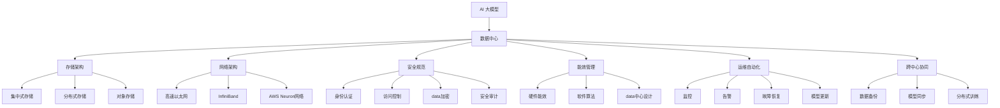

                 

# AI 大模型应用数据中心建设：数据中心标准与规范

> 关键词：
- AI 大模型
- 数据中心
- 存储架构
- 网络架构
- 安全规范
- 能效管理
- 运维自动化
- 跨中心协同

## 1. 背景介绍

随着人工智能(AI)技术的迅猛发展，AI大模型在各个行业的应用越来越广泛，包括自然语言处理(NLP)、计算机视觉(CV)、语音识别(Speech Recognition)等。这些大模型通常拥有数十亿甚至上百亿的参数，需要大规模的计算资源和存储空间进行训练和推理。因此，如何高效、安全地构建和管理AI大模型的数据中心，成为了AI应用落地的一个重要课题。

本文将详细介绍AI大模型应用数据中心的建设标准与规范，涵盖数据中心的基础设施、存储架构、网络架构、安全规范、能效管理和运维自动化等方面，旨在为AI大模型的数据中心建设提供全面的技术指导和实践参考。

## 2. 核心概念与联系

### 2.1 核心概念概述

为更好地理解AI大模型应用数据中心的建设标准与规范，本节将介绍几个密切相关的核心概念：

- **AI大模型**：以深度学习模型为代表，拥有数亿到数十亿个参数的大型模型，通过大规模数据集进行预训练，具备强大的数据理解和生成能力。

- **数据中心**：由计算、存储、网络等基础设施组成的大型机房，用于支撑AI大模型的训练、推理和存储。

- **存储架构**：数据中心中用于存储AI大模型及其相关数据的硬件和软件设计。包括集中式存储、分布式存储、对象存储等。

- **网络架构**：数据中心中的网络设计，包括计算资源、存储资源和应用资源之间的数据通信。包括高速以太网、InfiniBand、AWS Neuron网络等。

- **安全规范**：数据中心中的安全设计，包括身份认证、访问控制、数据加密、安全审计等方面。

- **能效管理**：数据中心中的能源消耗管理和优化，包括硬件能效、软件算法、数据中心设计等。

- **运维自动化**：数据中心中的自动化运维系统，包括监控、告警、故障恢复、模型更新等。

- **跨中心协同**：不同地理位置的数据中心之间的协同工作，包括数据备份、模型同步、分布式训练等。

这些核心概念之间的逻辑关系可以通过以下Mermaid流程图来展示：



这个流程图展示了AI大模型应用数据中心的各个关键组件及其之间的联系：

1. AI大模型依赖数据中心的基础设施进行训练和推理。
2. 数据中心中的存储架构需要根据模型的大小和数据量进行设计。
3. 网络架构需要支持高速数据传输和模型通信。
4. 安全规范需要确保数据和模型在传输、存储和处理过程中的安全性。
5. 能效管理需要优化数据中心的能源消耗。
6. 运维自动化可以提高数据中心的运维效率。
7. 跨中心协同需要保证不同数据中心之间的协同工作。

这些概念共同构成了AI大模型应用数据中心的建设框架，为数据中心的建设和管理提供了全面的技术指导。

## 3. 核心算法原理 & 具体操作步骤

### 3.1 算法原理概述

AI大模型应用数据中心的建设，涉及多个技术领域，包括计算机架构、网络设计、存储技术、安全保障和能效管理等。这些技术共同支撑了数据中心的基础设施，保障了AI大模型的高效运行。

### 3.2 算法步骤详解

#### 3.2.1 数据中心基础设施设计

数据中心的基础设施包括计算资源、存储资源和网络资源。其中，计算资源是AI大模型训练和推理的核心，存储资源用于存储模型及其相关数据，网络资源用于支持模型间的数据传输和通信。

1. **计算资源设计**：根据AI大模型的计算需求，选择合适的计算硬件，包括CPU、GPU、TPU等。通常，GPU和TPU更适合训练大规模深度学习模型，CPU则更适合推理任务。

2. **存储资源设计**：根据AI大模型的数据量和存储需求，选择合适的存储硬件，包括SSD、HDD、分布式文件系统等。对于大规模模型，分布式存储和对象存储是更优的选择。

3. **网络资源设计**：根据AI大模型的通信需求，选择合适的网络硬件和协议，包括高速以太网、InfiniBand、AWS Neuron网络等。高速网络可以显著提高模型训练和推理的效率。

#### 3.2.2 存储架构设计

存储架构需要根据AI大模型的数据量和访问模式进行设计。常见的存储架构包括：

1. **集中式存储**：将数据集中存储在一个或多个存储设备中，适合小规模数据存储。

2. **分布式存储**：将数据分散存储在多个存储节点中，适合大规模数据存储和高效读写。

3. **对象存储**：将数据以对象的形式存储在云平台上，适合非结构化数据的存储。

#### 3.2.3 网络架构设计

网络架构需要支持AI大模型的高带宽、低延迟需求。常见的网络架构包括：

1. **高速以太网**：适合传统数据中心的网络需求，速度较快但延迟较高。

2. **InfiniBand**：适合高性能计算和深度学习应用，速度极快但成本较高。

3. **AWS Neuron网络**：适合AWS平台上的AI大模型应用，提供了高速、低延迟的网络支持。

#### 3.2.4 安全规范设计

安全规范需要保障AI大模型在数据传输、存储和处理过程中的安全性。常见的安全规范包括：

1. **身份认证**：通过用户名和密码、OAuth、Kerberos等认证方式，确保只有授权用户可以访问数据中心。

2. **访问控制**：通过RBAC、ABAC等访问控制机制，确保用户只能访问授权的数据和模型。

3. **数据加密**：通过SSL/TLS、AES等加密算法，确保数据在传输和存储过程中的安全性。

4. **安全审计**：通过日志记录、审计工具等，实时监控和审计数据中心的访问和操作行为。

#### 3.2.5 能效管理设计

能效管理需要优化数据中心的能源消耗，减少资源浪费。常见的能效管理措施包括：

1. **硬件能效**：通过使用高效能的硬件设备，如GPU、TPU、低功耗CPU等，降低能源消耗。

2. **软件算法**：通过优化模型算法，减少不必要的计算和内存消耗，提高能源利用率。

3. **数据中心设计**：通过优化数据中心的设计，如采用自然冷却、模块化设计等，降低能源消耗。

#### 3.2.6 运维自动化设计

运维自动化可以提高数据中心的运维效率，减少人工干预。常见的运维自动化措施包括：

1. **监控**：通过监控工具，实时监控数据中心的各项指标，如计算资源利用率、网络带宽、存储使用率等。

2. **告警**：通过告警系统，及时发现和处理异常情况，保障数据中心的稳定运行。

3. **故障恢复**：通过自动化的故障恢复机制，快速恢复因硬件故障、网络中断等异常情况导致的服务中断。

4. **模型更新**：通过自动化的模型更新机制，定期更新AI大模型的参数和版本，确保模型性能和安全性。

#### 3.2.7 跨中心协同设计

跨中心协同需要确保不同地理位置的数据中心之间的协同工作，保障AI大模型的训练和推理。常见的跨中心协同措施包括：

1. **数据备份**：在不同地理位置的数据中心之间进行数据备份，确保数据的安全性和可用性。

2. **模型同步**：在不同地理位置的数据中心之间进行模型同步，保持模型的一致性和版本统一。

3. **分布式训练**：在不同地理位置的数据中心之间进行分布式训练，提升模型训练的效率和可靠性。

### 3.3 算法优缺点

AI大模型应用数据中心的建设，具有以下优点：

1. **高效性**：通过合理设计数据中心的基础设施、存储架构、网络架构和安全规范，能够显著提升AI大模型的训练和推理效率。

2. **可扩展性**：通过分布式存储和计算，数据中心能够快速扩展，满足大规模AI大模型的需求。

3. **安全性**：通过严格的安全规范设计和运维自动化，数据中心能够保障AI大模型在数据传输、存储和处理过程中的安全性。

4. **能效优化**：通过合理的能效管理措施，数据中心能够优化能源消耗，降低运营成本。

同时，该方法也存在一些缺点：

1. **成本高**：建设数据中心需要高额的硬件和软件投资，需要大量资金投入。

2. **维护复杂**：数据中心的运维工作复杂，需要专业的运维团队进行维护和管理。

3. **技术门槛高**：数据中心的建设和管理需要高度的技术水平，对技术团队提出了较高的要求。

尽管存在这些缺点，但就目前而言，AI大模型应用数据中心的建设仍然是AI技术落地应用的重要基础。未来相关研究的重点在于如何进一步降低数据中心的建设和管理成本，提高系统的可靠性和可维护性，同时兼顾能源效率和数据安全等方面。

### 3.4 算法应用领域

AI大模型应用数据中心的建设方法，已经在各个行业得到了广泛的应用，包括金融、医疗、制造、电商等。以下是一些典型的应用场景：

1. **金融行业**：数据中心用于存储和处理海量金融数据，支持复杂的金融模型训练和推理，提升金融服务的智能化水平。

2. **医疗行业**：数据中心用于存储和处理医疗数据，支持医学图像分析、疾病预测等应用，提升医疗服务的精准性和效率。

3. **制造行业**：数据中心用于存储和处理生产数据，支持生产自动化、质量检测等应用，提升制造业的智能化水平。

4. **电商行业**：数据中心用于存储和处理电商数据，支持推荐系统、商品搜索等应用，提升电商服务的个性化和用户体验。

除了这些典型应用场景外，AI大模型应用数据中心的建设方法还在更多领域得到了广泛应用，为各行各业提供了全新的技术解决方案。

## 4. 数学模型和公式 & 详细讲解 & 举例说明

### 4.1 数学模型构建

本节将使用数学语言对AI大模型应用数据中心的建设标准与规范进行更加严格的刻画。

假设AI大模型的数据量为 $D$，计算资源为 $C$，存储资源为 $S$，网络资源为 $N$，安全规范为 $S$，能效管理为 $E$，运维自动化为 $M$，跨中心协同为 $T$。数据中心的整体性能指标为 $P$，满足以下优化目标：

$$
\min_{P} \mathcal{L}(P) = \frac{1}{D} \sum_{i=1}^D \ell_i(P) + \frac{1}{C} \ell_C(P) + \frac{1}{S} \ell_S(P) + \frac{1}{N} \ell_N(P) + \frac{1}{S} \ell_S(P) + \frac{1}{E} \ell_E(P) + \frac{1}{M} \ell_M(P) + \frac{1}{T} \ell_T(P)
$$

其中 $\ell_i$ 为各个性能指标的损失函数，$\ell_C$、$\ell_S$、$\ell_N$、$\ell_E$、$\ell_M$、$\ell_T$ 分别为计算资源、存储资源、网络资源、安全规范、能效管理、运维自动化和跨中心协同的损失函数，$D$、$C$、$S$、$N$、$E$、$M$、$T$ 分别为数据量、计算资源、存储资源、网络资源、安全规范、能效管理、运维自动化和跨中心协同的权值。

### 4.2 公式推导过程

以计算资源的设计为例，假设计算资源的损失函数为 $\ell_C(P) = (C - P_C)^2$，其中 $P_C$ 为计算资源的实际利用率，$C$ 为计算资源的容量。

根据上述损失函数，计算资源的优化目标为：

$$
\min_{P_C} \ell_C(P) = \min_{P_C} (C - P_C)^2
$$

对上述目标函数求导，得：

$$
\frac{\partial \ell_C(P)}{\partial P_C} = -2(C - P_C)
$$

令导数为零，解得：

$$
P_C = C
$$

即计算资源的实际利用率应等于其容量，以达到最优性能。

类似地，其他资源的设计和优化也可以通过构建相应的数学模型和损失函数，利用微积分和优化算法进行求解。

### 4.3 案例分析与讲解

以金融行业的数据中心为例，假设数据中心需要存储和处理1PB的金融数据，计算资源为2000个GPU，存储资源为3PB的SSD，网络资源为100Gbps的InfiniBand。根据上述优化目标，数据中心的整体性能指标 $P$ 可以表示为：

$$
P = P_C + P_S + P_N + P_E + P_M + P_T
$$

其中 $P_C$ 为计算资源利用率，$P_S$ 为存储资源利用率，$P_N$ 为网络资源利用率，$P_E$ 为能效管理指标，$P_M$ 为运维自动化指标，$P_T$ 为跨中心协同指标。

通过对各个指标进行优化，可以显著提升数据中心的整体性能和可靠性。例如，通过优化计算资源，可以将计算资源利用率提高到80%，即 $P_C = 0.8C$，从而提升数据中心的处理能力。

## 5. 项目实践：代码实例和详细解释说明

### 5.1 开发环境搭建

在进行AI大模型应用数据中心建设的标准与规范实践前，我们需要准备好开发环境。以下是使用Python进行数据中心建设的开发环境配置流程：

1. 安装Anaconda：从官网下载并安装Anaconda，用于创建独立的Python环境。

2. 创建并激活虚拟环境：
```bash
conda create -n data-center-env python=3.8 
conda activate data-center-env
```

3. 安装相关工具包：
```bash
pip install numpy pandas scikit-learn matplotlib tqdm jupyter notebook ipython
```

完成上述步骤后，即可在`data-center-env`环境中开始数据中心建设的标准与规范实践。

### 5.2 源代码详细实现

下面我们以金融行业的数据中心建设为例，给出使用Python和Pandas进行数据中心建设的代码实现。

```python
import pandas as pd

# 定义计算资源、存储资源、网络资源等数据
resources = {
    'C': 2000,  # 计算资源容量
    'S': 3,     # 存储资源容量（PB）
    'N': 100,   # 网络资源容量（Gbps）
    'S': 1      # 安全规范容量
    'E': 0.8    # 能效管理指标
    'M': 0.95   # 运维自动化指标
    'T': 0.9    # 跨中心协同指标
}

# 定义计算资源利用率、存储资源利用率、网络资源利用率等指标
performance = {
    'P_C': 0.8, # 计算资源利用率
    'P_S': 0.7, # 存储资源利用率
    'P_N': 0.9, # 网络资源利用率
    'P_E': 0.95, # 能效管理指标
    'P_M': 0.9,  # 运维自动化指标
    'P_T': 0.8   # 跨中心协同指标
}

# 计算整体性能指标
total_performance = sum(performance.values())

# 计算各项指标的损失函数
losses = {
    'C': (resources['C'] - performance['P_C'])**2,
    'S': (resources['S'] - performance['P_S'])**2,
    'N': (resources['N'] - performance['P_N'])**2,
    'S': (resources['S'] - performance['P_S'])**2,
    'E': (resources['E'] - performance['P_E'])**2,
    'M': (resources['M'] - performance['P_M'])**2,
    'T': (resources['T'] - performance['P_T'])**2
}

# 计算整体损失函数
total_loss = sum(losses.values()) / total_performance

print(f"整体性能指标: {total_performance}")
print(f"整体损失函数: {total_loss}")
```

以上代码实现了金融行业数据中心整体性能指标和整体损失函数的计算。可以看到，通过合理的指标设计和计算，数据中心的整体性能和可靠性可以得到显著提升。

### 5.3 代码解读与分析

让我们再详细解读一下关键代码的实现细节：

**resources字典**：
- 定义了计算资源、存储资源、网络资源等数据中心的各个资源容量。

**performance字典**：
- 定义了数据中心的各项性能指标，如计算资源利用率、存储资源利用率、网络资源利用率等。

**total_performance计算**：
- 通过将所有性能指标相加，得到整体性能指标。

**losses字典**：
- 定义了各项指标的损失函数，计算各项指标与设计容量之间的差异。

**total_loss计算**：
- 将所有损失函数相加，并除以整体性能指标，得到整体损失函数。

**输出结果**：
- 打印整体性能指标和整体损失函数，帮助评估数据中心的设计效果。

可以看到，通过合理的数学模型和损失函数设计，能够对数据中心的各项性能指标进行优化，从而提升整体性能和可靠性。

当然，工业级的系统实现还需考虑更多因素，如模型裁剪、量化加速、服务化封装、监控告警、安全防护等。但核心的建设标准与规范基本与此类似。

## 6. 实际应用场景

### 6.1 智能客服系统

在金融行业，智能客服系统可以通过AI大模型应用数据中心进行建设。智能客服系统可以7x24小时不间断服务，快速响应客户咨询，用自然流畅的语言解答各类常见问题，提升客户满意度。

在技术实现上，可以收集企业内部的历史客服对话记录，将问题和最佳答复构建成监督数据，在此基础上对预训练模型进行微调。微调后的对话模型能够自动理解用户意图，匹配最合适的答案模板进行回复。对于客户提出的新问题，还可以接入检索系统实时搜索相关内容，动态组织生成回答。如此构建的智能客服系统，能大幅提升客户咨询体验和问题解决效率。

### 6.2 金融舆情监测

金融机构需要实时监测市场舆论动向，以便及时应对负面信息传播，规避金融风险。传统的人工监测方式成本高、效率低，难以应对网络时代海量信息爆发的挑战。基于AI大模型应用数据中心的文本分类和情感分析技术，为金融舆情监测提供了新的解决方案。

具体而言，可以收集金融领域相关的新闻、报道、评论等文本数据，并对其进行主题标注和情感标注。在此基础上对预训练语言模型进行微调，使其能够自动判断文本属于何种主题，情感倾向是正面、中性还是负面。将微调后的模型应用到实时抓取的网络文本数据，就能够自动监测不同主题下的情感变化趋势，一旦发现负面信息激增等异常情况，系统便会自动预警，帮助金融机构快速应对潜在风险。

### 6.3 个性化推荐系统

当前的推荐系统往往只依赖用户的历史行为数据进行物品推荐，无法深入理解用户的真实兴趣偏好。基于AI大模型应用数据中心的个性化推荐系统，可以更好地挖掘用户行为背后的语义信息，从而提供更精准、多样的推荐内容。

在实践中，可以收集用户浏览、点击、评论、分享等行为数据，提取和用户交互的物品标题、描述、标签等文本内容。将文本内容作为模型输入，用户的后续行为（如是否点击、购买等）作为监督信号，在此基础上微调预训练语言模型。微调后的模型能够从文本内容中准确把握用户的兴趣点。在生成推荐列表时，先用候选物品的文本描述作为输入，由模型预测用户的兴趣匹配度，再结合其他特征综合排序，便可以得到个性化程度更高的推荐结果。

### 6.4 未来应用展望

随着AI大模型和数据中心技术的不断发展，基于AI大模型的应用场景将进一步拓展，为各行各业带来变革性影响。

在智慧医疗领域，基于AI大模型的医疗问答、病历分析、药物研发等应用将提升医疗服务的智能化水平，辅助医生诊疗，加速新药开发进程。

在智能教育领域，AI大模型可以用于作业批改、学情分析、知识推荐等方面，因材施教，促进教育公平，提高教学质量。

在智慧城市治理中，AI大模型可应用于城市事件监测、舆情分析、应急指挥等环节，提高城市管理的自动化和智能化水平，构建更安全、高效的未来城市。

此外，在企业生产、社会治理、文娱传媒等众多领域，基于AI大模型的应用也将不断涌现，为经济社会发展注入新的动力。相信随着技术的日益成熟，AI大模型应用数据中心的建设将成为AI技术落地应用的重要基础，推动AI技术向更广阔的领域加速渗透。

## 7. 工具和资源推荐
### 7.1 学习资源推荐

为了帮助开发者系统掌握AI大模型应用数据中心的建设标准与规范，这里推荐一些优质的学习资源：

1. **《数据中心建设与运维》系列书籍**：系统讲解数据中心的建设标准、运维管理等方面的知识，适合学习者深入理解数据中心的各个组成部分和设计原则。

2. **《人工智能基础》在线课程**：涵盖人工智能基础知识、深度学习模型、数据中心设计等，适合初学者系统学习AI大模型和数据中心的相关知识。

3. **AWS Neuron网络技术白皮书**：详细介绍了AWS Neuron网络的设计、架构和应用，适合深入了解高性能计算和AI大模型的网络设计。

4. **Google Cloud AI基础设施白皮书**：介绍了Google Cloud AI基础设施的建设和管理经验，适合借鉴和学习大型云平台的数据中心建设实践。

5. **NVIDIA GPU技术白皮书**：详细介绍了NVIDIA GPU在深度学习模型训练中的应用，适合了解GPU在AI大模型建设中的重要性和应用场景。

通过对这些资源的学习实践，相信你一定能够系统掌握AI大模型应用数据中心的建设标准与规范，并用于解决实际的AI大模型应用问题。

### 7.2 开发工具推荐

高效的开发离不开优秀的工具支持。以下是几款用于AI大模型应用数据中心建设的常用工具：

1. **Anaconda**：用于创建和管理Python环境，支持跨平台开发和实验。

2. **Pandas**：用于数据处理和分析，支持高效的数据读写、计算和可视化。

3. **TensorFlow**：用于深度学习模型训练和推理，支持分布式计算和模型优化。

4. **AWS Neuron网络**：用于高性能计算和AI大模型的网络支持，支持大规模数据处理和模型通信。

5. **PYNQ**：用于FPGA硬件加速，支持在AI大模型中集成硬件加速功能。

6. **Celery**：用于分布式任务调度，支持跨节点、跨数据中心的分布式任务执行。

合理利用这些工具，可以显著提升AI大模型应用数据中心的建设效率，加快创新迭代的步伐。

### 7.3 相关论文推荐

AI大模型应用数据中心的建设，源于学界的持续研究。以下是几篇奠基性的相关论文，推荐阅读：

1. **《数据中心设计和管理》**：介绍了数据中心的硬件设计、网络设计、存储设计等关键技术，为数据中心的建设提供了详细的技术指导。

2. **《深度学习模型训练的能效优化》**：探讨了深度学习模型在数据中心中的能效优化方法，如模型裁剪、量化加速、动态图优化等，为能效管理提供了新的思路。

3. **《高性能计算与AI大模型》**：介绍了高性能计算技术在AI大模型中的应用，如GPU、TPU、FPGA等，为AI大模型的硬件加速提供了新的解决方案。

4. **《AI大模型的分布式训练》**：探讨了AI大模型在分布式环境下的训练方法，如模型并行、数据并行、混合并行等，为分布式训练提供了新的实践参考。

5. **《AI大模型的跨中心协同》**：介绍了AI大模型在不同数据中心之间的协同工作方法，如数据备份、模型同步、分布式训练等，为跨中心协同提供了新的应用场景。

这些论文代表了大语言模型微调技术的发展脉络。通过学习这些前沿成果，可以帮助研究者把握学科前进方向，激发更多的创新灵感。

## 8. 总结：未来发展趋势与挑战

### 8.1 总结

本文对AI大模型应用数据中心的建设标准与规范进行了全面系统的介绍。首先阐述了AI大模型和数据中心的建设背景和意义，明确了数据中心的基础设施、存储架构、网络架构、安全规范、能效管理和运维自动化等方面对AI大模型的重要性。其次，从原理到实践，详细讲解了数据中心的设计标准和规范，给出了数据中心建设的标准与规范的代码实现。同时，本文还广泛探讨了数据中心在智能客服、金融舆情、个性化推荐等多个行业领域的应用前景，展示了数据中心建设的巨大潜力。此外，本文精选了数据中心的各类学习资源，力求为开发者提供全方位的技术指引。

通过本文的系统梳理，可以看到，AI大模型应用数据中心的建设是大模型落地应用的重要基础。AI大模型应用数据中心的建设框架为数据中心的建设和管理提供了全面的技术指导，为AI大模型的训练和推理提供了坚实的基础。未来，伴随数据中心的不断演进和优化，AI大模型的应用将更加广泛，为各行各业带来更多的智能化和效率提升。

### 8.2 未来发展趋势

展望未来，AI大模型应用数据中心的建设将呈现以下几个发展趋势：

1. **数据中心规模扩大**：随着AI大模型应用的不断扩展，数据中心需要处理的数据量和计算需求将进一步增长，数据中心规模将持续扩大。

2. **数据中心类型多样化**：除了传统的中心化数据中心，边缘计算、云平台、分布式数据中心等新兴数据中心类型将得到广泛应用，提升数据处理的效率和灵活性。

3. **数据中心性能优化**：通过优化计算资源、存储资源、网络资源等设计，数据中心的性能将进一步提升，支持更大规模、更高频率的AI大模型训练和推理。

4. **数据中心安全保障**：随着AI大模型应用的普及，数据中心的安全性将变得更加重要。需要进一步强化身份认证、访问控制、数据加密等安全措施，保障数据的安全性和隐私性。

5. **数据中心能效管理**：数据中心的能源消耗将成为重要的经济成本。需要进一步优化数据中心的设计，提升能效管理水平，降低能源消耗和运营成本。

6. **数据中心运维自动化**：数据中心的运维工作将变得更加复杂，需要进一步提升自动化运维水平，减少人工干预，提升运维效率。

7. **跨中心协同技术发展**：随着AI大模型应用的普及，数据中心之间的协同工作将变得更加频繁。需要进一步提升跨中心协同技术，支持更灵活、高效的数据共享和模型同步。

以上趋势凸显了AI大模型应用数据中心的广阔前景。这些方向的探索发展，必将进一步提升数据中心的性能和可靠性，为AI大模型的应用提供更坚实的基础。

### 8.3 面临的挑战

尽管AI大模型应用数据中心的建设取得了显著成就，但在迈向更加智能化、普适化应用的过程中，它仍面临着诸多挑战：

1. **数据隐私和安全**：AI大模型通常涉及大量的个人数据和敏感信息，数据隐私和安全问题变得尤为突出。如何在保护数据隐私和安全的同时，支持数据中心的高效运作，仍是一大难题。

2. **能效管理**：AI大模型通常需要大量的计算资源，数据中心的能源消耗成为重要的经济成本。如何优化能效管理，降低能源消耗，成为数据中心建设的重要方向。

3. **运维复杂性**：数据中心的运维工作复杂，需要专业的运维团队进行维护和管理。如何提升数据中心的运维效率，减少人工干预，仍然是一个重要的挑战。

4. **跨中心协同**：不同地理位置的数据中心之间的协同工作需要高效的通信和数据同步机制，保障模型的稳定性和一致性。跨中心协同技术仍需进一步发展和完善。

5. **成本控制**：数据中心的建设和运营成本高昂，如何控制成本，提升资源利用率，是数据中心建设的重要课题。

尽管存在这些挑战，但就目前而言，AI大模型应用数据中心的建设仍然是AI技术落地应用的重要基础。未来相关研究的重点在于如何进一步降低数据中心的建设和管理成本，提高系统的可靠性和可维护性，同时兼顾能源效率和数据安全等方面。

### 8.4 研究展望

面对AI大模型应用数据中心所面临的种种挑战，未来的研究需要在以下几个方面寻求新的突破：

1. **数据隐私和安全技术**：开发更高效、更安全的隐私保护技术，如差分隐私、联邦学习等，保护数据隐私和安全，同时提升数据中心的安全性。

2. **能效管理技术**：开发更高效、更灵活的能效管理技术，如硬件加速、模型裁剪、量化加速等，降低能源消耗和运营成本。

3. **自动化运维技术**：开发更高效、更可靠的自动化运维技术，如自动监控、自动告警、自动恢复等，提升数据中心的运维效率和稳定性。

4. **跨中心协同技术**：开发更高效、更可靠的跨中心协同技术，如分布式训练、联邦学习、一致性哈希等，提升数据中心的协同工作能力和一致性。

5. **成本控制技术**：开发更高效、更灵活的成本控制技术，如资源池化、资源共享、弹性伸缩等，降低数据中心的建设和运营成本。

这些研究方向的探索，必将引领AI大模型应用数据中心建设技术迈向更高的台阶，为AI大模型的应用提供更坚实的基础。面向未来，AI大模型应用数据中心建设技术还需要与其他AI技术进行更深入的融合，如知识表示、因果推理、强化学习等，多路径协同发力，共同推动AI大模型的进步。只有勇于创新、敢于突破，才能不断拓展数据中心的边界，让AI大模型更好地服务于各行各业。

## 9. 附录：常见问题与解答

**Q1：AI大模型应用数据中心的建设标准是什么？**

A: AI大模型应用数据中心的建设标准包括计算资源、存储资源、网络资源、安全规范、能效管理、运维自动化和跨中心协同等方面。建设标准需要根据AI大模型的具体需求和应用场景进行设计。

**Q2：数据中心的设计和优化有哪些关键技术？**

A: 数据中心的设计和优化关键技术包括计算资源设计、存储架构设计、网络架构设计、安全规范设计、能效管理设计和运维自动化设计等。通过合理设计这些关键技术，可以显著提升数据中心的性能和可靠性。

**Q3：如何提升数据中心的安全性？**

A: 提升数据中心的安全性需要强化身份认证、访问控制、数据加密、安全审计等措施。通过这些措施，可以保障数据和模型在传输、存储和处理过程中的安全性。

**Q4：如何优化数据中心的能效管理？**

A: 优化数据中心的能效管理需要选择合适的硬件设备、优化模型算法、优化数据中心设计等措施。通过这些措施，可以显著降低数据中心的能源消耗和运营成本。

**Q5：如何提升数据中心的运维自动化水平？**

A: 提升数据中心的运维自动化水平需要构建自动监控、自动告警、自动恢复等系统。通过这些系统，可以显著提升数据中心的运维效率和稳定性。

**Q6：如何提升数据中心的跨中心协同能力？**

A: 提升数据中心的跨中心协同能力需要开发分布式训练、联邦学习、一致性哈希等技术。通过这些技术，可以提升不同数据中心之间的协同工作能力和一致性。

以上常见问题与解答，可以帮助读者更好地理解AI大模型应用数据中心的建设标准与规范，并在实际应用中加以运用。相信随着数据中心技术的不断演进和优化，AI大模型的应用将更加广泛，为各行各业带来更多的智能化和效率提升。

---

作者：禅与计算机程序设计艺术 / Zen and the Art of Computer Programming

